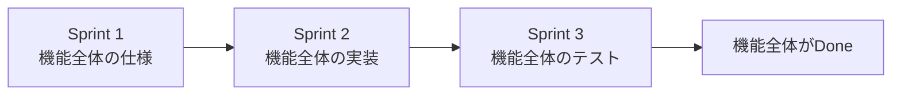
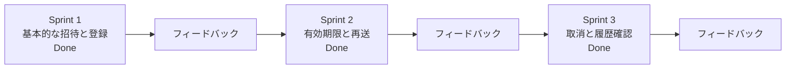
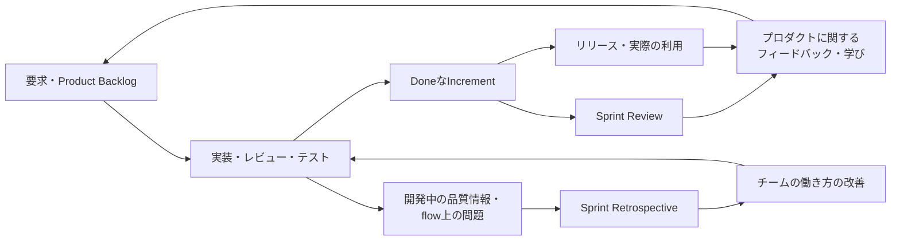

## 4. 短いフィードバックループの中で品質を扱う <!-- omit in toc -->

- [4.1 品質を最後にまとめて確認すると、フィードバックが遅れる](#41-品質を最後にまとめて確認するとフィードバックが遅れる)
- [4.2 Shift Left: 品質フィードバックを早い位置へ組み込む](#42-shift-left-品質フィードバックを早い位置へ組み込む)
- [4.3 Definition of Done: 品質基準を完成の条件へ組み込む](#43-definition-of-done-品質基準を完成の条件へ組み込む)
- [4.4 Sprint中に小さくレビュー・テスト・修正を回す](#44-sprint中に小さくレビューテスト修正を回す)
- [4.5 品質活動の滞留を可視化し、Doneへのflowを守る](#45-品質活動の滞留を可視化しdoneへのflowを守る)
- [4.6 品質情報をプロダクトとチームの改善へ戻す](#46-品質情報をプロダクトとチームの改善へ戻す)
- [4.7 4章のまとめ: 品質をチームの継続的な活動にする](#47-4章のまとめ-品質をチームの継続的な活動にする)
  - [Key Takeaways](#key-takeaways)

この章では、3章で確認したProduct Backlog、Sprint、Sprint Review、Sprint Retrospective、リリース後フィードバックの循環に品質活動を組み込み、品質に関するフィードバックを短いループで得て、次の改善へ戻す考え方を整理する。

アジャイル開発における品質活動は、実装が終わった後にQAがまとめて検査する工程ではない。要求、具体例、受け入れ条件を早い段階から検討し、品質リスクや未決定事項を見える化する。さらに、完成と判断するための品質基準を共有し、Sprint中に実装、レビュー、テスト、修正を小さく繰り返しながら、品質活動の滞留を早めに見つけ、解消していく必要がある。そこで得られた情報は、プロダクトとチームの次の改善へ戻していく。

本章では、QAの職務内容や個別のテスト技法を詳しく説明するのではなく、Product側、開発者、QAなどがそれぞれの観点を持ち寄り、短いフィードバックループの中で品質を継続的に扱うための基本的な考え方に焦点を置く。

---

### 4.1 品質を最後にまとめて確認すると、フィードバックが遅れる

Sprintを短い期間に区切っていても、それだけで短いフィードバックループが作られるとは限らない。

たとえば、Sprint Backlogに含まれる複数のProduct Backlog itemを前半にまとめて実装し、一通りの実装が終わってからコードレビューやテストを始めるとする。そこで問題が見つかった場合、残された短い時間の中で、原因の確認、修正、再レビュー、再テスト、リリース準備まで進めなければならない。

その結果、テストで問題を発見しても十分に修正・再確認する時間がなくなり、Product Backlog itemがDoneにならないままSprintを終える可能性が高くなる。未完了の作業はProduct Backlogへ戻し、今後の扱いを改めて検討しなければならない。

また、テストを担当する人へ作業が届くまで品質上のフィードバックが得られないため、要求の解釈違い、設計上の問題、実装の影響範囲などを発見する時点も遅くなる。

Scrum Guideでは、Sprint中に品質を低下させないことが求められている。また、新しいIncrementは、それまでに作られたIncrementと統合され、プロダクト全体として正しく動作することが確認され、利用可能な状態でなければならない。Definition of Doneを満たしていない作業は、完成したIncrementの一部として扱われない。

したがって、実装が終わったことと、Product Backlog itemがDoneになったことは同じではない。コードレビュー、テスト、必要な修正や再確認が残っているのであれば、その作業はまだ完成していない。

Sprintの中で、要求確認、設計、実装、レビュー、テストを職種や期間ごとの工程に分け、順番にhandoff(引き渡し)していくと、短い期間の中にWaterfall型の工程分断を再現することになる。このような状態は、実務上、mini-waterfallやScrummerfallなどと表現されることがある。

これらはScrum Guideで定義された公式用語ではなく、Sprint内部で工程別の引き渡しと待ち時間が生じているアンチパターンを説明するための補助的な表現である。

Agile Allianceで公開されたMicrosoftのBing Voice Search開発に関する経験レポートでも、Sprint内のmini-waterfallを避けるため、設計、PM、開発、テストが前工程の完了を順番に待つ直列的な流れにしないよう、storyやwork itemを構成した事例が報告されている。この事例では、特定の職種が前工程の完了を待つのではなく、開発サイクルを通して各職種が継続的に活動できるようにすることが重視された。

ただし、Scrum、Kanban、Hybridなど、採用している方法の名称だけを見ても、品質活動が実際にどのように行われているかは分からない。

HELENAの国際調査を分析した研究では、実務上の開発プロセスは、単一の方法をそのまま適用するよりも、複数の方法やプラクティスを組み合わせる形で構成されることが多いと報告されている。その分析では、Code Review、Coding Standards、Release Planningなどが、複数の方法や組み合わせに見られる具体的なプラクティスとして示されている。

この研究は、品質プラクティスを早い段階へ移すことで、手戻りや開発期間がどの程度減少するかを直接検証したものではない。本章では、方法の名称だけで開発の実態を判断せず、どのようなプラクティスが実際に組み込まれているかを見るための補助資料として参照する。

重要なのは、採用している方法の名称ではなく、要求確認、コードレビュー、テスト、自動確認、品質基準の共有が、開発のどの段階で行われ、どれだけ早くフィードバックを得られるかを見ることである。

品質をSprintの最後にまとめて検査すると、要求の解釈違いや品質上の問題が設計や実装へ作り込まれた後に、初めてフィードバックを得ることになりやすい。これに対して、問題が作り込まれる前や、影響が広い範囲へ及ぶ前にフィードバックを得られるようにすれば、修正や再確認をより短いループで扱いやすくなる。

次節では、このようにテストや品質保証の活動を開発プロセスの早い位置へ組み込む考え方として、Shift Leftを整理する。

---

### 4.2 Shift Left: 品質フィードバックを早い位置へ組み込む

4.1で確認したように、テストや品質確認をSprintの終盤にまとめると、問題を発見した時点では、要求、設計、実装、統合まで作業が進んでいる可能性がある。その場合、原因をたどって修正し、再び確認するまでの手戻りも長くなりやすい。

このようなフィードバックの遅れを避ける考え方の一つが、Shift Leftである。

Shift Leftは、テストや品質保証の活動を実装完了後の独立した工程に置くのではなく、要求や仕様、設計の検討段階から実装中まで、開発活動の早い位置へ継続的に組み込む考え方である。ここでいうLeftは、開発工程を左から右へ並べたときの早い段階を表している。

ただし、Shift Leftは、QA担当者がテスト実行を数日早く始めることだけを意味しない。

テストには、動作するソフトウェアを実行して結果を確認する動的テストだけでなく、ソフトウェアを実行せずに要求、仕様、設計、コードなどを確認する静的テストも含まれる。要求や仕様をテスト・品質の観点からレビューすることで、曖昧さ、不足、矛盾、確認方法が定まっていない箇所を、実装前から見つけることができる。テストケースを実装前に検討すること、静的解析を早い段階で行うこと、自動テストによって変更時のフィードバックを早く得ることも、Shift Leftを支える実践である。

一方で、Shift Leftは、統合後やシステム全体で必要となるテスト、受け入れ確認など、後の段階でしか行えない確認をなくす考え方ではない。また、探索的テストも後の段階だけに限定せず、確認可能な部分ができた段階から必要に応じて行い、実装の進行に応じて新しく現れるリスクを調べていく。

コンポーネントを組み合わせたときの振る舞い、完成したシステムの利用体験、実際の利用状況に近い環境でなければ確認できない品質もある。

したがって、Shift Leftの目的は、後のテストをすべて前へ移すことではない。早い段階で確認できる問題は早く扱い、統合後やシステム全体でなければ確認できない問題には、その段階に適したテストを行うことである。

また、品質に関する責任をQAだけへ集めることも意味しない。テストや品質保証の観点を早い段階へ持ち込む一方で、Product側、開発者、QAなどが、それぞれの専門的な観点を持ち寄って品質を作り込む必要がある。

#### Refinementで重要な曖昧さを早めに見つける <!-- omit in toc -->

Product Backlog Refinementでは、Product Backlog itemをより小さく具体的な項目へ分解し、説明、順序、規模などの詳細を加えていく。

品質の観点からは、機能の概要だけでなく、目的、ユーザー価値、具体例、受け入れ条件、未決定事項、依存関係、品質リスクなどを確認する。

たとえば、「管理者がユーザーを招待できる」という要求だけでは、次のような点が分からない可能性がある。

- どの権限を持つ管理者が招待できるのか
- すでに登録済みのメールアドレスを指定した場合はどうなるのか
- 同じユーザーを重複して招待した場合はどうなるのか
- 招待リンクには有効期限があるのか
- 招待されたユーザーには、最初からどの権限が付与されるのか
- 招待の成功や失敗を、ユーザーや管理者がどのように確認できるのか

このような点を実装後のテストで初めて確認すると、Product側への確認、受け入れ条件の修正、設計の変更、実装の修正、再テストが必要になることがある。

Refinementの段階で具体例や質問として表に出せば、チームは、何を実装し、何を確認すればよいかについて、より早く共通理解を作ることができる。

ただし、Refinementの目的は、将来の仕様やすべての例外を事前に決め切ることではない。次に取り組む可能性の高いProduct Backlog itemについて、チームが判断、実装、確認できる状態へ近づけることである。

不確実性を完全になくすのではなく、重要な曖昧さや未決定事項を早めに見つけ、必要なものは決定し、残るものは小さな単位で検証できるようにする。

Sprint Planningでは、選択したProduct Backlog itemについて、Sprint Goalの達成とDefinition of Doneを満たすために必要な作業を計画する。

この段階では、実装作業だけでなく、必要なレビュー、テスト、テストデータ、確認環境、外部サービスとの連携、自動化の対象なども考慮する。Definition of DoneをSprint Planningのたびに項目ごとに作り直すのではなく、既存のDefinition of Doneを満たすために何が必要かを、Sprint Backlogの計画へ反映する。

#### 職種横断の対話で確認可能性を高める <!-- omit in toc -->

要求や受け入れ条件を具体化するときには、一つの職種だけで判断するのではなく、異なる観点を持つ人が対話することが重要になる。

その代表的な実践の一つが、Three Amigosである。

Three Amigosでは、一般に次のような三つの観点を持ち寄る。

| 観点 | 主に確認すること |
| --- | --- |
| Product / Business | 何を実現したいのか、誰にどのような価値を届けるのか、どこまでを対象とするのか |
| Development | どのように実装するのか、技術的な制約や依存関係は何か |
| Testing / Quality | どのように正しさを確認するのか、どのような例外や品質リスクがあるのか |

Three Amigosという名称であっても、必ず3人だけで行うものではない。また、Scrum Guideで定義された正式なScrum Eventでもない。重要なのは人数や会議名ではなく、Product、Development、Testing / Qualityの観点を持つ人が、実装前から具体例や疑問を共有することである。

QAがチームに参加している場合、QAは実装完了後のテスト実行だけを担当するのではなく、Product Backlog Refinementや仕様検討の段階から、このような対話へ参加できる。

QAは、たとえば次の観点から質問や提案を行う。

- 受け入れ条件が具体的で、結果を確認できる形になっているか
- 正常系だけでなく、異常系や境界条件が考慮されているか
- 権限ごとの振る舞いが明確になっているか
- 状態遷移の前後で許可される操作が定まっているか
- データの作成、更新、削除による影響が考慮されているか
- 外部サービスや既存機能との依存関係があるか
- 期待結果は明確か
- 結果を観測・確認するための方法があるか
- どの品質リスクを、どの段階で確認する必要があるか

ここでQAが要求、受け入れ条件、Definition of Doneを単独で決定するわけではない。

Product側は目的、価値、業務条件、対象範囲について判断する。開発者は、実装可能性、技術的制約、設計、依存関係を確認する。QAは、テスト可能性、確認可能性、品質リスクの観点から、見落とされている条件や質問を提示する。

それぞれの観点を持ち寄ることで、要求を受け取ってから職種ごとに順番に判断するのではなく、実装前から共通理解を作ることができる。

#### 早期フィードバックと手戻りループ <!-- omit in toc -->

Shift Leftを、単に作業時期を前へずらすこととして捉えるだけでは不十分である。重要なのは、問題を発見したときに、どこまで戻って修正しなければならないかである。

たとえば、受け入れ確認の段階で要求の解釈違いが見つかった場合、要求や受け入れ条件を見直すだけでなく、設計、実装、コードレビュー、テスト、統合をやり直す必要が生じる可能性がある。

一方、同じ解釈違いをRefinement中の具体例や質問によって発見できれば、設計や実装へ進む前に、要求や受け入れ条件を見直すだけで対応できる可能性がある。

実装中の問題であっても、静的解析、コードレビュー、Unit Testなどによって変更直後に発見できれば、システムテストや受け入れ確認まで進んでから発見する場合よりも影響範囲を特定しやすく、修正後に再確認する範囲も絞りやすい。

ただし、早い段階で品質活動を行うことは、作業そのものをなくすことではない。要求のレビュー、具体例の検討、テスト設計、自動化、確認環境の整備など、早い段階で行う検討や準備は増える場合がある。

それでも、後から広い範囲を修正するよりも、問題が作り込まれる場所に近い位置で発見し、短いループで扱える状態を作ることに意味がある。

この関係を、開発プロセス上の分岐や手戻りとしてモデル化した研究もある。

2025年に公開されたGERT(Generalized Evaluation and Review Technique:一般化評価・レビュー技法)を用いた研究では、要求整理、設計、実装、品質確認、受け入れなどの工程と、レビュー、統合、受け入れからの手戻りを、確率的なネットワークとしてモデル化している。

この研究では、要求の構造化を支援するAI Requirements Assistantと、AIで拡張された静的解析・品質ゲートを開発プロセスの早い位置へ配置したシナリオが設定された。モデル上では、AIを利用しないシナリオと比べて、レビュー、統合、受け入れからの手戻りが減り、開発期間分布の右側の裾、すなわち完了までに長い時間がかかる可能性が縮小する結果が示された。

ただし、これは実際の複数プロジェクトを比較したものではなく、研究用に構成された一つの合成的な工程モデルを、開発工程の記録に似せた統計値で調整して行った比較である。一般的なプロジェクトで同じ効果量が得られることを示すものではない。

本章ではこの研究を、AI導入やShift Leftの一般的な効果量を示す根拠ではなく、品質確認を行う位置によって手戻りループが変わり得ることを考えるための補助例として参照する。

Shift Leftで重要なのは、すべての問題を事前に予測することではない。テストや品質保証の観点を早い段階から開発活動へ組み込み、重要な曖昧さや品質リスクを早めに見つけ、問題が広い範囲へ影響する前にフィードバックを得られるようにすることである。

一方、早期の対話やテストだけでは、Product Backlog itemがどの状態になれば完成したと判断できるかは決まらない。次節では、レビューやテストなどの品質活動を完成条件へ組み込むDefinition of Doneについて整理する。

---

### 4.3 Definition of Done: 品質基準を完成の条件へ組み込む

4.2では、要求や受け入れ条件を早い段階から検討し、重要な曖昧さや品質リスクを見つける考え方を確認した。

しかし、早期に対話やテスト設計を行うだけでは、Product Backlog itemがどの状態になれば完成したと判断できるかは決まらない。実装、レビュー、テスト、文書更新などのうち、どこまで完了すればIncrementの一部として扱えるのかについて、共通の基準が必要になる。

Scrumで、この完成状態を示す基準がDoD(Definition of Done:完了の定義)である。

Scrum Guideでは、DoDを、プロダクトに必要な品質基準を満たしたときのIncrementの状態を正式に記述したものとして定義している。簡単に言えば、何を満たせばIncrementを完成したと判断できるかについて、Scrum Teamとステークホルダーが共通理解を持つための基準である。

DoDは、単にコーディングや実装が終わった状態を意味しない。

たとえば、チームのDoDには、次のような条件が含まれる場合がある。

- 必要なコードレビューが完了している
- 必要なUnit TestやIntegration Testが実行され、定めた結果を満たしている
- 静的解析やそのほかの自動チェックが、定められた基準を満たしている
- 既存機能との統合が確認されている
- 必要なドキュメントが更新されている
- セキュリティ、性能、アクセシビリティなど、プロダクトに必要な品質確認が完了している
- 利用可能な状態になっている

これらはDoDへ必ず含めなければならない固定項目ではない。プロダクトの特性、品質リスク、組織の基準、利用している技術などに応じて、必要な品質基準は異なる。

一方で、必要なレビューやテストが終わっていないにもかかわらず、「実装は終わった」として作業を完成扱いにすると、実装完了と品質確認完了の間に分断が生じる。

たとえば、開発者は実装済みと考えていても、コードレビュー、テスト、修正、再確認が残っているなら、その作業はDoDを満たしていない。したがって、完成したIncrementの一部としては扱えない。

Scrum Guideでは、Product Backlog itemがDoDを満たした時点でIncrementが生まれるとしている。DoDを満たしていないProduct Backlog itemは、リリースすることも、完成した作業としてSprint Reviewで提示することもできず、今後の検討のためにProduct Backlogへ戻される。

このため、DoDはSprint終盤にQAが最終承認を行うためのチェックリストではない。

Scrumでは、DevelopersがDoDを満たすIncrementを作り、品質を作り込む責任を持つ。QAがチームに参加している場合、QAは品質リスク、テスト可能性、必要な確認などの観点から、DoDの作成や見直しへ貢献できる。ただし、DoDをQAだけが決定したり、QAだけが満たす責任を持ったりするものではない。

DoDを共有することで、次のような状態を減らしやすくなる。

- 開発者にとっては完了しているが、QAの確認は残っている
- 自動テストは通っているが、必要なレビューが行われていない
- 機能は動作するが、既存機能との統合が確認されていない
- Sprint Reviewには提示されたが、実際には利用可能な状態ではない
- 作業ごとに、レビューやテストをどこまで行えば完成なのかが異なっている

#### 受け入れ条件とDefinition of Doneの違い <!-- omit in toc -->

受け入れ条件とDoDは、どちらも完成判断に関係するが、対象と役割が異なる。

| 観点 | 受け入れ条件 | Definition of Done |
| --- | --- | --- |
| 主な対象 | 個別のProduct Backlog item | Increment |
| 主な目的 | 個別の要求や振る舞いが満たされたかを確認する | プロダクトに必要な共通の品質基準を満たしたかを確認する |
| 確認する問い | この機能は意図したとおりに動くか | このIncrementは、プロダクトに必要な共通の品質基準を満たしているか |
| 例 | 管理者だけがユーザーを招待できる、期限切れの招待リンクは使用できない | コードレビュー完了、自動テスト合格、統合確認完了、必要な文書更新 |
| 適用範囲 | 項目ごとに異なる | 同じプロダクトのすべてのIncrementへ共通して適用する |

受け入れ条件はScrum Guideで定義された正式なScrumの要素ではないが、Product Backlog itemに固有の要求や期待する振る舞いを具体化するために広く使われる補完的な実践である。

たとえば、「管理者がユーザーを招待できる」というProduct Backlog itemでは、次のような条件を受け入れ条件として定めることができる。

- 管理者権限を持つユーザーだけが招待できる
- 登録済みのメールアドレスを指定した場合はエラーになる
- 招待リンクには有効期限がある
- 招待が成功したことを管理者が確認できる

これらは、そのProduct Backlog item固有の要求である。

一方、コードレビューが完了していること、自動テストが成功していること、既存機能との統合が確認されていることなどは、ほかのProduct Backlog itemにも共通して求める品質基準としてDoDへ含めることができる。

個別の受け入れ条件を満たしていても、必要なレビューやテストが残っていてDoDを満たしていなければ、Incrementとして完成したとは判断できない。逆に、DoDに含まれる共通の品質確認だけを終えても、Product Backlog itemが固有の要求や受け入れ条件を満たしているかを確認しなければ、期待する価値を実現できているとは限らない。

したがって、受け入れ条件とDoDのどちらか一方だけを使うのではなく、個別の要求と共通の品質基準を区別しながら、両方を完成判断へ結びつける必要がある。

#### DoDをSprintの作業へ組み込む <!-- omit in toc -->

DoDは文書として定義するだけでは機能しない。Sprint内で実際に満たせるよう、必要な作業をSprint Backlogの計画へ組み込む必要がある。

Sprint Planningでは、選択したProduct Backlog itemについて、DevelopersがDoDを満たすIncrementを作るために必要な作業を計画する。

たとえば、DoDにコードレビュー、自動テスト、統合確認、文書更新が含まれるなら、それらは実装が終わった後に余裕があれば行う追加作業ではない。Product Backlog itemをDoneにするために必要な作業として、最初から計画へ含める。

また、DoDを満たせないほどProduct Backlog itemが大きい場合は、Sprint内で完成できる単位へ分割する必要がある。

たとえば、一つの大きな機能について実装だけをSprint内で終え、テストや統合を次のSprintへ送るのではなく、利用可能な小さな機能単位へ分け、それぞれをDoDまで進める。これにより、「実装中」の作業を増やすのではなく、完成したIncrementを小さく積み重ねやすくなる。

DoDを厳しく書くだけでは、品質は向上しない。

たとえば、自動テストの実行に長い時間がかかる、確認環境を準備できない、テストデータを用意できない、レビューできる人が限られているといった状態では、DoDをSprint内で満たすことが難しくなる。

その場合は、次のような改善も必要になる。

- Product Backlog itemを小さく分割する
- テストを自動化する
- 自動テストの実行時間を短縮する
- テスト環境やテストデータを用意しやすくする
- コードをレビューしやすい変更単位にする
- 品質確認に必要な知識をチーム内で共有する
- テスト容易性を高めるよう設計や実装を改善する

DoDは、単に理想的な条件を並べるだけの文書ではなく、プロダクトに必要な品質をSprintごとに継続して満たすための実効的な基準である。そのため、DoDを満たせない状態が続く場合は、必要な品質基準を安易に下げるのではなく、作業の分割、技術基盤、開発flow、チームの能力を改善する必要がある。

Scrum Guideでは、組織にDoDの標準がある場合、すべてのScrum Teamがそれを最低限の基準として守る必要がある。組織標準がない場合は、Scrum Teamがプロダクトに適したDoDを作成する。また、同じプロダクトに複数のScrum Teamが関わる場合は、共通のDoDを定めて従う必要がある。

DoDは一度作ったら固定するものでもない。

Sprint Retrospectiveでは、個人、相互作用、プロセス、ツールとともにDoDも検査対象となる。実際に発生した品質問題や、レビュー・テストの滞留、リリース後の不具合などから学び、必要に応じてDoDを明確化・強化していく。

たとえば、同じ種類の不具合が繰り返し見つかるなら、その問題を早く検出するテストや静的解析をDoDへ含めることを検討できる。ドキュメントの更新漏れが繰り返されるなら、必要な文書更新を完成条件として明示できる。

ただし、Sprint終盤に作業が間に合わないことを理由に、DoDを都合よく弱めて未完了の作業をDoneとして扱うと、完成状態についての共通理解が崩れる。DoDの見直しは、未完了の作業を完成扱いにするためではなく、必要な品質基準をより明確にし、継続的に満たせるようにするために行う。

DoDによって完成条件を明確にしても、実装をまとめて行い、Sprint終盤にレビューやテストを集中させれば、品質フィードバックは遅くなる。

次節では、Product Backlog itemを小さな単位で進め、Sprint中に実装、レビュー、テスト、修正を繰り返す考え方を整理する。

---

### 4.4 Sprint中に小さくレビュー・テスト・修正を回す

Definition of Doneによって完成条件を明確にしても、複数のProduct Backlog itemをまとめて実装し、Sprint終盤に一括してレビューやテストを行えば、品質フィードバックは遅くなる。

重要なのは、着手する作業を増やすことではなく、小さな単位で実装、レビュー、テスト、修正を繰り返し、Product Backlog itemを一つずつDoneへ近づけることである。

Scrumでは、一つのSprint内で複数のIncrementを作ることができる。Product Backlog itemがDefinition of Doneを満たした時点でIncrementが生まれるため、すべての実装が終わるまでレビューやテストを待つ必要はない。

#### Doneまで進められる小さな単位にする <!-- omit in toc -->

一つの大きな機能をすべて完成させるための作業量が、1Sprintの処理能力を超える場合、機能全体の完成には複数のSprintが必要になる。

機能を分割しても、当初予定した範囲をすべて実装するなら、全体の作業量が自動的に減るわけではない。重要なのは、複数のSprintへどのように分けるかである。

たとえば、ユーザー招待機能全体に3Sprint程度の作業が必要だとする。

| 分け方 | Sprint 1 | Sprint 2 | Sprint 3 | フィードバックを得られる時点 |
| --- | --- | --- | --- | --- |
| 工程ごとに分ける | 仕様全体を決める | APIと画面を実装する | 機能全体をテストする | 主にSprint 3 |
| 小さな機能ごとに分ける | 基本的な招待と登録をDoneにする | 有効期限と再送をDoneにする | 取消と履歴確認をDoneにする | 各Sprint |

この表は違いを分かりやすくするため、各Sprintで一つの小さな機能をDoneにする例を示している。実際には、Sprint Goalとチームの処理能力に応じて、一つのSprintで複数のProduct Backlog itemをDoneにする場合もある。

工程ごとに分ける場合、Sprint 1で仕様が完成し、Sprint 2で実装が完成しても、利用可能なユーザー招待機能はまだ存在しない。レビューやテストによる品質フィードバックも後ろへ集中する。

一方、大きな機能を、利用者やプロダクトにとって意味のある小さな機能へ分ける場合は、各Sprintで一部の機能をDefinition of Doneまで完成させられる。

後のSprintで作るIncrementは、それ以前のIncrementから独立した別の成果物ではない。既存のIncrementへ新しい機能を追加し、統合されたプロダクト全体として利用可能な状態を維持する。

たとえば、ユーザー招待機能全体を、次のようなProduct Backlog itemへ分けることができる。

- 管理者が1人のユーザーを招待し、招待されたユーザーが登録できる
- 招待リンクの有効期限を管理できる
- 招待を再送または取り消しできる
- 招待履歴を確認できる

これらすべてを完成させるには、複数のSprintが必要になる場合がある。ただし、各Sprintで一部の機能を実装、統合、レビュー、テストまで進め、利用可能なIncrementとして完成させられる。

これにより、機能全体の完成を待たずに、完成した範囲からフィードバックを得て、後続のProduct Backlog itemへ反映できる。また、フィードバックによって、残りの機能の内容や優先順位を見直すこともできる。

Sprintへ選択したProduct Backlog itemは、Incrementを作るための具体的な作業へさらに分解する。

たとえば、「管理者が1人のユーザーを招待し、招待されたユーザーが登録できる」というProduct Backlog itemであれば、次のような作業が必要になる。

- 受け入れ条件を確認する
- APIを実装する
- 画面を実装する
- コードレビューを行う
- 必要な自動テストを追加する
- 探索的に確認する
- 発見した問題を修正し、再確認する

これらは別々のIncrementではなく、一つのProduct Backlog itemをDoneにするための作業である。APIや画面だけが完成しても、必要なレビューやテストが残っていれば、利用可能なIncrementとして完成したことにはならない。

重要なのは、全体の作業量を見かけ上小さくすることではない。大きな機能を、Sprint内で確認可能・利用可能な状態まで完成させられる単位へ分け、各単位から早くフィードバックを得ることである。

#### 異なる確認方法からフィードバックを得る <!-- omit in toc -->

品質上の問題は、一つのテスト方法だけですべて発見できるわけではない。

コードの小さなロジック、コンポーネント間の接続、外部サービスとの連携、ユーザーが操作する一連の流れでは、確認したい対象とリスクが異なる。そのため、対象となる変更や品質リスクに応じて、異なる確認方法を組み合わせる。

| 確認方法 | 主に得られるフィードバックの例 |
| --- | --- |
| コードレビュー | 設計や実装の分かりやすさ、変更の影響、保守性、見落としている条件 |
| 静的解析 | コードを実行せずに検出できる規約違反、潜在的な欠陥、セキュリティ上の問題 |
| Unit Test | 個別の関数、クラス、コンポーネントなど、小さな単位のロジック |
| API Test | リクエスト、レスポンス、入力検証、エラー処理、APIの契約 |
| Integration Test | コンポーネント、データベース、外部サービスなどの接続と相互作用 |
| E2E(End-to-End:エンドツーエンド) Test | 複数の機能やシステムをまたぐ、ユーザー視点の一連の流れ |

これらの名称や境界は、チーム、システム構成、使用するツールによって異なる。たとえば、API TestをIntegration Testの一部として扱う場合もある。

名称を統一すること自体よりも、それぞれの確認が次のどこを対象としているかについて、チームで共通理解を持つことが重要である。

- 何を確認するのか
- どのような問題を発見したいのか
- どの範囲の依存関係を含むのか
- どの程度の速さで結果を得られるのか
- 失敗した場合に原因を特定しやすいか

Unit Testや静的解析など、小さな範囲を対象とする確認は、変更に近い位置で速いフィードバックを返しやすい。一方、E2E Testは、ユーザー視点の一連の流れを確認できるが、対象範囲が広く、実行や失敗原因の特定に時間がかかる場合がある。

そのため、すべての確認をE2E Testだけで行ったり、すべてを人による手動確認へ依存したりするのではなく、対象となるリスクに応じて確認方法を組み合わせる。

低いレベルのテストだけで、利用者が経験する一連の流れを十分に確認できるわけではない。一方、高いレベルのテストだけに依存すると、フィードバックが遅くなり、問題の発生箇所を特定しにくくなる可能性がある。

重要なのは、特定のテスト構成を形式的に当てはめることではなく、必要な品質リスクを、可能な限り速く、適切な範囲で確認できる組み合わせを作ることである。

#### 自動確認と探索的テストを組み合わせる <!-- omit in toc -->

自動テストや静的解析は、同じ条件を繰り返し確認し、変更によって既存の振る舞いが壊れていないかを早く検出するために有効である。

一度自動化した確認を変更のたびに実行できれば、人が毎回同じ操作を繰り返さなくても、期待していた条件から外れたことを検出できる。特に、頻繁に変更される箇所や、繰り返し確認する必要がある重要な振る舞いでは、自動化によってフィードバックを得るまでの時間を短くできる。

ただし、自動テストは、あらかじめ設計した条件を繰り返し確認することを得意とする一方、まだ想定していない問題を自動的に見つけてくれるとは限らない。

そこで、自動確認を補完する活動として探索的テストを行う。

探索的テストでは、テスト対象について学びながら、次に何を確認するかを考え、テストを設計、実行、評価していく。事前に作成したテストケースを順番に実行するだけではなく、実際の振る舞いや発見した情報に応じて、確認する方向を変えていく。

たとえば、ユーザー招待機能を確認している途中で、次のような疑問や違和感が見つかる場合がある。

- 招待メールが届くまでに時間がかかった場合、ユーザーは何をすればよいか分かるか
- 複数の招待メールを受け取った場合、どのリンクが有効か判断できるか
- 招待を取り消した直後にリンクを開いた場合、分かりやすいメッセージが表示されるか
- 管理者画面と招待されたユーザーの画面で、状態の表示にずれがないか
- 通信が途中で失敗した場合、再操作によって重複したデータが作られないか

このような問題は、事前に定義した受け入れ条件や自動テストだけでは、必ずしも十分に確認できない。

探索的テストをSprint終盤にまとめて行う必要はない。確認可能な小さな機能ができた段階から必要に応じて行えば、仕様理解のずれ、利用時の違和感、新しく現れた品質リスクを早く発見できる。

QAがチームに参加している場合、QAは探索的テストを実施するだけでなく、どのようなリスクを探索するかを整理したり、開発者やProduct側と一緒に確認したりできる。探索によって得られた情報は、その場の不具合修正だけでなく、受け入れ条件、設計、自動テスト、今後のProduct Backlog itemの改善へ戻す。

自動テストと探索的テストは、どちらか一方を選ぶ関係ではない。

- 自動テストは、既知の期待結果を繰り返し速く確認する
- 探索的テストは、学習しながら未知の問題や新しいリスクを調べる

両方を組み合わせることで、繰り返し必要な確認を効率化しながら、人の観察、判断、疑問によって新しい品質情報を得ることができる。

#### 発見した問題を短いループへ戻す <!-- omit in toc -->

レビューやテストで問題が見つかった場合は、まず、その問題が現在のProduct Backlog item、Definition of Done、Sprint Goalへどのように影響するかを確認する。

発見した問題によってProduct Backlog itemを完成したIncrementの一部として扱えない場合は、修正と再確認を行い、Definition of Doneを満たすまで完成扱いにはしない。

作業単位が小さければ、次のような短いループをSprint中に繰り返しやすくなる。

1. 小さな変更を実装する
2. コードレビュー、静的解析、自動テストなどで確認する
3. 必要に応じて探索的テストや受け入れ条件の確認を行う
4. 発見した問題を修正する
5. 修正箇所と影響範囲を再確認する
6. Definition of Doneを満たしたことを確認する

これは、すべてのチームが必ずこの順番で作業するという意味ではない。レビュー、テスト、修正は、対象となる作業やチームの構成に応じて、重なりながら反復される。

また、Sprint中に見つかったすべての問題や改善事項を、必ず同じSprintで扱うわけではない。

現在のProduct Backlog itemをDoneにするために解消が必要な問題は、同じSprint内で修正し、再確認する。解消できず、受け入れ条件やDefinition of Doneを満たせない場合、そのProduct Backlog itemを完成したIncrementの一部として扱うことはできない。

一方、現在のProduct Backlog itemの範囲外で見つかった問題や、直ちに対応する必要がない改善事項は、別のProduct Backlog itemとして追加する。Product Ownerは、ほかの項目との関係や重要性を踏まえて、その順序を判断する。

ただし、修正を後回しにすると判断した問題によってDefinition of Doneを満たせないのであれば、そのProduct Backlog itemを完成したIncrementの一部として扱うことはできない。

小さな変更を継続的に統合し、自動テストや静的解析を実行するCI(Continuous Integration:継続的インテグレーション)は、このような短い確認ループを技術的に支える。ただし、CI、CD、trunk-based developmentなどの詳細は5章で扱う。

作業を小さく分けても、レビュー待ち、テスト待ち、確認環境待ちが増えれば、Doneまでのflowは止まる。

次節では、レビューやテストを含む品質活動の滞留を可視化し、着手済みの作業をDoneへ流す考え方を整理する。

---

### 4.5 品質活動の滞留を可視化し、Doneへのflowを守る

4.4で確認したように、小さな単位でレビューやテストを始めても、それらの作業が待ち状態になれば、Product Backlog itemはDoneへ進まない。

たとえば、開発者が新しい実装へ次々に着手する一方で、コードレビューやテストを行える人が不足している場合、実装済みの作業がReview待ちやTesting待ちとして積み上がる。着手した作業の数は増えていても、完成したIncrementは増えず、フィードバックを得るまでの時間も長くなる。

#### 品質活動をworkflow上へ表す <!-- omit in toc -->

品質活動の滞留を見つけるには、Product Backlog itemが実装中かDoneかだけでなく、レビュー、テスト、修正、再確認のどこにあるのかを把握する必要がある。

3章で確認したように、チームは作業がDoneへ進むまでのworkflowをBoard上へ可視化できる。品質活動もこのworkflowの一部として表すことで、現在どの確認が行われているのか、どこで作業が滞留しているのかをチーム全体で確認しやすくなる。

Boardには、チームの実際のworkflowに応じて、たとえば次のような状態を設けることができる。

| workflow上の状態 | 主な作業・状態 | 確認する観点 |
| --- | --- | --- |
| In Progress | 設計、実装、テストコードの作成 | 同時に着手している作業が多すぎないか |
| Review | コードレビュー、設計確認 | レビュアーへ作業が集中していないか、変更単位が大きすぎないか |
| Testing | 必要な自動テストの実行・結果確認、手動確認、探索的テスト | 確認環境、テストデータ、必要な知識が不足していないか |
| Fixing | 発見した問題の修正 | 問題の影響範囲や期待結果が明確か |
| Rechecking | 修正後の再確認 | 再確認の範囲や方法が定まっているか |
| Done | Definition of Doneを満たした状態 | 完成条件が一貫して適用されているか |

これはすべてのチームが同じ列を使うという意味ではない。仕様確認、セキュリティ確認、データ確認、リリース準備などを別の状態として表す場合もある。

重要なのは、実装中か完了かだけを表示するのではなく、現在どの品質活動が行われており、何を待っているのかが分かることである。

ただし、Board上の列を細かく増やすこと自体が目的ではない。チームが作業の状態を判断し、Doneまでのflowを改善するために必要な情報を、理解できる形で表す必要がある。

#### 待ち状態とBlockedを区別する <!-- omit in toc -->

Review待ちやTesting待ちは、必ずしもすべてBlockedではない。

通常のworkflowに従って、レビュアーやテスト担当者が間もなく作業を始められる状態であれば、具体的な妨げによって進行できないBlocked状態とは区別できる。

ただし、Blockedでなくても、待ち時間が長くなったり、待っている作業が増え続けたりしている場合は、flow上の滞留として確認する必要がある。

一方、次のような具体的な妨げによって作業を進められない場合は、Blockedとして明示できる。

- 判断に必要な仕様が未決定である
- レビューできる人が長期間不在である
- テスト環境に障害が発生している
- 必要な権限やテストデータを用意できない
- 外部サービスやほかのチームからの回答を待っている
- 前提となる別の作業が完了していない

Blockedになった作業については、単に印を付けるだけでなく、何が進行を妨げているのか、誰との調整が必要か、次にどのような対応を行うかを明確にする。

ただし、個々のWork itemがBlockedでなくても、Review列やTesting列へ多数の作業が集中している場合は、workflow上のbottleneckになっている可能性がある。

たとえば、各Product Backlog itemは通常の順番でレビューを待っていても、レビューへ到着する作業の量が、レビューを完了できる量を継続的に上回っていれば、Review待ちは増え続ける。この場合、特定の作業をBlockedとして扱うだけでは、workflow全体の問題を把握できない。

#### 新しい作業より、着手済みの作業の完成を優先する <!-- omit in toc -->

Review待ちやTesting待ちが増えているときに、新しいProduct Backlog itemへ着手し続けると、WIPはさらに増える。

WIPが増えると、同時に注意を向ける作業が多くなり、レビュー、テスト、修正、再確認が遅れやすくなる。その結果、Product Backlog itemへ着手してからDoneになるまでのcycle timeも長くなりやすい。

このような場合は、新しい実装を始める前に、着手済みの作業をDoneへ近づけるために何ができるかを確認する。

たとえば、次のような対応を検討できる。

- 開発者が別の作業を始める前に、ほかの変更のコードレビューを支援する
- QAと開発者が一緒に期待結果や確認方法を整理する
- 未決定の仕様や受け入れ条件に関する事項をチーム内で整理し、必要な判断を早めに行う
- テスト環境やテストデータの準備をチームで支援する
- 大きすぎる変更を、レビューしやすい単位へ分ける
- 繰り返し必要になる確認を自動化する
- 特定の人しか持っていない知識を共有する

必要に応じて、Review、Testing、またはworkflow全体で扱えるWIPの量を明示的に制御することもできる。定めた量へ達している場合は、新しい作業を始めるのではなく、現在進行中の作業を完成させるための協力を優先する。

これは、すべての人が専門外の作業を単独で担当するという意味ではない。必要な専門性を持つ人と協力しながら、準備、レビュー、問題の切り分け、自動化、環境整備など、Doneまでのflowを進めるために支援できる作業を探すということである。

#### 品質確認を特定の人だけに集中させない <!-- omit in toc -->

品質確認に必要な知識、権限、環境、判断が特定の一人だけに集中していると、その人へ作業が到着するたびに待ち時間が発生しやすくなる。

たとえば、すべてのテストを一人のQAだけが実行し、ほかのメンバーは結果を待つだけになっている場合、QAの処理能力がチーム全体のflowを制約する可能性がある。

この問題への対応は、QAの専門性を不要にすることではない。

QAは、重要な品質リスクを見つけ、どの確認をどの段階で行うべきかを整理し、探索的テストや高度なテスト設計を主導できる。一方、開発者もUnit TestやIntegration Testを実装し、必要な確認環境や観測方法を整備できる。Product側は、要求や業務上の期待結果について早く判断できる。

また、QAは次のような活動を通じて、チーム全体が短いループで品質を確認できる状態を支援できる。

- テスト観点や品質リスクを共有する
- 開発者とテスト設計や探索的テストを行う
- 再現手順や期待結果を明確にする
- テストしやすい仕様、設計、ログ、操作方法を提案する
- 繰り返し行う確認の自動化を支援する
- 品質確認に必要な知識を文書化・共有する

品質をチーム全体で扱うとは、全員が同じテストを行うことでも、QAと開発者の専門性を同じにすることでもない。それぞれの専門性を生かしながら、品質活動が特定の人へ到着するまで始まらない状態を避けることである。

#### Daily Scrumとflowの情報を改善へ使う <!-- omit in toc -->

Boardやflowに関する情報は、Daily Scrumでも利用できる。

Daily Scrumでは、各自が昨日行った作業を順番に報告するだけでなく、Sprint Goalの達成に向けて作業がどのように進んでいるかを検査し、必要に応じてSprint Backlog上の計画を調整する。

たとえば、次のような点を確認できる。

- Review待ちやTesting待ちが増えていないか
- 長期間同じ状態にとどまっているWork itemはないか
- Blockedになっている作業はないか
- 特定の人や工程へ作業が集中していないか
- 新しい作業へ着手するより、現在の作業を支援すべきではないか
- Sprint GoalやDefinition of Doneの達成に影響する問題はないか

さらに、必要に応じて次の情報も補助的に利用できる。

- cycle time
  - 完了したWork itemが、着手からDoneまでに要した時間
- work item age
  - 着手済みでまだ完了していないWork itemについて、着手から現在までに経過した時間
- Review待ち時間
  - Review待ちの状態へ移動してから、実際にレビューが始まるまでの時間
- Testing待ち時間
  - Testing待ちの状態へ移動してから、実際に確認が始まるまでの時間
- Blockedになった期間と原因
  - どのような妨げが、どの程度flowへ影響したか

これらの情報は、個人の作業速度を順位づけしたり、特定の職種を責めたりするために使うものではない。

たとえば、Testing待ち時間が長いという数値だけでは、QAの作業が遅いことを意味しない。Sprint終盤に多数の作業が一度に到着している、確認環境が不安定である、Product Backlog itemが大きすぎる、仕様確認が終わっていないなど、workflowや作業設計に原因がある可能性もある。

数値やBoard上の状態を、実際に作業を行った人の経験や対話と組み合わせ、どこで品質活動が滞留し、何を変えればDoneまでのflowを改善できるかを考える必要がある。

また、Sprint中に解消できる滞留を、Sprint Retrospectiveまで放置する必要はない。現在のSprint GoalやIncrementの完成に影響する問題は、発見した時点で調整・改善する。

品質活動を可視化し、WIPや待ち時間を確認する目的は、ReviewやTestingを速く通過させることだけではない。必要な品質確認を省略せず、着手済みの作業を短いフィードバックループの中でDoneへ進めることである。

次節では、レビュー、テスト、運用などから得られた品質情報を、Product Backlogやチームの改善へ戻す方法を整理する。

---

### 4.6 品質情報をプロダクトとチームの改善へ戻す

レビューやテストで問題を発見し、その場で修正できたとしても、品質活動はそこで終わるわけではない。

同じ種類の問題が繰り返される場合、個別の実装だけでなく、要求の整理、受け入れ条件、設計、レビュー、テスト、自動化、確認環境、workflowなどに、問題の発生や見逃しにつながる条件が残っている可能性がある。

そのため、品質活動から得られた情報を、現在のProduct Backlog itemの修正だけでなく、プロダクトとチームの次の改善へ戻す必要がある。

#### 品質情報を個別の不具合で終わらせない <!-- omit in toc -->

たとえば、ユーザー招待機能で同じような権限の不具合が繰り返し発生している場合、発見された箇所をその都度修正するだけでは、再発を防げない可能性がある。

問題について、次のような点を確認する。

- 権限に関する要求や業務ルールが明確だったか
- 具体例や受け入れ条件に、権限ごとの振る舞いが含まれていたか
- 設計上、権限判定を一貫して扱える構造になっていたか
- コードレビューで確認する観点が共有されていたか
- 必要なUnit TestやIntegration Testが用意されていたか
- 権限ごとの動作を確認できるテストデータがあったか
- 問題を早く発見できるログや監視情報があったか

ここで重要なのは、問題の原因を一人の判断や作業へ単純に帰属させることではない。どのような条件や仕組みが問題の発生、見逃し、発見の遅れに関係したのかを確認し、次の作業ではより早く扱えるようにすることである。

品質情報を戻す先は、問題の性質によって異なる。

| 得られた情報 | 改善先の例 |
| --- | --- |
| 要求の解釈が職種間で異なっていた | Product Backlog item、具体例、受け入れ条件 |
| 同じ境界条件や例外を繰り返し見落としていた | テスト観点、レビュー観点、自動テスト |
| 必要な品質基準が作業ごとに異なっていた | Definition of Done |
| Review待ちやTesting待ちが長期化し、作業が積み上がった | workflow、WIPの制御、作業の分割 |
| テスト環境やテストデータの準備に時間がかかった | 環境整備、自動化、データ準備の方法 |
| リリース後に利用者の操作で初めて問題が分かった | Product Backlog、監視項目、テスト、ロールアウト方法 |
| 障害の影響を把握するまで時間がかかった | ログ、メトリクス、アラート、対応手順 |

一つの問題から、複数の改善が必要になる場合もある。たとえば、受け入れ条件を具体化すると同時に、自動テストを追加し、レビュー観点を共有することも考えられる。

#### Sprint Reviewでプロダクトの改善へ戻す <!-- omit in toc -->

Sprint Reviewでは、完成したIncrementを含むSprintの成果と環境の変化を確認し、Product Goalへ向けて次にどのような適応が必要かを、ステークホルダーとともに検討する。

ここで得られる品質情報は、不具合の有無だけではない。

たとえば、完成した機能を実際に確認することで、次のような情報が得られる場合がある。

- 期待したユーザー価値を実現できているか
- 業務上必要な条件が不足していないか
- 操作方法や表示内容が利用者に理解しやすいか
- 当初の要求や前提が、現在も妥当か
- 新しい機能が既存の業務や機能へどのような影響を与えるか
- 次に優先して改善すべき点は何か

たとえば、招待機能が要求どおりに動作していても、管理者が招待の進行状況を確認できず、問い合わせが増えると予想されるなら、プロダクトとしては改善の余地がある。

このようなフィードバックに基づいて、既存のProduct Backlog itemを更新したり、新しいProduct Backlog itemを追加したり、今後取り組む項目の順序を見直したりする。

Sprint Reviewは、完成した作業について承認を得るための場ではない。Sprintの成果と環境の変化から新しい情報を得て、今後のプロダクトの方向性やProduct Backlogを適応させるための機会である。

#### Sprint Retrospectiveでチームの働き方へ戻す <!-- omit in toc -->

Sprint Reviewが主にプロダクトの成果と今後の適応を扱うのに対し、Sprint Retrospectiveでは、品質と効果性を高めるために、Scrum Teamの働き方を検査する。

品質に関しては、たとえば次のような情報を改善材料として扱える。

- 同じ種類の不具合が繰り返し発生した
- 要求や受け入れ条件の確認が遅れた
- コードレビューが特定の人へ集中した
- Testing待ちがSprint終盤に増えた
- 自動テストの失敗原因を特定するまで時間がかかった
- 実行ごとに結果が変わる不安定なテスト(flaky test)によって、テスト結果を信頼しにくくなった
- テスト環境やテストデータの準備が滞った
- Definition of Doneを満たす作業が終盤まで残った
- Blockedになった作業の解消に時間がかかった

問題を列挙するだけでなく、次のSprintから試せる具体的な改善へつなげる。

たとえば、Review待ちが繰り返し増えているなら、単に「早くレビューする」と決めるだけでは十分ではない。

- 変更単位を小さくする
- レビューを始める基準を明確にする
- レビューできる知識をチーム内で共有する
- WIPを制御し、新しい実装よりレビューを優先する
- 機械的に確認できる項目を自動化し、人によるレビューを重要な判断へ集中させる

といった改善を検討できる。

同様に、同じ不具合が繰り返されるなら、注意を呼びかけるだけでなく、受け入れ条件、テスト、静的解析、必要に応じてDefinition of Doneなど、再発防止と早期検出の仕組みへ反映する。

ただし、現在のSprint Goalや利用者への影響に関わる問題を、Sprint Retrospectiveまで待つ必要はない。Sprint中に調整できる問題は、その時点で対応し、Retrospectiveでは発生傾向や仕組み上の改善を扱う。

#### リリース後の情報を品質フィードバックとして扱う <!-- omit in toc -->

品質についての重要な情報は、開発中のレビューやテストだけから得られるわけではない。

リリース後には、実際の利用状況から次のような情報を得られる。

- 利用者からの問い合わせや要望
- 本番環境で発生した不具合や障害
- 応答時間、エラー率、可用性などの変化
- 想定していた操作と実際のユーザー行動の違い
- 利用されていない機能や、途中で離脱されている操作
- サポートや運用で繰り返し発生している手作業
- 段階的なリリースやロールアウトで判明した問題

テストを通過したことは、実際の利用環境で期待する価値と品質を継続的に提供できることを、すべて確認したという意味ではない。

たとえば、機能が仕様どおりに動作していても、利用者が操作方法を理解できない、処理に時間がかかる、エラーが発生しても原因や対処方法が分からないといった問題があれば、利用者にとって十分な品質とは限らない。

運用後の情報から、必要に応じて次のような改善へ戻す。

- Product Backlogへ機能改善や不具合対応を追加する
- 要求や受け入れ条件へ実際の利用条件を反映する
- 発見できなかった問題をテストやレビュー観点へ追加する
- 自動テストや監視項目を追加・修正する
- Definition of Doneを見直す
- リリースやロールアウトの方法を改善する

監視、可観測性、リリース方法などの詳細は、次章で扱う。

#### 数値だけで品質を判断しない <!-- omit in toc -->

品質活動を改善するために、不具合件数、テスト結果、cycle time、待ち時間などの数値を利用できる。

ただし、一つの数値だけで品質を判断することはできない。

たとえば、不具合件数が少ない場合でも、次のような可能性がある。

- 品質が高く、実際に問題が少ない
- 確認できている範囲が狭い
- 問題を発見するための観点や環境が不足している
- 利用者からの問い合わせや運用上の問題が集約されていない
- 重大な問題が一件だけ発生している

反対に、不具合件数が増えた場合も、品質が単純に悪化したとは限らない。探索的テストを早く始めたことや、監視を改善したことによって、以前は見えていなかった問題を早く発見できるようになった可能性もある。

そのため、数値を見るときは、次のような情報を組み合わせる。

- 利用者や業務への影響
- 問題の重大性と発生頻度
- 同じ問題が再発しているか
- どの段階で発見できたか
- 発見と修正にどの程度の時間を要したか
- Review、Testing、修正などで滞留が発生したか
- 利用者やチームが実際にどのような影響を受けたか

数値は、個人や職種を評価するためではなく、プロダクトとworkflowの状態について問いを立て、改善すべき箇所を見つけるために使う。

品質に関するフィードバックループは、次のように循環する。

Sprint Review、Sprint Retrospective、リリース後の利用から得られた情報を、それぞれの場だけで閉じるべきではない。

完成したIncrementや実際の利用から得た情報をProduct Backlogへ戻し、開発中に得た品質情報やflow上の問題をチームの働き方へ戻すことで、プロダクトと開発方法の両方を継続的に改善していく。

---

### 4.7 4章のまとめ: 品質をチームの継続的な活動にする

アジャイル開発における品質活動は、実装が終わった後にQAがまとめて行う検査ではない。品質確認をSprint終盤へ集中させると、要求や設計まで戻る長い手戻りが発生しやすく、短いSprintであっても品質フィードバックは遅くなる。

品質を継続的に扱うには、要求や受け入れ条件を早めに具体化し、Definition of Doneを共有したうえで、小さな単位の実装、レビュー、テスト、修正を繰り返す必要がある。さらに、Review待ちやTesting待ちを含む滞留を可視化し、着手済みの作業をDoneへ進めることが重要になる。

そこで得られた品質情報は、個別の不具合修正だけで閉じず、Product Backlog、テスト、自動化、workflow、チームの働き方へ戻していく。QAを最後のテスト担当に閉じるのではなく、Product側、開発者、QAなどがそれぞれの専門性を持ち寄り、チーム全体で品質を継続的に作り、改善していく。

次章では、この短い品質フィードバックを技術・運用面から支えるDevOps、CI/CD、自動テスト、small batchなどを扱う。

#### Key Takeaways

- アジャイル開発における品質活動は、Sprint終盤にQAがまとめて行う検査ではない
- 品質を最後にまとめて確認すると、発見された問題が要求、設計、実装、統合をまたぐ長い手戻りになりやすい
- Shift Leftでは、要求や受け入れ条件を確認可能な形へ近づけ、未決定事項や品質リスクを早めに明らかにする
- Definition of Doneによって、必要なレビュー、テスト、自動確認などを、完成に必要な共通基準へ組み込む
- Sprint中は、Doneまで進められる小さな機能単位で、実装、レビュー、テスト、修正を繰り返し、品質フィードバックを短いループで得る
- Review待ちやTesting待ちを含む品質活動の滞留を可視化し、着手済みの作業をDoneへ流す
- 得られた品質情報を、Product Backlog、受け入れ条件、テスト、自動化、Definition of Done、workflow、監視、リリース・運用方法へ戻す
- QAを最後のテスト担当に閉じず、PMやProduct側、開発者、QAを含むチーム全体で品質を継続的に扱う
