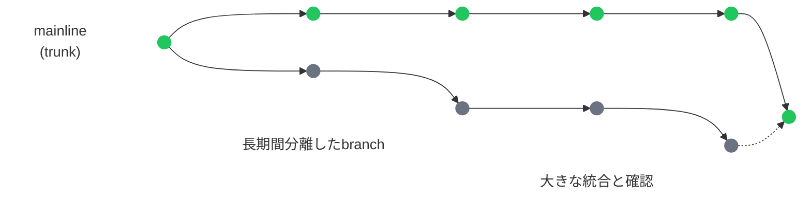
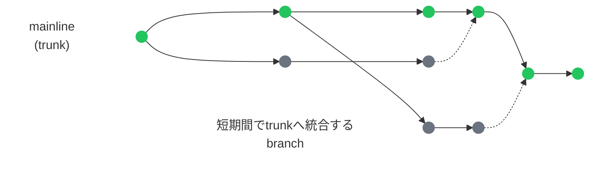

## 5. 短いサイクルを支えるDevOps

4章では、品質をSprintの終盤にまとめて確認するのではなく、要求の具体化から実装、レビュー、テスト、修正、リリース後の学習まで、短いフィードバックループとして開発活動へ組み込む考え方を確認した。

しかし、チームが小さな単位で実装、レビュー、テストを進めても、その変更をほかの変更と統合し、安全に本番環境へ反映し、実際の利用状況から結果を確認するまでに長い時間がかかれば、価値提供と学習のサイクル全体は短くならない。

この章では、DevOpsを独立した専門領域として詳しく説明するのではなく、small batch、CI、Continuous Delivery、feature flag、monitoring / observabilityを通じて、Agileの短いサイクルを協働、技術、運用の面から支える基本的な考え方を整理する。

DevOpsの実践には、Sprint内で行う開発・改善作業だけでなく、複数のSprintを越えて継続するCI/CD、監視、運用からのフィードバックも含まれる。本資料では、CI/CD(Continuous Integration / Continuous Delivery:継続的インテグレーション / 継続的デリバリー)を、変更を継続的に統合・確認し、デプロイ可能な状態に保つ仕組みや実践をまとめて表す語として使用する。CD単独の表記もContinuous Deliveryを指し、Continuous Deploymentは混同を避けるため略さずに表記する。

---

### 5.1 Sprintを短くしても、価値提供までの流れに時間がかかればフィードバックは遅れる

ScrumではSprintを通じて検査と適応のリズムを作り、Kanbanでは作業のworkflow、WIP、flowを継続的に改善する。

ただし、開発作業を短い期間や小さなWork itemに分けることと、変更が実際の利用者へ届き、その結果から学べるまでの時間が短くなることは同じではない。

また、DevOpsに関わる活動や仕組みのすべてが、一つのSprint内で始まり完了するわけではない。

DevOpsに関わる活動は、Sprintとの関係から次のように整理できる。

| Sprintとの関係 | 主な内容 | 例 |
|---|---|---|
| Sprint内で計画・実施する作業 | Product Backlogで管理し、Sprint Backlogの計画へ組み込んで、機能や提供方法を改善する | 機能実装、自動テストの追加、pipelineの改善、監視設定やログ出力の追加、デプロイ設定の変更 |
| 複数のSprintを越えて継続的に機能する仕組み | 一度整備した後も、個々のSprintや変更を継続して支える | CI/CD pipeline、自動テストの実行環境、本番環境の監視・可観測性を支える基盤、デプロイの仕組み |
| Sprintの境界に関係なく続く運用活動 | 本番環境の状態や利用状況に応じて継続的、または随時行う | 継続的な監視、アラートへの対応、障害対応、利用状況の確認、運用情報の共有、緊急の修正や切り戻し |

この分類は、活動や仕組みを完全に分離するものではない。

たとえば、CIやContinuous Deliveryを支えるpipelineは複数のSprintを越えて継続的に機能するが、そのpipelineを新設・改善する作業は、Product Backlogで管理し、Sprint Backlogの計画に組み込んで実施できる。同様に、本番環境の監視は継続的に行われるが、ログ、メトリクス、アラートなどを追加・改善する作業は、Sprint内の計画へ含められる。

Sprint中に利用可能なIncrementが作られていても、それを実際の利用者へ届け、結果を確認するまでの過程に、次のような問題が残っている場合がある。

- 複数の変更を長期間ためてから、まとめて統合する
- 追加のテストや確認を、リリース直前にまとめて行う
- 本番環境への反映に必要な環境準備や承認を、開発作業とは別の長い工程として扱う
- デプロイ作業が手作業や特定の担当者に強く依存している
- 本番環境で発生したエラー、性能低下、利用状況などを開発チームが把握しにくい
- 運用から得られた情報が、Product Backlogやテスト、開発方法の改善へ戻されない

このような状態では、開発チーム内部の作業サイクルが短くても、統合、テスト、デプロイ、利用者への公開、運用からのフィードバックまでの間に、長い待ち時間や大きな一括処理が残る。

その結果、変更に問題があっても、ほかの変更と統合するまで発見できないことがある。本番環境で正しく動作するか、実際の利用者がどのように使うか、期待した価値につながっているかについても、変更を本番環境へ反映し、利用者へ公開するまで確認できない。

Sprint Reviewでは、Incrementを含むSprintの成果を検査し、ステークホルダーとの対話から得られた情報を今後の判断へ反映できる。ただし、実際の利用環境でしか得られない情報もある。変更を本番環境へ届け、利用者へ公開するまでの時間が長ければ、利用状況、運用上の問題、性能、エラーなどから得られるフィードバックも遅れる。

また、開発側が変更を作り、運用側へ引き渡して終わる一方向の流れでは、情報が役割や工程の境界で途切れやすい。

たとえば、本番環境で繰り返し発生している問題が開発側へ十分に共有されなければ、同じ問題を早期に発見するテストや監視を追加できない。逆に、開発時に判明していた制約や変更内容が運用側へ共有されなければ、異常が発生したときの影響範囲や原因を判断しにくくなる。

DevOpsは、このような開発と運用の分断を減らし、計画、開発、テスト、提供、運用に関わる人、プロセス、技術をつなぎ、継続的なフィードバックと改善を可能にするための協働と実践である。

ここでいうDevOpsは、特定のCI/CDツールを導入することや、DevOpsという名称の担当者を置くことだけを意味しない。開発、テスト、リリース、運用に関わる人が共通の目的と情報を持ち、繰り返し可能なプロセスや自動化を整え、実際の結果から継続的に学ぶことが重要になる。

これは、全員が同じ作業を担当したり、開発や運用の専門性をなくしたりするという意味でもない。それぞれの専門性や役割分担を保ちながら、変更を作る側と運用する側の間で、情報、フィードバック、改善活動が途切れない状態を作る。

DevOpsはAgileそのものではない。しかし、短いサイクルで作られた変更を安全に統合し、必要なタイミングで利用者へ届け、本番環境から得られた情報を次のProduct Backlogや開発活動へ戻すことで、Agileのフィードバックループを技術・運用面から支える。

次節では、この流れの出発点として、変更を大きくため込まず、確認・統合・提供しやすい単位で進めるsmall batchを整理する。

---

### 5.2 Small batch: 変更を小さな単位で進める

5.1では、Sprint内の作業サイクルを短くしても、統合、テスト、デプロイ、利用者への公開までに時間がかかれば、価値提供とフィードバックは遅れることを確認した。

この流れを改善する出発点の一つが、変更をsmall batch(小さな単位)で進めることである。

ソフトウェア開発におけるbatchは、開発や提供の各段階で、ひとまとまりとして扱われる作業や変更の単位を表す。batch sizeは、一つのbatchに含まれる作業や変更の大きさを表す。

たとえば、多数のコード変更を長期間ため、まとめてレビュー、テスト、統合、デプロイする場合、そのまとまりが大きなbatchとなる。反対に、小さな変更を短い間隔でレビュー、テスト、統合していけば、一つひとつのbatchを小さく保つことができる。

- レビューする差分が大きくなり、変更の意図や影響範囲を把握しにくくなる
- 複数の問題が同時に見つかり、どの変更が原因なのかを特定しにくくなる
- ほかの変更との競合や統合上の問題が、開発の終盤まで見つからない
- 修正後に広い範囲を再確認する必要が生じる
- 問題が発生したときに、変更全体を戻すか、大きな修正を加える必要がある
- レビュー、テスト、統合を待つ時間が長くなり、後続の作業も滞る

一方、変更を小さな単位に保つと、レビュー、自動テスト、統合などから、変更箇所に近い時点でフィードバックを得やすくなる。問題が見つかった場合も、確認すべき範囲や修正・切り戻しの対象を限定しやすい。

#### Product Backlog itemの分割と、実装時のsmall batch

4章では、大きな機能を、利用者にとって意味のある小さなProduct Backlog itemへ分割することを扱った。これは、何を価値の単位として作り、確認するかという分割である。

small batchでは、それに加えて、Product Backlog itemを実現するためのコード変更、レビュー、テスト、統合、デプロイの単位も小さく保つ。

| 分割する対象 | 主な目的 | 例 |
|---|---|---|
| Product Backlog item | 利用者にとって意味のある価値を、小さく完成させる | 「管理者が、利用者を一人ずつ招待できる」 |
| 実装・提供時のbatch | 変更を早く確認・統合し、問題の影響範囲を限定する | 入力検証、保存処理、招待処理、画面を一度に作り込むのではなく、それぞれの変更を既存のコードと接続し、テストで確認しながら順次統合する |

この二つは対立するものではない。利用者にとって意味のあるProduct Backlog itemを縦に分割したうえで、その実装をさらに小さな変更として進める。

実装上は、複数のsmall batchを順次レビュー、テスト、統合し、その積み重ねによって利用可能なIncrementを作ると捉えられる。ただし、batchは変更を進める単位であり、個々のbatchがそれぞれIncrementになるとは限らない。

ただし、small batchは、データベース、API、画面などの技術要素を担当者ごとの別工程として分離することではない。

たとえば、「利用者を招待する機能」について、データベース担当、API担当、画面担当がそれぞれ長期間作業し、すべてが完成してからまとめて接続する場合、タスクの一覧は細かく見えても、実際にレビュー、テスト、統合する変更の単位は大きいままである。

一方、入力検証、保存処理、招待処理、画面などに関する変更を、既存のコードと接続し、テストで確認できる状態に保ちながら順次統合するなら、小さなbatchとして進めることができる。個々の変更が単独で利用者へ公開できる必要はないが、共有されたコードを正常な状態に保ち、後続の変更を長期間待たずに確認・統合できることが重要である。

同じProduct Backlog itemへ向けて協働しながら、確認可能な変更を短い間隔でレビュー、テスト、統合していくことが重要になる。機能全体が利用者へ公開できる状態になる前でも、安全に統合できる小さな変更として進められる場合がある。

#### small batchは、タスクを細かく増やすことではない

small batchの目的は、作業管理上の項目数を増やすことではない。細かく分けたタスクが個別に確認できず、すべてが終わるまで統合やテストを行えないなら、フィードバックを早める効果は小さい。

小さなbatchとして扱いやすい変更には、次のような特徴がある。

- 変更の目的と範囲を説明できる
- レビューする範囲が限定されている
- 変更した部分をテストできる
- ほかの変更と早い段階で統合できる
- 問題が起きた場合の影響範囲を把握しやすい
- 必要に応じて修正や切り戻しを行いやすい
- 後続の大きな一括処理を待たず、次の確認へ進められる

batchの適切な大きさを、コードの行数やタスク数だけで一律に決めることはできない。システムの構造、変更の種類、テスト方法、チームの能力などによって、確認・統合しやすい単位は異なる。

判断するときは、単に「小さく見えるか」ではなく、次の問いを使うことができる。

- この変更だけをレビューして、目的と影響を理解できるか
- この変更について、意味のあるテスト結果を得られるか
- ほかの大きな変更の完成を待たずに統合できるか
- 問題が起きた場合に、原因の候補を限定できるか
- 安全に修正や切り戻しを行えるか

#### batch size(batchの大きさ)とWIPは異なる

3章で扱ったWIPは、同時に進行しているWork itemの数を表す。一方、batch sizeは、一つのbatchに含まれる作業や変更の大きさを表す。

```text
WIPを減らす
→ 同時に着手する作業を絞り、完了へ集中する

batchを小さくする
→ 一つの変更を早く確認・統合できる単位にする
```

少数の大きな変更だけ進めている場合、WIPは少なくてもbatchは大きい。反対に、小さな変更へ分けても、多数の変更へ同時に着手すればWIPは増える。

そのため、同時に進めるWork itemを絞り、それぞれの実装を小さなbatchで進めることが、待ち時間を減らし、早いフィードバックを得るうえで重要になる。

また、開発中の変更を小さく分けても、テストやリリースの前に再び大きくまとめれば、そこでフィードバックが遅れる。small batchは実装時だけの工夫ではなく、レビュー、テスト、統合、デプロイ、利用者への公開まで、可能な範囲で小さな単位を維持する考え方である。

次節では、小さな変更を共有されたコードへ頻繁に統合し、自動的な確認から早いフィードバックを得るCIを整理する。

---

### 5.3 CI: 小さな変更を継続的に統合し、自動的に確認する

5.2では、変更をsmall batchとして進め、レビュー、テスト、統合から早くフィードバックを得る考え方を確認した。

ただし、変更を小さく分けても、それぞれが長期間別々に保持され、機能全体が完成してから共有されたコードへ統合されるなら、統合上の問題を早期に発見することはできない。

CI(Continuous Integration:継続的インテグレーション)は、開発者が小さな変更をmainlineへ頻繁に統合し、それぞれの統合結果を自動的に確認する実践である。

mainlineは、チームが変更を継続的に統合する主要なコード系列を表す。Gitを使用する場合は`main`などのbranchがmainlineとして使われることが多いが、特定のbranch名そのものが重要なのではない。チームの変更が頻繁に集まり、現在のプロダクトの状態を共有できる基準となっていることが重要である。

#### 統合を後回しにすると、問題もまとめて現れる

複数の開発者がそれぞれ長期間変更を保持すると、その間にもmainlineやほかの変更は更新されていく。

変更を最後にまとめて統合すると、次の問題が同時に発生しやすくなる。

- 同じコードや設定への変更が競合する
- 個別には動作していた変更が、組み合わせると正しく動かない
- データ構造やAPIなどの前提が、開発者間でずれている
- 多数の変更が同時に入るため、失敗の原因を特定しにくい
- 統合後の修正や再テストに長い時間がかかる
- 統合や安定化のための追加工程が、リリース前に必要になる

変更を小さく保ち、短い間隔でmainlineへ統合すれば、前回の正常な状態から追加された変更の範囲を限定できる。問題が見つかった場合も、原因となった変更を絞り込みやすく、変更内容を覚えているうちに修正しやすい。

CIにおける`Continuous`は、すべての開発者が常に同時にコードを変更するという意味ではない。変更を長期間分離せず、mainlineとの統合と確認を高い頻度で繰り返すことを表す。

#### 統合結果を自動的に確認する

小さな変更を頻繁に統合しても、統合後の状態を確認しなければ、問題を早期に発見できない。

CIでは、mainlineへ統合しようとする変更や、実際に統合された変更に対して、CI systemがbuildや自動テストなどを実行する。プロジェクトによっては、静的解析、コード形式の確認、依存関係やセキュリティ上の問題の検査なども組み込まれる。

buildは、ソースコードや設定から、実行・配布可能な成果物を作る処理を表す。必要な処理は技術構成によって異なるが、コンパイル、依存関係の取得、パッケージ作成などが含まれる場合がある。

基本的な流れは、次のように整理できる。

| 段階 | 主な活動 |
|---|---|
| 変更前 | 最新のmainlineを取得し、ほかの変更を反映する |
| 開発中 | small batchとしてコードとテストを変更する |
| 統合前 | 手元の環境でbuildやテストを実行し、変更を確認する |
| mainlineへの統合 | 小さな変更をmainlineへ反映する |
| 自動確認 | CI systemがbuild、自動テスト、静的解析などを実行する |
| 結果への対応 | 成功を確認するか、失敗した場合は原因を調査し、修正または変更の取り消しを行う |

このように、CIは変更の統合と自動的な確認を一つの短いフィードバックループとして繰り返す。

```text
小さな変更
    ↓
mainlineへ統合
    ↓
build・自動テスト・静的解析
    ↓
結果を確認
    ↓
問題があれば修正または変更を戻す
    ↓
次の小さな変更
```

自動テストや静的解析によって、すべての品質問題を検出できるわけではない。しかし、変更のたびに繰り返すべき確認を自動化することで、既存の動作を壊していないか、最低限の品質基準を満たしているかについて、早く一貫したフィードバックを得られる。

#### CI systemを使うだけではCIにならない

GitHub Actions、GitLab CI/CD、JenkinsなどのCI systemを使って自動テストを実行していても、それだけでCIを実践しているとは限らない。

たとえば、数週間にわたってmainlineから分離したbranch上で自動テストを実行し、最後に大きな変更をまとめて統合する場合、自動化された確認は行われていても、継続的な統合は行われていない。

CIを成立させるには、少なくとも次の活動を組み合わせる必要がある。

- 変更をsmall batchに保つ
- mainlineへ頻繁に統合する
- 統合した変更を自動的にbuild・テストする
- CIの結果をチームが確認できるようにする
- 失敗を長時間放置せず、mainlineを正常な状態に戻す

特に、CIによって失敗が検出された後の対応が重要である。

mainlineのbuildやテストが失敗した状態を放置すると、後から統合する変更についても、既存の失敗なのか新しい変更による失敗なのか判断しにくくなる。また、ほかの開発者が正常に動作しないコードを基準として作業を始めることになる。

そのため、CIの失敗が見つかった場合は、原因となった変更を修正するか、短時間で修正できなければ変更を戻し、mainlineを正常な状態に保つ。CIは問題を通知するだけの仕組みではなく、その結果へチームが対応する運用を含む。

#### trunk-based developmentが頻繁な統合を支える

CIを支える代表的な実践の一つが、trunk-based developmentである。

trunkは、本節でいうmainlineに相当する、チームの変更が集まる主要なコード系列である。Gitでは、`main`などのbranchがtrunkの役割を持つことがある。

trunk-based developmentでは、このtrunkを基準として作業し、小さな変更を短い間隔で統合する。branchを使用する場合も、変更を長期間保持するのではなく、短期間でtrunkへ統合する。

以下の比較では、どちらの進め方にも変更が集まる主要なコード系列があるものとし、それをmainline(trunk)として示す。違いは、branchをどのくらいの期間分離し、どのくらいの頻度でtrunkへ統合するかにある。

**長期間分離したbranch**



**trunk-based developmentにおける、短期間でtrunkへ統合するbranch**



branchを長期間存続させず、小さな変更を頻繁にtrunkへ統合することで、trunkとの差分を小さく保ち、大規模なmergeや統合後の安定化作業を避けやすくなる。

trunk-based developmentは、branchを一切使用してはならないという意味ではない。trunk上で直接小さな変更を進める方法もあれば、短期間だけbranchを使用し、レビューや確認後すぐにtrunkへ統合する方法もある。

重要なのはbranchの有無ではなく、変更がtrunkから長期間分離されず、small batchとして頻繁にtrunkへ統合されることである。

また、大きな機能が完成するまで統合できない進め方では、trunk-based developmentを実践しにくい。大きな機能を途中でも安全に統合できる小さな変更へ分け、自動テストによってtrunkの状態を確認できるようにする必要がある。

機能全体が完成する前に変更を統合する場合は、未完成の機能を利用者の通常の利用経路から切り離したり、既存の動作との互換性を保ちながら段階的に移行したりする方法を利用できる。

代表的な方法には、機能の公開状態を切り替えるfeature flag、既存実装と新実装を段階的に切り替えるBranch by Abstraction、インターフェースやデータ構造を互換性を保ちながら移行するParallel Changeなどがある。これらは、未完成の変更を壊れた状態で統合するためではなく、既存の動作とtrunkの正常な状態を維持しながら、変更をsmall batchとして統合するための手法である。feature flagについては、次節で扱う。Branch by AbstractionとParallel Changeの詳細は、本資料では扱わない。

#### CIはContinuous Deliveryの土台となる

CIによって、small batchを頻繁にmainlineへ統合し、その都度自動的に確認できれば、変更を大きくため込まず、現在のプロダクトの状態を継続的に把握しやすくなる。

ただし、mainline上でbuildやテストが成功していても、本番環境へ安全にデプロイできるとは限らない。環境への反映、追加の検証、承認、デプロイ作業などが手作業や大きな一括工程として残っていれば、利用者へ価値を届けるまでの時間は短くならない。

次節では、CIによって統合・確認した変更を、必要なタイミングで本番環境へデプロイできる状態に保つContinuous Deliveryを整理する。

---

### 5.4 Continuous Delivery: デプロイ可能な状態を継続的に保つ

5.3では、小さな変更をmainlineへ頻繁に統合し、build、自動テスト、静的解析などによって早いフィードバックを得るCIを確認した。

Agileでは、価値あるソフトウェアを早く継続的に届け、実際の結果から学ぶことが重視される。しかし、Sprint内で利用可能なIncrementを小さく完成させても、それを本番環境へ反映し、利用者へ届けるまでに長い時間がかかれば、実際の利用状況から得られるフィードバックも遅れる。

そのため、Agileの短いサイクルを実際の価値提供までつなぐには、統合・確認された変更を、必要なときに本番環境へ反映できる状態に保つ必要がある。

ただし、CI上の確認が成功していることと、その変更を本番環境へ安全にデプロイできることは同じではない。

たとえば、コードを統合して自動テストに合格していても、環境の準備、追加の確認、承認、デプロイ作業などが、リリース直前の大きな一括工程として残っている場合がある。デプロイが特定の担当者や手作業に強く依存していれば、変更を利用者へ届けるまでに待ち時間が生じ、問題が見つかった場合の修正や再確認も遅れる。

このような統合後の待ち時間や大きな一括作業を減らし、変更を必要なタイミングで本番環境へデプロイできる状態へ継続的に保つ実践が、CD(Continuous Delivery:継続的デリバリー)である。

DORAでは、Continuous Deliveryを、さまざまな種類の変更を、必要なときに迅速、安全、持続可能な形で提供できる能力として説明している。

Continuous Deliveryで重要なのは、単にデプロイ回数を増やすことではない。small batchで作られ、CIによって統合・確認された変更を、長期間ため込まず、必要なときに利用者へ届けられる状態へ保つことである。

#### CIから利用者への提供までをつなぐ

Continuous Deliveryでは、build、テスト、環境への反映、デプロイ準備などを、繰り返し実行できるpipelineへ組み込む。

概念上は、次のような流れとして整理できる。

```text
small batchで変更する
↓
mainlineへ統合する
↓
build・自動テストなどで確認する
↓
デプロイに必要な確認と準備を行う
↓
必要なタイミングで本番環境へ反映できる状態を保つ
```

実際にpipelineへ何を含めるかは、プロダクト、システム構成、品質リスク、法令や監査上の条件などによって異なる。

本資料で重要なのは、特定のpipeline構成を覚えることではない。変更を統合した後に、デプロイ準備を長期間待ったり、リリース直前に大きな確認作業をまとめたりするのではなく、変更が本番環境へ進められる状態かどうかについて継続的にフィードバックを得ることである。

デプロイに必要な処理を繰り返し可能にすることで、担当者や実施時期による手順のばらつきを減らし、変更を本番環境へ反映する作業を、特別なイベントではなく日常的に実行できる活動へ近づけられる。

ただし、pipelineが自動的に動くだけで、必要なときに安全に変更を届けられる状態が成立するわけではない。

自動テストの結果を信頼できない、失敗したpipelineを放置する、環境ごとの差異を把握できない、デプロイ後の状態を確認できないといった問題があれば、必要なときに安全に変更を届けられる状態とはいえない。

Continuous Deliveryは、small batch、CI、自動テスト、デプロイの仕組み、開発・テスト・運用に関わる人の協働をつなぎ、価値提供までの待ち時間を短くするための実践として理解する必要がある。

#### Continuous DeliveryとContinuous Deployment

Continuous DeliveryとContinuous Deploymentは、名称が似ているため混同されやすいが、同じ実践ではない。

| 観点 | Continuous Delivery | Continuous Deployment |
|---|---|---|
| pipeline上の確認後 | 必要なときに本番環境へデプロイできる状態を保つ | 確認を通過した変更を自動的に本番環境へデプロイする |
| 本番デプロイの開始判断 | 人間による承認や明示的な実行判断を残すことができる | 変更ごとの人間による承認を待たず、自動的に本番デプロイへ進む |

Continuous Deliveryでも、本番環境へ反映する処理そのものは自動化できる。たとえば、人間が本番デプロイを承認すると、その後の処理が自動的に進むようにできる。

両者の主な違いは、自動化の有無だけではなく、pipeline上の確認を通過した変更を本番環境へ進める前に、変更ごとの人間の判断を置くかどうかにある。

Continuous Deliveryは、Continuous Deploymentへ移行する途中の不完全な状態ではない。

プロダクトの種類、利用者への影響、組織の判断、法令や監査上の条件などに応じて、デプロイ可能な状態を維持しながら、本番環境へ進めるタイミングを人間が判断する運用も選択できる。

また、Continuous Deliveryは、すべての変更を直ちに本番環境へ反映することや、Sprint終了時にまとめてデプロイすることを意味しない。

重要なのは、技術的な準備が整うまで長期間待つのではなく、変更が必要な確認を終え、利用可能な状態になった時点で、必要なタイミングに本番環境へ反映できる選択肢を持つことである。

#### デプロイとリリースを必要に応じて分ける

本節では、デプロイ(deployment)とリリース(release)を次のように区別する。

| 用語 | 本節での意味 |
|---|---|
| デプロイ(deployment) | コードや構成などの変更を、対象となる実行環境へ配置すること |
| リリース(release) | 機能や変更を、利用者が実際に利用できる状態として公開すること |

本番環境へデプロイした時点で、すべての利用者が新しい機能を使えるようになる場合、デプロイとリリースはほぼ同時に行われる。

一方、本番環境へ新しいコードをデプロイしても、通常の利用者からは新しい機能を使えない状態にしておき、後からリリースすることもできる。

デプロイとリリースを分ける代表的な方法の一つが、feature flagである。

feature flagは、特定の機能や処理経路を有効または無効に切り替える仕組みである。たとえば、新しい機能のコードを本番環境へデプロイしても、flagを無効にしておけば、その機能を通常の利用者へ公開しない状態を保てる。

```text
新しいコードを本番環境へデプロイする
↓
feature flagによって新機能を非公開にする
↓
必要な確認を行う
↓
feature flagを切り替えて利用者へリリースする
```

このようにデプロイとリリースを分けることで、コードを本番環境へ配置する技術的な作業と、いつ、誰に機能を公開するかというプロダクト上の判断を分けられる場合がある。

また、最初からすべての利用者へ公開するのではなく、一部の利用者から段階的に公開し、結果を確認しながら対象を広げる方法もある。

たとえば、社内利用者、協力してくれる一部の顧客、一定割合の利用者という順序で公開範囲を広げれば、問題が発生した場合の影響範囲を限定しながら、実際の利用環境からフィードバックを得やすくなる。

feature flagは、このような段階的公開を実現する方法の一つである。ただし、段階的公開はfeature flagだけで実現するものではなく、システム構成や提供方法によって、ほかの方法を使う場合もある。

#### 公開方法そのものを目的にしない

feature flagや段階的公開は、変更を小さな範囲から届け、本番環境の結果から早く学ぶための選択肢になる。

ただし、導入すれば自動的に安全性が高まるわけではない。

feature flagを使うと、有効時と無効時の複数の処理経路を確認・保守する必要がある。不要になったflagを残し続ければ、コードや設定の複雑さも増える。

また、flagを無効にしていても、デプロイしたコードや設定が既存機能へ影響する場合がある。したがって、利用者へ公開していない変更であっても、本番環境の正常な動作を損なわない状態にする必要がある。

段階的公開についても、単に公開対象を少しずつ広げればよいわけではない。各段階で何を確認し、どのような状態であれば次の対象へ広げるのか、問題が見つかった場合にどのように公開を停止または縮小するのかを考える必要がある。

重要なのは、feature flagや段階的公開を導入すること自体ではない。変更のリスクや確認したい仮説に応じて、利用者への影響を限定しながら、必要なフィードバックを早く得られる提供方法を選ぶことである。

Continuous Deliveryによって、変更を本番環境へ反映するための技術的な待ち時間を減らすことができる。デプロイとリリースを必要に応じて分ければ、利用者への公開範囲やタイミングも、実際の結果を見ながら調整しやすくなる。

これは、Agileにおける変化への適応や短いフィードバックループを、開発環境の中だけで終わらせず、実際の利用環境までつなぐための技術・運用上の支えとなる。

ただし、変更を本番環境へデプロイし、利用者へリリースしても、そこで何が起きたかを確認できなければ、フィードバックループは閉じない。

次節では、本番環境の状態、エラー、性能、利用状況などを把握し、得られた情報をProduct Backlogや品質活動、提供方法の改善へ戻すためのmonitoring / observabilityを整理する。

---

### 5.5 Monitoring / Observability: リリース後の結果から学ぶ

5.4では、Continuous Deliveryによって変更を本番環境へデプロイできる状態に保ち、必要に応じてデプロイとリリースを分けながら、小さな範囲から利用者へ届ける考え方を確認した。

ただし、変更を本番環境へデプロイし、利用者へリリースしただけでは、Agileのフィードバックループは完結しない。

リリース後に、システムが正常に動いているか、利用者が意図した操作を完了できているか、変更が期待した結果につながっているかを確認できなければ、当初の想定や仮説が妥当だったのか、どこを改善すべきかを判断できないためである。

Agileでは、動くソフトウェアや実際の結果を検査し、得られた情報にもとづいて、Product Backlog、要求、設計、品質活動、提供方法などを適応させる。

monitoring(監視)とobservability(可観測性)は、本番環境で起きた結果を把握し、リリース後の学びを次の開発活動へ戻すための技術・運用上の支えとなる。

#### monitoringとobservability

monitoringとobservabilityは密接に関係しており、実務上の使い分けや範囲は、組織や資料によって異なる。

本資料では、両者を厳密に分離された仕組みとしてではなく、次のような違いに注目して整理する。

| 観点 | monitoring | observability |
|---|---|---|
| 主な目的 | あらかじめ重要と考えた状態や指標を継続的に確認する | システムの外部へ現れる情報から、内部で何が起きているかを調査・理解する |
| 主な問い | システムは正常か、重要な状態や変化が発生していないか | なぜこの状態が起きているのか、どこで問題が発生しているのか |
| 主に支える活動 | 重要な状態の把握、変化や異常の検出、通知 | 既知・未知の問題について、原因や影響範囲を調査する |
| 例 | エラー率、応答時間、可用性、処理件数、リソース使用量の確認 | logs、metrics、tracesなどを関連づけ、特定のリクエストやサービス間で何が起きたかを調べる |

monitoringでは、あらかじめ重要と考えた指標や状態を継続的に確認する。

たとえば、次のような状態を確認できる。

- エラーが通常より増えていないか
- 応答時間が定めた範囲を超えていないか
- システムや重要な機能を利用できる状態か
- リクエスト数や処理件数が急激に変化していないか
- 計算資源、メモリ、ストレージなどが不足していないか
- 外部サービスとの連携が失敗していないか
- 新しいバージョンのデプロイまたはリリース後に、既存機能の状態が悪化していないか

必要に応じて、重要な状態が発生したときに、関係者へ通知するalertを設定することもある。

ただし、収集した値が変化するたびに通知すればよいわけではない。通知が多すぎると、本当に対応が必要な問題を識別しにくくなる。

alertは、利用者への影響、緊急性、対応の必要性などを踏まえ、関係者が確認や対応を行うべき状態へ絞る必要がある。

一方、あらかじめ定めた指標だけでは、想定していなかった問題の原因を理解できない場合がある。

たとえば、全体のエラー率には大きな変化がなくても、特定の契約プラン、端末、地域、操作手順を利用する人だけが処理を完了できなくなっている可能性がある。また、複数のサービスを経由する処理では、どのサービスや通信経路で遅延や失敗が発生したのかを、単一の指標だけでは判断できないことがある。

observabilityは、システムが外部へ出す情報を使って、このような問題を調査し、内部状態を理解できる性質や能力を表す。

そのために利用される代表的なtelemetry(テレメトリ:システムから収集する観測データ)には、次のようなものがある。

- metrics
  - エラー率、応答時間、処理件数、リソース使用量など、時間とともに変化する数値
- logs
  - システム内で発生した処理、エラー、状態変化などの記録
- traces
  - 一つのリクエストや処理が、複数のサービスやコンポーネントをどのように通過したかを追跡する情報

本資料では、これらの収集方法、保存方法、分析基盤、個別ツールの使い方には踏み込まない。

重要なのは、monitoringによってあらかじめ重要と考えた状態を確認できることに加え、問題が発生したときに、関連する情報をたどり、何が起きたかを調査できる状態を作ることである。

#### システムが動いていることと、価値を届けられたことを区別する

リリース後に確認する対象は、システムのエラーや性能だけではない。

システムが技術的には正常に動いていても、利用者が新しい機能を見つけられない、操作を途中で中断する、想定した業務を完了できないといった場合がある。

反対に、新しい機能が多く利用されていても、エラーや性能低下によって利用体験を悪化させている可能性もある。

そのため、リリース後の結果は、少なくとも次の三つの観点から確認する。

| 観点 | 確認する主な問い | 例 |
|---|---|---|
| システムの状態 | システムは正常かつ安定して動いているか | エラー率、応答時間、可用性、処理件数、資源使用量 |
| 利用者が経験する状態 | 利用者は意図した操作を正常に完了できているか | 操作成功率、画面表示時間、処理失敗、途中離脱、問い合わせ |
| プロダクト上の結果 | 変更は期待した利用や価値につながっているか | 機能利用率、完了率、継続利用、業務時間の短縮、対象課題の減少 |

これらの情報が、すべてmonitoring / observabilityの仕組みから得られるとは限らない。

システムのtelemetry、利用状況の分析、問い合わせ、業務指標、ユーザーからの定性的なフィードバックなどを組み合わせることで、技術的な正常性と、利用者やプロダクトに生じた結果を確認する。

どの指標を見るべきかは、機能、利用者、品質リスク、Product Goalなどによって異なる。

たとえば、「管理者がユーザーを招待できる」という機能をリリースする場合、サーバーエラーが発生していないことだけでは、機能が価値を提供できているとは判断できない。

次のような情報も必要になる場合がある。

- 招待処理を開始できたか
- 招待メールを正常に送信できたか
- 招待された利用者が登録を完了できたか
- 招待リンクの期限切れや権限不足による失敗が増えていないか
- 管理者が招待の状態を確認できているか
- 招待に関する問い合わせが増えていないか

このように、技術的な正常性、利用者が経験する状態、プロダクト上の結果を組み合わせて見ることで、「システムが停止していない」だけでなく、「変更が意図したとおりに利用され、価値につながっているか」を検査しやすくなる。

#### リリース後に確認する方法を、開発中から考える

monitoring / observabilityに必要な情報や仕組みは、リリース後に運用担当者だけが整えるものではない。

本番環境で必要な情報を取得するには、実装時にlogs、metrics、tracesなどを出力できるようにしたり、利用状況を確認するためのイベントを記録したりする必要がある。

そのため、Product Backlog Refinement、Sprint Planning、設計、実装、テストなどの段階から、リリース後に何を確認する必要があるかを考えることが重要になる。

たとえば、次のような問いを使うことができる。

- この変更が正常に動いていることを、どの情報から確認できるか
- 利用者が処理を完了できなかった場合、その原因を調査できるか
- 新しい機能と既存機能の結果を区別できるか
- 段階的公開中の利用者と、それ以外の利用者の状態を比較できるか
- 問題が発生した場合に、どの変更やバージョンが影響しているかを確認できるか
- 何を確認できれば、公開範囲を広げてもよいと判断できるか
- どのような状態になれば、公開を停止、縮小、または切り戻す必要があるか

必要な観測情報を開発時から考えることで、「問題が起きたことは分かるが、何が原因か分からない」「利用者が使っていないことは分かるが、どこで離脱しているか分からない」といった状態を減らしやすくなる。

また、リリース後に確認したい情報は、受け入れ条件やDefinition of Doneと関係する場合がある。

たとえば、重大な処理の成功・失敗を記録できること、必要なmetricsやlogsが出力されること、重要な異常を検出できることなどを、完成に必要な品質基準として扱うこともできる。

ただし、すべての情報を無制限に収集することが目的ではない。

収集・保存・分析にはコストがかかり、個人情報、機密情報、セキュリティ、法令上の制約も考慮する必要がある。何を判断・調査するために必要な情報なのかを明確にし、目的に合った情報を取得することが重要である。

#### 段階的公開の判断を本番環境の情報で支える

5.4では、一部の利用者から機能を公開し、結果を確認しながら対象を広げる段階的公開を扱った。

段階的公開を行う場合、公開範囲を広げる判断には、monitoring / observabilityや利用状況の分析から得られる情報が必要になる。

概念上は、次のような流れになる。

```text
一部の利用者へリリースする
↓
システムの状態を確認する
↓
利用者が経験する状態を確認する
↓
想定していなかった問題を調査する
↓
公開を継続・拡大・停止・縮小する
```

たとえば、エラー率や応答時間が悪化していないことを確認できても、利用者が新しい操作を完了できていなければ、直ちに公開範囲を広げるべきではない場合がある。

反対に、一部の失敗が見つかっても、原因と影響範囲を特定でき、特定の条件に限られた問題であると判断できれば、対象を限定したまま修正と再確認を進めることもできる。

重要なのは、公開範囲を広げることを最初から決められた手順として機械的に進めないことである。

実際の結果を検査し、必要に応じて公開方法、実装、確認方法を適応させることで、段階的公開をAgileのフィードバックループとして機能させられる。

#### 問題が見つかったときは、影響を抑え、次の改善へつなげる

本番環境で重大な問題が見つかった場合は、まず利用者や業務への影響を抑える必要がある。

状況に応じて、次のような対応が考えられる。

- feature flagによって問題のある機能を無効にする
- 公開対象を縮小する
- 以前のバージョンへ切り戻す
- 影響を受ける処理を一時的に停止する
- 小さな修正を作成し、CIとContinuous Deliveryの流れを通じて反映する
- 利用者や関係者へ、影響と対応状況を共有する

どの対応が適切かは、問題の種類、影響範囲、データへの影響、復旧に必要な時間などによって異なる。

問題の原因を完全に解決する前でも、まず機能を無効にするなどの一時的な対応によって影響を抑え、その後に原因を調査し、恒久的な修正や再発防止を行う場合がある。

ただし、一時的な対応を行って終わりにすると、同じ問題が繰り返される可能性がある。

問題への対応から得られた情報は、次のような改善へ戻す。

- Product Backlogへ不具合修正や改善項目を追加する
- 要求や受け入れ条件に不足していた条件を加える
- 同じ問題を早期に検出するテストを追加する
- 自動テストや品質ゲートを見直す
- 必要なlogs、metrics、tracesを追加する
- alertの条件やダッシュボードを改善する
- デプロイや切り戻しの方法を改善する
- Definition of Doneを見直す
- チームの対話、レビュー、作業分割、運用方法を改善する

このように、本番環境で問題を発見したことを、単なる運用上の失敗として閉じないことが重要である。

問題から得られた情報を、要求、設計、テスト、提供方法、チームの働き方へ戻すことで、同じ問題をより早い段階で発見したり、影響を小さくしたりできるようになる。

#### 本番環境の情報をチームで共有する

monitoring / observabilityから得られる情報を、運用担当者や特定の専門職だけが扱う状態にすると、本番環境からの学びが、開発やProduct側へ戻りにくくなる。

開発者が、本番環境で自分たちの変更がどのように動いているかを把握できなければ、テストや設計をどのように改善すべきか判断しにくい。

Product側が、利用者がどこで操作を中断し、どの機能を利用しているかを把握できなければ、Product Backlogの順序や次の仮説を判断しにくい。

QAが、本番環境で発生している問題や利用条件を把握できなければ、テスト観点や品質リスクを実際の利用状況に合わせて改善しにくい。

そのため、本番環境の状態や利用状況について、関係者が必要な範囲で情報へアクセスし、共通の事実にもとづいて対話できる状態が重要になる。

これは、全員が同じ監視ツールを操作し、同じ運用作業を担当するという意味ではない。

それぞれの専門性や権限を保ちながら、次の判断に必要な情報が、役割や工程の境界で止まらないようにすることである。

たとえば、Sprint Reviewでは、完成したIncrementだけでなく、すでにリリースされた機能の利用状況や結果を、今後のProduct Backlogを検討する材料として扱うことができる。

Sprint Retrospectiveでは、問題の検出が遅れた理由、調査に必要な情報が不足していた点、alertが多すぎた点、デプロイ後の確認が属人化していた点などを、チームの改善対象として扱える。

monitoring / observabilityによって得られた情報を、このような検査と適応へ結びつけることで、本番環境からの学びを、次のSprintや継続的なflow改善へ戻せる。

#### リリース後の情報でフィードバックループを閉じる

monitoring / observabilityの目的は、ダッシュボードや収集データを増やすことではない。

本番環境で起きた事実を把握し、利用者への影響やプロダクト上の結果を理解し、必要な対応と次の改善を判断できる状態を作ることである。

本番環境から得られた情報が、Product Backlog、要求、テスト、提供方法、チームの働き方へ戻されることで、Agileのフィードバックループは、計画や開発環境の中だけでなく、実際の利用環境までつながる。

次節では、この流れをsmall batch、CI、Continuous Deliveryとの関係を含め、5章全体としてまとめる。

---

### 5.6 5章のまとめ: 技術・運用面からフィードバックループをつなぐ

AgileでSprintや作業サイクルを短くしても、統合、テスト、デプロイ、リリース、運用が大きな一括工程として分断されていれば、変更を利用者へ届け、実際の結果から学ぶまでの時間は短くならない。

本章では、small batchで変更を小さく保ち、CIによって頻繁に統合・確認し、Continuous Deliveryによって必要なときにデプロイできる状態を保つ流れを確認した。さらに、リリース後の状態をmonitoring / observabilityや利用状況の分析によって把握し、得られた情報をProduct Backlog、品質活動、提供方法、チームの働き方へ戻すことで、開発、価値提供、実際の結果、次の改善を一つのフィードバックループとしてつなげられる。

DevOpsはAgileそのものではない。しかし、開発、テスト、リリース、運用に関わる人と活動をつなぎ、短いサイクルで価値を届け、実際の結果にもとづいて適応するための技術・運用上の支えとなる。

#### Key Takeaways

- Sprintや作業サイクルを短くするだけでなく、統合、確認、デプロイ、リリース、運用までの流れ全体を短くする必要がある
- small batchによって変更を小さく保つことで、レビュー、テスト、統合、リリースを早い間隔で進め、問題の影響範囲も限定しやすくなる
- CIは、小さな変更をmainlineへ頻繁に統合し、自動テストや静的解析などから早いフィードバックを得る実践である
- Continuous Deliveryは、統合・確認された変更を長期間ため込まず、必要なタイミングで本番環境へデプロイできる状態に保つ
- デプロイとリリースを分け、feature flagや段階的公開を適切に利用することで、影響を限定しながら実際の利用環境から学べる場合がある
- monitoring / observabilityや利用状況の分析などによって、システムの状態、利用者が経験した結果、プロダクト上の結果を確認し、得られた情報を次の開発と改善へ戻す
- 本番環境からの情報を特定の職種だけに閉じず、Product、開発、QA、運用などの関係者が共有することで、検査と適応を継続的に行いやすくなる
- DevOpsは、Agileの短いフィードバックループを開発環境の中だけで終わらせず、実際の価値提供と学習までつなぐ補助線として理解する
