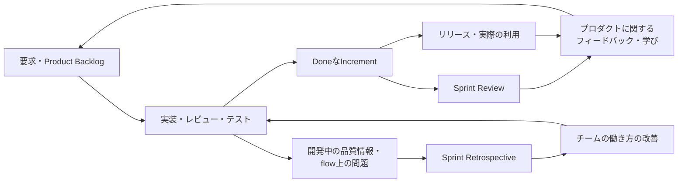
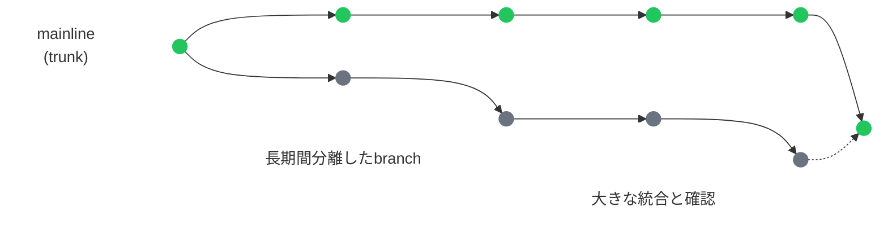
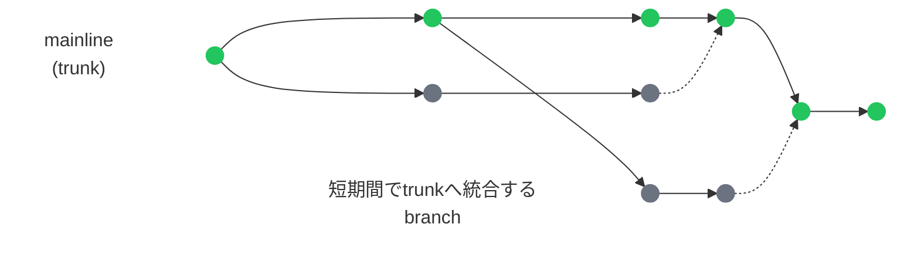

# アジャイル開発の基礎理解：短いサイクルで価値を届け、品質を継続的に扱う仕組み <!-- omit in toc -->

## — Agile Manifesto / Scrum / Kanban / QA / DevOps / AI支援との接続 — <!-- omit in toc -->

> **注意**
>
> この資料は、Agile Software Development(アジャイルソフトウェア開発)、Agile Manifesto、Scrum、Kanban、DevOps、及びQA(Quality Assurance:品質保証)との接続に関する理解を整理するために、個人が作成した入門・参照用資料です。
>
> 第三者機関、標準化団体、資格認定団体、企業などによって内容が保証・監修・認証された資料ではありません。
>
> 内容は公開情報および執筆時点での作成者の理解に基づくものであり、実務適用にあたっては各組織・プロダクト・チーム・ドメインの状況に応じた判断が必要です。
>
> **この資料におけるAgileの扱い**
>
> この資料でAgileまたはアジャイルと表記する場合、原則としてソフトウェアプロダクト開発におけるアジャイル開発を指します。
>
> ScrumやKanbanは、Agileの価値観や原則を現場で実践するための代表的なフレームワークまたは方法であり、Agileそのものと同一ではありません。
>
> 本資料では、Agileを単なる高速開発や会議体系としてではなく、短いサイクルで価値を届け、フィードバックから学び、変化に適応し、継続的に改善する考え方として扱います。
>
> また、QA、DevOps、AI支援についても、それぞれを独立した専門領域として深掘りするのではなく、アジャイル開発における短いフィードバックループを理解するための補助線として扱います。

---

- [1. アジャイル開発とは何か](#1-アジャイル開発とは何か)
  - [1.1 Agileは単に速く作ることではない](#11-agileは単に速く作ることではない)
  - [1.2 Agile Manifestoの4つの価値](#12-agile-manifestoの4つの価値)
  - [1.3 Agile Manifestoの12原則をどう読むか](#13-agile-manifestoの12原則をどう読むか)
  - [1.4 Agileは計画しないことではない](#14-agileは計画しないことではない)
  - [1.5 Agileを現場で理解するための視点](#15-agileを現場で理解するための視点)
- [2. ScrumとKanbanの基礎](#2-scrumとkanbanの基礎)
  - [2.1 Agileには複数の実践形態がある](#21-agileには複数の実践形態がある)
  - [2.2 ScrumとKanbanを読むための基本用語](#22-scrumとkanbanを読むための基本用語)
  - [2.3 Scrumの基本: 検査と適応のためのフレームワーク](#23-scrumの基本-検査と適応のためのフレームワーク)
  - [2.4 Kanbanの基本: 作業の流れを見える化し、改善する](#24-kanbanの基本-作業の流れを見える化し改善する)
  - [2.5 ScrumとKanbanの違いをどう理解するか](#25-scrumとkanbanの違いをどう理解するか)
  - [2.6 ScrumbanやHybrid運用への軽い導入](#26-scrumbanやhybrid運用への軽い導入)
  - [2.7 2章のまとめ: 3章への導線](#27-2章のまとめ-3章への導線)
    - [Key Takeaways](#key-takeaways)
- [3. アジャイル開発の流れを具体例で見る](#3-アジャイル開発の流れを具体例で見る)
  - [3.1 Sprintを中心に開発の流れを見る](#31-sprintを中心に開発の流れを見る)
  - [3.2 Product BacklogとRefinement: 変化を受け止め、次に取り組む候補を明確にする](#32-product-backlogとrefinement-変化を受け止め次に取り組む候補を明確にする)
  - [3.3 Sprint Planning: Sprint Goalと最初の計画を作る](#33-sprint-planning-sprint-goalと最初の計画を作る)
  - [3.4 Sprint中の開発とDaily Scrum: Incrementへ向けて計画を適応する](#34-sprint中の開発とdaily-scrum-incrementへ向けて計画を適応する)
  - [3.5 Sprint中の変化や割り込みをどう扱うか](#35-sprint中の変化や割り込みをどう扱うか)
  - [3.6 Sprint Review: 成果と環境の変化から次の判断を行う](#36-sprint-review-成果と環境の変化から次の判断を行う)
  - [3.7 Sprint Retrospective: 品質と効果性を高めるために働き方を改善する](#37-sprint-retrospective-品質と効果性を高めるために働き方を改善する)
  - [3.8 リリースと運用後フィードバック](#38-リリースと運用後フィードバック)
  - [3.9 3章のまとめ: 品質を継続的に扱う流れへ](#39-3章のまとめ-品質を継続的に扱う流れへ)
    - [Key Takeaways](#key-takeaways-1)
    - [補足: 単一のフレームワークだけでは捉えにくい実務](#補足-単一のフレームワークだけでは捉えにくい実務)
- [4. 短いフィードバックループの中で品質を扱う](#4-短いフィードバックループの中で品質を扱う)
  - [4.1 品質を最後にまとめて確認すると、フィードバックが遅れる](#41-品質を最後にまとめて確認するとフィードバックが遅れる)
  - [4.2 Shift Left: 品質フィードバックを早い位置へ組み込む](#42-shift-left-品質フィードバックを早い位置へ組み込む)
  - [4.3 Definition of Done: 品質基準を完成の条件へ組み込む](#43-definition-of-done-品質基準を完成の条件へ組み込む)
  - [4.4 Sprint中に小さくレビュー・テスト・修正を回す](#44-sprint中に小さくレビューテスト修正を回す)
  - [4.5 品質活動の滞留を可視化し、Doneへのflowを守る](#45-品質活動の滞留を可視化しdoneへのflowを守る)
  - [4.6 品質情報をプロダクトとチームの改善へ戻す](#46-品質情報をプロダクトとチームの改善へ戻す)
  - [4.7 4章のまとめ: 品質をチームの継続的な活動にする](#47-4章のまとめ-品質をチームの継続的な活動にする)
    - [Key Takeaways](#key-takeaways-2)
- [5. 短いサイクルを支えるDevOps](#5-短いサイクルを支えるdevops)
  - [5.1 Sprintを短くしても、価値提供までの流れに時間がかかればフィードバックは遅れる](#51-sprintを短くしても価値提供までの流れに時間がかかればフィードバックは遅れる)
  - [5.2 Small batch: 変更を小さな単位で進める](#52-small-batch-変更を小さな単位で進める)
  - [5.3 CI: 小さな変更を継続的に統合し、自動的に確認する](#53-ci-小さな変更を継続的に統合し自動的に確認する)
  - [5.4 Continuous Delivery: デプロイ可能な状態を継続的に保つ](#54-continuous-delivery-デプロイ可能な状態を継続的に保つ)
  - [5.6 5章のまとめ: 技術・運用面からフィードバックループをつなぐ](#56-5章のまとめ-技術運用面からフィードバックループをつなぐ)
    - [Key Takeaways](#key-takeaways-3)
- [6. アジャイル開発にAI支援を取り入れる](#6-アジャイル開発にai支援を取り入れる)
  - [6.1 AIは開発活動を支援するが、アジャイルの基本を置き換えない](#61-aiは開発活動を支援するがアジャイルの基本を置き換えない)
  - [6.2 AI利用も小さな仮説検証として導入する](#62-ai利用も小さな仮説検証として導入する)
  - [6.3 生成速度が上がるほど、レビューと短いフィードバックを維持する](#63-生成速度が上がるほどレビューと短いフィードバックを維持する)
  - [6.4 6章のまとめ: AIを、価値提供と学習を支える手段として使う](#64-6章のまとめ-aiを価値提供と学習を支える手段として使う)
    - [Key Takeaways](#key-takeaways-4)
- [7. まとめと発展領域](#7-まとめと発展領域)
  - [7.1 短いサイクルで価値を届け、学びを次の改善へ戻す](#71-短いサイクルで価値を届け学びを次の改善へ戻す)
  - [7.2 本資料の先にある発展的な領域](#72-本資料の先にある発展的な領域)
    - [Engineering Practices and Sustainable Design](#engineering-practices-and-sustainable-design)
    - [Product Discovery and Value Exploration](#product-discovery-and-value-exploration)
    - [Flow and Lean Thinking](#flow-and-lean-thinking)
    - [Team and Organizational Conditions](#team-and-organizational-conditions)
    - [Multi-team and Large-scale Agile(複数チーム・大規模環境におけるアジャイル)](#multi-team-and-large-scale-agile複数チーム大規模環境におけるアジャイル)
  - [7.3 Key Takeaways](#73-key-takeaways)
- [おわりに](#おわりに)

### 0.1 本資料の目的

本資料は、アジャイル開発の現場に参加する前提知識として、Agile Manifesto、Scrum、Kanban、Sprintを中心とした開発の流れ、品質活動、DevOps、AI支援との接続を整理するための入門・参照用資料である。

アジャイル開発は、単に短い期間で多くの機能を作ることではない。また、Scrumイベントを実施することや、Kanban boardを使うことだけを意味するものでもない。中心にあるのは、短いサイクルで価値を届け、フィードバックから学び、変化に適応しながら、プロダクトとチームの働き方を継続的に改善していく考え方である。

本資料では、その考え方を理解するために、まずAgile Manifestoに示された価値観と原則を確認する。そのうえで、アジャイル開発の代表的な実践としてScrumとKanbanを整理し、Scrumを例に、Product Backlog、Backlog Refinement、Sprint Planning、実装、レビュー、テスト、Sprint Review、Sprint Retrospective、リリース後フィードバックがどのようにつながるかを見る。

また、アジャイル開発では、品質を最後にまとめて確認するのではなく、要求整理、受け入れ条件、レビュー、テスト、自動化、運用後のフィードバックを通じて継続的に扱う必要がある。そのため、本資料ではQA(Quality Assurance:品質保証)や品質活動にも触れる。ただし、QAそのものを主題にするのではなく、アジャイル開発における短いフィードバックループを理解するための観点として扱う。

同様に、DevOps、small batch、CI(Continuous Integration:継続的インテグレーション)、CD(Continuous Delivery:継続的デリバリー)、monitoring / observabilityについても、短いサイクルを技術・運用面から支える観点として扱う。

さらに、アジャイル開発へAI支援を取り入れる場合について、成果物の生成速度が上がっても、価値の判断、内容の理解、small batch、レビュー、テスト、CI、チームのaccountabilityを維持し、AI利用自体を検査・適応する必要があることを整理する。

本資料は、アジャイル開発の実務経験を主張するものではない。目的は、アジャイル開発の経験が浅い人が、PM(Product Manager:プロダクトマネージャー)、開発者、QA、データ担当などとしてアジャイル開発の現場に参加するときに、そこで使われる用語、イベント、判断の流れを理解し、チーム活動にスムーズに適応するための前提知識を整理することである。

また、アジャイル開発にすでに関わっている人にとっても、チームの運用がうまく流れない場面や、Sprint、Backlog、品質活動、リリース後フィードバックのつながりを見直したい場面で、基本に立ち返るための補助資料となることを意図している。

---

### 0.2 本資料で扱う範囲

本資料では、アジャイル開発を理解するために必要な基本概念を、実務の流れに沿って整理する。

まず、Agile Manifestoに示された価値観と原則を確認し、アジャイル開発が単なる高速開発や会議体系ではなく、価値提供、フィードバック、変化への適応、継続的改善を重視する考え方であることを整理する。

そのうえで、アジャイル開発の代表的な実践として、ScrumとKanbanを扱う。Scrumについては、Sprint、Scrum Events、Scrum Artifacts、Definition of Doneなど、現場で使われやすい基本要素を確認する。Kanbanについては、Kanban boardだけでなく、WIP(Work In Progress:作業中項目)、WIP limit、flow(フロー)、作業の滞留やボトルネックの見える化を扱う。

また、Scrumを例に、Product Backlog、Backlog Refinement、Sprint Planning、実装、レビュー、テスト、Sprint Review、Sprint Retrospective、リリース後フィードバックがどのようにつながるかを見る。これにより、アジャイル開発の現場で、要求、優先度、実装、確認、改善がどのように短いサイクルで流れていくのかを理解する。

さらに、アジャイル開発では、品質を最後にまとめて確認するのではなく、要求整理、受け入れ条件、Definition of Done、レビュー、テスト、自動化、運用後フィードバックを通じて継続的に扱う必要がある。そのため、本資料では、QA(Quality Assurance:品質保証)や品質活動を、短いフィードバックループを支える観点として扱う。

加えて、短いサイクルで価値を届けるためには、開発、テスト、リリース、運用が分断されていないことも重要になる。そのため、DevOps、small batch、CI/CD、自動テスト、trunk-based development、feature flag、monitoring / observabilityにも触れる。

最後に、既存のアジャイル開発へAI支援を取り入れる場合について整理する。AIによって要求、コード、テスト、ドキュメントなどの生成速度が上がっても、ユーザーや顧客への価値提供が同じように速くなるとは限らない。そのため、価値の判断、内容の理解、small batch、レビュー、テスト、CI、チーム全体のflowを維持し、AI利用自体も小さく試して検査・適応する考え方を扱う。

ここでは、AI / LLM / MLを機能として組み込んだプロダクトの開発方法や品質評価は扱わず、ソフトウェアを開発する人やチームが、自分たちの活動を進めるためにAIを利用するAI支援(AI-assisted software development)を対象とする。

あわせて、Engineering Practices、Product Discovery、Lean Thinking、チームと組織の条件、複数チーム・組織規模でのAgileを、本資料の先にある発展的な学習領域として簡潔に紹介する。

本資料で扱う主な範囲は、以下の通りである。

- Agile Manifestoに示された価値観と原則
- ScrumとKanbanの基本
- Scrumを例にしたアジャイル開発の流れ
- 短いフィードバックループの中で品質を扱う考え方
- DevOpsやCI/CDがアジャイル開発の短いサイクルをどう支えるか
- アジャイル開発へAI支援を取り入れる際に維持すべき基本
- 本資料の先にある発展的な学習領域の位置づけ

---

### 0.3 本資料で扱わないこと

本資料では、アジャイル開発の現場に入るための基本的な理解を整理する。一方で、アジャイル開発に関係するすべての概念や実践を網羅するものではない。

本資料では、主に次の内容は扱わない。

- Scrum GuideやKanban Guideの詳細な逐条解説
- Agile全史や、アジャイル開発が成立してきた歴史的背景の詳細
- Engineering Practices、Product Discovery、Lean Thinking、チームと組織の条件、大規模Agileなど、7章で紹介する発展領域の実践方法、理論、構成要素の詳細
- Scrum MasterやAgile Coachの専門的な役割、コーチング、組織変革論の詳細
- QA(Quality Assurance:品質保証)エンジニアの職務内容、テスト技法、テスト設計、自動化戦略の詳細
- DQA(Data Quality Assurance / Data Quality Assessment:データ品質保証 / データ品質評価)の詳細
- AI / LLM / MLを機能として組み込んだプロダクトの要求、データ、モデル、評価、テスト、運用監視、セキュリティ、ガバナンスの詳細
- 個別のAI開発支援ツールの比較、導入設定、プロンプト技法の詳細
- Jiraなどの個別ツールの詳細な操作方法、設定方法、導入手順

これらの内容は、アジャイル開発と無関係という意味ではない。むしろ、実務では密接に関係する場合が多い。ただし、本資料の中心は、アジャイル開発を「短いサイクルで価値を届け、フィードバックから学び、変化に適応し、継続的に改善する考え方」として理解することである。

そのため、本資料では、QA、DevOps、AI支援なども必要な範囲で扱うが、それぞれの専門領域を深掘りするのではなく、アジャイル開発における価値提供と短いフィードバックループを理解するための補助線として扱う。

---

### 0.4 本資料の読み方

本資料は、アジャイル開発に関する用語やフレームワークを、単独の知識として覚えるためのものではない。重要なのは、それぞれの概念が、短いサイクルで価値を届け、フィードバックから学び、変化に適応し、継続的に改善する流れの中でどのように使われるかを理解することである。

そのため、本資料ではAgile Manifesto、Scrum、Kanban、Sprint、Backlog、Review、Retrospective、品質活動、DevOpsなどを、それぞれ独立した話題としてではなく、相互につながるものとして扱う。

読む際には、次の点を意識すると理解しやすい。

- Agileを、単なる高速開発や会議体系として扱わない
- ScrumやKanbanを、Agileそのものではなく、Agileの価値観や原則を現場で実践するための代表的な方法として見る
- Scrum Eventsを、単なる定例会議ではなく、透明性、検査、適応のための場として見る
- BacklogやSprintを、作業管理の仕組みとしてだけでなく、価値、優先度、学習、フィードバックを扱う仕組みとして見る
- 品質活動を、開発の最後にまとめて行う確認作業ではなく、短いフィードバックループを支える継続的な活動として見る
- DevOpsやCI/CDを、Agileとは別の技術領域として切り離すのではなく、短いサイクルを実際に成立させるための技術・運用面の補助線として見る
- AI支援を、Agileに代わる開発方法ではなく、価値提供、品質、flow、レビュー、テスト、短いフィードバックループを支える手段として見る
- 7章の発展的な領域を、本文で習得すべき必須手順ではなく、Agileへの理解をさらに広げるための地図として見る

また、実務では、チーム、プロダクト、組織、ドメインによってアジャイル開発の運用には大きな差がある。Scrum GuideやKanban Guideに示された考え方をそのまま機械的に当てはめればよいわけではなく、各チームの状況に応じて、役割、イベント、作業の流れ、品質活動、リリース方法が調整されることも多い。

したがって、本資料は「唯一の正解」を示すものではない。アジャイル開発の現場に入る前、または現在のチームの進め方を見直すときに、用語、イベント、判断の流れ、品質活動、フィードバックループを理解するための地図として読むことを想定している。

---

## 1. アジャイル開発とは何か

この章では、Agile Manifestoに示された価値観と原則を手がかりに、アジャイル開発の基本的な考え方を整理する。

アジャイル開発は、単に速く作ることでも、計画を捨てることでも、Scrumイベントを実施することでもない。重要なのは、短いサイクルで価値を届け、フィードバックから学び、変化に適応しながら、継続的に改善していくことである。

以降の章で扱うScrum、Kanban、品質活動、DevOpsを理解する前提として、まずAgileの中心にある価値提供、フィードバック、変化への適応、継続的改善という考え方を確認する。

---

### 1.1 Agileは単に速く作ることではない

Agileを「短期間で多くの機能を作る手法」とだけ理解すると、重要な点を見落としやすい。

もちろん、開発のスピードは重要である。価値ある機能を早く届けられれば、ユーザーや顧客からのフィードバックを早く得られる。フィードバックを早く得られれば、想定が正しかったのか、期待とずれていたのか、次に何を調整すべきかを早く学ぶことができる。

しかし、Agileにおける速さは、単に作業量を増やすことや、短い期間に多くのタスクを詰め込むことではない。重要なのは、短いサイクルで価値を届け、実際の反応から学び、必要に応じて要求、優先度、設計、実装、テスト、リリース計画を調整していくことである。

そのため、Agileでは、最初に立てた計画を守ることだけを目的にしない。変化があることを前提に、動くソフトウェア、顧客やユーザーからのフィードバック、チーム内の学習を通じて、計画や作り方を継続的に見直していく。

この視点がないまま、Sprintを短く区切ったり、Daily ScrumやSprint Reviewを実施したりしても、実態としては単に会議や期限が増えただけになりやすい。Agileを理解するうえでは、イベントや用語を覚える前に、価値提供、フィードバック、変化への適応、継続的改善という流れを押さえることが重要である。

以降の節では、この考え方の土台として、Agile Manifestoの4つの価値と12原則を確認する。

---

### 1.2 Agile Manifestoの4つの価値

Agile Manifestoは、アジャイル開発の価値観を示す原典である。

Agile Manifestoでは、ソフトウェア開発において重視する価値として、次の4つが示されている。

- プロセスやツールよりも、個人と対話を
- 包括的なドキュメントよりも、動くソフトウェアを
- 契約交渉よりも、顧客との協調を
- 計画に従うことよりも、変化への対応を

ここで重要なのは、プロセス、ツール、ドキュメント、契約、計画を不要としているわけではない、という点である。

プロセス、ツール、ドキュメント、契約、計画は、ソフトウェア開発において必要である。特に実務では、複数人で開発する以上、作業の進め方、合意内容、仕様、品質基準、リリース計画を何らかの形で明確にする必要がある。

ただし、それらが目的化すると、価値提供やフィードバックを妨げることがある。たとえば、プロセスを守ること自体が目的になり、ユーザーや顧客の困りごとを確認しなくなる。ドキュメントを整えることに時間を使いすぎ、動くソフトウェアから学ぶ機会が遅れる。最初の計画を守ることにこだわり、実際のフィードバックから得られた変化を取り込めなくなる。

Agile Manifestoの4つの価値は、このような状態を避けるための価値判断の軸として読むと理解しやすい。

つまり、Agileは「プロセスをなくす」「ドキュメントを書かない」「契約や計画を軽視する」という考え方ではない。必要なプロセス、ドキュメント、計画は持ちながらも、それらを、個人と対話、動くソフトウェア、顧客との協調、変化への対応を支えるために使う、という考え方である。

この価値観を押さえると、ScrumやKanbanも単なる手順やツールではなく、チームが価値を届け、フィードバックを得て、次の判断や改善に反映するための仕組みとして理解しやすくなる。

---

### 1.3 Agile Manifestoの12原則をどう読むか

Agile Manifestoには、4つの価値に加えて、12の原則が示されている。

12原則は、Agileの価値観を実際の開発活動に落とし込むための考え方である。ただし、本資料では12原則を1つずつ逐条解説するのではなく、以降の章につながる観点に整理して読む。

第一に、Agileでは、顧客にとって価値のあるソフトウェアを早く継続的に届けることが重視される。これは、単に開発速度を上げるという意味ではない。動くソフトウェアを短い間隔で届け、そこからフィードバックを得ることで、何が価値につながるのかを早く学ぶためである。

第二に、Agileでは、変化を避けるものではなく、価値につなげるものとして扱う。要求や優先度は、最初にすべて確定できるとは限らない。実際に動くものを見たり、ユーザーや顧客からの反応を得たりすることで、当初の想定が変わることもある。その変化を、よりよいプロダクトにつなげることが重要になる。

第三に、Agileでは、ビジネス側と開発側が継続的に協働することが重視される。要求を最初に渡して終わりにするのではなく、目的、優先度、実装上の制約、品質リスク、リリース判断を継続的に共有しながら進める必要がある。

第四に、Agileでは、チームが自律的に考え、継続的に改善することが重視される。作業の進め方、コミュニケーション、技術的な判断、品質活動、ふりかえりを通じて、チーム自身がより効果的な働き方へ調整していく。要求、設計、アーキテクチャについても、チームが実装やフィードバックから学びながら継続的に見直していく対象である。

第五に、Agileでは、持続可能な開発と技術的な健全性も重要である。短いサイクルで価値を届けるためには、チームが無理を続けるのではなく、継続できるペースで開発できることが必要になる。また、動くソフトウェアを早く届けることは、設計、レビュー、テスト、自動化、品質基準を軽視することではない。技術的卓越性とよい設計への継続的な注意があってこそ、変化に対応しやすい状態を保ちやすくなる。

第六に、Agileでは、シンプルさも重要である。これは、必要な設計や確認を省くという意味ではない。価値につながらない作業、過剰な手続き、不要な複雑さを増やしすぎず、いま必要なことに集中するという考え方である。

このように12原則を以降の章につながる観点で読むと、ScrumやKanbanのイベント、Backlog、Sprint、Review、Retrospectiveも、単なる管理手法ではなく、価値提供、フィードバック、変化への適応、チーム改善を支える仕組みとして理解しやすくなる。

---

### 1.4 Agileは計画しないことではない

Agileは、計画を不要にする考え方ではない。

むしろ、変化があることを前提に、計画を固定的なものではなく、学習に応じて更新するものとして扱う考え方である。最初からすべての要求、仕様、優先度、リスクを正確に決め切ることは難しい。実際に動くソフトウェアを作り、ユーザーや顧客からのフィードバックを得ることで、当初の想定が変わることもある。

そのため、Agileでは、最初に立てた計画を守ることだけを目的にしない。短いサイクルで実装、レビュー、フィードバック、改善を繰り返しながら、要求、優先度、設計、実装方針、リリース判断を見直していく。

ただし、これは要求や受け入れ条件を曖昧なまま進めるという意味ではない。将来の詳細は変化に開いておく一方で、いま取り組む項目については、目的、ユーザー価値、受け入れ条件、品質基準を確認可能な形にし、未決定事項を見える化したうえで、Sprint内で扱える大きさに整理する必要がある。

また、「変化への対応」は、進行中の作業へ無制限に割り込みを受け入れることでもない。たとえばScrumでは、Sprint中に新しい学びや要求変更が出たとしても、Sprint Goalを脅かす変更は避け、品質を下げず、必要に応じてProduct OwnerとDevelopers(開発者。Incrementを作る人たち)がSprint Backlogのスコープを明確化・再交渉する。変化を受け止める場所、現在の作業を安定させる場所、品質基準として守るものを分けて考えることで、学習と集中の両方を保ちやすくなる。

つまり、Agileにおける計画とは、一度決めた内容を最後まで固定するためのものではない。一方で、その場その場の思いつきで進めるためのものでもない。変化を前提にしながら、いま取り組む範囲を明確にし、得られた学習に応じて次の判断を更新するためのものとして理解するとよい。

この考え方は、3章で扱うBacklog Refinement、Sprint Planning、Sprint中の作業調整、4章で扱うShift Leftや品質活動につながる。将来の計画は変化に開いておく一方で、いま取り組む項目は、チームが確認、実装、テスト、判断できる形にしていく必要がある。

---

### 1.5 Agileを現場で理解するための視点

Agileを現場で理解するには、用語を個別に覚えるだけでは不十分である。重要なのは、要求、優先度、実装、レビュー、テスト、リリース、フィードバック、改善が、短いサイクルの中でどのようにつながっているかを見ることである。

たとえば、Product BacklogやSprint Backlogは、単なる作業一覧ではない。Product Backlogは、ユーザーや顧客の課題、プロダクトの方向性、優先順位を反映する場所であり、Sprint Backlogは、現在のSprintで何を目指し、どのように利用可能な成果物へ近づけるかを示す計画である。また、Sprintのような時間枠やKanban boardのような可視化の仕組みは、チームがいま何に集中し、どこで詰まり、何を学び、次に何を調整するかを見える化する助けになる。

PM(Product Manager:プロダクトマネージャー)やProduct側にとっては、顧客やユーザーにとって何が価値なのかを整理し、その価値をBacklogや優先順位に反映することが重要になる。ScrumにおけるProduct Ownerは、Product Backlogの管理とプロダクト価値の最大化に責任を持つ役割である。組織によってPMとProduct Ownerの役割分担は異なるが、どちらの場合も、何を作るかだけでなく、なぜそれを作るのか、何をもって価値が届いたと判断するのかを明確にする必要がある。

開発者にとっては、小さく作り、早くレビューし、動くものから学ぶことが重要になる。実装は、単にBacklog itemを消化する作業ではない。設計上のリスク、技術的な制約、既存機能への影響、テストしやすさ、運用しやすさを考慮しながら、短いサイクルの中で価値ある動くソフトウェアへ近づけていく活動である。

QA(Quality Assurance:品質保証)にとっては、品質を最後に確認するのではなく、要求や受け入れ条件の段階から確認可能性を高めることが重要になる。曖昧な要求、未決定事項、異常系、権限、データ影響、リリース後の観測方法などを早めに見える化することで、チームが品質をSprint終盤だけでなく、開発サイクル全体で扱いやすくなる。

このように見ると、Agileは特定の職種だけの進め方ではない。PM、Product Owner、開発者、QA、データ担当、運用担当などが、価値、実装可能性、品質、リリース、フィードバックを継続的にすり合わせながら進めるための考え方である。

次章では、このAgileの価値観を現場で実践する代表例として、ScrumとKanbanの基本を整理する。

---

## 2. ScrumとKanbanの基礎

この章では、Agileの代表的な実践として、ScrumとKanbanの基本を整理する。

ScrumやKanbanは、Agileそのものではない。Agileの価値観や原則を、チームの活動、作業の流れ、フィードバック、改善に落とし込むための代表的な方法である。

この章では、まずAgileには複数の実践形態があることを確認する。そのうえで、ScrumとKanbanを理解するために必要な基本用語を先に整理し、次にScrumとKanbanそれぞれの特徴を見る。最後に、両者の違いと、実務で見られるScrumbanやHybrid運用の位置づけを確認する。

---

### 2.1 Agileには複数の実践形態がある

Agileは、特定のフレームワークやツールそのものではない。

1章で見たように、Agileの中心には、価値提供、フィードバック、変化への適応、継続的改善がある。これらの価値観や原則を実際のチーム活動に落とし込む方法として、Scrum、Kanban、XP(Extreme Programming:エクストリームプログラミング)、Lean Software Developmentなど、複数の実践形態がある。

そのため、Agileを理解するときに、Agile = Scrumと考えるのは適切ではない。ScrumはAgileの価値観や原則を現場で実践するための代表的なフレームワークの一つであり、Sprintを中心とした短いサイクルの中で、計画、実装、レビュー、ふりかえりを行い、検査と適応を進めやすくする。

同様に、Kanbanも単なるタスクボードではない。Kanban boardは作業を可視化するための手段だが、Kanbanの重要な点は、作業の流れを見える化し、WIP(Work In Progress:作業中項目)を制限し、flow(フロー)を継続的に改善することにある。

実務では、チームやプロダクトの状況によって、Scrumを基本にする場合もあれば、Kanbanを使う場合もある。また、ScrumのイベントやSprintのリズムを持ちながら、Kanbanの可視化やWIP制限を取り入れるようなScrumbanやHybrid運用も見られる。

重要なのは、名称だけを覚えることではない。チームが、価値をどう届けているのか、作業の流れをどう見える化しているのか、フィードバックをどこで得ているのか、学びを次の改善へどう戻しているのかを見ることである。

次節では、ScrumとKanbanの説明に入る前に、3章以降で必要になる基本用語を整理する。

---

### 2.2 ScrumとKanbanを読むための基本用語

ScrumとKanbanを理解するには、先に現場で使われやすい基本用語を押さえておく必要がある。

ここでは、Scrum GuideやKanban Guideの内容を網羅するのではなく、3章以降でSprintの流れ、Backlog、品質活動、フィードバックループを理解するために必要な範囲に絞って整理する。

#### Scrumで出てくる基本要素 <!-- omit in toc -->

Scrumには、大きく分けて、Scrum Team、Scrum Events、Scrum Artifacts、Commitmentsがある。

Scrum Teamは、Scrumにおける基本単位であり、Product Owner、Scrum Master、Developersで構成される。

- Product Owner
  - プロダクトの価値を最大化することに責任を持つ役割。
  - Product Backlogの内容、順序、透明性に責任を持つ。
  - PM(Product Manager:プロダクトマネージャー)と同じ役割として扱われる場合もあるが、組織によって役割分担は異なる。

- Scrum Master
  - Scrumが理解され、効果的に使われるように支援する役割。
  - チームの進め方、障害の除去、Scrum Eventsの成立、継続的改善を支援する。
  - 本資料ではScrum Masterの専門的な役割やコーチング論には深く踏み込まない。

- Developers(開発者)
  - Scrumでは、狭義のプログラマーだけを指す言葉ではない。
  - Sprintごとに利用可能なIncrementを作るために必要な作業を担う人たちを指す。
  - 実装、設計、テスト、自動化、検証、ドキュメント更新など、Incrementを作るために必要な活動が含まれうる。
  - ただし、誰をDevelopersに含めるかは、チーム構成や組織の役割分担によって異なる。

Scrum Eventsは、Scrumにおいて検査と適応の機会を作るためのイベントである。

- Sprint
  - Scrumにおける開発サイクルの単位。
  - 通常、1か月以内の固定された期間で行われる。
  - Sprint Planning、Daily Scrum、Sprint Review、Sprint Retrospectiveなどは、すべてSprintの中で行われる。

- Sprint Planning
  - Sprintの開始時に行う計画の場。
  - このSprintがなぜ価値を持つのか、何に取り組むのか、どのようにIncrementへ近づけるのかを確認する。

- Daily Scrum
  - Sprint Goalに向けた進み具合を確認し、必要に応じてSprint Backlogを調整するための短いイベント。
  - 単なる進捗報告会ではなく、Developersが次の作業計画を調整するための場として理解するとよい。

- Sprint Review
  - Sprintの成果を確認し、今後の適応を考えるための場。
  - 完成報告会ではなく、Incrementや環境変化、ステークホルダーからのフィードバックをもとに、次に何をするかを検討する場である。

- Sprint Retrospective
  - Scrum Teamの働き方をふりかえり、品質と効果性を高めるための改善を考える場。
  - 単なる感想会ではなく、次のSprint以降の改善につなげるためのイベントである。

Scrum Artifactsは、作業や価値を見える化し、検査と適応の基準を作るための要素である。

- Product Backlog
  - プロダクトに必要なものを整理し、優先順位を持って管理する一覧。
  - 今後取り組む機能、改善、不具合対応、調査などが含まれる。
  - Product Backlogは固定された要求一覧ではなく、学習やフィードバックに応じて変化する。

- Sprint Backlog
  - 現在のSprintで目指すSprint Goal、選択されたProduct Backlog item、Incrementを作るための計画を表すもの。
  - Sprint中に学びが得られた場合、Sprint Goalを守る範囲で調整されることがある。

- Increment
  - Sprint中に作られた、利用可能な成果物。
  - Incrementは、Definition of Doneを満たしている必要がある。
  - Sprint Reviewで示される成果物としてだけでなく、価値を届けるための具体的な一歩として理解する。

Commitmentsは、それぞれのArtifactに対して、透明性と焦点を与えるための基準である。

- Product Goal
  - Product Backlogに対応するCommitment。
  - Scrum Teamが目指すプロダクトの将来状態を示す。
  - Product Backlogの一部である。

- Sprint Goal
  - Sprint Backlogに対応するCommitment。
  - そのSprintで達成したい単一の目的を示す。
  - Sprint中の作業調整は、このSprint Goalを損なわない範囲で考える必要がある。
  - Sprint Backlogの一部である。

- DoD(Definition of Done:完了の定義)
  - Incrementに対応するCommitment。
  - Incrementが完成したと判断できるための品質基準である。
  - Product Backlog itemがDoDを満たしたとき、Incrementの一部として扱える。
  - DoDを満たしていないものは、完成した成果物として扱うべきではない。

これらのScrumの要素は、独立した用語ではない。

Product Backlogから今取り組む項目を選び、Sprint PlanningでSprint GoalとSprint Backlogを作り、Sprint中にDevelopersがIncrementを作り、Daily Scrumで進み方を調整し、Sprint Reviewで成果とフィードバックを確認し、Sprint Retrospectiveで働き方を改善する。

この一連の流れを通じて、Scrumは短いサイクルで価値を届け、検査と適応を繰り返すための枠組みとして機能する。

#### Kanbanで出てくる基本要素 <!-- omit in toc -->

Kanbanを理解するうえでは、Kanban boardだけでなく、work item、workflow、WIP、flowといった概念を押さえる必要がある。

- Work item
  - チームが扱う作業項目。
  - 機能追加、不具合修正、調査、改善作業、レビュー、リリース準備などが含まれる。
  - Kanbanでは、価値がworkflowを通って流れていく単位として見る。

- Workflow
  - Work itemが開始から完了まで進む流れ。
  - 例: To Do、In Progress、Review、Testing、Done。
  - 重要なのは、作業項目がいまどこにあり、どこで止まり、どの状態を通って完了に向かうのかを明確にすることである。

- DoW(Definition of Workflow:ワークフローの定義)
  - 何をwork itemとするか、どこから開始とみなすか、どこで完了とみなすか、どの状態を通るか、WIPをどう制御するかなどを明確にしたもの。
  - Kanbanでは、workflowを明示的に定義し、可視化することが重要になる。
  - 実務では、必要に応じて、どの程度の時間で完了することを期待するかというSLE(Service Level Expectation:サービスレベル期待値)を置く場合もある。

- Kanban board
  - Workflowを可視化するためのボード。
  - 作業項目がどの状態にあるかを見える化する。
  - ただし、Kanbanはボードそのものではない。ボードは、flowを理解し改善するための手段である。

- WIP(Work In Progress:作業中項目)
  - 開始済みだが、まだ完了していない作業項目。
  - WIPが増えすぎると、作業の滞留、レビュー待ち、テスト待ち、コンテキストスイッチが増えやすくなる。

- WIP limit
  - 同時に進行できる作業数の制限。
  - チームが作業を抱え込みすぎず、開始した作業を完了へ流しやすくするために使う。
  - WIP limitは、作業量を減らすためだけではなく、滞留やボトルネックを見える化するための仕組みでもある。

- Flow
  - Work itemがworkflow上をどのように進むか。
  - Kanbanでは、作業を始めることだけでなく、作業が滞留せず、価値として完了へ流れているかを見る。
  - flowを見ることで、レビュー待ち、テスト待ち、承認待ち、リリース待ちなどの詰まりを発見しやすくなる。

#### Flowを確認する基本的な指標と状態 <!-- omit in toc -->

Flowが円滑かどうかを確認するためには、board上の見た目だけでなく、作業が完了するまでの時間や、一定期間に完了した作業数などを見ることも役立つ。

- Cycle time
  - Work itemへ着手してから、完了するまでにかかった時間。
  - 日、時間などの単位で確認する。
  - Cycle timeが長くなっている場合は、Review待ち、Testing待ち、外部依存、WIPの増加などによって、作業が滞留している可能性がある。
  - 個々の作業時間を短くすることだけでなく、完了までの時間がどの程度安定しているかを見ることも重要である。

- Throughput
  - 一定期間内に完了したWork itemの数。
  - たとえば、1週間にDoneへ到達した項目数として確認する。
  - チームが実際にどの程度の作業を完了へ流せているかを把握するために使う。
  - Work itemの大きさや種類が大きく異なる場合は、件数だけで単純に比較しないよう注意する。

- Work item age
  - 着手済みで、まだ完了していないWork itemが、開始から現在までどの程度の時間を経過しているかを表す。
  - Cycle timeが完了した作業を対象とするのに対し、Work item ageは現在進行中の作業を対象とする。
  - ほかの項目より長期間進行中になっている作業を見つけ、完了を妨げている問題や必要な支援を確認するために役立つ。

- Blocked
  - 仕様の決定、外部からの回答、必要な権限、環境の準備、ほかの作業の完了などを待っており、現在は通常どおり作業を進められない状態。
  - Review待ちやTesting待ちであっても、通常のworkflow上で順番を待っているだけなら、必ずしもBlockedではない。
  - レビュアー不在、テスト環境の障害、未決定の仕様など、具体的な妨げによって進行できない場合は、Blockedとして明示することがある。
  - BlockedになったWork itemは、board上で識別できるようにし、何が進行を妨げているのか、どのような対応や調整が必要なのかを明確にする。
  - Blockedを記録するだけでなく、その影響を確認し、可能な限り早く妨げを解消することが重要である。

これらの指標や状態は、個人の作業量を評価するためではなく、workflowのどこで作業が滞留し、完了までのflowが妨げられているかをチームで理解するために使う。

Kanbanでは、作業を可視化するだけでなく、workflowを定義し、WIPを制御し、Work itemを能動的に管理しながら、flowを継続的に改善することが重要になる。Cycle time、throughput、work item ageなどの情報や、Blockedになった作業の状態は、どこで作業が滞留し、何が完了を妨げているかを理解するために役立つ。得られた情報に応じて、必要であればDoWも見直す。

3章では主にScrumを例にSprintの流れを見る。ただし、Kanbanの考え方は、Scrumを使うチームでも役に立つ。たとえば、Sprint中にレビュー待ちやテスト待ちが増えていないか、特定の人や工程に作業が集中していないか、Doneまでの流れがどこで詰まっているかを見るときに、KanbanのflowやWIPの考え方は有効である。

次節では、ここで整理した用語を前提に、Scrumを「検査と適応のためのフレームワーク」としてもう少し具体的に見る。

---

### 2.3 Scrumの基本: 検査と適応のためのフレームワーク

Scrumは、複雑な問題に対して、短いサイクルで価値を届け、そこから学び、次の判断へ適応していくためのフレームワークである。

Scrumを理解するときに重要なのは、SprintやDaily Scrum、Sprint Reviewなどのイベントを、単なる会議予定として見ないことである。Scrum Eventsは、チームの状態、作業の進み方、成果物、フィードバック、改善点を見える化し、検査と適応を行うための場として設計されている。

Scrumの土台には、経験から学び、実際に観察できるものにもとづいて判断するという考え方がある。最初にすべてを正確に決め切るのではなく、短いSprintの中で、実際に動くIncrementを作り、進捗や成果を確認し、必要に応じて次の作り方や優先順位を調整していく。

このとき重要になるのが、透明性、検査、適応である。

透明性とは、作業の状態、Backlogの内容、Sprint Goal、完了の基準、現在のリスクや未決定事項が、関係者に見える状態になっていることである。何が進んでいて、何が止まっていて、何がまだ不明確なのかが見えなければ、正しく検査することは難しい。

検査とは、作業や成果物を定期的に確認し、目的に近づいているか、期待とずれていないか、リスクが増えていないかを見ることである。Daily ScrumではSprint Goalに向けた進み方を確認し、Sprint ReviewではIncrementやステークホルダーからのフィードバックを確認する。検査は、誰かを責めるためではなく、次に何を調整すべきかを判断するために行う。

適応とは、検査から得られた学びをもとに、計画、作業の進め方、Backlog、品質活動、チームの働き方を見直すことである。Sprint中であっても、Sprint Goalを守る範囲でSprint Backlogを調整することがある。また、Sprint Reviewで得られたフィードバックはProduct Backlogや次の優先順位に反映され、Sprint Retrospectiveで得られた学びはチームの働き方の改善につながる。

Scrumでは、Sprintがこの検査と適応の基本単位になる。Sprint PlanningでSprint GoalとSprint Backlogを作り、Sprint中にDevelopersがIncrementを作り、Daily Scrumで進み方を調整し、Sprint Reviewで成果とフィードバックを確認し、Sprint Retrospectiveで働き方を改善する。この一連の流れにより、チームは短いサイクルで価値を届けながら、プロダクトとチームの両方を継続的に改善していく。

ここで注意したいのは、Scrumイベントを実施しているだけでは、必ずしもAgileの中心にある価値提供や学習が進むわけではないという点である。たとえば、Daily Scrumが単なる進捗報告会になっている、Sprint Reviewが完成報告会だけになっている、Sprint Retrospectiveで改善が次の行動につながっていない、という状態では、透明性、検査、適応の機会が弱くなりやすい。

また、Sprintを短く区切っていても、実際には「前半で実装し、終盤でまとめてテストし、最後に修正する」という流れが固定化すると、作業の滞留の原因になり、短いサイクルの中で学習し改善する力が弱くなる。Scrumを形式としてではなく、短いフィードバックループを作る仕組みとして見ることが重要である。

このように、Scrumは、Scrum Team、Scrum Events、Scrum Artifacts、Commitmentsを通じて、チームが価値、作業、成果、品質、改善を継続的に見える化し、検査し、適応するための枠組みである。

次節では、Scrumとは異なる観点から作業の流れを改善する方法として、Kanbanの基本を整理する。

---

### 2.4 Kanbanの基本: 作業の流れを見える化し、改善する

Kanbanは、作業項目とworkflowを可視化し、WIP(Work In Progress:作業中項目)を制御し、flow(フロー)を改善するための考え方である。

Kanbanを理解するときに注意したいのは、Kanbanを単なるタスクボードとして見ないことである。Kanban boardは、作業項目がどの状態にあるかを見える化するための手段である。しかし、Kanbanの中心は、ボードを作ることそのものではなく、作業がどのように開始され、どの状態を通り、どこで滞留し、どのように完了へ向かうのかを見える化し、改善していくことにある。

たとえば、あるチームのKanban boardに、To Do、In Progress、Review、Testing、Doneという列があるとする。この場合、単に作業項目を列の間で移動させるだけでは、Kanbanを十分に使えているとは言いにくい。重要なのは、作業項目がどの列に集中しているのか、Review待ちやTesting待ちが増えていないか、着手した作業がDoneまで流れているかを見ることである。

WIPが増えすぎると、チームは多くの作業に同時に着手しているように見える。しかし、実際にはレビュー待ち、仕様確認待ち、テスト待ち、承認待ちが増え、個々の作業が完了まで進みにくくなることがある。作業を始めることよりも、始めた作業を完了へ流すことが重要である。

そのため、KanbanではWIP limitを使って、同時に進行できる作業数を制御する。WIP limitは、チームに制約をかけるためだけのものではない。作業がどこで詰まっているのか、どの工程に負荷が集中しているのか、どの種類の作業が完了しにくいのかを見える化するための仕組みでもある。

また、Kanbanではworkflowを明示的に定義することが重要になる。何をwork itemとするのか、どこから開始とみなすのか、どこで完了とみなすのか、どの状態を通るのか、WIPをどのように制御するのかを明確にすることで、チームは同じ前提で作業の流れを確認できる。必要に応じて、DoW(Definition of Workflow:ワークフローの定義)も見直される。

Kanbanは、Sprintのような固定された時間枠を必須としなくても、継続的に作業の流れを改善できる。作業項目が発生し、優先順位が判断され、着手され、レビューやテストを通り、完了する。この一連の流れを見える化し、滞留やボトルネックを見つけ、改善を続けることで、チームはより安定して価値を届けやすくなる。

この考え方は、Scrumを使うチームにも補助的に役に立つ。Sprint中に、レビュー待ち、テスト待ち、仕様確認待ちが増えている場合、それは単に個々のタスクが遅れているだけではなく、作業の流れに問題がある可能性がある。KanbanのflowやWIPの視点を使うと、Sprint内の作業を「タスクの消化」ではなく、「価値がDoneへ流れているか」という観点で見直しやすくなる。

つまり、Kanbanは、ボード上で作業項目を動かすための手法ではなく、作業の流れを理解し、WIPを制御し、滞留を見つけ、flowを継続的に改善するための方法である。

次節では、ScrumとKanbanの違いを、どちらが優れているかではなく、検査と適応のリズム、作業の流れ、現場での使われ方の違いとして整理する。

---

### 2.5 ScrumとKanbanの違いをどう理解するか

ScrumとKanbanは、どちらが優れているかで比較するものではない。

どちらも、チームが価値を届け、作業を見える化し、フィードバックを得て、継続的に改善するために使われる。ただし、重視する観点や、現場での使われ方には違いがある。

Scrumは、Sprintという固定された時間枠を中心に、検査と適応のリズムを作りやすい。Sprint Planningで目標と計画を立て、Sprint中にIncrementを作り、Daily Scrumで進み方を確認し、Sprint Reviewで成果とフィードバックを確認し、Sprint Retrospectiveで働き方を改善する。このように、Scrumは短いサイクルの中で、価値、作業、成果、品質、改善を定期的に見直す構造を持っている。

一方、Kanbanは、作業の流れそのものに注目しやすい。作業項目がどの状態にあり、どこで滞留し、どの工程に負荷が集中し、どのようにDoneまで進んでいるかを見る。Kanbanでは、workflowを可視化し、WIP(Work In Progress:作業中項目)を制御し、flow(フロー)を改善することで、作業をより安定して完了へ流しやすくする。

大まかに言えば、Scrumは「一定の時間枠の中で、何を目指し、何を作り、何を学び、次にどう改善するか」を見やすくする。一方、Kanbanは「作業がどこから入り、どこで止まり、どのように完了へ流れているか」を見やすくする。

ただし、実務ではこの違いが明確に分かれるとは限らない。Scrumを使うチームでも、Scrum boardやKanban boardのようなボード形式の可視化を使って、作業の状態、レビュー待ち、テスト待ちの滞留を見ることがある。Kanbanを使うチームでも、定期的なふりかえりや計画の見直しを行うことがある。

たとえばJiraのようなツールでは、Scrum boardとKanban boardが存在するが、見た目だけではどちらも、作業項目が列の間を移動するボードに見えやすい。そのため、ボードを使っているだけでKanbanと判断するのではなく、Sprintを中心に作業を管理しているのか、workflow全体のflowやWIPを継続的に管理しているのかを見る必要がある。

このように、ScrumとKanbanを理解するときは、名称だけで判断しない方がよい。重要なのは、そのチームがどのように価値を届け、作業を見える化し、フィードバックを得て、次の改善につなげているかを見ることである。

たとえば、Scrumを採用していても、Sprint Reviewでフィードバックが得られず、Retrospectiveの改善が次の行動につながっていなければ、検査と適応の力は弱くなりやすい。逆に、Kanban boardを使っていても、WIPが制御されず、作業が大量にIn Progressへ積み上がっているだけであれば、flow改善にはつながりにくい。

Scrumは、Sprint、Scrum Events、Scrum Artifacts、Commitmentsを通じて、検査と適応のリズムを作る。Kanbanは、workflow、WIP、flowを通じて、作業の流れを見える化し、改善する。どちらも、短いフィードバックループを支えるための方法であり、チームやプロダクトの性質によって使われ方が変わる。

次節では、実務で見られるScrumbanやHybrid運用を、ScrumとKanbanを組み合わせた現場適応の例として軽く整理する。

---

### 2.6 ScrumbanやHybrid運用への軽い導入

実務では、ScrumとKanbanが明確に分かれて使われるとは限らない。

Scrumを基本にしながら、Kanban board、WIP limit、flowの可視化を取り入れるチームもある。反対に、Kanbanを基本にしながら、定期的な計画、ふりかえり、レビューの場を設けるチームもある。このように、ScrumとKanbanの考え方を組み合わせた運用は、ScrumbanやHybrid運用と説明されることがある。

Scrumbanは、一般にはScrumの構造とKanbanの可視化、WIP制限、flow改善を組み合わせた運用として理解できる。たとえば、SprintやSprint Review、Retrospectiveのようなリズムを一部保ちながら、日々の作業はKanban board上で流し、Review待ちやTesting待ちの滞留を見て改善するような形である。

ScrumbanやHybrid運用が検討されやすいのは、Scrumの計画、Review、Retrospectiveのリズムを残しながら、Kanbanの可視化、WIP制限、flow改善を取り入れたい場合である。

たとえば、新機能開発と保守・運用・問い合わせ対応が同じチームに混在している場合、Sprint内に予測しにくい割り込みが入りやすい。このとき、Sprint GoalやReview、Retrospectiveのリズムを保ちつつ、WIPを増やしすぎないようにし、レビュー待ち、テスト待ち、障害対応、仕様確認待ちなどの滞留を見える化することで、メインの開発作業と割り込み対応の両方を扱いやすくなる。

また、Scrumのイベントは機能していても、Sprint内でレビュー待ち、テスト待ち、仕様確認待ちが滞留しやすい場合がある。このような場合にも、KanbanのflowやWIPの視点を使うことで、作業が単に着手されているだけでなく、Doneへ流れているかを見直しやすくなる。この論点は、4章で扱う「品質をSprint終盤に押し込まない」という話にもつながる。

さらに、開発者、QA、デザイナー、PM、運用担当などが関わる職種横断のチームでは、作業の種類が多くなりやすい。Shift Leftの品質活動をSprintに組み込む場合も、要求確認、受け入れ条件、レビュー、テスト設計、自動化、探索的テスト、リリース準備などがどこで詰まっているかを見える化することが重要になる。

ただし、単にScrum boardやKanban boardを使っているだけでScrumbanになるわけではない。また、Kanban boardを使っているだけで、Kanbanを十分に実践しているとも限らない。重要なのは、Scrumの検査と適応のリズムと、Kanbanのflow改善を、チームの状況に合わせてどう組み合わせているかである。

なお、ScrumbanやHybrid運用では、Scrum Master、Agile Coach、Team Lead、Product Ownerなどが、チーム改善やRetrospectiveの進行、作業の流れの可視化を支援する場合がある。ただし、Agile CoachはKanban Guideに定義された必須ロールではなく、現場の状況に応じて置かれる支援役として理解するとよい。

本資料では、ScrumbanやHybrid運用を独立した方法論として詳しく扱わない。重要なのは、Scrum、Kanban、Scrumban、Hybridといった名称を覚えることではなく、短いフィードバックループ、作業の可視化、検査と適応、継続的改善が、実際のチームでどのように実現されているかを見ることである。

次節では、2章のまとめとして、ScrumとKanbanの基本をふりかえり、3章で扱うSprintの流れへつなげる。

---

### 2.7 2章のまとめ: 3章への導線

この章では、Agileの代表的な実践形態として、ScrumとKanbanの基本を整理した。

重要なのは、AgileをScrumそのものとして理解しないことである。Scrumは、Agileの価値観や原則を現場で実践するための代表的なフレームワークの一つである。一方、Kanbanは、作業の流れを見える化し、WIPを制御し、flowを継続的に改善するための方法である。

Scrumでは、Sprintという短い時間枠の中で、Sprint Goalに向けてIncrementを作り、進み方、成果、フィードバック、働き方を定期的に検査し、適応する。Scrum Team、Scrum Events、Scrum Artifacts、Commitmentsを通じて、チームは何を目指し、何を作り、何を学び、次にどう改善するかを定期的に検査し、適応する。

Kanbanでは、作業項目がどこから入り、どの状態を通り、どこで滞留し、どのようにDoneへ流れているかを見る。Kanban boardはそのための手段であり、Kanbanの本質は、ボード上で作業項目を動かすことではない。workflowを明示し、WIPを制御し、滞留やボトルネックを見つけ、作業の流れを改善することにある。

ScrumとKanbanは、どちらが優れているかで比較するものではない。Scrumは検査と適応のリズムを作りやすく、Kanbanは作業の流れを見える化し、改善しやすい。実務では、Scrumを使いながらKanban的な可視化やWIP制限を取り入れる場合もあれば、Kanbanを使いながら定期的な計画やふりかえりを行う場合もある。

そのため、Scrum、Kanban、Scrumban、Hybridといった名称だけで現場を判断しない方がよい。見るべきなのは、そのチームが、価値をどう届けているのか、作業をどう見える化しているのか、フィードバックをどこで得ているのか、学びを次の改善へどう戻しているのかである。

次章では、Scrumの中心的な単位であるSprintに焦点を当てる。Sprint PlanningからDaily Scrum、Sprint Review、Sprint Retrospectiveまでの流れを確認し、短いサイクルの中でどのように価値提供、フィードバック、品質確認、改善が行われるのかを見ていく。

#### Key Takeaways

- Agileには複数の実践形態があり、Scrumはその代表的なフレームワークの一つである。
- Scrumは、Sprintを中心に、価値、作業、成果、品質、改善を定期的に検査し、適応する構造を持つ。
- Kanbanは、workflow、WIP、flowを通じて、作業の流れを見える化し、改善するための方法である。
- Jiraなどのboardを使っているだけで、KanbanやScrumbanを実践しているとは限らない。
- ScrumbanやHybrid運用は、ScrumのリズムとKanbanのflow改善を、現場の状況に合わせて組み合わせる実務上の適応として理解するとよい。
- 重要なのは名称ではなく、価値提供、短いフィードバックループ、作業の可視化、検査と適応、継続的改善が実際に機能しているかを見ることである。

---

## 3. アジャイル開発の流れを具体例で見る

この章では、アジャイル開発において、要求やフィードバックがどのように作業へつながり、得られた成果や学びが次の判断へ戻されるのかを、Scrumを主な例として整理する。

ただし、ここで示す流れは、アジャイル開発に共通する唯一の標準プロセスではない。実務では、チーム、プロダクト、業務の性質に応じて、Scrum、Kanban、または両者の考え方を組み合わせた運用が行われる。

本章では、Sprintを中心とした検査と適応の骨格をScrumによって確認する。また、Sprint中の作業の滞留や割り込みを見る場面では、Kanbanのworkflow、WIP、flowの視点も補助的に扱う。

重要なのは、Scrum Eventsの名称や順序だけを覚えることではない。変化をどこで受け止め、Sprint中に何を守り、何を調整し、得られた学びを次のProduct Backlogやチーム改善へどう戻すかを見ることである。

---

### 3.1 Sprintを中心に開発の流れを見る

Scrumでは、Sprintが検査と適応を繰り返す基本的な時間枠になる。

Sprintは、単に作業を一定期間ごとに区切るための期限ではない。Sprint Goalを中心に、何を目指すのかを明確にし、実際に作られたIncrementや作業の進み方を確認しながら、計画や進め方を適応するための枠組みである。

Sprintを中心とした流れは、概ね次のように整理できる。

- Product Backlogで、新しい要求、フィードバック、不具合、改善、調査、技術課題などを受け止める
- Product Backlog Refinementで、次に取り組む可能性のある項目を具体化し、判断、実装、確認できる状態へ近づける
- Sprint Planningで、Sprint Goalを定め、取り組むProduct Backlog itemを選択し、Incrementへ向けた最初の計画を立てる
- Sprint中に、設計、実装、コードレビュー、テスト、修正などを小さな単位で進める
- Daily Scrumで、Sprint Goalに向けた進み方を検査し、必要に応じてSprint Backlog上の計画を調整する
- Sprint Reviewで、作られたIncrement、Product Goalへ向けた進捗、ステークホルダーからのフィードバック、環境の変化を確認する
- Sprint Retrospectiveで、チームの対話、プロセス、ツール、品質、作業の流れを振り返り、次の改善を選ぶ
- リリースや運用後に得られた情報を、Product Backlog、品質活動、チーム改善へ戻す

この流れは、要求、設計、実装、テストを分離された工程として一方向に受け渡し、最後にまとめて成果を確認するものではない。

この流れの中で、Product Ownerはプロダクト価値とProduct Backlogの管理に責任を持ち、DevelopersはSprintごとに利用可能なIncrementを作り、Sprint Goalへ向けて計画を適応させる。Scrum Masterは、Scrumが理解され、Scrum Teamが自己管理しながら効果的に検査と適応を行えるように支援する。

ただし、Scrum Masterが各作業を指示したり、すべてのScrum Eventsを一方的に進行したりするわけではない。Scrum Teamの自己管理と継続的な改善を支援することが重要になる。

Sprint中でも、実装によって新しい技術的事実が判明することがある。レビューやテストによって、要求の解釈のずれ、設計上の問題、想定していなかった影響が見つかることもある。Daily Scrumや必要な対話を通じて、DevelopersはSprint Goalへ向かうための計画を継続的に調整する。

また、Sprint Reviewで得られたフィードバックは、Product Backlogの内容や順序、今後の判断へ反映される。Sprint Retrospectiveで決めた改善は、次のSprint以降の働き方へ反映される。リリース後に得られた利用状況や不具合の情報も、要求、受け入れ条件、テスト、監視、改善活動へ戻される。

したがって、Sprintを中心とした開発は、工程を短く区切った小型のWaterfallとしてではなく、Sprintの内外で検査と適応を繰り返す循環として理解する必要がある。

Scrumは、この循環に一定のリズムを与える。一方、Sprint内部で作業がどこに滞留しているか、同時に進行する作業が増えすぎていないか、Review待ちやTesting待ちによってDoneへの流れが止まっていないかを確認するときには、Kanbanのworkflow、WIP、flowの視点が役立つ。

次節では、この循環の入口となるProduct BacklogとProduct Backlog Refinementを取り上げ、変化や新しい要求をどのように受け止め、次に取り組む候補をどのように明確にしていくかを見る。

---

### 3.2 Product BacklogとRefinement: 変化を受け止め、次に取り組む候補を明確にする

Product Backlogは、プロダクトを改善するために必要なものを整理し、順序づけて管理する一覧であり、Scrum Teamが行う作業の基準となる情報源である。

ここには、新しい機能や要求だけでなく、ユーザーや顧客からのフィードバック、不具合、改善、調査、技術的な課題なども含まれうる。Product Backlogは、開発開始時に確定して以後変わらない要求一覧ではない。プロダクトから得られた学び、利用環境の変化、新たに判明したリスクなどに応じて、内容や順序が継続的に見直される。

Scrumでは、Product OwnerがProduct Backlogの効果的な管理に責任を持つ。具体的には、Product Goalを策定して明確に伝え、Product Backlog itemを作成して内容を明確にし、順序づけ、Product Backlogが透明で理解可能な状態になるようにする。

ただし、Product Ownerがすべての要求や項目を一人で作るという意味ではない。実務では、PM、デザイナー、Developers、QA、CS、運用担当などが、それぞれの立場から要求、フィードバック、技術的制約、品質リスクなどの情報を提供することがある。Product Ownerは、こうした情報を踏まえながら、プロダクト価値を最大化する観点からProduct Backlogを管理する。

新しい要求やフィードバックがProduct Backlogへ追加されても、それが直ちに現在のSprintへ入るとは限らない。まず、既存の項目との関係、Product Goalへの貢献、価値、リスク、依存関係などを踏まえて順序を判断し、今後取り組む候補として扱う。

#### Product Backlog Refinement <!-- omit in toc -->

Product Backlog Refinementは、Product Backlog itemを分割し、より具体的で正確な項目へ近づけていく活動である。

Scrum Guideでは、RefinementはScrum Eventsの一つとしてではなく、必要に応じて継続的に行う活動として説明されている。したがって、特定の会議を開催すること自体が目的ではなく、今後取り組む可能性のある項目について、Scrum Teamが共通理解を深めることが重要になる。

Refinementでは、たとえば次のような内容を確認する。

- 何のために取り組むのか
- ユーザーや顧客にどのような価値を届けるのか
- どのような状態を実現する必要があるのか
- 未決定事項や確認が必要な点は何か
- ほかの機能や作業との依存関係があるか
- 技術的な制約や品質上のリスクがあるか
- 一つのSprintで完了できる大きさか

必要に応じて、説明、順序、大きさなどの情報も追加・更新する。

Product Backlog itemの大きさの見積もりには、実際にその作業を行うDevelopersが責任を持つ。Product Ownerは、目的や価値、選択肢のトレードオフを説明することで、その判断を支援する。実務では、受け入れ条件や具体例を整理し、実装後に何を確認すればよいかを明確にすることもある。

ただし、Refinementは、将来の仕様をすべて詳細に決め切るための活動ではない。遠い将来の項目まで過度に具体化しても、実際に取り組むまでに前提やProduct Backlog上の順序が変わる可能性がある。

重要なのは、次に取り組む可能性の高い項目について、Scrum Teamが目的や重要な条件への理解を深め、Developersが実装可能性、作業量、リスクを検討できる状態へ近づけることである。一つのSprintでDefinition of Doneを満たして完了できる程度に明確で小さくなったProduct Backlog itemは、Sprint Planningで選択する候補になる。

このように、Product Backlogは変化や学びを受け止める場所であり、Refinementは、その中から次に取り組む候補の透明性と共通理解を高める活動である。次節では、これらの候補をもとに、Sprint PlanningでSprint Goalと最初の計画をどのように作るかを見る。

---

### 3.3 Sprint Planning: Sprint Goalと最初の計画を作る

Sprint Planningは、Sprintを開始するにあたり、Scrum Team全体の協働によってSprintの計画を作る場である。

ここでは、Product GoalやProduct Backlogを踏まえ、このSprintがなぜ価値を持つのか、何に取り組むのか、選択した項目からどのようにIncrementを作るのかを検討する。

Scrum Guideでは、Sprint Planningで扱う内容を、次の三つの問いによって整理している。

#### なぜこのSprintに価値があるのか <!-- omit in toc -->

Product Ownerは、現在のSprintでプロダクトの価値や有用性をどのように高められるかを提案する。

Scrum Teamは、この提案やProduct Goalを踏まえて、このSprintで達成したいSprint Goalを定める。Sprint Goalは、個別の作業項目を並べただけのものではなく、Sprintで何を目指すのかを示す単一の目的である。

Sprint Goalがあることで、Sprint中に新しい事実が判明した場合でも、個々の作業を当初の計画どおりに進めることだけにこだわらず、何を守り、何を調整するかを判断しやすくなる。

#### このSprintで何を達成できるか <!-- omit in toc -->

Developersは、Product Ownerとの話し合いを通じて、現在のSprintで取り組むProduct Backlog itemを選択する。

選択するときには、Sprint Goalとの関係に加え、過去の実績、現在利用できる作業能力、Definition of Doneを考慮する。実務では、項目間の依存関係や既知のリスクなども確認する。

Product Ownerが一方的に作業量を決めたり、管理者がDevelopersへ作業を割り当てたりするのではない。実際にIncrementを作るDevelopersが、自分たちがSprint内で完了できる作業を判断する。

必要に応じて、Product OwnerとDevelopersはProduct Backlog itemの内容やスコープについて話し合う。Sprint Planningは、事前に用意された項目をそのまま受け入れるだけの場ではなく、Sprint Goalへ向けて実現可能な範囲を明確にする場でもある。

#### 選択した作業をどのように行うか <!-- omit in toc -->

Developersは、選択したProduct Backlog itemごとに、Definition of Doneを満たしたIncrementを作るための最初の計画を立てる。

この計画には、実装だけでなく、必要な設計、コードレビュー、テスト、修正、ドキュメント更新なども含まれうる。これらはSprint終盤に追加される別の工程ではなく、利用可能なIncrementを作るために必要な活動として、最初から考慮する必要がある。

ただし、Sprint Planningの時点ですべての作業手順を詳細に確定する必要はない。Sprint中に新しい技術的事実や問題が判明する可能性があるため、まず実行可能な計画を作り、得られた学びに応じて更新していく。

どのようにProduct Backlog itemをIncrementへ変えるかは、Developersが判断する。Sprint Planningを、外部の管理者が作業方法や個人別の担当を指示する場として扱わないことが重要である。

#### Sprint Backlog <!-- omit in toc -->

Sprint Planningによって作られるSprint Backlogは、次の要素から構成される。

| Sprint Backlogの構成要素 | 示す内容 |
|---|---|
| Sprint Goal | なぜこのSprintに取り組むのか |
| 選択されたProduct Backlog item | このSprintで何に取り組むのか |
| Incrementを作るための実行可能な計画 | 選択した作業をどのように進めるのか |

Sprint Backlogは、Sprint開始時に完成して固定される詳細な作業指示書ではない。DevelopersがSprint Goalを達成するために作る計画であり、Sprint中に得られた学びに応じて更新される。

このように、Sprint Planningでは、単に取り組むProduct Backlog itemを選ぶだけではなく、Sprint Goalによって目的を明確にし、利用可能なIncrementへ向けた実現可能な計画を作る。

次節では、Sprint中にDevelopersがこの計画をどのように更新し、Daily Scrumや日々の対話を通じてSprint Goalへ向けた進み方を適応するかを見る。

---

### 3.4 Sprint中の開発とDaily Scrum: Incrementへ向けて計画を適応する

Sprint中は、Sprint Planningで作った計画を実行しながら、Sprint Goalへ向けて利用可能なIncrementを作っていく。

設計、実装、コードレビュー、テスト、修正などは、完全に分離された工程として一方向に進めるのではない。小さな単位で実装したものを確認し、そこで得られた情報を次の設計や実装へ反映しながら、反復的に進める。

Developersは、Sprint Goalの達成に向けて協働し、作業から得られた学びをSprint Backlogへ反映する。Sprint Backlogは、Sprint開始時に固定される作業指示書ではなく、DevelopersがSprint Goalへ向けて更新し続ける計画である。

たとえば、実装を進める中で、当初の想定より作業が複雑であることや、新しい技術的制約が判明する場合がある。その場合、Developersは、Sprint Goalを守りながら、作業の進め方やSprint Backlog上の計画を調整する。

選択したProduct Backlog itemの内容や必要な作業が当初の想定と異なる場合には、必要に応じてProduct Ownerとスコープを明確化・再交渉する。ただし、Sprint Goalを脅かす変更を加えたり、作業を完了させるために品質基準を引き下げたりするものではない。

#### Sprint Goalの達成が難しくなった場合 <!-- omit in toc -->

作業が当初の想定より複雑で、機能の一部を後へ送ったり実装方法を見直したりしても、Sprint Goalの達成が難しい場合がある。

この場合でも、Sprintの期間を延長したり、Definition of Doneを満たすために必要なレビューやテストを削ったりして、計画に帳尻を合わせるわけではない。Sprintは予定されたtimeboxで終了し、Definition of Doneを満たした成果だけをIncrementとして扱う。

Sprint Goalを達成できない可能性が判明した場合、Developersはその状況を早い段階で透明にし、必要に応じてProduct Ownerとスコープを協議する。あわせて、実装方法の変更、チーム内での支援、依存関係の解消など、残された選択肢を検討する。

それでもSprint内で完了できない場合は、Definition of Doneを満たしていないProduct Backlog itemをDoneとして扱わない。その項目はProduct Backlogへ戻り、得られた情報を踏まえて、Product Ownerが今後の順序や扱いを判断する。

特にScrumの導入初期や、チームとしての実績が少ない段階では、次のような理由から、Sprint Planning時の予測が外れることがある。

- チームがSprint内で完了できる作業量をまだ把握できていない
- Product Backlog itemの分割が大きすぎる
- 技術的不確実性や依存関係を十分に確認できていない
- レビュー、テスト、修正などを含めずに作業量を考えている
- Sprint Goalに不可欠な範囲と、調整可能な範囲を分けられていない

予測が外れたこと自体を、直ちに個人やチームの失敗として扱うべきではない。重要なのは、未達成の可能性を早く見える化し、期間や品質基準を変えて隠すのではなく、次のRefinement、Sprint Planning、作業の分割、技術調査へ学びを戻すことである。

経験を積んだチームでも、新しい技術、未知のドメイン、外部依存、予期しない技術的問題によって予測が外れることはある。経験によって高まるのは、すべてを正確に予測する能力ではなく、不確実性を早く発見し、影響を小さくし、次の計画へ反映する能力である。

#### Daily Scrum <!-- omit in toc -->

Daily Scrumは、DevelopersがSprint Goalに向けた進捗を検査し、必要に応じてSprint Backlogを適応するための、15分を上限とするイベントである。

Daily ScrumはDevelopersのためのイベントであり、個人が前日に行った作業を管理者やScrum Masterへ順番に報告することを目的としない。

Scrum Masterは、必要に応じてDaily Scrumの目的やtimeboxが理解されるよう支援することはあるが、常に司会を担当したり、Developersに作業を割り当てたりするわけではない。

Jiraなどのツールを使う場合は、作業項目の状態、進行を妨げている問題、依存関係などを、判断に使える程度に最新の状態へ保つことが望ましい。基本的な作業状況を事前に共有できていれば、Daily Scrumでは情報を一項目ずつ読み上げるのではなく、Sprint Goalへの影響、作業の滞留、必要な支援、次の計画変更について対話しやすくなる。

ただし、ツール上の更新だけで対話を代替できるわけではない。boardは透明性を支える手段であり、Daily Scrumは、その情報をもとにDevelopersが検査と適応を行う場である。

Developersは、Sprint Goalへの進捗に焦点を当てる限り、Daily Scrumの進め方を自分たちで選択できる。たとえば、次のような内容を確認する。

- Sprint Goalの達成に向けて、現在どこまで進んでいるか
- 完了へ近づいている作業と、滞留している作業は何か
- 作業の進行を妨げている問題や依存関係はないか
- どの作業に、どのような支援が必要か
- Sprint Backlog上の計画をどのように調整するか

また、計画の調整や問題解決をDaily Scrumまで待つ必要はない。詳細な仕様確認、技術的な相談、作業の再計画などは、必要になった時点で随時行う。

#### Sprint内のflowを見る <!-- omit in toc -->

Daily ScrumでSprint Goalへの進捗を検査するときは、個々の作業だけでなく、Sprint全体の作業の流れを見ることも重要になる。

各担当者が作業を進めていても、Review待ちやTesting待ちが増え、Sprint全体としてDoneへ到達する項目が少なくなっていることがあるためである。

たとえば、複数の作業項目が実装中であっても、それらがReviewやTestingで滞留していれば、利用可能なIncrementにはつながらない。新しい作業への着手が増える一方で、完了する作業が増えていない場合、チーム全体の作業の流れに問題がある可能性がある。

このようなSprint内部の作業状態を見るときには、Kanbanのworkflow、WIP、flowの視点が役立つ。

Daily Scrumの説明で触れたように、Scrumを使うチームでも、作業項目が現在どこにあるかを共有するために、board上でたとえば次のようなworkflowを可視化することがある。

```text
To Do → In Progress → Review → Testing → Done
```

この可視化によって、個々の作業が着手されたかどうかだけでなく、どこで滞留し、Doneへの流れが止まっているかを確認しやすくなる。

特に、次のような状態に注意する。

- Review待ちやTesting待ちの項目が増えている
- 仕様確認や外部の対応を待ち、作業を進められない項目がある
- 多数の項目へ同時に着手しているが、Doneへ到達する項目が少ない
- 特定の工程や担当者へ作業が集中している
- 新しい作業を始める一方で、着手済みの作業が完了していない

WIPは、すでに着手されているものの、まだ完了していない作業を指す。

WIPが増えすぎると、一見すると多くの作業が進んでいるように見える。しかし実際には、Review待ち、Testing待ち、仕様確認待ちなどの待ち行列が増え、作業の切り替えも多くなる。その結果、個々の項目がDoneへ到達するまでの時間が長くなりやすい。

たとえば、Review待ちの項目が積み上がっている状態で、さらに新しい実装へ着手しても、完了する項目は増えない。この場合は、新しい作業を始めるよりも、チーム内でレビューを支援し、着手済みの項目をDoneへ近づける方が、Sprint Goalの達成につながりやすい。

そのため、チームは同時に進行する作業数を明示的に制御し、必要に応じてWIP limitを設ける。

WIPを制御する目的は、単に作業数を減らすことではない。WIPが設定した上限に達したときや、特定の状態に作業が滞留したときに、どこで作業が詰まっているのか、どこに支援が必要なのか、何を完了させるべきなのかをチームに見えるようにすることである。

新しい作業へ次々に着手するのではなく、必要に応じて担当の境界を越えて協力し、着手済みの作業をDoneへ流すことを優先する。

Scrumは、Sprint GoalやDaily Scrumを通じて検査と適応のリズムを提供する。一方、Kanbanのworkflow、WIP、flowの視点は、Sprint内部で作業がどこに滞留し、何が完了を妨げているかを理解し、改善するための補助線になる。

次節では、新しい要求や緊急作業が発生した場合に、Sprint Goal、Sprint Backlog、Definition of Doneをどのように扱うかを見る。

---

### 3.5 Sprint中の変化や割り込みをどう扱うか

前節では、実装を通じて新しい技術的事実が判明した場合などに、DevelopersがSprint Backlog上の計画を適応させる流れを確認した。

Sprint中に発生する変化は、作業内部から得られる学びだけではない。新しい顧客要求、事業上の優先事項の変化、本番環境の障害、問い合わせへの対応、外部サービスの変更など、チームの外側から新しい作業が持ち込まれることもある。

Agileでは、開発の後半であっても要求の変化を歓迎する。ただし、これは、発生した変更をすべて現在のSprintへ直ちに追加するという意味ではない。

変化を歓迎するとは、新しい情報を拒まず、その価値、緊急性、影響を確認し、Product BacklogやSprint Backlogへ適切に反映することである。現在のSprintへ作業を無制限に追加すれば、Sprint Goalへの集中が失われ、着手済みの作業や品質にも影響する可能性がある。

そのため、Sprint中に新しい要求や割り込みが発生した場合は、次の要素を基準に扱いを判断する。

| 対象 | Sprint中の変化に対する位置づけ |
|---|---|
| Product Backlog | 新しい要求、学び、フィードバック、優先事項の変化を受け止める。追加された項目が直ちに現在のSprintへ入るとは限らない |
| Sprint Goal | 現在のSprintにおける判断と集中の基準となる。これを脅かす変更は避ける |
| Sprint Backlog | Sprint Goalを守る範囲で、Developersが学びに応じて計画を更新する。必要に応じてProduct Ownerとスコープを明確化・再交渉する |
| Definition of Done | 作業をIncrementへ含めるために満たす品質基準となる。変更を吸収するために品質を下げない |

新しい要求を受けたときは、少なくとも次の点を確認する。

- 何が変化し、なぜ対応が求められているのか
- ユーザーや顧客、事業、運用へどのような影響があるか
- 現在のSprintで対応しなければならないほど緊急か
- Sprint Goalの達成に必要な変更か、またはSprint Goalと両立するか
- 現在のSprintへ追加した場合、着手済みの作業、WIP、品質へどのような影響があるか
- 現在対応しない場合、どのようなリスクが残るか

#### 現在のSprintで扱う必要が低い場合 <!-- omit in toc -->

新しい要求に価値があっても、現在のSprintで直ちに対応する必要があるとは限らない。

現在のSprint Goalとの関係が弱い場合や、次のSprint以降でも問題がない場合は、Product Backlogへ追加する。Product Ownerは、ほかのProduct Backlog itemとの関係、Product Goalへの貢献、価値、リスクなどを踏まえて、その順序や今後の扱いを判断する。

このように、Product Backlogへ受け止めることも、変化への適応である。現在のSprintへ追加しないことは、要求を無視したり、変化を拒否したりすることとは異なる。

「Agileだから変更にはすぐ対応しなければならない」という理由だけで、現在のSprintへ作業を追加しないことが重要である。

#### Sprint Goalを守る範囲で対応できる場合 <!-- omit in toc -->

新しい要求がSprint Goalの達成に必要な場合や、Sprint Goalを脅かさずに対応できる場合は、現在のSprintで扱うこともできる。

その場合、Product Ownerやステークホルダーが、Developersへ一方的に作業を追加するのではない。Developersが、現在のSprint Backlog、利用できる作業能力、既存作業への影響、Definition of Doneなどを確認し、実行可能な計画を検討する。

必要に応じて、DevelopersはProduct Ownerと次のような点を協議する。

- 新しい作業がSprint Goalへどのように貢献するか
- 既存のProduct Backlog itemのスコープを調整できるか
- 一部の作業を後の機会へ送る必要があるか
- 実装方法や作業順序を変更できるか
- レビューやテストを含めてSprint内で完了可能か

新しい作業を一つ追加したら、必ず既存作業を一つ外すという機械的なルールがあるわけではない。小さな変更であれば、既存作業を外さず対応できる場合もある。

一方、追加するだけで着手済みの作業が増え、Doneへ到達する項目が減るのであれば、Sprint Goalと作業能力を基準にスコープや計画を見直す必要がある。重要なのは、変更の件数を形式的に合わせることではなく、Sprint Goalへ向けて利用可能なIncrementを作れる状態を保つことである。

#### 緊急の障害や運用作業が発生した場合 <!-- omit in toc -->

本番環境の停止、重大なセキュリティ問題、データの破損、顧客業務を妨げる不具合など、次のSprintまで待てない問題が発生する場合もある。

Scrumを使っていることを理由に、緊急の問題を現在のSprintでは扱わないと決めるわけではない。まず、顧客影響、緊急性、影響範囲、安全性、Sprint Goalや通常作業への影響を確認し、即時対応が必要かを判断する。

即時対応する場合は、緊急作業を既存作業へ追加するだけではなく、次の点を明確にする。

- どの通常作業を継続し、どの作業を一時的に止めるのか
- Sprint Goalへどのような影響があるのか
- 誰が緊急作業へ参加し、誰が通常作業を継続するのか
- 緊急対応によって、どの作業がBlockedになったか
- WIPがどの程度増加し、どこに滞留が発生しているか
- 一時的な影響抑制と、恒久的な修正をどのように区別するか

boardを使う場合は、緊急作業と通常作業をレーンや識別表示によって区別し、割り込みの影響を見えるようにする方法がある。

緊急対応を既存のWIPへ無制限に上乗せすると、通常作業も緊急作業も完了しにくくなる。そのため、何を中断し、何を優先してDoneへ進めるかを明確にし、同時に進行する作業を制御する。

また、緊急であることを理由に、必要な確認を省いてプロダクト変更をDoneとして扱うわけではない。プロダクト変更をIncrementへ含める場合は、Definition of Doneを満たす必要がある。

ただし、影響を止めるための一時的な回避策と、原因を取り除く恒久的な修正を分けることはありうる。その場合も、一時的な対応によって残る制約やリスクを透明化し、恒久対応をProduct Backlogへ追加して今後の扱いを判断する。

#### 割り込みが繰り返される場合 <!-- omit in toc -->

緊急作業が繰り返し発生する場合、それを毎回予測不能な例外として扱うだけでは不十分である。

問い合わせ、障害対応、運用作業、外部依存への対応などが継続的に発生するのであれば、それらもチームが扱う通常の仕事の一部と考える必要がある。

チームは、たとえば次のような点を確認する。

- どの種類の割り込みが、どの程度の頻度で発生しているか
- 何を緊急として扱うかについて、共通の判断基準があるか
- 割り込みによって、どの作業やSprint Goalが影響を受けたか
- 通常作業と運用作業が同じworkflow上で混乱していないか
- 特定の人だけに対応が集中していないか
- 障害の原因や再発防止策がProduct Backlogへ戻されているか

そのうえで、緊急作業を受け入れるための明示的なルール、board上のレーン分離、WIPの制御、作業能力の配分、当番制などを検討する。

Scrum Masterは、こうした割り込みがScrum Teamの効果性を妨げている場合に、その影響の透明化を支援し、チームや組織が改善へ取り組めるようにする。たとえば、関係者間の対話を促し、障害の除去を促進し、割り込みの受け入れルールやworkflowの見直しを支援することがある。

ただし、Scrum Masterが要求の優先順位、Sprint Backlog上の具体的な計画、緊急対応の技術的な進め方を一方的に決めるわけではない。Product Owner、Developers、Scrum Masterが、それぞれのaccountabilityに基づいて協働する。

#### ScrumとKanbanを組み合わせる場合 <!-- omit in toc -->

保守・運用作業が多く、作業の到着時期を事前に予測しにくいチームでは、ScrumによるSprintのリズムを維持しながら、Kanbanのworkflow、WIP、flowの管理を組み合わせる場合もある。

ただし、Scrum Masterが要求の優先順位、Sprint Backlog上の具体的な計画、緊急対応の技術的な進め方を一方的に決めるわけではない。Product Owner、Developers、Scrum Masterが、それぞれのaccountabilityに基づいて協働する。

Scrumを使うチームがKanbanのboard、WIP制御、flowの計測などを取り入れても、Scrumのaccountabilities、events、artifactsを維持しているのであれば、直ちにScrumをやめて別の作業方法へ移行したことにはならない。このような運用は、「Scrum with Kanban」と整理できる。

一方、Scrumの反復的な計画や振り返りを一部残しながら、作業の開始や補充をpullで行い、WIP、cycle time、throughputなどを中心にflowを管理する作業方法は、Scrumbanと呼ばれることがある。

ただし、ScrumbanにはScrum Guideのような単一の公式定義や必須要素の一覧があるわけではない。そのため、boardやWIP limitを使っただけで自動的にScrumbanになるとは限らない。

広い分類では、ScrumとKanbanの要素を組み合わせた方法はいずれもHybrid approachと表現できる。ただし、Scrumを完全に維持している場合は、Hybridという大まかな名称よりも、「ScrumにKanbanの実践を取り入れている」と具体的に説明する方が、実際の作業方法を正確に伝えられる。

重要なのは名称ではなく、チームの業務特性に合わせて、通常作業と割り込みの双方を透明にし、価値を継続的に届けられる作業方法を作ることである。

#### Sprint Goal自体が意味を失った場合 <!-- omit in toc -->

市場、法規制、事業方針、顧客環境などに重大な変化があり、Sprint Goalそのものが不要または無意味になる場合がある。

この場合、Product OwnerはSprintを中止できる。Sprint Goalを別の目的へ書き換えて同じSprintを継続するのではなく、現在のSprintを終了し、新しい状況を踏まえてProduct Backlogと今後の計画を見直す。

ただし、Sprintの中止は、作業が想定より難しかった場合や、予定より進捗が遅れている場合に、通常の調整方法として用いるものではない。そのような場合は、前節で確認したように、Sprint Goalを守る範囲で計画やスコープを適応し、それでも完了できなければ結果を透明にする。

---

このように、Sprint中の変化や割り込みに対しては、すべてを現在のSprintへ追加するのでも、Sprintが終わるまで拒否するのでもない。

Product Backlogで変化を受け止め、Sprint Goalを判断の基準とし、Sprint Backlogを適応しながら、Definition of Doneによって品質を守る。緊急対応が必要な場合には、通常作業への影響を可視化し、何を中断し、何を優先するかを明確にする。

現在のSprintで扱わなかった要求や、対応を通じて得られた新しい情報は、Product Backlogや今後の判断へ戻される。次節では、Sprint Reviewにおいて、作られた成果と環境の変化をステークホルダーと確認し、次に何を行うかを判断する流れを見る。

---

### 3.6 Sprint Review: 成果と環境の変化から次の判断を行う

前節では、Sprint中に新しい要求や割り込みが発生した場合でも、すべてを現在のSprintへ追加するのではなく、Sprint Goalを基準に扱いを判断することを確認した。

現在のSprintで扱わなかった要求や、Sprint中に得られた新しい情報は、Product Backlogや今後の判断へ戻される。Sprint Reviewは、Sprintの成果とプロダクトを取り巻く状況を検査し、将来の適応を判断するためのScrum Eventである。

Scrum Teamと主要なステークホルダーが、Sprintで作られたIncrement、Product Goalへ向けた進捗、Sprint中に得られた学び、プロダクトを取り巻く環境の変化について対話する。

ここで重要なのは、Sprint Reviewを、Scrum Teamが完成した機能を一方向に報告するだけの場として扱わないことである。

#### Sprint Reviewで確認する内容 <!-- omit in toc -->

Sprint Reviewでは、たとえば次のような内容を確認する。

- Sprintで何が達成されたか
- Definition of Doneを満たしたIncrementは何か
- Product Goalへ向けてどこまで進んだか
- 当初期待していた価値に近づいているか
- ステークホルダーの期待や理解とのずれはないか
- Sprint中にどのような新しい事実や課題が判明したか
- 市場、顧客ニーズ、業務、法規制、競合、技術などに変化はないか
- 現在のProduct Backlogは、今後の状況に合っているか
- 次にどのようなことへ取り組む必要があるか

Definition of Doneを満たしていないProduct Backlog itemは、完成したIncrementの一部として扱わない。作業中の内容や判明した問題について説明することはできるが、完了した成果と未完了の作業を明確に区別する必要がある。

Sprint Reviewでは、Incrementの動作を実際に確認する場合もある。ただし、機能のデモンストレーションは対話のための手段であり、それ自体がSprint Reviewの目的ではない。

Incrementを見せて終了するのではなく、それによって何が実現されたのか、期待していた価値へ近づいたのか、どのような課題や可能性が見つかったのかを検討する。

#### ステークホルダーと次の判断を行う <!-- omit in toc -->

ステークホルダーは、Scrum Teamから結果を報告されるだけの受け手ではない。

顧客、ユーザー、事業部門、営業、CS、運用、セキュリティ、法務など、プロダクトに関係する人たちは、それぞれ異なる情報や観点を持っている。Sprint Reviewでは、必要なステークホルダーと対話し、Scrum Teamだけでは把握できない変化や期待を確認する。

たとえば、Incrementを確認する中で、次のような情報が得られる場合がある。

- 想定していた業務では利用できるが、別の利用条件には対応できない
- 当初重視していた機能よりも、別の問題の解決が求められている
- 画面や操作は完成しているが、利用者には意図が伝わりにくい
- 市場や顧客の状況が変わり、Product Backlog上の順序を見直す必要がある
- 技術的な制約や運用上の負担が新たに判明した
- 新しい機会や改善案が見つかった

こうした情報をもとに、Scrum Teamとステークホルダーは、現在の状況において何を行うことが最も価値につながるかを検討する。

ただし、Sprint Reviewは、ステークホルダーがその場でDevelopersへ新しい作業を割り当てる場ではない。また、多数決によってProduct Backlogの順序を決める場でもない。

Product Ownerは、Sprint Reviewで得られた情報を踏まえ、プロダクト価値を最大化する観点からProduct Backlogを効果的に管理する。Developersは、Increment、技術的な事実、実装や運用から得られた学びなどを共有し、今後の判断を支援する。

Scrum Masterは、Sprint Reviewが一方向の報告会に終わらず、Scrum Teamとステークホルダーの有意義な協働の機会として機能するよう支援する。ただし、Scrum Masterが成果を承認したり、Product Backlogの順序を決めたりするわけではない。

#### 得られた情報をProduct Backlogへ反映する <!-- omit in toc -->

Sprint Reviewで得られたフィードバックや環境変化は、必要に応じてProduct Backlogへ反映される。

たとえば、次のような変更が考えられる。

- 新しい要求や改善案を追加する
- 既存のProduct Backlog itemの内容を見直す
- 新たに判明した不具合や技術課題を追加する
- 価値や緊急性の変化を踏まえて順序を見直す
- 不要になった項目を削除する
- 項目を分割し、より小さく検証できる形へ変える
- 追加調査や検証が必要な項目を明確にする

前節で現在のSprintへ入れなかった要求や変更についても、Sprint Reviewで確認された状況やフィードバックを踏まえ、Product Backlog上で改めて扱いを判断できる。

ただし、Sprint ReviewでProduct Backlogの内容をすべて確定する必要はない。詳細な分割、見積もり、受け入れ条件の整理などは、その後のProduct Backlog Refinementで継続して行うことができる。

Sprint Reviewは、現在の情報をもとに、Product Goalへ向けて次にどの方向へ進むべきかを協働して判断する場である。

#### Sprint Reviewは承認会議やリリース判定の場ではない <!-- omit in toc -->

Sprint Reviewを、承認者が完成した成果を確認し、合格または不合格を判定する会議として扱うと、Scrum Teamとステークホルダーの対話が弱くなる。

また、Sprint Reviewで承認を得るまでIncrementをリリースできない、という意味でもない。Definition of Doneを満たしたIncrementは、Sprint中にSprint Reviewを待たず、ステークホルダーへ提供することができる。Sprint Reviewは、価値をリリースするための承認ゲートではない。

反対に、Sprint Reviewを実施したからといって、その場で必ずリリースしなければならないわけでもない。Sprintは検査と適応のための周期であり、リリースは価値を提供する判断であるため、両者の周期は必ずしも一致しない。

リリースの時期や方法については3.8で確認するが、Sprint Reviewはリリースのための品質ゲートではなく、成果と環境の変化から今後の適応を判断する機会として理解する必要がある。

Sprint Reviewは、1か月のSprintでは最大4時間のtimeboxであり、Sprintが短い場合は通常、それより短くなる。ただし、時間を消化することが目的ではない。成果と環境の変化を十分に検査し、次の判断へ必要な対話を行うことが重要である。

---

このように、Sprint Reviewでは、作られたIncrementを確認するだけでなく、Product Goalへ向けた進捗、ステークホルダーからのフィードバック、プロダクトを取り巻く環境の変化を検査する。

得られた情報はProduct Backlogや今後の判断へ反映され、次のSprint以降で何に取り組むかを考える材料になる。

一方、Sprint Reviewが主にプロダクトの成果と今後の方向を扱うのに対して、Sprint Retrospectiveでは、Scrum Teamがその成果をどのように作ったかを振り返る。次節では、品質と効果性を高めるために、チームの対話、プロセス、ツール、workflowなどをどのように改善するかを見る。

---

### 3.7 Sprint Retrospective: 品質と効果性を高めるために働き方を改善する

前節では、Sprint Reviewにおいて、作られたIncrement、Product Goalへ向けた進捗、ステークホルダーからのフィードバック、環境の変化を検査し、今後の方向を判断する流れを確認した。

Sprint Reviewが主にプロダクトの成果と今後の方向を扱うのに対して、Sprint Retrospectiveでは、Scrum Teamがその成果をどのように作ったかを振り返る。

Sprint Retrospectiveの目的は、品質と効果性を高めるための改善方法を計画することである。

Scrum Teamは、直前のSprintについて、人、対話、プロセス、ツール、Definition of Doneなどの観点から検査する。うまくいったことだけでなく、発生した問題、その問題へどのように対応したか、解決されずに残ったこと、判断を誤らせた前提なども確認する。

ここで重要なのは、Sprint Retrospectiveを、失敗した人を特定するための反省会として扱わないことである。個人の責任を追及するのではなく、Scrum Teamがより良く協働し、価値あるIncrementを継続的に作れるように、仕事の進め方を改善する。

#### 何を振り返るのか <!-- omit in toc -->

Sprint Retrospectiveでは、たとえば次のような内容を振り返る。

- Sprint Goalへ向けて、Scrum Teamが効果的に協働できたか
- 必要な情報や判断が、適切な時期に共有されたか
- Product Backlog itemの目的や条件を十分に理解できていたか
- 作業の分割やSprint Planning時の予測は適切だったか
- 設計、実装、コードレビュー、テスト、修正を小さく反復できたか
- Review待ちやTesting待ちなどの滞留が、どこに、なぜ発生したか
- WIPが増えすぎたり、作業の切り替えが多くなったりしなかったか
- 割り込みや外部依存がSprint Goalへどのような影響を与えたか
- 不具合、手戻り、障害、再作業がなぜ発生したか
- 使用しているツールや自動化が作業を支援したか、妨げたか
- Definition of Doneが、必要な品質を十分に表していたか

振り返る対象は、問題だけではない。うまく機能した協働方法、早期に問題を発見できた確認方法、効果のあった自動化、円滑だったステークホルダーとの対話なども確認する。

効果があった行動を明確にすれば、それを偶然の成功で終わらせず、次のSprintでも再現しやすくなる。

#### 印象だけでなく事実を確認する <!-- omit in toc -->

Sprint Retrospectiveでは、参加者の感覚や経験を共有することが重要である。ただし、印象だけで判断すると、特定の意見や直近の出来事に議論が偏る可能性がある。

必要に応じて、次のような情報も判断材料として利用できる。

- Sprint Goalの達成状況
- DoneになったProduct Backlog itemと未完了になった項目
- WIP、cycle time、throughput、work item age
- Review待ちやTesting待ちの時間
- Sprint中に発生した割り込みの件数と影響
- 検出された不具合、再発した不具合、修正後の手戻り
- CIの失敗、flaky test、ビルドやテストにかかった時間
- リリース後の障害、問い合わせ、rollback
- Blockedになった作業と、その原因

ここでこれらの数値を使う目的は、個人の生産性を順位づけたり、チームを外部から一面的に評価したりすることではない。問題がどこで繰り返され、どの改善が有効だったかをScrum Teamが理解するための補助的な情報として使う。

数値だけでは、なぜ問題が起きたのかまでは分からない。データで見えた変化と、実際に作業した人たちの経験や対話を組み合わせて原因を探る必要がある。

#### 問題を個人だけでなく仕事の仕組みから見る <!-- omit in toc -->

たとえば、コードレビューが遅れた場合に、単に「レビュー担当者の対応が遅かった」と結論づけるだけでは、同じ問題が再発する可能性がある。

その背景には、次のような要因があるかもしれない。

- 同時にReviewへ入る作業が多すぎた
- レビューできる人が特定の人に限られていた
- Product Backlog itemや変更単位が大きすぎた
- レビューの観点や完了条件が明確でなかった
- 緊急作業によって通常作業が中断された
- レビュー依頼やBlocked状態がboard上で見えなかった

この場合、改善対象は個人の努力だけではなく、作業の分割、WIPの制御、知識共有、レビュー方法、workflowの可視化などになる。

不具合や障害についても、誰が誤ったかだけを問うのではなく、なぜその問題を早い段階で発見できなかったのか、どのような確認や仕組みがあれば影響を小さくできたのかを検討する。

ただし、仕組みを見ることは、個人の行動や責任を一切扱わないという意味ではない。重要なのは、個人への非難で終わらせず、同じ状況で同じ問題が繰り返されにくい仕事の進め方へ改善することである。

#### 改善を具体的な行動へ変える <!-- omit in toc -->

Sprint Retrospectiveは、問題や感想を共有して終了する場ではない。Scrum Teamは、品質と効果性を高めるために、最も有用な改善を選ぶ。

たとえば、次のような改善が考えられる。

- Product Backlog itemを、より小さく検証可能な単位へ分割する
- Refinementで依存関係や品質リスクを早めに確認する
- ReviewやTestingのWIPを制御する
- Blockedになった作業をboard上で明確に表示する
- レビュー観点やテスト観点をチームで共有する
- 特定の人に集中している知識や作業を共有する
- 繰り返し発生する確認を自動化する
- CIの実行時間やflaky testを改善する
- 割り込みの受け入れ条件や対応方法を明確にする
- Definition of Doneが必要な品質活動を含んでいるか見直す

すべての問題を一度に改善しようとすると、通常の開発作業と改善活動の双方が進みにくくなる。そのため、影響が大きく、実際に試せる改善へ絞ることが重要である。

改善内容は、次のように具体化する。

- 何を変えるのか
- なぜその変更が必要なのか
- 次のSprintでどのように試すのか
- 誰がどのように協力するのか
- 改善したかどうかを何によって判断するのか

たとえば、「レビューを早くする」という抽象的な目標だけでは、具体的な行動につながりにくい。

次のようにすれば、試行と検査が可能になる。

> 次のSprintでは、Product Backlog itemをReviewへ移した時点でレビュー可能なDevelopersへ通知し、Review列のWIPを2件までに制御する。Review待ち時間が短くなったかを次回のSprint Retrospectiveで確認する。

選んだ改善は、できるだけ早く実行する。必要に応じて、次のSprintのSprint Backlogへ具体的な作業として含めることもできる。

ただし、改善活動はSprint Retrospectiveでしか行えないわけではない。Sprint中に問題を発見した場合は、その場で改善できることを次のSprint Retrospectiveまで待つ必要はない。Sprint Retrospectiveは、Sprint全体を振り返り、継続的な改善へ集中するための明示的な機会である。

#### Scrum MasterとScrum Teamの役割 <!-- omit in toc -->

Sprint RetrospectiveはScrum Team全体のイベントであり、Product Owner、Developers、Scrum Masterが、それぞれの立場から参加する。

Scrum Masterは、Sprint Retrospectiveが単なる感想共有や個人への責任追及にならず、Scrum Teamの品質と効果性を高める機会として機能するよう支援する。

必要に応じて対話を促し、Scrumの価値や経験主義にもとづいて、問題や前提が透明になり、改善へつながるよう支援する。ただし、Scrum Masterが一方的に議題、原因、改善策を決めるわけではない。

改善の主体はScrum Teamである。Scrum Team自身が、最も有用な変化を選び、実際に試し、その結果を次のSprint以降で検査する。

また、Scrum Masterが常にSprint Retrospectiveの司会を担当しなければならないわけではない。Scrum Teamが自ら効果的に振り返り、改善できる状態へ近づくことも、自己管理の一部である。

Sprint Retrospectiveは、1か月のSprintでは最大3時間のtimeboxであり、Sprintが短い場合は通常、それより短くなる。ただし、決められた時間を使い切ることが目的ではない。必要な問題を率直に検討し、実行可能な改善へつなげることが重要である。

---

このように、Sprint Retrospectiveでは、Scrum Teamが人、対話、プロセス、ツール、Definition of Doneなどを検査し、品質と効果性を高めるための改善を選ぶ。

問題を個人の失敗だけに帰属させるのではなく、作業の分割、協働、workflow、WIP、品質活動などを含む仕事の仕組みから捉え、次のSprintで試せる具体的な行動へ変える。

Sprint Reviewでプロダクトの成果と環境変化を検査し、Sprint Retrospectiveで成果を作る方法を改善することで、プロダクトとチームの双方に検査と適応の循環が作られる。

次節では、Definition of Doneを満たしたIncrementをいつリリースできるのか、リリース後の利用状況、不具合、問い合わせ、監視などから得られた情報を、Product Backlogや今後の品質活動へどのように戻すかを見る。

---

### 3.8 リリースと運用後フィードバック

前節では、Sprint Retrospectiveにおいて、Scrum Teamが成果を作る過程を振り返り、品質と効果性を高めるための改善を選ぶ流れを確認した。

Scrumによる検査と適応は、Sprint ReviewやSprint Retrospectiveで完結するものではない。Definition of Doneを満たしたIncrementを実際の利用環境へ届けることで、開発中には得られなかった利用状況、性能、障害、問い合わせ、事業上の成果などを確認できる。

こうした運用後の情報をProduct Backlogや品質活動へ戻すことで、次の開発判断につながるフィードバックループが形成される。

#### Incrementの完成とリリースを区別する <!-- omit in toc -->

Incrementは、Definition of Doneを満たし、利用可能な状態になった具体的な成果である。

一方、リリースは、そのIncrementを実際のユーザーやステークホルダーが利用できる環境へ提供することである。Incrementが完成したことと、実際にリリースすることは、必ずしも同じタイミングではない。

Scrumでは、Sprint中に複数のIncrementを作ることができ、Definition of Doneを満たしたIncrementをSprint Reviewより前に提供することもできる。Sprint Reviewは、リリースの承認を得るためのゲートではない。

反対に、Sprint Reviewを実施したからといって、その場で必ずリリースするわけでもない。たとえば、次のような事情によって提供時期を調整する場合がある。

- 顧客への案内や教育が必要である
- 契約、法務、事業上の提供日が決まっている
- ほかのプロダクトや外部サービスとの調整が必要である
- feature flagなどを使って公開対象や時期を制御する
- 段階的に利用者を広げながら影響を確認する

ただし、未完了のテストや重大な不具合が残っているためにリリースできないのであれば、その成果がDefinition of Doneを満たしているのかを見直す必要がある。

Sprintは検査と適応のための周期であり、リリースは価値を利用者へ提供する行為である。そのため、一つのSprint中に複数回リリースする場合もあれば、複数のSprintを通じて積み重ねたIncrementを、事業上の時期に合わせて提供する場合もある。

重要なのは、リリース時期にかかわらず、各SprintでDefinition of Doneを満たした利用可能なIncrementを作ることである。複数のSprintにわたって未完成の作業を積み上げ、最後にまとめて完成させるのであれば、早期に成果を検査できるというIncrementalな開発の利点が弱くなる。

#### Definition of Doneとリリース時の判断 <!-- omit in toc -->

Definition of Doneは、Product Backlog itemがIncrementの一部として扱われるために満たす品質状態を明確にする。

たとえば、チームやプロダクトによって、次のような内容が含まれることがある。

- 必要なコードレビューが完了している
- 自動テストや必要な手動確認を通過している
- 既知の重大な不具合が残っていない
- セキュリティやアクセシビリティに関する必要な確認を満たしている
- ドキュメントや運用手順が更新されている
- 監視やログによって、リリース後の状態を確認できる
- 必要な環境へ安全に配置できる

一方、実際のリリース判断では、Definition of Doneに加えて、事業上の時期、顧客への影響、法的条件、運用体制、段階的な公開方法などを考慮する場合がある。

ただし、毎回リリース直前に必要になる技術的・品質上の作業がDefinition of Doneの外側へ残っていると、「Doneではあるが実際にはリリースできない」という状態が繰り返される可能性がある。

同じ確認や準備が継続的に必要なのであれば、それをDefinition of Doneへ含めることや、自動化して日常的な開発フローへ組み込むことを検討する。

#### 安全にリリースする <!-- omit in toc -->

Definition of Doneを満たしていても、実際の利用環境では、開発・テスト環境では確認できなかった条件が存在する。

利用者数、データ量、通信状況、外部サービスとの連携、既存データとの組み合わせなどによって、予期しない問題が発生することがある。そのため、リリースを一度きりの切り替えとして扱うのではなく、影響を確認しながら安全に進める方法を検討する。

たとえば、次のような方法がある。

- 一部の利用者、トラフィック、地域、環境などを対象に段階的に公開し、影響を確認しながら対象を広げる
- feature flagによって機能の有効・無効を切り替える
- リリース直後のエラー、性能、利用状況を重点的に監視する
- 問題が発生した場合に、以前の状態へ戻せるようにする
- データ変更や外部連携の影響を事前に確認する
- 顧客対応や障害対応に必要な情報を関係者と共有する

これらの方法を使えば、問題を完全に防げるわけではない。しかし、問題を早く検出し、影響範囲を抑え、必要に応じて提供を止めたり戻したりしやすくなる。

具体的なリリース自動化、CI/CD、feature flag、rollback、監視などについては、後の章でDevOpsとの関係として詳しく扱う。

#### リリース後に確認する情報 <!-- omit in toc -->

リリースできたことだけでは、その変更が期待した価値を生んだことまでは分からない。

実際のユーザーや利用環境から得られる情報を確認し、期待していた結果と現実の差を検査する必要がある。

たとえば、次のような情報が判断材料になる。

- 新しい機能が実際に利用されているか
- ユーザーが目的の操作を完了できているか
- 問い合わせや操作上の混乱が増えていないか
- エラー率、応答時間、可用性に悪化がないか
- 特定の環境や条件でのみ問題が発生していないか
- 不具合や障害が発生していないか
- 想定していなかった利用方法がないか
- 売上の増加、継続率の改善、業務時間の短縮など、期待していた成果が得られたか
- ユーザーや顧客から、どのような定性的な意見が得られたか

監視では、システム内部の状態だけでなく、ユーザーの利用に実際に現れる問題や品質の低下を確認することが重要である。

たとえば、サーバーが動作していることだけでなく、ユーザーがログインできるか、主要な処理を完了できるか、応答時間が許容範囲にあるかといった観点を見る。

また、一つの数値だけで価値や品質を判断しないことも重要である。利用数が増えていても問い合わせやエラーが増えている場合があり、反対に利用数が少なくても、対象とした重要な顧客課題を解決できている場合がある。

定量的なデータ、問い合わせ、ユーザーインタビュー、障害情報、事業上の成果などを組み合わせて状況を理解する。

#### 運用後の情報を次の判断へ戻す <!-- omit in toc -->

リリース後に得られた情報は、単に報告書へ記録して終了するのではなく、今後の開発と品質活動へ戻す。

たとえば、次のような反映が考えられる。

- 新しく判明した要求や改善案をProduct Backlogへ追加する
- 不具合や障害への対応をProduct Backlogへ追加し、対応方針を検討する
- 利用状況や価値、リスクの変化を踏まえて、Product Backlog itemの順序を見直す
- 期待した価値が得られない機能について、変更や中止を検討する
- 受け入れ条件へ、実際の利用条件から得た具体例を追加する
- 再発した不具合を防ぐテストを追加する
- 見つけにくかった問題を検出できるよう監視やログを改善する
- リリース手順やrollback方法を改善する
- 運用後に判明した問題を踏まえ、Definition of Doneに必要な品質基準が含まれているか見直す
- Sprint Retrospectiveで、開発や運用の進め方を見直す

すべての問題を無条件にProduct Backlogの最上位へ置くわけではない。Product Ownerは、顧客影響、価値、緊急性、リスク、Product Goalとの関係などを踏まえて、ほかのProduct Backlog itemとの順序を判断する。

ただし、重大な障害やセキュリティ問題など、即時対応が必要な場合は、3.5で確認した割り込みとして扱うこともある。

#### 作った量だけでなく、得られた結果を見る <!-- omit in toc -->

Sprintで完了したProduct Backlog itemの数やリリース回数は、開発活動の一部を示す情報ではある。しかし、それだけでは、ユーザーや顧客へ価値を届けられたかは判断できない。

機能を作ったことはOutputであり、その機能によってユーザーの問題が解決されたことや、期待した行動・事業上の変化が起きたことはOutcomeとして区別できる。

たとえば、検索機能を追加することはOutputである。一方、ユーザーが必要な情報を短時間で見つけられるようになり、問い合わせが減少したことはOutcomeである。

Agileな開発では、作業を完了して終わるのではなく、実際に届けた成果がどのような結果を生んだかを確認し、その学びを次の判断へ使うことが重要になる。

---

このように、Definition of Doneを満たしたIncrementは、Sprint Reviewを待たずにリリースできる。Sprintとリリースの周期は必ずしも一致せず、一つのSprint中に複数回リリースする場合もあれば、事業や運用上の条件を踏まえてリリース時期を後に設定する場合もある。

リリース後は、利用状況、問い合わせ、不具合、性能、障害、事業上の成果などを検査する。得られた情報をProduct Backlog、受け入れ条件、テスト、監視、Definition of Done、チーム改善へ戻すことで、開発前から運用後まで続くフィードバックループが作られる。

次節では、3章全体を振り返り、Product Backlogで変化を受け止めてから、計画、実装、品質確認、リリース、運用後のフィードバックを経て、再び次の判断へ戻る循環を整理する。

---

### 3.9 3章のまとめ: 品質を継続的に扱う流れへ

この章では、Product Backlogで要求や変化を受け止め、Sprint Planningで目的と最初の計画を作り、Sprint中にIncrementへ向けて計画を適応させる流れを確認した。

Sprint Reviewでは、作られた成果、Product Goalへの進捗、ステークホルダーからのフィードバック、環境の変化を検査する。Sprint Retrospectiveでは、成果を作るための対話、プロセス、ツール、workflow、品質活動などを振り返り、次の改善を選ぶ。

Definition of Doneを満たしたIncrementは、Sprint Reviewを待たずにリリースできる。リリース後に得られた利用状況、問い合わせ、不具合、性能、障害、事業上の結果などをProduct Backlogや品質活動へ戻すことで、開発前から運用後まで続くフィードバックループが形成される。

重要なのは、計画どおりに作業を消化することだけではない。新しい情報を早く見つけ、Sprint Goalと品質を守りながら計画を調整し、得られた学びを次の要求、作業方法、品質活動へ戻し続けることである。

次章では、この循環の中で品質を最後のテスト工程だけに閉じず、要求整理、計画、設計、実装、レビュー、テスト、リリース、運用へ継続的に組み込む考え方を、QAとShift Leftの観点から確認する。

#### Key Takeaways

- Product Backlogは、新しい要求、フィードバック、不具合、技術課題、運用後の情報などを継続的に受け止める
- Sprint Planningでは、Sprint Goalによって目的を明確にし、利用可能なIncrementへ向けた最初の計画を作る
- Sprint Backlogは固定された作業指示書ではなく、DevelopersがSprint Goalへ向けて継続的に更新する計画である
- Sprint中の変化には、すべてを追加したり拒否したりするのではなく、Sprint Goal、価値、緊急性、WIP、品質への影響を基準に対応する
- Definition of Doneを満たすための品質活動を、納期や計画に合わせるために削らない
- Sprint Reviewではプロダクトの成果と今後の方向を検査し、Sprint Retrospectiveでは成果を作る方法を改善する
- Scrumの検査と適応のリズムに、Kanbanのworkflow、WIP、flowの視点を使うことで、作業がどのような経路とルールで進み、同時にどれだけの作業を抱え、その作業が実際にDoneへ流れているかを確認しやすくなる
- Incrementの完成、Sprint Review、リリースは必ずしも同じタイミングではない
- 作った機能や完了した項目の数だけでなく、ユーザーや顧客に生じた結果を確認し、運用後の情報を次の要求、品質活動、チーム改善へ戻す

---

#### 補足: 単一のフレームワークだけでは捉えにくい実務

実務では、Scrum、Kanban、DevOpsなどのいずれか一つの名称だけで、チームや組織の開発プロセス全体を説明できるとは限らない。

同じチームが、Sprint Planning、Sprint Review、Sprint RetrospectiveではScrumの構造を使いながら、Sprint内部の作業管理ではKanbanのworkflowやWIP制御を取り入れる場合がある。CI/CD、監視、リリース自動化などのDevOps practicesを組み合わせることもある。

また、同じ組織の中でも、新機能開発チームはScrumを中心に運用し、保守や問い合わせへの対応が多いチームはKanbanによる継続的なflowを重視するなど、チーム、プロダクト、業務の性質によって異なる方法が使われる場合がある。

開発方法の利用状況を扱う調査にも、このような実務をどのように捉えるかという違いが表れている。

JetBrainsの2020年Developer Ecosystem Surveyでは、Scrum、Kanban、Combinedなどが合計100%となる排他的な構成比として公表されている。この集計は、単一の選択肢、または主要な一つを回答する形式と整合する。

一方、JetBrainsが公開した2024年のRaw Dataでは、同一回答者がScrum、Kanban、複数のAgile frameworkの組み合わせなどを複数選択した回答が含まれている。

公開Raw Dataを基に筆者が集計すると、アジャイルに関する設問へ回答した3,484人のうち、Scrumは1,723人、Kanbanは912人、`A combination of agile frameworks`は716人によって選択されていた。選択総数は4,280件であり、回答者一人当たりの平均選択数は約1.23件、割合の合計は122.85%となる。

これらは、それぞれの項目を選んだ回答者の割合であり、排他的な市場シェアではない。また、2020年と2024年では設問形式、回答対象、分岐条件、母集団、集計方法などが異なる可能性があるため、ScrumやKanbanの割合を直接比較して、利用率の増減を判断することはできない。

2024年の複数回答には、次のような異なる状況が含まれる可能性がある。

- 同一チーム内でScrumとKanbanのpracticesを組み合わせている
- 回答者が関与する複数のチームで、異なる方法を使っている
- プロダクトや業務の性質に応じて方法を使い分けている
- 組織内の複数部門で異なる方法が採用されている
- frameworkや方法全体ではなく、一部のpracticesだけを組み合わせている

したがって、複数の選択肢を回答した人が、すべてScrumbanや特定のHybrid approachを採用しているとは限らない。また、設問が複数回答形式であることだけから、過去よりHybrid運用が増加したと断定することもできない。

ただし、Scrum、Kanban、DevOpsなどを排他的な選択肢として扱うだけでは、チームやプロダクトごとの使い分け、同一チーム内での併用、practices単位の組み合わせを表現しにくい。複数回答を扱う調査設計は、このような実務上の複雑さを捉える必要性と整合する。

複数の方法やpracticesを組み合わせる実態は、Hybrid開発を扱ったHELENAの国際調査でも確認されている。同研究では、単一の方法をそのまま適用するだけでなく、複数の方法やpracticesを組み合わせた開発プロセスが広く観測されている。

これらの調査は、Hybrid開発の厳密な世界市場シェアや、時系列での増加率を示すものではない。しかし、実務を理解するうえでは、チームがScrum、Kanban、Scrumban、Hybridなどのどの名称を使っているかだけでなく、実際に次の点を見る必要があることを示唆している。

- 目的や計画をどの周期で見直しているか
- workflowとWIPをどのように可視化・制御しているか
- 作業をどのような条件で開始し、Doneへ進めているか
- 要求、実装、レビュー、テスト、リリース、運用をどのようにつないでいるか
- 利用者や運用環境から得たフィードバックを、次の判断や改善へどのように戻しているか

重要なのは、特定の名称を名乗ることではなく、チームやプロダクトの状況に合わせて、価値と品質を継続的に検査し、改善できる作業の仕組みを作ることである。

---

## 4. 短いフィードバックループの中で品質を扱う

- [4. 短いフィードバックループの中で品質を扱う](#4-短いフィードバックループの中で品質を扱う)
  - [4.1 品質を最後にまとめて確認すると、フィードバックが遅れる](#41-品質を最後にまとめて確認するとフィードバックが遅れる)
  - [4.2 Shift Left: 品質フィードバックを早い位置へ組み込む](#42-shift-left-品質フィードバックを早い位置へ組み込む)
  - [4.3 Definition of Done: 品質基準を完成の条件へ組み込む](#43-definition-of-done-品質基準を完成の条件へ組み込む)
  - [4.4 Sprint中に小さくレビュー・テスト・修正を回す](#44-sprint中に小さくレビューテスト修正を回す)
  - [4.5 品質活動の滞留を可視化し、Doneへのflowを守る](#45-品質活動の滞留を可視化しdoneへのflowを守る)
  - [4.6 品質情報をプロダクトとチームの改善へ戻す](#46-品質情報をプロダクトとチームの改善へ戻す)
  - [4.7 4章のまとめ: 品質をチームの継続的な活動にする](#47-4章のまとめ-品質をチームの継続的な活動にする)
    - [Key Takeaways](#key-takeaways)

この章では、3章で確認したProduct Backlog、Sprint、Sprint Review、Sprint Retrospective、リリース後フィードバックの循環に品質活動を組み込み、品質に関するフィードバックを短いループで得て、次の改善へ戻す考え方を整理する。

アジャイル開発における品質活動は、実装が終わった後にQAがまとめて検査する工程ではない。要求、具体例、受け入れ条件を早い段階から検討し、品質リスクや未決定事項を見える化する。さらに、完成と判断するための品質基準を共有し、Sprint中に実装、レビュー、テスト、修正を小さく繰り返しながら、品質活動の滞留を早めに見つけ、解消していく必要がある。そこで得られた情報は、プロダクトとチームの次の改善へ戻していく。

本章では、QAの職務内容や個別のテスト技法を詳しく説明するのではなく、Product側、開発者、QAなどがそれぞれの観点を持ち寄り、短いフィードバックループの中で品質を継続的に扱うための基本的な考え方に焦点を置く。

---

### 4.1 品質を最後にまとめて確認すると、フィードバックが遅れる

Sprintを短い期間に区切っていても、それだけで短いフィードバックループが作られるとは限らない。

たとえば、Sprint Backlogに含まれる複数のProduct Backlog itemを前半にまとめて実装し、一通りの実装が終わってからコードレビューやテストを始めるとする。そこで問題が見つかった場合、残された短い時間の中で、原因の確認、修正、再レビュー、再テスト、リリース準備まで進めなければならない。

その結果、テストで問題を発見しても十分に修正・再確認する時間がなくなり、Product Backlog itemがDoneにならないままSprintを終える可能性が高くなる。未完了の作業はProduct Backlogへ戻し、今後の扱いを改めて検討しなければならない。

また、テストを担当する人へ作業が届くまで品質上のフィードバックが得られないため、要求の解釈違い、設計上の問題、実装の影響範囲などを発見する時点も遅くなる。

Scrum Guideでは、Sprint中に品質を低下させないことが求められている。また、新しいIncrementは、それまでに作られたIncrementと統合され、プロダクト全体として正しく動作することが確認され、利用可能な状態でなければならない。Definition of Doneを満たしていない作業は、完成したIncrementの一部として扱われない。

したがって、実装が終わったことと、Product Backlog itemがDoneになったことは同じではない。コードレビュー、テスト、必要な修正や再確認が残っているのであれば、その作業はまだ完成していない。

Sprintの中で、要求確認、設計、実装、レビュー、テストを職種や期間ごとの工程に分け、順番にhandoff(引き渡し)していくと、短い期間の中にWaterfall型の工程分断を再現することになる。このような状態は、実務上、mini-waterfallやScrummerfallなどと表現されることがある。

これらはScrum Guideで定義された公式用語ではなく、Sprint内部で工程別の引き渡しと待ち時間が生じているアンチパターンを説明するための補助的な表現である。

Agile Allianceで公開されたMicrosoftのBing Voice Search開発に関する経験レポートでも、Sprint内のmini-waterfallを避けるため、設計、PM、開発、テストが前工程の完了を順番に待つ直列的な流れにしないよう、storyやwork itemを構成した事例が報告されている。この事例では、特定の職種が前工程の完了を待つのではなく、開発サイクルを通して各職種が継続的に活動できるようにすることが重視された。

ただし、Scrum、Kanban、Hybridなど、採用している方法の名称だけを見ても、品質活動が実際にどのように行われているかは分からない。

HELENAの国際調査を分析した研究では、実務上の開発プロセスは、単一の方法をそのまま適用するよりも、複数の方法やプラクティスを組み合わせる形で構成されることが多いと報告されている。その分析では、Code Review、Coding Standards、Release Planningなどが、複数の方法や組み合わせに見られる具体的なプラクティスとして示されている。

この研究は、品質プラクティスを早い段階へ移すことで、手戻りや開発期間がどの程度減少するかを直接検証したものではない。本章では、方法の名称だけで開発の実態を判断せず、どのようなプラクティスが実際に組み込まれているかを見るための補助資料として参照する。

重要なのは、採用している方法の名称ではなく、要求確認、コードレビュー、テスト、自動確認、品質基準の共有が、開発のどの段階で行われ、どれだけ早くフィードバックを得られるかを見ることである。

品質をSprintの最後にまとめて検査すると、要求の解釈違いや品質上の問題が設計や実装へ作り込まれた後に、初めてフィードバックを得ることになりやすい。これに対して、問題が作り込まれる前や、影響が広い範囲へ及ぶ前にフィードバックを得られるようにすれば、修正や再確認をより短いループで扱いやすくなる。

次節では、このようにテストや品質保証の活動を開発プロセスの早い位置へ組み込む考え方として、Shift Leftを整理する。

---

### 4.2 Shift Left: 品質フィードバックを早い位置へ組み込む

4.1で確認したように、テストや品質確認をSprintの終盤にまとめると、問題を発見した時点では、要求、設計、実装、統合まで作業が進んでいる可能性がある。その場合、原因をたどって修正し、再び確認するまでの手戻りも長くなりやすい。

このようなフィードバックの遅れを避ける考え方の一つが、Shift Leftである。

Shift Leftは、テストや品質保証の活動を実装完了後の独立した工程に置くのではなく、要求や仕様、設計の検討段階から実装中まで、開発活動の早い位置へ継続的に組み込む考え方である。ここでいうLeftは、開発工程を左から右へ並べたときの早い段階を表している。

ただし、Shift Leftは、QA担当者がテスト実行を数日早く始めることだけを意味しない。

テストには、動作するソフトウェアを実行して結果を確認する動的テストだけでなく、ソフトウェアを実行せずに要求、仕様、設計、コードなどを確認する静的テストも含まれる。要求や仕様をテスト・品質の観点からレビューすることで、曖昧さ、不足、矛盾、確認方法が定まっていない箇所を、実装前から見つけることができる。テストケースを実装前に検討すること、静的解析を早い段階で行うこと、自動テストによって変更時のフィードバックを早く得ることも、Shift Leftを支える実践である。

一方で、Shift Leftは、統合後やシステム全体で必要となるテスト、受け入れ確認など、後の段階でしか行えない確認をなくす考え方ではない。また、探索的テストも後の段階だけに限定せず、確認可能な部分ができた段階から必要に応じて行い、実装の進行に応じて新しく現れるリスクを調べていく。

コンポーネントを組み合わせたときの振る舞い、完成したシステムの利用体験、実際の利用状況に近い環境でなければ確認できない品質もある。

したがって、Shift Leftの目的は、後のテストをすべて前へ移すことではない。早い段階で確認できる問題は早く扱い、統合後やシステム全体でなければ確認できない問題には、その段階に適したテストを行うことである。

また、品質に関する責任をQAだけへ集めることも意味しない。テストや品質保証の観点を早い段階へ持ち込む一方で、Product側、開発者、QAなどが、それぞれの専門的な観点を持ち寄って品質を作り込む必要がある。

#### Refinementで重要な曖昧さを早めに見つける <!-- omit in toc -->

Product Backlog Refinementでは、Product Backlog itemをより小さく具体的な項目へ分解し、説明、順序、規模などの詳細を加えていく。

品質の観点からは、機能の概要だけでなく、目的、ユーザー価値、具体例、受け入れ条件、未決定事項、依存関係、品質リスクなどを確認する。

たとえば、「管理者がユーザーを招待できる」という要求だけでは、次のような点が分からない可能性がある。

- どの権限を持つ管理者が招待できるのか
- すでに登録済みのメールアドレスを指定した場合はどうなるのか
- 同じユーザーを重複して招待した場合はどうなるのか
- 招待リンクには有効期限があるのか
- 招待されたユーザーには、最初からどの権限が付与されるのか
- 招待の成功や失敗を、ユーザーや管理者がどのように確認できるのか

このような点を実装後のテストで初めて確認すると、Product側への確認、受け入れ条件の修正、設計の変更、実装の修正、再テストが必要になることがある。

Refinementの段階で具体例や質問として表に出せば、チームは、何を実装し、何を確認すればよいかについて、より早く共通理解を作ることができる。

ただし、Refinementの目的は、将来の仕様やすべての例外を事前に決め切ることではない。次に取り組む可能性の高いProduct Backlog itemについて、チームが判断、実装、確認できる状態へ近づけることである。

不確実性を完全になくすのではなく、重要な曖昧さや未決定事項を早めに見つけ、必要なものは決定し、残るものは小さな単位で検証できるようにする。

Sprint Planningでは、選択したProduct Backlog itemについて、Sprint Goalの達成とDefinition of Doneを満たすために必要な作業を計画する。

この段階では、実装作業だけでなく、必要なレビュー、テスト、テストデータ、確認環境、外部サービスとの連携、自動化の対象なども考慮する。Definition of DoneをSprint Planningのたびに項目ごとに作り直すのではなく、既存のDefinition of Doneを満たすために何が必要かを、Sprint Backlogの計画へ反映する。

#### 職種横断の対話で確認可能性を高める <!-- omit in toc -->

要求や受け入れ条件を具体化するときには、一つの職種だけで判断するのではなく、異なる観点を持つ人が対話することが重要になる。

その代表的な実践の一つが、Three Amigosである。

Three Amigosでは、一般に次のような三つの観点を持ち寄る。

| 観点 | 主に確認すること |
| --- | --- |
| Product / Business | 何を実現したいのか、誰にどのような価値を届けるのか、どこまでを対象とするのか |
| Development | どのように実装するのか、技術的な制約や依存関係は何か |
| Testing / Quality | どのように正しさを確認するのか、どのような例外や品質リスクがあるのか |

Three Amigosという名称であっても、必ず3人だけで行うものではない。また、Scrum Guideで定義された正式なScrum Eventでもない。重要なのは人数や会議名ではなく、Product、Development、Testing / Qualityの観点を持つ人が、実装前から具体例や疑問を共有することである。

QAがチームに参加している場合、QAは実装完了後のテスト実行だけを担当するのではなく、Product Backlog Refinementや仕様検討の段階から、このような対話へ参加できる。

QAは、たとえば次の観点から質問や提案を行う。

- 受け入れ条件が具体的で、結果を確認できる形になっているか
- 正常系だけでなく、異常系や境界条件が考慮されているか
- 権限ごとの振る舞いが明確になっているか
- 状態遷移の前後で許可される操作が定まっているか
- データの作成、更新、削除による影響が考慮されているか
- 外部サービスや既存機能との依存関係があるか
- 期待結果は明確か
- 結果を観測・確認するための方法があるか
- どの品質リスクを、どの段階で確認する必要があるか

ここでQAが要求、受け入れ条件、Definition of Doneを単独で決定するわけではない。

Product側は目的、価値、業務条件、対象範囲について判断する。開発者は、実装可能性、技術的制約、設計、依存関係を確認する。QAは、テスト可能性、確認可能性、品質リスクの観点から、見落とされている条件や質問を提示する。

それぞれの観点を持ち寄ることで、要求を受け取ってから職種ごとに順番に判断するのではなく、実装前から共通理解を作ることができる。

#### 早期フィードバックと手戻りループ <!-- omit in toc -->

Shift Leftを、単に作業時期を前へずらすこととして捉えるだけでは不十分である。重要なのは、問題を発見したときに、どこまで戻って修正しなければならないかである。

たとえば、受け入れ確認の段階で要求の解釈違いが見つかった場合、要求や受け入れ条件を見直すだけでなく、設計、実装、コードレビュー、テスト、統合をやり直す必要が生じる可能性がある。

一方、同じ解釈違いをRefinement中の具体例や質問によって発見できれば、設計や実装へ進む前に、要求や受け入れ条件を見直すだけで対応できる可能性がある。

実装中の問題であっても、静的解析、コードレビュー、Unit Testなどによって変更直後に発見できれば、システムテストや受け入れ確認まで進んでから発見する場合よりも影響範囲を特定しやすく、修正後に再確認する範囲も絞りやすい。

ただし、早い段階で品質活動を行うことは、作業そのものをなくすことではない。要求のレビュー、具体例の検討、テスト設計、自動化、確認環境の整備など、早い段階で行う検討や準備は増える場合がある。

それでも、後から広い範囲を修正するよりも、問題が作り込まれる場所に近い位置で発見し、短いループで扱える状態を作ることに意味がある。

この関係を、開発プロセス上の分岐や手戻りとしてモデル化した研究もある。

2025年に公開されたGERT(Generalized Evaluation and Review Technique:一般化評価・レビュー技法)を用いた研究では、要求整理、設計、実装、品質確認、受け入れなどの工程と、レビュー、統合、受け入れからの手戻りを、確率的なネットワークとしてモデル化している。

この研究では、要求の構造化を支援するAI Requirements Assistantと、AIで拡張された静的解析・品質ゲートを開発プロセスの早い位置へ配置したシナリオが設定された。モデル上では、AIを利用しないシナリオと比べて、レビュー、統合、受け入れからの手戻りが減り、開発期間分布の右側の裾、すなわち完了までに長い時間がかかる可能性が縮小する結果が示された。

ただし、これは実際の複数プロジェクトを比較したものではなく、研究用に構成された一つの合成的な工程モデルを、開発工程の記録に似せた統計値で調整して行った比較である。一般的なプロジェクトで同じ効果量が得られることを示すものではない。

本章ではこの研究を、AI導入やShift Leftの一般的な効果量を示す根拠ではなく、品質確認を行う位置によって手戻りループが変わり得ることを考えるための補助例として参照する。

Shift Leftで重要なのは、すべての問題を事前に予測することではない。テストや品質保証の観点を早い段階から開発活動へ組み込み、重要な曖昧さや品質リスクを早めに見つけ、問題が広い範囲へ影響する前にフィードバックを得られるようにすることである。

一方、早期の対話やテストだけでは、Product Backlog itemがどの状態になれば完成したと判断できるかは決まらない。次節では、レビューやテストなどの品質活動を完成条件へ組み込むDefinition of Doneについて整理する。

---

### 4.3 Definition of Done: 品質基準を完成の条件へ組み込む

4.2では、要求や受け入れ条件を早い段階から検討し、重要な曖昧さや品質リスクを見つける考え方を確認した。

しかし、早期に対話やテスト設計を行うだけでは、Product Backlog itemがどの状態になれば完成したと判断できるかは決まらない。実装、レビュー、テスト、文書更新などのうち、どこまで完了すればIncrementの一部として扱えるのかについて、共通の基準が必要になる。

Scrumで、この完成状態を示す基準がDoD(Definition of Done:完了の定義)である。

Scrum Guideでは、DoDを、プロダクトに必要な品質基準を満たしたときのIncrementの状態を正式に記述したものとして定義している。簡単に言えば、何を満たせばIncrementを完成したと判断できるかについて、Scrum Teamとステークホルダーが共通理解を持つための基準である。

DoDは、単にコーディングや実装が終わった状態を意味しない。

たとえば、チームのDoDには、次のような条件が含まれる場合がある。

- 必要なコードレビューが完了している
- 必要なUnit TestやIntegration Testが実行され、定めた結果を満たしている
- 静的解析やそのほかの自動チェックが、定められた基準を満たしている
- 既存機能との統合が確認されている
- 必要なドキュメントが更新されている
- セキュリティ、性能、アクセシビリティなど、プロダクトに必要な品質確認が完了している
- 利用可能な状態になっている

これらはDoDへ必ず含めなければならない固定項目ではない。プロダクトの特性、品質リスク、組織の基準、利用している技術などに応じて、必要な品質基準は異なる。

一方で、必要なレビューやテストが終わっていないにもかかわらず、「実装は終わった」として作業を完成扱いにすると、実装完了と品質確認完了の間に分断が生じる。

たとえば、開発者は実装済みと考えていても、コードレビュー、テスト、修正、再確認が残っているなら、その作業はDoDを満たしていない。したがって、完成したIncrementの一部としては扱えない。

Scrum Guideでは、Product Backlog itemがDoDを満たした時点でIncrementが生まれるとしている。DoDを満たしていないProduct Backlog itemは、リリースすることも、完成した作業としてSprint Reviewで提示することもできず、今後の検討のためにProduct Backlogへ戻される。

このため、DoDはSprint終盤にQAが最終承認を行うためのチェックリストではない。

Scrumでは、DevelopersがDoDを満たすIncrementを作り、品質を作り込む責任を持つ。QAがチームに参加している場合、QAは品質リスク、テスト可能性、必要な確認などの観点から、DoDの作成や見直しへ貢献できる。ただし、DoDをQAだけが決定したり、QAだけが満たす責任を持ったりするものではない。

DoDを共有することで、次のような状態を減らしやすくなる。

- 開発者にとっては完了しているが、QAの確認は残っている
- 自動テストは通っているが、必要なレビューが行われていない
- 機能は動作するが、既存機能との統合が確認されていない
- Sprint Reviewには提示されたが、実際には利用可能な状態ではない
- 作業ごとに、レビューやテストをどこまで行えば完成なのかが異なっている

#### 受け入れ条件とDefinition of Doneの違い <!-- omit in toc -->

受け入れ条件とDoDは、どちらも完成判断に関係するが、対象と役割が異なる。

| 観点 | 受け入れ条件 | Definition of Done |
| --- | --- | --- |
| 主な対象 | 個別のProduct Backlog item | Increment |
| 主な目的 | 個別の要求や振る舞いが満たされたかを確認する | プロダクトに必要な共通の品質基準を満たしたかを確認する |
| 確認する問い | この機能は意図したとおりに動くか | このIncrementは、プロダクトに必要な共通の品質基準を満たしているか |
| 例 | 管理者だけがユーザーを招待できる、期限切れの招待リンクは使用できない | コードレビュー完了、自動テスト合格、統合確認完了、必要な文書更新 |
| 適用範囲 | 項目ごとに異なる | 同じプロダクトのすべてのIncrementへ共通して適用する |

受け入れ条件はScrum Guideで定義された正式なScrumの要素ではないが、Product Backlog itemに固有の要求や期待する振る舞いを具体化するために広く使われる補完的な実践である。

たとえば、「管理者がユーザーを招待できる」というProduct Backlog itemでは、次のような条件を受け入れ条件として定めることができる。

- 管理者権限を持つユーザーだけが招待できる
- 登録済みのメールアドレスを指定した場合はエラーになる
- 招待リンクには有効期限がある
- 招待が成功したことを管理者が確認できる

これらは、そのProduct Backlog item固有の要求である。

一方、コードレビューが完了していること、自動テストが成功していること、既存機能との統合が確認されていることなどは、ほかのProduct Backlog itemにも共通して求める品質基準としてDoDへ含めることができる。

個別の受け入れ条件を満たしていても、必要なレビューやテストが残っていてDoDを満たしていなければ、Incrementとして完成したとは判断できない。逆に、DoDに含まれる共通の品質確認だけを終えても、Product Backlog itemが固有の要求や受け入れ条件を満たしているかを確認しなければ、期待する価値を実現できているとは限らない。

したがって、受け入れ条件とDoDのどちらか一方だけを使うのではなく、個別の要求と共通の品質基準を区別しながら、両方を完成判断へ結びつける必要がある。

#### DoDをSprintの作業へ組み込む <!-- omit in toc -->

DoDは文書として定義するだけでは機能しない。Sprint内で実際に満たせるよう、必要な作業をSprint Backlogの計画へ組み込む必要がある。

Sprint Planningでは、選択したProduct Backlog itemについて、DevelopersがDoDを満たすIncrementを作るために必要な作業を計画する。

たとえば、DoDにコードレビュー、自動テスト、統合確認、文書更新が含まれるなら、それらは実装が終わった後に余裕があれば行う追加作業ではない。Product Backlog itemをDoneにするために必要な作業として、最初から計画へ含める。

また、DoDを満たせないほどProduct Backlog itemが大きい場合は、Sprint内で完成できる単位へ分割する必要がある。

たとえば、一つの大きな機能について実装だけをSprint内で終え、テストや統合を次のSprintへ送るのではなく、利用可能な小さな機能単位へ分け、それぞれをDoDまで進める。これにより、「実装中」の作業を増やすのではなく、完成したIncrementを小さく積み重ねやすくなる。

DoDを厳しく書くだけでは、品質は向上しない。

たとえば、自動テストの実行に長い時間がかかる、確認環境を準備できない、テストデータを用意できない、レビューできる人が限られているといった状態では、DoDをSprint内で満たすことが難しくなる。

その場合は、次のような改善も必要になる。

- Product Backlog itemを小さく分割する
- テストを自動化する
- 自動テストの実行時間を短縮する
- テスト環境やテストデータを用意しやすくする
- コードをレビューしやすい変更単位にする
- 品質確認に必要な知識をチーム内で共有する
- テスト容易性を高めるよう設計や実装を改善する

DoDは、単に理想的な条件を並べるだけの文書ではなく、プロダクトに必要な品質をSprintごとに継続して満たすための実効的な基準である。そのため、DoDを満たせない状態が続く場合は、必要な品質基準を安易に下げるのではなく、作業の分割、技術基盤、開発flow、チームの能力を改善する必要がある。

Scrum Guideでは、組織にDoDの標準がある場合、すべてのScrum Teamがそれを最低限の基準として守る必要がある。組織標準がない場合は、Scrum Teamがプロダクトに適したDoDを作成する。また、同じプロダクトに複数のScrum Teamが関わる場合は、共通のDoDを定めて従う必要がある。

DoDは一度作ったら固定するものでもない。

Sprint Retrospectiveでは、個人、相互作用、プロセス、ツールとともにDoDも検査対象となる。実際に発生した品質問題や、レビュー・テストの滞留、リリース後の不具合などから学び、必要に応じてDoDを明確化・強化していく。

たとえば、同じ種類の不具合が繰り返し見つかるなら、その問題を早く検出するテストや静的解析をDoDへ含めることを検討できる。ドキュメントの更新漏れが繰り返されるなら、必要な文書更新を完成条件として明示できる。

ただし、Sprint終盤に作業が間に合わないことを理由に、DoDを都合よく弱めて未完了の作業をDoneとして扱うと、完成状態についての共通理解が崩れる。DoDの見直しは、未完了の作業を完成扱いにするためではなく、必要な品質基準をより明確にし、継続的に満たせるようにするために行う。

DoDによって完成条件を明確にしても、実装をまとめて行い、Sprint終盤にレビューやテストを集中させれば、品質フィードバックは遅くなる。

次節では、Product Backlog itemを小さな単位で進め、Sprint中に実装、レビュー、テスト、修正を繰り返す考え方を整理する。

---

### 4.4 Sprint中に小さくレビュー・テスト・修正を回す

Definition of Doneによって完成条件を明確にしても、複数のProduct Backlog itemをまとめて実装し、Sprint終盤に一括してレビューやテストを行えば、品質フィードバックは遅くなる。

重要なのは、着手する作業を増やすことではなく、小さな単位で実装、レビュー、テスト、修正を繰り返し、Product Backlog itemを一つずつDoneへ近づけることである。

Scrumでは、一つのSprint内で複数のIncrementを作ることができる。Product Backlog itemがDefinition of Doneを満たした時点でIncrementが生まれるため、すべての実装が終わるまでレビューやテストを待つ必要はない。

#### Doneまで進められる小さな単位にする <!-- omit in toc -->

一つの大きな機能をすべて完成させるための作業量が、1Sprintの処理能力を超える場合、機能全体の完成には複数のSprintが必要になる。

機能を分割しても、当初予定した範囲をすべて実装するなら、全体の作業量が自動的に減るわけではない。重要なのは、複数のSprintへどのように分けるかである。

たとえば、ユーザー招待機能全体に3Sprint程度の作業が必要だとする。

| 分け方 | Sprint 1 | Sprint 2 | Sprint 3 | フィードバックを得られる時点 |
| --- | --- | --- | --- | --- |
| 工程ごとに分ける | 仕様全体を決める | APIと画面を実装する | 機能全体をテストする | 主にSprint 3 |
| 小さな機能ごとに分ける | 基本的な招待と登録をDoneにする | 有効期限と再送をDoneにする | 取消と履歴確認をDoneにする | 各Sprint |

この表は違いを分かりやすくするため、各Sprintで一つの小さな機能をDoneにする例を示している。実際には、Sprint Goalとチームの処理能力に応じて、一つのSprintで複数のProduct Backlog itemをDoneにする場合もある。

工程ごとに分ける場合、Sprint 1で仕様が完成し、Sprint 2で実装が完成しても、利用可能なユーザー招待機能はまだ存在しない。レビューやテストによる品質フィードバックも後ろへ集中する。


一方、大きな機能を、利用者やプロダクトにとって意味のある小さな機能へ分ける場合は、各Sprintで一部の機能をDefinition of Doneまで完成させられる。


後のSprintで作るIncrementは、それ以前のIncrementから独立した別の成果物ではない。既存のIncrementへ新しい機能を追加し、統合されたプロダクト全体として利用可能な状態を維持する。

たとえば、ユーザー招待機能全体を、次のようなProduct Backlog itemへ分けることができる。

- 管理者が1人のユーザーを招待し、招待されたユーザーが登録できる
- 招待リンクの有効期限を管理できる
- 招待を再送または取り消しできる
- 招待履歴を確認できる

これらすべてを完成させるには、複数のSprintが必要になる場合がある。ただし、各Sprintで一部の機能を実装、統合、レビュー、テストまで進め、利用可能なIncrementとして完成させられる。

これにより、機能全体の完成を待たずに、完成した範囲からフィードバックを得て、後続のProduct Backlog itemへ反映できる。また、フィードバックによって、残りの機能の内容や優先順位を見直すこともできる。

Sprintへ選択したProduct Backlog itemは、Incrementを作るための具体的な作業へさらに分解する。

たとえば、「管理者が1人のユーザーを招待し、招待されたユーザーが登録できる」というProduct Backlog itemであれば、次のような作業が必要になる。

- 受け入れ条件を確認する
- APIを実装する
- 画面を実装する
- コードレビューを行う
- 必要な自動テストを追加する
- 探索的に確認する
- 発見した問題を修正し、再確認する

これらは別々のIncrementではなく、一つのProduct Backlog itemをDoneにするための作業である。APIや画面だけが完成しても、必要なレビューやテストが残っていれば、利用可能なIncrementとして完成したことにはならない。

重要なのは、全体の作業量を見かけ上小さくすることではない。大きな機能を、Sprint内で確認可能・利用可能な状態まで完成させられる単位へ分け、各単位から早くフィードバックを得ることである。

#### 異なる確認方法からフィードバックを得る <!-- omit in toc -->

品質上の問題は、一つのテスト方法だけですべて発見できるわけではない。

コードの小さなロジック、コンポーネント間の接続、外部サービスとの連携、ユーザーが操作する一連の流れでは、確認したい対象とリスクが異なる。そのため、対象となる変更や品質リスクに応じて、異なる確認方法を組み合わせる。

| 確認方法 | 主に得られるフィードバックの例 |
| --- | --- |
| コードレビュー | 設計や実装の分かりやすさ、変更の影響、保守性、見落としている条件 |
| 静的解析 | コードを実行せずに検出できる規約違反、潜在的な欠陥、セキュリティ上の問題 |
| Unit Test | 個別の関数、クラス、コンポーネントなど、小さな単位のロジック |
| API Test | リクエスト、レスポンス、入力検証、エラー処理、APIの契約 |
| Integration Test | コンポーネント、データベース、外部サービスなどの接続と相互作用 |
| E2E(End-to-End:エンドツーエンド) Test | 複数の機能やシステムをまたぐ、ユーザー視点の一連の流れ |

これらの名称や境界は、チーム、システム構成、使用するツールによって異なる。たとえば、API TestをIntegration Testの一部として扱う場合もある。

名称を統一すること自体よりも、それぞれの確認が次のどこを対象としているかについて、チームで共通理解を持つことが重要である。

- 何を確認するのか
- どのような問題を発見したいのか
- どの範囲の依存関係を含むのか
- どの程度の速さで結果を得られるのか
- 失敗した場合に原因を特定しやすいか

Unit Testや静的解析など、小さな範囲を対象とする確認は、変更に近い位置で速いフィードバックを返しやすい。一方、E2E Testは、ユーザー視点の一連の流れを確認できるが、対象範囲が広く、実行や失敗原因の特定に時間がかかる場合がある。

そのため、すべての確認をE2E Testだけで行ったり、すべてを人による手動確認へ依存したりするのではなく、対象となるリスクに応じて確認方法を組み合わせる。

低いレベルのテストだけで、利用者が経験する一連の流れを十分に確認できるわけではない。一方、高いレベルのテストだけに依存すると、フィードバックが遅くなり、問題の発生箇所を特定しにくくなる可能性がある。

重要なのは、特定のテスト構成を形式的に当てはめることではなく、必要な品質リスクを、可能な限り速く、適切な範囲で確認できる組み合わせを作ることである。

#### 自動確認と探索的テストを組み合わせる <!-- omit in toc -->

自動テストや静的解析は、同じ条件を繰り返し確認し、変更によって既存の振る舞いが壊れていないかを早く検出するために有効である。

一度自動化した確認を変更のたびに実行できれば、人が毎回同じ操作を繰り返さなくても、期待していた条件から外れたことを検出できる。特に、頻繁に変更される箇所や、繰り返し確認する必要がある重要な振る舞いでは、自動化によってフィードバックを得るまでの時間を短くできる。

ただし、自動テストは、あらかじめ設計した条件を繰り返し確認することを得意とする一方、まだ想定していない問題を自動的に見つけてくれるとは限らない。

そこで、自動確認を補完する活動として探索的テストを行う。

探索的テストでは、テスト対象について学びながら、次に何を確認するかを考え、テストを設計、実行、評価していく。事前に作成したテストケースを順番に実行するだけではなく、実際の振る舞いや発見した情報に応じて、確認する方向を変えていく。

たとえば、ユーザー招待機能を確認している途中で、次のような疑問や違和感が見つかる場合がある。

- 招待メールが届くまでに時間がかかった場合、ユーザーは何をすればよいか分かるか
- 複数の招待メールを受け取った場合、どのリンクが有効か判断できるか
- 招待を取り消した直後にリンクを開いた場合、分かりやすいメッセージが表示されるか
- 管理者画面と招待されたユーザーの画面で、状態の表示にずれがないか
- 通信が途中で失敗した場合、再操作によって重複したデータが作られないか

このような問題は、事前に定義した受け入れ条件や自動テストだけでは、必ずしも十分に確認できない。

探索的テストをSprint終盤にまとめて行う必要はない。確認可能な小さな機能ができた段階から必要に応じて行えば、仕様理解のずれ、利用時の違和感、新しく現れた品質リスクを早く発見できる。

QAがチームに参加している場合、QAは探索的テストを実施するだけでなく、どのようなリスクを探索するかを整理したり、開発者やProduct側と一緒に確認したりできる。探索によって得られた情報は、その場の不具合修正だけでなく、受け入れ条件、設計、自動テスト、今後のProduct Backlog itemの改善へ戻す。

自動テストと探索的テストは、どちらか一方を選ぶ関係ではない。

- 自動テストは、既知の期待結果を繰り返し速く確認する
- 探索的テストは、学習しながら未知の問題や新しいリスクを調べる

両方を組み合わせることで、繰り返し必要な確認を効率化しながら、人の観察、判断、疑問によって新しい品質情報を得ることができる。

#### 発見した問題を短いループへ戻す <!-- omit in toc -->

レビューやテストで問題が見つかった場合は、まず、その問題が現在のProduct Backlog item、Definition of Done、Sprint Goalへどのように影響するかを確認する。

発見した問題によってProduct Backlog itemを完成したIncrementの一部として扱えない場合は、修正と再確認を行い、Definition of Doneを満たすまで完成扱いにはしない。

作業単位が小さければ、次のような短いループをSprint中に繰り返しやすくなる。

1. 小さな変更を実装する
2. コードレビュー、静的解析、自動テストなどで確認する
3. 必要に応じて探索的テストや受け入れ条件の確認を行う
4. 発見した問題を修正する
5. 修正箇所と影響範囲を再確認する
6. Definition of Doneを満たしたことを確認する

これは、すべてのチームが必ずこの順番で作業するという意味ではない。レビュー、テスト、修正は、対象となる作業やチームの構成に応じて、重なりながら反復される。

また、Sprint中に見つかったすべての問題や改善事項を、必ず同じSprintで扱うわけではない。

現在のProduct Backlog itemをDoneにするために解消が必要な問題は、同じSprint内で修正し、再確認する。解消できず、受け入れ条件やDefinition of Doneを満たせない場合、そのProduct Backlog itemを完成したIncrementの一部として扱うことはできない。

一方、現在のProduct Backlog itemの範囲外で見つかった問題や、直ちに対応する必要がない改善事項は、別のProduct Backlog itemとして追加する。Product Ownerは、ほかの項目との関係や重要性を踏まえて、その順序を判断する。

ただし、修正を後回しにすると判断した問題によってDefinition of Doneを満たせないのであれば、そのProduct Backlog itemを完成したIncrementの一部として扱うことはできない。

小さな変更を継続的に統合し、自動テストや静的解析を実行するCI(Continuous Integration:継続的インテグレーション)は、このような短い確認ループを技術的に支える。ただし、CI、CD、trunk-based developmentなどの詳細は5章で扱う。

作業を小さく分けても、レビュー待ち、テスト待ち、確認環境待ちが増えれば、Doneまでのflowは止まる。

次節では、レビューやテストを含む品質活動の滞留を可視化し、着手済みの作業をDoneへ流す考え方を整理する。

---

### 4.5 品質活動の滞留を可視化し、Doneへのflowを守る

4.4で確認したように、小さな単位でレビューやテストを始めても、それらの作業が待ち状態になれば、Product Backlog itemはDoneへ進まない。

たとえば、開発者が新しい実装へ次々に着手する一方で、コードレビューやテストを行える人が不足している場合、実装済みの作業がReview待ちやTesting待ちとして積み上がる。着手した作業の数は増えていても、完成したIncrementは増えず、フィードバックを得るまでの時間も長くなる。

#### 品質活動をworkflow上へ表す <!-- omit in toc -->

品質活動の滞留を見つけるには、Product Backlog itemが実装中かDoneかだけでなく、レビュー、テスト、修正、再確認のどこにあるのかを把握する必要がある。

3章で確認したように、チームは作業がDoneへ進むまでのworkflowをBoard上へ可視化できる。品質活動もこのworkflowの一部として表すことで、現在どの確認が行われているのか、どこで作業が滞留しているのかをチーム全体で確認しやすくなる。

Boardには、チームの実際のworkflowに応じて、たとえば次のような状態を設けることができる。

| workflow上の状態 | 主な作業・状態 | 確認する観点 |
| --- | --- | --- |
| In Progress | 設計、実装、テストコードの作成 | 同時に着手している作業が多すぎないか |
| Review | コードレビュー、設計確認 | レビュアーへ作業が集中していないか、変更単位が大きすぎないか |
| Testing | 必要な自動テストの実行・結果確認、手動確認、探索的テスト | 確認環境、テストデータ、必要な知識が不足していないか |
| Fixing | 発見した問題の修正 | 問題の影響範囲や期待結果が明確か |
| Rechecking | 修正後の再確認 | 再確認の範囲や方法が定まっているか |
| Done | Definition of Doneを満たした状態 | 完成条件が一貫して適用されているか |

これはすべてのチームが同じ列を使うという意味ではない。仕様確認、セキュリティ確認、データ確認、リリース準備などを別の状態として表す場合もある。

重要なのは、実装中か完了かだけを表示するのではなく、現在どの品質活動が行われており、何を待っているのかが分かることである。

ただし、Board上の列を細かく増やすこと自体が目的ではない。チームが作業の状態を判断し、Doneまでのflowを改善するために必要な情報を、理解できる形で表す必要がある。

#### 待ち状態とBlockedを区別する <!-- omit in toc -->

Review待ちやTesting待ちは、必ずしもすべてBlockedではない。

通常のworkflowに従って、レビュアーやテスト担当者が間もなく作業を始められる状態であれば、具体的な妨げによって進行できないBlocked状態とは区別できる。

ただし、Blockedでなくても、待ち時間が長くなったり、待っている作業が増え続けたりしている場合は、flow上の滞留として確認する必要がある。

一方、次のような具体的な妨げによって作業を進められない場合は、Blockedとして明示できる。

- 判断に必要な仕様が未決定である
- レビューできる人が長期間不在である
- テスト環境に障害が発生している
- 必要な権限やテストデータを用意できない
- 外部サービスやほかのチームからの回答を待っている
- 前提となる別の作業が完了していない

Blockedになった作業については、単に印を付けるだけでなく、何が進行を妨げているのか、誰との調整が必要か、次にどのような対応を行うかを明確にする。

ただし、個々のWork itemがBlockedでなくても、Review列やTesting列へ多数の作業が集中している場合は、workflow上のbottleneckになっている可能性がある。

たとえば、各Product Backlog itemは通常の順番でレビューを待っていても、レビューへ到着する作業の量が、レビューを完了できる量を継続的に上回っていれば、Review待ちは増え続ける。この場合、特定の作業をBlockedとして扱うだけでは、workflow全体の問題を把握できない。

#### 新しい作業より、着手済みの作業の完成を優先する <!-- omit in toc -->

Review待ちやTesting待ちが増えているときに、新しいProduct Backlog itemへ着手し続けると、WIPはさらに増える。

WIPが増えると、同時に注意を向ける作業が多くなり、レビュー、テスト、修正、再確認が遅れやすくなる。その結果、Product Backlog itemへ着手してからDoneになるまでのcycle timeも長くなりやすい。

このような場合は、新しい実装を始める前に、着手済みの作業をDoneへ近づけるために何ができるかを確認する。

たとえば、次のような対応を検討できる。

- 開発者が別の作業を始める前に、ほかの変更のコードレビューを支援する
- QAと開発者が一緒に期待結果や確認方法を整理する
- 未決定の仕様や受け入れ条件に関する事項をチーム内で整理し、必要な判断を早めに行う
- テスト環境やテストデータの準備をチームで支援する
- 大きすぎる変更を、レビューしやすい単位へ分ける
- 繰り返し必要になる確認を自動化する
- 特定の人しか持っていない知識を共有する

必要に応じて、Review、Testing、またはworkflow全体で扱えるWIPの量を明示的に制御することもできる。定めた量へ達している場合は、新しい作業を始めるのではなく、現在進行中の作業を完成させるための協力を優先する。

これは、すべての人が専門外の作業を単独で担当するという意味ではない。必要な専門性を持つ人と協力しながら、準備、レビュー、問題の切り分け、自動化、環境整備など、Doneまでのflowを進めるために支援できる作業を探すということである。

#### 品質確認を特定の人だけに集中させない <!-- omit in toc -->

品質確認に必要な知識、権限、環境、判断が特定の一人だけに集中していると、その人へ作業が到着するたびに待ち時間が発生しやすくなる。

たとえば、すべてのテストを一人のQAだけが実行し、ほかのメンバーは結果を待つだけになっている場合、QAの処理能力がチーム全体のflowを制約する可能性がある。

この問題への対応は、QAの専門性を不要にすることではない。

QAは、重要な品質リスクを見つけ、どの確認をどの段階で行うべきかを整理し、探索的テストや高度なテスト設計を主導できる。一方、開発者もUnit TestやIntegration Testを実装し、必要な確認環境や観測方法を整備できる。Product側は、要求や業務上の期待結果について早く判断できる。

また、QAは次のような活動を通じて、チーム全体が短いループで品質を確認できる状態を支援できる。

- テスト観点や品質リスクを共有する
- 開発者とテスト設計や探索的テストを行う
- 再現手順や期待結果を明確にする
- テストしやすい仕様、設計、ログ、操作方法を提案する
- 繰り返し行う確認の自動化を支援する
- 品質確認に必要な知識を文書化・共有する

品質をチーム全体で扱うとは、全員が同じテストを行うことでも、QAと開発者の専門性を同じにすることでもない。それぞれの専門性を生かしながら、品質活動が特定の人へ到着するまで始まらない状態を避けることである。

#### Daily Scrumとflowの情報を改善へ使う <!-- omit in toc -->

Boardやflowに関する情報は、Daily Scrumでも利用できる。

Daily Scrumでは、各自が昨日行った作業を順番に報告するだけでなく、Sprint Goalの達成に向けて作業がどのように進んでいるかを検査し、必要に応じてSprint Backlog上の計画を調整する。

たとえば、次のような点を確認できる。

- Review待ちやTesting待ちが増えていないか
- 長期間同じ状態にとどまっているWork itemはないか
- Blockedになっている作業はないか
- 特定の人や工程へ作業が集中していないか
- 新しい作業へ着手するより、現在の作業を支援すべきではないか
- Sprint GoalやDefinition of Doneの達成に影響する問題はないか

さらに、必要に応じて次の情報も補助的に利用できる。

- cycle time
  - 完了したWork itemが、着手からDoneまでに要した時間
- work item age
  - 着手済みでまだ完了していないWork itemについて、着手から現在までに経過した時間
- Review待ち時間
  - Review待ちの状態へ移動してから、実際にレビューが始まるまでの時間
- Testing待ち時間
  - Testing待ちの状態へ移動してから、実際に確認が始まるまでの時間
- Blockedになった期間と原因
  - どのような妨げが、どの程度flowへ影響したか

これらの情報は、個人の作業速度を順位づけしたり、特定の職種を責めたりするために使うものではない。

たとえば、Testing待ち時間が長いという数値だけでは、QAの作業が遅いことを意味しない。Sprint終盤に多数の作業が一度に到着している、確認環境が不安定である、Product Backlog itemが大きすぎる、仕様確認が終わっていないなど、workflowや作業設計に原因がある可能性もある。

数値やBoard上の状態を、実際に作業を行った人の経験や対話と組み合わせ、どこで品質活動が滞留し、何を変えればDoneまでのflowを改善できるかを考える必要がある。

また、Sprint中に解消できる滞留を、Sprint Retrospectiveまで放置する必要はない。現在のSprint GoalやIncrementの完成に影響する問題は、発見した時点で調整・改善する。

品質活動を可視化し、WIPや待ち時間を確認する目的は、ReviewやTestingを速く通過させることだけではない。必要な品質確認を省略せず、着手済みの作業を短いフィードバックループの中でDoneへ進めることである。

次節では、レビュー、テスト、運用などから得られた品質情報を、Product Backlogやチームの改善へ戻す方法を整理する。

---

### 4.6 品質情報をプロダクトとチームの改善へ戻す

レビューやテストで問題を発見し、その場で修正できたとしても、品質活動はそこで終わるわけではない。

同じ種類の問題が繰り返される場合、個別の実装だけでなく、要求の整理、受け入れ条件、設計、レビュー、テスト、自動化、確認環境、workflowなどに、問題の発生や見逃しにつながる条件が残っている可能性がある。

そのため、品質活動から得られた情報を、現在のProduct Backlog itemの修正だけでなく、プロダクトとチームの次の改善へ戻す必要がある。

#### 品質情報を個別の不具合で終わらせない <!-- omit in toc -->

たとえば、ユーザー招待機能で同じような権限の不具合が繰り返し発生している場合、発見された箇所をその都度修正するだけでは、再発を防げない可能性がある。

問題について、次のような点を確認する。

- 権限に関する要求や業務ルールが明確だったか
- 具体例や受け入れ条件に、権限ごとの振る舞いが含まれていたか
- 設計上、権限判定を一貫して扱える構造になっていたか
- コードレビューで確認する観点が共有されていたか
- 必要なUnit TestやIntegration Testが用意されていたか
- 権限ごとの動作を確認できるテストデータがあったか
- 問題を早く発見できるログや監視情報があったか

ここで重要なのは、問題の原因を一人の判断や作業へ単純に帰属させることではない。どのような条件や仕組みが問題の発生、見逃し、発見の遅れに関係したのかを確認し、次の作業ではより早く扱えるようにすることである。

品質情報を戻す先は、問題の性質によって異なる。

| 得られた情報 | 改善先の例 |
| --- | --- |
| 要求の解釈が職種間で異なっていた | Product Backlog item、具体例、受け入れ条件 |
| 同じ境界条件や例外を繰り返し見落としていた | テスト観点、レビュー観点、自動テスト |
| 必要な品質基準が作業ごとに異なっていた | Definition of Done |
| Review待ちやTesting待ちが長期化し、作業が積み上がった | workflow、WIPの制御、作業の分割 |
| テスト環境やテストデータの準備に時間がかかった | 環境整備、自動化、データ準備の方法 |
| リリース後に利用者の操作で初めて問題が分かった | Product Backlog、監視項目、テスト、ロールアウト方法 |
| 障害の影響を把握するまで時間がかかった | ログ、メトリクス、アラート、対応手順 |

一つの問題から、複数の改善が必要になる場合もある。たとえば、受け入れ条件を具体化すると同時に、自動テストを追加し、レビュー観点を共有することも考えられる。

#### Sprint Reviewでプロダクトの改善へ戻す <!-- omit in toc -->

Sprint Reviewでは、完成したIncrementを含むSprintの成果と環境の変化を確認し、Product Goalへ向けて次にどのような適応が必要かを、ステークホルダーとともに検討する。

ここで得られる品質情報は、不具合の有無だけではない。

たとえば、完成した機能を実際に確認することで、次のような情報が得られる場合がある。

- 期待したユーザー価値を実現できているか
- 業務上必要な条件が不足していないか
- 操作方法や表示内容が利用者に理解しやすいか
- 当初の要求や前提が、現在も妥当か
- 新しい機能が既存の業務や機能へどのような影響を与えるか
- 次に優先して改善すべき点は何か

たとえば、招待機能が要求どおりに動作していても、管理者が招待の進行状況を確認できず、問い合わせが増えると予想されるなら、プロダクトとしては改善の余地がある。

このようなフィードバックに基づいて、既存のProduct Backlog itemを更新したり、新しいProduct Backlog itemを追加したり、今後取り組む項目の順序を見直したりする。

Sprint Reviewは、完成した作業について承認を得るための場ではない。Sprintの成果と環境の変化から新しい情報を得て、今後のプロダクトの方向性やProduct Backlogを適応させるための機会である。

#### Sprint Retrospectiveでチームの働き方へ戻す <!-- omit in toc -->

Sprint Reviewが主にプロダクトの成果と今後の適応を扱うのに対し、Sprint Retrospectiveでは、品質と効果性を高めるために、Scrum Teamの働き方を検査する。

品質に関しては、たとえば次のような情報を改善材料として扱える。

- 同じ種類の不具合が繰り返し発生した
- 要求や受け入れ条件の確認が遅れた
- コードレビューが特定の人へ集中した
- Testing待ちがSprint終盤に増えた
- 自動テストの失敗原因を特定するまで時間がかかった
- 実行ごとに結果が変わる不安定なテスト(flaky test)によって、テスト結果を信頼しにくくなった
- テスト環境やテストデータの準備が滞った
- Definition of Doneを満たす作業が終盤まで残った
- Blockedになった作業の解消に時間がかかった

問題を列挙するだけでなく、次のSprintから試せる具体的な改善へつなげる。

たとえば、Review待ちが繰り返し増えているなら、単に「早くレビューする」と決めるだけでは十分ではない。

- 変更単位を小さくする
- レビューを始める基準を明確にする
- レビューできる知識をチーム内で共有する
- WIPを制御し、新しい実装よりレビューを優先する
- 機械的に確認できる項目を自動化し、人によるレビューを重要な判断へ集中させる

といった改善を検討できる。

同様に、同じ不具合が繰り返されるなら、注意を呼びかけるだけでなく、受け入れ条件、テスト、静的解析、必要に応じてDefinition of Doneなど、再発防止と早期検出の仕組みへ反映する。

ただし、現在のSprint Goalや利用者への影響に関わる問題を、Sprint Retrospectiveまで待つ必要はない。Sprint中に調整できる問題は、その時点で対応し、Retrospectiveでは発生傾向や仕組み上の改善を扱う。

#### リリース後の情報を品質フィードバックとして扱う <!-- omit in toc -->

品質についての重要な情報は、開発中のレビューやテストだけから得られるわけではない。

リリース後には、実際の利用状況から次のような情報を得られる。

- 利用者からの問い合わせや要望
- 本番環境で発生した不具合や障害
- 応答時間、エラー率、可用性などの変化
- 想定していた操作と実際のユーザー行動の違い
- 利用されていない機能や、途中で離脱されている操作
- サポートや運用で繰り返し発生している手作業
- 段階的なリリースやロールアウトで判明した問題

テストを通過したことは、実際の利用環境で期待する価値と品質を継続的に提供できることを、すべて確認したという意味ではない。

たとえば、機能が仕様どおりに動作していても、利用者が操作方法を理解できない、処理に時間がかかる、エラーが発生しても原因や対処方法が分からないといった問題があれば、利用者にとって十分な品質とは限らない。

運用後の情報から、必要に応じて次のような改善へ戻す。

- Product Backlogへ機能改善や不具合対応を追加する
- 要求や受け入れ条件へ実際の利用条件を反映する
- 発見できなかった問題をテストやレビュー観点へ追加する
- 自動テストや監視項目を追加・修正する
- Definition of Doneを見直す
- リリースやロールアウトの方法を改善する

監視、可観測性、リリース方法などの詳細は、次章で扱う。

#### 数値だけで品質を判断しない <!-- omit in toc -->

品質活動を改善するために、不具合件数、テスト結果、cycle time、待ち時間などの数値を利用できる。

ただし、一つの数値だけで品質を判断することはできない。

たとえば、不具合件数が少ない場合でも、次のような可能性がある。

- 品質が高く、実際に問題が少ない
- 確認できている範囲が狭い
- 問題を発見するための観点や環境が不足している
- 利用者からの問い合わせや運用上の問題が集約されていない
- 重大な問題が一件だけ発生している

反対に、不具合件数が増えた場合も、品質が単純に悪化したとは限らない。探索的テストを早く始めたことや、監視を改善したことによって、以前は見えていなかった問題を早く発見できるようになった可能性もある。

そのため、数値を見るときは、次のような情報を組み合わせる。

- 利用者や業務への影響
- 問題の重大性と発生頻度
- 同じ問題が再発しているか
- どの段階で発見できたか
- 発見と修正にどの程度の時間を要したか
- Review、Testing、修正などで滞留が発生したか
- 利用者やチームが実際にどのような影響を受けたか

数値は、個人や職種を評価するためではなく、プロダクトとworkflowの状態について問いを立て、改善すべき箇所を見つけるために使う。

品質に関するフィードバックループは、次のように循環する。



Sprint Review、Sprint Retrospective、リリース後の利用から得られた情報を、それぞれの場だけで閉じるべきではない。

完成したIncrementや実際の利用から得た情報をProduct Backlogへ戻し、開発中に得た品質情報やflow上の問題をチームの働き方へ戻すことで、プロダクトと開発方法の両方を継続的に改善していく。

---

### 4.7 4章のまとめ: 品質をチームの継続的な活動にする

アジャイル開発における品質活動は、実装が終わった後にQAがまとめて行う検査ではない。品質確認をSprint終盤へ集中させると、要求や設計まで戻る長い手戻りが発生しやすく、短いSprintであっても品質フィードバックは遅くなる。

品質を継続的に扱うには、要求や受け入れ条件を早めに具体化し、Definition of Doneを共有したうえで、小さな単位の実装、レビュー、テスト、修正を繰り返す必要がある。さらに、Review待ちやTesting待ちを含む滞留を可視化し、着手済みの作業をDoneへ進めることが重要になる。

そこで得られた品質情報は、個別の不具合修正だけで閉じず、Product Backlog、テスト、自動化、workflow、チームの働き方へ戻していく。QAを最後のテスト担当に閉じるのではなく、Product側、開発者、QAなどがそれぞれの専門性を持ち寄り、チーム全体で品質を継続的に作り、改善していく。

次章では、この短い品質フィードバックを技術・運用面から支えるDevOps、CI/CD、自動テスト、small batchなどを扱う。

#### Key Takeaways

- アジャイル開発における品質活動は、Sprint終盤にQAがまとめて行う検査ではない
- 品質を最後にまとめて確認すると、発見された問題が要求、設計、実装、統合をまたぐ長い手戻りになりやすい
- Shift Leftでは、要求や受け入れ条件を確認可能な形へ近づけ、未決定事項や品質リスクを早めに明らかにする
- Definition of Doneによって、必要なレビュー、テスト、自動確認などを、完成に必要な共通基準へ組み込む
- Sprint中は、Doneまで進められる小さな機能単位で、実装、レビュー、テスト、修正を繰り返し、品質フィードバックを短いループで得る
- Review待ちやTesting待ちを含む品質活動の滞留を可視化し、着手済みの作業をDoneへ流す
- 得られた品質情報を、Product Backlog、受け入れ条件、テスト、自動化、Definition of Done、workflow、監視、リリース・運用方法へ戻す
- QAを最後のテスト担当に閉じず、PMやProduct側、開発者、QAを含むチーム全体で品質を継続的に扱う

---

## 5. 短いサイクルを支えるDevOps

4章では、品質をSprintの終盤にまとめて確認するのではなく、要求の具体化から実装、レビュー、テスト、修正、リリース後の学習まで、短いフィードバックループとして開発活動へ組み込む考え方を確認した。

しかし、チームが小さな単位で実装、レビュー、テストを進めても、その変更をほかの変更と統合し、安全に本番環境へ反映し、実際の利用状況から結果を確認するまでに長い時間がかかれば、価値提供と学習のサイクル全体は短くならない。

この章では、DevOpsを独立した専門領域として詳しく説明するのではなく、small batch、CI、Continuous Delivery、feature flag、monitoring / observabilityを通じて、Agileの短いサイクルを協働、技術、運用の面から支える基本的な考え方を整理する。

DevOpsの実践には、Sprint内で行う開発・改善作業だけでなく、複数のSprintを越えて継続するCI/CD、監視、運用からのフィードバックも含まれる。本資料では、CI/CD(Continuous Integration / Continuous Delivery:継続的インテグレーション / 継続的デリバリー)を、変更を継続的に統合・確認し、デプロイ可能な状態に保つ仕組みや実践をまとめて表す語として使用する。CD単独の表記もContinuous Deliveryを指し、Continuous Deploymentは混同を避けるため略さずに表記する。

---

### 5.1 Sprintを短くしても、価値提供までの流れに時間がかかればフィードバックは遅れる

ScrumではSprintを通じて検査と適応のリズムを作り、Kanbanでは作業のworkflow、WIP、flowを継続的に改善する。

ただし、開発作業を短い期間や小さなWork itemに分けることと、変更が実際の利用者へ届き、その結果から学べるまでの時間が短くなることは同じではない。

また、DevOpsに関わる活動や仕組みのすべてが、一つのSprint内で始まり完了するわけではない。

DevOpsに関わる活動は、Sprintとの関係から次のように整理できる。

| Sprintとの関係 | 主な内容 | 例 |
|---|---|---|
| Sprint内で計画・実施する作業 | Product Backlogで管理し、Sprint Backlogの計画へ組み込んで、機能や提供方法を改善する | 機能実装、自動テストの追加、pipelineの改善、監視設定やログ出力の追加、デプロイ設定の変更 |
| 複数のSprintを越えて継続的に機能する仕組み | 一度整備した後も、個々のSprintや変更を継続して支える | CI/CD pipeline、自動テストの実行環境、本番環境の監視・可観測性を支える基盤、デプロイの仕組み |
| Sprintの境界に関係なく続く運用活動 | 本番環境の状態や利用状況に応じて継続的、または随時行う | 継続的な監視、アラートへの対応、障害対応、利用状況の確認、運用情報の共有、緊急の修正や切り戻し |

この分類は、活動や仕組みを完全に分離するものではない。

たとえば、CIやContinuous Deliveryを支えるpipelineは複数のSprintを越えて継続的に機能するが、そのpipelineを新設・改善する作業は、Product Backlogで管理し、Sprint Backlogの計画に組み込んで実施できる。同様に、本番環境の監視は継続的に行われるが、ログ、メトリクス、アラートなどを追加・改善する作業は、Sprint内の計画へ含められる。

Sprint中に利用可能なIncrementが作られていても、それを実際の利用者へ届け、結果を確認するまでの過程に、次のような問題が残っている場合がある。

- 複数の変更を長期間ためてから、まとめて統合する
- 追加のテストや確認を、リリース直前にまとめて行う
- 本番環境への反映に必要な環境準備や承認を、開発作業とは別の長い工程として扱う
- デプロイ作業が手作業や特定の担当者に強く依存している
- 本番環境で発生したエラー、性能低下、利用状況などを開発チームが把握しにくい
- 運用から得られた情報が、Product Backlogやテスト、開発方法の改善へ戻されない

このような状態では、開発チーム内部の作業サイクルが短くても、統合、テスト、デプロイ、利用者への公開、運用からのフィードバックまでの間に、長い待ち時間や大きな一括処理が残る。

その結果、変更に問題があっても、ほかの変更と統合するまで発見できないことがある。本番環境で正しく動作するか、実際の利用者がどのように使うか、期待した価値につながっているかについても、変更を本番環境へ反映し、利用者へ公開するまで確認できない。

Sprint Reviewでは、Incrementを含むSprintの成果を検査し、ステークホルダーとの対話から得られた情報を今後の判断へ反映できる。ただし、実際の利用環境でしか得られない情報もある。変更を本番環境へ届け、利用者へ公開するまでの時間が長ければ、利用状況、運用上の問題、性能、エラーなどから得られるフィードバックも遅れる。

また、開発側が変更を作り、運用側へ引き渡して終わる一方向の流れでは、情報が役割や工程の境界で途切れやすい。

たとえば、本番環境で繰り返し発生している問題が開発側へ十分に共有されなければ、同じ問題を早期に発見するテストや監視を追加できない。逆に、開発時に判明していた制約や変更内容が運用側へ共有されなければ、異常が発生したときの影響範囲や原因を判断しにくくなる。

DevOpsは、このような開発と運用の分断を減らし、計画、開発、テスト、提供、運用に関わる人、プロセス、技術をつなぎ、継続的なフィードバックと改善を可能にするための協働と実践である。

ここでいうDevOpsは、特定のCI/CDツールを導入することや、DevOpsという名称の担当者を置くことだけを意味しない。開発、テスト、リリース、運用に関わる人が共通の目的と情報を持ち、繰り返し可能なプロセスや自動化を整え、実際の結果から継続的に学ぶことが重要になる。

これは、全員が同じ作業を担当したり、開発や運用の専門性をなくしたりするという意味でもない。それぞれの専門性や役割分担を保ちながら、変更を作る側と運用する側の間で、情報、フィードバック、改善活動が途切れない状態を作る。

DevOpsはAgileそのものではない。しかし、短いサイクルで作られた変更を安全に統合し、必要なタイミングで利用者へ届け、本番環境から得られた情報を次のProduct Backlogや開発活動へ戻すことで、Agileのフィードバックループを技術・運用面から支える。

次節では、この流れの出発点として、変更を大きくため込まず、確認・統合・提供しやすい単位で進めるsmall batchを整理する。

---

### 5.2 Small batch: 変更を小さな単位で進める

5.1では、Sprint内の作業サイクルを短くしても、統合、テスト、デプロイ、利用者への公開までに時間がかかれば、価値提供とフィードバックは遅れることを確認した。

この流れを改善する出発点の一つが、変更をsmall batch(小さな単位)で進めることである。

ソフトウェア開発におけるbatchは、開発や提供の各段階で、ひとまとまりとして扱われる作業や変更の単位を表す。batch sizeは、一つのbatchに含まれる作業や変更の大きさを表す。

たとえば、多数のコード変更を長期間ため、まとめてレビュー、テスト、統合、デプロイする場合、そのまとまりが大きなbatchとなる。反対に、小さな変更を短い間隔でレビュー、テスト、統合していけば、一つひとつのbatchを小さく保つことができる。

- レビューする差分が大きくなり、変更の意図や影響範囲を把握しにくくなる
- 複数の問題が同時に見つかり、どの変更が原因なのかを特定しにくくなる
- ほかの変更との競合や統合上の問題が、開発の終盤まで見つからない
- 修正後に広い範囲を再確認する必要が生じる
- 問題が発生したときに、変更全体を戻すか、大きな修正を加える必要がある
- レビュー、テスト、統合を待つ時間が長くなり、後続の作業も滞る

一方、変更を小さな単位に保つと、レビュー、自動テスト、統合などから、変更箇所に近い時点でフィードバックを得やすくなる。問題が見つかった場合も、確認すべき範囲や修正・切り戻しの対象を限定しやすい。

#### Product Backlog itemの分割と、実装時のsmall batch <!-- omit in toc -->

4章では、大きな機能を、利用者にとって意味のある小さなProduct Backlog itemへ分割することを扱った。これは、何を価値の単位として作り、確認するかという分割である。

small batchでは、それに加えて、Product Backlog itemを実現するためのコード変更、レビュー、テスト、統合、デプロイの単位も小さく保つ。

| 分割する対象 | 主な目的 | 例 |
|---|---|---|
| Product Backlog item | 利用者にとって意味のある価値を、小さく完成させる | 「管理者が、利用者を一人ずつ招待できる」 |
| 実装・提供時のbatch | 変更を早く確認・統合し、問題の影響範囲を限定する | 入力検証、保存処理、招待処理、画面を一度に作り込むのではなく、それぞれの変更を既存のコードと接続し、テストで確認しながら順次統合する |

この二つは対立するものではない。利用者にとって意味のあるProduct Backlog itemを縦に分割したうえで、その実装をさらに小さな変更として進める。

実装上は、複数のsmall batchを順次レビュー、テスト、統合し、その積み重ねによって利用可能なIncrementを作ると捉えられる。ただし、batchは変更を進める単位であり、個々のbatchがそれぞれIncrementになるとは限らない。

ただし、small batchは、データベース、API、画面などの技術要素を担当者ごとの別工程として分離することではない。

たとえば、「利用者を招待する機能」について、データベース担当、API担当、画面担当がそれぞれ長期間作業し、すべてが完成してからまとめて接続する場合、タスクの一覧は細かく見えても、実際にレビュー、テスト、統合する変更の単位は大きいままである。

一方、入力検証、保存処理、招待処理、画面などに関する変更を、既存のコードと接続し、テストで確認できる状態に保ちながら順次統合するなら、小さなbatchとして進めることができる。個々の変更が単独で利用者へ公開できる必要はないが、共有されたコードを正常な状態に保ち、後続の変更を長期間待たずに確認・統合できることが重要である。

同じProduct Backlog itemへ向けて協働しながら、確認可能な変更を短い間隔でレビュー、テスト、統合していくことが重要になる。機能全体が利用者へ公開できる状態になる前でも、安全に統合できる小さな変更として進められる場合がある。

#### small batchは、タスクを細かく増やすことではない <!-- omit in toc -->

small batchの目的は、作業管理上の項目数を増やすことではない。細かく分けたタスクが個別に確認できず、すべてが終わるまで統合やテストを行えないなら、フィードバックを早める効果は小さい。

小さなbatchとして扱いやすい変更には、次のような特徴がある。

- 変更の目的と範囲を説明できる
- レビューする範囲が限定されている
- 変更した部分をテストできる
- ほかの変更と早い段階で統合できる
- 問題が起きた場合の影響範囲を把握しやすい
- 必要に応じて修正や切り戻しを行いやすい
- 後続の大きな一括処理を待たず、次の確認へ進められる

batchの適切な大きさを、コードの行数やタスク数だけで一律に決めることはできない。システムの構造、変更の種類、テスト方法、チームの能力などによって、確認・統合しやすい単位は異なる。

判断するときは、単に「小さく見えるか」ではなく、次の問いを使うことができる。

- この変更だけをレビューして、目的と影響を理解できるか
- この変更について、意味のあるテスト結果を得られるか
- ほかの大きな変更の完成を待たずに統合できるか
- 問題が起きた場合に、原因の候補を限定できるか
- 安全に修正や切り戻しを行えるか

#### batch size(batchの大きさ)とWIPは異なる <!-- omit in toc -->

3章で扱ったWIPは、同時に進行しているWork itemの数を表す。一方、batch sizeは、一つのbatchに含まれる作業や変更の大きさを表す。

```text
WIPを減らす
→ 同時に着手する作業を絞り、完了へ集中する

batchを小さくする
→ 一つの変更を早く確認・統合できる単位にする
```

少数の大きな変更だけ進めている場合、WIPは少なくてもbatchは大きい。反対に、小さな変更へ分けても、多数の変更へ同時に着手すればWIPは増える。

そのため、同時に進めるWork itemを絞り、それぞれの実装を小さなbatchで進めることが、待ち時間を減らし、早いフィードバックを得るうえで重要になる。

また、開発中の変更を小さく分けても、テストやリリースの前に再び大きくまとめれば、そこでフィードバックが遅れる。small batchは実装時だけの工夫ではなく、レビュー、テスト、統合、デプロイ、利用者への公開まで、可能な範囲で小さな単位を維持する考え方である。

次節では、小さな変更を共有されたコードへ頻繁に統合し、自動的な確認から早いフィードバックを得るCIを整理する。

---

### 5.3 CI: 小さな変更を継続的に統合し、自動的に確認する

5.2では、変更をsmall batchとして進め、レビュー、テスト、統合から早くフィードバックを得る考え方を確認した。

ただし、変更を小さく分けても、それぞれが長期間別々に保持され、機能全体が完成してから共有されたコードへ統合されるなら、統合上の問題を早期に発見することはできない。

CI(Continuous Integration:継続的インテグレーション)は、開発者が小さな変更をmainlineへ頻繁に統合し、それぞれの統合結果を自動的に確認する実践である。

mainlineは、チームが変更を継続的に統合する主要なコード系列を表す。Gitを使用する場合は`main`などのbranchがmainlineとして使われることが多いが、特定のbranch名そのものが重要なのではない。チームの変更が頻繁に集まり、現在のプロダクトの状態を共有できる基準となっていることが重要である。

#### 統合を後回しにすると、問題もまとめて現れる <!-- omit in toc -->

複数の開発者がそれぞれ長期間変更を保持すると、その間にもmainlineやほかの変更は更新されていく。

変更を最後にまとめて統合すると、次の問題が同時に発生しやすくなる。

- 同じコードや設定への変更が競合する
- 個別には動作していた変更が、組み合わせると正しく動かない
- データ構造やAPIなどの前提が、開発者間でずれている
- 多数の変更が同時に入るため、失敗の原因を特定しにくい
- 統合後の修正や再テストに長い時間がかかる
- 統合や安定化のための追加工程が、リリース前に必要になる

変更を小さく保ち、短い間隔でmainlineへ統合すれば、前回の正常な状態から追加された変更の範囲を限定できる。問題が見つかった場合も、原因となった変更を絞り込みやすく、変更内容を覚えているうちに修正しやすい。

CIにおける`Continuous`は、すべての開発者が常に同時にコードを変更するという意味ではない。変更を長期間分離せず、mainlineとの統合と確認を高い頻度で繰り返すことを表す。

#### 統合結果を自動的に確認する <!-- omit in toc -->

小さな変更を頻繁に統合しても、統合後の状態を確認しなければ、問題を早期に発見できない。

CIでは、mainlineへ統合しようとする変更や、実際に統合された変更に対して、CI systemがbuildや自動テストなどを実行する。プロジェクトによっては、静的解析、コード形式の確認、依存関係やセキュリティ上の問題の検査なども組み込まれる。

buildは、ソースコードや設定から、実行・配布可能な成果物を作る処理を表す。必要な処理は技術構成によって異なるが、コンパイル、依存関係の取得、パッケージ作成などが含まれる場合がある。

基本的な流れは、次のように整理できる。

| 段階 | 主な活動 |
|---|---|
| 変更前 | 最新のmainlineを取得し、ほかの変更を反映する |
| 開発中 | small batchとしてコードとテストを変更する |
| 統合前 | 手元の環境でbuildやテストを実行し、変更を確認する |
| mainlineへの統合 | 小さな変更をmainlineへ反映する |
| 自動確認 | CI systemがbuild、自動テスト、静的解析などを実行する |
| 結果への対応 | 成功を確認するか、失敗した場合は原因を調査し、修正または変更の取り消しを行う |

このように、CIは変更の統合と自動的な確認を一つの短いフィードバックループとして繰り返す。

```text
小さな変更
    ↓
mainlineへ統合
    ↓
build・自動テスト・静的解析
    ↓
結果を確認
    ↓
問題があれば修正または変更を戻す
    ↓
次の小さな変更
```

自動テストや静的解析によって、すべての品質問題を検出できるわけではない。しかし、変更のたびに繰り返すべき確認を自動化することで、既存の動作を壊していないか、最低限の品質基準を満たしているかについて、早く一貫したフィードバックを得られる。

#### CI systemを使うだけではCIにならない <!-- omit in toc -->

GitHub Actions、GitLab CI/CD、JenkinsなどのCI systemを使って自動テストを実行していても、それだけでCIを実践しているとは限らない。

たとえば、数週間にわたってmainlineから分離したbranch上で自動テストを実行し、最後に大きな変更をまとめて統合する場合、自動化された確認は行われていても、継続的な統合は行われていない。

CIを成立させるには、少なくとも次の活動を組み合わせる必要がある。

- 変更をsmall batchに保つ
- mainlineへ頻繁に統合する
- 統合した変更を自動的にbuild・テストする
- CIの結果をチームが確認できるようにする
- 失敗を長時間放置せず、mainlineを正常な状態に戻す

特に、CIによって失敗が検出された後の対応が重要である。

mainlineのbuildやテストが失敗した状態を放置すると、後から統合する変更についても、既存の失敗なのか新しい変更による失敗なのか判断しにくくなる。また、ほかの開発者が正常に動作しないコードを基準として作業を始めることになる。

そのため、CIの失敗が見つかった場合は、原因となった変更を修正するか、短時間で修正できなければ変更を戻し、mainlineを正常な状態に保つ。CIは問題を通知するだけの仕組みではなく、その結果へチームが対応する運用を含む。

#### trunk-based developmentが頻繁な統合を支える <!-- omit in toc -->

CIを支える代表的な実践の一つが、trunk-based developmentである。

trunkは、本節でいうmainlineに相当する、チームの変更が集まる主要なコード系列である。Gitでは、`main`などのbranchがtrunkの役割を持つことがある。

trunk-based developmentでは、このtrunkを基準として作業し、小さな変更を短い間隔で統合する。branchを使用する場合も、変更を長期間保持するのではなく、短期間でtrunkへ統合する。

以下の比較では、どちらの進め方にも変更が集まる主要なコード系列があるものとし、それをmainline(trunk)として示す。違いは、branchをどのくらいの期間分離し、どのくらいの頻度でtrunkへ統合するかにある。

**長期間分離したbranch**



**trunk-based developmentにおける、短期間でtrunkへ統合するbranch**



branchを長期間存続させず、小さな変更を頻繁にtrunkへ統合することで、trunkとの差分を小さく保ち、大規模なmergeや統合後の安定化作業を避けやすくなる。

trunk-based developmentは、branchを一切使用してはならないという意味ではない。trunk上で直接小さな変更を進める方法もあれば、短期間だけbranchを使用し、レビューや確認後すぐにtrunkへ統合する方法もある。

重要なのはbranchの有無ではなく、変更がtrunkから長期間分離されず、small batchとして頻繁にtrunkへ統合されることである。

また、大きな機能が完成するまで統合できない進め方では、trunk-based developmentを実践しにくい。大きな機能を途中でも安全に統合できる小さな変更へ分け、自動テストによってtrunkの状態を確認できるようにする必要がある。

機能全体が完成する前に変更を統合する場合は、未完成の機能を利用者の通常の利用経路から切り離したり、既存の動作との互換性を保ちながら段階的に移行したりする方法を利用できる。

代表的な方法には、機能の公開状態を切り替えるfeature flag、既存実装と新実装を段階的に切り替えるBranch by Abstraction、インターフェースやデータ構造を互換性を保ちながら移行するParallel Changeなどがある。これらは、未完成の変更を壊れた状態で統合するためではなく、既存の動作とtrunkの正常な状態を維持しながら、変更をsmall batchとして統合するための手法である。feature flagについては、次節で扱う。Branch by AbstractionとParallel Changeの詳細は、本資料では扱わない。

#### CIはContinuous Deliveryの土台となる <!-- omit in toc -->

CIによって、small batchを頻繁にmainlineへ統合し、その都度自動的に確認できれば、変更を大きくため込まず、現在のプロダクトの状態を継続的に把握しやすくなる。

ただし、mainline上でbuildやテストが成功していても、本番環境へ安全にデプロイできるとは限らない。環境への反映、追加の検証、承認、デプロイ作業などが手作業や大きな一括工程として残っていれば、利用者へ価値を届けるまでの時間は短くならない。

次節では、CIによって統合・確認した変更を、必要なタイミングで本番環境へデプロイできる状態に保つContinuous Deliveryを整理する。

---

### 5.4 Continuous Delivery: デプロイ可能な状態を継続的に保つ

5.3では、小さな変更をmainlineへ頻繁に統合し、build、自動テスト、静的解析などによって早いフィードバックを得るCIを確認した。

Agileでは、価値あるソフトウェアを早く継続的に届け、実際の結果から学ぶことが重視される。しかし、Sprint内で利用可能なIncrementを小さく完成させても、それを本番環境へ反映し、利用者へ届けるまでに長い時間がかかれば、実際の利用状況から得られるフィードバックも遅れる。

そのため、Agileの短いサイクルを実際の価値提供までつなぐには、統合・確認された変更を、必要なときに本番環境へ反映できる状態に保つ必要がある。

ただし、CI上の確認が成功していることと、その変更を本番環境へ安全にデプロイできることは同じではない。

たとえば、コードを統合して自動テストに合格していても、環境の準備、追加の確認、承認、デプロイ作業などが、リリース直前の大きな一括工程として残っている場合がある。デプロイが特定の担当者や手作業に強く依存していれば、変更を利用者へ届けるまでに待ち時間が生じ、問題が見つかった場合の修正や再確認も遅れる。

このような統合後の待ち時間や大きな一括作業を減らし、変更を必要なタイミングで本番環境へデプロイできる状態へ継続的に保つ実践が、CD(Continuous Delivery:継続的デリバリー)である。

DORAでは、Continuous Deliveryを、さまざまな種類の変更を、必要なときに迅速、安全、持続可能な形で提供できる能力として説明している。

Continuous Deliveryで重要なのは、単にデプロイ回数を増やすことではない。small batchで作られ、CIによって統合・確認された変更を、長期間ため込まず、必要なときに利用者へ届けられる状態へ保つことである。

#### CIから利用者への提供までをつなぐ <!-- omit in toc -->

Continuous Deliveryでは、build、テスト、環境への反映、デプロイ準備などを、繰り返し実行できるpipelineへ組み込む。

概念上は、次のような流れとして整理できる。

```text
small batchで変更する
↓
mainlineへ統合する
↓
build・自動テストなどで確認する
↓
デプロイに必要な確認と準備を行う
↓
必要なタイミングで本番環境へ反映できる状態を保つ
```

実際にpipelineへ何を含めるかは、プロダクト、システム構成、品質リスク、法令や監査上の条件などによって異なる。

本資料で重要なのは、特定のpipeline構成を覚えることではない。変更を統合した後に、デプロイ準備を長期間待ったり、リリース直前に大きな確認作業をまとめたりするのではなく、変更が本番環境へ進められる状態かどうかについて継続的にフィードバックを得ることである。

デプロイに必要な処理を繰り返し可能にすることで、担当者や実施時期による手順のばらつきを減らし、変更を本番環境へ反映する作業を、特別なイベントではなく日常的に実行できる活動へ近づけられる。

ただし、pipelineが自動的に動くだけで、必要なときに安全に変更を届けられる状態が成立するわけではない。

自動テストの結果を信頼できない、失敗したpipelineを放置する、環境ごとの差異を把握できない、デプロイ後の状態を確認できないといった問題があれば、必要なときに安全に変更を届けられる状態とはいえない。

Continuous Deliveryは、small batch、CI、自動テスト、デプロイの仕組み、開発・テスト・運用に関わる人の協働をつなぎ、価値提供までの待ち時間を短くするための実践として理解する必要がある。

#### Continuous DeliveryとContinuous Deployment <!-- omit in toc -->

Continuous DeliveryとContinuous Deploymentは、名称が似ているため混同されやすいが、同じ実践ではない。

| 観点 | Continuous Delivery | Continuous Deployment |
|---|---|---|
| pipeline上の確認後 | 必要なときに本番環境へデプロイできる状態を保つ | 確認を通過した変更を自動的に本番環境へデプロイする |
| 本番デプロイの開始判断 | 人間による承認や明示的な実行判断を残すことができる | 変更ごとの人間による承認を待たず、自動的に本番デプロイへ進む |

Continuous Deliveryでも、本番環境へ反映する処理そのものは自動化できる。たとえば、人間が本番デプロイを承認すると、その後の処理が自動的に進むようにできる。

両者の主な違いは、自動化の有無だけではなく、pipeline上の確認を通過した変更を本番環境へ進める前に、変更ごとの人間の判断を置くかどうかにある。

Continuous Deliveryは、Continuous Deploymentへ移行する途中の不完全な状態ではない。

プロダクトの種類、利用者への影響、組織の判断、法令や監査上の条件などに応じて、デプロイ可能な状態を維持しながら、本番環境へ進めるタイミングを人間が判断する運用も選択できる。

また、Continuous Deliveryは、すべての変更を直ちに本番環境へ反映することや、Sprint終了時にまとめてデプロイすることを意味しない。

重要なのは、技術的な準備が整うまで長期間待つのではなく、変更が必要な確認を終え、利用可能な状態になった時点で、必要なタイミングに本番環境へ反映できる選択肢を持つことである。

#### デプロイとリリースを必要に応じて分ける <!-- omit in toc -->

本節では、デプロイ(deployment)とリリース(release)を次のように区別する。

| 用語 | 本節での意味 |
|---|---|
| デプロイ(deployment) | コードや構成などの変更を、対象となる実行環境へ配置すること |
| リリース(release) | 機能や変更を、利用者が実際に利用できる状態として公開すること |

本番環境へデプロイした時点で、すべての利用者が新しい機能を使えるようになる場合、デプロイとリリースはほぼ同時に行われる。

一方、本番環境へ新しいコードをデプロイしても、通常の利用者からは新しい機能を使えない状態にしておき、後からリリースすることもできる。

デプロイとリリースを分ける代表的な方法の一つが、feature flagである。

feature flagは、特定の機能や処理経路を有効または無効に切り替える仕組みである。たとえば、新しい機能のコードを本番環境へデプロイしても、flagを無効にしておけば、その機能を通常の利用者へ公開しない状態を保てる。

```text
新しいコードを本番環境へデプロイする
↓
feature flagによって新機能を非公開にする
↓
必要な確認を行う
↓
feature flagを切り替えて利用者へリリースする
```

このようにデプロイとリリースを分けることで、コードを本番環境へ配置する技術的な作業と、いつ、誰に機能を公開するかというプロダクト上の判断を分けられる場合がある。

また、最初からすべての利用者へ公開するのではなく、一部の利用者から段階的に公開し、結果を確認しながら対象を広げる方法もある。

たとえば、社内利用者、協力してくれる一部の顧客、一定割合の利用者という順序で公開範囲を広げれば、問題が発生した場合の影響範囲を限定しながら、実際の利用環境からフィードバックを得やすくなる。

feature flagは、このような段階的公開を実現する方法の一つである。ただし、段階的公開はfeature flagだけで実現するものではなく、システム構成や提供方法によって、ほかの方法を使う場合もある。

#### 公開方法そのものを目的にしない <!-- omit in toc -->

feature flagや段階的公開は、変更を小さな範囲から届け、本番環境の結果から早く学ぶための選択肢になる。

ただし、導入すれば自動的に安全性が高まるわけではない。

feature flagを使うと、有効時と無効時の複数の処理経路を確認・保守する必要がある。不要になったflagを残し続ければ、コードや設定の複雑さも増える。

また、flagを無効にしていても、デプロイしたコードや設定が既存機能へ影響する場合がある。したがって、利用者へ公開していない変更であっても、本番環境の正常な動作を損なわない状態にする必要がある。

段階的公開についても、単に公開対象を少しずつ広げればよいわけではない。各段階で何を確認し、どのような状態であれば次の対象へ広げるのか、問題が見つかった場合にどのように公開を停止または縮小するのかを考える必要がある。

重要なのは、feature flagや段階的公開を導入すること自体ではない。変更のリスクや確認したい仮説に応じて、利用者への影響を限定しながら、必要なフィードバックを早く得られる提供方法を選ぶことである。

Continuous Deliveryによって、変更を本番環境へ反映するための技術的な待ち時間を減らすことができる。デプロイとリリースを必要に応じて分ければ、利用者への公開範囲やタイミングも、実際の結果を見ながら調整しやすくなる。

これは、Agileにおける変化への適応や短いフィードバックループを、開発環境の中だけで終わらせず、実際の利用環境までつなぐための技術・運用上の支えとなる。

ただし、変更を本番環境へデプロイし、利用者へリリースしても、そこで何が起きたかを確認できなければ、フィードバックループは閉じない。

次節では、本番環境の状態、エラー、性能、利用状況などを把握し、得られた情報をProduct Backlogや品質活動、提供方法の改善へ戻すためのmonitoring / observabilityを整理する。

---

### 5.5 Monitoring / Observability: リリース後の結果から学ぶ <!-- omit in toc -->

5.4では、Continuous Deliveryによって変更を本番環境へデプロイできる状態に保ち、必要に応じてデプロイとリリースを分けながら、小さな範囲から利用者へ届ける考え方を確認した。

ただし、変更を本番環境へデプロイし、利用者へリリースしただけでは、Agileのフィードバックループは完結しない。

リリース後に、システムが正常に動いているか、利用者が意図した操作を完了できているか、変更が期待した結果につながっているかを確認できなければ、当初の想定や仮説が妥当だったのか、どこを改善すべきかを判断できないためである。

Agileでは、動くソフトウェアや実際の結果を検査し、得られた情報にもとづいて、Product Backlog、要求、設計、品質活動、提供方法などを適応させる。

monitoring(監視)とobservability(可観測性)は、本番環境で起きた結果を把握し、リリース後の学びを次の開発活動へ戻すための技術・運用上の支えとなる。

#### monitoringとobservability <!-- omit in toc -->

monitoringとobservabilityは密接に関係しており、実務上の使い分けや範囲は、組織や資料によって異なる。

本資料では、両者を厳密に分離された仕組みとしてではなく、次のような違いに注目して整理する。

| 観点 | monitoring | observability |
|---|---|---|
| 主な目的 | あらかじめ重要と考えた状態や指標を継続的に確認する | システムの外部へ現れる情報から、内部で何が起きているかを調査・理解する |
| 主な問い | システムは正常か、重要な状態や変化が発生していないか | なぜこの状態が起きているのか、どこで問題が発生しているのか |
| 主に支える活動 | 重要な状態の把握、変化や異常の検出、通知 | 既知・未知の問題について、原因や影響範囲を調査する |
| 例 | エラー率、応答時間、可用性、処理件数、リソース使用量の確認 | logs、metrics、tracesなどを関連づけ、特定のリクエストやサービス間で何が起きたかを調べる |

monitoringでは、あらかじめ重要と考えた指標や状態を継続的に確認する。

たとえば、次のような状態を確認できる。

- エラーが通常より増えていないか
- 応答時間が定めた範囲を超えていないか
- システムや重要な機能を利用できる状態か
- リクエスト数や処理件数が急激に変化していないか
- 計算資源、メモリ、ストレージなどが不足していないか
- 外部サービスとの連携が失敗していないか
- 新しいバージョンのデプロイまたはリリース後に、既存機能の状態が悪化していないか

必要に応じて、重要な状態が発生したときに、関係者へ通知するalertを設定することもある。

ただし、収集した値が変化するたびに通知すればよいわけではない。通知が多すぎると、本当に対応が必要な問題を識別しにくくなる。

alertは、利用者への影響、緊急性、対応の必要性などを踏まえ、関係者が確認や対応を行うべき状態へ絞る必要がある。

一方、あらかじめ定めた指標だけでは、想定していなかった問題の原因を理解できない場合がある。

たとえば、全体のエラー率には大きな変化がなくても、特定の契約プラン、端末、地域、操作手順を利用する人だけが処理を完了できなくなっている可能性がある。また、複数のサービスを経由する処理では、どのサービスや通信経路で遅延や失敗が発生したのかを、単一の指標だけでは判断できないことがある。

observabilityは、システムが外部へ出す情報を使って、このような問題を調査し、内部状態を理解できる性質や能力を表す。

そのために利用される代表的なtelemetry(テレメトリ:システムから収集する観測データ)には、次のようなものがある。

- metrics
  - エラー率、応答時間、処理件数、リソース使用量など、時間とともに変化する数値
- logs
  - システム内で発生した処理、エラー、状態変化などの記録
- traces
  - 一つのリクエストや処理が、複数のサービスやコンポーネントをどのように通過したかを追跡する情報

本資料では、これらの収集方法、保存方法、分析基盤、個別ツールの使い方には踏み込まない。

重要なのは、monitoringによってあらかじめ重要と考えた状態を確認できることに加え、問題が発生したときに、関連する情報をたどり、何が起きたかを調査できる状態を作ることである。

#### システムが動いていることと、価値を届けられたことを区別する <!-- omit in toc -->

リリース後に確認する対象は、システムのエラーや性能だけではない。

システムが技術的には正常に動いていても、利用者が新しい機能を見つけられない、操作を途中で中断する、想定した業務を完了できないといった場合がある。

反対に、新しい機能が多く利用されていても、エラーや性能低下によって利用体験を悪化させている可能性もある。

そのため、リリース後の結果は、少なくとも次の三つの観点から確認する。

| 観点 | 確認する主な問い | 例 |
|---|---|---|
| システムの状態 | システムは正常かつ安定して動いているか | エラー率、応答時間、可用性、処理件数、資源使用量 |
| 利用者が経験する状態 | 利用者は意図した操作を正常に完了できているか | 操作成功率、画面表示時間、処理失敗、途中離脱、問い合わせ |
| プロダクト上の結果 | 変更は期待した利用や価値につながっているか | 機能利用率、完了率、継続利用、業務時間の短縮、対象課題の減少 |

これらの情報が、すべてmonitoring / observabilityの仕組みから得られるとは限らない。

システムのtelemetry、利用状況の分析、問い合わせ、業務指標、ユーザーからの定性的なフィードバックなどを組み合わせることで、技術的な正常性と、利用者やプロダクトに生じた結果を確認する。

どの指標を見るべきかは、機能、利用者、品質リスク、Product Goalなどによって異なる。

たとえば、「管理者がユーザーを招待できる」という機能をリリースする場合、サーバーエラーが発生していないことだけでは、機能が価値を提供できているとは判断できない。

次のような情報も必要になる場合がある。

- 招待処理を開始できたか
- 招待メールを正常に送信できたか
- 招待された利用者が登録を完了できたか
- 招待リンクの期限切れや権限不足による失敗が増えていないか
- 管理者が招待の状態を確認できているか
- 招待に関する問い合わせが増えていないか

このように、技術的な正常性、利用者が経験する状態、プロダクト上の結果を組み合わせて見ることで、「システムが停止していない」だけでなく、「変更が意図したとおりに利用され、価値につながっているか」を検査しやすくなる。

#### リリース後に確認する方法を、開発中から考える <!-- omit in toc -->

monitoring / observabilityに必要な情報や仕組みは、リリース後に運用担当者だけが整えるものではない。

本番環境で必要な情報を取得するには、実装時にlogs、metrics、tracesなどを出力できるようにしたり、利用状況を確認するためのイベントを記録したりする必要がある。

そのため、Product Backlog Refinement、Sprint Planning、設計、実装、テストなどの段階から、リリース後に何を確認する必要があるかを考えることが重要になる。

たとえば、次のような問いを使うことができる。

- この変更が正常に動いていることを、どの情報から確認できるか
- 利用者が処理を完了できなかった場合、その原因を調査できるか
- 新しい機能と既存機能の結果を区別できるか
- 段階的公開中の利用者と、それ以外の利用者の状態を比較できるか
- 問題が発生した場合に、どの変更やバージョンが影響しているかを確認できるか
- 何を確認できれば、公開範囲を広げてもよいと判断できるか
- どのような状態になれば、公開を停止、縮小、または切り戻す必要があるか

必要な観測情報を開発時から考えることで、「問題が起きたことは分かるが、何が原因か分からない」「利用者が使っていないことは分かるが、どこで離脱しているか分からない」といった状態を減らしやすくなる。

また、リリース後に確認したい情報は、受け入れ条件やDefinition of Doneと関係する場合がある。

たとえば、重大な処理の成功・失敗を記録できること、必要なmetricsやlogsが出力されること、重要な異常を検出できることなどを、完成に必要な品質基準として扱うこともできる。

ただし、すべての情報を無制限に収集することが目的ではない。

収集・保存・分析にはコストがかかり、個人情報、機密情報、セキュリティ、法令上の制約も考慮する必要がある。何を判断・調査するために必要な情報なのかを明確にし、目的に合った情報を取得することが重要である。

#### 段階的公開の判断を本番環境の情報で支える <!-- omit in toc -->

5.4では、一部の利用者から機能を公開し、結果を確認しながら対象を広げる段階的公開を扱った。

段階的公開を行う場合、公開範囲を広げる判断には、monitoring / observabilityや利用状況の分析から得られる情報が必要になる。

概念上は、次のような流れになる。

```text
一部の利用者へリリースする
↓
システムの状態を確認する
↓
利用者が経験する状態を確認する
↓
想定していなかった問題を調査する
↓
公開を継続・拡大・停止・縮小する
```

たとえば、エラー率や応答時間が悪化していないことを確認できても、利用者が新しい操作を完了できていなければ、直ちに公開範囲を広げるべきではない場合がある。

反対に、一部の失敗が見つかっても、原因と影響範囲を特定でき、特定の条件に限られた問題であると判断できれば、対象を限定したまま修正と再確認を進めることもできる。

重要なのは、公開範囲を広げることを最初から決められた手順として機械的に進めないことである。

実際の結果を検査し、必要に応じて公開方法、実装、確認方法を適応させることで、段階的公開をAgileのフィードバックループとして機能させられる。

#### 問題が見つかったときは、影響を抑え、次の改善へつなげる <!-- omit in toc -->

本番環境で重大な問題が見つかった場合は、まず利用者や業務への影響を抑える必要がある。

状況に応じて、次のような対応が考えられる。

- feature flagによって問題のある機能を無効にする
- 公開対象を縮小する
- 以前のバージョンへ切り戻す
- 影響を受ける処理を一時的に停止する
- 小さな修正を作成し、CIとContinuous Deliveryの流れを通じて反映する
- 利用者や関係者へ、影響と対応状況を共有する

どの対応が適切かは、問題の種類、影響範囲、データへの影響、復旧に必要な時間などによって異なる。

問題の原因を完全に解決する前でも、まず機能を無効にするなどの一時的な対応によって影響を抑え、その後に原因を調査し、恒久的な修正や再発防止を行う場合がある。

ただし、一時的な対応を行って終わりにすると、同じ問題が繰り返される可能性がある。

問題への対応から得られた情報は、次のような改善へ戻す。

- Product Backlogへ不具合修正や改善項目を追加する
- 要求や受け入れ条件に不足していた条件を加える
- 同じ問題を早期に検出するテストを追加する
- 自動テストや品質ゲートを見直す
- 必要なlogs、metrics、tracesを追加する
- alertの条件やダッシュボードを改善する
- デプロイや切り戻しの方法を改善する
- Definition of Doneを見直す
- チームの対話、レビュー、作業分割、運用方法を改善する

このように、本番環境で問題を発見したことを、単なる運用上の失敗として閉じないことが重要である。

問題から得られた情報を、要求、設計、テスト、提供方法、チームの働き方へ戻すことで、同じ問題をより早い段階で発見したり、影響を小さくしたりできるようになる。

#### 本番環境の情報をチームで共有する <!-- omit in toc -->

monitoring / observabilityから得られる情報を、運用担当者や特定の専門職だけが扱う状態にすると、本番環境からの学びが、開発やProduct側へ戻りにくくなる。

開発者が、本番環境で自分たちの変更がどのように動いているかを把握できなければ、テストや設計をどのように改善すべきか判断しにくい。

Product側が、利用者がどこで操作を中断し、どの機能を利用しているかを把握できなければ、Product Backlogの順序や次の仮説を判断しにくい。

QAが、本番環境で発生している問題や利用条件を把握できなければ、テスト観点や品質リスクを実際の利用状況に合わせて改善しにくい。

そのため、本番環境の状態や利用状況について、関係者が必要な範囲で情報へアクセスし、共通の事実にもとづいて対話できる状態が重要になる。

これは、全員が同じ監視ツールを操作し、同じ運用作業を担当するという意味ではない。

それぞれの専門性や権限を保ちながら、次の判断に必要な情報が、役割や工程の境界で止まらないようにすることである。

たとえば、Sprint Reviewでは、完成したIncrementだけでなく、すでにリリースされた機能の利用状況や結果を、今後のProduct Backlogを検討する材料として扱うことができる。

Sprint Retrospectiveでは、問題の検出が遅れた理由、調査に必要な情報が不足していた点、alertが多すぎた点、デプロイ後の確認が属人化していた点などを、チームの改善対象として扱える。

monitoring / observabilityによって得られた情報を、このような検査と適応へ結びつけることで、本番環境からの学びを、次のSprintや継続的なflow改善へ戻せる。

#### リリース後の情報でフィードバックループを閉じる <!-- omit in toc -->

monitoring / observabilityの目的は、ダッシュボードや収集データを増やすことではない。

本番環境で起きた事実を把握し、利用者への影響やプロダクト上の結果を理解し、必要な対応と次の改善を判断できる状態を作ることである。

本番環境から得られた情報が、Product Backlog、要求、テスト、提供方法、チームの働き方へ戻されることで、Agileのフィードバックループは、計画や開発環境の中だけでなく、実際の利用環境までつながる。

次節では、この流れをsmall batch、CI、Continuous Deliveryとの関係を含め、5章全体としてまとめる。

---

### 5.6 5章のまとめ: 技術・運用面からフィードバックループをつなぐ

AgileでSprintや作業サイクルを短くしても、統合、テスト、デプロイ、リリース、運用が大きな一括工程として分断されていれば、変更を利用者へ届け、実際の結果から学ぶまでの時間は短くならない。

本章では、small batchで変更を小さく保ち、CIによって頻繁に統合・確認し、Continuous Deliveryによって必要なときにデプロイできる状態を保つ流れを確認した。さらに、リリース後の状態をmonitoring / observabilityや利用状況の分析によって把握し、得られた情報をProduct Backlog、品質活動、提供方法、チームの働き方へ戻すことで、開発、価値提供、実際の結果、次の改善を一つのフィードバックループとしてつなげられる。

DevOpsはAgileそのものではない。しかし、開発、テスト、リリース、運用に関わる人と活動をつなぎ、短いサイクルで価値を届け、実際の結果にもとづいて適応するための技術・運用上の支えとなる。

#### Key Takeaways

- Sprintや作業サイクルを短くするだけでなく、統合、確認、デプロイ、リリース、運用までの流れ全体を短くする必要がある
- small batchによって変更を小さく保つことで、レビュー、テスト、統合、リリースを早い間隔で進め、問題の影響範囲も限定しやすくなる
- CIは、小さな変更をmainlineへ頻繁に統合し、自動テストや静的解析などから早いフィードバックを得る実践である
- Continuous Deliveryは、統合・確認された変更を長期間ため込まず、必要なタイミングで本番環境へデプロイできる状態に保つ
- デプロイとリリースを分け、feature flagや段階的公開を適切に利用することで、影響を限定しながら実際の利用環境から学べる場合がある
- monitoring / observabilityや利用状況の分析などによって、システムの状態、利用者が経験した結果、プロダクト上の結果を確認し、得られた情報を次の開発と改善へ戻す
- 本番環境からの情報を特定の職種だけに閉じず、Product、開発、QA、運用などの関係者が共有することで、検査と適応を継続的に行いやすくなる
- DevOpsは、Agileの短いフィードバックループを開発環境の中だけで終わらせず、実際の価値提供と学習までつなぐ補助線として理解する

---

## 6. アジャイル開発にAI支援を取り入れる

生成AIをはじめとするAIは、要求整理、実装、テスト、レビュー、ドキュメント作成など、ソフトウェア開発のさまざまな活動を支援できる。一方、成果物を速く生成できることと、ユーザーや顧客へ価値を速く届けられることは同じではない。

AI支援を実際の価値へつなげるには、生成量だけでなく、内容の理解、レビュー、テスト、統合まで含むチーム全体のflowを見る必要がある。そのため、AI支援はAgileに代わる新しい開発方法ではなく、1〜5章で確認してきた価値提供、短いフィードバックループ、品質活動、検査と適応を支える手段として捉える。

本章では、AI / LLM / MLを機能として組み込んだプロダクトの開発方法や品質評価は扱わない。既存のアジャイル開発へAI支援を取り入れる場合に、維持すべき基本と、AI利用自体を検査・適応する考え方を整理する。

---

### 6.1 AIは開発活動を支援するが、アジャイルの基本を置き換えない

本章でいうAI支援(AI-assisted software development)とは、AIをプロダクトの機能として提供することではなく、ソフトウェアを開発する人やチームが、自分たちの作業を進めるためにAIを利用することを指す。

たとえば、次のような利用が考えられる。

- 要求やUser Storyの下書きを作る
- 未決定事項、考慮すべき条件、テスト観点の候補を洗い出す
- 実装案、コード、テストコードを生成する
- コードレビューで確認すべき点を探す
- ドキュメントやリリース情報の作成を補助する
- 既存コードや技術情報の理解を支援する

ただし、AIはScrumやKanbanに代わるフレームワークではない。AIを利用しても、何を価値として届けるのか、何を優先するのか、どのような状態をDoneとするのかをチームで判断する必要がある。

Scrumを例にすると、AI支援を利用しても、Product Goal、Sprint Goal、Product Backlog、Definition of Doneの役割は変わらない。Product Ownerがプロダクトの価値を最大化し、Product Backlogを管理するaccountabilityや、DevelopersがDefinition of Doneに従って利用可能なIncrementを作るaccountabilityが、AIへ移るわけではない。

AIがUser Story、設計案、コード、テストなどを生成した場合も、それらをそのまま正しいものとして採用することはできない。生成された内容が、対象とするユーザーや顧客の課題に合っているか、既存の要求や設計と整合しているか、品質やセキュリティ上の問題を含んでいないかを確認する必要がある。

また、生成された内容を採用する人が、その目的、前提、影響を理解していなければ、後から変更や問題対応が必要になったときに判断できない。そのため、AI生成物であっても、チームが内容を理解し、通常の成果物と同じようにレビュー、テスト、品質確認を行い、その採否と結果に責任を持つ。

AIは、考えるための材料を増やしたり、最初の案を速く作ったりすることはできる。しかし、どの案を選び、何を確認し、どのリスクを受け入れ、利用者へ何を届けるかという判断が、自動的に適切になるとは限らない。AIの提案によってチーム内の対話や共通理解を省略するのではなく、提案を検討し、認識を合わせるための材料として利用する必要がある。

したがって、AI支援の成果は、AIの導入有無や生成量だけでは判断できない。確認すべきなのは、ユーザーや顧客への価値提供、品質、チーム全体のflow、フィードバックを得るまでの時間、チームの学習が実際に改善されたかである。

次節では、AI支援の導入自体を仮説として捉え、解決したい課題を限定して小さく試し、得られた結果から利用方法を適応させる流れを確認する。

---

### 6.2 AI利用も小さな仮説検証として導入する

AI支援が有効かどうかは、使用するツールだけでなく、対象となる作業、チームの知識や経験、既存の開発プロセスなどによって変わる。そのため、AI支援を最初からすべての工程やチームへ一括して導入するのではなく、まず解決したい課題を限定して小さく試すことが重要である。

導入するときは、「AIを使う」という手段から考えるのではなく、現在どのような問題があり、何を改善したいのかを明確にする。そのうえで、AI支援によって何が改善すると予想するのかを仮説として置き、考えられる懸念と、効果を確認する方法を整理する。

たとえば、要求整理に時間がかかり、確認事項やテスト観点の洗い出しに漏れが生じている場合、次のような仮説を置くことができる。

```text
課題:
要求整理に時間がかかり、確認事項の洗い出しに漏れが生じている

仮説:
AIを下書きや観点出しに利用すれば、
要求整理の時間を短縮し、確認事項の漏れを減らせる

確認すること:
- 要求整理にかかった時間
- 人間による修正や手戻り
- 新しく見つけられた確認事項
- レビューする側の負担
- チーム内の認識合わせへの影響
```

このとき、AIが作成した下書きの量や、作業者個人の操作時間だけを見ても、導入効果を十分に判断することはできない。下書きの作成時間が短くなっても、内容の修正やレビューに多くの時間がかかれば、作業全体が完了するまでの時間は短くならない可能性がある。不要な案や複雑な実装が増えれば、かえって手戻りや保守負担が増えることも考えられる。

そのため、期待した効果だけでなく、次のような影響も確認する。

- cycle timeやレビュー待ち時間は改善したか
- 修正、手戻り、欠陥が増えていないか
- 生成された内容を理解したうえで利用できているか
- 要求、設計、実装を不要に複雑化していないか
- チーム内の対話や知識共有を妨げていないか
- ユーザーや顧客への価値提供につながっているか

すべての観点を一度に確認する必要はない。試したい仮説に応じて、判断に必要な観点を選ぶ。数値で確認できる情報だけでなく、AIを利用した人、生成物をレビューした人、開発者、QAなどから、使いにくさ、理解しにくさ、負担の変化といった定性的なフィードバックも集める。

Scrumを利用している場合、AI支援がSprintの成果やProduct Goalへの進捗に影響を与えたなら、その結果を必要に応じてSprint Reviewで確認できる。一方、AI支援がチームの作業方法、レビュー負荷、知識共有、品質へ与えた影響は、Sprint Retrospectiveなどで振り返り、次のSprintで試す改善へつなげられる。

また、利用するAIツールへ入力できる情報の範囲も、導入前に確認する必要がある。機密情報、個人情報、顧客データ、未公開のコードなどを扱う場合は、組織の利用方針、利用するサービスの契約やデータの取り扱い条件などを確認し、入力してよい情報と利用方法を明確にする。

AI支援の効果が確認できなければ、対象作業、利用方法、確認手順を変更する。負の影響が大きい場合は、利用範囲を縮小したり、利用を中止したりすることも選択肢となる。導入したツールを使い続けることを前提にせず、AI利用そのものを検査と適応の対象として扱う。

このように、AI支援は一度導入して完了する施策ではない。解決したい課題を明確にし、小さく試し、得られた情報から利用方法を更新することで、AIが実際にチームの価値提供と学習を支えているかを確認できる。

---

### 6.3 生成速度が上がるほど、レビューと短いフィードバックを維持する

AIは、コード、テスト、ドキュメントなどの最初の案を短時間で生成できる。一方、生成された内容を理解し、要求との整合を確認し、レビュー、テスト、統合を行うための時間まで、同じ割合で短くなるとは限らない。

DORAの2025年調査では、AIは組織の既存の強みと弱みを増幅するものとして整理されている。また、DORAが2026年に公表した定性分析では、AIによって作成時間が短縮されても、その時間が出力の確認や修正へ移る場合があり、個人の生成速度の向上が、そのままチーム全体の価値提供の向上にはならないことが報告されている。

たとえば、開発者がAIを使って大きな変更を短時間で生成しても、レビュアーはその変更の目的、影響範囲、正しさを確認する必要がある。生成量がレビューやテストの処理能力を上回れば、レビュー待ちや修正が増え、チーム全体のflowが悪化する可能性がある。

```text
大きな変更を一度に生成する
        ↓
レビューとテストの負担が増える
        ↓
確認待ちと手戻りが増える
        ↓
フィードバックが遅れる
```

個人が多くのコードを生成することと、チームが利用可能なIncrementを早く完成させることは区別しなければならない。途中の作業量が増えても、レビュー、テスト、統合を終えてDoneとなり、利用可能なIncrementにならなければ、ユーザーや顧客への価値提供にはつなげられない。

そのため、AIによって大きな変更を生成できる場合でも、5章で扱ったsmall batchを維持する。変更は、目的と影響範囲を説明でき、レビューとテストを行える小さな単位へ分ける。

```text
確認したい小さな変更
        ↓
内容を理解する
        ↓
レビュー・テスト・CI
        ↓
早く統合する
        ↓
結果からフィードバックを得る
```

小さな変更であれば、問題が見つかった場合に、どの変更が原因であるかを確認しやすい。修正や切り戻しの範囲も限定でき、得られたフィードバックを次の変更へ早く反映できる。DORAも、AIコーディング支援ツール(AI coding assistant)が大きなコード変更を生成しやすい状況では、変更をレビュー可能・テスト可能な単位へ分けることが、AIによる速度を実際のプロダクト成果へつなげるうえで重要だとしている。

AI生成コードを含む変更にも、通常の変更と同じ開発フローと品質基準を適用する。具体的には、次の点を確認する。

- 要求や受け入れ条件を満たしているか
- 既存の設計やコードとの整合を保っているか
- セキュリティや権限に問題を生じさせていないか
- 不要な複雑さや重複を増やしていないか
- チームが内容を理解し、今後も変更・保守できるか

また、AIがコードと、そのコードを確認するテストの両方を生成した場合にも注意が必要である。実装とテストが同じ要求の誤解や前提を共有していれば、テストが成功しても、ユーザーが期待する挙動を確認できていない可能性がある。

したがって、テストが存在することや成功することだけではなく、テストが要求や受け入れ条件にもとづいて、確認すべき挙動を検証しているかを見る。必要に応じて、人間が例や境界条件を追加し、AIが生成した実装とテストを別の観点から確認する。

5章で扱ったCI、自動テスト、静的解析、レビュー、品質ゲートは、AI生成コードを含む変更にも同じように適用する。これらをAI生成物の正しさを自動的に保証する仕組みと考えるのではなく、変更に近い時点で問題を発見し、チームの判断を支えるフィードバックとして利用する。

AI支援の利用中に見つかった問題や失敗例は、その場で修正して終わりにしない。たとえば、次のような形でチームの作業方法へ戻す。

- 繰り返し生じる誤りをレビュー観点へ追加する
- 不足していた例や条件をテストへ追加する
- AI支援を利用する範囲と、人間が直接作成・確認する範囲を見直す
- 大きすぎる変更が生じた場合は、作業の分割方法を改善する
- 必要に応じて、品質基準やチーム内のAI利用方針を見直す

重要なのは、AIによってどれだけ速く、どれだけ多く生成したかではない。AIによる生成速度が上がっても、small batch、レビュー、テスト、CIを維持し、問題を早く発見して小さく修正し、安全に統合する必要がある。AI支援を価値提供へつなげるには、生成の速度ではなく、変更に近い時点でフィードバックを得て、学習しながらDoneへ進むまでのループを短くすることが重要である。

---

### 6.4 6章のまとめ: AIを、価値提供と学習を支える手段として使う

AIは、要求整理、実装、テスト、レビュー、ドキュメント作成など、開発活動のさまざまな場面を支援できる。しかし、AIを導入したことや、成果物を速く大量に生成できたことだけでは、ユーザーや顧客への価値提供が改善したとは判断できない。

AI支援を利用しても、何を作るのか、何を優先するのか、どの状態をDoneとするのかを判断し、成果物の品質と結果に責任を持つのはチームである。AI生成物にも、内容に応じて既存のレビュー、テスト、セキュリティ確認、品質基準を適用する必要がある。

また、AI支援の導入自体も、最初から固定された方法として扱うのではなく、解決したい課題と期待する効果を明確にして小さく試す。個人の生成速度だけでなく、チーム全体のflow、レビュー負荷、手戻り、品質、価値提供への影響を確認し、得られたフィードバックから利用方法を継続的に見直していくことが重要である。

#### Key Takeaways

- AIはScrumやKanbanに代わるフレームワークではなく、チームの判断やaccountabilityも代替しない
- AIを利用すること自体を目的にせず、ユーザーや顧客への価値提供につながっているかを確認する
- AI利用は、解決したい課題と期待する効果を明確にし、小さな仮説検証として導入する
- AI生成コードを含む変更にも、既存の要求、レビュー、テスト、CI、品質基準を適用する
- 生成速度が上がってもsmall batchを維持し、レビュー、テスト、統合を後工程へ押し込まない
- 効果は個人の生成速度や生成量だけでなく、チーム全体のflow、手戻り、品質、共通理解から確認する
- AI利用から得た失敗例や知見をチームの作業方法や品質活動へ戻し、価値提供と学習の改善につなげる

---

## 7. まとめと発展領域

本資料では、Agile Manifestoの価値観と原則を起点として、ScrumとKanban、Sprintを中心とした開発の流れ、品質活動、DevOps、AI支援との接続を整理してきた。

これらは、独立した概念や実践を単に並べたものではない。共通しているのは、価値を小さな単位で届け、成果や作業の状態を確認し、得られた情報からプロダクトとチームの進め方を継続的に見直すことである。

本章では、これまで扱った内容を一つのフィードバックループとして振り返る。あわせて、本資料の中心範囲を越えて、Agileへの理解を広げる発展的な領域を整理する。

---

### 7.1 短いサイクルで価値を届け、学びを次の改善へ戻す

Agileの中心にあるのは、最初に立てた計画をそのまま実行し切ることではない。ユーザーや顧客にとって価値のあるものを小さな単位で届け、動くソフトウェア、利用状況、ステークホルダーとの対話、開発中に得られた情報から学び、次の判断へ反映することである。

この流れは、概ね次のような循環として捉えられる。

```text
解決したい課題と届けたい価値を明確にする
        ↓
優先順位を判断し、取り組む範囲を小さくする
        ↓
設計・実装・レビュー・テストを進める
        ↓
利用可能な成果として統合し、必要なタイミングで提供する
        ↓
成果、利用状況、品質、作業の流れを確認する
        ↓
Product Backlogやチームの進め方を見直す
        ↓
次の小さな価値提供へつなげる
```

Scrumは、Sprint、Scrum Events、Scrum Artifacts、Commitmentsを通じて、この検査と適応に一定のリズムを与える。Product Backlogで変化や学びを受け止め、Sprint Goalを判断の基準として利用可能なIncrementを作る。Sprint Reviewで得られた情報を次のプロダクト判断へ、Sprint Retrospectiveで得られた学びをチームの働き方の改善へ戻す。

Kanbanは、work itemが完了まで進むworkflowを可視化し、WIPを制御しながらflowを改善するための視点を提供する。重要なのは、作業をどれだけ多く開始したかではなく、どこで滞留し、何が完了を妨げているかを確認し、work itemをDoneまで流して価値提供につなげられる状態を作ることである。

ScrumとKanbanはAgileそのものではなく、Agileの価値観や原則を現場へ適用するための代表的な方法である。イベントを実施することやboardを使うことだけでは、短いフィードバックループは成立しない。それらが、価値、作業状態、成果、問題を透明にし、チームによる検査と適応につながっている必要がある。

品質活動も、この循環の最後に置かれる独立した検査工程ではない。要求や受け入れ条件を具体化する段階から品質リスクや確認方法を検討し、実装、コードレビュー、自動テスト、探索的テスト、統合、運用後の確認まで、継続的に品質に関するフィードバックを得る必要がある。

Definition of Doneは、レビューやテストなどの品質活動を完成条件へ組み込み、単に実装が終わった状態と、利用可能なIncrementとして完成した状態を区別する。品質上の問題や曖昧さを、それらが生じた段階に近い時点で見つければ、広い範囲へ影響が及んだ後に発見する場合よりも、修正と再確認を短いループで扱いやすくなる。

また、Sprint内で小さく開発していても、変更の統合、テスト、デプロイ、利用者への公開、運用後の確認までに長い時間がかかれば、価値提供と学習のサイクル全体は短くならない。

DevOpsは、開発、テスト、提供、運用に関わる人、プロセス、技術をつなぎ、この分断を減らすための協働と実践である。small batch、CI、Continuous Delivery、feature flag、monitoring / observabilityなどは、小さな変更を早く確認・統合し、安全に届け、実際の結果を次の改善へ戻すことを支える。

AI支援によって、要求やUser Storyの下書き、コード、テスト、ドキュメントなどを生成する速度が上がっても、この基本は変わらない。生成量が増えても、内容を理解し、レビュー、テスト、統合を終えて利用可能な状態にならなければ、ユーザーや顧客への価値提供にはつながらない。

そのため、AI支援を利用する場合も、解決したい課題と期待する効果を明確にし、小さく試し、価値、品質、flow、レビュー負荷、手戻り、チームの学習への影響を確認する必要がある。AIはチームの判断やaccountabilityを置き換えるものではなく、既存のフィードバックループを支える手段として扱う。

Agileの考え方が実際に機能しているかは、特定のフレームワークやイベントを採用し、ツールやAI支援を導入したかだけでは判断できない。

確認すべきなのは、価値ある成果を小さく届けられているか、問題や変化を早く見つけられているか、作業がDoneまで流れているか、品質を継続的に扱えているか、そして、得られた学びを次のプロダクト判断とチーム改善へ戻せているかである。

チームやプロダクトを取り巻く状況は変化する。したがって、現在の作業方法を唯一の正解として固定するのではなく、実際の成果と情報にもとづいて検査し、状況の変化に応じて、フレームワークの運用、workflow、品質活動、技術的な仕組み、協働方法を継続的に見直すことが重要になる。

---

### 7.2 本資料の先にある発展的な領域

本資料では、Agileの価値観と原則、ScrumとKanban、品質活動、DevOps、AI支援を、短いフィードバックループという一つの流れの中で整理した。

実務では、この範囲を越えて、ソフトウェアを変更し続けられる状態を支えるエンジニアリング実践、作るべきプロダクトを探索する活動、人・組織・技術の関係、複数チームや組織規模でAgileを適用する方法なども重要になる。

ここでは、個々の実践方法やフレームワークの構成要素を詳しく説明するのではなく、本資料との接点と、それぞれが扱う問題を整理する。

#### Engineering Practices and Sustainable Design

Agileによって変化へ継続的に適応するには、要求や計画を見直すだけでなく、ソフトウェア自体を安全に変更し続けられる必要がある。この技術的な基盤を扱う代表的な領域が、XP(Extreme Programming:エクストリームプログラミング)、Refactoring(リファクタリング)、Evolutionary Design(進化的設計)、Technical Debt(技術的負債)である。

XPは、アジャイルソフトウェア開発の代表的なフレームワークの一つであり、特に具体的なエンジニアリング実践を重視する。代表的な実践には、TDD(Test-Driven Development:テスト駆動開発)、Pair Programming(ペアプログラミング)、Continuous Integration、Refactoring、Simple Design(シンプルな設計)などがある。これらは、変更を小さく保ち、早く確認し、継続的に統合するための技術的な基盤となる。

Refactoringは、ソフトウェアの外部から観測できる振る舞いを変えずに、内部構造を小さな変更によって改善する規律ある実践である。Evolutionary Designは、将来の設計を開発開始時にすべて確定するのではなく、実装や学習から得た情報にもとづいて設計を段階的に発展させる考え方である。これは設計を行わないことではなく、必要な設計判断を行いながら、変更できる状態を保つことを意味する。

Technical Debtは、ソフトウェアの内部品質上の不足や設計上の妥協によって、将来の変更に追加のコストが生じる関係を、金融上の負債にたとえた概念である。短期的な判断によって早く価値を届けられる場合もあるが、その影響を把握せずに蓄積すれば、変更、テスト、障害対応に必要な時間が増え、ソフトウェアを継続的に変更する能力が低下する。

これらの考え方と実践は、Technical Debtの影響を抑えながら将来の変更能力を維持し、持続可能な短いサイクルを支える。

#### Product Discovery and Value Exploration

本資料では、Product Goal、Product Backlog、Sprint Review、リリース後フィードバックを通じて、何を作るかを継続的に見直す流れを扱った。この価値提供の流れと並行して、そもそもどの課題を解決すべきか、提案する解決策に価値があるかを検証するProduct Discovery(プロダクトディスカバリー)も重要になる。

Product Discoveryで確認するリスクには複数の整理方法がある。代表的な例として、SVPG(Silicon Valley Product Group)は、アイデアをそのまま実装へ送る前に検討すべき四つのリスクを挙げている。

- Value Risk(価値リスク): ユーザーや顧客が必要とし、利用する価値があるか
- Usability Risk(ユーザビリティリスク): 対象となる利用者が理解し、使用できるか
- Feasibility Risk(実現可能性リスク): 利用可能な技術、時間、スキルで実現できるか
- Business Viability Risk(事業成立性リスク): 事業、法務、販売、運用、組織上の条件と両立するか

これらは、開発前に一度だけ確認して終了するものではない。インタビュー、プロトタイプ、実験、データ分析、限定的な提供などから情報を得て、Product Discoveryと実装・提供を並行・反復しながら、解決すべき課題と解決方法を更新する。

User Story Mapping(ユーザーストーリーマッピング)は、User Storyを優先順位順の一列として見るだけでなく、ユーザーの活動や操作の流れに沿って配置し、プロダクトの全体像を共有する実践である。User Story MappingはProduct Backlogを置き換えるものではなく、欠けている条件の発見、Product Backlog itemの分割・順序づけ、段階的なリリース範囲の検討を支える。

#### Flow and Lean Thinking

Lean Thinking(リーン思考)は、顧客に必要な価値を明確にし、無駄や待ち時間を減らしながら、継続的な実験と改善によってよりよいflowを作る考え方である。Lean Software Development(リーンソフトウェア開発)は、この考え方をソフトウェア開発へ適用し、個々の担当者の稼働率ではなく、要求から利用者への価値提供までの流れ全体を改善する。

本資料で扱ったWIP制限、small batch、CI、Continuous Delivery、Value Stream Mappingは、Lean Thinkingと密接に関係する。局所的な作業速度を高めても、レビュー、テスト、統合、承認で作業が滞留すれば、価値提供までの時間は短くならない。

Leanを単なるコスト削減、人員削減、作業量の最大化として捉えるのではなく、顧客に必要な価値、価値提供までのflow、チームが継続的に学習・改善できる状態へ焦点を当てることが重要になる。

#### Team and Organizational Conditions

ソフトウェア開発の成果は、技術や開発プロセスだけでは決まらない。チーム構成、役割、権限、コミュニケーション、評価制度、組織構造などは、使用する技術やシステムの構造と相互に影響する。

Sociotechnical Systems(社会技術システム)の考え方では、ソフトウェア開発組織を、人や関係性からなる社会的な要素と、技術、ツール、作業方法からなる技術的な要素が結びついたシステムとして捉える。新しいCI/CDツールやboardを導入しても、権限や情報共有が分断されていればフィードバックループは機能しにくく、協働関係を改善しても、システムが密結合であればflowの改善には限界がある。

そのため、品質問題や作業の滞留を個人の能力や注意不足だけに帰属させず、チーム構造、workflow、技術的な依存関係、意思決定、評価方法を含むシステム全体から見る必要がある。

Psychological Safety(心理的安全性)は、質問する、懸念を示す、失敗を認める、異論を述べるといった対人関係上のリスクを取っても安全な場であるというチーム内の共有された認識を表す。心理的安全性が低ければ、要求の曖昧さ、品質リスク、作業の遅れ、障害の兆候に気づいても表明しにくくなり、Sprint Retrospectiveや障害の振り返りから検査と適応に必要な情報を得られない。

ただし、心理的安全性は、意見へ反論しないこと、失敗を無条件に許容すること、品質や成果への責任を弱めることではない。問題や異論を率直に共有し、相互に問い直しながら、よりよい判断と学習につなげられる状態を作ることが重要になる。

#### Multi-team and Large-scale Agile(複数チーム・大規模環境におけるアジャイル)

本資料では、主に一つのチームがプロダクトの価値提供へ取り組む状況を中心として、フィードバックの流れを整理した。しかし、一つのプロダクトへ複数のチームが関わる場合や、複数のプロダクトやValue Streamを組織規模で運営する場合には、さらに広い問題を扱う必要がある。

複数チームで一つのプロダクトを開発すると、チーム間の依存関係を管理し、Product Goal、Product Backlog、Definition of Done、統合、アーキテクチャ、リリース、意思決定などを、チームを越えて調整する必要が生じる。

このような環境を扱う代表的なフレームワークには、SAFe、LeSS、Nexusなどがある。ただし、これらは同じ範囲を同じ方法で扱うものではない。

- SAFe(Scaled Agile Framework)
  - チームから企業・組織レベルまでを対象とし、プロダクト開発、大規模なソリューション、リーダーシップ、組織文化、LPM(Lean Portfolio Management:リーン・ポートフォリオ・マネジメント)などを広く扱う。LPMでは、Value Streamへの投資配分や大規模施策を可視化し、戦略と成果に応じて継続・変更・中止を判断する。

- LeSS(Large-Scale Scrum)
  - 一つのプロダクトに複数のチームが取り組む状況へ、Scrumを可能な限り単純な形で適用する。一つのProduct Backlog、一人のProduct Owner、共通のDefinition of Done、一つのSprintを基本とし、プロダクト全体をend-to-endで扱い、顧客価値を届ける職能横断型(cross-functional)のfeature teamを重視する。

- Nexus
  - 複数のScrum Teamが一つのプロダクトに取り組む際の依存関係と統合上の問題を扱い、Sprintごとに統合された一つのIncrementを作ることへ焦点を当てる。

大規模な環境でAgileを適用することは、チーム数に合わせてイベント、役割、Backlogを増やすことではない。チーム間の依存関係を減らし、プロダクト全体の価値とflowを可視化し、意思決定を必要な場所へ近づける必要がある。また、組織構造、投資配分、評価制度、権限、アーキテクチャも価値提供の流れへ影響するため、Large-scale Agileは組織設計や組織変革とも接続する。

適切な方法は組織規模だけでなく、プロダクトの境界、依存関係、意思決定、規制、技術構成、組織文化によって異なる。フレームワークの導入自体を目的にせず、解決したい問題と結果にもとづいて組織の進め方を検査・適応することが重要になる。

これらの発展的な領域は、それぞれ異なる角度からAgileへの理解を広げる。重要なのは、用語やフレームワークを網羅することではなく、現在のチームやプロダクトが直面している問題に応じて必要な領域を調べ、実際の改善へつなげることである。

---

### 7.3 Key Takeaways

この資料では、Agileを単に開発速度を高める方法でも、特定のフレームワークを導入することでもなく、ユーザーや顧客にとって価値のある成果を小さく届け、動くソフトウェア、利用状況、対話から学び、プロダクトとチームの進め方を継続的に見直すための、価値観と原則を基盤とする考え方として整理してきた。

Scrumは検査と適応に一定のリズムを与え、Kanbanは作業のflowを可視化・改善する。品質活動は開発の各段階へ継続的なフィードバックを組み込み、DevOpsは開発から提供・運用までの流れをつなぐ。AI支援によって生成速度が上がる環境でも、価値と品質を判断し、成果に責任を持つのはチームである。以上を踏まえ、本資料全体を貫く要点を以下にまとめる。

- Agileは、短いサイクルで価値を届け、動くソフトウェア、利用状況、対話から学び、次の判断へ反映するための価値観と原則である
- Scrumは検査と適応に一定のリズムを与え、Kanbanはworkflowを可視化し、WIPを制御して、work itemをDoneまで流すことを支える
- 品質は開発の最後に確認するものではなく、要求、設計、実装、レビュー、テスト、統合、提供、運用後の学習まで、継続的な品質活動を通じて扱う
- DevOpsは、開発、テスト、提供、運用をつなぎ、small batch、CI/CD、monitoring / observabilityなどを通じて、価値提供とフィードバックのサイクルを技術・運用面から短くする
- AI支援によって生成速度が上がっても、内容を理解して価値と品質を判断し、レビュー、テスト、統合を行う責任と、成果に対するaccountabilityはチームに残る
- フレームワーク、イベント、メトリクス、ツールを目的化せず、価値ある成果を届けられているか、品質とflowが改善しているか、得られた学びを次の改善へ戻せているかを継続的に確認する

---

## おわりに

この資料は、Agileを単に開発速度を高める方法でも、特定のフレームワークを導入することでもなく、価値を小さく届け、得られたフィードバックから学び、プロダクトとチームの進め方を継続的に見直すための考え方として理解するために整理したものである。

本資料は、筆者自身のアジャイル開発における実務経験を主張するものではない。目的は、アジャイル開発の経験が浅い人が、PM(Product Manager:プロダクトマネージャー)、開発者、QA、データ担当などとして現場に参加するときに、そこで使われる用語、イベント、成果物、判断の流れを理解し、チーム活動に円滑に参加するための前提知識を整理することである。

ここで扱った内容は、特定の企業やプロダクトにそのまま適用できる標準手順ではない。実際の進め方は、プロダクトの性質、ユーザー、事業上の制約、チーム構成、技術基盤、リリース頻度、組織文化などによって変わる。そのため、この資料は「この通りに運用すればAgileになる」という手順書ではなく、現場で行われていることの意味を理解し、チームの状況について対話するための基礎や学習の地図として使うことを想定している。

Scrum、Kanban、Product Backlog、Sprint、品質活動、CI/CD、monitoring / observability、AI支援などを、個別の用語や手順として覚えるだけでは、Agileの全体像を捉えることは難しい。これらに共通しているのは、解決すべき課題と届けたい価値を明確にし、取り組む範囲を小さくし、成果と作業の状態を確認し、得られた学びを次の判断と改善へ戻すという流れである。

この資料が、アジャイル開発へ初めて参加する人にとって、イベントに形式的に参加するだけでなく、それぞれのイベントで何を確認し、どのような検査と適応につなげるのかを理解するきっかけになればと考えている。また、すでにアジャイル開発に関わっている人にとっては、Sprint、Backlog、品質活動、リリース、運用後フィードバックのつながりや、現在の運用が価値提供、品質、flow、学習を実際に支えているかを振り返る材料になるかもしれない。

Agileは、特定の職種だけが実践するものではない。プロダクトに関わる人たちが、それぞれの専門性から情報を持ち寄り、課題、価値、リスク、作業状態、品質を可視化し、得られた結果にもとづいて次の判断を行うことで支えられる。この資料が、現場で交わされる会話や判断の背景を理解し、チームの一員として価値提供と継続的な改善へ参加するための小さな手がかりの一つになればと考えている。
