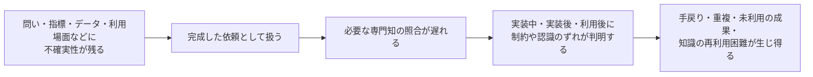
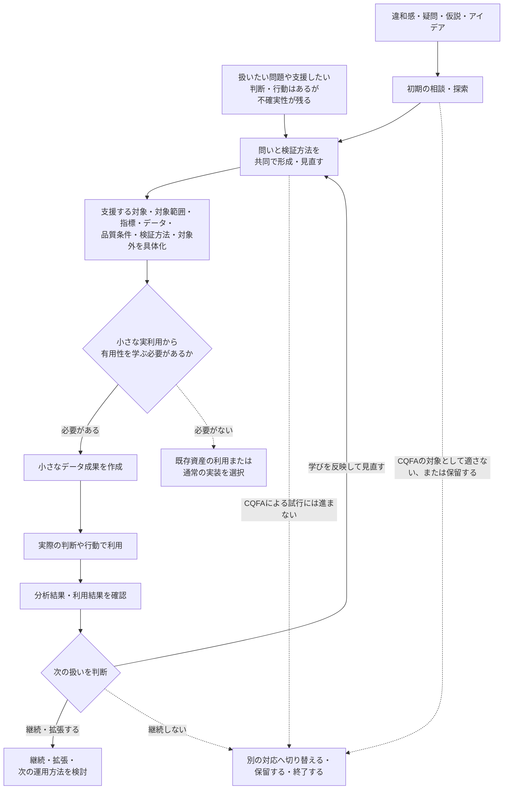
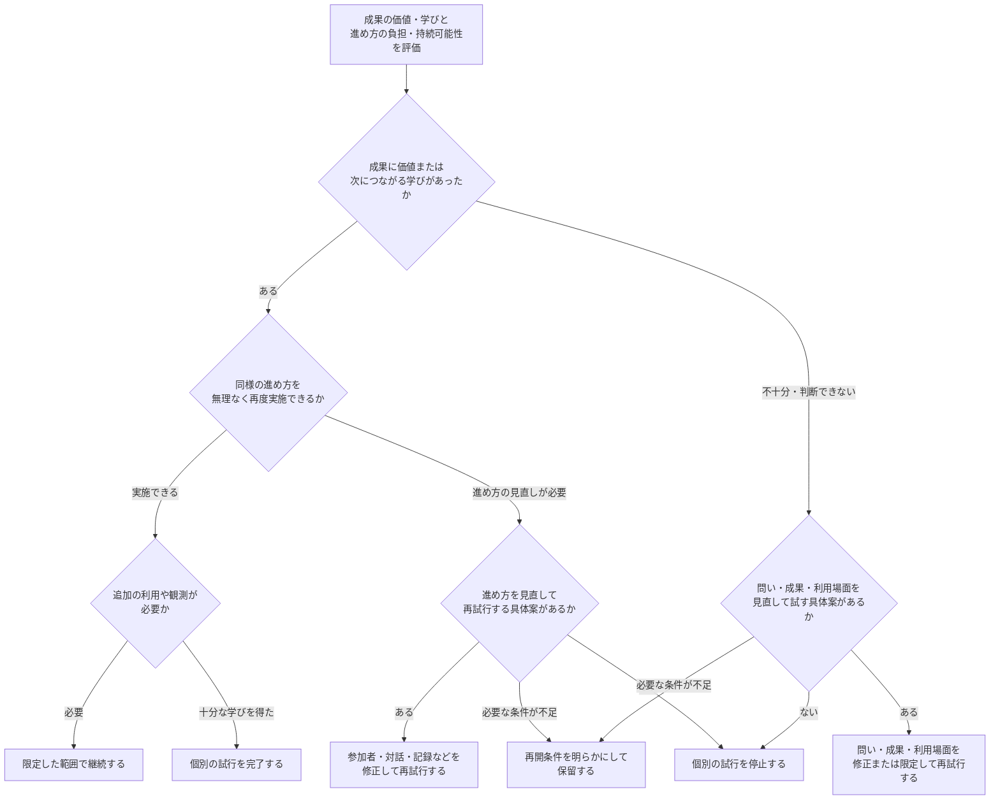

# Collaborative Question Framing for Analytics

## 分析のための問いを共同で形成し、小さな実利用から学ぶためのConcept Proposal

## 文書情報

| 項目 | 内容 |
|---|---|
| 文書種別 | Concept Proposal |
| 状態 | Public Draft（Rev1） |
| 作成日 | 2026-06-30 |
| 想定読者 | データ・分析チームの責任者またはリード、試行対象となる業務領域の責任者 |
| 求める判断 | 現在のデータ利活用にCQFAを試す理由があるかを確認し、理由がある場合には、適切な一件を対象とした限定的な試行を検討できるか |

> 本資料はCQFAの要点を簡潔に示すConcept Proposalである。各章末には、背景や根拠を補足する詳細版の該当箇所へのリンクを示す。

## 提案概要

本資料は、データ利活用に関する着想や、問い、指標、必要なデータ、利用場面、検証方法などに不確実性が残る状況を対象に、Collaborative Question Framing for Analytics（CQFA：仮称）を提案する。

CQFAは、必要な専門知を早い段階から持ち寄り、業務上の意味とデータ上の可能性・制約を照らし合わせながら、分析のための問いと検証方法を共同で形成する進め方である。

問いと検証方法を共同で形成した後、想定するデータ成果が実際の判断や行動に役立つかを確かめる必要がある場合には、小さなデータ成果を作成して利用する。その結果をもとに、問い、指標、データ、実装、利用方法を見直す。

本資料は、CQFAの恒久導入や全社展開の承認を求めるものではない。現在の進め方を補完する可能性があり、試す理由がある場合に、適切な一件を対象とした限定的な試行を検討できるか、その判断材料を示す。

CQFAは、完成した標準手法や実証済みの運用モデルではなく、限定的な試行を通じて検証すべき提案仮説である。試行によって得られる価値が、参加者の追加負担やリスクに見合うかを確認する。

---

## 1. 提案の背景と課題

> **問いが固まる前から、必要な専門知を持ち寄る**

### 課題の定義

業務上の困りごとや支援したい判断・行動が認識されていても、最初から分析可能な問いとして整理されているとは限らない。問い、指標、必要なデータ、利用場面、品質条件、検証方法などに不確実性が残ったまま、完成した依頼として専門職間の分担と受け渡しを進める場合がある。

依頼内容や条件が十分に明確であれば、既存の分担型フローは効率的に機能し得る。

本Proposalが課題として扱うのは、不確実性が残る状態を確定済みとして扱い、業務上の意味やデータ上の可能性・制約を、問いや実装を変更できる段階で十分に照らし合わせられない場合である。

代表的には、次のような問題が起こり得る。

- 必要な履歴、粒度、鮮度などのデータ上の制約が、実装を開始した後に判明する
- 業務上の意味や判断条件と、指標の定義や対象範囲が一致していない
- 作成した指標、分析、ダッシュボードなどが、実際の判断や行動に十分利用されない
- 個別対応で確認した定義、制約、例外条件が、次の利用で参照・再利用できる形に残らない

### なぜこの課題を扱うのか

データ利活用に必要な知識は、一つの職種や依頼者だけに集約されているとは限らない。

業務上のステークホルダーやドメインエキスパートは、業務文脈、判断基準、行動、例外条件を理解している。一方、データ・分析の専門職は、分析方法、指標の意味、データの粒度や履歴、品質、取得・運用上の制約を理解している。

これらの専門知が成果物の完成後に初めて照合されると、問い、指標、データ、実装を見直すための手戻りが大きくなり得る。また、成果物が技術的には完成していても、想定した判断や行動に役立つかは、実際に利用するまで分からない場合がある。

そのため、不確実性が残る案件では、完成した依頼を待つだけでなく、問いや実装をまだ変更できる段階で必要な専門知を持ち寄り、何を確認し、どのように有用性を確かめるのかを具体化する余地がある。

### CQFAを検討する状況

Collaborative Question Framing for Analytics（CQFA：仮称）は、すべてのデータ利活用に適用する進め方ではない。依頼の条件と成果の有用性が十分に明確な場合には、既存の分担型フローを利用できる。

本Proposalでは、CQFAを補完的な進め方として検討する状況を、次の二つに整理する。

**問いや成果の有用性に不確実性が残る場合**

- まだ問いとして整理されていない違和感、疑問、仮説、アイデアがある
- 扱いたい問題や支援したい判断・行動は認識されているが、何を確認すべきかが明確でない
- 指標、対象範囲、比較軸、除外条件などを、業務上の意味と照らして具体化する必要がある
- 利用可能なデータ、粒度、履歴、鮮度、品質上の制約を踏まえて、問いや検証方法を見直す必要がある
- 作成するデータ成果が実際の判断や行動に役立つかを、実利用から確かめる必要がある

**現在の運用で問題が繰り返されている場合**

- 要求確認の往復や、成果物を作成した後の手戻りが繰り返されている
- 既存の指標、モデル、過去の判断を十分に確認できないまま、同じ、または類似した指標やデータモデルが別々に作られている
- 指標の定義、データ上の制約、例外条件、過去の判断が特定の担当者に集中し、他の案件で参照・再利用しにくい
- 同じデータ調査、定義の確認、制約の説明を依頼ごとに繰り返している

| 状況 | 基本的な選択 |
|---|---|
| 問い、利用場面、指標定義、必要なデータ、品質条件、成果の有用性が十分に明確である | 既存の分担型フローを利用する |
| 着想、問い、指標、データ、利用場面、検証方法、成果の有用性などに不確実性が残る | CQFAを補完的に検討する |
| 手戻り、重複、知識の集中、同じ調査の反復などが続いている | 原因を確認し、CQFAを含む改善策を比較する |

ただし、これらの兆候があることだけで、直ちにCQFAの試行が適切だと判断できるわけではない。既存の依頼方法、文書、Catalog、データ資産の責任範囲、役割分担、データ基盤などの改善によって対応できるかを確認したうえで、異なる専門知を早い段階から持ち寄る試行に価値があるかを検討する。

これらの状況に対して、CQFAでは必要な専門知を早い段階から持ち寄り、業務上の意味とデータ上の可能性・制約を照らし合わせながら、分析のための問いと検証方法を共同で形成する。

ここでいう「分析のための問い」には、質問文だけでなく、誰のどの判断や行動を支援するのか、何を確認するのか、どの範囲・指標・データを扱うのか、どのように有用性を確かめるのかまでを含む。

> **詳細版参照**
>
> - [§1.2「完成した依頼の受け渡しで起こり得る問題」](./detailed/chapters/01-problem-and-joint-discovery.ja.md#sec-1-2)
> - [§1.3「問いを共同で具体化する必要性」](./detailed/chapters/01-problem-and-joint-discovery.ja.md#sec-1-3)
> - [§2.1「提案の定義と適用範囲」](./detailed/chapters/02-cqfa-model.ja.md#sec-2-1)

---

## 2. 提案する進め方

> **問いを共同で形成し、小さな実利用から学ぶ**

### CQFAの入口と基本方針

本Proposalでは、CQFAの入口を、出発点の異なる次の二つとして整理する。

- 違和感、疑問、仮説、アイデアなど、まだ問いとして整理されていない着想から、初期の相談・探索を始める
- 扱いたい問題や支援したい判断・行動は認識されているが、不確実性が残る状態から、問いと検証方法の共同形成を始める

これらは、順番に通過する固定工程ではない。初期の相談・探索から問いの共同形成へ進む場合もあれば、扱いたい問題がすでに認識されているため、共同形成から直接始める場合もある。

また、すべての相談や共同形成が、データ成果の作成へ進むわけではない。

### 問いと検証方法の共同形成

共同形成では、最初に示された問題や問いを、そのまま分析や実装へ移さない。業務上の意味とデータ上の可能性・制約を照らし合わせ、次の内容を修正可能な状態で具体化する。

| 確認する領域 | 主な内容 |
|---|---|
| 支援する対象 | 誰のどの判断や行動を支援するのか、何が変われば価値があるのか |
| 問いの範囲 | 何を確認するのか、対象範囲、指標、比較軸、除外条件、今回は扱わない内容 |
| データ上の条件 | 利用可能なデータ、粒度、履歴、鮮度、品質、既知の不足や制約 |
| 検証方法 | どのような分析や実利用から有用性を確かめ、何をもって次の判断を行うのか |

ここで目指すのは、完全な要件書を作成したり、すべての条件を事前に固定したりすることではない。

問い、指標、データ、実装、利用方法の前提を関係者が確認でき、分析結果や実利用から得た学びに応じて見直せる状態を作ることである。

### 小さな実利用とフィードバック

問いと検証方法を共同で形成した後も、想定するデータ成果が実際の判断や行動に役立つかを実利用から確かめる必要がある場合には、小さなデータ成果を作成し、実際の利用場面で使用する。

ここでいう「小さなデータ成果」は、単に短期間または低コストで作る成果を意味しない。次の判断に必要な学びを得られる範囲へ、対象、指標、データ、利用者、期間などを限定した成果を指す。

また、成果を作成した時点で試行を完了とはしない。実際の判断や行動で利用し、分析結果と利用結果の両方からフィードバックを得るところまでを含める。

| 実利用から得られること | 主な次の判断 |
|---|---|
| 想定した判断や行動に役立った | その利用場面での継続を検討する |
| 他の利用場面でも価値が見込める | 拡張・再利用の価値と、共有・維持の負担を検討する |
| 分析結果が仮説や想定と異なった | 問い、仮説、指標、比較方法を見直す |
| データや実装上の制約が明らかになった | データ、モデル、品質条件、検証方法を見直す |
| 利用されない、または新しい疑問や例外が見つかった | 利用場面、問い、対象範囲、実装を見直す |

このフィードバックは、作成した成果の修正だけでなく、その利用場面での継続、他の利用場面への拡張・再利用、または当初の問題の捉え方や問い自体の見直しを判断するために使う。拡張や再利用は、他の利用場面での価値と、共有・維持に必要な負担を確認したうえで検討する。

### 必要な専門知と役割の境界

CQFAでは、すべての案件にすべての職種が参加することや、参加者全員が同じ作業を担当することを前提としない。

参加者は職種名だけで決めるのではなく、案件に残っている不確実性と、それを確認するために必要な専門知を基準に選ぶ。職務の境界は組織や案件によって異なるため、一人が複数の専門知を持つ場合や、同じ観点を複数の参加者が持ち寄る場合もある。

代表的な参加者と、持ち寄り得る専門知の例を次に示す。

| 参加者・専門領域の例 | 主に持ち寄り得る専門知 |
|---|---|
| ステークホルダー・業務領域の専門家 | 業務上の目的、判断、行動、定義、例外条件、優先度、実際の利用場面 |
| データアナリスト | 仮説形成、分析設計、統計的手法、比較方法、解釈、分析結果から言えることと言えないこと |
| アナリティクスエンジニア | 指標定義、データ粒度、モデル、品質条件、既存のデータ資産、再現可能性、再利用可能性 |
| データエンジニア | データ取得、履歴、鮮度、処理、基盤、運用、上流システム上の制約 |

必要に応じて、プロダクト、財務、法務、セキュリティなど、対象となる問題に関係する他の専門知も加える。

アナリティクスエンジニアは、業務上の概念を指標、データ粒度、モデル、品質条件、既存のデータ資産へ接続する。これにより、小さなデータ成果を再現可能な形で作成し、実利用から得た学びを技術的な定義や実装へ反映することを支える。

また、実利用で得た知識や実装のうち、他の利用場面でも価値があり、共有・維持の負担に見合うと判断されたものを、指標定義、モデル、テスト、Catalog、READMEなどへ反映し、共有・再利用できる形で残すことを支える。

一方で、アナリティクスエンジニアは、業務上の問題、優先度、成果の有用性を単独で決定する役割ではない。すべての相談の受付担当や指標の承認者になるものでもなく、職種間の調整やCQFA全体の運用を一元的に担うものでもない。

CQFAにおける対等な協働は、専門性や責任の違いをなくすことではない。各参加者が自身の専門的な判断と責任を維持しながら、問い、指標、データ、実装を変更できる段階で、それぞれの判断を相互に照らし合わせることを意味する。

### CQFAの全体像

ここまでに示した二つの入口、問いと検証方法の共同形成、小さな実利用、フィードバック後の判断を、全体の流れとして次に示す。

実線は、CQFAで前面に置く学習の経路と、実利用後の主要な判断を示す。点線は、共同形成やデータ成果の作成を続けない場合に選び得る判断を示す。

既存資産の利用、通常の実装、別の対応への切り替え、保留、終了も、相談や共同形成を通じて選び得る有効な判断として扱う。

> **着想の背景**
>
> CQFAは、Quality Assurance（QA：品質保証）が要件定義や受け入れ条件の設計など、まだ変更できる段階から関わり、曖昧な定義や受け入れ条件のまま実装が進むことや、実装終盤での大きな手戻りを避けるShift Left（シフトレフト）の考え方と、小さな成果を実際に利用して学ぶアジャイルの短いフィードバックループから着想を得ている。
>
> 本Proposalは、これらをデータ利活用へ応用し、指標やモデルの実装後ではなく、問い、利用目的、品質条件、検証方法を形成する段階から必要な専門知を持ち寄ることが有効なアプローチになるのではないか、という仮説から始まった。

> **詳細版参照**
>
> - [§2.2「二つの入口と共同発見の中心モデル」](./detailed/chapters/02-cqfa-model.ja.md#sec-2-2)
> - [§2.3「役割関係と持ち寄る専門知」](./detailed/chapters/02-cqfa-model.ja.md#sec-2-3)
> - [§2.4「専門知が問いと実装を相互に修正する」](./detailed/chapters/02-cqfa-model.ja.md#sec-2-4)
> - [§2.5「Analytics Engineerの貢献と境界」](./detailed/chapters/02-cqfa-model.ja.md#sec-2-5)
>
> **着想の詳細**
>
> - [§1.4「QA職能資料の作成から得た着想」](./detailed/chapters/01-problem-and-joint-discovery.ja.md#sec-1-4)
> - [§1.5「アジャイル資料の作成から得た着想」](./detailed/chapters/01-problem-and-joint-discovery.ja.md#sec-1-5)

---

## 3. 限定的な試行と判断基準

> **小さく試し、価値と負担の両方から判断する**

CQFAは、完成した標準手法や実証済みの運用モデルではない。そのため、最初から恒久的な制度や全社共通のプロセスとして導入するのではなく、CQFAという進め方自体を検証対象として扱う。

試行では、一つの問題と利用場面に対象を限定し、小さなデータ成果を実際に利用する。その結果から、データ成果と問いについて得られた価値だけでなく、対話、準備、調整、参加、記録、維持に必要だった負担も確認する。

### 試行を検討する条件

第1章で示した問題や兆候があることだけで、直ちにCQFAを試すとは判断しない。既存の依頼方法、文書、役割分担、データ基盤などの改善や、データ品質、人員、権限など別の原因への対応で扱えるかを先に確認する。

そのうえで、次の条件を確認できる場合に、限定的な試行を検討する。

| 確認事項 | 試行を検討できる状態 |
|---|---|
| CQFAを試す理由 | 問いの形成や実利用からの学習に、現在の進め方を補完する価値が見込まれる |
| 対象 | 一つの業務上の問題、または支援したい判断・行動と、具体的な利用場面を選べる |
| 実利用へ進む理由 | 成果が実際の判断や行動に役立つかを、実利用から確かめる必要がある |
| 利用者 | 小さなデータ成果を実際の業務場面で利用し、結果を確認できる人がいる |
| 専門知 | 今回残っている不確実性を確認するために必要な専門知を持ち寄れる |
| 境界 | 対象、期間、対象外を限定し、試行後の判断内容と、その判断に関わる人を明らかにできる |

これらを確認できない場合には、CQFAの試行へ進まず、既存の進め方の改善、別の原因への対応、保留または終了を選ぶ。

### 試行で限定する範囲

試行は、組織全体のデータ利活用や指標体系を対象とせず、一つの問題、一つの利用場面、小さなデータ成果へ範囲を絞る。

また、新しい定例会議、申請、承認経路、管理文書を設けることは前提としない。既存の相談機会、依頼確認、レビュー、チケット、コメント、文書などを優先して利用する。

| 項目 | 基本方針 |
|---|---|
| 問題・利用目的 | 一つの業務上の問題、または支援したい判断・行動に絞る |
| 利用者・利用場面 | 誰が、いつ、どの判断や行動に利用するかを明らかにする |
| 参加者 | 今回必要な専門知を持つ人だけが、必要な時点で関わる |
| 対話 | 既存の場と非同期の確認を優先し、同期的な対話を必要な内容に限定する |
| 期間 | 終了または振り返りの時点をあらかじめ定める |
| データ成果 | 次の判断に必要な学びを得られ、実際に利用できる範囲に限定する |
| 品質・制約 | 実利用に必要な品質条件と、暫定的な処理、既知の制約、利用上の注意を明らかにする |
| 対象外 | 今回は扱わない部門、商品、指標、例外処理、共通化などを明らかにする |
| 完了条件 | 成果の作成ではなく、実際の利用とフィードバックの確認までを含める |
| 記録 | 次の判断に必要な内容だけを、既存のチケット、定義、テスト、Catalog、READMEなどへ残す |

小さなデータ成果は、単に短期間または低コストで作る成果ではない。今回の問いと利用場面について、次の判断に必要な学びを得られる範囲へ限定した成果である。

試行段階から、本番運用と同等の自動化、網羅的な例外処理、詳細な文書化、組織共通のモデルへの移行を求めない。一方で、今回の実利用に必要な品質条件は維持し、暫定的な処理や既知の制約がある場合には利用者と共有する。

### 期待価値と負担・リスク

CQFAによって得られる可能性がある価値と、進め方によって生じ得る負担・リスクを、同じ試行の中で確認する。

ここで示す価値は実証済みの効果ではなく、負担・リスクも必ず発生すると断定するものではない。いずれも試行で確認する仮説として扱う。

| 評価する観点 | 確認したい価値・学び | 関連して確認する負担・リスク |
|---|---|---|
| 問いと認識の整合 | 判断、行動、対象範囲、指標、利用場面の認識差を、変更可能な段階で確認できたか | 初期対話、準備、日程調整などの負担が増える可能性がある |
| 制約の早期発見 | データ不足、粒度、履歴、品質、定義の違いなどを、成果物の完成前に確認できたか | 相談が特定の担当者へ集中し、通常業務の中断や待ち時間を生む可能性がある |
| 実利用からの学習 | 小さな成果が実際に利用され、問い、指標、データ、実装、利用方法の見直しにつながったか | 試行成果の作成、利用結果の確認、フィードバックの整理が必要になる |
| 過剰実装の抑制 | 既存資産の利用、対象の縮小、別の対応、保留、終了などを、過度に作り込む前に判断できたか | 対話を続けること自体が目的となり、着手や終了の判断が遅れる可能性がある |
| 持続可能性 | 得られた価値が、参加、対話、調整、記録に必要な負担に見合ったか | 責任の混同、優先順位の曖昧化、特定の人や職種への負担集中が生じる可能性がある |
| 再利用候補 | 他の利用場面でも検討する価値のある定義、制約、判断条件、データ成果が見つかったか | 価値が確認される前に共通化すると、モデル、テスト、文書などの維持負担が増える可能性がある |

初回の試行では、組織的な再利用効果が確認されたとは扱わない。確認するのは、他の利用場面での再利用を検討する価値のある候補が見つかったかまでとする。

知識や成果を共有・再利用できる資産へ移すかは、複数の利用場面での価値、再利用性、作成・維持の負担を確認した後に、個別試行の継続とは分けて判断する。

### 成果と進め方を分けて評価する

試行後は、次の二つを分けて評価する。

| 評価対象 | 主に確認する内容 |
|---|---|
| 問い・データ成果・利用 | 実際の判断や行動に利用されたか、問いや指標が具体化・修正されたか、データ上の制約や新しい学びが得られたか |
| CQFAという進め方 | 必要な専門知を適切な時点で持ち寄れたか、対話や調整の負担は妥当だったか、役割を混同せず再度実施できるか |

価値のあるデータ成果が得られても、過剰な会議、準備、調整、記録や、特定の参加者による例外的な努力によって成立している場合には、同じ進め方をそのまま継続しない。

反対に、進め方を軽量に実施できても、成果が利用されず、問い、判断、データについて有用な学びも得られなければ、その対象で試行を続ける理由は弱い。

評価には、既存のチケット、変更履歴、会議記録、利用者や参加者への短い確認など、通常業務の中で得られる情報を優先して利用する。評価のために新しい詳細な記録や計測を追加したり、結果を個人や職種の評価へ転用したりしない。

### 試行後の判断

試行後は、データ成果と問いについて得られた価値・学びと、進め方の負担・持続可能性を組み合わせて、次の対応を判断する。

これらは、単純な成功・失敗の分類ではない。

- **継続**：今回と同様の条件で、追加の利用や観測を行う
- **完了**：今回の問いと利用場面について必要な学びが得られ、追加の試行を行わない
- **修正・限定**：問い、成果、利用場面、参加者、対話方法、期間などを変更して再試行する
- **保留**：必要なデータ、利用場面、優先度、参加条件など、再開に必要な条件を明らかにして中断する
- **停止**：具体的な再試行の仮説がなく、その問いや利用場面について試行を続けない

一件の試行が有用だったことだけで、CQFAを全社的または恒久的な運用方法として採用しない。CQFAという進め方全体の採用は、複数の試行または一定期間の観測を通じて、価値と持続可能性が確認された場合に検討する。

個別の試行を停止した場合でも、そこで明らかになったデータ上の制約、定義の違い、利用条件などを、今後の判断に必要な範囲で残すことがある。成果に価値があっても、他の利用場面での再利用価値や維持負担が確認できない場合には、その利用場面に限定して維持する選択もある。

> **詳細版参照**
>
> - [§3.1「試行を検討する状況」](./detailed/chapters/03-small-trial-and-adaptation.ja.md#sec-3-1)
> - [§3.2「期待効果と負担・リスクの仮説」](./detailed/chapters/03-small-trial-and-adaptation.ja.md#sec-3-2)
> - [§3.3「業務を増やさないための設計原則」](./detailed/chapters/03-small-trial-and-adaptation.ja.md#sec-3-3)
> - [§3.4「限定した対象で小さく試す」](./detailed/chapters/03-small-trial-and-adaptation.ja.md#sec-3-4)
> - [§3.5「成果と進め方を分けて評価する」](./detailed/chapters/03-small-trial-and-adaptation.ja.md#sec-3-5)
> - [§3.6「評価観点と観測情報の候補」](./detailed/chapters/03-small-trial-and-adaptation.ja.md#sec-3-6)
> - [§3.7「試行の継続・適応・停止の判断条件」](./detailed/chapters/03-small-trial-and-adaptation.ja.md#sec-3-7)

> **提案する次の一歩**
>
> 現在のデータ利活用にCQFAを試す理由があり、既存の進め方の改善だけでは扱いにくい場合には、対象となる一件を選び、得られる価値・学びと参加者の負担の両方を確認する限定的な試行を検討する。
>
> 試す理由がない場合、別の原因への対応が必要な場合、または既存の進め方で十分な場合には、CQFAの試行へ進まない。

---

## 関連資料

- [詳細版を通読する](./detailed/full.ja.md)
- [参考文献](./appendices/references.ja.md)
- [CQFA資料の案内](./README.md)
- [Analytics資料一覧](../README.md)
