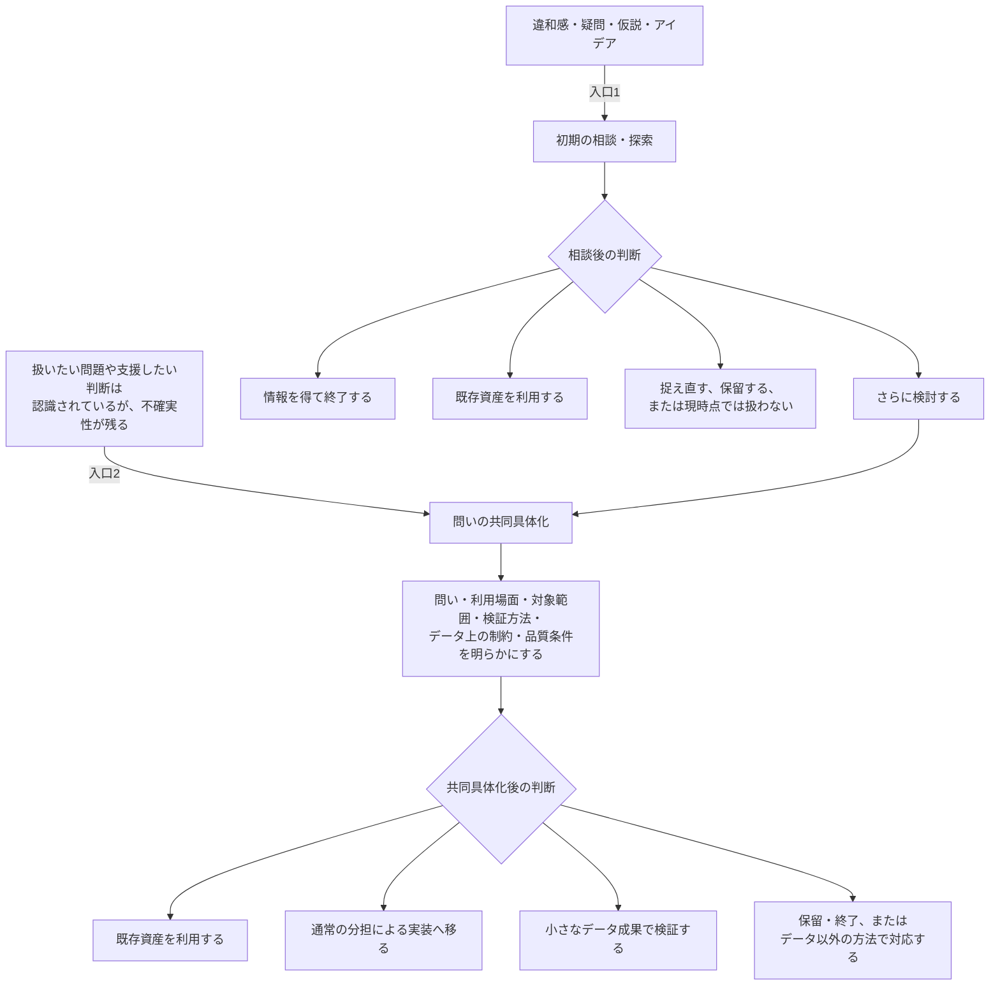
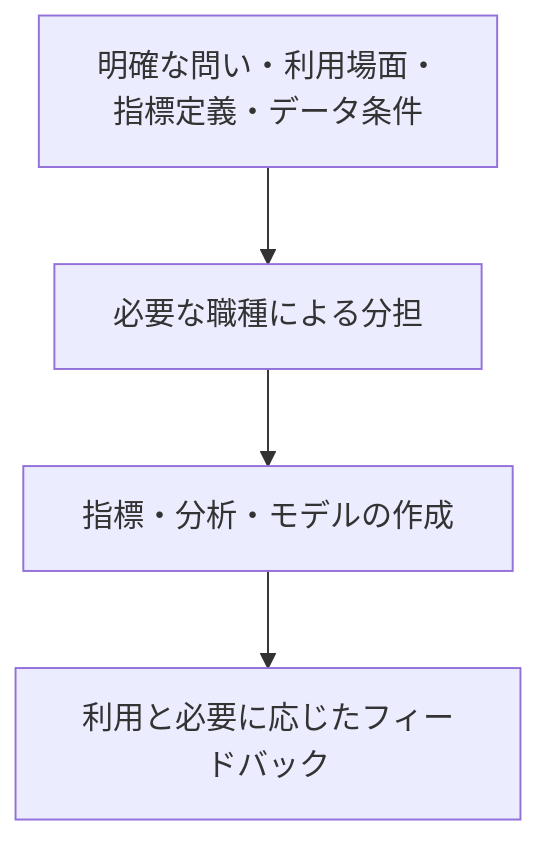
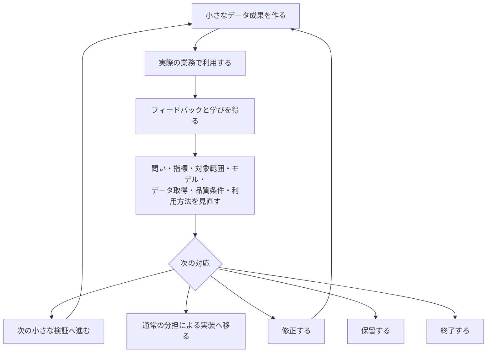
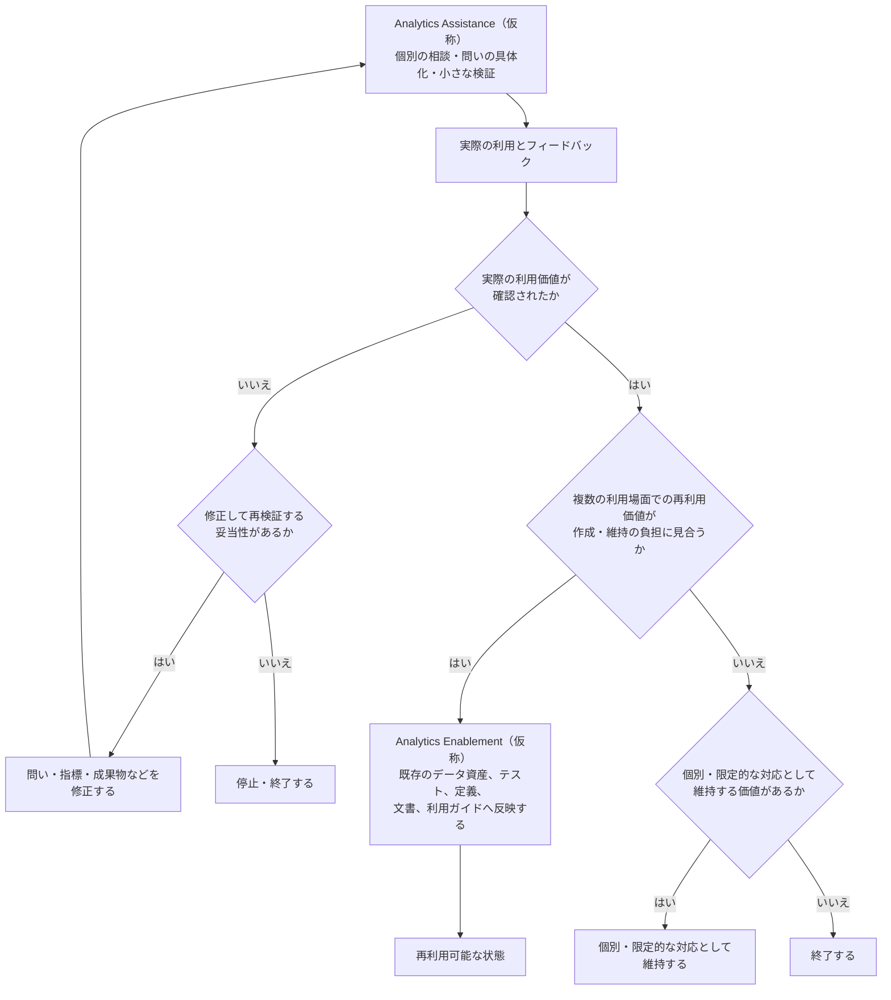

## 2. Collaborative Question Framing for Analytics

本章では、データ利用に不確実性が残る場合に、異なる専門知を持つ関係者が早い段階から関わり、業務上の意味とデータ上の可能性・制約を照らし合わせながら、分析のための問いと検証方法を共同で形成する進め方を、Collaborative Question Framing for Analytics（CQFA：仮称）として整理する。

CQFAでは、まだ問いになっていない違和感、疑問、仮説、アイデアを扱う初期の相談・探索と、扱いたい問題や支援したい判断を分析可能な問いへ変える共同具体化を区別する。共同具体化では、問いだけでなく、利用場面、対象範囲、指標、必要なデータ、品質条件、検証方法などを、案件に必要な専門知を持つ関係者が共同で明らかにする。

さらに、小さく検証する価値があると判断した場合には、小さなデータ成果を実際の判断や行動で利用し、分析結果や利用結果から得た学びを、問い、指標、データ、実装、利用方法の見直しへ戻す。また、その過程で得た知識や成果について、個別の利用場面を越えて再利用可能な資産や仕組みへ移す条件を検討する。

まず、本提案の定義と適用範囲を示し、条件が明確な依頼を分担して進める既存のフローとの関係を明らかにする。次に、CQFAへ入る二つの入口、小さな検証とフィードバック、個別の利用場面から得た知識や成果を再利用可能な資産や仕組みへ移す条件を説明する。

そのうえで、ステークホルダーやドメインエキスパート、Data Analyst（DA：データアナリスト）、Analytics Engineer（AE：アナリティクスエンジニア）、Data Engineer（DE：データエンジニア）などが持ち寄り得る専門知と役割関係、異なる専門知によって問いと実装を相互に修正する過程、Analytics Engineerの貢献と境界を整理する。最後に、商談停滞の分析を仮想例として、最初の問題意識が問い、指標、検証方法、利用方法へ具体化され、実際の利用結果に応じて修正される流れを示す。

---

<a id="sec-2-1"></a>

### 2.1 提案の定義と適用範囲

本Proposalでは、データ利用に関する着想や、問い、指標、必要なデータ、利用場面、検証方法などに不確実性が残る場合に、必要な専門知を持つ人が早い段階から関わり、業務上の意味とデータ上の可能性・制約を照らし合わせながら、分析のための問いと検証方法を共同で形成する。

さらに、小さなデータ成果を実際の判断や行動で利用し、分析結果や利用結果から得た学びを、問い、指標、データ、実装、利用方法の見直しへ戻す。この一連の進め方を、**Collaborative Question Framing for Analytics（CQFA：仮称）**と呼ぶ。

> ステークホルダー（業務上の利用者・責任者）や、ドメインエキスパート（業務領域の専門家）と、Data Analyst（DA：データアナリスト）、Analytics Engineer（AE：アナリティクスエンジニア）、Data Engineer（DE：データエンジニア）などが、案件に必要な範囲で専門知を持ち寄る。
>
> まだ問いになっていない違和感、疑問、仮説、アイデアについては、異なる観点からフィードバックを得る。その結果、さらに検討する価値がある場合には、誰のどの判断や行動を支援するのか、何を問いとして確認するのか、どの範囲を扱うのか、どのように検証するのかを共同で具体化する。
>
> 共同具体化の結果、小さく検証する価値があると判断した場合には、利用者が実際の判断や行動に使える小さなデータ成果を作成する。その利用から得た分析結果やフィードバックを、問い、指標、モデル、データ取得、提供・利用方法の見直しへ戻す。
>
> その過程で得た知識や成果については、個別の利用場面における価値だけでなく、他の利用場面でも再利用できるか、再利用可能な状態へ移すための作成・維持の負担が価値に見合うかを確認する。条件を満たすものだけを、既存のデータ資産、テスト、定義、Catalog（カタログ）、README、利用ガイドなどへ反映する。

CQFAは、一般化された既存の標準手法や、実証済みの運用フレームワークを示す名称ではない。

Quality Assistance / Quality Enablementと、アジャイルにおける小さな成果、短いフィードバックループ、継続的な適応から得た考え方を、分析のための問いを形成する過程とAnalytics Engineeringの文脈へ応用するための提案仮説である。

また、CQFAの目的は、すべての共同具体化を分析やデータ成果の作成へ進めることではない。初期の相談・探索や問いの共同具体化の結果として、既存の指標や成果物を利用する、問題を別の観点から捉え直す、検討を保留する、または現時点では扱わないと判断することも含まれる。

同様に、小さなデータ成果から価値が得られた場合でも、すべての知識や成果を再利用可能な資産や仕組みへ移すわけではない。再利用可能な状態への移行は、個別の利用における価値とは別に、複数の利用場面における再利用性と、作成・維持の負担を確認したうえで判断する。

#### 2.1.1 二つの関与を区別する

CQFAには、出発点、目的、主な結果が異なる二つの関与が含まれる。

|  | 初期の相談・探索 | 問いの共同具体化 |
|---|---|---|
| 出発点 | 違和感、疑問、仮説、アイデアなど、まだ問いとして整理されていない着想 | 扱いたい問題や支援したい判断は認識されているが、分析のための問いとして不確実性が残る状態 |
| 目的 | 異なる観点を得て、問題の捉え方や検討する価値を探る | 問い、利用場面、対象範囲、指標、必要なデータ、品質条件、検証方法などを明らかにする |
| 主な結果 | 問いの候補、既存資産の発見、問題の捉え直し、保留、終了 | 小さな検証、既存の分担型フローへの移行、修正、保留、終了 |
| データ成果の作成 | 前提としない | 必要性が確認された場合だけ作成する |

#### 初期の相談・探索

CQFAは、すでに一定の形になった問いだけを対象とするものではない。

業務上の違和感、疑問、仮説、思いついたアイデアなど、まだ分析依頼や検証可能な問いとして整理されていない段階でも、その論点に関係するデータ専門職または他職種へ投げかけ、異なる観点からフィードバックを得るための相談機会として利用できる。

この段階の目的は、直ちに分析やデータ成果の作成を開始することではない。

対話を通じて、たとえば次を確認する。

- どのような業務上の意味や可能性があるか
- 関係する既存の指標、データ、成果物があるか
- データで確認できる部分と、データ以外で考えるべき部分は何か
- 別の問題や問いとして捉え直す必要があるか
- 分析のための問いとして、さらに具体化する価値があるか

その結果、問いの候補が生まれる場合もあれば、既存の成果物を利用する場合、別の問題として捉え直す場合、保留する場合、現時点では扱わないと判断する場合もある。

初期の相談・探索は、それ自体で完結し得る。すべての相談を問いの共同具体化やデータ成果の作成へ進めることは前提としない。

#### 問いの共同具体化

一方、扱いたい問題や支援したい判断は認識されているものの、問い、指標、必要なデータ、利用場面、検証方法などに不確実性が残る場合には、必要な専門知を持ち寄り、分析のための問いと検証方法を共同で具体化する。

この段階では、たとえば次を明らかにする。

- 誰のどの判断や行動を支援するのか
- 何を問いとして確認するのか
- どの対象範囲を扱うのか
- どの指標や比較軸を利用するのか
- どのデータを利用できるのか
- どのような制約や既知の不足があるのか
- どの程度の品質と鮮度が必要か
- どのような分析や利用によって問いを検証するのか
- 何をもって次の判断を行うのか
- 今回は何を扱わないのか

目的は、最初に提示された問題や問いを、そのまま分析や実装へ移すことではない。

業務上の意味とデータ上の可能性・制約を照らし合わせ、最初の問題の捉え方、問い、指標、対象範囲、検証方法を修正できる段階で具体化する。これにより、認識のずれやデータ上の制約が、成果物の完成後や利用後に初めて判明する可能性を抑えながら、検証すべき内容と次の対応を明らかにする。

初期の相談・探索から問いの共同具体化へ進む場合もあれば、扱う問題や支援したい判断がすでに認識されているため、問いの共同具体化から直接始める場合もある。

#### 2.1.2 明確な依頼を分担して進める既存フローとの関係

CQFAは、明確な問いや指標作成の依頼を起点として、必要な職種が分担しながら進める既存のフローを含む名称ではない。

依頼の目的、利用場面、指標定義、必要なデータ、品質条件が明確であり、既存の指標やデータ資産を利用できる場合には、CQFAを利用せず、専門職間の分担と受け渡しによって効率的に進めることができる。

```text
明確な問い・指標作成の依頼
        ↓
必要な職種による分担
        ↓
指標・分析・モデルの作成
        ↓
利用と必要に応じたフィードバック
```

一方、次のような場合には、既存の分担型フローとは別の進め方として、CQFAを選択できる。

- 問いがまだ違和感、疑問、仮説、アイデアの段階にある
- 誰のどの判断を支援するのかが明確でない
- 指標の意味や対象範囲に複数の解釈がある
- 必要なデータ、履歴、粒度、鮮度が分からない
- どのような分析や利用によって問いを検証するのかが明確でない
- 実際に判断や行動へ利用できるかを小さく確認する必要がある
- 複数の専門知を持ち寄らなければ、問いや検証方法を決めにくい

CQFAによって問い、指標、利用場面、必要なデータ、品質条件、検証方法などが明確になった後は、必要に応じてCQFAにおける共同具体化を終え、既存の分担型フローによる実装へ移ることができる。

したがって、CQFAと既存の分担型フローは、同じ進め方の内部にある二つの経路ではない。

既存の分担型フローは、条件が明確な依頼を効率的に実装するための進め方である。一方、CQFAは、着想や問い、指標、データ、利用場面、検証方法などに不確実性が残る場合に、分析のための問いと検証方法を共同で形成するための進め方である。

両者は、データ利用の状況に応じて別々に選択される。また、CQFAによって問いと条件が明確になった後に、既存の分担型フローへ移行する形で接続することもできる。

CQFAは、現在の運用で手戻り、定義差、意図しない重複が繰り返されている場合や、業務上の困りごとやアイデアを分析可能な問いへ変えるための相談機会が不足している場合に、既存の分担型フローとは別の補完的な選択肢となり得る。

---

<a id="sec-2-2"></a>

### 2.2 二つの入口と共同発見の中心モデル

本Proposalでは、Collaborative Question Framing for Analytics（CQFA：仮称）の共同発見モデルを、二つの入口から整理する。

1. まだ問いになっていない着想から、初期の相談・探索を始める
2. 扱いたい問題や支援したい判断は認識されているが、不確実性が残るため、問いの共同具体化から始める

この二つは、順番に通過する工程ではなく、問いや着想の状態に応じて選択できる入口として位置づける。

初期の相談・探索から問いの共同具体化へ進む場合もあれば、扱いたい問題がすでに認識されているため、問いの共同具体化から直接始める場合もある。

また、初期の相談・探索や問いの共同具体化を行っても、必ずデータ成果の作成へ進むわけではない。



**図2-1　共同発見モデルの二つの入口と、相談・共同具体化後の判断**

#### 2.2.1 明確な依頼から始まる既存の分担型フロー

問い、利用場面、指標定義、必要なデータ、品質条件が明確である場合には、共同発見モデルを経由せず、必要な職種の分担によって実装を進めることができる。

この進め方は、CQFAによって置き換えられるものではない。

初期の相談・探索や問いの共同具体化によって条件が明確になった後に、この分担型フローへ移る場合もある。



**図2-2　条件が明確な依頼に対する既存の分担型フロー**

#### 2.2.2 初期の相談・探索は必須工程ではない

初期の相談・探索は、まだ問いになっていない着想を扱うための入口である。

扱いたい問題や支援したい判断がすでに認識されている場合には、初期の相談・探索を経ず、問いの共同具体化から始められる。

また、初期の相談・探索を行っても、共同具体化へ進まない場合がある。

この段階では、データ成果を作らないこと、既存の成果物を利用すること、別の問題として捉え直すこと、現時点では取り組まないことも有効な結果として扱う。

#### 2.2.3 問いの共同具体化は実装開始の承認ではない

共同具体化の目的は、すべての相談を分析案件や実装案件へ変換することではない。

必要な専門知を持ち寄り、次の対応を判断できる状態を作ることにある。

共同具体化の結果には、次が含まれる。

- 既存の指標、モデル、レポート、分析結果を利用する
- 通常の分担による実装へ移る
- 対象範囲を限定して小さく検証する
- 別の問いとして捉え直す
- 必要なデータが得られるまで保留する
- 現時点では取り組まない
- データ以外の方法で対応する

したがって、共同具体化を行ったこと自体は、成果物の作成や優先順位の確定を意味しない。

#### 2.2.4 小さなデータ成果を利用して学ぶ

問いや検証方法の妥当性を対話だけでは判断できない場合や、実際の利用を通じて価値を確認する必要がある場合には、利用者が次の判断に使える小さなデータ成果を作り、実際の業務で利用する。

小さなデータ成果には、たとえば次がある。

- 一つの問いに対する探索的分析
- 一つの指標候補
- 限定した部門や利用者向けの簡易な可視化
- 限定したデータ品質条件の確認結果
- 限定した期間や対象の履歴データ抽出
- 限定した対象範囲の検証用中間モデル
- 一つの意思決定場面で確認できる最小出力

小さいことは、品質が低いことや説明できないことを意味しない。

少なくとも次を明らかにする。

- 誰が利用するのか
- どの判断を支援するのか
- 何を検証するのか
- 指標や出力が何を意味するのか
- 既知の制約は何か
- どの程度の品質と鮮度が必要か
- 利用後に何を確認するのか



**図2-3　小さなデータ成果の実利用から学び、次の対応を判断するフィードバックループ**

#### 2.2.5 フィードバックによって成果物だけでなく問いも変える

データ成果の利用後には、表示や操作性だけでなく、問いそのものが妥当だったかを確認する。

たとえば次を確認する。

- 指標が業務実態を表しているか
- 関係者が同じ意味で解釈しているか
- 実際の判断や行動に利用されたか
- 想定外のパターンが見つかったか
- 新しい問いや別の解釈が生まれたか
- 追加データが必要か
- 対象範囲や閾値を変更すべきか
- 検証を継続、修正、終了のどれにするか

得られた学びは、次へ戻す。

- 問い
- 指標
- 対象範囲
- モデル
- データ取得
- 品質条件
- 利用方法
- 次の優先順位

#### 2.2.6 AssistanceからEnablementへ選択的に移行する

個別の問題に対して必要な専門知を持ち寄り、問いの具体化や小さな検証を進める段階を、本Proposalでは説明上**Analytics Assistance（仮称）**と呼ぶ。

Analytics Assistanceにおける相談や検証から得た知識のうち、複数の利用場面で再利用する価値があり、作成・維持の負担に見合うものを、再利用可能な状態へ移す活動を**Analytics Enablement（仮称）**と呼ぶ。



**図2-4　Analytics Assistanceにおける利用価値と、Analytics Enablementへの選択的な移行判断**

反映先には、たとえば次がある。

- 既存のデータモデル
- 共通指標
- データ品質テスト
- 指標・モデル定義
- データ系譜
- データカタログ（Catalog）
- README
- 利用ガイド
- 分析API

これらを組み合わせて提供することで、利用者は個別依頼を繰り返さずに、定義済みの指標を確認し、信頼できるデータ資産を用いて分析しやすくなる。

このような利用環境は、セルフサービス分析（Self-service analytics）を実現するための基盤の一つとなり得る。

すべての分析や相談をEnablementへ移す必要はない。

次のようなものは、共通的なデータ資産や利用方法へ移すのではなく、個別・限定的な対応として維持するか、一度限りまたは暫定的な対応として終了する方が適切な場合がある。

- 一度しか利用しない分析
- 利用価値が確認されていない仮説
- 頻繁に変更される暫定指標
- 再利用可能性が低い特殊条件
- 作成・維持の負担が期待される再利用価値を上回るもの

---

<a id="sec-2-3"></a>

### 2.3 役割関係と持ち寄る専門知

共同発見では、ステークホルダー、ドメインエキスパート、Data Analyst（DA：データアナリスト）、Analytics Engineer（AE：アナリティクスエンジニア）、Data Engineer（DE：データエンジニア）などが、固定された工程順に沿って成果物を受け渡すのではなく、対象となる問題に必要な専門知を持ち寄って検討する。

各参加者・専門領域が主に持ち寄り得る観点は、次のように整理できる。

| 参加者・専門領域 | 主に持ち寄り得る観点 |
|---|---|
| ステークホルダー / ドメインエキスパート | 業務上の困りごと、業務文脈、判断基準、実際の業務フロー、例外条件、利用場面、結果を受けて取り得る行動 |
| Data Analyst | 仮説形成、分析設計、比較対象、分解軸、統計的解釈、可視化、代替説明、分析結果から得られる示唆 |
| Analytics Engineer | 指標の意味、データの粒度、データモデリング、意味的一貫性、データ品質、既存資産との関係、再利用可能性 |
| Data Engineer | データ取得、履歴保持、鮮度、更新頻度、パイプライン、外部システムとの連携、可用性、継続的な運用可能性 |

ステークホルダーやドメインエキスパートは、単なる依頼者ではない。

データだけからは判断できない業務上の意味、現場で生じる例外、結果を利用する場面、その後に取り得る行動についての知識を持っている。

一方、データ専門職は、それぞれの専門性に応じて、業務上の問題をどのように分析できるか、どのデータが利用できるか、どのような指標やデータ構造として表現できるか、どの程度の品質や鮮度で継続的に提供できるかという観点を持っている。

これらの観点のいずれか一つだけで、問いや次の対応を決められるとは限らない。

ただし、この表は固定的な職務範囲や分業を定義するものではない。

実際の職務境界は、組織の規模、チーム構成、技術基盤、扱うデータ、個人の専門性などによって異なる。

たとえば、DAがデータモデルを実装する場合もあれば、AEが分析や可視化まで担当する場合、DEが分析基盤上のモデリングを担当する場合も考えられる。また、一人が複数の観点を持ち寄ることもあれば、同じ職種名でも組織によって担当範囲が異なる場合もある。

そのため、本Proposalで重要なのは、特定の肩書きを必ず参加させることではない。

対象となる問題に対して、業務上の意味、分析方法、指標とデータ構造、データ取得と運用可能性など、判断に必要な観点を持つ人が、必要な範囲とタイミングで関われることである。

また、対等な協働は、各参加者の責任や専門性の違いをなくすことを意味しない。

業務上の判断、優先順位、分析設計、指標定義、データ実装、運用などの責任は、それぞれの組織と案件に応じて分担される。共同発見によって全員が同じ判断権限を持つのではなく、各自が自らの専門的な観点を示し、他の観点からの問いや制約を受け取れる関係を作る。

したがって、すべての案件ですべての職種が常時参加することや、固定された参加者による新しい会議体を設けることは前提としない。

既存の指標やデータ資産だけで対応できる場合には、追加の共同検討を設けず、通常の分担で進められることもある。業務上の意味や技術的な条件に不確実性がある場合には、必要な専門知を持つ人が追加で関わる。

共同発見における役割関係は、全員を同じ作業へ集めることではなく、必要な専門知を持つ人が、問いや実装を見直せる段階で関われる状態を作ることである。

次節では、各参加者の専門知を持ち寄ることで、最初の問い、指標、検証方法、実装案がどのように見直され、具体化されるかを整理する。

---

<a id="sec-2-4"></a>

### 2.4 専門知が問いと実装を相互に修正する

共同発見の価値は、複数の参加者から意見を集め、それらを並べることだけにあるのではない。

異なる専門知を照らし合わせることで、最初に想定していた問い、指標、検証方法、対象範囲、データ取得、実装案の前提を見直せることに意味がある。

職務境界は組織や案件によって異なり、同じ観点を別の職種や複数の参加者が持ち込む場合もある。そのうえで、各専門領域が修正の主な起点となる例を示すと、次のように整理できる。

- ステークホルダーやドメインエキスパートの業務知識によって、指標の対象、除外条件、閾値、利用場面、提供方法が見直される
- DAの分析上の観点によって、比較対象、分解軸、代替説明、検証に必要なデータが追加される
- AEの指標・モデリング上の観点によって、問いと指標の対応、データの粒度、算出方法、既存モデルとの関係が見直される
- AEやDAが既存の指標、分析、モデルを確認することで、新しい実装ではなく、既存資産の利用や修正へ方針が変わる
- DEのデータ取得・運用上の観点によって、利用可能な履歴、分析期間、対象範囲、鮮度、更新頻度、実装範囲が見直される
- 利用者の判断条件と、AEやDEが確認するデータ品質・運用条件を照らし合わせることで、必要な品質水準と説明すべき制約が具体化される

重要なのは、いずれかの職種が作成した案を他の職種が後から確認するのではなく、問いや実装を変更できる段階で、異なる観点を照らし合わせることである。

修正は一方向ではなく、業務上の条件によってデータ実装が変わる一方、データの制約や分析結果によって、当初の問いや業務上の捉え方が見直される場合もある。

たとえば、ステークホルダーが「顧客対応の遅れを把握したい」と考えている場合、最初の案として、問い合わせの平均対応時間を算出することが考えられる。

しかし、異なる観点を持ち寄ると、次のような点を確認する必要が生じる場合がある。

- 「対応時間」は、最初に応答するまでの時間と、問題を解決するまでの時間のどちらを指すのか
- 営業時間外に経過した時間を含めるのか
- 顧客からの返信を待っている時間を、担当者側の遅延として扱うのか
- 問い合わせの優先度や契約条件によって、期待される対応時間は異ならないか
- 平均値だけで、長時間対応されていない問い合わせを把握できるか
- 状態の変更履歴が、必要な期間にわたって保存されているか
- 結果をどの業務場面で確認し、どのような対応につなげるのか

これらを確認した結果、単純な平均対応時間を作るという案から、初回応答と解決時間を分ける、営業時間外や顧客返信待ちを除外する、優先度ごとに確認する、履歴を利用できる期間へ分析範囲を限定するといった修正が行われる可能性がある。

さらに、結果を週次の業務確認で利用するのであれば、即時更新は必要なく、日次更新で十分と判断される場合もある。一方、一定時間を超えた問い合わせへ担当者が対応するために利用するのであれば、より高い鮮度や明確な通知条件が必要になる可能性がある。

このように、共同発見では、業務上の問いをそのままデータ実装へ移すのではない。問いを明確にし、その問いを検証するために利用するデータ、必要な品質水準、結果を利用者へ届ける方法を、異なる専門知を持ち寄りながら具体化する。

次節では、この過程においてAnalytics Engineerがどのような貢献を行い、どこまでを担うのかを整理する。

---

<a id="sec-2-5"></a>

### 2.5 Analytics Engineerの貢献と境界

Collaborative Question Framing for Analytics（CQFA：仮称）におけるAnalytics Engineer（AE）の貢献は、決められた要件に沿ってSQLやデータモデルを実装することだけではない。

問いや実装をまだ見直せる段階で、業務上の概念と、指標、データの粒度、品質、既存のデータ資産、再利用可能性を接続することにある。

AEは、業務上の問題、利用目的、優先度を独自に決定し、それに基づく指標やモデルを一方的に整備する役割ではない。

指標やモデルの新規作成・変更は、原則として、ステークホルダーやドメインエキスパートから示された問題、依頼、利用目的を起点とする。

AEがデータ上の課題や新しい利用可能性を発見した場合には、独自に正式な指標やモデルとして公開するのではなく、関係するステークホルダーやドメインエキスパートへ提案する。そのうえで、業務上の定義、対象範囲、利用目的、判断条件を確認・合意してから、正式な共通資産として整備する。

一方、この合意は、AEがデータモデル、品質、再現可能性、技術的妥当性に対する専門的判断を放棄することを意味しない。

以下では、AEが主に貢献し得る局面を整理する。

#### 2.5.1 問いの共同具体化における貢献

問いの共同具体化では、AEは業務上の概念を、データとして定義・検証できる要素へ分解する。

たとえば、次のような観点を整理する。

- 何をentity（実体）として識別するのか
- どのevent（事象）を記録・集計の対象とするのか
- どのgrain（粒度）で、一行が何を表すのか
- どのdimension（ディメンション）で比較・分類するのか
- どのmetric（指標）によって問いを確認するのか
- どの期間や時点を対象とするのか
- どの条件を対象へ含め、どの条件を除外するのか

この分解を通じて、業務上の言葉と、指標やデータ構造の対応を明らかにする。

また、AEは既存の指標、モデル、データ定義、分析結果などを確認し、新しい実装が本当に必要かを検討する。

既存資産をそのまま利用できる場合もあれば、対象範囲や定義を修正して利用できる場合もある。新しい指標やモデルが必要な場合には、既存資産との違いと、その違いが必要な理由を明らかにする。

同時に、次のようなデータ上の条件や制約も示す。

- 必要なデータが存在するか
- 必要な期間の履歴が保存されているか
- 想定する粒度でデータを取得できるか
- データソース間を安定したキーで結合できるか
- 欠損、重複、遅延など、既知の品質上の問題があるか
- データで直接表現できることと、代理指標でしか表現できないことは何か
- データだけでは判断できない業務上の意味や条件は何か

AEは、データで表現できる範囲と制約を示し、それらを業務上の意味や分析目的と照らし合わせながら、問いと検証方法の具体化を支援する。

#### 2.5.2 小さな検証における貢献

小さなデータ成果で問いや利用価値を検証する場合、AEは、検証目的に必要な範囲へ指標やモデルを限定する。

その際には、少なくとも次を説明可能にする。

- 指標が何を表しているか
- どのデータと計算方法を用いているか
- 対象範囲と除外条件は何か
- どの時点までのデータが反映されているか
- 既知の欠損や制約は何か
- どの判断に利用でき、どの判断には利用できないか

また、利用目的に応じて必要な完全性、鮮度、安定性、検証方法を整理する。探索的な分析と、継続的な業務判断に利用する共通指標では、必要な品質水準が異なる場合がある。

検証段階では、最初の指標やモデルを確定版として固定せず、問いや定義を後から見直せる構造を保つ。

#### 2.5.3 再利用可能な資産へ移す際の貢献

2.2で価値と再利用性が確認された知識を共通資産へ移す場合、AEは、業務上の定義、指標の計算方法、データモデル、データ品質テスト、文書、利用上の制約を整合させる。

モデルの実装だけを変更し、指標定義や利用ガイドが以前のまま残れば、利用者が異なる前提でデータを解釈する可能性がある。そのため、実装と関連する定義・文書を一体として更新する。

再利用可能な資産へ移すことは、モデルや文書を作成することだけではない。必要な利用者が、資産の存在、意味、利用条件、変更内容を把握し、同じ前提で利用できる状態を作ることまで含む。

再利用可能な資産を変更する場合には、その変更によって判断や利用方法が影響を受ける関係者へ、変更内容を周知する。

特に、次のような変更では、最初の依頼者だけでなく、その指標やモデルを利用する関係者への伝達が必要になる。

- 指標の意味、計算方法、対象範囲、除外条件の変更
- データソース、粒度、鮮度、品質条件の変更
- 過去値の再計算など、既存値との比較可能性に影響する変更
- 指標、モデル、レポートなどの非推奨化や廃止
- 利用者側のクエリ、ダッシュボード、判断方法に影響する変更

周知では、変更内容だけでなく、変更理由、影響を受ける対象、利用者に必要な対応、適用時期を明らかにする。

周知方法と担当は、資産の利用範囲や組織の運用に応じて決める。AEは技術的な変更内容と影響を整理し、ステークホルダー、ドメインエキスパート、資産のOwner（管理責任者）などと分担して必要な利用者へ伝える。AEだけが利用者管理や組織全体への連絡を担うことは前提としない。

また、資産の実装や保守も、内容に応じてDA、DE、その他の関係者と分担する。

#### 2.5.4 AEが単独では担わないこと

AEが早い段階から関与することは、AEが業務上の問題やデータ利用に関するすべての判断を担うことを意味しない。

AEが単独で担うことを前提としないものには、次がある。

- 業務上の意味や判断基準を決定すること
- 分析や案件の優先順位を決定すること
- 分析方法や結果の解釈をすべて決定すること
- データ取得とパイプライン運用をすべて担うこと
- 業務上の定義や利用目的を単独で承認すること
- 自ら提案した指標やモデルを、業務側との確認なしに正式な共通資産として公開すること
- すべての相談を受け付ける窓口になること
- すべてのデータ資産を実装・保守すること
- 組織全体の協働を中央集権的に調整すること

一方、ステークホルダーとの合意は、AEが技術的な妥当性やデータ品質に対する判断を放棄することを意味しない。業務上必要とされた定義であっても、利用可能なデータでは再現できない場合や、重大な品質上の問題がある場合には、AEはその制約とリスクを示し、代替案または実施しない判断を提案する。

これらの判断や実装は、2.3で整理した各参加者の専門性と責任に応じて分担する。

AEを新しい承認者、中央調整役、唯一の相談窓口にすると、相談や実装がAEへ集中し、本Proposalが減らそうとしている担当者依存や待ち時間を、別の形で増やす可能性がある。

したがって、AEの貢献は、データの意味と構造に関する専門知を必要な段階で提供し、価値が確認された知識を、必要な関係者と分担しながら再利用可能な状態へ移すことにある。

次節では、商談停滞の分析を例に、各参加者の専門知によって最初の問い、指標、検証方法がどのように変化するかを紹介する。

---

### 2.6 具体例：商談停滞の分析

ここでは、営業部門における商談停滞の分析を、Collaborative Question Framing for Analytics（CQFA：仮称）の流れを説明するための仮想例として扱う。

実際の組織で本提案を導入し、効果を検証した事例ではない。

この例の目的は、異なる専門知が持ち寄られることで、最初の問い、指標、検証方法、利用方法がどのように変わり得るかを示すことである。

#### 2.6.1 入口と最初の問い

2.2で整理した共同発見モデルでは、入口として次の二つを想定する。

1. まだ問いになっていない違和感、疑問、仮説、着想から、初期の相談・探索を始める
2. 扱いたい問題や支援したい判断は認識されているが、不確実性が残るため、問いの共同具体化から始める

なお、問い、利用場面、指標定義、必要なデータ、品質条件が関係者間ですでに明確な場合には、この共同発見モデルを経由せず、通常の分担による実装へ進むことができる。

今回の例は、二つ目の入口に該当する。

営業部門のステークホルダーから、次のような問題意識と利用目的が示されたとする。

> 最近、提案後に進まない商談が増えているように見える。  
> 停滞している理由を確認し、対応が必要な商談を週次会議で把握したい。

この時点で、扱いたい問題と結果を利用する場面は認識されている。

一方、次の点には不確実性が残っている。

- 「停滞」とは、具体的にどのような状態を指すのか
- 提案後のすべての商談を対象とするのか
- 「進んでいない」ことを、どのデータから判断するのか
- 停滞の理由をデータから直接確認できるのか
- 対応が必要な商談を、どのような条件で抽出するのか
- 既存のレポート、指標、データモデルを利用できるのか
- 週次会議で確認した後、誰がどのような対応を取るのか

これらの不確実性が残っているため、最初の問いをそのまま「停滞商談」の指標やモデルへ変換することはできない。

次節では、異なる専門知を持ち寄り、停滞の意味、分析対象、判定条件、利用方法を確認しながら、この問いを具体化する。

#### 2.6.2 専門知によって最初の問いを見直す

ステークホルダーから示された「商談が停滞している理由を確認し、対応が必要な商談を週次会議で把握したい」という最初の問いだけでは、何を停滞とみなし、何を分析し、その結果をどのような判断や行動に利用するかを決められない。

そこで、対象となる問題に必要な専門知を持つ人が、それぞれの観点を持ち寄る。

#### ステークホルダー / ドメインエキスパートの観点

営業部門のステークホルダーやドメインエキスパートからは、たとえば次の情報が示されるとする。

- 提案後、顧客とのやり取りが一定期間進んでいない商談を優先して確認したい
- 社内承認や見積作成を待っている商談は、顧客対応の停滞として扱いたくない
- 商品によって通常の検討期間が異なる
- 次回アクションが設定されている商談は、直ちにフォロー対象としなくてもよい
- 結果は週次の営業会議で確認し、営業側で次の対応を決めるために利用したい
- 指標だけで自動的に商談の優先順位を確定するのではなく、営業側が個別状況を確認するための候補一覧として使いたい

これにより、「停滞商談を断定する指標」ではなく、「確認やフォローが必要な可能性のある商談を抽出する暫定的な条件」として扱う方向が明らかになる。

#### Data Analystの観点

DAからは、たとえば次の観点が示されるとする。

- 商談ステージ別の滞在時間を確認する
- 商品、商談ステージ、経過期間などの観点から特徴を確認する
- 単純な平均値だけでなく、長期間動いていない商談の分布を確認する
- 最終顧客接触日と次回アクションの有無を組み合わせる
- 停滞候補と、その後の成約・失注との関係を確認する
- 「停滞の理由」をデータだけで直接説明できるとは限らないため、まずは停滞候補の特徴と利用可能性を確認する

この観点から、最初の問いは、原因を直接特定する問いから、対象となる商談を識別し、その特徴を確認する問いへ修正される。

#### Analytics Engineerの観点

AEからは、たとえば次の観点が示されるとする。

- 商談、商談ステージ履歴、顧客接触履歴を、どのgrain（粒度）で扱うか
- 「顧客接触」に、メール、電話、商談、社内メモのどこまでを含めるか
- 再オープンやステージの逆行をどのように扱うか
- 最終接触日が欠損している商談をどのように扱うか
- 「14日以上」という閾値を共通定義とするのか、検証用の暫定条件とするのか
- 既存の商談モデル、活動履歴モデル、営業指標を再利用できないか
- 抽出条件と指標定義を、営業部門のステークホルダーやドメインエキスパートが確認・合意できる形にする
- この条件で表現できることと、実際の停滞理由までは判断できないという制約を明らかにする

AEは、独自に「停滞商談」の正式な定義を決定するのではない。

データとして再現可能な条件と制約を示し、業務側が意図する状態との対応を確認したうえで、検証に利用する暫定的な定義を具体化する。

#### Data Engineerの観点

DEからは、たとえば次の観点が示されるとする。

- CRM（Customer Relationship Management：顧客関係管理）に商談ステージの変更履歴が保存されているか
- 顧客との接触履歴が、必要な期間にわたって保持されているか
- メール、電話、商談記録が複数のシステムへ分散していないか
- 商談と活動履歴を安定したキーで関連付けられるか
- CRM APIから必要な頻度で取得できるか
- 履歴取得を追加する場合に、運用や保存コストへどのような影響があるか
- 週次会議での利用に必要な鮮度を、既存のパイプラインで満たせるか

この確認によって、取得できない履歴を前提とした指標を避け、実際に継続運用できる範囲へ対象を限定できる。

#### 2.6.3 共同で具体化された問い

各専門知を持ち寄った結果、最初の問いを、たとえば次の問いへ具体化できる。

> 提案済み商談のうち、最終顧客接触から暫定的に14日以上が経過し、次回アクションが設定されていない商談には、商品、商談ステージ、経過期間などにどのような特徴があるか。  
> また、その一覧は、週次営業会議でフォロー対象を確認するために利用できるか。

この問いは、最初の「商談が停滞している理由を知りたい」という問いを、そのままデータ実装へ移したものではない。

対話によって、次の点が修正・明確化されている。

| 共同具体化前に残っていた未確定事項 | 共同具体化後 |
|---|---|
| 停滞の理由をデータから直接確認できるか | まず停滞している可能性のある商談を識別し、特徴と利用可能性を確認する |
| 停滞を一意の条件で判定できるか | 営業側が個別状況を確認するための候補を抽出する |
| どの商談を対象とするか | 提案済み商談へ対象を限定する |
| どの条件で停滞候補を識別するか | 顧客接触、次回アクション、除外条件を組み合わせる |
| どの閾値を利用するか | 14日を最初の検証で利用する暫定条件とする |
| どの更新頻度が必要か | 週次会議での利用に必要な鮮度を確認する |
| 新しい実装が必要か | 既存モデルや履歴データを利用・修正できるかを先に確認する |

この段階で、営業部門のステークホルダーやドメインエキスパートは、検証目的、暫定的な条件、結果の利用方法を確認する。

AEやDEは、検証条件を利用可能なデータから再現できるか、既知の品質上の問題がないか、予定する鮮度で継続的に提供できるかを確認する。

#### 2.6.4 最初の小さな検証

対話だけでは、この条件が実際の業務で役立つかを判断できない場合、対象を限定した小さなデータ成果を作る。

この例では、最初の検証を次のように限定できる。

- 対象部門は一つの営業チームとする
- 提案済みの商談だけを対象とする
- 最終顧客接触から14日以上経過した商談を抽出する
- 次回アクションが設定されている商談は除外する
- 社内承認待ちを既存データで識別できる範囲を確認し、識別可能な商談は除外する
- 商談件数と候補一覧を、商品、商談ステージ、経過期間などの観点から確認できるようにする
- 週次会議で利用できる簡易な表または可視化として提供する
- 14日という閾値は、検証用の暫定条件であることを明示する
- 日次更新で、週次会議の利用目的を満たせるか確認する

この成果を利用する前に、少なくとも次を確認し、利用者へ説明できる状態にする。

- 「顧客接触」として扱う活動と、それぞれの取得・記録状況
- 対象となる商談ステージ
- 対象期間と除外条件
- 接触履歴や次回アクションが欠損している場合の扱い
- データの更新時刻
- この条件では把握できない商談の状態
- 抽出された商談が、必ず停滞しているとは限らないこと

また、検証目的に応じて、商談IDの一意性、必須項目、活動履歴との対応など、必要なデータ品質を確認する。

週次会議では、候補一覧をもとに各商談の状況を確認し、追加の対応が必要か、必要な場合にはどのような次回アクションを取るかを検討する。

この検証では、抽出条件が停滞の可能性がある商談を適切に示すかだけでなく、候補一覧が週次会議での状況確認や次の対応の検討に役立つかを確認する。

#### 2.6.5 実際の利用から得られるフィードバック

小さなデータ成果を週次会議で利用すると、事前の対話だけでは分からなかった点が見つかる可能性がある。

たとえば、次のようなフィードバックが得られることが考えられる。

- 14日という共通の閾値では、商品ごとの通常検討期間の差を吸収できず、一部の商品で週次会議中に確認可能な件数まで候補を絞れない
- 商談ステージや経過期間によって候補の状況が異なるため、一覧上でこれらを確認できることが対応の検討に役立つ
- 候補一覧には営業側ですでに把握している商談が多く、認識共有や対応漏れの防止を考慮しても、既存の管理方法に対する追加の価値を確認できない
- 次回アクションの有無だけではなく、予定日が過ぎているかを確認した方が、対応の判断に役立つ
- 商談件数よりも想定売上額を併記した方が、週次会議で確認する優先順位を決めやすい
- 停滞候補を示すだけでは次の対応を決められず、現在の状況、次回アクション、確認期限も合わせて確認する必要がある
- 候補一覧は会議で参照されたが、会議後の対応状況を確認する方法がなく、継続的な利用につながらない

これらのフィードバックには、商談ステージや経過期間の表示が役立つという確認と、抽出条件、表示内容、利用後の対応方法に修正が必要であるという指摘の両方が含まれる。

#### 2.6.6 利用結果から次の対応を決める

週次会議での利用結果から、候補一覧が役立った点と、抽出条件、表示内容、利用後の対応方法に修正が必要な点を整理する。

以下では、候補一覧に一定の利用価値が確認され、抽出条件や表示内容を修正して再検証する場合を扱う。

この例では、商談ステージや経過期間を確認できることには一定の価値があった一方、次の修正が必要になったとする。

- 商品ごとの通常の検討期間を、候補抽出の条件へ反映する
- 次回アクションがある商談を一律に除外せず、予定日を過ぎているかを確認する
- 想定売上額、現在の状況、次回アクション、確認期限など、対応の判断に必要な情報を確認できるようにする
- 会議後の対応状況は、既存の営業管理プロセスで確認する

これらを直ちに恒久的な仕組みとせず、検証に必要な修正だけを加え、同じ営業チームの一部の商品を対象に再度利用する。

再検証では、候補件数が週次会議で確認可能な範囲になったか、新しい判断や対応につながったか、既存の管理方法に対する追加の価値が得られたかを確認する。

この範囲でも価値が確認できない場合や、利用・維持の負担に見合わない場合には、検証を終了する。

価値が確認された場合には、対象を別の商品や営業チームへ段階的に広げ、共通する定義や条件を再利用できるか、対象ごとに調整が必要かを確認する。

価値が得られる範囲が一部に限られる場合には、適用範囲を明示して限定的に利用する。

複数の利用場面で価値と再利用性が確認され、再利用可能な状態へ移すための作成・維持の負担に見合う場合には、個別のAnalytics Assistance（仮称）で得た知識を、Analytics Enablement（仮称）によって再利用可能な状態へ移す。

その際には、ステークホルダーやドメインエキスパートと正式な業務定義、対象範囲、閾値、利用目的を確認・合意し、必要な範囲で次の資産を整備・更新する。

- 商談および商談ステージ履歴の共通モデル
- 停滞候補を表す指標または抽出条件
- データ品質テスト
- 指標・モデル定義と利用上の制約

既存の利用者へ影響する場合には、変更理由、変更内容、適用時期、必要な対応を関係者へ伝える。

この例が示すのは、最初の問いをそのまま指標やモデルへ変換することではない。

業務上の意味、分析上の問い、データ上の制約、実際の利用結果を照らし合わせ、問いと実装を修正する。そのうえで、価値が確認された知識を必要な範囲で残し、そのうち再利用性が作成・維持の負担に見合うものだけを、Analytics Enablement（仮称）を通じて共通資産や利用の仕組みへ移す。

次章では、このような協働を小さく試し、成果と参加者の負担の両方を評価するための条件を整理する。
