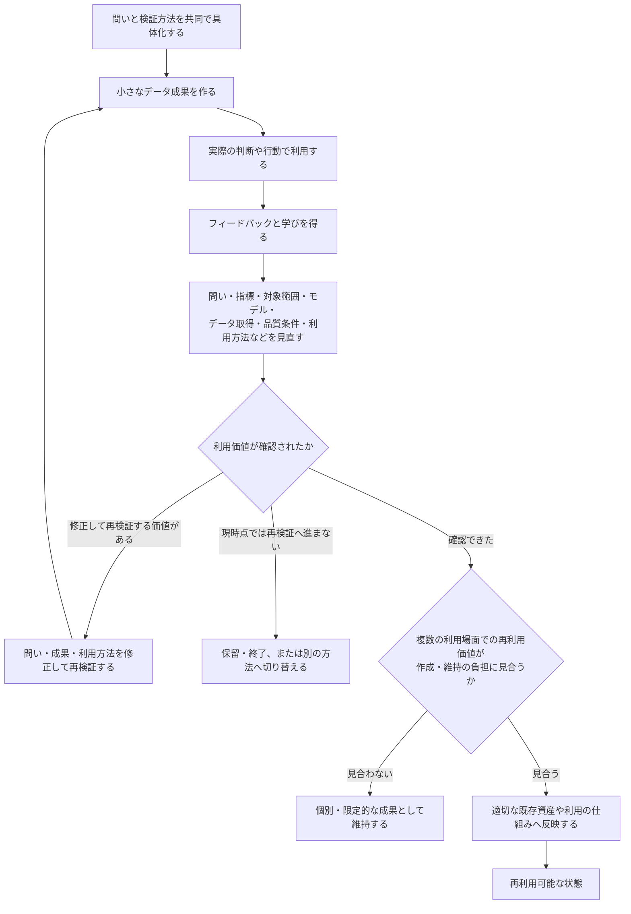
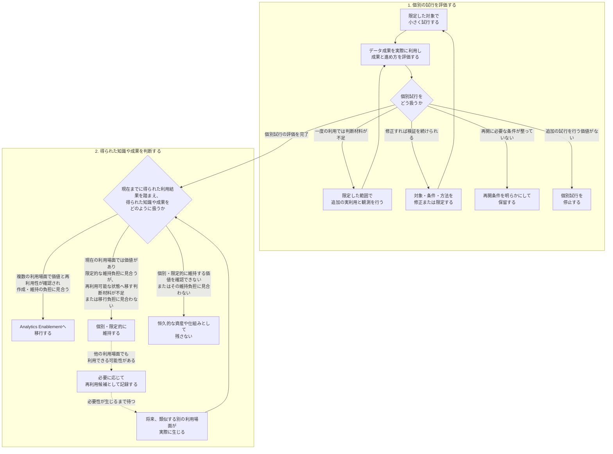
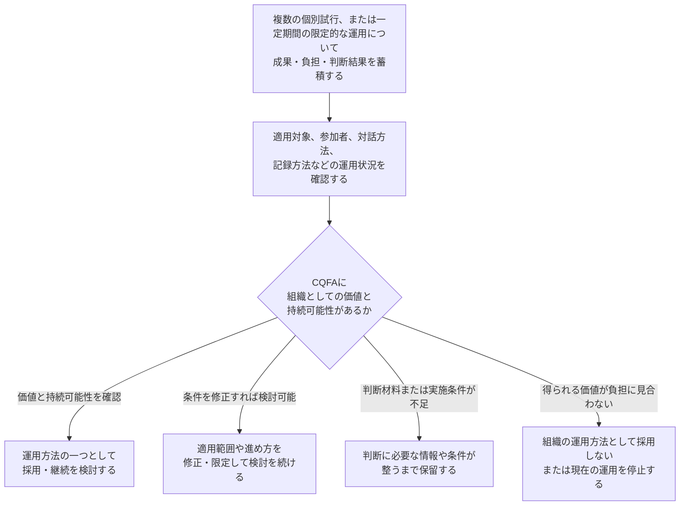

## 4. まとめ

第1章では、問い、指標、必要なデータ、利用場面などに不確実性が残ったまま、完成した依頼として専門職間の受け渡しを進めることで起こり得る問題を整理した。

第2章では、そのような状況に対して既存の分担型フローを補完する提案として、必要な専門知を早い段階から持ち寄り、対話と実際の利用から得た学びを次の判断や再利用可能なデータ資産・利用の仕組みへつなげるCollaborative Question Framing for Analytics（CQFA：仮称）の考え方を提案した。

第3章では、この提案自体を検証すべき仮説として扱い、業務を可能な限り増やさず、限定した範囲で小さく試行し、成果と参加者の負担の両面から評価する方法を整理した。

本章では、これらの議論を、提案の適用範囲、データ利用の進め方における中心的な転換、提案自体を組織として評価する方法という三つの観点からまとめる。

---

### 4.1 不確実性に応じて、共同発見と分担型フローを使い分ける

本Proposalは、すべてのデータ利用を新しい協働方法へ置き換えることを提案するものではない。

依頼の目的、利用場面、指標定義、必要なデータ、品質条件が明確であり、既存の指標やデータ資産を利用できる場合には、必要な職種が役割を分担しながら進める既存の方法によって、効率的に対応できる。

一方、業務上の困りごとや支援したい判断は認識されていても、問い、指標、必要なデータ、利用場面、検証方法などに不確実性が残る場合がある。また、違和感、疑問、仮説、アイデアは存在していても、まだ分析依頼として整理されていない場合もある。

このような段階で要求を確定済みとして扱い、完成した依頼の受け渡しを中心に進めると、必要な履歴や粒度の不足、業務上の意味と指標定義のずれ、成果物と利用目的の不一致などが、実装中、実装後、または利用後に明らかになる可能性がある。個別対応で確認された定義、制約、判断条件が、次の利用で発見・再利用できる形に残らず、同じ調査、説明、実装が繰り返される場合もある。

CQFAは、このような不確実性が残る段階から必要な専門知を持ち寄り、初期の相談・探索や問いの共同具体化を通じて、問題の捉え方、検討する問い、次の対応を明らかにしていくための提案である。

初期の相談・探索では、まだ問いになっていない違和感、疑問、仮説、アイデアについて、関係する専門知を持つ人から早期のフィードバックを得る。その結果、問いの候補を形成するだけでなく、既存の指標や成果物を利用する、問題を別の観点から捉え直す、保留する、または現時点では扱わないと判断することもできる。

問いの共同具体化では、ステークホルダーやドメインエキスパートが持つ業務文脈、判断、行動、例外条件と、Data Analyst（DA：データアナリスト）、Analytics Engineer（AE：アナリティクスエンジニア）、Data Engineer（DE：データエンジニア）などが持つ分析方法、指標、データの意味、粒度、履歴、品質、取得・運用上の制約を、案件に必要な範囲で持ち寄る。これらを照らし合わせることで、誰のどの判断を支援するのか、何を問いとして確認するのか、どの範囲を扱うのか、どのように検証するのかを、認識のずれや制約による手戻りが大きくなる前に具体化する。

共同発見は、すべての案件にすべての職種を参加させたり、全員が同じ責任を持ったりすることを意味しない。参加者は肩書きではなく、その案件で必要となる専門知に基づいて選び、業務上の判断、分析、データモデリング、データ取得・運用などの異なる責任は維持する。

また、初期の相談・探索や問いの共同具体化によって条件が明確になった後は、通常の分担による実装へ移ることができる。したがって、共同発見と既存の分担型フローは対立するものではなく、問いの明確さ、不確実性、影響範囲、必要な専門知に応じて使い分け、必要に応じて組み合わせる関係にある。

本提案の中心は、専門知を完成後の確認や修正だけに用いるのではなく、問い、指標、検証方法、実装案をまだ変更できる段階で持ち寄ることにある。そのうえで、小さなデータ成果を実際の判断や行動に利用し、得られた学びを、問い、指標、モデル、データ取得、提供・利用方法の見直しへ戻していく。

---

### 4.2 実際の利用から学び、価値ある知識だけを残す

問いや検証方法を共同で具体化しても、その問いが実際の業務にとって有用であるか、作成する指標やデータ成果が判断や行動に利用できるかを、対話だけで確認できるとは限らない。

そのため、小さく検証する価値があると判断した場合には、最初から包括的なダッシュボードや共通データモデルを完成させるのではなく、利用者が具体的な判断場面で確認できる小さなデータ成果を作り、実際に利用する。

小さなデータ成果には、一つの問いに対する探索的分析、一つの指標候補、限定した対象の簡易可視化、検証用のデータモデル、データ品質や履歴を確認するための出力などが含まれる。

小さく作ることは、検証に必要な品質や明確さを下げることではない。利用目的や前提、制約を共有し、実際の利用結果を適切に解釈できる状態にする。

実際の利用から得られるフィードバックは、成果物の表示や操作性だけを修正するためのものではない。

当初の問いが業務上の問題を適切に捉えていたか、指標が想定した状態を表していたか、対象範囲や閾値が妥当だったか、結果が判断や行動に利用されたかを確認する。その結果に応じて、問い、指標、対象範囲、データモデル、データ取得、品質条件、提供・利用方法を見直す。

利用の結果、当初の仮説が支持されない場合や、成果が判断に利用されない場合もある。その場合には、問いや成果を修正して再検証するだけでなく、保留する、別の方法へ切り替える、または終了することも選択肢となる。小さなデータ成果の目的は、最初の案を完成形へ拡大することではなく、次に進む価値があるかを実際の利用から学ぶことである。

この過程でAnalytics Engineer（AE：アナリティクスエンジニア）は、業務上の概念と、エンティティ、事象、粒度、ディメンション、指標、データ品質、既存のデータ資産等を接続する。検証目的に必要な範囲へ指標やモデルを限定し、利用者がデータ成果の意味、計算条件、対象範囲、既知の制約を理解できる状態を支える。

ただし、AEが業務上の意味や利用価値を単独で決定したり、すべての指標や分析を承認したりするわけではない。業務上の判断や利用価値の評価は、ステークホルダーを中心に、必要な関係者とともに行う。一方、分析、データ取得、実装、運用は、案件に必要な専門知とそれぞれの責任に応じて担う。AEの固有の貢献は、問いとデータ構造の対応を明らかにし、実際の利用から得た知識を、必要な関係者とともに再利用可能な状態へ移せるようにすることにある。

本Proposalでは、個別の相談、問いの具体化、小さな検証を進める活動を、Analytics Assistance（仮称）と呼んできた。

一方、その過程で得られた知識のうち、複数の利用場面で再利用する価値があり、その価値が作成・維持の負担に見合うものを、既存のデータ資産や利用の仕組みへ反映する活動を、Analytics Enablement（仮称）と呼んできた。

Analytics Assistanceで利用価値が確認されたとしても、その成果や知識を必ず共通化するわけではない。一度限りの分析、特定の部門や利用場面に限定された条件、変更の多い暫定指標などは、個別または限定的な成果として維持する方が適切な場合がある。

個別対応から得た知識を再利用可能な状態へ移すかどうかは、利用価値の有無とは別に判断する必要がある。複数の利用場面で再利用する価値があり、その価値が作成、変更、説明、保守の負担に見合う場合に限り、Analytics Enablementへ移す。

**図4-1　小さなデータ成果の実利用に基づく、利用価値と再利用価値の判断**

Analytics Enablementへの移行では、すべての知識を同じ形式や一つの仕組みへ集約することを前提としない。

知識の性質と利用方法に応じて、既存の指標定義、データモデル、データ品質テスト、データ系譜、データカタログ、README、利用ガイド、分析APIなど、適切な反映先を選ぶ。複数の反映先が必要な場合もあれば、一つの定義やテストだけを残せば十分な場合もある。

また、これらは、共通指標を作ってからデータモデル、文書、利用ガイドへ順番に進む固定的な工程ではない。再利用に必要な知識だけを、既存の資産や運用へ選択的に反映する。

このように、CQFAが目指すのは、作成した分析、指標、モデルの数を増やすことではない。小さなデータ成果の実利用から問いと実装を見直し、価値が確認された知識のうち、再利用する価値が維持負担に見合うものだけを、再利用可能な資産や利用の仕組みとして残すことである。

---

### 4.3 提案自体を小さく検証し、組織としての扱いを判断する

Collaborative Question Framing for Analytics（CQFA：仮称）は、学習とポートフォリオでの個人実装から形成した未検証の提案仮説であり、組織への採用や試行を前提とするものではない。

まず、現在のデータ利用で生じている問題に対して、この考え方を検討する理由があるか、既存の進め方の改善で対応できないかを確認する。そのうえで、試す価値があると判断された場合に限り、限定した対象で小さく試行し、その組織にとって価値があるか、参加者の負担が妥当かを検証する。

共同発見によって得られる価値や、対話、調整、記録、仕組みの維持にかかる負担は、組織、対象業務、既存のデータ利用プロセスによって異なる。そのため、試行する場合にも、最初から恒久的な制度や標準プロセスとして扱わず、本提案自体を検証対象とする。

試行では、一つの部門やチーム、一つの業務上の問題、一つの利用場面などへ対象を限定する。すべての職種を常時参加させるのではなく、その試行に必要な専門知を持つ人だけが、必要な時点で関わる。既存の定例、依頼、レビューなどを利用できる場合には、新しい会議や承認手続きを設ける前に、それらの場へ短い対話や確認を組み込む。

評価では、データ成果そのものと、進め方の両方を見る。

データ成果については、問いが具体化されたか、小さな成果が実際の判断や行動に利用されたか、利用から新たな学びが得られたかを確認する。

進め方については、制約や認識のずれを早く発見できたか、手戻りや重複を減らせたか、必要な専門知を適切な時点で持ち寄れたかを確認する。同時に、会議、調整、記録、相談対応などの負担が、得られた価値に対して過大ではなかったかも評価する。

評価に用いる観測情報は、参加者個人の能力や業績を評価するためのものではない。試行によって何が改善され、どこに負担や停滞が生じたのかを確認し、次の進め方を判断するために利用する。

試行から次の対応を検討する際には、少なくとも三つの判断を区別する必要がある。

第一は、個別試行について、追加の実利用と観測を行うか、条件を修正・限定して再試行するか、保留・停止するか、または判断を完了するかである。

一度の利用だけでは価値や負担を十分に判断できない場合には、問い、データ成果、利用場面、参加方法などを大きく変えず、限定した範囲で追加の実利用と観測を行う。

価値は期待できるものの、対象範囲、参加者、データ成果、利用方法などに問題がある場合には、条件を修正または限定して再試行する。再開に必要な条件が整っていない場合には保留し、追加の試行を行う価値が負担に見合わない場合には停止する。

個別試行について判断材料が十分に得られた場合には、その試行の評価を完了し、得られた知識や成果をどのように扱うかを別途判断する。

第二は、試行から得た知識や成果を再利用可能な状態へ移すかどうかである。これは、個別試行を継続するかどうかとは別の判断である。

個別の利用場面では価値があり、必要な範囲で維持する負担がその価値に見合うものの、他の利用場面での再利用性がまだ確認されていない場合や、再利用可能な資産や仕組みへ移す負担に見合わない場合には、Analytics Enablement（仮称）へ移さず、個別・限定的に維持する。

そのうち、他の利用場面でも利用できる可能性があるものは、再利用候補として軽量に記録する。

一方、個別・限定的に維持する価値を確認できない場合や、その維持負担が価値に見合わない場合には、恒久的な資産や仕組みとして残さない。

ただし、再利用性を確認することだけを目的として、新たな試行や再利用可能な資産・仕組みへの移行を開始するのではない。将来、類似する別の利用場面が実際に生じたときに、既存の知識や成果を利用できるかを確認し、その結果を踏まえてAnalytics Enablementへ移すか、個別・限定的な扱いを維持するかを改めて判断する。

第三は、CQFAという進め方自体を、組織として今後どのように扱うかを判断することである。

進め方自体の扱いは、一回の試行結果だけで判断するものではない。複数の試行または一定期間の限定的な運用を通じて、異なる利用場面でも価値が得られるか、参加者の負担が持続可能か、既存の進め方をどの程度補完できるかを確認する。その結果に応じて、運用方法の一つとして採用を検討する、適用範囲や進め方を修正・限定して検討を続ける、保留する、または採用しないといった扱いを判断する。

**図4-2　個別試行と、得られた知識や成果の判断関係**

個別試行の評価結果と、得られた知識や成果の扱いに関する判断は、進め方全体を評価するための観測情報として記録する。複数の試行結果または一定期間の観測が蓄積された段階で、CQFAを組織の運用方法としてどのように扱うかを別途評価する。

**図4-3　CQFAの進め方全体の評価**

この三つの判断を分けて考えることで、個別の試行で価値が得られたことと、得られた知識や成果を再利用可能な状態へ移すこと、進め方全体を組織の運用へ取り入れることを、それぞれ別の判断として扱いやすくなる。また、一つの試行を停止した場合でも、その結果だけで他の利用場面における可能性まで否定する必要はない。

本Proposalは、CQFAをあらかじめ正しい運用方法として導入することを前提とするものではない。不確実性が残るデータ利用に必要な専門知を早い段階から持ち寄り、小さなデータ成果の実利用から学び、価値が確認された知識のうち、再利用する価値が維持負担に見合うものを適切な仕組みへ残すという考え方が、その組織にとって新たな価値につながり得るかを、小さな試行を通じて確かめるための提案である。

複数の試行または一定期間の限定的な運用を通じて、一定の価値と持続可能性が確認された場合には、既存の分担型フローを補完する運用方法の一つとして、引き続き検討することができる。十分な価値や持続可能性を確認できない場合には、適用範囲や進め方を見直す、検討を保留する、または採用しないことも選択肢となる。
