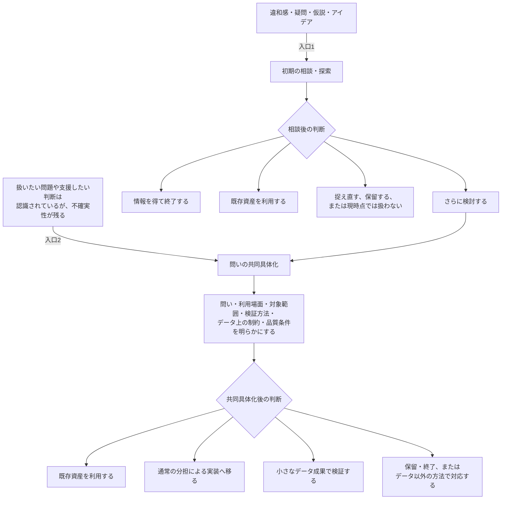
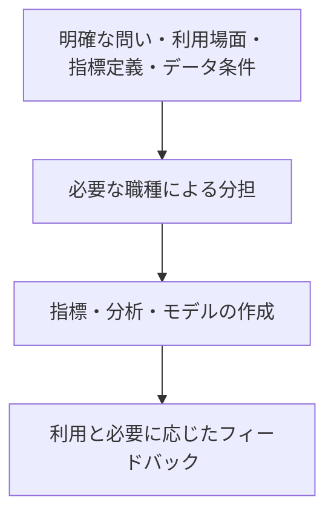
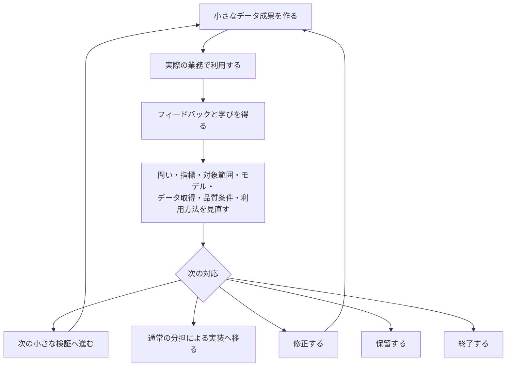
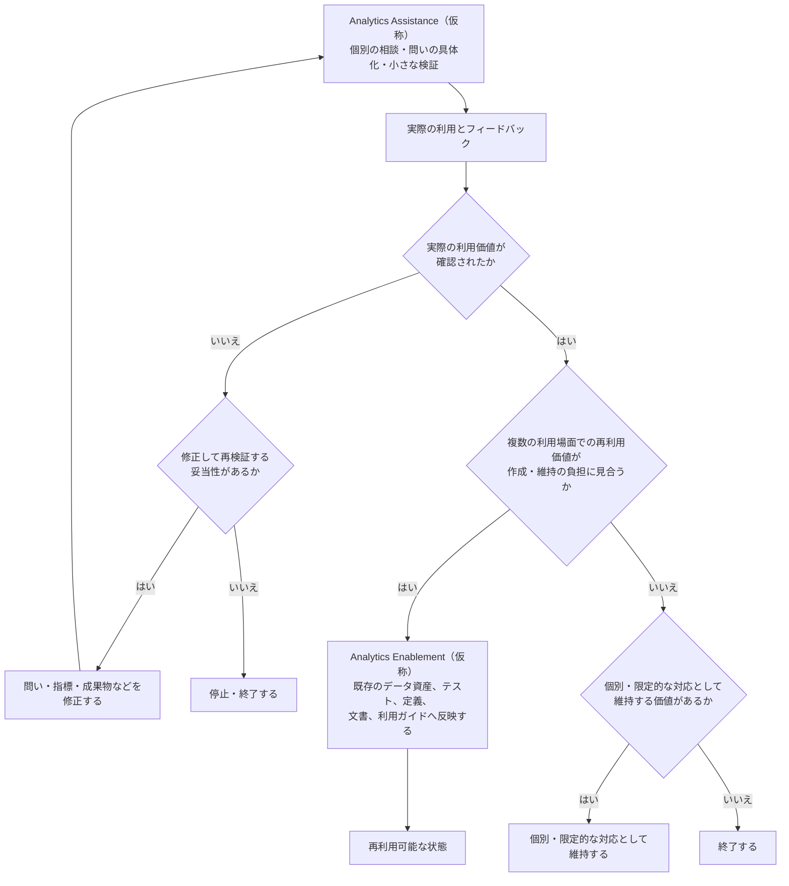
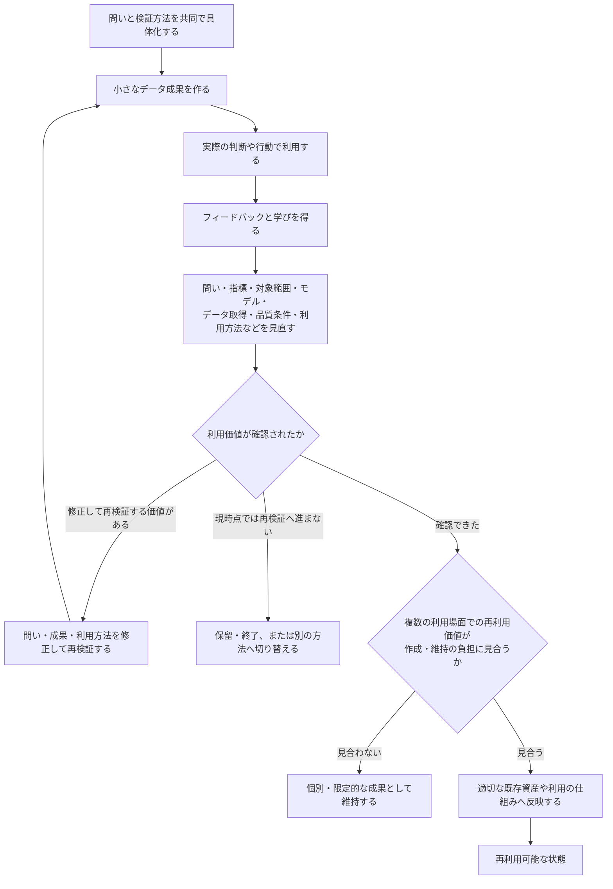
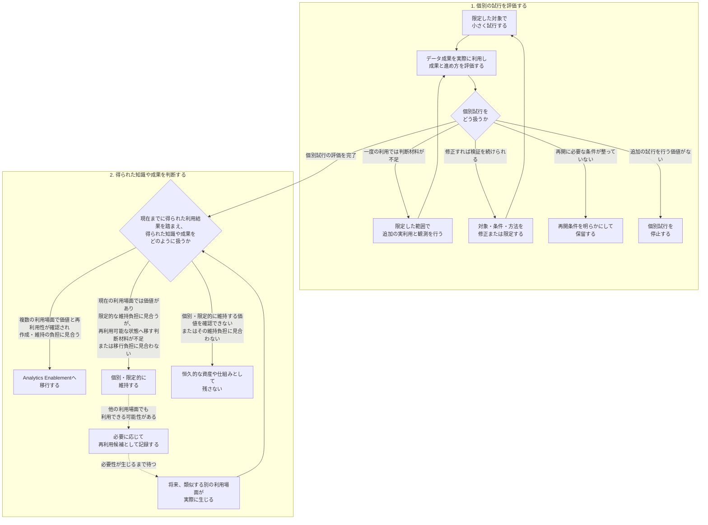
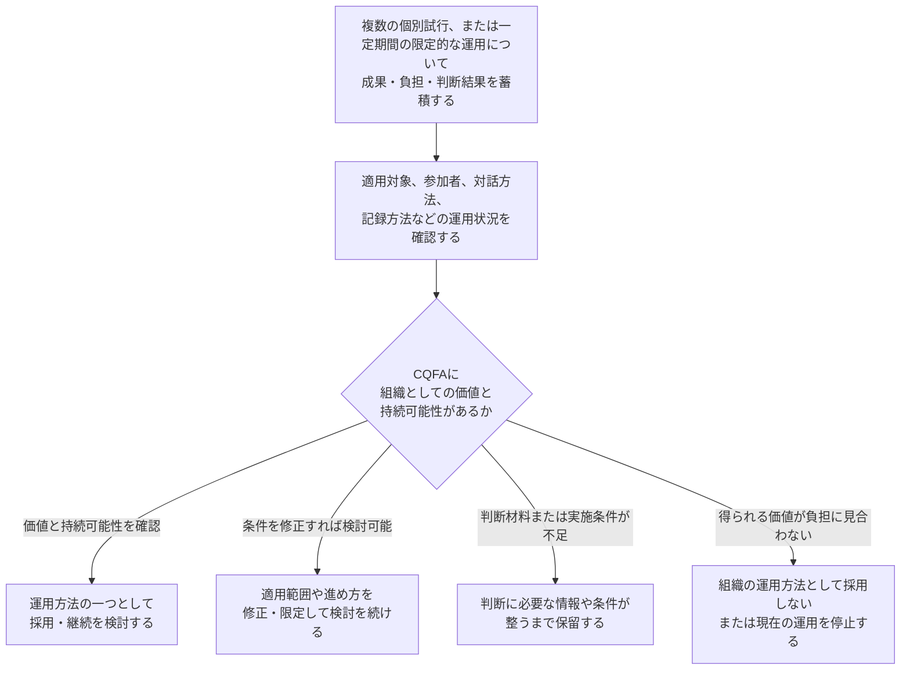

# Collaborative Question Framing for Analytics

## 異なる専門知を持ち寄り、分析のための問いを形成し、小さな実利用から学ぶための提案

---

## 本Proposalの位置づけ

本Proposalは、Quality Assistance / Quality Enablementと、アジャイルにおける小さな成果、短いFeedback loop（フィードバックループ）、継続的な適応から得た示唆を、Analytics Engineeringの視点から、組織的なデータ利活用の文脈へ応用した提案である。

完成した標準手法や、実務で有効性が検証された運用モデルを提示するものではない。学習と既存概念の分析を通じて形成した未検証の提案仮説であり、組織への採用や試行を前提とするものでもない。

Analytics Engineering / Data Engineeringの個人ポートフォリオで整理したデータモデル、品質テスト、文書化などの実装パターンは、本提案を技術的に支え得る具体例として参照する。ただし、これらの実装から、組織的な協働、参加者の負担軽減、データ利用の定着、事業上の成果が実証されたとは扱わない。

本Proposalでは、データ利用に関する着想や、問い、指標、必要なデータ、利用場面、検証方法などに不確実性が残る場合に、必要な専門知を持つ人が早い段階から関わり、業務上の意味とデータ上の可能性・制約を照らし合わせながら、分析のための問いと検証方法を共同で形成する。

さらに、小さなデータ成果を実際の判断や行動で利用し、分析結果や利用結果から得た学びを、問い、指標、データ、実装、利用方法の見直しへ戻す。この一連の進め方を、**Collaborative Question Framing for Analytics（CQFA：仮称）**と呼ぶ。

ここでいう「分析のための問い」とは、単に質問文として整理されたものではない。誰のどの判断や行動を支援するのか、何を確認するのか、どの範囲や指標を扱うのか、どのデータを利用できるのか、どのように検証するのかといった条件が、実装と実利用へ進める程度まで具体化された問いを指す。

本Proposalでは、次の問いに対する仮説を提示する。

> データ利用に不確実性が残る場合に、業務上のステークホルダーやドメインエキスパート、Data Analyst（DA：データアナリスト）、Analytics Engineer（AE：アナリティクスエンジニア）、Data Engineer（DE：データエンジニア）などが、完成した依頼の受け渡しだけに頼らず、早い段階から異なる専門知を持ち寄ることで、業務上の判断に結び付き、データで検証可能な問いと検証方法を共同で形成できないか。
>
> また、小さなデータ成果を実際の判断や行動で利用し、分析結果や利用結果から得た学びを問い、指標、データ、実装、利用方法へ戻すことで、問いとデータ成果の両方を改善できないか。
>
> さらに、その過程で得た知識や成果のうち、複数の利用場面で価値と再利用性が確認され、再利用可能な状態へ移すための作成・維持の負担が価値に見合うものを、他の利用場面でも活用できる形へ移せないか。

本ProposalにおけるAnalyticsは、分析結果を作成する作業や、Analytics Engineerの職能だけを指すものではない。業務上の着想から問いと検証方法を具体化し、指標を設計し、必要なデータを取得・変換し、品質を確認し、分析結果やデータ成果を実際の判断や行動で利用するまでの、組織的なデータ利活用全体を指す。

CQFAは、この組織的なデータ利活用のうち、着想や問い、指標、データ、利用場面、検証方法などに不確実性が残る場合を対象とする。条件が明確な依頼を必要な職種が分担して進める既存のフローを含む名称ではなく、それとは別の補完的な進め方として位置づける。

また、本ProposalはAnalytics Engineeringの視点を中心に整理するが、Analytics Engineerがデータ利活用全体を所有したり、推進責任者や承認者になったりすることを想定するものではない。ステークホルダーやドメインエキスパート、DA、AE、DEなどが、それぞれの専門知と責任を保ちながら、案件に必要な範囲と時点で関わることを前提とする。

---

## 1. 完成した問いを待つデータ活用から、共同発見へ

### 1.1 背景

本Proposalでは、Analytics Engineeringの役割を次のように捉える。

> 単なるデータを意味のある情報へ変え、必要とする人・場所へ届ける。

ここでいう役割は、データ変換やSQL実装に限定されない。データの意味、品質、利用可能性を整え、業務上の判断や行動へ接続することも含む。

一方で、「意味のある情報」は、最初から自明に定義されているとは限らない。

- 何を、誰にとって「意味のある情報」と判断するのか
- 業務上の困りごとと、データの可能性・制約をどのように結び付けるのか
- 個別のデータ利用から得た知識を、負担を増やさず再利用可能な仕組みへどう移すのか

業務上の困りごとは、必ずしも最初から分析可能な問いとして具体化されているとは限らない。

たとえば、次のような形で共有されることがある。

- 商談が停滞しているように見える
- 解約が増えている理由が分からない
- 問い合わせ対応に時間がかかっている
- どの顧客へ優先的に対応すべきか判断できない
- 複数部門で報告される数値が一致しない
- 作成したダッシュボードが意思決定に使われていない

これらは重要な業務上の困りごとであるが、そのままでは、対象とする指標、分析単位、必要な履歴、利用場面、その後に期待する行動などが明確でない場合がある。

したがって、データ利用の出発点を完成した分析依頼だけに置くのではなく、業務上の困りごとから問いと検証方法を具体化する過程を、Analytics Engineeringを含む必要な関係者が、それぞれの専門知を持ち寄る領域として捉える。

---

### 1.2 完成した依頼の受け渡しで起こり得る問題

データ利用の進め方によっては、業務上の困りごとが、関係する専門知を十分に持ち寄る前に分析依頼として整理され、その後の作業が専門職間の分担と受け渡しを中心に進む場合がある。

```text
業務上の困りごと
    ↓
分析依頼として整理
    ↓
DA／AE／DEによる分担と受け渡し
    ↓
分析・指標・モデルなどを作成
    ↓
ダッシュボード／レポート
    ↓
完成後・利用後のフィードバック
```

この流れそのものが常に問題なのではない。

依頼内容が明確で、必要なデータが存在し、指標定義が安定している場合には、効率的に機能し得る。

一方で、問い、指標、必要なデータ、利用場面に不確実性が残っているにもかかわらず、要求を確定済みとして扱い、専門職間の受け渡しを中心に作業を進めると、必要な専門知が十分に持ち寄られない可能性がある。

#### 1.2.1 制約や認識のずれが遅く判明する

#### データ上の制約

- 必要な履歴が保存されていない
- 問いに必要な粒度でデータが存在しない
- データソース間を安定したキーで結合できない
- 必要な更新頻度を実現できない
- データの欠損や遅延により、必要な完全性や鮮度を満たせない

#### 業務上の意味と指標定義のずれ

同じ言葉でも、関係者によって想定する意味が異なる場合がある。

例:

- アクティブ顧客
- 解約
- コンバージョン
- 停滞商談
- 売上
- 応答時間

集計対象、計算方法、対象期間、除外条件、更新頻度、確定値と速報値の扱いなどが共有されていなければ、同じ指標名でも異なる意味や数値が作られる可能性がある。

その結果、関係者が想定する業務上の意味や利用目的と、実装された指標定義との違いが成果物の完成後に明らかになり、指標やデータモデルの修正が必要になる場合がある。

#### 成果物と利用目的のずれ

- 作成した指標や可視化が、想定していた判断や行動を十分に支援できない
- 必要な比較軸が含まれていない
- 粒度が細かすぎる、または粗すぎる
- 利用者が想定した業務状態を表していない
- どの業務場面で確認し、どの判断に利用するかが定まっていない

#### 1.2.2 個別対応で得た知識が次の利用へ残らない

- 既存の指標やモデルを把握できず、同じ、または類似したロジックが別々に実装される
- 個別対応で決まった業務上の意味や除外条件が、チーム内で共有されない
- 同じデータ調査や整形が複数の分析で繰り返される
- 同じ指標定義やデータ上の制約を、専門家が依頼ごとに繰り返し説明する
- 指標定義や計算ロジックが、個別のSQLや担当者の知識に閉じたままになる
- 定義の背景を知る特定の担当者へ、確認や問い合わせが集中する

#### 複数のデータ専門職による個別対応で起こり得る分散

複数のデータ専門職が、それぞれ個別の依頼へ対応する場合もある。AEが複数いるチームも、その一例である。

このとき、相談から得た業務知識、指標定義、既存の指標やモデルとの関係がチーム内で十分に共有されず、既存資産を発見・再利用する仕組みも弱ければ、類似した指標やモデルが別々に実装されたり、特定の担当者だけが定義の背景を把握したりする可能性がある。

たとえば、次のような仮想的なケースを考える。

```text
AE A
営業部門から「停滞商談」の相談を受ける
    ↓
14日間、顧客との接触がない商談を抽出するモデルを作る

AE B
別の商品部門から類似した相談を受ける
    ↓
最終活動から21日経過した商談を抽出する別のモデルを作る
```

二つの対応内容が十分に共有されなければ、次のような状態が起こり得る。

- 名前は異なるが、似た目的のモデルが複数存在する
- 「顧客接触」と「活動」の定義がモデルごとに異なる
- どちらのモデルを再利用すべきか判断できない
- 同じ欠損、重複、履歴不足などを、それぞれの対応で個別に調査する
- 定義変更時に複数のモデルを別々に修正する
- 条件が異なる理由が文書化されず、それぞれの実装担当者にしか説明できない

これは、単純なSQLやコードの重複だけを意味しない。

利用者との対話によって明らかになった業務上の判断、除外条件、指標の意図が共有されず、特定の担当者だけがその背景を把握している状態も、属人化の一つと考えられる。

ただし、類似したモデルが複数存在すること自体が問題なのではない。対象部門、商品、データ粒度、更新頻度、品質要件、利用目的などの違いによって、別々のモデルが必要な場合もある。

問題となるのは、それらの違いが意図されたものなのか、既存資産や過去の判断を把握できなかったために重複したものなのかを、チームとして判断できない状態である。

これらの問題は、個々の担当者の処理速度だけに起因するものではない。

業務上の困りごとや利用目的と、データの制約や実現可能性が早い段階で一緒に検討されないと、問いや指標のずれに気づくのが成果物の完成後になりやすい。

また、利用後に分かったことが指標定義やデータモデルへ反映されなければ、個別対応から得た知識が再利用可能な形で残らず、同じ確認や修正が次の案件でも繰り返される可能性がある。

こうした問題を減らすには、完成した依頼を受け渡すだけでなく、問いや指標を修正できる早い段階から、異なる専門知を持ち寄る必要がある。

---

#### 補足：参照情報の位置づけ

dbtの公式資料では、データ資産の記述と発見を支援するDocumentationとCatalog、モデル群の所有関係や参照範囲を扱う`groups`とModel access、指標定義を集約するSemantic Layerが提供されている。

これらは、複数人・複数チームでデータ資産を扱う際に、既存資産の発見、所有関係、依存関係、参照範囲、指標定義の一貫性を管理するための仕組みを説明した資料である。

ただし、共有や発見の仕組みが不足すると必ず属人化や重複モデルが発生することや、その発生頻度を実証したものではない。

本Proposalでは、これらの公式資料が扱う設計上の課題を踏まえ、個別対応で得た知識が共有されない場合には、属人化や意図しない重複が起こり得るという条件付きのリスクを提示する。

---

### 1.3 問いを共同で具体化する必要性

StakeholderやDomain Expert（ドメインエキスパート）は、業務上の困りごと、例外、判断、行動について深い知識を持っている。

ただし、次のようなデータ上の条件や選択肢は、Data Analyst、Analytics Engineer、Data Engineerとの対話を通じて明らかになる場合がある。

- どのデータが存在するか
- データの1行が何を表しているか
- どの期間の履歴が保存されているか
- 複数のデータソースをどのように結合できるか
- どのような代理指標を構成できるか
- どの程度の鮮度や完全性を実現できるか
- 既存モデルや共通指標を再利用できるか

同様に、データ専門職だけでは、業務上の意味、例外条件、分析結果を利用する場面、その後に取り得る行動を十分に捉えられない場合がある。

したがって、特定の立場だけで問いや分析依頼を完成させて受け渡すのではなく、異なる専門知を持ち寄りながら、問いと検証方法を共同で具体化することが重要になる。

#### 完成した依頼になる前の相談

共同発見の価値は、データ専門職が従来より早い段階から関与し、制約や認識のずれを早期に発見することだけではない。

Stakeholderが、まだ分析依頼として整理されていない業務上の違和感、疑問、仮説、アイデアを、軽量な相談機会へ持ち込めることにも意味がある。

業務文脈とデータに関する専門知を持ち寄ることで、当初のアイデアを検証可能な問いへ具体化できる場合がある。また、利用可能なデータ、既存の指標、実際に支援したい判断を確認する過程で、当初の問題意識を別の問いとして捉え直した方が、実際の判断や行動に結びつきやすいと分かる場合もある。

```text
業務上の違和感・疑問・アイデア
        ↓
異なる専門知を持ち寄る
        ↓
相談の結果
├─ 問いを具体化する
├─ 別の問いへ再構成する
└─ 現時点では扱わないと判断する
        ↓
検証する目的と優先度が確認できた場合だけ
小さな検証へ進む
```

このような相談は、持ち込まれたアイデアをすべて分析案件へ変えることを目的としない。

既存の指標や成果物で対応できること、現時点ではデータで検証できないこと、現時点では優先度が低いことを早期に明らかにすることも、共同発見の成果となる。

---

### 1.4 QA職能資料の作成から得た着想

本Proposalの着想の一つは、QAの役割を理解するために、Quality Assistance / Quality Enablementを含むQA職能資料を作成・整理した過程で得た学びにある。

これはQAとしての実務経験から得た知見ではなく、公開情報をもとにQAの職能や関与方法を整理する中で形成した理解である。

その過程で着目したのが、QAの専門性を、完成後のテストや確認だけに閉じないという役割の捉え方である。

QAがテストや確認を一手に引き受けるのではなく、要求、仕様、設計などの早い段階から品質リスクや確認条件を共有し、チーム全体が品質を扱える状態を支援する。

ここからAnalytics Engineeringへ応用するのは、QAの職務そのものではない。

応用するのは、次のような専門職の関与方法である。

> 専門職を、完成した成果物を受け取る後工程の処理担当だけにせず、関係者が必要な支援を受けながら、より良い判断を自ら行える範囲を広げる。

Analytics Engineeringの文脈では、次のように読み替えられる。

| QA・品質の文脈 | Analyticsの文脈 |
|---|---|
| 完成後にQAへ確認を渡す | 問いが完成した後にデータチームへ依頼する |
| 要求・設計段階から品質の観点を入れる | 困りごとや判断の段階からデータの観点を入れる |
| 曖昧な要求を確認可能な条件へ変える | 曖昧な課題を、仮説、指標、データ粒度、分析軸として具体化する |
| 品質リスクや制約を早期に示す | データ品質、履歴、鮮度、取得可能性を早期に示す |
| QAだけが品質を確認する状態を避ける | データの意味や制約を共有し、関係者が自ら判断できる範囲を広げる |
| Quality Assistance | 個別の問題に専門家が伴走する |
| Quality Enablement | 得られた知識を再利用可能な仕組みとして残す |

QAとAEの目的や責任は同一ではない。

QAは、主に品質要求、リスク、確認可能性などを扱う。

AEは、主にデータの意味、モデリング、品質、再利用性、利用可能性などを扱う。

本Proposalでは両者を同一視せず、QA職能資料の作成から得た学びのうち、専門職の早期関与、個別支援から得た知識の再利用、関係者が自ら判断できる範囲の拡大という原則を、Analytics Engineeringの文脈へ応用する。

---

### 1.5 アジャイル資料の作成から得た着想

本Proposalのもう一つの着想は、アジャイル開発の基礎資料を作成・整理した過程で得た学びにある。

これはアジャイル開発の実務経験から得た知見ではなく、公開情報をもとに、価値提供、フィードバック、検査と適応の関係を整理する中で形成した理解である。

その過程で、アジャイルにおける速さを、短期間に多くの作業を完了することではなく、価値提供と学習の循環を早めることとして捉える考え方に着目した。

価値のある成果を小さな単位で届け、実際の利用から学び、その学びを次の判断へ反映するまでの時間を短くすることを重視する。

Analytics領域へ応用するのは、特定のアジャイル開発手法や運用形式ではなく、次の原則である。

- 不確実性の高い問題を小さく限定する
- 利用者が実際に確認し、次の判断に使える小さな成果を作る
- 実際の利用者からフィードバックを得る
- 成果物だけでなく、問いそのものも更新する
- 成果に関する学びと、協働方法に関する学びを分けて扱う
- 同時に多くのテーマへ着手せず、利用と学習までフィードバックループを閉じる
- 新しい会議や手続きを前提にせず、既存の相談機会や定例の一部を使って小さく試す
- 成果だけでなく、参加者の負担や協働方法の持続可能性も確認する

職種間で問いを共同で具体化することで、業務上の意味やデータ上の制約の一部は、成果物を作る前に確認できる。

たとえば、「更新されていない商談を把握したい」という問題意識について、営業担当者とデータ専門職が事前に検討した結果、次の問いへ具体化したとする。

> 提案済み商談のうち、商品別に設定した期間を超えて顧客との接触がなく、次回アクションが設定されていないものはどれか。

この段階で、対象とする商談ステージ、商品ごとの検討期間、顧客接触と社内活動の違いなどを確認する。

ただし、対話によって問いを具体化しても、その指標や可視化が実際の業務で判断や行動を十分に支援できるかは、利用前の検討だけでは確認しきれない場合がある。

そこで、対象を限定した小さな可視化を作り、実際の営業業務で利用したとする。その利用から、次のようなフィードバックが得られる可能性がある。

- 対象となる商談が多く、日常業務ではすべてを確認できない
- 優先順位を判断するには、商談件数だけでなく、想定売上額や成約確度も必要である
- 担当者や直近の活動内容を確認し、その場で次の対応を決められなければ、行動へ移しにくい
- 一部の商談は意図的に保留されており、現在の条件では区別できない
- 日次更新を想定していたが、実際には週次の営業会議で確認できれば十分である

このようなフィードバックを踏まえ、問い、指標、可視化、利用方法を見直すことができる。

```text
業務上の問題意識
        ↓
異なる専門知による問いの共同具体化
        ↓
限定した問いと指標の仮説
        ↓
小さな成果を実際の業務で利用
        ↓
利用からのフィードバック
        ↓
問い・指標・モデル・利用方法を更新
```

このとき、見直しの対象になるのは可視化だけではない。

- 「停滞」として扱う対象や除外条件
- 想定売上額や成約確度を用いた優先順位
- 表示する項目やデータ粒度
- 商談履歴モデルの構造
- 保留理由や活動状況に必要なデータの取得方法
- データ品質テスト
- 更新頻度や利用ガイド

したがって、分析成果物の作成を完了点とするのではなく、実際の利用から得たフィードバックを、問い、指標、データモデル、データ取得、利用方法へ戻すことが重要になる。

また、成果に関する学びとは別に、相談や確認にかかった負担、作業の待ち時間、必要な専門知が参加できた時期なども振り返り、協働方法そのものを適応させる必要がある。

このように小さく試し、得られた学びを次の判断へ反映する考え方は、分析成果物だけでなく、協働方法の導入にも適用できる。

新しい会議や恒常的な運用を最初から設けるのではなく、既存のミーティングや定例会の一部を時間制限付きで利用し、成果と追加負担を確認しながら小さく試すなどである。具体的な試行方法は第3章で示す。

---

### 1.6 提案する転換

ここまでの議論を踏まえ、本Proposalでは、不確実性が残る案件について、完成した分析依頼の受け渡しを起点とする進め方から、異なる専門知による共同具体化と、実際の利用からの学習を含む進め方への転換を提案する。

ただし、完成した依頼を受け渡す進め方が、常に問題になるわけではない。

依頼内容、必要なデータ、指標定義、利用場面が明確な場合には、専門職間の分担と受け渡しが効率的に機能し得る。

問題となるのは、問いや指標、必要なデータ、利用方法に不確実性が残っているにもかかわらず、それらを確定済みとして扱ってしまう場合である。

```text
不確実性が残る案件を
受け渡し中心で進めた場合

業務上の困りごと
        ↓
分析依頼として整理
        ↓
専門職間の分担と受け渡し
        ↓
指標・モデル・可視化を作成
        ↓
完成後・利用後に認識のずれが判明
        ↓
修正や再説明が発生し、
個別対応の知識が残りにくい
```

本Proposalが提案する流れは、次のとおりである。

```text
業務上の困りごと・判断・不確実性
        ↓
問いに応じて必要な関係者が専門知を持ち寄る
Stakeholder / Domain Expert / DA / AE / DE など
        ↓
問い・検証方法・対象範囲を共同で具体化する
        ↓
相談の結果
├─ 既存の指標や成果物を利用する → 既存資産の利用へ
├─ 現時点では扱わないと判断する → 保留して再検討、または対応終了
└─ 小さな検証が必要な場合
        ↓
【検証と学習のループ】
小さな成果を作る
        ↓
実際の業務で利用する
        ↓
フィードバックを得る
        ↓
問い・指標・モデル・データ取得・利用方法を見直す
        ↓
共同具体化または小さな成果の作成へ戻る ↺ 
```

この流れでは、分析成果物を作ることだけを完了点としない。

個別の問題に必要な専門知を持つ人が伴走し、問いの具体化や小さな検証を支援する活動を、本ProposalではAnalytics Assistance（仮称）として捉える。

小さな検証と実際の利用から得た学びは、まず、その個別案件の問いや実装の見直しへ戻す。

さらに、その過程で得た知識のうち、今後も参照・利用される可能性があり、再利用する価値が確認されたものは、他の利用場面でも活用できる形で残す。本Proposalでは、この動きをAnalytics Enablement（仮称）として捉える。

再利用可能な形として残すものには、たとえば次がある。

- 共通して利用できる指標定義
- 再利用可能なデータモデル
- データ品質上の確認条件やテスト
- 業務上の意味、前提、除外条件の記録
- 既知のデータ制約や、追加取得が必要な情報の記録
- 利用方法や判断上の注意点を示すガイド

これらを再利用可能な形で残すことは、関係者全員に新たな文書作成を求めるものではない。

業務上の意味や判断条件は必要な関係者と確認し、データ資産への反映と保守は、実装を担当するAEを中心に、必要に応じてDAやDEと分担する。新たな文書を増やすのではなく、既存のモデル定義、テスト、データカタログ、READMEなど、継続的に参照・更新される場所へ反映する。

また、個別支援で得た知識を、すべて共通化したり、継続的な保守対象として残したりするわけではない。

対象部門、商品、データ粒度、品質要件、利用目的などの違いにより、個別の指標やモデルが必要な場合もある。何を残し、どこまで共通化するかは、今後参照・利用される可能性、再利用する価値、作成・維持に必要な負担を踏まえて判断する。

この進め方は、すべての案件にすべての職種が参加することを前提としない。

重要なのは、問いや実装を修正できる段階で、その案件に必要な専門知を持ち寄れることである。参加者や関与方法は、対象となる問い、データ、リスク、利用場面に応じて選択する。

この協働方法自体も、確立された標準手法として一律に導入することを想定していない。

新しい会議や恒常的な運用を最初から設けるのではなく、既存のミーティングや定例会の一部を利用して小さく試し、成果と追加負担の両方を確認しながら、継続、修正、中止を判断する。

第2章では、この転換を支える役割関係とフィードバックループを、Collaborative Question Framing for Analytics（CQFA：仮称）という提案モデルとして整理する。第3章では、既存の場を短い時間枠で利用する試行を含め、軽量に導入し評価するための条件を示す。

---

## 2. Collaborative Question Framing for Analytics

本章では、データ利用に不確実性が残る場合に、異なる専門知を持つ関係者が早い段階から関わり、業務上の意味とデータ上の可能性・制約を照らし合わせながら、分析のための問いと検証方法を共同で形成する進め方を、Collaborative Question Framing for Analytics（CQFA：仮称）として整理する。

CQFAでは、まだ問いになっていない違和感、疑問、仮説、アイデアを扱う初期の相談・探索と、扱いたい問題や支援したい判断を分析可能な問いへ変える共同具体化を区別する。共同具体化では、問いだけでなく、利用場面、対象範囲、指標、必要なデータ、品質条件、検証方法などを、案件に必要な専門知を持つ関係者が共同で明らかにする。

さらに、小さく検証する価値があると判断した場合には、小さなデータ成果を実際の判断や行動で利用し、分析結果や利用結果から得た学びを、問い、指標、データ、実装、利用方法の見直しへ戻す。また、その過程で得た知識や成果について、個別の利用場面を越えて再利用可能な資産や仕組みへ移す条件を検討する。

まず、本提案の定義と適用範囲を示し、条件が明確な依頼を分担して進める既存のフローとの関係を明らかにする。次に、CQFAへ入る二つの入口、小さな検証とフィードバック、個別の利用場面から得た知識や成果を再利用可能な資産や仕組みへ移す条件を説明する。

そのうえで、ステークホルダーやドメインエキスパート、Data Analyst（DA：データアナリスト）、Analytics Engineer（AE：アナリティクスエンジニア）、Data Engineer（DE：データエンジニア）などが持ち寄り得る専門知と役割関係、異なる専門知によって問いと実装を相互に修正する過程、Analytics Engineerの貢献と境界を整理する。最後に、商談停滞の分析を仮想例として、最初の問題意識が問い、指標、検証方法、利用方法へ具体化され、実際の利用結果に応じて修正される流れを示す。

---

### 2.1 提案の定義と適用範囲

本Proposalでは、データ利用に関する着想や、問い、指標、必要なデータ、利用場面、検証方法などに不確実性が残る場合に、必要な専門知を持つ人が早い段階から関わり、業務上の意味とデータ上の可能性・制約を照らし合わせながら、分析のための問いと検証方法を共同で形成する。

さらに、小さなデータ成果を実際の判断や行動で利用し、分析結果や利用結果から得た学びを、問い、指標、データ、実装、利用方法の見直しへ戻す。この一連の進め方を、**Collaborative Question Framing for Analytics（CQFA：仮称）**と呼ぶ。

> ステークホルダー（業務上の利用者・責任者）や、ドメインエキスパート（業務領域の専門家）と、Data Analyst（DA：データアナリスト）、Analytics Engineer（AE：アナリティクスエンジニア）、Data Engineer（DE：データエンジニア）などが、案件に必要な範囲で専門知を持ち寄る。
>
> まだ問いになっていない違和感、疑問、仮説、アイデアについては、異なる観点からフィードバックを得る。その結果、さらに検討する価値がある場合には、誰のどの判断や行動を支援するのか、何を問いとして確認するのか、どの範囲を扱うのか、どのように検証するのかを共同で具体化する。
>
> 共同具体化の結果、小さく検証する価値があると判断した場合には、利用者が実際の判断や行動に使える小さなデータ成果を作成する。その利用から得た分析結果やフィードバックを、問い、指標、モデル、データ取得、提供・利用方法の見直しへ戻す。
>
> その過程で得た知識や成果については、個別の利用場面における価値だけでなく、他の利用場面でも再利用できるか、再利用可能な状態へ移すための作成・維持の負担が価値に見合うかを確認する。条件を満たすものだけを、既存のデータ資産、テスト、定義、Catalog（カタログ）、README、利用ガイドなどへ反映する。

CQFAは、一般化された既存の標準手法や、実証済みの運用フレームワークを示す名称ではない。

Quality Assistance / Quality Enablementと、アジャイルにおける小さな成果、短いフィードバックループ、継続的な適応から得た考え方を、分析のための問いを形成する過程とAnalytics Engineeringの文脈へ応用するための提案仮説である。

また、CQFAの目的は、すべての共同具体化を分析やデータ成果の作成へ進めることではない。初期の相談・探索や問いの共同具体化の結果として、既存の指標や成果物を利用する、問題を別の観点から捉え直す、検討を保留する、または現時点では扱わないと判断することも含まれる。

同様に、小さなデータ成果から価値が得られた場合でも、すべての知識や成果を再利用可能な資産や仕組みへ移すわけではない。再利用可能な状態への移行は、個別の利用における価値とは別に、複数の利用場面における再利用性と、作成・維持の負担を確認したうえで判断する。

#### 2.1.1 二つの関与を区別する

CQFAには、出発点、目的、主な結果が異なる二つの関与が含まれる。

|  | 初期の相談・探索 | 問いの共同具体化 |
|---|---|---|
| 出発点 | 違和感、疑問、仮説、アイデアなど、まだ問いとして整理されていない着想 | 扱いたい問題や支援したい判断は認識されているが、分析のための問いとして不確実性が残る状態 |
| 目的 | 異なる観点を得て、問題の捉え方や検討する価値を探る | 問い、利用場面、対象範囲、指標、必要なデータ、品質条件、検証方法などを明らかにする |
| 主な結果 | 問いの候補、既存資産の発見、問題の捉え直し、保留、終了 | 小さな検証、既存の分担型フローへの移行、修正、保留、終了 |
| データ成果の作成 | 前提としない | 必要性が確認された場合だけ作成する |

#### 初期の相談・探索

CQFAは、すでに一定の形になった問いだけを対象とするものではない。

業務上の違和感、疑問、仮説、思いついたアイデアなど、まだ分析依頼や検証可能な問いとして整理されていない段階でも、その論点に関係するデータ専門職または他職種へ投げかけ、異なる観点からフィードバックを得るための相談機会として利用できる。

この段階の目的は、直ちに分析やデータ成果の作成を開始することではない。

対話を通じて、たとえば次を確認する。

- どのような業務上の意味や可能性があるか
- 関係する既存の指標、データ、成果物があるか
- データで確認できる部分と、データ以外で考えるべき部分は何か
- 別の問題や問いとして捉え直す必要があるか
- 分析のための問いとして、さらに具体化する価値があるか

その結果、問いの候補が生まれる場合もあれば、既存の成果物を利用する場合、別の問題として捉え直す場合、保留する場合、現時点では扱わないと判断する場合もある。

初期の相談・探索は、それ自体で完結し得る。すべての相談を問いの共同具体化やデータ成果の作成へ進めることは前提としない。

#### 問いの共同具体化

一方、扱いたい問題や支援したい判断は認識されているものの、問い、指標、必要なデータ、利用場面、検証方法などに不確実性が残る場合には、必要な専門知を持ち寄り、分析のための問いと検証方法を共同で具体化する。

この段階では、たとえば次を明らかにする。

- 誰のどの判断や行動を支援するのか
- 何を問いとして確認するのか
- どの対象範囲を扱うのか
- どの指標や比較軸を利用するのか
- どのデータを利用できるのか
- どのような制約や既知の不足があるのか
- どの程度の品質と鮮度が必要か
- どのような分析や利用によって問いを検証するのか
- 何をもって次の判断を行うのか
- 今回は何を扱わないのか

目的は、最初に提示された問題や問いを、そのまま分析や実装へ移すことではない。

業務上の意味とデータ上の可能性・制約を照らし合わせ、最初の問題の捉え方、問い、指標、対象範囲、検証方法を修正できる段階で具体化する。これにより、認識のずれやデータ上の制約が、成果物の完成後や利用後に初めて判明する可能性を抑えながら、検証すべき内容と次の対応を明らかにする。

初期の相談・探索から問いの共同具体化へ進む場合もあれば、扱う問題や支援したい判断がすでに認識されているため、問いの共同具体化から直接始める場合もある。

#### 2.1.2 明確な依頼を分担して進める既存フローとの関係

CQFAは、明確な問いや指標作成の依頼を起点として、必要な職種が分担しながら進める既存のフローを含む名称ではない。

依頼の目的、利用場面、指標定義、必要なデータ、品質条件が明確であり、既存の指標やデータ資産を利用できる場合には、CQFAを利用せず、専門職間の分担と受け渡しによって効率的に進めることができる。

```text
明確な問い・指標作成の依頼
        ↓
必要な職種による分担
        ↓
指標・分析・モデルの作成
        ↓
利用と必要に応じたフィードバック
```

一方、次のような場合には、既存の分担型フローとは別の進め方として、CQFAを選択できる。

- 問いがまだ違和感、疑問、仮説、アイデアの段階にある
- 誰のどの判断を支援するのかが明確でない
- 指標の意味や対象範囲に複数の解釈がある
- 必要なデータ、履歴、粒度、鮮度が分からない
- どのような分析や利用によって問いを検証するのかが明確でない
- 実際に判断や行動へ利用できるかを小さく確認する必要がある
- 複数の専門知を持ち寄らなければ、問いや検証方法を決めにくい

CQFAによって問い、指標、利用場面、必要なデータ、品質条件、検証方法などが明確になった後は、必要に応じてCQFAにおける共同具体化を終え、既存の分担型フローによる実装へ移ることができる。

したがって、CQFAと既存の分担型フローは、同じ進め方の内部にある二つの経路ではない。

既存の分担型フローは、条件が明確な依頼を効率的に実装するための進め方である。一方、CQFAは、着想や問い、指標、データ、利用場面、検証方法などに不確実性が残る場合に、分析のための問いと検証方法を共同で形成するための進め方である。

両者は、データ利用の状況に応じて別々に選択される。また、CQFAによって問いと条件が明確になった後に、既存の分担型フローへ移行する形で接続することもできる。

CQFAは、現在の運用で手戻り、定義差、意図しない重複が繰り返されている場合や、業務上の困りごとやアイデアを分析可能な問いへ変えるための相談機会が不足している場合に、既存の分担型フローとは別の補完的な選択肢となり得る。

---

### 2.2 二つの入口と共同発見の中心モデル

本Proposalでは、Collaborative Question Framing for Analytics（CQFA：仮称）の共同発見モデルを、二つの入口から整理する。

1. まだ問いになっていない着想から、初期の相談・探索を始める
2. 扱いたい問題や支援したい判断は認識されているが、不確実性が残るため、問いの共同具体化から始める

この二つは、順番に通過する工程ではなく、問いや着想の状態に応じて選択できる入口として位置づける。

初期の相談・探索から問いの共同具体化へ進む場合もあれば、扱いたい問題がすでに認識されているため、問いの共同具体化から直接始める場合もある。

また、初期の相談・探索や問いの共同具体化を行っても、必ずデータ成果の作成へ進むわけではない。



**図2-1　共同発見モデルの二つの入口と、相談・共同具体化後の判断**

#### 2.2.1 明確な依頼から始まる既存の分担型フロー

問い、利用場面、指標定義、必要なデータ、品質条件が明確である場合には、共同発見モデルを経由せず、必要な職種の分担によって実装を進めることができる。

この進め方は、CQFAによって置き換えられるものではない。

初期の相談・探索や問いの共同具体化によって条件が明確になった後に、この分担型フローへ移る場合もある。



**図2-2　条件が明確な依頼に対する既存の分担型フロー**

#### 2.2.2 初期の相談・探索は必須工程ではない

初期の相談・探索は、まだ問いになっていない着想を扱うための入口である。

扱いたい問題や支援したい判断がすでに認識されている場合には、初期の相談・探索を経ず、問いの共同具体化から始められる。

また、初期の相談・探索を行っても、共同具体化へ進まない場合がある。

この段階では、データ成果を作らないこと、既存の成果物を利用すること、別の問題として捉え直すこと、現時点では取り組まないことも有効な結果として扱う。

#### 2.2.3 問いの共同具体化は実装開始の承認ではない

共同具体化の目的は、すべての相談を分析案件や実装案件へ変換することではない。

必要な専門知を持ち寄り、次の対応を判断できる状態を作ることにある。

共同具体化の結果には、次が含まれる。

- 既存の指標、モデル、レポート、分析結果を利用する
- 通常の分担による実装へ移る
- 対象範囲を限定して小さく検証する
- 別の問いとして捉え直す
- 必要なデータが得られるまで保留する
- 現時点では取り組まない
- データ以外の方法で対応する

したがって、共同具体化を行ったこと自体は、成果物の作成や優先順位の確定を意味しない。

#### 2.2.4 小さなデータ成果を利用して学ぶ

問いや検証方法の妥当性を対話だけでは判断できない場合や、実際の利用を通じて価値を確認する必要がある場合には、利用者が次の判断に使える小さなデータ成果を作り、実際の業務で利用する。

小さなデータ成果には、たとえば次がある。

- 一つの問いに対する探索的分析
- 一つの指標候補
- 限定した部門や利用者向けの簡易な可視化
- 限定したデータ品質条件の確認結果
- 限定した期間や対象の履歴データ抽出
- 限定した対象範囲の検証用中間モデル
- 一つの意思決定場面で確認できる最小出力

小さいことは、品質が低いことや説明できないことを意味しない。

少なくとも次を明らかにする。

- 誰が利用するのか
- どの判断を支援するのか
- 何を検証するのか
- 指標や出力が何を意味するのか
- 既知の制約は何か
- どの程度の品質と鮮度が必要か
- 利用後に何を確認するのか



**図2-3　小さなデータ成果の実利用から学び、次の対応を判断するフィードバックループ**

#### 2.2.5 フィードバックによって成果物だけでなく問いも変える

データ成果の利用後には、表示や操作性だけでなく、問いそのものが妥当だったかを確認する。

たとえば次を確認する。

- 指標が業務実態を表しているか
- 関係者が同じ意味で解釈しているか
- 実際の判断や行動に利用されたか
- 想定外のパターンが見つかったか
- 新しい問いや別の解釈が生まれたか
- 追加データが必要か
- 対象範囲や閾値を変更すべきか
- 検証を継続、修正、終了のどれにするか

得られた学びは、次へ戻す。

- 問い
- 指標
- 対象範囲
- モデル
- データ取得
- 品質条件
- 利用方法
- 次の優先順位

#### 2.2.6 AssistanceからEnablementへ選択的に移行する

個別の問題に対して必要な専門知を持ち寄り、問いの具体化や小さな検証を進める段階を、本Proposalでは説明上**Analytics Assistance（仮称）**と呼ぶ。

Analytics Assistanceにおける相談や検証から得た知識のうち、複数の利用場面で再利用する価値があり、作成・維持の負担に見合うものを、再利用可能な状態へ移す活動を**Analytics Enablement（仮称）**と呼ぶ。



**図2-4　Analytics Assistanceにおける利用価値と、Analytics Enablementへの選択的な移行判断**

反映先には、たとえば次がある。

- 既存のデータモデル
- 共通指標
- データ品質テスト
- 指標・モデル定義
- データ系譜
- データカタログ（Catalog）
- README
- 利用ガイド
- 分析API

これらを組み合わせて提供することで、利用者は個別依頼を繰り返さずに、定義済みの指標を確認し、信頼できるデータ資産を用いて分析しやすくなる。

このような利用環境は、セルフサービス分析（Self-service analytics）を実現するための基盤の一つとなり得る。

すべての分析や相談をEnablementへ移す必要はない。

次のようなものは、共通的なデータ資産や利用方法へ移すのではなく、個別・限定的な対応として維持するか、一度限りまたは暫定的な対応として終了する方が適切な場合がある。

- 一度しか利用しない分析
- 利用価値が確認されていない仮説
- 頻繁に変更される暫定指標
- 再利用可能性が低い特殊条件
- 作成・維持の負担が期待される再利用価値を上回るもの

---

### 2.3 役割関係と持ち寄る専門知

共同発見では、ステークホルダー、ドメインエキスパート、Data Analyst（DA：データアナリスト）、Analytics Engineer（AE：アナリティクスエンジニア）、Data Engineer（DE：データエンジニア）などが、固定された工程順に沿って成果物を受け渡すのではなく、対象となる問題に必要な専門知を持ち寄って検討する。

各参加者・専門領域が主に持ち寄り得る観点は、次のように整理できる。

| 参加者・専門領域 | 主に持ち寄り得る観点 |
|---|---|
| ステークホルダー / ドメインエキスパート | 業務上の困りごと、業務文脈、判断基準、実際の業務フロー、例外条件、利用場面、結果を受けて取り得る行動 |
| Data Analyst | 仮説形成、分析設計、比較対象、分解軸、統計的解釈、可視化、代替説明、分析結果から得られる示唆 |
| Analytics Engineer | 指標の意味、データの粒度、データモデリング、意味的一貫性、データ品質、既存資産との関係、再利用可能性 |
| Data Engineer | データ取得、履歴保持、鮮度、更新頻度、パイプライン、外部システムとの連携、可用性、継続的な運用可能性 |

ステークホルダーやドメインエキスパートは、単なる依頼者ではない。

データだけからは判断できない業務上の意味、現場で生じる例外、結果を利用する場面、その後に取り得る行動についての知識を持っている。

一方、データ専門職は、それぞれの専門性に応じて、業務上の問題をどのように分析できるか、どのデータが利用できるか、どのような指標やデータ構造として表現できるか、どの程度の品質や鮮度で継続的に提供できるかという観点を持っている。

これらの観点のいずれか一つだけで、問いや次の対応を決められるとは限らない。

ただし、この表は固定的な職務範囲や分業を定義するものではない。

実際の職務境界は、組織の規模、チーム構成、技術基盤、扱うデータ、個人の専門性などによって異なる。

たとえば、DAがデータモデルを実装する場合もあれば、AEが分析や可視化まで担当する場合、DEが分析基盤上のモデリングを担当する場合も考えられる。また、一人が複数の観点を持ち寄ることもあれば、同じ職種名でも組織によって担当範囲が異なる場合もある。

そのため、本Proposalで重要なのは、特定の肩書きを必ず参加させることではない。

対象となる問題に対して、業務上の意味、分析方法、指標とデータ構造、データ取得と運用可能性など、判断に必要な観点を持つ人が、必要な範囲とタイミングで関われることである。

また、対等な協働は、各参加者の責任や専門性の違いをなくすことを意味しない。

業務上の判断、優先順位、分析設計、指標定義、データ実装、運用などの責任は、それぞれの組織と案件に応じて分担される。共同発見によって全員が同じ判断権限を持つのではなく、各自が自らの専門的な観点を示し、他の観点からの問いや制約を受け取れる関係を作る。

したがって、すべての案件ですべての職種が常時参加することや、固定された参加者による新しい会議体を設けることは前提としない。

既存の指標やデータ資産だけで対応できる場合には、追加の共同検討を設けず、通常の分担で進められることもある。業務上の意味や技術的な条件に不確実性がある場合には、必要な専門知を持つ人が追加で関わる。

共同発見における役割関係は、全員を同じ作業へ集めることではなく、必要な専門知を持つ人が、問いや実装を見直せる段階で関われる状態を作ることである。

次節では、各参加者の専門知を持ち寄ることで、最初の問い、指標、検証方法、実装案がどのように見直され、具体化されるかを整理する。

---

### 2.4 専門知が問いと実装を相互に修正する

共同発見の価値は、複数の参加者から意見を集め、それらを並べることだけにあるのではない。

異なる専門知を照らし合わせることで、最初に想定していた問い、指標、検証方法、対象範囲、データ取得、実装案の前提を見直せることに意味がある。

職務境界は組織や案件によって異なり、同じ観点を別の職種や複数の参加者が持ち込む場合もある。そのうえで、各専門領域が修正の主な起点となる例を示すと、次のように整理できる。

- ステークホルダーやドメインエキスパートの業務知識によって、指標の対象、除外条件、閾値、利用場面、提供方法が見直される
- DAの分析上の観点によって、比較対象、分解軸、代替説明、検証に必要なデータが追加される
- AEの指標・モデリング上の観点によって、問いと指標の対応、データの粒度、算出方法、既存モデルとの関係が見直される
- AEやDAが既存の指標、分析、モデルを確認することで、新しい実装ではなく、既存資産の利用や修正へ方針が変わる
- DEのデータ取得・運用上の観点によって、利用可能な履歴、分析期間、対象範囲、鮮度、更新頻度、実装範囲が見直される
- 利用者の判断条件と、AEやDEが確認するデータ品質・運用条件を照らし合わせることで、必要な品質水準と説明すべき制約が具体化される

重要なのは、いずれかの職種が作成した案を他の職種が後から確認するのではなく、問いや実装を変更できる段階で、異なる観点を照らし合わせることである。

修正は一方向ではなく、業務上の条件によってデータ実装が変わる一方、データの制約や分析結果によって、当初の問いや業務上の捉え方が見直される場合もある。

たとえば、ステークホルダーが「顧客対応の遅れを把握したい」と考えている場合、最初の案として、問い合わせの平均対応時間を算出することが考えられる。

しかし、異なる観点を持ち寄ると、次のような点を確認する必要が生じる場合がある。

- 「対応時間」は、最初に応答するまでの時間と、問題を解決するまでの時間のどちらを指すのか
- 営業時間外に経過した時間を含めるのか
- 顧客からの返信を待っている時間を、担当者側の遅延として扱うのか
- 問い合わせの優先度や契約条件によって、期待される対応時間は異ならないか
- 平均値だけで、長時間対応されていない問い合わせを把握できるか
- 状態の変更履歴が、必要な期間にわたって保存されているか
- 結果をどの業務場面で確認し、どのような対応につなげるのか

これらを確認した結果、単純な平均対応時間を作るという案から、初回応答と解決時間を分ける、営業時間外や顧客返信待ちを除外する、優先度ごとに確認する、履歴を利用できる期間へ分析範囲を限定するといった修正が行われる可能性がある。

さらに、結果を週次の業務確認で利用するのであれば、即時更新は必要なく、日次更新で十分と判断される場合もある。一方、一定時間を超えた問い合わせへ担当者が対応するために利用するのであれば、より高い鮮度や明確な通知条件が必要になる可能性がある。

このように、共同発見では、業務上の問いをそのままデータ実装へ移すのではない。問いを明確にし、その問いを検証するために利用するデータ、必要な品質水準、結果を利用者へ届ける方法を、異なる専門知を持ち寄りながら具体化する。

次節では、この過程においてAnalytics Engineerがどのような貢献を行い、どこまでを担うのかを整理する。

---

### 2.5 Analytics Engineerの貢献と境界

Collaborative Question Framing for Analytics（CQFA：仮称）におけるAnalytics Engineer（AE）の貢献は、決められた要件に沿ってSQLやデータモデルを実装することだけではない。

問いや実装をまだ見直せる段階で、業務上の概念と、指標、データの粒度、品質、既存のデータ資産、再利用可能性を接続することにある。

AEは、業務上の問題、利用目的、優先度を独自に決定し、それに基づく指標やモデルを一方的に整備する役割ではない。

指標やモデルの新規作成・変更は、原則として、ステークホルダーやドメインエキスパートから示された問題、依頼、利用目的を起点とする。

AEがデータ上の課題や新しい利用可能性を発見した場合には、独自に正式な指標やモデルとして公開するのではなく、関係するステークホルダーやドメインエキスパートへ提案する。そのうえで、業務上の定義、対象範囲、利用目的、判断条件を確認・合意してから、正式な共通資産として整備する。

一方、この合意は、AEがデータモデル、品質、再現可能性、技術的妥当性に対する専門的判断を放棄することを意味しない。

以下では、AEが主に貢献し得る局面を整理する。

#### 2.5.1 問いの共同具体化における貢献

問いの共同具体化では、AEは業務上の概念を、データとして定義・検証できる要素へ分解する。

たとえば、次のような観点を整理する。

- 何をentity（実体）として識別するのか
- どのevent（事象）を記録・集計の対象とするのか
- どのgrain（粒度）で、一行が何を表すのか
- どのdimension（ディメンション）で比較・分類するのか
- どのmetric（指標）によって問いを確認するのか
- どの期間や時点を対象とするのか
- どの条件を対象へ含め、どの条件を除外するのか

この分解を通じて、業務上の言葉と、指標やデータ構造の対応を明らかにする。

また、AEは既存の指標、モデル、データ定義、分析結果などを確認し、新しい実装が本当に必要かを検討する。

既存資産をそのまま利用できる場合もあれば、対象範囲や定義を修正して利用できる場合もある。新しい指標やモデルが必要な場合には、既存資産との違いと、その違いが必要な理由を明らかにする。

同時に、次のようなデータ上の条件や制約も示す。

- 必要なデータが存在するか
- 必要な期間の履歴が保存されているか
- 想定する粒度でデータを取得できるか
- データソース間を安定したキーで結合できるか
- 欠損、重複、遅延など、既知の品質上の問題があるか
- データで直接表現できることと、代理指標でしか表現できないことは何か
- データだけでは判断できない業務上の意味や条件は何か

AEは、データで表現できる範囲と制約を示し、それらを業務上の意味や分析目的と照らし合わせながら、問いと検証方法の具体化を支援する。

#### 2.5.2 小さな検証における貢献

小さなデータ成果で問いや利用価値を検証する場合、AEは、検証目的に必要な範囲へ指標やモデルを限定する。

その際には、少なくとも次を説明可能にする。

- 指標が何を表しているか
- どのデータと計算方法を用いているか
- 対象範囲と除外条件は何か
- どの時点までのデータが反映されているか
- 既知の欠損や制約は何か
- どの判断に利用でき、どの判断には利用できないか

また、利用目的に応じて必要な完全性、鮮度、安定性、検証方法を整理する。探索的な分析と、継続的な業務判断に利用する共通指標では、必要な品質水準が異なる場合がある。

検証段階では、最初の指標やモデルを確定版として固定せず、問いや定義を後から見直せる構造を保つ。

#### 2.5.3 再利用可能な資産へ移す際の貢献

2.2で価値と再利用性が確認された知識を共通資産へ移す場合、AEは、業務上の定義、指標の計算方法、データモデル、データ品質テスト、文書、利用上の制約を整合させる。

モデルの実装だけを変更し、指標定義や利用ガイドが以前のまま残れば、利用者が異なる前提でデータを解釈する可能性がある。そのため、実装と関連する定義・文書を一体として更新する。

再利用可能な資産へ移すことは、モデルや文書を作成することだけではない。必要な利用者が、資産の存在、意味、利用条件、変更内容を把握し、同じ前提で利用できる状態を作ることまで含む。

再利用可能な資産を変更する場合には、その変更によって判断や利用方法が影響を受ける関係者へ、変更内容を周知する。

特に、次のような変更では、最初の依頼者だけでなく、その指標やモデルを利用する関係者への伝達が必要になる。

- 指標の意味、計算方法、対象範囲、除外条件の変更
- データソース、粒度、鮮度、品質条件の変更
- 過去値の再計算など、既存値との比較可能性に影響する変更
- 指標、モデル、レポートなどの非推奨化や廃止
- 利用者側のクエリ、ダッシュボード、判断方法に影響する変更

周知では、変更内容だけでなく、変更理由、影響を受ける対象、利用者に必要な対応、適用時期を明らかにする。

周知方法と担当は、資産の利用範囲や組織の運用に応じて決める。AEは技術的な変更内容と影響を整理し、ステークホルダー、ドメインエキスパート、資産のOwner（管理責任者）などと分担して必要な利用者へ伝える。AEだけが利用者管理や組織全体への連絡を担うことは前提としない。

また、資産の実装や保守も、内容に応じてDA、DE、その他の関係者と分担する。

#### 2.5.4 AEが単独では担わないこと

AEが早い段階から関与することは、AEが業務上の問題やデータ利用に関するすべての判断を担うことを意味しない。

AEが単独で担うことを前提としないものには、次がある。

- 業務上の意味や判断基準を決定すること
- 分析や案件の優先順位を決定すること
- 分析方法や結果の解釈をすべて決定すること
- データ取得とパイプライン運用をすべて担うこと
- 業務上の定義や利用目的を単独で承認すること
- 自ら提案した指標やモデルを、業務側との確認なしに正式な共通資産として公開すること
- すべての相談を受け付ける窓口になること
- すべてのデータ資産を実装・保守すること
- 組織全体の協働を中央集権的に調整すること

一方、ステークホルダーとの合意は、AEが技術的な妥当性やデータ品質に対する判断を放棄することを意味しない。業務上必要とされた定義であっても、利用可能なデータでは再現できない場合や、重大な品質上の問題がある場合には、AEはその制約とリスクを示し、代替案または実施しない判断を提案する。

これらの判断や実装は、2.3で整理した各参加者の専門性と責任に応じて分担する。

AEを新しい承認者、中央調整役、唯一の相談窓口にすると、相談や実装がAEへ集中し、本Proposalが減らそうとしている担当者依存や待ち時間を、別の形で増やす可能性がある。

したがって、AEの貢献は、データの意味と構造に関する専門知を必要な段階で提供し、価値が確認された知識を、必要な関係者と分担しながら再利用可能な状態へ移すことにある。

次節では、商談停滞の分析を例に、各参加者の専門知によって最初の問い、指標、検証方法がどのように変化するかを紹介する。

---

### 2.6 具体例：商談停滞の分析

ここでは、営業部門における商談停滞の分析を、Collaborative Question Framing for Analytics（CQFA：仮称）の流れを説明するための仮想例として扱う。

実際の組織で本提案を導入し、効果を検証した事例ではない。

この例の目的は、異なる専門知が持ち寄られることで、最初の問い、指標、検証方法、利用方法がどのように変わり得るかを示すことである。

#### 2.6.1 入口と最初の問い

2.2で整理した共同発見モデルでは、入口として次の二つを想定する。

1. まだ問いになっていない違和感、疑問、仮説、着想から、初期の相談・探索を始める
2. 扱いたい問題や支援したい判断は認識されているが、不確実性が残るため、問いの共同具体化から始める

なお、問い、利用場面、指標定義、必要なデータ、品質条件が関係者間ですでに明確な場合には、この共同発見モデルを経由せず、通常の分担による実装へ進むことができる。

今回の例は、二つ目の入口に該当する。

営業部門のステークホルダーから、次のような問題意識と利用目的が示されたとする。

> 最近、提案後に進まない商談が増えているように見える。  
> 停滞している理由を確認し、対応が必要な商談を週次会議で把握したい。

この時点で、扱いたい問題と結果を利用する場面は認識されている。

一方、次の点には不確実性が残っている。

- 「停滞」とは、具体的にどのような状態を指すのか
- 提案後のすべての商談を対象とするのか
- 「進んでいない」ことを、どのデータから判断するのか
- 停滞の理由をデータから直接確認できるのか
- 対応が必要な商談を、どのような条件で抽出するのか
- 既存のレポート、指標、データモデルを利用できるのか
- 週次会議で確認した後、誰がどのような対応を取るのか

これらの不確実性が残っているため、最初の問いをそのまま「停滞商談」の指標やモデルへ変換することはできない。

次節では、異なる専門知を持ち寄り、停滞の意味、分析対象、判定条件、利用方法を確認しながら、この問いを具体化する。

#### 2.6.2 専門知によって最初の問いを見直す

ステークホルダーから示された「商談が停滞している理由を確認し、対応が必要な商談を週次会議で把握したい」という最初の問いだけでは、何を停滞とみなし、何を分析し、その結果をどのような判断や行動に利用するかを決められない。

そこで、対象となる問題に必要な専門知を持つ人が、それぞれの観点を持ち寄る。

#### ステークホルダー / ドメインエキスパートの観点

営業部門のステークホルダーやドメインエキスパートからは、たとえば次の情報が示されるとする。

- 提案後、顧客とのやり取りが一定期間進んでいない商談を優先して確認したい
- 社内承認や見積作成を待っている商談は、顧客対応の停滞として扱いたくない
- 商品によって通常の検討期間が異なる
- 次回アクションが設定されている商談は、直ちにフォロー対象としなくてもよい
- 結果は週次の営業会議で確認し、営業側で次の対応を決めるために利用したい
- 指標だけで自動的に商談の優先順位を確定するのではなく、営業側が個別状況を確認するための候補一覧として使いたい

これにより、「停滞商談を断定する指標」ではなく、「確認やフォローが必要な可能性のある商談を抽出する暫定的な条件」として扱う方向が明らかになる。

#### Data Analystの観点

DAからは、たとえば次の観点が示されるとする。

- 商談ステージ別の滞在時間を確認する
- 商品、商談ステージ、経過期間などの観点から特徴を確認する
- 単純な平均値だけでなく、長期間動いていない商談の分布を確認する
- 最終顧客接触日と次回アクションの有無を組み合わせる
- 停滞候補と、その後の成約・失注との関係を確認する
- 「停滞の理由」をデータだけで直接説明できるとは限らないため、まずは停滞候補の特徴と利用可能性を確認する

この観点から、最初の問いは、原因を直接特定する問いから、対象となる商談を識別し、その特徴を確認する問いへ修正される。

#### Analytics Engineerの観点

AEからは、たとえば次の観点が示されるとする。

- 商談、商談ステージ履歴、顧客接触履歴を、どのgrain（粒度）で扱うか
- 「顧客接触」に、メール、電話、商談、社内メモのどこまでを含めるか
- 再オープンやステージの逆行をどのように扱うか
- 最終接触日が欠損している商談をどのように扱うか
- 「14日以上」という閾値を共通定義とするのか、検証用の暫定条件とするのか
- 既存の商談モデル、活動履歴モデル、営業指標を再利用できないか
- 抽出条件と指標定義を、営業部門のステークホルダーやドメインエキスパートが確認・合意できる形にする
- この条件で表現できることと、実際の停滞理由までは判断できないという制約を明らかにする

AEは、独自に「停滞商談」の正式な定義を決定するのではない。

データとして再現可能な条件と制約を示し、業務側が意図する状態との対応を確認したうえで、検証に利用する暫定的な定義を具体化する。

#### Data Engineerの観点

DEからは、たとえば次の観点が示されるとする。

- CRM（Customer Relationship Management：顧客関係管理）に商談ステージの変更履歴が保存されているか
- 顧客との接触履歴が、必要な期間にわたって保持されているか
- メール、電話、商談記録が複数のシステムへ分散していないか
- 商談と活動履歴を安定したキーで関連付けられるか
- CRM APIから必要な頻度で取得できるか
- 履歴取得を追加する場合に、運用や保存コストへどのような影響があるか
- 週次会議での利用に必要な鮮度を、既存のパイプラインで満たせるか

この確認によって、取得できない履歴を前提とした指標を避け、実際に継続運用できる範囲へ対象を限定できる。

#### 2.6.3 共同で具体化された問い

各専門知を持ち寄った結果、最初の問いを、たとえば次の問いへ具体化できる。

> 提案済み商談のうち、最終顧客接触から暫定的に14日以上が経過し、次回アクションが設定されていない商談には、商品、商談ステージ、経過期間などにどのような特徴があるか。  
> また、その一覧は、週次営業会議でフォロー対象を確認するために利用できるか。

この問いは、最初の「商談が停滞している理由を知りたい」という問いを、そのままデータ実装へ移したものではない。

対話によって、次の点が修正・明確化されている。

| 共同具体化前に残っていた未確定事項 | 共同具体化後 |
|---|---|
| 停滞の理由をデータから直接確認できるか | まず停滞している可能性のある商談を識別し、特徴と利用可能性を確認する |
| 停滞を一意の条件で判定できるか | 営業側が個別状況を確認するための候補を抽出する |
| どの商談を対象とするか | 提案済み商談へ対象を限定する |
| どの条件で停滞候補を識別するか | 顧客接触、次回アクション、除外条件を組み合わせる |
| どの閾値を利用するか | 14日を最初の検証で利用する暫定条件とする |
| どの更新頻度が必要か | 週次会議での利用に必要な鮮度を確認する |
| 新しい実装が必要か | 既存モデルや履歴データを利用・修正できるかを先に確認する |

この段階で、営業部門のステークホルダーやドメインエキスパートは、検証目的、暫定的な条件、結果の利用方法を確認する。

AEやDEは、検証条件を利用可能なデータから再現できるか、既知の品質上の問題がないか、予定する鮮度で継続的に提供できるかを確認する。

#### 2.6.4 最初の小さな検証

対話だけでは、この条件が実際の業務で役立つかを判断できない場合、対象を限定した小さなデータ成果を作る。

この例では、最初の検証を次のように限定できる。

- 対象部門は一つの営業チームとする
- 提案済みの商談だけを対象とする
- 最終顧客接触から14日以上経過した商談を抽出する
- 次回アクションが設定されている商談は除外する
- 社内承認待ちを既存データで識別できる範囲を確認し、識別可能な商談は除外する
- 商談件数と候補一覧を、商品、商談ステージ、経過期間などの観点から確認できるようにする
- 週次会議で利用できる簡易な表または可視化として提供する
- 14日という閾値は、検証用の暫定条件であることを明示する
- 日次更新で、週次会議の利用目的を満たせるか確認する

この成果を利用する前に、少なくとも次を確認し、利用者へ説明できる状態にする。

- 「顧客接触」として扱う活動と、それぞれの取得・記録状況
- 対象となる商談ステージ
- 対象期間と除外条件
- 接触履歴や次回アクションが欠損している場合の扱い
- データの更新時刻
- この条件では把握できない商談の状態
- 抽出された商談が、必ず停滞しているとは限らないこと

また、検証目的に応じて、商談IDの一意性、必須項目、活動履歴との対応など、必要なデータ品質を確認する。

週次会議では、候補一覧をもとに各商談の状況を確認し、追加の対応が必要か、必要な場合にはどのような次回アクションを取るかを検討する。

この検証では、抽出条件が停滞の可能性がある商談を適切に示すかだけでなく、候補一覧が週次会議での状況確認や次の対応の検討に役立つかを確認する。

#### 2.6.5 実際の利用から得られるフィードバック

小さなデータ成果を週次会議で利用すると、事前の対話だけでは分からなかった点が見つかる可能性がある。

たとえば、次のようなフィードバックが得られることが考えられる。

- 14日という共通の閾値では、商品ごとの通常検討期間の差を吸収できず、一部の商品で週次会議中に確認可能な件数まで候補を絞れない
- 商談ステージや経過期間によって候補の状況が異なるため、一覧上でこれらを確認できることが対応の検討に役立つ
- 候補一覧には営業側ですでに把握している商談が多く、認識共有や対応漏れの防止を考慮しても、既存の管理方法に対する追加の価値を確認できない
- 次回アクションの有無だけではなく、予定日が過ぎているかを確認した方が、対応の判断に役立つ
- 商談件数よりも想定売上額を併記した方が、週次会議で確認する優先順位を決めやすい
- 停滞候補を示すだけでは次の対応を決められず、現在の状況、次回アクション、確認期限も合わせて確認する必要がある
- 候補一覧は会議で参照されたが、会議後の対応状況を確認する方法がなく、継続的な利用につながらない

これらのフィードバックには、商談ステージや経過期間の表示が役立つという確認と、抽出条件、表示内容、利用後の対応方法に修正が必要であるという指摘の両方が含まれる。

#### 2.6.6 利用結果から次の対応を決める

週次会議での利用結果から、候補一覧が役立った点と、抽出条件、表示内容、利用後の対応方法に修正が必要な点を整理する。

以下では、候補一覧に一定の利用価値が確認され、抽出条件や表示内容を修正して再検証する場合を扱う。

この例では、商談ステージや経過期間を確認できることには一定の価値があった一方、次の修正が必要になったとする。

- 商品ごとの通常の検討期間を、候補抽出の条件へ反映する
- 次回アクションがある商談を一律に除外せず、予定日を過ぎているかを確認する
- 想定売上額、現在の状況、次回アクション、確認期限など、対応の判断に必要な情報を確認できるようにする
- 会議後の対応状況は、既存の営業管理プロセスで確認する

これらを直ちに恒久的な仕組みとせず、検証に必要な修正だけを加え、同じ営業チームの一部の商品を対象に再度利用する。

再検証では、候補件数が週次会議で確認可能な範囲になったか、新しい判断や対応につながったか、既存の管理方法に対する追加の価値が得られたかを確認する。

この範囲でも価値が確認できない場合や、利用・維持の負担に見合わない場合には、検証を終了する。

価値が確認された場合には、対象を別の商品や営業チームへ段階的に広げ、共通する定義や条件を再利用できるか、対象ごとに調整が必要かを確認する。

価値が得られる範囲が一部に限られる場合には、適用範囲を明示して限定的に利用する。

複数の利用場面で価値と再利用性が確認され、再利用可能な状態へ移すための作成・維持の負担に見合う場合には、個別のAnalytics Assistance（仮称）で得た知識を、Analytics Enablement（仮称）によって再利用可能な状態へ移す。

その際には、ステークホルダーやドメインエキスパートと正式な業務定義、対象範囲、閾値、利用目的を確認・合意し、必要な範囲で次の資産を整備・更新する。

- 商談および商談ステージ履歴の共通モデル
- 停滞候補を表す指標または抽出条件
- データ品質テスト
- 指標・モデル定義と利用上の制約

既存の利用者へ影響する場合には、変更理由、変更内容、適用時期、必要な対応を関係者へ伝える。

この例が示すのは、最初の問いをそのまま指標やモデルへ変換することではない。

業務上の意味、分析上の問い、データ上の制約、実際の利用結果を照らし合わせ、問いと実装を修正する。そのうえで、価値が確認された知識を必要な範囲で残し、そのうち再利用性が作成・維持の負担に見合うものだけを、Analytics Enablement（仮称）を通じて共通資産や利用の仕組みへ移す。

次章では、このような協働を小さく試し、成果と参加者の負担の両方を評価するための条件を整理する。

---

## 3. 業務を増やさず、小さく試行して適応する

第2章では、Collaborative Question Framing for Analytics（CQFA：仮称）の対象、共同発見の流れ、各参加者が持ち寄る専門知、Analytics Engineer（AE：アナリティクスエンジニア）の貢献と境界を整理した。

一方、本提案は、すべての組織やデータ利用へ一律に適用する標準的な運用方法ではない。共同発見のための対話や関与を増やしても、それによって削減できる手戻りや重複より、会議、調整、記録、仕組みの維持などの負担が大きくなれば、提案の目的にはつながらない。また、運用方法によっては、追加負担や新たなボトルネックを生む可能性もある。

そのため、本章では、CQFA自体を検証すべき仮説として扱う。まず、現在の運用に小さな試行を検討する理由があるかを確認し、期待効果と負担・リスクの仮説を整理する。そのうえで、追加負担を抑えるための設計原則、限定した対象での試行方法、成果と進め方の評価、継続・修正・停止の判断条件を示す。

本章の目的は、最初から恒久的な制度や全社的なプロセスとして導入することではない。一つの問題や利用場面を対象に、必要な専門知だけを持ち寄って小さく試し、得られる価値と、参加者にとって持続可能な進め方であるかの両方を確認しながら、進め方を適応させることである。

---

### 3.1 試行を検討する状況

明確な問いや指標作成の依頼を起点とし、各職種の分担によって効率的に進められている場合には、既存の進め方を維持できる。

一方、現在の運用で次のような状況が繰り返し観測されている場合には、補完的な試行を検討する理由になり得る。

#### 現在の進め方に関する兆候

- 要求確認の往復や、成果物の作成後の手戻りが繰り返されている
- 既存の指標・モデルや過去の判断を十分に確認できないまま、同じ、または類似した指標やデータモデルが別々に作られている
- 指標の意味、対象範囲、除外条件が利用者や担当者によって異なる
- 必要なデータ、履歴、粒度、鮮度の不足が実装後に判明している
- 同じデータ調査や定義の説明を、依頼ごとに繰り返している
- 作成した指標やダッシュボードが、実際の判断や行動へ十分に利用されていない

#### 問いの形成に関する兆候

- 業務上の困りごとやアイデアはあるが、分析可能な問いへ具体化することが難しい
- 利用可能なデータや既存の指標・成果物を知らないまま、問いや検証方法を具体化する必要がある
- まだ依頼になっていない違和感、疑問、仮説、アイデアを相談する入口がない
- 明確な分析依頼へ整理されるまで、データ専門職や関係する他職種の観点を得られない
- 問いの具体化が特定の職種や個人に偏り、必要な専門知を持ち寄りにくい
- 異なる専門知を持ち寄ることで検討を進められるアイデアが、問いとして整理できないまま止まっている

これらの兆候があることだけで、CQFAの試行が正当化されるわけではない。

まず、問題が一時的なものか、特定案件だけのものか、既存の依頼方法、文書、役割分担などの改善によって対応できるかを確認する。さらに、データ品質、人員や権限の不足、データ基盤上の制約など、別の原因に対する対策が必要ではないかを確認する。

そのうえで、小さな試行によって、得られる価値が参加者の負担に見合うかを検証する。

---

### 3.2 期待効果と負担・リスクの仮説

Collaborative Question Framing for Analytics（CQFA：仮称）によって、次のような改善が期待できる。

一方、運用方法によっては、新たな負担やボトルネックが生じる可能性もある。以下の期待効果は実証済みの事実ではなく、負担・リスクも必ず生じると断定するものではない。いずれも、小さな試行で確認すべき仮説として扱う。

#### 期待効果の仮説

| 観点 | 期待される改善 |
|---|---|
| 着想の探索 | まだ整理されていない違和感、疑問、仮説、アイデアについて、異なる専門知に基づく早期のフィードバックを得られる |
| 問いの具体化 | 業務上の意味、利用場面、分析方法、データ上の制約を照らし合わせ、問い、対象範囲、検証方法を具体化しやすくなる |
| 制約の早期発見 | 履歴不足、粒度の不一致、結合上の制約、指標定義の差異などを、実装後ではなく修正可能な段階で確認しやすくなる |
| 過剰実装の抑制 | 既存の成果物を利用する、別の問いへ変える、保留する、現時点では扱わない、または終了するといった判断を、実装前に行いやすくなる |
| 利用からの学習 | 小さなデータ成果を実際に利用し、問い、指標、モデル、取得方法、提供・利用方法を見直せる |
| 知識の再利用 | 個別対応で得た定義、制約、判断条件のうち、価値と再利用性が確認されたものを、既存のデータ資産や文書へ残せる |
| 専門知の活用 | 各職種の関与を完成後の確認や個別処理だけに限定せず、案を修正できる段階で専門的な観点を活用できる |

#### 想定される負担・リスク

| 観点 | 想定される負担・リスク |
|---|---|
| 対話コスト | すべての相談に対話を追加すると、会議、準備、調整の負担が、削減できる手戻りを上回る可能性がある |
| 相談の集中 | 初期段階の相談が対象や優先順位を定めずに持ち込まれると、データ専門職や特定の担当者へ相談が集中する可能性がある |
| 優先順位の曖昧化 | アイデアを共有することと、正式に検証へ進めることを区別しなければ、どの案件へ時間を使うべきか不明確になる |
| 責任の混同 | 対等な協働を、全員が同じ判断責任や実装責任を持つことと誤解すると、責任範囲が曖昧になる |
| AEの承認者化・ボトルネック化 | AEがすべての相談を受け、指標や分析を承認する役割になると、新たな承認経路や待ち時間を生む可能性がある |
| 過剰な共通化 | 価値や再利用性が確認される前に、すべてのアイデアや分析を共通モデル、文書、Semantic Layerなどへ移すと、維持負担が増える |
| 参加負担の拡大 | 不確実性があるという理由だけで全職種を集めると、必要以上の参加負担が生じる |
| 結論の先送り | 対話を重ねること自体が目的になると、検証、保留、終了などの判断が遅れる可能性がある |

これらのリスクは、共同発見そのものを否定する理由ではない。

ただし、CQFAを一律の標準プロセスとして追加すると、明確な依頼を分担して進める方法よりも非効率になる可能性がある。

リスクを抑えながら試すには、対象、参加者、対話、時間、記録、共通化の範囲を限定する必要がある。具体的な設計原則は次節で扱う。

---

### 3.3 業務を増やさないための設計原則

Collaborative Question Framing for Analytics（CQFA：仮称）は、新しい会議、申請、承認、文書、管理作業を追加することを目的としない。

現在すでに発生している要求確認の往復、制約の遅い発見、成果物作成後の手戻り、定義やデータ調査の重複を、より早い段階での短い確認によって減らすことを目指す。そのうち、再利用する価値が確認された知識だけを、既存のデータ資産や文書へ反映する。

そのため、試行では、対象、参加者、対話、記録、共通化の範囲を限定し、得られる価値に対して運用負担が過大にならないように設計する。

#### 3.3.1 適用対象を限定する

すべての相談やデータ利用に、共同発見を適用するわけではない。

明確な問い、指標定義、必要なデータ、品質条件、利用場面が共有されており、既存の分担によって効率的に進められる場合には、その進め方を維持する。

また、初期の相談・探索と、正式な検証対象として扱うことを区別する。

違和感、疑問、仮説、アイデアを共有したことだけで、分析やデータ成果の作成を開始するとは限らない。対話の結果、既存の成果物を利用する場合、問題を捉え直す場合、保留する場合、現時点では扱わない場合も、正当な結果として認める。

正式な検証へ進める場合も、相談された順に着手するのではなく、既存の優先順位や他の業務との関係を確認する。

#### 3.3.2 参加範囲と責任を限定する

すべての案件に、Stakeholder、Domain Expert、Data Analyst（DA：データアナリスト）、Analytics Engineer（AE：アナリティクスエンジニア）、Data Engineer（DE：データエンジニア）の全員が参加することは前提としない。

肩書きを形式的に揃えるのではなく、対象となる問題に必要な専門知を基準として、参加者選定と関与点を決める。

共同で問いや検証方法を具体化することは、全員が同じ判断責任や実装責任を持つことを意味しない。各参加者の専門性と責任は維持し、協働によって責任範囲を曖昧にしない。

また、AEを、すべての相談の受付担当、指標や分析の承認者、職種間の中央調整役にはしない。必要な専門知はAEだけに集約せず、案件の内容に応じて、必要な専門知を持つ関係者へ相談・確認できるようにする。

#### 3.3.3 対話と同期作業を限定する

共同発見のために、新しい定例会議を常設することは前提としない。

既存の依頼確認、レビュー、定例、相談機会などへ必要な観点を組み込める場合には、それらを利用する。文書、コメント、既存のチケットなどで確認できる内容は、同期的な会議にしない。

相談や共同検討には、時間的な目安や区切りを設ける。

限られた時間で次の対応を決められない場合も、対話を無期限に続けるのではなく、追加で確認する事項を限定するか、検討を一旦保留する。

追加する対話によって削減できる手戻りや重複よりも、準備、参加、調整の負担が大きい場合には、対話の方法や適用対象を見直す。

#### 3.3.4 新規成果物と記録を限定する

既存の指標、データモデル、ダッシュボード、分析結果、文書などで対応できる場合には、新しい成果物を作らない。

また、対話で共有された内容を、すべて新しい文書として記録することも求めない。業務上の意味、指標定義、データ上の制約、品質条件など、今後の利用や保守に必要な知識だけを残す。

知識を残す場合も、新しい管理台帳を作るのではなく、可能な限り既存のモデル定義、テスト、Catalog（カタログ）、README、利用ガイドなどへ反映する。

記録や文書化を特定の職種だけに集中させたり、関係者全員へ新たな文書作成を求めたりしない。残す知識の内容と反映先に応じて、必要な関係者が分担する。

#### 3.3.5 共通化する範囲を限定する

個別の相談や分析から得た知識を、すべて共通モデル、共通指標、Semantic Layer、共通文書などへ移すわけではない。

一度限りの利用、暫定的な定義、特定の部門や商品だけに必要な条件などは、個別または限定的な成果として維持できる。

複数の利用場面で価値があり、再利用によって得られる効果が、作成・変更・説明・保守の負担に見合うと判断できる知識だけを、Analytics Enablement（仮称）へ移す。

価値や再利用性が確認される前に共通化を進めると、利用されないモデルや文書が増え、かえって発見や保守を難しくする可能性がある。そのため、共通化の判断は、実際の利用と維持負担を確認した後に行う。

これらの原則は、CQFAを固定的な標準プロセスとして定義するためのものではない。

試行によって生じる負担やボトルネックを抑え、共同発見を利用する価値があるかを確認するための設計上の原則である。

次節では、この原則を前提として、実際にどの問題、利用場面、参加者、期間を対象に試すかを整理する。

---

### 3.4 限定した対象で小さく試す

Collaborative Question Framing for Analytics（CQFA：仮称）は、最初から組織全体へ適用したり、恒久的な運用として導入したりするのではなく、対象と期間を限定した試行として始める。

試行では、一つの問題または判断、一つの利用場面、小さなデータ成果に範囲を絞る。そのうえで、必要な専門知を持つ人だけが関わり、実際の利用から、データ成果の価値と共同発見の進め方について学ぶ。

#### 3.4.1 軽量な入口から初期相談を始める

初期の相談・探索では、相談内容を事前に詳細化し、必要な専門職をすべて選定してから正式な場を設けることは前提としない。

既存の会議やレビュー後の短い時間、日常的な相談機会、非同期のコメントなど、すでに利用できる場を第一候補とし、その場にいる人や、その時点で対応可能な関係者から一次的なフィードバックを得る。

この段階では、必要な専門知がすべて揃っている必要はない。目的は、問いや試行計画を完成させることではなく、既存の成果物で対応できるか、検討する価値があるか、明らかな制約があるか、別の専門知が必要かを確認することである。

相談内容を事前に精査し、毎回最適な参加者を選定・招集する運用にすると、相談の入口自体が新たな調整負担となる。そのため、初期相談は、その時点で利用できる専門知の範囲から始める。

#### 既存の場の利用が難しい場合

一方、業務側とデータ・分析側の関係者が接点を持てる既存の場がなく、参加者の余力が許す場合には、短時間の相談枠を試行的に設けることもできる。

たとえば、週次または隔週を目安として、一回十五分程度の相談枠を設定する。頻度は相談件数や参加負担に応じて変更し、相談事項がない場合には開催しない。

各回の参加者は固定せず、業務上の問題や利用場面に近い観点と、データ、分析、既存成果物、実現可能性に近い観点が、可能な範囲で含まれるようにする。必要な観点が揃わない場合には、その場で結論を確定せず、追加で確認する人または観点を明らかにする。

この相談枠は、正式な優先順位付け、承認、指標定義、実装方針を決定する場ではない。既存の成果物で対応できるか、さらに検討する価値があるか、どの専門知が不足しているか、次に誰へ確認すべきかを一次的に整理する場として扱う。

相談内容に応じて追加の専門知が必要になった場合には、初期相談の後で必要な人へ個別に確認する。相談枠の参加者全員が、その後の具体化や試行へ継続して参加する必要はない。

ここでいう相談枠は、個別のデータ成果を検証する試行そのものではなく、さらに具体化する価値があるか、どの専門知が必要かを一次的に確認する入口として扱う。

相談枠そのものについても、利用状況と参加負担を確認し、頻度の変更、休止、終了の判断対象となる。

#### 3.4.2 必要に応じて専門知を追加する

初期相談の結果、さらに検討する価値がある場合には、問題や利用場面を具体化するために不足している専門知を確認し、業務上の判断、分析方法、指標定義、データの粒度・履歴・品質、取得方法など、次の検討に必要な観点を持つ人へ追加で相談する。

初期相談に参加した人の全員が、その後の具体化や試行へ継続して参加する必要はない。また、最初からすべての職種を揃えることも前提としない。

問題の輪郭が明らかになるにつれて、必要な専門知と参加者を段階的に調整する。

#### 3.4.3 一つの問題と利用場面に絞る

初期検討では、持ち込まれた困りごとや着想について、業務上の意味、既存の成果物、データ上の可能性と制約を照らし合わせる。

そのうえで、試行対象を組織全体のデータ利用や指標体系へ広げず、一つの部門、チーム、業務領域などにおける、具体的な問題または支援したい判断へ限定する。

たとえば、次のような単位が考えられる。

- 商談の停滞が疑われる案件を、営業担当者が週次会議で確認する
- 問い合わせ対応の遅れを、サポート責任者が優先順位の判断に利用する
- 解約の兆候がある顧客を、担当チームが対応対象の検討に利用する
- 複数部門で異なる指標定義について、限定した利用場面で意味と計算条件を確認する

この段階では、対象部門全体の指標を再設計することや、包括的な共通データモデルを構築することを目的としない。

誰のどの判断や行動を支援するのかを特定し、その利用場面で確認できる範囲を試行対象とする。

#### 3.4.4 小さくても実際に利用できる成果を定める

試行では、最終的なダッシュボードや共通モデルを完成させることを前提としない。

今回確認する問いや仮説に応じて、次のような小さなデータ成果を選ぶ。

- 一つの問いに対する探索的な分析
- 限定した対象で計算した指標候補
- 一つの比較軸に絞った簡易可視化
- 特定の利用場面に必要な小さなデータモデル
- 必要な履歴やデータ品質を確認するための検証結果
- 既存の指標や成果物を利用目的に合わせて再構成したもの

小さな成果であっても、想定する利用者が実際の業務場面で確認し、次の判断やフィードバックに利用できる状態を目指す。

一方、試行段階から、本番運用と同等の自動化、網羅的な例外処理、詳細な文書、共通化を求める必要はない。ただし、今回の利用に必要な品質条件は維持し、暫定的な処理、手動作業、既知の制約がある場合には、その範囲を利用者へ共有する。

#### 3.4.5 試行の参加者と責任を定める

小さなデータ成果と試行範囲を定めた後、実際の作成、利用、フィードバックに必要な参加者と責任を定める。

少なくとも、次の観点が試行に必要となる。

- 対象となる業務上の問題、判断、利用場面に関する知識
- 今回利用するデータ、分析方法、指標、モデリング、データ取得などに関する専門知
- 小さなデータ成果を実際の業務場面で利用し、フィードバックを提供する利用者の観点

これらの観点を誰が持ち寄るかは、組織や試行対象によって異なる。一人が複数の観点を担う場合もある。

また、試行前に、誰が業務上の判断を行うのか、誰が分析や実装を担当するのか、誰がデータ上の制約を確認するのかを明らかにする。共同で検討することによって、それぞれの判断責任や実装責任を曖昧にしない。

#### 3.4.6 試行前に境界条件を明らかにする

将来の指標体系やデータモデルの全体像を、試行前に確定する必要はない。

一方、現在の試行で何を確認するのかが曖昧なままでは、対象が拡大し、終了や評価が難しくなる。そのため、試行を開始する前に、少なくとも次を明らかにする。

| 項目 | 試行前に明らかにする内容 |
|---|---|
| 問題・判断 | どの業務上の問題または判断を扱うか |
| 利用者・利用場面 | 誰が、いつ、どのような場面で成果を利用するか |
| 仮説 | 今回の試行で何を確認したいか |
| 対象範囲 | 対象とする部門、商品、顧客、期間、データなどをどこまでに限定するか |
| データ | どのデータを利用でき、どのような不足や制約があるか |
| 品質・鮮度 | 今回の利用に必要な正確性、完全性、更新頻度などは何か |
| 小さな成果 | 何を作成し、実際の利用へ供するか |
| 対象外 | 今回の試行では何を扱わないか |
| 期間・区切り | いつまで試し、いつ利用結果を確認するか |
| 次の判断 | 何を確認したうえで、継続、修正、保留などを検討するか |

これらを大規模な計画書として作成する必要はない。既存の依頼、チケット、短いメモなどを利用し、参加者が試行の目的と境界を確認できる状態にする。

#### 3.4.7 期間と対話に区切りを設ける

試行には、対象の複雑さに応じた期間と、共同検討の区切りを設ける。

たとえば、一つの問題について短い共同検討を一、二回行い、二週間から四週間程度で小さなデータ成果を一度利用し、その結果を確認する構成が考えられる。

ただし、この期間や回数はあくまで一例に過ぎない。既存データの利用だけで確認できる場合には、より短い期間で試せる。一方、履歴取得やデータ連携が必要な場合には、対象範囲をさらに限定するか、データの利用可能性を確認する試行として分ける必要がある。

重要なのは、試行の終了時点を曖昧にしたまま対話や実装を継続しないことである。定めた期間内に予定した確認や利用まで進められない場合も、追加で確認する事項を限定するか、検討を一旦保留する。

#### 3.4.8 実際の利用と確認までを試行に含める

試行は、小さなデータ成果を作成した時点では完了しない。

想定した利用者が実際の業務場面で成果を利用し、問い、指標、対象範囲、データ上の制約、提供方法などについてフィードバックを得るところまでを試行に含める。

また、成果の利用結果だけでなく、必要な専門知を適切な時点で利用できたか、対話や調整の負担が過大ではなかったかについても確認する。

利用結果によって、問い、指標、対象範囲、データ取得、提供方法を修正する場合もある。既存の成果物で十分だったことや、現時点ではデータで扱う必要がないことが分かる場合も、試行から得られた有効な学びとして扱う。

このように、試行では、対象と期間を限定したうえで、小さなデータ成果を実際に利用し、成果そのものと共同発見の進め方の両方について学ぶ。

次節では、この二つを分けて評価する理由と、評価対象を整理する。

---

### 3.5 成果と進め方を分けて評価する

Collaborative Question Framing for Analytics（CQFA：仮称）の試行では、小さなデータ成果が得られたかだけでなく、その成果へ至るまでの方法を、通常業務の中でも無理なく続けられるかを確認する。

価値のあるデータ成果が得られても、過剰な会議、準備、調整、特定の人への負担集中によって成立している場合には、同じ進め方を継続することは難しい。

一方、相談や作成を軽量に進められても、成果が実際の判断や行動に利用されず、問題や問いについて有用な学びも得られなければ、その対象で試行を続ける理由は弱い。

そのため、試行から得る学びを、次の二つに分けて評価する。

1. **Analytics / Product learning（仮称）**  
   データ成果と業務上の問いについて、どのような価値や学びが得られたか
2. **Process / Collaboration learning（仮称）**  
   共同発見の進め方について、どのような学びが得られ、負担を抑えながら継続できるか

この区分は、アジャイル開発のフレームワークであるScrum（スクラム）において、Sprint Reviewで成果と次の適応を検討し、Sprint Retrospectiveで働き方を改善する考え方を参考にしている。

ただし、Sprintという運用単位や、二つの独立した会議をAnalyticsの活動へ移植するものではない。試行から得られる学びを、データ成果と業務上の問いに関する学びと、共同発見の進め方に関する学びへ分けて整理するための区分である。

この二つを分けることで、データ成果の価値と、その成果を生み出すために必要だった負担や協働方法を混同せずに確認する。

#### 3.5.1 Analytics / Product learning

Analytics / Product learningでは、小さなデータ成果と業務上の問いについて得られた学びを扱う。

試行では、当初想定した指標、分析、可視化、データモデルなどを完成させることだけを成功条件としない。

実際の利用や共同検討を通じて、主に次のような点を確認する。

- 業務上の問題や支援したい判断を具体化できたか
- 小さなデータ成果が、想定した利用場面で実際に利用されたか
- 判断や行動に必要な情報へ近づいたか
- 問い、指標、閾値、対象範囲、比較軸などを見直す必要があるか
- 新しい仮説、別の問い、想定していなかったパターンが見つかったか
- 必要なデータの不足や、粒度、履歴、鮮度、品質などの制約が明らかになったか
- 既存の指標、モデル、分析、ダッシュボードなどで対応できると分かったか
- 再利用する価値のある定義、制約、判断条件などの知識が得られたか

当初予定した成果物を作成しなかった場合でも、既存の成果物で対応できることや、現在のデータでは妥当な検証ができないことが分かれば、それもAnalytics / Product learningに含まれる。

また、問いを捉え直す、対象を変更する、試行を保留する、または終了すると判断できたことも、不要な実装を避けるための学びとして扱う。

ここで評価するのは、CQFA全体の一般的な有効性ではない。今回限定した問題と利用場面において、データ成果と業務上の問いについて、どのような価値や学びが得られたかである。

一回の試行だけで、長期的な事業成果、組織全体のデータ活用能力、Self-service analytics（セルフサービス分析）の定着などを実証したとは扱わない。

#### 3.5.2 Process / Collaboration learning

Process / Collaboration learningでは、初期相談から、専門知の追加、問題と利用場面の具体化、データ成果の作成、実際の利用、フィードバックまでの進め方について得られた学びを扱う。

主に次のような点を確認する。

- 必要な専門知を、問いや成果を修正できる時点で利用できたか
- 初期相談と個別の試行を適切に区別できたか
- 参加者の人数や、各参加者が関与する時点は適切だったか
- 既存の会議、相談機会、チケット、文書などを利用できたか
- 同期的な対話を、必要な内容と時間に限定できたか
- 非同期の確認へ置き換えられる対話はなかったか
- 対話、準備、調整、記録、実装に必要な負担は妥当だったか
- 業務上の判断責任、分析・実装責任、データ上の確認責任が曖昧にならなかったか
- 相談の受付、承認、職種間の調整、説明、記録などが、特定の人や職種へ過度に集中しなかったか
- 必要以上の会議、成果物、文書、管理作業、共通化を増やさなかったか
- 同様の条件でも、参加者が無理なく再度実施できる進め方だったか

短期的に価値のあるデータ成果が得られても、一部の参加者による例外的な努力や、通常業務では維持できない負担によって成立している場合には、持続可能な進め方とは評価できない。

Process / Collaboration learningとしては、今回のデータ成果が期待に届かなかった場合でも、必要な専門知を軽量に持ち寄る方法、既存の場を利用する方法、早い段階で試行を保留または終了する方法などを確認できたなら、その知見を次の試行に活かすことができる。

#### 3.5.3 二つの学びを組み合わせて解釈する

Analytics / Product learningとProcess / Collaboration learningは、どちらか一方だけで試行全体を評価しない。

二つの学びから確認できた結果は、次のように組み合わせて解釈できる。

| Analytics / Product learningから確認したこと | Process / Collaboration learningから確認したこと | 主な解釈 |
|---|---|---|
| 対象やデータ成果に価値がある | 進め方を無理なく続けられる | 今回の対象と進め方の両方について、限定的な継続を検討できる |
| 対象やデータ成果に価値がある | 進め方の見直しが必要である | 成果は維持しながら、負担、参加方法、役割分担などを見直す必要がある |
| 対象やデータ成果の見直しが必要である | 進め方を無理なく続けられる | 進め方は妥当だが、対象問題、問い、データ成果、利用場面の検討法などを見直す必要がある |
| 対象やデータ成果の見直しが必要である | 進め方の見直しが必要である | 今回の対象と進め方の両方について、保留または終了を含めた検討が必要である |

この区分は、試行を機械的に成功または失敗へ分類するためのものではない。

二つの学びから、対象やデータ成果と、進め方のどちらに見直す余地があるかを区別し、次に検討すべき点を明らかにするために用いる。

#### 3.5.4 個人評価へ転用せず、率直な振り返りを可能にする

Analytics / Product learningとProcess / Collaboration learningは、個人または職種の能力や生産性を比較するための評価ではない。

相談回数、作業時間、手戻り、成果物の利用状況などを確認する場合も、それらを個人の成績や職種間の優劣へ直接結び付けない。

試行の結果には、問題の不確実性、データの利用可能性、既存資産の状態、参加者の構成、組織上の制約など、個人だけでは制御できない条件が影響する。問題や負担を個人の能力や注意不足だけへ帰属させると、協働方法や作業条件にある改善点を見落とす可能性がある。

また、振り返りの内容が個人評価や職種比較へ利用されると、参加者は、要求の曖昧さ、データ上の制約、品質上の懸念、作業の遅れ、自身の失敗、進め方への異論などを表明しにくくなる。その結果、Analytics / Product learningとProcess / Collaboration learningに必要な情報を得られなくなる。

これは、質問、懸念、失敗、異論を表明しても対人関係上の不利益を受けないという前提を共有する、心理的安全性を振り返りの前提として扱うことを意味する。

そのため、参加者が質問、懸念、失敗、異論を率直に共有し、それらを踏まえて前提や判断を検討できる状態を維持する。

ただし、これは、意見へ反論しないこと、失敗を無条件に許容すること、品質や成果への責任を弱めることを意味しない。問題や異論を共有し、根拠と責任を確認しながら、よりよい判断と次の適応につなげる。

評価の目的は、誰が良かったかを判定することではなく、今回の試行から何を学び、対象、参加方法、対話、実装、利用方法をどのように見直すかを明らかにすることである。

次節では、Analytics / Product learningとProcess / Collaboration learningを確認するために、既存の記録や、利用者・参加者への短い確認などから、どのような情報を評価材料として利用できるかを整理する。

---

### 3.6 評価観点と観測情報の候補

3.5では、試行から得る学びを、Analytics / Product learning（仮称）とProcess / Collaboration learning（仮称）に分けて考えた。

本節では、今回の対象と進め方について何が分かり、次に何を見直す必要があるかを判断するために利用できる、観測情報や指標の候補を示す。

また、単一の数値だけで試行を評価しない。Analytics / Product learningについては価値と学習を、Process / Collaboration learningについては効率と持続可能性を確認する。評価には、既存の記録や利用者・参加者への短い確認から得られる情報を、必要な範囲で利用する。

```text
評価構造

Analytics / Product learning
└─ 価値と学習

Process / Collaboration learning
├─ 効率
└─ 持続可能性
```

以下の観測情報や指標は候補であり、すべての試行で収集する必須項目ではない。試行前に定めた問題、仮説、利用場面、期間に応じて、次の判断に必要な情報だけを選ぶ。

#### 3.6.1 通常業務から得られる情報を利用する

評価のために、新しい計測や詳細な記録を必須としない。

既存のチケット、カレンダー、会議記録、変更履歴、利用者からの短いフィードバックなど、通常業務の中ですでに得られる情報を優先する。

評価材料は、主に次の方法で確認する。

| 確認方法 | 確認できる情報の例 |
|---|---|
| 既存の記録を確認する | 試行期間、会議時間、モデルや定義の変更、成果を利用した時点 |
| 利用者や参加者へ短く確認する | どの判断に利用したか、何が分かったか、どこで手戻りや負担が生じたか |
| 比較可能な情報を参照する | 従来の進め方や類似した案件と比べた、待ち時間、重複、手戻りなどの違い |

すべての方法を毎回利用する必要はない。今回の判断に必要で、無理なく確認できる情報だけを選ぶ。

厳密な件数や時間を収集するために新しい管理作業が必要になる場合には、その計測によって得られる価値が負担に見合うかを確認する。

従来の進め方や類似した案件と比較する場合も、対象となる問題、参加者、データの状態が異なることを踏まえ、結果を単純に比較しない。

#### 3.6.2 価値と学習を確認する

価値と学習は、Analytics / Product learningを確認するための評価観点である。

作成した成果物の数ではなく、小さなデータ成果の利用を通じて、業務上の問題、問い、判断、データ上の可能性と制約について何を学べたかを見る。

観測情報の候補には、次がある。

| 観測する内容 | 確認する事実の例 |
|---|---|
| 実際の利用 | 誰が、どの業務場面で、小さなデータ成果を利用したか |
| 判断や行動への利用 | どの判断、行動、追加調査、議論に利用したか |
| 問いの具体化 | 問題、判断、指標、対象範囲、閾値、比較軸などが、試行を通じてどのように具体化されたか |
| 問いの修正 | 利用結果を受けて、問いや仮説をどのように見直したか |
| 新しい学び | どのような仮説、別の問い、想定外のパターンが見つかったか |
| データ上の制約 | 粒度、履歴、鮮度、品質、結合、取得方法などについて、どのような制約が明らかになったか |
| 既存成果の利用 | どの既存の指標、モデル、分析、ダッシュボードなどを発見し、利用したか |
| 実装範囲の見直し | どの新規作成、作り込み、共通化について、縮小、保留、終了を判断したか |
| 理解可能性 | 利用者が成果の意味、対象範囲、既知の制約をどのように理解したか、またはどこで理解が一致しなかったか |
| 再利用候補 | 別の利用場面でも価値を持つ可能性がある定義、制約、判断条件として、何が見つかったか |

これらの情報は個別に判定するのではなく、小さなデータ成果が実際の利用場面でどのように使われ、どのような判断や学びにつながったかを関連付けて確認する。

また、価値が確認される前の作り込みを避け、サンクコスト（投入済みの労力）に引っ張られずに実装範囲を見直せたかを評価する。

想定した判断や行動に利用されなかった場合には、直ちに価値がなかったと判断せず、問い、成果の内容、対象範囲、利用場面、提供方法などのどこに不適合があったかを確認する。

また、当初予定した成果物を完成させたかどうかだけで評価しない。既存成果で対応できること、現在のデータでは検証できないこと、問いを捉え直す必要があることが分かった場合も、価値と学習に関する評価材料となる。

#### 3.6.3 効率を確認する

効率は、Process / Collaboration learningのうち、初期相談から実際の利用とフィードバックまでの進め方に、どの程度の往復、待ち時間、手戻り、重複が生じたかを確認する評価観点である。

比較可能な情報がある場合には、従来の進め方や類似した案件との違いも確認する。

個々の職種の作業速度ではなく、業務上の困りごとや着想が持ち込まれてから、小さなデータ成果の作成、実際の利用、フィードバックに至るまでの全体を見る。

観測情報の候補には、次がある。

| 観測する内容 | 確認する事実の例 |
|---|---|
| 問いの具体化 | 初期相談から、扱う問題、利用場面、試行範囲が具体化されるまでに要した期間 |
| 確認の往復 | どの内容について確認や修正が繰り返され、その理由は何だったか |
| 制約の発見 | データ不足、粒度の不一致、履歴不足、定義差などを、実装前・実装中・利用後のどの時点で発見したか |
| 利用までの期間 | 初期相談から、小さなデータ成果を最初に利用するまでに要した期間 |
| 作成後の変更 | 作成後または利用後に、問い、定義、モデル、取得方法などをどのように変更したか |
| 既存資産の利用 | どの既存の指標、モデル、分析、文書などを発見し、今回の試行に利用したか |
| 新規作成の見送り | どの成果物や共通資産について、新規作成、作り込み、共通化を見送ったか |
| フィードバックによる変更 | 利用後のどのフィードバックを、問い、指標、モデル、品質条件、提供方法へ反映したか |

これらの情報から、確認の往復、待ち時間、手戻り、不必要な新規作成などがどこで生じたかを確認する。

ただし、期間や回数が少ないことだけで、効率が高いとは判断しない。必要な確認を省略した結果、利用後に意味のずれや品質上の問題が判明する場合もある。反対に、早い段階で短い確認を追加したことで、後の大きな手戻りを避けられる場合もある。そのため、所要時間や回数だけでなく、発生した出来事とその理由を関連付けて解釈する。

#### 3.6.4 持続可能性を確認する

持続可能性は、Process / Collaboration learningのうち、共同発見の進め方を通常業務の中で継続できるかを確認する評価観点である。

短期的に価値のある成果が得られても、特定の参加者による例外的な努力、過剰な会議、準備、調整、記録によって成立している場合には、同じ方法を継続することは難しい。

観測情報の候補には、次がある。

| 観測する内容 | 確認する事実の例 |
|---|---|
| 対話と準備 | どのような会議、準備、個別確認、調整が発生し、それぞれにどの程度の時間を要したか |
| 参加者の負担 | どの活動が通常業務との両立を難しくし、参加者が何を負担と感じたか |
| 参加範囲 | どの職種・役割の人が、何人参加したか |
| 関与した時点 | 各参加者がどの段階で関与し、どの程度の期間関わったか |
| 負担の偏り | 相談受付、承認、調整、説明、記録などを、誰が担当したか |
| 同期・非同期の使い分け | どの内容を会議で扱い、どの内容をチャット、コメント、チケット、文書などで確認したか |
| 既存業務の利用 | どの既存会議、相談機会、レビュー、チケットなどを利用したか |
| 追加された管理作業 | 新たに作成した文書、申請、台帳、報告、承認などは何か |
| 資産の維持作業 | 作成したモデル、指標、文書などについて、どのような変更、説明、保守が発生したか |
| 継続可能性に関する認識 | 同様の条件で再度実施できると参加者が考えたか、実施するには何を変更する必要があると考えたか |
| 依存と待ち時間 | 特定の人や職種の参加・回答を待ったために、どこで作業が止まったか |
| 懸念や異論の共有 | どのような質問、懸念、失敗、異論、制約が共有され、それらがどのように扱われたか |

これらの情報から、共同発見に必要な負担が通常業務の中で許容できる範囲だったか、相談受付、調整、説明、記録などが特定の人や職種へ過度に集中していなかったか、同様の進め方を継続するために何を変更する必要があるかを確認する。

参加者の負担や継続可能性に関する認識は、既存の記録だけでは確認しにくい。そのため、利用後に参加者へ短く確認し、負担になった活動、不要だった参加、非同期で対応できた内容、次回変更したい点を把握する。

ただし、参加者が再度実施できると考えていることだけで、持続可能性が高いとは判断しない。実際に生じた負担、その偏り、既存業務への適合、追加された管理作業、資産の維持負担などと関連付けて解釈する。

#### 3.6.5 観測する時期を分ける

評価材料には、一回の試行終了時に確認しやすい情報と、複数回の試行または一定期間の利用を通じて、傾向や継続性を確認する情報がある。

#### 一回の試行で確認しやすい情報

- 小さなデータ成果が実際に利用されたか
- 問い、指標、対象範囲、利用場面が具体化されたか
- 新しい仮説が生まれたか、データ上の制約をどの時点で確認できたか
- 必要な専門知を、問いや成果を修正できる時点で利用できたか
- 会議、準備、確認、調整にどの程度の時間を要したか
- どの参加者がどの時点で関与し、どの内容を同期的に扱ったか
- 参加者がどの活動を負担と感じたか
- 役割や責任について、どのような混同や不明確さが生じたか
- 次回に変更したい進め方として、何が挙げられたか

#### 複数回の試行または一定期間を通じて確認する情報

複数回の試行結果または一定期間の推移を確認できる場合には、次のような傾向や継続性を見る。

ただし、変化が確認された場合も、それをCollaborative Question Framing for Analytics（CQFA：仮称）だけによる効果とは直ちに扱わない。対象となる問題、参加者、データ、既存資産、組織上の条件などの違いや、同時に変化した要因も考慮する。

- 要求確認や定義確認の往復が継続的に減ったか
- 成果物作成後の大きな手戻りが減ったか
- 同じ調査や定義説明の繰り返しが減ったか
- 類似した指標やモデルの意図しない重複が減ったか
- 再利用候補とした知識や資産が、別の利用場面でも実際に利用されたか
- 相談、調整、説明、保守の負担が、特定の人や職種へ集中し続けていないか
- 作成した資産の維持コストが、再利用による価値に見合っているか
- 初期相談や個別の試行を、通常業務の中で過大な負担なく継続できているか
- 利用されなくなった成果や仕組みを、縮小または終了できたか

一回の試行で確認された個別の事実だけから、長期的な傾向や効果を推測して断定しないようにする。

特に、組織全体のデータ活用能力、Self-service analytics（セルフサービス分析）の定着、長期的な事業成果、個人依存の解消などは、限定した一回の試行だけでは評価できない。

#### 3.6.6 評価材料の利用範囲を限定する

ここで示した観測情報や指標は、試行から学び、対象と進め方を見直すための評価材料として利用する。

次の用途には利用しない。

- 個人の能力、成績、生産性の評価
- 職種間の生産性や貢献度の比較
- 会議回数、相談回数、成果物数の目標化
- モデル数、SQL数、ダッシュボード数など、作成量の増加を成功とすること
- 一つの観測情報や指標だけによる成功・失敗の判定
- 数値を達成するために、必要な確認や率直な問題提起を避けること

利用者や参加者への確認で得た情報を個人評価や職種比較へ転用すると、参加者が失敗、懸念、遅れ、品質上の問題、進め方への異論を表明しにくくなり、評価に必要な情報が得られなくなる。

また、すべての試行へ同じ観測情報や指標を必須化したり、組織共通のKey Performance Indicator（KPI：重要業績評価指標）として固定したりしない。対象となる問題と仮説に応じて、必要な評価材料を選ぶ。

これらの評価材料から、今回限定した問題、利用場面、参加方法、データ上の条件において、どのような価値と負担が確認され、次に何を維持または見直す必要があるかを判断する。

ただし、その結果だけで、CQFAが他の問題や利用場面でも同様の効果を持つことや、組織全体へ適用できることまで確認されたとは扱わない。

次節では、Analytics / Product learningとProcess / Collaboration learningの観点から整理した評価結果を、継続、修正、限定、統合、保留、停止の判断へどのようにつなげるかを整理する。

---

### 3.7 試行の継続・適応・停止の判断条件

Collaborative Question Framing for Analytics（CQFA：仮称）の試行後は、Analytics / Product learningとProcess / Collaboration learningの観点から整理した評価結果をもとに、次の対応を判断する。

ここで用語について再確認しておく。

本章でいうCQFAの試行とは、対象と期間を限定し、一つの業務上の問題または支援したい判断と、その利用場面について、小さなデータ成果を実際に利用する取り組みを指す。

小さなデータ成果とは、最終的なダッシュボードや共通モデルの完成を前提とせず、今回確認する問いや仮説に必要な範囲で作成または再構成する成果であり、探索的な分析、指標候補、簡易可視化、小さなデータモデル、データ品質の検証結果などを含む。

試行は、成果を作成した時点では完了しない。想定した利用者が実際の業務場面で成果を利用し、問い、判断、データ上の制約、成果の内容についてフィードバックを得る。また、必要な専門知を適切な時点で利用できたか、対話や調整の負担が過大ではなかったかも確認する。

3.5と3.6では、試行から得られた情報を、大きく次の三つの評価観点から整理した。

- 小さなデータ成果と業務上の問いについて、どのような価値と学びが得られたか
- 初期相談から利用とフィードバックまでの進め方に、どのような往復、待ち時間、手戻り、重複が生じたか
- 対話、準備、調整、記録、資産の維持などの負担を含め、同様の進め方を通常業務の中で継続できるか

本節では、これらの評価結果をもとに、次の対応を判断する。

- 限定した範囲で試行を継続する
- 問い、データ成果、利用場面、参加方法、対話方法などを修正または限定する
- 再開に必要な条件を明らかにして保留する
- 個別の試行を停止し、その問いや利用場面について追加の試行を行わない
- 複数の試行または一定期間の観測を通じて価値が確認できない場合には、CQFAの進め方自体を停止する
- 試行で得た知識や成果をAnalytics Enablementへ移すかを、試行の継続とは別に判断する

判断は、一つの観測情報や指標だけで機械的に行わない。得られた価値と学び、それに必要だった負担、同様の進め方を再度実施できる条件を関連付けて検討する。

#### 3.7.1 判断対象と判断候補を区別する

本節では、個別の試行に関する判断と、複数の試行や一定期間の運用を通じて行う判断を区別する。

| 判断対象 | 判断 | 主な意味 |
|---|---|---|
| 個別の試行 | 継続・追加観測 | 一度の利用だけでは価値や負担を十分に判断できない場合に、問い、データ成果、利用場面、参加方法などを大きく変えず、限定した範囲で追加の実利用と観測を行う |
| 個別の試行 | 修正・限定 | 問い、データ成果、利用場面、参加方法、対話方法、期間などを変更または縮小して、試行を続ける |
| 個別の試行 | 保留 | 再開に必要な条件を明らかにし、その条件が整うまで試行を中断する |
| 個別の試行 | 停止 | その問いや利用場面について、追加の試行を行わない |
| 得られた知識や成果 | Analytics Enablementへの移行 | 複数の利用場面で価値と再利用性が確認され、作成・維持の負担に見合うものを、再利用可能な資産や利用の仕組みへ反映する |
| 得られた知識や成果 | 個別・限定的に維持 | 特定の利用場面では価値があるが、共通化するほどの再利用性が確認されていないものを、必要な範囲に限定して維持する |
| 得られた知識や成果 | 残さない | 再利用する価値が確認できないものや、維持負担が価値に見合わないものを、恒久的な資産や仕組みとして残さない |
| 進め方全体 | 採用・継続を検討 | 複数の試行または一定期間の観測をもとに、CQFAを組織の運用方法の一つとして採用または継続する価値があると判断する |
| 進め方全体 | 修正・限定して検討を継続 | 適用対象、参加者、対話方法、記録方法などを変更または限定し、進め方全体の検討を続ける |
| 進め方全体 | 保留 | 有効性や持続可能性を判断するための情報または条件が不足しているため、追加の試行や評価を一時的に中断する |
| 進め方全体 | 採用しない・停止 | 複数の試行または一定期間の観測をもとに、得られる価値が負担に見合わないと判断し、進め方を組織の運用方法として採用しない、または現在の運用を続けない |

これらは排他的な選択肢ではない。

たとえば、今回作成した成果は限定的に継続しながら、参加者や対話方法を修正する場合がある。個別の試行を停止しても、そこで明らかになった制約や定義差を、今後の判断に利用する候補として残す場合もある。

#### 3.7.2 限定した範囲で継続する

次のような場合には、問い、データ成果、利用場面、参加方法、対話方法などを大きく変えず、限定した範囲で次の利用または試行を行うことを検討できる。

- 小さなデータ成果が実際の業務場面で利用された
- 問い、判断、指標、対象範囲などについて有用な学びが得られた
- 必要な専門知を、問いや成果を修正できる時点で利用できた
- 対話、準備、調整、記録などの負担が、得られた価値に対して許容できる範囲だった
- 特定の人や職種へ、相談、承認、調整、説明などが過度に集中しなかった
- 役割や責任を曖昧にせずに進められた
- 同様の条件で、再度実施できる見込みがある

ただし、限定した一回の試行で肯定的な結果が得られたことは、組織全体への展開や恒久的な制度化を意味しない。

継続する場合も、今回の試行で前提とした業務上の問題または支援したい判断、問い、利用場面、参加条件、データ上の条件を明らかにし、その範囲を超えて結果を一般化しない。

#### 3.7.3 問い・成果・利用場面または進め方を修正・限定する

評価結果から、問い、データ成果、利用場面または共同発見の進め方に見直す余地が確認された場合には、直ちに継続または停止を判断せず、変更する内容を限定して再度試すことを検討する。

たとえば、データ成果や問いには価値がある一方で進め方の負担が大きかった場合には、参加方法、対話方法、期間、記録などを見直す。

具体的には、次のような変更を検討する。

- 参加者を、今回必要な専門知を持つ人だけに減らす
- 全員が同じ場へ参加せず、必要な人へ個別または非同期で確認する
- 会議で扱う内容を限定し、コメント、チケット、文書などで確認できる内容を非同期化する
- 対話時間や試行期間に、より明確な区切りを設ける
- 業務上の問題または支援したい判断、利用者、部門、商品、期間、データなどの範囲を狭める
- 作成するデータ成果をさらに小さくする
- 本番運用と同等の自動化、例外処理、文書化を試行段階では求めない
- 記録する内容を、今後の利用や保守に必要な知識へ限定する
- 共通化を見送り、個別または限定的な成果として扱う
- 初期相談と、正式な試行または実装へ進む判断の境界を明確にする
- 業務上の判断責任、分析・実装責任、データ上の確認責任を改めて明らかにする

一方、進め方の負担は妥当でも、データ成果が想定した判断や行動に利用されなかった場合には、業務上の問題または支援したい判断、問い、成果の内容、利用場面、提供方法などを見直す。

修正後に再度試す場合も、変更した点と確認する仮説を限定し、試行を無期限に延長しない。

#### 3.7.4 条件が整うまで保留する

現時点では検証を続けられないが、前提条件が変われば再検討する価値がある場合には、試行を保留する。

たとえば、次のような場合がある。

- 必要なデータや履歴がまだ存在しない
- 必要なデータへのアクセスや連携が整っていない
- 利用場面や判断主体が明確になっていない
- 業務上の優先度が現時点では低い
- 関係者が参加できる状況にない
- 別の施策やシステム変更の結果を待つ必要がある
- 今回必要な品質条件を満たす方法がまだ確認できていない

保留する場合には、対話や実装を曖昧に継続せず、何が不足しているか、どの条件が整えば再開を検討するかを明らかにする。

再開条件が存在しない場合や、定期的に確認する価値がない場合には、形式的に保留状態を維持せず、今回の試行を停止する。

#### 3.7.5 個別の試行を停止する

次のような場合には、今回の業務上の問題または支援したい判断と、その問い・利用場面について個別の試行を停止し、追加の試行を行わないことを検討する。

- 小さなデータ成果を利用しても、問い、判断、行動に関する有用な学びが得られない
- 想定した利用場面で成果が利用されず、見直して再度試す具体的な仮説もない
- 今回の問いや利用場面では、対話、準備、調整、記録、実装などの負担が得られた価値を上回り、条件を修正して再度試す具体的な見込みもない
- 進め方を修正しても、特定の人や職種への依存、待ち時間、承認経路を解消できない
- 既存の運用と重複し、追加する価値が確認できない
- 必要なデータがなく、妥当な代替方法や再開条件もない
- 作成した資産の変更、説明、保守に必要な負担が、利用価値や再利用価値に見合わない
- 問題の中心がデータ利用ではなく、別の業務、意思決定、組織上の課題にあると分かった
- 相談や共同検討を続けること自体が目的となり、次の判断へ進めない

停止は、試行が無意味だったことを意味しない。

対象となる問いでは検証できないこと、必要なデータが存在しないこと、既存成果で十分であること、共同発見を追加しても価値が増えないことが分かれば、不要な実装や運用負担を避けられる。

また、個別の試行を停止しても、既存資産の誤りや利用上の制約が明らかになった場合には、当該資産の修正や注意事項の追記を行う。

複数の利用場面へ向けた共通化は、Analytics Enablementへの移行として3.7.7の条件に基づいて別に判断する。

#### 3.7.6 CQFAの進め方自体を停止する

一つの個別試行を停止したことだけで、CQFAの進め方全体を停止するとは判断しない。

複数の相談や試行、または一定期間の運用を通じても、問いの具体化、制約の早期発見、実際の利用からの学習などにつながらず、対話、調整、参加などの負担が得られる価値を継続的に上回る場合には、この進め方自体を停止する。

また、既存の依頼経路や職種間の分担だけで必要な対応ができ、CQFAを追加する価値が確認できない場合も、進め方を維持しない。

CQFAの入口として新たに設けた相談機会がある場合には、進め方自体の停止に伴って、その相談機会も終了する。

#### 3.7.7 Analytics Enablementへの移行を別に判断する

個別の試行やAnalytics Assistance（仮称）を継続することと、そこで得た知識や成果をAnalytics Enablement（仮称）へ移すことは、別の判断である。

今回の成果に価値があっても、次のような場合には、個別または限定的な成果として維持できる。

- 一度限りの利用である
- 特定の部門、商品、顧客、期間だけに必要である
- 定義や利用条件が頻繁に変わる
- 他の利用場面での価値がまだ確認されていない
- 共通化によって増える変更、説明、保守の負担が大きい

Analytics Enablementへ移すのは、複数の利用場面で価値と再利用性が確認され、既存のデータ資産や利用の仕組みへ反映する負担が、その再利用価値に見合う場合に限る。

移行する場合も、新しい共通資産を作ることを前提にしない。既存のモデル、指標、テスト、Catalog、README、利用ガイド、教育や相談の仕組みなど、目的に適した既存の場所へ必要な知識を反映する。

#### 3.7.8 次の判断に必要な内容だけを残す

個別の試行の継続、修正・限定、保留、停止、CQFAの進め方全体の停止、Analytics Enablementへの移行のいずれを判断する場合も、そのために新しい詳細な報告書を作成することは前提としない。

既存のチケット、変更履歴、短いメモなどを利用し、少なくとも次を確認できる状態にする。

- 業務上の問題または支援したい判断、問い、利用場面
- 価値と学習について確認できたこと
- 進め方の負担と見直す点
- 次に選んだ対応
- 継続または再試行する場合に変更する条件
- 保留する場合の再開条件
- 個別の試行または進め方全体を停止する理由
- 再利用候補として残す知識や成果
- Analytics Enablementへ移す場合に確認した利用場面、再利用性、反映先、維持負担

これにより、試行条件を定め、小さなデータ成果を実際に利用し、成果と進め方を評価し、次の対応を判断する一つのフィードバックループを閉じる。

本章で示した方法は、CQFAを直ちに組織へ導入するものではない。まず限定した範囲で小さく試し、この進め方がその組織に新たな価値をもたらすか、また、その価値に対して参加者の負担が妥当かを確認する。

複数の試行または一定期間の運用を通じて価値と持続可能性が確認された場合に、CQFAを組織の運用方法の一つとして採用するかを検討する。十分な価値が確認できない場合には、修正、限定、保留、または停止を判断する。

---

## 4. まとめ

第1章では、問い、指標、必要なデータ、利用場面などに不確実性が残ったまま、完成した依頼として専門職間の受け渡しを進めることで起こり得る問題を整理した。

第2章では、そのような状況に対して既存の分担型フローを補完する提案として、必要な専門知を早い段階から持ち寄り、対話と実際の利用から得た学びを次の判断や再利用可能なデータ資産・利用の仕組みへつなげるCollaborative Question Framing for Analytics（CQFA：仮称）の考え方を提案した。

第3章では、この提案自体を検証すべき仮説として扱い、業務を可能な限り増やさず、限定した範囲で小さく試行し、成果と参加者の負担の両面から評価する方法を整理した。

本章では、これらの議論を、提案の適用範囲、データ利用の進め方における中心的な転換、提案自体を組織として評価する方法という三つの観点からまとめる。

---

### 4.1 不確実性に応じて、共同発見と分担型フローを使い分ける

本Proposalは、すべてのデータ利用を新しい協働方法へ置き換えることを提案するものではない。

依頼の目的、利用場面、指標定義、必要なデータ、品質条件が明確であり、既存の指標やデータ資産を利用できる場合には、必要な職種が役割を分担しながら進める既存の方法によって、効率的に対応できる。

一方、業務上の困りごとや支援したい判断は認識されていても、問い、指標、必要なデータ、利用場面、検証方法などに不確実性が残る場合がある。また、違和感、疑問、仮説、アイデアは存在していても、まだ分析依頼として整理されていない場合もある。

このような段階で要求を確定済みとして扱い、完成した依頼の受け渡しを中心に進めると、必要な履歴や粒度の不足、業務上の意味と指標定義のずれ、成果物と利用目的の不一致などが、実装中、実装後、または利用後に明らかになる可能性がある。個別対応で確認された定義、制約、判断条件が、次の利用で発見・再利用できる形に残らず、同じ調査、説明、実装が繰り返される場合もある。

CQFAは、このような不確実性が残る段階から必要な専門知を持ち寄り、初期の相談・探索や問いの共同具体化を通じて、問題の捉え方、検討する問い、次の対応を明らかにしていくための提案である。

初期の相談・探索では、まだ問いになっていない違和感、疑問、仮説、アイデアについて、関係する専門知を持つ人から早期のフィードバックを得る。その結果、問いの候補を形成するだけでなく、既存の指標や成果物を利用する、問題を別の観点から捉え直す、保留する、または現時点では扱わないと判断することもできる。

問いの共同具体化では、ステークホルダーやドメインエキスパートが持つ業務文脈、判断、行動、例外条件と、Data Analyst（DA：データアナリスト）、Analytics Engineer（AE：アナリティクスエンジニア）、Data Engineer（DE：データエンジニア）などが持つ分析方法、指標、データの意味、粒度、履歴、品質、取得・運用上の制約を、案件に必要な範囲で持ち寄る。これらを照らし合わせることで、誰のどの判断を支援するのか、何を問いとして確認するのか、どの範囲を扱うのか、どのように検証するのかを、認識のずれや制約による手戻りが大きくなる前に具体化する。

共同発見は、すべての案件にすべての職種を参加させたり、全員が同じ責任を持ったりすることを意味しない。参加者は肩書きではなく、その案件で必要となる専門知に基づいて選び、業務上の判断、分析、データモデリング、データ取得・運用などの異なる責任は維持する。

また、初期の相談・探索や問いの共同具体化によって条件が明確になった後は、通常の分担による実装へ移ることができる。したがって、共同発見と既存の分担型フローは対立するものではなく、問いの明確さ、不確実性、影響範囲、必要な専門知に応じて使い分け、必要に応じて組み合わせる関係にある。

本提案の中心は、専門知を完成後の確認や修正だけに用いるのではなく、問い、指標、検証方法、実装案をまだ変更できる段階で持ち寄ることにある。そのうえで、小さなデータ成果を実際の判断や行動に利用し、得られた学びを、問い、指標、モデル、データ取得、提供・利用方法の見直しへ戻していく。

---

### 4.2 実際の利用から学び、価値ある知識だけを残す

問いや検証方法を共同で具体化しても、その問いが実際の業務にとって有用であるか、作成する指標やデータ成果が判断や行動に利用できるかを、対話だけで確認できるとは限らない。

そのため、小さく検証する価値があると判断した場合には、最初から包括的なダッシュボードや共通データモデルを完成させるのではなく、利用者が具体的な判断場面で確認できる小さなデータ成果を作り、実際に利用する。

小さなデータ成果には、一つの問いに対する探索的分析、一つの指標候補、限定した対象の簡易可視化、検証用のデータモデル、データ品質や履歴を確認するための出力などが含まれる。

小さく作ることは、検証に必要な品質や明確さを下げることではない。利用目的や前提、制約を共有し、実際の利用結果を適切に解釈できる状態にする。

実際の利用から得られるフィードバックは、成果物の表示や操作性だけを修正するためのものではない。

当初の問いが業務上の問題を適切に捉えていたか、指標が想定した状態を表していたか、対象範囲や閾値が妥当だったか、結果が判断や行動に利用されたかを確認する。その結果に応じて、問い、指標、対象範囲、データモデル、データ取得、品質条件、提供・利用方法を見直す。

利用の結果、当初の仮説が支持されない場合や、成果が判断に利用されない場合もある。その場合には、問いや成果を修正して再検証するだけでなく、保留する、別の方法へ切り替える、または終了することも選択肢となる。小さなデータ成果の目的は、最初の案を完成形へ拡大することではなく、次に進む価値があるかを実際の利用から学ぶことである。

この過程でAnalytics Engineer（AE：アナリティクスエンジニア）は、業務上の概念と、エンティティ、事象、粒度、ディメンション、指標、データ品質、既存のデータ資産等を接続する。検証目的に必要な範囲へ指標やモデルを限定し、利用者がデータ成果の意味、計算条件、対象範囲、既知の制約を理解できる状態を支える。

ただし、AEが業務上の意味や利用価値を単独で決定したり、すべての指標や分析を承認したりするわけではない。業務上の判断や利用価値の評価は、ステークホルダーを中心に、必要な関係者とともに行う。一方、分析、データ取得、実装、運用は、案件に必要な専門知とそれぞれの責任に応じて担う。AEの固有の貢献は、問いとデータ構造の対応を明らかにし、実際の利用から得た知識を、必要な関係者とともに再利用可能な状態へ移せるようにすることにある。

本Proposalでは、個別の相談、問いの具体化、小さな検証を進める活動を、Analytics Assistance（仮称）と呼んできた。

一方、その過程で得られた知識のうち、複数の利用場面で再利用する価値があり、その価値が作成・維持の負担に見合うものを、既存のデータ資産や利用の仕組みへ反映する活動を、Analytics Enablement（仮称）と呼んできた。

Analytics Assistanceで利用価値が確認されたとしても、その成果や知識を必ず共通化するわけではない。一度限りの分析、特定の部門や利用場面に限定された条件、変更の多い暫定指標などは、個別または限定的な成果として維持する方が適切な場合がある。

個別対応から得た知識を再利用可能な状態へ移すかどうかは、利用価値の有無とは別に判断する必要がある。複数の利用場面で再利用する価値があり、その価値が作成、変更、説明、保守の負担に見合う場合に限り、Analytics Enablementへ移す。



**図4-1　小さなデータ成果の実利用に基づく、利用価値と再利用価値の判断**

Analytics Enablementへの移行では、すべての知識を同じ形式や一つの仕組みへ集約することを前提としない。

知識の性質と利用方法に応じて、既存の指標定義、データモデル、データ品質テスト、データ系譜、データカタログ、README、利用ガイド、分析APIなど、適切な反映先を選ぶ。複数の反映先が必要な場合もあれば、一つの定義やテストだけを残せば十分な場合もある。

また、これらは、共通指標を作ってからデータモデル、文書、利用ガイドへ順番に進む固定的な工程ではない。再利用に必要な知識だけを、既存の資産や運用へ選択的に反映する。

このように、CQFAが目指すのは、作成した分析、指標、モデルの数を増やすことではない。小さなデータ成果の実利用から問いと実装を見直し、価値が確認された知識のうち、再利用する価値が維持負担に見合うものだけを、再利用可能な資産や利用の仕組みとして残すことである。

---

### 4.3 提案自体を小さく検証し、組織としての扱いを判断する

Collaborative Question Framing for Analytics（CQFA：仮称）は、学習とポートフォリオでの個人実装から形成した未検証の提案仮説であり、組織への採用や試行を前提とするものではない。

まず、現在のデータ利用で生じている問題に対して、この考え方を検討する理由があるか、既存の進め方の改善で対応できないかを確認する。そのうえで、試す価値があると判断された場合に限り、限定した対象で小さく試行し、その組織にとって価値があるか、参加者の負担が妥当かを検証する。

共同発見によって得られる価値や、対話、調整、記録、仕組みの維持にかかる負担は、組織、対象業務、既存のデータ利用プロセスによって異なる。そのため、試行する場合にも、最初から恒久的な制度や標準プロセスとして扱わず、本提案自体を検証対象とする。

試行では、一つの部門やチーム、一つの業務上の問題、一つの利用場面などへ対象を限定する。すべての職種を常時参加させるのではなく、その試行に必要な専門知を持つ人だけが、必要な時点で関わる。既存の定例、依頼、レビューなどを利用できる場合には、新しい会議や承認手続きを設ける前に、それらの場へ短い対話や確認を組み込む。

評価では、データ成果そのものと、進め方の両方を見る。

データ成果については、問いが具体化されたか、小さな成果が実際の判断や行動に利用されたか、利用から新たな学びが得られたかを確認する。

進め方については、制約や認識のずれを早く発見できたか、手戻りや重複を減らせたか、必要な専門知を適切な時点で持ち寄れたかを確認する。同時に、会議、調整、記録、相談対応などの負担が、得られた価値に対して過大ではなかったかも評価する。

評価に用いる観測情報は、参加者個人の能力や業績を評価するためのものではない。試行によって何が改善され、どこに負担や停滞が生じたのかを確認し、次の進め方を判断するために利用する。

試行から次の対応を検討する際には、少なくとも三つの判断を区別する必要がある。

第一は、個別試行について、追加の実利用と観測を行うか、条件を修正・限定して再試行するか、保留・停止するか、または判断を完了するかである。

一度の利用だけでは価値や負担を十分に判断できない場合には、問い、データ成果、利用場面、参加方法などを大きく変えず、限定した範囲で追加の実利用と観測を行う。

価値は期待できるものの、対象範囲、参加者、データ成果、利用方法などに問題がある場合には、条件を修正または限定して再試行する。再開に必要な条件が整っていない場合には保留し、追加の試行を行う価値が負担に見合わない場合には停止する。

個別試行について判断材料が十分に得られた場合には、その試行の評価を完了し、得られた知識や成果をどのように扱うかを別途判断する。

第二は、試行から得た知識や成果を再利用可能な状態へ移すかどうかである。これは、個別試行を継続するかどうかとは別の判断である。

個別の利用場面では価値があり、必要な範囲で維持する負担がその価値に見合うものの、他の利用場面での再利用性がまだ確認されていない場合や、再利用可能な資産や仕組みへ移す負担に見合わない場合には、Analytics Enablement（仮称）へ移さず、個別・限定的に維持する。

そのうち、他の利用場面でも利用できる可能性があるものは、再利用候補として軽量に記録する。

一方、個別・限定的に維持する価値を確認できない場合や、その維持負担が価値に見合わない場合には、恒久的な資産や仕組みとして残さない。

ただし、再利用性を確認することだけを目的として、新たな試行や再利用可能な資産・仕組みへの移行を開始するのではない。将来、類似する別の利用場面が実際に生じたときに、既存の知識や成果を利用できるかを確認し、その結果を踏まえてAnalytics Enablementへ移すか、個別・限定的な扱いを維持するかを改めて判断する。

第三は、CQFAという進め方自体を、組織として今後どのように扱うかを判断することである。

進め方自体の扱いは、一回の試行結果だけで判断するものではない。複数の試行または一定期間の限定的な運用を通じて、異なる利用場面でも価値が得られるか、参加者の負担が持続可能か、既存の進め方をどの程度補完できるかを確認する。その結果に応じて、運用方法の一つとして採用を検討する、適用範囲や進め方を修正・限定して検討を続ける、保留する、または採用しないといった扱いを判断する。



**図4-2　個別試行と、得られた知識や成果の判断関係**

個別試行の評価結果と、得られた知識や成果の扱いに関する判断は、進め方全体を評価するための観測情報として記録する。複数の試行結果または一定期間の観測が蓄積された段階で、CQFAを組織の運用方法としてどのように扱うかを別途評価する。



**図4-3　CQFAの進め方全体の評価**

この三つの判断を分けて考えることで、個別の試行で価値が得られたことと、得られた知識や成果を再利用可能な状態へ移すこと、進め方全体を組織の運用へ取り入れることを、それぞれ別の判断として扱いやすくなる。また、一つの試行を停止した場合でも、その結果だけで他の利用場面における可能性まで否定する必要はない。

本Proposalは、CQFAをあらかじめ正しい運用方法として導入することを前提とするものではない。不確実性が残るデータ利用に必要な専門知を早い段階から持ち寄り、小さなデータ成果の実利用から学び、価値が確認された知識のうち、再利用する価値が維持負担に見合うものを適切な仕組みへ残すという考え方が、その組織にとって新たな価値につながり得るかを、小さな試行を通じて確かめるための提案である。

複数の試行または一定期間の限定的な運用を通じて、一定の価値と持続可能性が確認された場合には、既存の分担型フローを補完する運用方法の一つとして、引き続き検討することができる。十分な価値や持続可能性を確認できない場合には、適用範囲や進め方を見直す、検討を保留する、または採用しないことも選択肢となる。

---

## おわりに

本Proposalで提案したCollaborative Question Framing for Analytics（CQFA：仮称）は、完成した標準手法ではない。

まだ問いとして整理されていない違和感、疑問、仮説、アイデアがあるときや、扱いたい問題は認識されていてもデータ利用に不確実性が残るときに、必要な専門知を早い段階から持ち寄る。そして、小さなデータ成果を実際の判断や行動で利用しながら、問いと実装を見直すことが、価値あるデータ利用につながり得るかを検討するための提案仮説である。

この考え方が有効であるかは、組織や対象となる問題によって異なる。本Proposal自体も検証対象として扱い、現在の進め方を補完する可能性があり、試す理由がある場合に限って小さく確かめる必要がある。

本資料が、着想や業務上の問題をどのように問いとデータ利用へつなぐか、また、問い、データ、実装、実際の利用を見直せる段階で、異なる専門知をどのように持ち寄るかを考えるための材料になればよいと思う。
