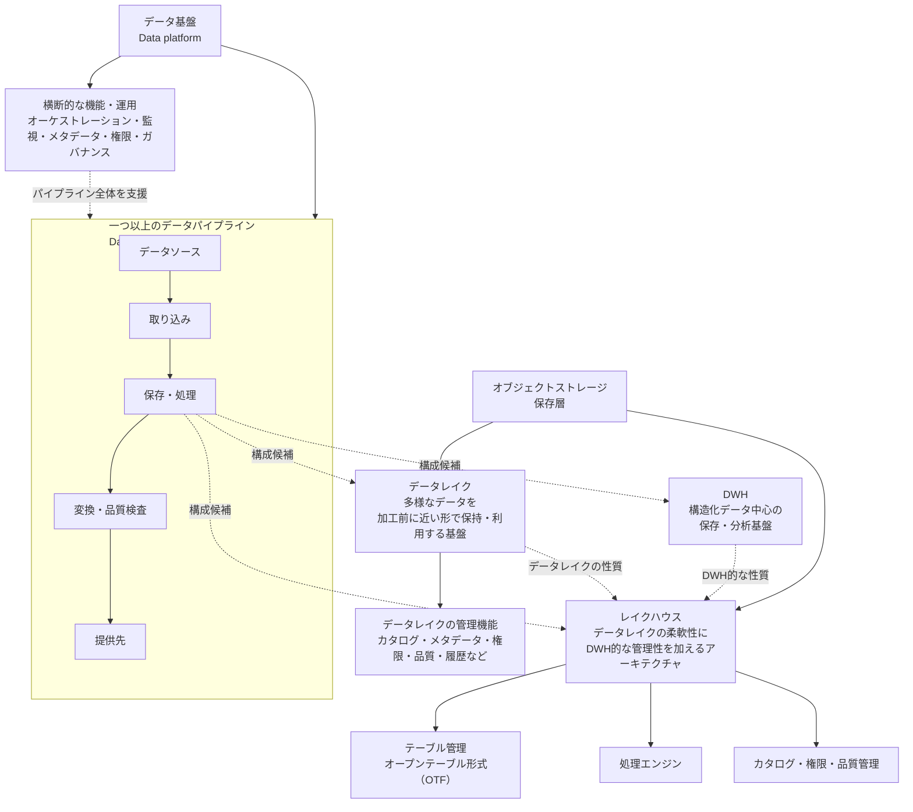

# Appendix A：用語集

## A.1 用語集の読み方

本用語集は、本文に登場するすべての製品名、技術名、関連概念を網羅する辞典ではない。

本資料の4つのCaseを読むうえで、意味を理解していないと設計判断の違いを読み取りにくい用語、一般語と専門的な意味が異なる用語、近接する用語と混同しやすい用語を中心に整理する。

各用語では、必要に応じて次の点を簡潔に示す。

1. 一般的な意味、または本資料での定義
2. 本資料での主な位置づけ
3. 近接用語との違い、または誤解しやすい注意点

すべての用語に同じ粒度の説明を付けるわけではない。本文全体で繰り返し使う用語、Case間の違いを理解するために重要な用語、公開文献や実務で用法が揺れやすい用語はやや詳しく説明する。一方で、本文中の短い説明で足りる用語は簡潔に扱う。

用語によっては、一般的な定義が一つに定まらない場合がある。その場合は、外部の用法を一つだけ絶対的な定義として扱うのではなく、「本資料では〜として扱う」と明示する。

本文の初出箇所でも必要に応じて短い説明を置くため、本用語集だけに定義を依存させるものではない。本用語集は、本文を読み進める際に概念の境界を確認するための参照用Appendixとして位置づける。

---

## A.2 基盤・保存

データ基盤では、データを集める経路、保存する場所、処理する仕組み、利用者へ提供する仕組みが組み合わさっている。初学者にとっては、DWH、データレイク、レイクハウス、オブジェクトストレージなどがすべて「データを置く場所」のように見えやすい。

しかし、これらの用語は同じ階層の概念ではない。DWHやデータレイクは保存・分析のための基盤や領域を指す。レイクハウスは、データレイクの柔軟性にDWHに近い管理性を加えようとするアーキテクチャを指す。オブジェクトストレージはデータレイクやレイクハウスの保存層として使われることがあり、オープンテーブル形式は主にレイクハウスで分析テーブルとしての管理を支える要素として登場する。

本節では、4つのCaseを読む前提として、データ基盤全体、データが流れる経路、保存・分析基盤、データレイク、レイクハウス、それらを支える構成要素の違いを整理する。

A.2で扱う用語は、同じ階層の概念ではない。

データ基盤は、一つ以上のデータパイプラインと、それらが利用する保存・処理基盤、横断的な管理機能、運用体制などを含む広い概念である。データパイプラインは、データソースから利用先までをつなぐ処理経路であり、その途中でDWH、データレイク、レイクハウスなどを保存先、処理場所、または提供基盤として利用する。

次の図は、これらの関係を理解するために単純化して示したものである。



※ この図は概念間の関係を理解するための単純化である。実際には、変換や品質検査がDWHまたはレイクハウス上で実行される場合や、保存・処理・提供の役割を一つのサービスが兼ねる場合がある。

---

### データ基盤（data platform）

データを収集、保存、処理、変換、管理し、分析、可視化、機械学習、業務利用などへ提供するための仕組み全体。

本資料では、一つ以上のデータパイプラインと、それらが利用する保存・処理基盤、複数のパイプラインを横断して支える権限管理、メタデータ管理、監視、ガバナンス、運用体制などを含む広い意味で扱う。

データ基盤は、特定の製品、単一のデータベース、または一つのデータパイプラインだけを指す語ではない。同じ組織内でも、目的ごとに異なる複数のデータパイプラインが存在し、それらがDWH、データレイク、レイクハウス、BI、機械学習向けの処理環境などを利用しながら、全体として一つのデータ基盤を構成する場合がある。

DWH、データレイク、レイクハウスなどは、データパイプラインとは独立した別経路ではなく、パイプラインの途中で保存先、処理場所、分析基盤、提供基盤として利用される場合がある。一方で、組織全体のデータカタログ、共通のアクセス制御、コスト管理、運用標準などは、個別のパイプラインを越えてデータ基盤全体を支える機能となる場合がある。

### データパイプライン（data pipeline）

データソースからデータを取り込み、必要な保存、処理、変換、品質検査、再処理、提供を行い、下流の利用者やシステムへ届ける一連の処理経路。

本資料では、4つのCaseを比較する中心概念として扱う。各Caseでは、データ量だけでなく、利用目的、更新頻度、鮮度、データソースと形式、信頼性・再処理要件、利用ワークロード、運用体制、ガバナンス、コストなどによって、パイプライン設計がどのように変わるかを確認する。

データパイプラインは、単にデータを一つの場所から別の場所へ移動する処理だけを意味しない。取り込み、保存、変換、品質検査、依存関係に沿った実行、失敗時の再試行、部分再実行、バックフィル、リプレイ、下流への提供などを含む場合がある。

また、オーケストレーション、監視、オブザーバビリティ、メタデータ管理、権限管理などは、パイプラインの処理経路を実行・管理するための機能として扱われる場合がある。ただし、これらが一つのパイプラインだけに属するとは限らず、複数のパイプラインを横断するデータ基盤側の共通機能として提供される場合もある。

どこからどこまでを一つのデータパイプラインとして扱うかは、利用目的、処理単位、所有者、障害対応、再処理範囲などの責任境界によって変わる。例えば、ソースからDWH上のマートまでを一つのパイプラインとして扱う場合もあれば、取り込み経路、変換経路、低レイテンシ経路、分析経路を別々のパイプラインとして管理する場合もある。

### データ形式による分類

構造化データ、半構造化データ、非構造化データは、データが事前に定められたデータモデルや規則へ、どの程度従って表現されているかを示す大まかな分類である。

この分類は、データの取得元や品質を示すものではなく、この分類だけでDWH、データレイク、レイクハウスなどの保存・処理基盤が決まるわけでもない。同じ種類のデータでも、利用目的、スキーマの管理方法、処理方法によって、異なる基盤で扱われる場合がある。

本資料では、保存、検証、変換、検索、提供方法へ影響するデータ形式上の評価軸として扱う。

#### 構造化データ（structured data）

事前に定められたデータモデルや規則に従い、項目、型、関係などを機械的に解釈しやすい形で整理されたデータ。固定された列と型を持つリレーショナルテーブルが代表例である。

CSVも、列、型、粒度などの取り決めに従って管理される場合は、構造化データとして扱われることがある。

構造化されていることは、データ品質が高いこと、業務上の意味が明確であること、欠損や重複がないことを意味しない。

#### 半構造化データ（semi-structured data）

固定された行と列の表形式へ完全にはそろっていないが、キー、タグ、階層、区切りなど、内容を識別し処理するための構造を持つデータ。JSONやXMLが代表例である。

レコードごとに項目や入れ子構造が異なる場合があるが、スキーマが存在しないとは限らない。スキーマを文書化、推論、検証し、構造化データに近い形で管理することもできる。

ログやイベントは、それ自体が常に半構造化データであるとは限らない。JSONログは半構造化、固定列ログは構造化、自由記述ログは非構造化に近い場合がある。

#### 非構造化データ（unstructured data）

固定された列やフィールドからなる詳細なデータモデルでは、内容全体を直接表現しにくいデータ。文書、画像、音声、動画などが代表例である。

非構造化データは、構造を一切持たないという意味ではない。ファイル形式、内部形式、メタデータなどの構造を持つ場合でも、その構造だけでは、文書や画像などが表す内容を業務上意味のある項目として直接扱えないことがある。

データ基盤では、文書や画像などの本体をオブジェクトとして保存し、識別子、保存場所、取得時点、権限、抽出したテキストや特徴などを、別の構造化されたテーブルで管理する場合がある。

### データウェアハウス（data warehouse: DWH）

分析やレポーティングを目的として、主に構造化データを中心に、必要に応じて半構造化データも蓄積し、SQLによる集計、結合、変換、問い合わせに利用する保存・分析基盤。

本資料では、Case 1・Case 2における中心的な保存・分析基盤として扱う。Case 3では低レイテンシ経路とは別に、履歴分析やBI向けの分析経路で利用される場合がある。Case 4でも、レイクハウスと併用される分析基盤、または一部ワークロードを担う基盤として登場し得る。

DWHは、業務アプリケーションのトランザクション処理を担う業務DBとは目的が異なる。DWHは、分析、集計、レポート、意思決定支援に適した形でデータを保持・処理することを主な目的とする。

### データレイク（data lake）

構造化データ、半構造化データ、非構造化データを、比較的加工前の形式や元の形式に近い形で保存し、後から探索、分析、機械学習などに利用できるようにするためのデータ基盤。

本資料では、Case 4を理解する前提として扱う。多様な形式のデータ、長期履歴、生データ、探索的分析、機械学習向けのデータを保持したい場合に、DWH中心構成だけでは不足する可能性がある。

データレイクの中核には、多様なデータを保存する領域がある。ただし、保存領域だけを用意しても、信頼して利用できるデータレイクにはなりにくい。

実用的なデータレイクでは、保存したデータを探し、意味を理解し、安全に利用するために、データの所在、意味、所有者、権限、品質、更新履歴などを管理する必要がある。これらの管理は、カタログ、メタデータ管理、アクセス制御、品質管理、更新履歴管理などの仕組みによって支えられる。

### レイクハウス（data lakehouse）

レイクハウスは、発想としては、データレイクの柔軟な保存能力と、DWHに近いテーブル管理、信頼性、性能、ガバナンスを組み合わせようとするアーキテクチャである。

ただし、DWHとデータレイクを単に併用すればレイクハウスになるわけではない。本資料では、レイクハウスを、保存層、オープンテーブル形式、処理エンジン、カタログ、権限管理、品質管理、ガバナンス、運用体制などを組み合わせたデータ基盤アーキテクチャとして扱う。

Case 4では、構造化、半構造化、非構造化データを共通基盤に保持し、BI、探索的分析、データサイエンス、機械学習など複数のワークロードへ提供する構成の候補として位置づける。

レイクハウスは、単にデータ量が大きいから採用するものではない。また、機械学習チームが存在するだけで必ず必要になるものでもない。多様なデータ形式、複数ワークロード、長期履歴、再現性、共通ガバナンスが重要になる場合に候補となる。

### オブジェクトストレージ（object storage）

データをファイルシステム上の階層的なファイルではなく、オブジェクト単位で保存するストレージ方式。各オブジェクトは、データ本体、メタデータ、識別子を持つ。

本資料では、主にCase 4において、データレイクやレイクハウスの基盤となる保存層として扱う。生データ、ログ、JSON、文書、画像、長期履歴など、多様な形式のデータを保存する場所になり得る。

ただし、オブジェクトストレージ単体では、分析テーブルとしてのテーブル管理、トランザクション、スキーマ変更、履歴管理、クエリ最適化、テーブル単位の権限管理、カタログなどを包括的に提供するわけではない。これらは、オープンテーブル形式、処理エンジン、カタログ、ガバナンス機能などの追加の仕組みと組み合わせて補う必要がある。

### オープンテーブル形式（open table format: OTF）

オブジェクトストレージ上のデータファイルを、分析用テーブルとして扱うためのテーブル形式。スキーマ、メタデータ、スナップショット、履歴、ファイル一覧、トランザクション管理などを扱い、複数の処理エンジンから同じテーブルを利用しやすくする。

本資料では、Case 4において、現代的なレイクハウスを支える重要構成要素の一つとして扱う。Apache Iceberg、Delta Lake、Apache Hudiなどが代表例である。

オープンテーブル形式は、レイクハウスそのものではない。主に、オブジェクトストレージ上のデータを管理された分析テーブルとして扱う層を担う。

---

## A.3 データの権威性

データ基盤では、同じように見えるデータが複数の場所に存在することがある。

例えば、注文データは業務アプリケーションのデータベースにも、DWHにも、BI用の売上マートにも存在し得る。このとき、どのシステムが正式な業務状態を確定するのか、どのデータをレポートや分析で信頼して参照するのかを区別しなければ、利用者やシステムごとに異なる数値や状態を見てしまう可能性がある。

本節では、どのデータを正式なもの、または信頼して参照すべきものとして扱うかを説明するために、次の用語を整理する。

- 記録の正本システム（System of Record: SoR）
- 信頼できる参照元（Source of Truth: SoT）
- 単一の信頼できる参照元（Single Source of Truth: SSoT）

---

### 記録の正本システム（System of Record: SoR）

特定の業務ドメイン、業務プロセス、またはデータ要素について、正式な状態を作成、更新、確定する権威あるシステム。

例えば、注文管理システムが注文状態を確定する場合、そのシステムは注文状態に対するSoRとなる。下流のDWHやキャッシュが注文データのコピーを保持していても、通常、それだけで注文状態のSoRにはならない。

本資料では、Case 3において、SoRが確定したデータ変更や業務イベントを、低レイテンシ経路が下流へ伝播・処理する構成を扱う。

ただし、イベントソーシング（event sourcing）を採用する構成では、イベントストアがシステム状態を再構築するための正本となる場合がある。

### 信頼できる参照元（Source of Truth: SoT）

特定の目的、問い、利用者、または業務判断に対して、参照すべき信頼されたデータ源。

SoTはSoRと一致する場合もあれば、SoRから取得したデータを統合、変換、品質検査したDWH上のデータセットになる場合もある。

例えば、注文状態については注文管理システムがSoRであっても、全社の公式売上報告については、返品、キャンセル、会計ルールを反映したDWH上の売上マートがSoTになることがある。

SoTという語はSoRとほぼ同じ意味で使われる場合もあるため、本資料では「どの目的に対するSoTか」を明示する。

### 単一の信頼できる参照元（Single Source of Truth: SSoT）

指定されたデータ、定義、指標、または利用目的について、組織やシステムが一つの合意されたSoTを参照する原則または状態。

SSoTは、組織内のすべてのデータを一つの物理システムへ保存することを必ずしも意味しない。

複数のシステムやコピーが存在しても、正式な参照先、更新責任、同期方法が明確であれば、限定された範囲でSSoTを実現できる。

例えば、すべての売上レポートが同じ売上マートと指標定義を参照する場合、その売上マートと定義は公式売上報告におけるSSoTとして機能する。

### 本資料での整理

本資料では、次のように区別する。

- SoRは、業務状態を作成、更新、確定する権威あるシステムを指す。
- SoTは、特定の目的や問いに対して信頼して参照するデータ源を指す。
- SSoTは、指定された範囲で一つのSoTを参照する原則または状態を指す。

これらの用語は資料や文脈によって使い分けが異なる場合があるため、本資料内ではこの定義に統一する。

---

## A.4 データ経路とイベント

Case 3では、業務システムで確定したデータ変更や業務イベントを、下流のアプリケーション、アラート、分析基盤などへ低レイテンシで伝播する構成を扱う。

このとき、業務上の状態を正式に作成・更新する経路、確定した変更やイベントを迅速に処理する経路、履歴を蓄積して分析する経路を混同すると、どこまでを本資料の対象とするのかが分かりにくくなる。

本節では、Case 3を理解する前提として、次の用語を整理する。

- トランザクション経路（transactional path）
- 低レイテンシ経路（low-latency path）
- 分析経路（analytical path）
- 業務イベント（business event）
- イベントブローカー（event broker）

---

### トランザクション経路（transactional path）

業務上の状態を作成・更新し、その結果を正式な状態として確定する経路。

例えば、注文、取引、契約、配送指示、設備制御などの正式な状態更新を扱う。

本資料のCase 3では、トランザクション経路全体の設計は原則として対象外とし、そこから確定した変更やイベントを下流で処理する経路を中心に扱う。

### 低レイテンシ経路（low-latency path）

データ変更やイベントの発生後、秒〜数分程度で下流のアプリケーション、アラート、運用処理などへ結果を提供する経路。

重複、遅延、順序入れ替わり、状態管理、再処理などを考慮する必要がある。

低レイテンシ経路は、上流のトランザクション経路を必ずしも置き換えるものではない。

### 分析経路（analytical path）

業務データやイベント履歴をDWHまたはレイクハウスへ蓄積し、分析、レポーティング、指標計算、機械学習などへ提供する経路。

Case 3では、低レイテンシ経路と並行して分析経路を持ち、dbtやDataformなどで分析用変換を行う場合がある。

### 業務イベント（business event）

業務上意味のある事実または状態変化を表すイベント。

多くの場合、「注文が確定した」「契約が開始された」「配送状態が変更された」のように、すでに起きた事実として扱う。

例として、取引の確定、契約の開始、配送状態の変更、設備異常の検出などがある。

単なる技術ログとは異なり、下流の業務処理や分析が判断に利用できる意味を持つ。

### イベントブローカー（event broker）

イベント生成元とイベント利用側の間でイベントを受け取り、一時保持または一定期間保持し、下流へ配送するコンポーネント。

生成元と利用側を時間的・技術的に分離し、下流処理の一時停止、複数利用者への配信、再処理などを支援する。

イベントブローカーを導入しただけで、重複排除、業務上の順序保証、冪等性が自動的に満たされるとは限らない。

---

## A.5 取り込み・処理方式

データパイプラインでは、データをどのタイミングで取得するか、どの範囲を処理するか、変更をどのように検出するかによって、構成と運用の複雑さが変わる。

例えば、日次で全データを作り直す構成と、数分ごとに変更分だけを取り込む構成では、必要な監視、失敗時の復旧、コスト、データ鮮度が異なる。また、データを増分で取り込むことと、取り込んだデータを増分で変換・集計することは同じではない。

本節では、4つのCaseを理解する前提として、データの取り込み方式と処理方式に関する次の用語を整理する。

- バッチ処理（batch processing）
- フルリフレッシュ（full refresh）
- 増分取り込み（incremental ingestion）
- 増分処理（incremental processing）
- 変更データキャプチャ（Change Data Capture: CDC）
- ストリーム処理（stream processing）
- マイクロバッチ処理（micro-batch processing）

---

### バッチ処理（batch processing）

一定範囲のデータをまとめて処理する方式。

例えば、1日分の注文データを夜間に取り込み、集計して翌朝のレポートへ反映する処理は、バッチ処理の一例である。

本資料では、Case 1やCase 2における基本的な処理方式として扱う。日次、数時間ごと、または決められたスケジュールで処理すれば十分な場合、バッチ処理は構成を単純に保ちやすい。

ただし、バッチ処理は必ずしも「全データを毎回処理する」ことを意味しない。バッチ処理の中でも、毎回全体を作り直す場合もあれば、追加・変更分だけを処理する場合もある。

### フルリフレッシュ（full refresh）

対象データを、既存の結果に追加・更新するのではなく、毎回最初から作り直す方法。

例えば、ある集計テーブルを作るたびに既存テーブルを破棄し、元データ全体から再計算して作り直す場合は、フルリフレッシュにあたる。

本資料では、Case 1のようにデータ量が小さく、処理時間とコストが許容範囲に収まる場合の単純な構成として扱う。処理結果を毎回作り直すため、増分処理に比べてロジックを理解しやすく、過去の取り込み漏れや途中状態を引きずりにくい。

一方で、データ量、処理時間、コストが増えると、毎回全体を再処理することが難しくなる。その場合、増分取り込みや増分処理を検討する必要がある。

### 増分取り込み（incremental ingestion）

前回の取り込み以降に追加または変更されたデータだけを、ソースから取得する方法。

例えば、更新日時、連番ID、変更ログなどを使って、新しく作成または更新されたレコードだけをDWHへ取り込む場合は、増分取り込みにあたる。

本資料では、特にCase 2以降で重要になる。複数ソースを扱い、データ量や更新頻度が増えると、毎回すべてのデータを取り込むよりも、変更分だけを取得する方が効率的になる場合がある。

増分取り込みは、ソースから保存先へどの範囲のデータを取得するかを指す。取り込んだ後のデータをどの範囲で変換・集計するかは、増分処理として別に考える。

### 増分処理（incremental processing）

すでに保存されたデータ全体を毎回処理するのではなく、追加・変更された範囲、または影響を受ける範囲だけを変換・集計する方法。

例えば、新しく取り込まれた注文データだけを対象に集計テーブルを更新する場合や、特定の日付パーティションだけを再計算する場合は、増分処理にあたる。

本資料では、Case 2のようにモデル数、依存関係、データ量が増える環境で重要になる。増分処理を使うと、処理時間やコストを抑えられる可能性がある。

ただし、増分処理では、どのデータが新しいのか、どの範囲を再計算すべきか、遅れて到着したデータや訂正をどう扱うかを設計する必要がある。単純なフルリフレッシュよりも、処理ロジックと復旧手順は複雑になりやすい。

### 変更データキャプチャ（Change Data Capture: CDC）

データベースで発生した追加、更新、削除などの変更を検出し、変更分を別のシステムへ転送する仕組み。

CDCは、アプリケーションDBの状態変化をDWH、レイクハウス、イベントブローカー、下流アプリケーションなどへ反映するために使われる。

本資料では、Case 3において、業務システムで確定した変更を低レイテンシで下流へ伝える取り込み方式として扱う。秒〜数分単位の鮮度が必要な場合や、変更履歴を利用したい場合に候補となる。

ただし、CDCを採用しても、その後の処理が必ずストリーム処理になるとは限らない。CDCで変更分を継続的に取得し、DWHへ蓄積したうえで、増分処理やマイクロバッチ処理を行う構成もあり得る。

### ストリーム処理（stream processing）

継続的に到着するイベントやデータを、到着に近いタイミングで処理し続ける方式。

例えば、注文イベントを受け取ってリアルタイム指標を更新する、設備異常イベントを検出してアラートを出す、不正利用の兆候を短時間で判定する、といった処理が該当する。

本資料では、Case 3における低レイテンシ経路の中心的な処理方式として扱う。データ鮮度が秒〜数分単位で必要であり、遅延、重複、順序入れ替わり、状態管理、再処理などを扱う必要がある場合に候補となる。

ストリーム処理は、バッチ処理の単純な上位互換ではない。低レイテンシの価値が明確であり、継続運用に必要な監視、障害対応、復旧手順を持てる場合に採用を検討する。

### マイクロバッチ処理（micro-batch processing）

短い時間間隔や小さなデータ単位ごとに、データを小分けのバッチとして処理する方式。

例えば、1日1回ではなく、5分ごと、15分ごと、1時間ごとに新着データをまとめて処理する構成は、マイクロバッチ処理に近い。

本資料では、通常のバッチ処理とストリーム処理の中間的な選択肢として扱う。イベントごとの継続処理までは必要ないが、日次バッチよりも高い鮮度を得たい場合に候補となる。

ただし、マイクロバッチ処理は、真にイベントごとに即時処理する方式とは異なる。処理間隔、取り込み遅延、再実行単位、下流への反映タイミングを設計する必要がある。

---

## A.6 再処理・復旧

データパイプラインでは、処理が失敗した場合や、過去データを修正したい場合に、安全に処理をやり直せることが重要になる。

例えば、取り込み処理が途中で失敗した、上流データの一部が遅れて到着した、変換ロジックに誤りが見つかった、過去期間の指標を再計算したい、といった状況では、単に処理をもう一度実行すればよいとは限らない。

再実行によって同じデータが重複して書き込まれたり、一部だけ古いロジックで計算された状態が残ったりすると、下流のレポートやアプリケーションに誤った結果を提供してしまう可能性がある。

本節では、データパイプラインの失敗対応、再処理、復旧を理解するために、次の用語を整理する。

- バックフィル（backfill）
- リプレイ（replay）
- 部分再実行（partial rerun）
- 冪等性（idempotency）
- チェックポイント（checkpoint）

---

### バックフィル（backfill）

過去の一定範囲のデータを、後からまとめて取り込み直したり、再計算したりする処理。

例えば、新しい集計ロジックを導入した後に、過去1年分の売上指標を同じロジックで再計算する場合や、取り込み漏れがあった期間のデータを後から補完する場合は、バックフィルにあたる。

本資料では、特にCase 2以降で重要になる再処理方法として扱う。データ量やモデル数が増えると、全体を毎回フルリフレッシュするのではなく、対象期間や対象テーブルを絞って再処理する必要が出てくる。

バックフィルでは、通常処理と過去分の再処理が競合しないようにする必要がある。また、古いロジックと新しいロジックの結果が混在しないように、対象範囲、実行順序、下流への反映タイミングを設計する必要がある。

### リプレイ（replay）

過去に保存されたイベント、変更履歴、ログなどを、もう一度読み出して処理し直すこと。

例えば、イベントブローカーや生イベント保存領域に残っている注文イベントを再度読み込み、新しい処理ロジックで集計結果を作り直す場合は、リプレイにあたる。

本資料では、主にCase 3で重要になる。低レイテンシ経路では、イベント処理の失敗、ロジック変更、下流ストアの再構築などに対応するため、過去イベントを再処理できる設計が必要になる場合がある。

リプレイはバックフィルと似ているが、バックフィルが過去期間のデータを補完・再計算する広い意味で使われるのに対し、リプレイは特に保存済みのイベントや変更履歴を再度流して処理する意味で使う。

リプレイを安全に行うには、同じイベントを再処理しても結果が重複しないこと、処理順序や対象範囲が明確であること、古い処理結果をどのように置き換えるかが決まっていることが重要になる。

### 部分再実行（partial rerun）

失敗した処理や影響を受けた範囲だけを、限定して再実行すること。

例えば、10個の変換モデルのうち1つだけが失敗した場合に、その失敗したモデルと下流の依存モデルだけを再実行する場合は、部分再実行にあたる。

本資料では、特にCase 2以降で重要になる。モデル数、依存関係、処理時間が増えると、すべてを最初から実行し直すよりも、失敗した範囲だけを安全に再実行できることが運用上重要になる。

部分再実行では、どこからやり直せば整合性が保てるのかを判断する必要がある。失敗した処理だけを再実行すればよい場合もあれば、その下流にある集計、マート、レポート用データも再実行する必要がある場合もある。

### 冪等性（idempotency）

同じ入力や同じ対象範囲に対して同じ処理を複数回実行しても、最終的な結果が意図せず変わらない性質。

例えば、同じ注文データを再度処理しても、売上テーブルに同じ注文が二重に追加されず、最終的に一つの注文として扱われるなら、その処理は冪等性を持つように設計されていると言える。

本資料では、再試行、部分再実行、バックフィル、リプレイを安全に行うための重要な性質として扱う。処理が冪等でない場合、失敗後に再実行しただけで重複、過大集計、不整合が発生する可能性がある。

冪等性は、単に「同じSQLをもう一度実行できる」という意味ではない。書き込み先の更新方法、一意キー、重複排除、上書き範囲、トランザクション、処理済みデータの管理などを含めて、再実行しても結果が壊れないように設計する必要がある。

### チェックポイント（checkpoint）

処理がどこまで進んだか、またはどの状態まで正しく処理できたかを記録する仕組み。

例えば、どのイベントまで処理したか、どのファイルまで取り込んだか、どの時点の状態まで集計済みかを記録しておくことで、失敗後に最初からではなく、適切な位置から処理を再開できる。

本資料では、特にCase 3のストリーム処理や、Case 2以降の増分処理で重要になる。継続的に到着するデータを扱う場合、処理済みの範囲を正しく管理できなければ、データの欠落や重複が発生しやすくなる。

ストリーム処理エンジン、CDCツール、取り込みツールでは、どこまで処理したかを記録するために、チェックポイントやオフセットのような仕組みが使われることがある。ただし、その名称、記録する単位、失敗後にどこから再開できるかは、ツールや設定によって異なる。

チェックポイントがあっても、出力先への重複書き込みや不整合が自動的に防がれるとは限らないため、冪等性や出力側の更新方法と合わせて設計する必要がある。

---

## A.7 実行制御・運用

データパイプラインでは、個々の処理を作るだけでなく、複数の処理をどの順序で実行するか、失敗をどう検知するか、下流にどのような影響があるかを把握する必要がある。

例えば、取り込みが完了していない状態で変換処理を実行すると、古いデータや欠けたデータを使ってレポートを更新してしまう可能性がある。また、あるモデルの変更がどのマートやBIレポートへ影響するかを把握できなければ、安全に変更することが難しくなる。

本節では、データパイプラインの実行制御と運用を理解するために、次の用語を整理する。

- ワークフロー（workflow）
- オーケストレーション（orchestration）
- オーケストレーター（orchestrator）
- データ鮮度（data freshness）
- オブザーバビリティ（observability）
- リネージ（lineage）

---

### ワークフロー（workflow）

複数の作業や処理を、一定の順序や依存関係に沿って実行する流れ。

例えば、データを取り込み、変換し、品質検査を行い、BI用データマートを更新する一連の処理は、データパイプライン上のワークフローとして捉えられる。

本資料では、ワークフローを、処理の流れや依存関係そのものを指す語として扱う。どの処理を先に実行し、どの処理が完了したら次に進むのかを表す概念である。

ワークフローは、必ずしも専用ツールで管理されるとは限らない。小規模な構成では、DWHや変換ツールのスケジューラー、マネージドサービスの機能、または手順書によって簡易的に管理される場合もある。

### オーケストレーション（orchestration）

複数の処理の実行順序、依存関係、スケジュール、再試行、失敗通知などを制御すること。

例えば、取り込み完了を確認してから変換処理を実行し、品質検査に成功した場合だけ下流データを更新し、失敗時には通知するような制御は、オーケストレーションにあたる。

本資料では、Case 2以降で特に重要になる。ソース、モデル、依存関係、利用者が増えると、単に個別の処理をスケジュールするだけでは、失敗時の影響範囲や再実行範囲を管理しにくくなる。

オーケストレーションは、処理を実行することだけを指すのではなく、どの条件が満たされたら実行するか、失敗したときにどこから再開するか、どの範囲を再実行するか、誰に通知するかを含む運用上の制御である。

### オーケストレーター（orchestrator）

オーケストレーションを実行するためのツールまたはシステム。

例えば、複数のデータ取り込み、変換、品質検査、通知処理を依存関係に沿って管理するツールは、オーケストレーターとして機能する。

本資料では、Case 2のように複数ソース、複数モデル、部分再実行、失敗通知が重要になる環境で導入候補として扱う。Case 1のように処理数が少なく、製品内のスケジューラーで十分な場合は、専用オーケストレーターを導入しない判断もあり得る。

オーケストレーターを導入しても、データ品質、冪等性、業務定義、権限管理が自動的に整うわけではない。オーケストレーターは主に処理の実行制御を担うものであり、各処理の中身や出力結果の正しさは別に設計する必要がある。

### データ鮮度（data freshness）

データが、期待される時点までに更新されているかを表す観点。

例えば、毎朝9時までに前日分の売上データが更新されている必要がある場合、9時時点で最新データが反映されているかはデータ鮮度の問題である。

本資料では、各Caseの処理方式を比較する重要な条件として扱う。Case 1では日次更新で十分な場合があり、Case 2では数時間ごとの更新、Case 3では秒〜数分単位の鮮度が必要になる場合がある。

データ鮮度は、単に処理が成功したかどうかとは異なる。ジョブが成功していても、上流データが遅れていれば、下流のデータは古い可能性がある。そのため、最終更新時刻、取り込み対象期間、上流到着時刻、下流反映時刻などを確認する必要がある。

### オブザーバビリティ（observability）

システムやデータパイプラインの内部状態を、外部から観測できる情報によって把握し、異常や原因を調査できるようにする考え方。

データパイプラインでは、ジョブの成功・失敗だけでなく、データ鮮度、データ量、実行時間、スキーマ変更、分布変化、品質検査結果、下流への影響などを観測することが重要になる。

本資料では、特にCase 2以降で重要になる運用上の能力として扱う。処理数、利用者、下流レポートが増えると、問題が発生したときに「どの処理が失敗したのか」「どのデータが古いのか」「どの利用者へ影響するのか」を把握する必要がある。

オブザーバビリティは、単なる監視ダッシュボードではない。監視が主に既知の異常やしきい値を検知する活動だとすれば、オブザーバビリティは、異常の原因調査、影響範囲の把握、復旧判断につなげるための情報を持つことまで含む。

### リネージ（lineage）

データがどこから来て、どの処理で変換され、どの下流データやレポートへ使われているかをたどるための情報。

例えば、あるBIレポートの数値が、どのソーステーブル、どの変換モデル、どのデータマートから作られているかをたどれる場合、その関係はリネージとして表現できる。

本資料では、データ変更の影響範囲を把握するための重要な情報として扱う。モデルやカラムを変更する前に、下流のマート、BIレポート、機械学習用データへどのような影響があるかを確認できると、安全に変更しやすくなる。

リネージは、処理の依存関係を完全に理解するための唯一の情報源ではない。業務定義、データの意味、利用者の使い方までは、リネージだけでは十分に分からない場合がある。そのため、リネージはメタデータ、ドキュメント、所有者情報、品質情報などと合わせて利用する必要がある。

---

## A.8 ストリーミング固有

ストリーム処理では、データが継続的に到着するため、「イベントが実際に発生した時刻」「イベントが処理基盤へ到着した時刻」「処理基盤が実際に処理した時刻」を区別する必要がある。

また、イベントは必ずしも発生した順番どおりに到着するとは限らない。同じイベントが複数回届く場合や、遅れて届く場合もある。そのため、低レイテンシ経路では、時刻、順序、重複、状態をどのように扱うかが重要になる。

本節では、Case 3のストリーム処理を理解するために、次の用語を整理する。

- イベント時刻（event time）
- 到着時刻（ingestion time / arrival time）
- 処理時刻（processing time）
- 遅延イベント（late event）
- 順序保証（ordering guarantee）
- 重複排除（deduplication）
- 状態管理（state management）

例えば、注文イベントについて、3つの時刻は次のように区別できる。

```text
10:00  注文が確定
       → イベント時刻（event time）

10:03  注文イベントがKafkaやPub/Sub、取り込み基盤、DWHのstaging領域などに届く
       → 到着時刻（ingestion time / arrival time）

10:04  ストリーム処理や変換処理が、その注文イベントを読み取り、集計・判定・書き込みを行う
       → 処理時刻（processing time）
```

ただし、どの時点を到着時刻や処理時刻として扱うかは、データ基盤の構成や利用するツールによって変わる。

---

### イベント時刻（event time）

イベントが実際に発生した時刻。

例えば、注文が10:00に確定し、その注文イベントが10:03にデータ基盤へ到着した場合、注文が確定した10:00がイベント時刻にあたる。

本資料では、Case 3において、業務上の事実がいつ発生したかを基準に集計や判定を行うための時刻として扱う。売上、在庫、異常検知、利用行動などを正しく時系列で扱うには、処理された時刻ではなく、イベントが発生した時刻を使う必要がある場合がある。

イベント時刻を使う場合、遅れて届いたイベントをどう扱うかを設計する必要がある。イベントが処理基盤に届いた時刻だけで集計すると、実際には10:00に発生した注文が、10:03以降のデータとして扱われてしまう可能性がある。

### 到着時刻（ingestion time / arrival time）

イベントが、データ基盤、取り込み基盤、イベントブローカー、または保存先のステージング領域などに届いた時刻。

例えば、注文が10:00に確定し、その注文イベントが10:03にデータ基盤へ到着し、10:04に処理された場合、10:03が到着時刻にあたる。

ただし、到着時刻は必ずしも最終的な保存先に書き込まれた時刻だけを意味しない。イベントブローカーが受け取った時刻、取り込みツールが受信した時刻、DWHのステージング領域へロードされた時刻など、どの層を基準にするかによって意味が変わる。

本資料では、到着時刻を、イベントが処理対象としてデータ基盤側に現れた時刻として扱う。イベント時刻は業務上の事実が発生した時刻であり、処理時刻は処理ロジックがそのイベントを実際に処理した時刻である。一方、到着時刻は、その中間にある時刻として、イベントの遅延や取り込み遅延を把握するうえで役立つ。

ただし、ingestion time、arrival time、受信時刻などの呼び方や正確な意味は、製品や処理基盤によって異なる場合がある。

### 処理時刻（processing time）

イベントやデータを、処理基盤が実際に処理した時刻。

例えば、10:00に発生した注文イベントが10:03に到着し、10:04に処理された場合、10:04が処理時刻にあたる。

到着時刻が「データ基盤側に届いた時刻」を指すのに対し、処理時刻は、そのイベントを処理ロジックが読み取り、変換、集計、判定、出力などに利用した時刻を指す。

イベントが到着していても、処理待ち、バッファリング、スケジューリング、障害などによって、実際に処理されるまで時間差が生じる場合がある。

本資料では、処理の遅延、システム負荷、処理基盤上の実行タイミングを把握するための時刻として扱う。処理時刻は、実際の業務上の発生時刻とは異なる場合がある。

処理時刻は扱いやすい一方で、業務上の時系列を正確に表すとは限らない。イベントの到着が遅れたり、処理が滞留したりすると、処理時刻に基づく集計結果は、実際の発生時刻に基づく結果とずれる可能性がある。

### 遅延イベント（late event）

集計や判定に反映するために想定した締切より遅れて到着するイベント。

例えば、10:00に発生した注文イベントが、ネットワーク遅延や上流システムの一時停止によって10:30に到着した場合、そのイベントは遅延イベントとして扱われることがある。

本資料では、Case 3において、低レイテンシ処理と正確性のトレードオフを理解するための用語として扱う。早く結果を出すことを優先すると、遅れて届いたイベントを反映できない場合がある。一方で、遅延イベントを長く待ちすぎると、速報値の提供が遅くなる。

遅延イベントを扱う場合、どの程度の遅れまで受け入れるか、集計や判定をいつ締め切るか、すでに出した集計結果を後から修正するか、速報値と確定値を分けるかを設計する必要がある。

### 順序保証（ordering guarantee）

イベントが特定の順序で処理されることを保証する性質、またはその保証範囲。

例えば、同じ注文IDに対して「注文作成」「支払い完了」「キャンセル」が発生する場合、これらのイベントを業務上意味のある順序で処理できなければ、下流の状態が不正確になる可能性がある。

本資料では、Case 3において、イベントの順序入れ替わりをどこまで許容できるかを考えるための用語として扱う。すべてのイベントに対して完全な全体順序を保証することは難しい場合が多く、実際には注文ID、ユーザーID、デバイスIDなど、特定のキーごとの順序を考える場合がある。

順序保証は、イベントブローカーやストリーム処理エンジンを導入すれば自動的に満たされるとは限らない。どの範囲で順序が必要か、順序が崩れた場合にどう補正するかを設計する必要がある。

順序が業務上の最終状態に影響する場合は、キーによる順序制御だけでなく、イベント時刻、バージョン番号、連番、イベントID、状態遷移ルールなど、下流側で前後関係や重複を判断できる情報を組み合わせて設計する必要がある。

### 重複排除（deduplication）

同じイベントや同じデータが複数回処理されても、最終結果で重複として扱われないようにする処理。

例えば、同じ注文イベントが再送によって2回届いた場合に、売上を2件分として集計しないようにすることは、重複排除にあたる。

本資料では、Case 3において、再送、リトライ、リプレイ、障害復旧による重複を扱うための重要な処理として扱う。ストリーム処理では、同じイベントが複数回届く可能性を前提に、イベントID、一意キー、処理済み記録、出力先の更新方法などを使って重複を防ぐ必要がある場合がある。

重複排除は、冪等性と密接に関係する。ただし、重複排除は主に同じイベントやレコードを二重に扱わないための処理であり、冪等性は同じ処理を複数回実行しても最終結果が壊れないようにする性質である。

重複排除を行うには、イベントID、一意キー、処理済み記録、状態ストア、出力先の一意制約やupsert / mergeなどを組み合わせる。どの期間まで処理済み情報を保持するかを決めないと、状態が増え続ける点にも注意が必要である。

### 状態管理（state management）

過去に処理したイベントや途中計算の結果を保持し、後続のイベント処理に利用すること。

例えば、直近5分間のアクセス数を集計する、ユーザーごとの直近のログイン状態を保持する、注文IDごとの現在状態を更新する、といった処理では、過去のイベントや途中結果を保持する必要がある。

本資料では、Case 3において、低レイテンシ処理が単なるイベントの通過処理では済まなくなる条件として扱う。フィルタリングや単純な転送だけであれば状態管理は小さく済む場合があるが、ウィンドウ集計、重複排除、セッション化、現在状態の更新などを行う場合は、状態管理が重要になる。

状態管理は、ストリーム処理における「記憶」に相当する。今来たイベントだけでは判断できない場合に、過去のイベント、処理済みID、途中集計、現在状態などを保持し、後続のイベント処理に利用する。

状態管理は、ストリーム処理エンジンやフレームワークが提供する state store や checkpoint などの機能を使って実現される場合がある。また、処理済みIDや現在状態を外部DBやDWHテーブルに保持して実現する場合もある。ただし、ツールを導入すれば状態管理が自動的に正しくなるわけではなく、どのキー単位で状態を持つか、どの期間保持するか、不要になった状態をどう削除するか、障害時にどう復旧するかを設計する必要がある。

---

## A.9 提供・利用

データパイプラインでは、データを取り込み、保存し、変換するだけでは不十分である。最終的には、BIレポート、業務判断、アプリケーション、機械学習など、具体的な利用目的に合わせて提供する必要がある。

同じデータであっても、利用者や用途によって求められる形は異なる。人がBIツールで分析するために整備されたデータ、業務用語で指標を一貫して定義する層、アプリケーションが低レイテンシで参照する保存先、機械学習モデルが利用する特徴量データでは、設計上の関心が異なる。

本節では、データの提供・利用に関する次の用語を整理する。

- データマート（data mart）
- セマンティックレイヤー（semantic layer）
- サービングストア（serving store）
- 特徴量テーブル（feature table）
- 特徴量ストア（feature store）

---

### データマート（data mart）

特定の業務領域、部門、分析目的に合わせて整備された、利用しやすい形のデータセット。

例えば、売上分析用の注文マート、顧客分析用の顧客マート、アクセス分析用の行動マートなどがデータマートにあたる。

本資料では、DWHやレイクハウスに保存されたデータを、BIレポート、ダッシュボード、アドホック分析などで利用しやすい形に整えた層として扱う。ソースシステムの構造をそのまま見せるのではなく、業務上の意味、粒度、指標、結合関係を整理して提供することが重要になる。

データマートは、必ずしも小規模なデータだけを指すわけではない。重要なのは、利用目的に合わせて設計されていることである。全社的に共通利用されるマートもあれば、特定部門や特定レポート向けに作られるマートもある。

### セマンティックレイヤー（semantic layer）

物理的なテーブルやカラムを、業務上の意味、指標、ディメンション、計算ルールとして利用者に分かりやすく提供する層。

例えば、売上、粗利、継続率、アクティブユーザー数などの指標について、どのテーブルを使い、どの条件で集計し、どの粒度で解釈するかを定義する役割を持つ。

本資料では、セマンティックレイヤーを、データ利用者が物理的なスキーマを直接意識しなくても、一貫した業務定義に基づいてデータを利用できるようにする層として扱う。BIツールのセマンティックモデル、メトリクス定義、専用のセマンティックレイヤー製品、独自の指標定義管理など、実装方法は環境によって異なる。

セマンティックレイヤーは、単に表示名を分かりやすくするだけの層ではない。指標定義、集計粒度、フィルタ条件、結合関係、利用可能なディメンション、権限などを整理し、同じ指標が利用者やレポートごとに異なる意味で使われることを防ぐ役割を持つ。

ただし、セマンティックレイヤーを導入しても、業務定義の合意が自動的に成立するわけではない。どの指標を公式な定義とするか、例外条件をどう扱うか、誰が定義を管理するかは、技術だけでなく組織的な設計も必要になる。

### サービングストア（serving store）

アプリケーション、API、検索、レコメンド、リアルタイム参照などに向けて、データを低レイテンシで提供するための保存先。

例えば、ユーザーごとの現在状態をAPIから参照するためのkey-value store、検索用インデックス、レコメンド候補を保持するストア、アプリケーションが機械学習モデルを即時に呼び出すときに使う特徴量を保持するストアなどがサービングストアにあたる。

本資料では、主にCase 3やCase 4において、分析基盤で処理した結果をアプリケーションや機械学習システムへ提供するための保存先として扱う。DWHやレイクハウスが大規模な分析クエリや履歴管理に向く一方で、アプリケーションから高頻度・低レイテンシに参照する用途では、アクセスパターンに合わせて別の保存先を用意する場合がある。

サービングストアは、記録の正本システム（System of Record: SoR）とは限らない。多くの場合、上流の業務システム、DWH、ストリーム処理結果などから作られた派生データを、下流アプリケーションが利用しやすい形で保持する。したがって、鮮度、再生成可能性、同期遅延、障害時の復旧方法を設計する必要がある。

### 特徴量テーブル（feature table）

機械学習モデルで利用する特徴量を、学習や推論に使いやすい形で整理したテーブル。

特徴量とは、モデルが予測や分類を行うために利用する入力変数である。例えば、ユーザーの直近7日間の購入回数、過去30日間のアクセス回数、最終ログインからの経過日数、商品のカテゴリ別売上などが特徴量にあたる。

本資料では、Case 4において、機械学習や高度分析に向けて整備されるデータセットとして扱う。特徴量テーブルは、単なる分析用集計テーブルではなく、モデル学習、検証、推論で一貫して利用できることが重要になる。

特徴量テーブルを設計する場合、特徴量の意味、集計期間、時点、欠損値の扱い、学習時点で利用可能だった情報だけを使っているかを確認する必要がある。将来の情報を誤って学習データに含めると、モデル評価では高く見えても、実運用では性能が落ちる可能性がある。

特徴量テーブルは、特徴量を格納したテーブルそのものを指す。特徴量の登録、管理、再利用、提供まで含む仕組みとは区別して扱う。

### 特徴量ストア（feature store）

機械学習モデルで利用する特徴量を、登録、管理、再利用、提供するための仕組み。

特徴量ストアは、特徴量を保存・提供するだけでなく、特徴量の定義、計算方法、利用対象、鮮度、履歴、オンライン推論向けの提供、オフライン学習向けの提供などを管理する役割を持つ場合がある。

本資料では、Case 4において、複数のモデルや推論用途で特徴量を再利用し、学習時と推論時で特徴量の意味や計算方法を揃えるための仕組みとして扱う。

特徴量ストアは、特徴量テーブルと同じ意味ではない。特徴量テーブルは特徴量を格納したテーブルそのものを指す。一方、特徴量ストアは、特徴量テーブルを含むこともあるが、特徴量の管理、再利用、オンライン・オフライン提供などを支援する、より広い仕組みを指す。

---

## A.10 選定・コスト

データ基盤やデータパイプラインの設計では、技術的に実現できるかだけでなく、その構成を本格導入してよいか、長期的に保守できるか、組織にとって過剰ではないかを判断する必要がある。

特に、データ量、更新頻度、レイテンシ要件、再処理要件、運用体制、予算、チームのスキルによって、適切な構成は変わる。高機能な構成であっても、導入・運用・移行の負担が大きければ、組織にとって最適とは限らない。

本節では、技術選定、導入判断、コスト評価に関する次の用語を整理する。

- 概念実証（Proof of Concept: PoC）
- 垂直スライス（vertical slice）
- 終了条件（exit criteria）
- 総所有コスト（Total Cost of Ownership: TCO）
- ベンダーロックイン（vendor lock-in）

---

### 概念実証（Proof of Concept: PoC）

本格導入の前に、特定の技術、構成、設計方針が目的に対して成立するかを小さく検証する取り組み。

例えば、新しいデータ取り込みツールを使って1つのSaaSデータをDWHへ取り込み、dbtで変換し、BIレポートまで作れるかを確認する場合は、PoCにあたる。

本資料では、各Caseの構成を本格導入する前に、技術的な成立性、運用負荷、性能、コスト、利用者への提供価値を確認するための手段として扱う。PoCは、単に「試しに作ること」ではなく、本格導入するかどうかを判断するための検証である。

PoCでは、検証したい仮説を明確にする必要がある。例えば、「このツールで必要なソースを取り込めるか」「日次更新を許容時間内に終えられるか」「組織側の担当者が運用できるか」「低レイテンシ要件を満たせるか」など、判断に必要な問いを絞ることが重要である。

### 垂直スライス（vertical slice）

システム全体を機能や利用目的に沿って小さく切り出し、上流から下流まで一通りつなげて検証できる構成。

データパイプラインであれば、1つのソースから少量のデータを取り込み、保存し、変換し、品質検査を行い、データマートやBIレポート、APIなどの利用先まで接続する構成が、垂直スライスにあたる。

本資料では、PoCを行う際の実装単位として扱う。取り込みだけ、変換だけ、BIだけのように特定の層だけを水平方向に広く試すのではなく、上流から利用までの流れを小さく通すことで、接続、権限、スケジューリング、データ品質、利用者への見え方などを早い段階で確認できる。

垂直スライスは、完成版の縮小コピーではない。重要なのは、すべての機能を少しずつ作ることではなく、設計上の主要なリスクや不確実性を検証できる範囲を選ぶことである。

### 終了条件（exit criteria）

PoC、検証、移行、導入判断などを終えるために、あらかじめ定めておく判定条件。

例えば、PoCの終了条件として、「対象ソースを1日1回自動で取り込めること」「主要なデータ品質テストが通ること」「ダッシュボードが業務担当者に確認されること」「月額コストの概算が予算範囲に収まること」などを設定する場合がある。

本資料では、PoCを試しっぱなしにせず、本格導入する、設計を変更する、採用を見送る、といった判断につなげるための条件として扱う。終了条件がないPoCは、技術検証の範囲が広がり続けたり、成功・失敗の判断が曖昧になったりしやすい。

終了条件は、成功条件だけではない。例えば、「想定データ量で処理時間が許容範囲を超える場合は採用しない」「運用手順が組織側で引き継げない場合は構成を簡素化する」といった、見送りや設計変更の条件も含めて考える必要がある。

### 総所有コスト（Total Cost of Ownership: TCO）

技術やシステムを導入・運用するために必要となる、直接費用と間接費用を含めた総合的なコスト。

例えば、クラウド利用料、ライセンス費、開発工数、移行工数、監視・障害対応、教育、ドキュメント整備、保守、将来の拡張や置き換えにかかる費用などがTCOに含まれる。

本資料では、データパイプライン構成を比較する際に、単純な月額料金や処理単価だけではなく、長期的な保守可能性と運用負荷を含めて評価するための観点として扱う。初期費用が低く見える構成でも、運用が複雑で専門知識が必要な場合、結果的にTCOが高くなることがある。

TCOを考える際には、技術的なコストだけでなく、組織的なコストも含める必要がある。例えば、チームが運用できるか、属人化しないか、障害時に復旧できるか、組織自身が保守できるか、といった観点も設計判断に影響する。

### ベンダーロックイン（vendor lock-in）

特定のクラウド、SaaS、ツール、独自機能に強く依存し、将来ほかの製品や構成へ移行することが難しくなる状態。

例えば、特定ベンダーの独自SQL、独自ワークフロー、独自メタデータ管理、独自API、独自の機械学習機能に深く依存すると、別のDWH、レイクハウス、オーケストレーター、BIツールへ移行する際のコストが高くなる可能性がある。

本資料では、技術選定時に考慮すべき長期的な制約として扱う。ベンダーロックインは常に悪いものではない。特定製品に依存することで、導入速度、運用効率、統合機能、サポートを得られる場合もある。

重要なのは、ロックインを完全に避けることではなく、どの部分で依存を受け入れるか、その依存によって何を得るか、将来移行が必要になった場合にどの程度のコストが発生するかを把握することである。小規模環境ではマネージドサービスへの依存が合理的な場合もあり、大規模または長期運用では移行可能性や標準技術との接続性が重要になる場合もある。

また、ベンダーロックインは将来の移行コストだけでなく、依存しているベンダーやサービスに障害が発生した場合に、代替経路へ切り替えにくくなるリスクとしても現れる。どの障害を許容し、どの範囲で代替手段、データ退避、再処理手順、復旧手順を用意するかを検討する必要がある。
