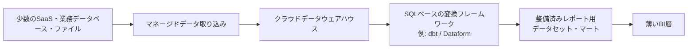
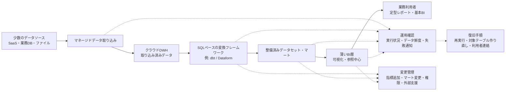

## 2. Case 1：小規模・限定用途のマネージドサービス中心基盤

### 2.1 組織条件と要件

#### 対象とするパイプライン

Case 1では、少数のデータソースを日次または数回／日の頻度で取り込み、定型レポートや基本的なBIへ提供するような、用途が限定されたデータパイプラインを扱う。このCaseで重視するのは、データ基盤の高度化ではなく、少ない運用工数で継続保守できる構成を選ぶことである。

#### 対象とする組織・担当者

ここでいう組織は、会社全体だけを指すものではない。大きな組織の一部門、拠点、業務領域、または特定の定型レポート用パイプラインが、このCaseに近い条件を持つ場合もある。

また、このCaseで想定するのは、専任のデータエンジニアやアナリティクスエンジニアがいない場合だけではない。情報システム担当者、業務担当者、兼務エンジニア、または小規模なデータチームが、限られた時間で定型レポートや基本的なBI向けのパイプラインを運用する場合も含む。

#### データ条件と運用上の制約

扱うデータソースは、少数のSaaS（Software as a Service）、業務データベース、スプレッドシート、CSVファイルなどを想定する。データ形式は主に構造化データであり、半構造化データを扱う場合でも範囲は限定的である。更新頻度は日次、または数回／日で足りる。秒〜数分単位で下流へ反映することや、継続的なイベント処理を行うことは、このCaseの中心要件ではない。

この条件では、データ量の大小だけでなく、運用できる人員、障害対応に使える時間、利用者が求める鮮度、指標定義の複雑さ、予算制約が重要になる。たとえ技術的には専用オーケストレーター、ストリーム処理、レイクハウス、独自の取り込み処理を導入できるとしても、それらを日常的に監視し、障害時に調査し、変更時に安全に保守できるとは限らない。

一方で、構成が単純であることは、データ品質や運用責任を不要にすることを意味しない。主要なデータが期待時刻までに更新されているか、取り込みや変換が失敗していないか、BIが参照する指標定義が明確か、失敗時に誰が確認し再実行するかは、このCaseでも設計上の重要な条件である。

#### Case 1での前提

Case 1では、次のような前提を置く。

| 評価軸 | Case 1での前提 |
|---|---|
| 目的と利用者 | 経営・業務担当者向けの定型レポートや基本的なBIが中心 |
| データの特性 | 少数のSaaS、業務データベース、ファイルを主に扱い、構造化データが中心 |
| 鮮度と処理方式 | 日次または数回／日の更新で十分。秒〜分単位の反映は主目的ではない |
| 信頼性と再処理 | 失敗検知と再実行は必要だが、大規模な部分再実行やリプレイは主対象ではない |
| 組織体制と運用 | このパイプラインの専任担当者がいない、または専任担当者がいても少ない運用工数で保守できることが求められる |
| ガバナンスとコスト | このCaseに必要な範囲の権限管理、指標定義、運用ルールを持ち、導入・運用負荷を抑える |

#### 適用範囲と境界

このCaseで重視するのは、技術的に高度な機能を多く持つことではなく、組織内で理解し、引き継ぎ、必要なときに復旧できることである。特に、データ専門職ではない担当者が運用する場合、処理の流れ、失敗時の確認箇所、再実行手順、利用者への連絡方法が説明しやすいことは重要な要件になる。

また、このCaseでは、扱うデータソース、データ形式、更新頻度、利用目的を限定している。具体的には、少数のSaaS、業務データベース、ファイルなどから取得した主に構造化データを、日次または数回／日の定型レポートや基本的なBIへ提供する構成を中心に扱う。そのため、複雑な依存関係を持つ多数の変換ジョブ、秒単位の低レイテンシ処理、変更データキャプチャ（Change Data Capture: CDC）やイベントストリーミングを前提とする構成、非構造化データや機械学習向けデータを共通基盤で扱うレイクハウス構成は、このCaseの中心的な対象にはしない。

ただし、これはデータ専門職がいない組織では低レイテンシ処理、CDC、イベントストリーミング、レイクハウス構成を採用できない、または採用すべきでないという意味ではない。利用目的として即時通知、不正検知、在庫監視、イベント履歴の活用、非構造化データの分析、機械学習向けデータ提供などが必要であれば、組織規模や担当者の職種にかかわらず、それらの構成も候補に入る。

その場合は、外部支援、マネージドサービス、運用範囲の限定、PoCによる検証、監視・復旧手順の整備などを含めて、組織が継続運用できる形に落とし込む必要がある。データソースの数が増える、複数部門が同じデータを使う、数時間ごとの更新期限が厳しくなる、部分再実行やバックフィルが必要になる、またはログ、文書、画像、機械学習向けデータを共通基盤で扱う必要が出る場合には、Case 2以降に近い構成を検討する。

次節では、ここで整理した要件から、必要な能力、構成上の設計判断、受け入れるトレードオフを対応づけて確認する。

---

### 2.2 構成と設計判断

#### 構成方針

Case 1では、少数のSaaS、業務データベース、ファイルなどから取得した主に構造化データを、日次または数回／日の定型レポートや基本的なBIへ提供する構成を想定する。

この条件では、秒単位の低レイテンシ処理や、複雑な依存関係を持つ多数の変換ジョブよりも、取り込みから提供までの流れを少ない構成要素で安定して運用できることが重要になる。そのため、独自実装や複雑な運用基盤を最初から組み合わせるよりも、マネージドサービスを中心に構成し、処理の流れ、失敗時の確認箇所、再実行手順を説明しやすくする。

#### 構成例

このCaseの構成例は、次のように整理できる。

**図2-1：** Case 1におけるマネージドサービス中心構成の一例。少数のデータソースからDWHへ取り込み、SQLベースの変換フレームワークでレポート用データセットやマートを整備し、BI層では主に可視化と参照を担う。

#### 主要コンポーネントの役割

ここでいうマネージドデータ取り込みは、SaaSや業務データベースからデータを取得し、DWHへロードする処理を、できるだけ既存サービスの機能に任せる考え方である。少数のソースを扱う段階では、個別に取り込みスクリプトを作成して監視、認証更新、失敗時の再実行、仕様変更対応まで自前で抱えるよりも、マネージドサービスを利用する方が運用負荷を抑えやすい。

保存先には、クラウドデータウェアハウス（cloud data warehouse）を中心に置く。構造化データをSQLで集計し、定型レポートやBIへ提供する用途では、DWH上で取り込み済みデータ、変換済みデータ、レポート用データセットを管理する構成が分かりやすい。データレイクやレイクハウスを採用しないのは、それらが不要または劣っているからではなく、このCaseで扱うデータ形式、利用目的、運用体制に対して、最初から多様なデータ形式や複数処理エンジンを前提にする必要性が高くないためである。

DWH内では、取り込んだデータをそのままBIへ接続するのではなく、dbtやDataformなどのSQLベースの変換フレームワークを用いて、分析やレポートに使いやすい形へ整える。例えば、取り込み直後のデータ、整形済みの中間データ、レポート用のマートを分けることで、BI側に複雑な結合や業務ロジックを分散させにくくなる。

BI層は、可視化、フィルタ、簡単な集計、利用者への提供を中心にする。BI利用者がレポートごとにSQL、複雑な結合、指標計算を個別に作成すると、同じ指標でもレポートによって数値がずれる可能性がある。そのため、主要な変換や指標定義は、可能な範囲でDWH上の変換層やマート側へ寄せ、BI利用者は整備済みのデータセットやマートを参照できるようにする。

#### 処理方式と復旧方針

処理方式を考えるときは、ソースからDWHへデータを取得する取り込み方式と、DWH上でレポート用データセットやマートを作る変換方式を分けて考える。Case 1では、まず理解しやすく復旧しやすい方式を優先する。データ量や処理時間、コストが許容範囲に収まる場合は、保存先テーブルや変換済みテーブルを毎回作り直すフルリフレッシュを候補にできる。一方で、ソースAPIの制限、データ量、処理時間、更新頻度の都合で、ソースからの全体再取得やDWH上の変換済みテーブルの全体再作成が難しい場合は、更新日時、主キー、連番IDなどを使った単純な増分取り込みや、DWH上で対象範囲を絞って変換・集計する増分処理を検討する。

ただし、このCaseでは、複雑な部分再実行、大規模なバックフィル、多数の依存関係を前提とする設計は中心に置かない。必要な復旧手順は、失敗した取り込みや変換を再実行する、対象テーブルを作り直す、更新失敗を利用者に知らせる、といった単純な運用から始める。

#### 専用オーケストレーターを必須にしない判断

専用オーケストレーターは、処理数と依存関係が少ない段階では必須構成とはしない。処理数が少なく、依存関係も単純であれば、取り込みサービス、DWH、SQL変換フレームワーク、BIツールが持つスケジューリング機能や通知機能で足りる場合がある。専用オーケストレーターを導入しないことで、監視対象、障害箇所、学習コストを抑えられる。

一方で、これは専用オーケストレーターを採用すべきでないという意味ではない。処理数が増える、取り込み完了後に複数の変換を順序制御する必要がある、失敗通知や部分再実行を細かく管理する必要がある、複数チームが同じパイプラインを変更するようになる場合は、Case 2に近い構成として専用オーケストレーションを検討する。

#### 要件と設計判断の対応

このCaseにおける主な要件、必要な能力、設計判断、受け入れるトレードオフは、次のように対応づけられる。

| 要件・制約 | 必要な能力 | 設計判断 | 受け入れるトレードオフ |
|---|---|---|---|
| データソースが少数である | 少数ソースから安定して取り込む | マネージドデータ取り込みを中心にする | 対応ソース、同期方式、エラー処理の一部が利用サービスに依存する |
| 日次または数回／日の更新で足りる | 定期的に一括更新できる | バッチ処理を基本にする | 秒〜分単位の即時反映は前提にしない |
| 構造化データと定型レポートが中心である | SQLで変換・集計し、BIへ提供できる | クラウドDWHを中心に構成する | 非構造化データや複数処理エンジンを共通基盤で扱う前提にはしない |
| 主要指標を安定して提供したい | 変換ロジックと指標定義を管理できる | dbtやDataformなどのSQLベースの変換フレームワークでマートを作る | 変換層の管理、レビュー、命名規則などの運用ルールが必要になる |
| BI利用者がSQLや複雑な結合を自力で作らずに利用できるようにしたい | 整備済みのデータセットやマートを提供する | BI層を薄くし、主要ロジックをDWH側へ寄せる | BI上で利用者が個別に複雑なロジックを作る自由度は抑える |
| 少ない運用工数で保守したい | 障害点と確認箇所を少なくする | 専用オーケストレーターを初期必須にしない | 複雑な依存関係、細かな部分再実行、高度な実行制御は扱いにくくなる |
| 失敗時に復旧しやすくしたい | 再実行手順を単純にする | フルリフレッシュ、または単純な増分取り込み・増分処理を優先する | データ量、処理数、更新頻度が増えると処理時間やコストが増えやすい |

#### この構成で得られるものと限界

この構成の利点は、構成要素が少なく、処理の流れを説明しやすいことである。少数のデータソースからDWHへ取り込み、SQLで整形し、整備済みデータセットやマートをBIへ提供する流れであれば、担当者が確認すべき箇所を限定しやすい。

また、技術選定の目的が「高度な基盤を作ること」ではなく、「必要なレポートを安定して提供し、組織内で保守できる状態を作ること」である点も重要である。Case 1では、Kafka、専用オーケストレーター、レイクハウス、独自の取り込み基盤などを採用しない判断も、要件に合っていれば妥当な設計判断になり得る。

ただし、この構成は万能ではない。ソース数、更新頻度、モデル数、利用部門、再処理要件が増えると、単純な構成では運用しにくくなる。例えば、取り込み完了を待って複数の変換を順序制御する必要がある場合、失敗した一部のモデルだけを安全に再実行したい場合、過去期間を頻繁にバックフィルする場合、または複数部門が同じデータを異なる目的で利用する場合は、Case 2に近い構成を検討する必要がある。

したがって、Case 1の設計判断は、高度な機能を避けること自体を目的とするものではない。現在の要件に対して、どの複雑性をまだ持ち込まないかを明確にし、必要になった時点で構成を拡張できる余地を残すことが重要である。

次節では、この構成を継続運用するうえでの確認箇所、失敗時の復旧方法、そしてCase 1の構成を見直すべき変更トリガーを整理する。

---

### 2.3 運用、トレードオフ、変更トリガー

#### 運用方針

2.2では、Case 1の構成と設計判断を整理した。本節では、それらの判断が日常運用でどのような利点や制約として現れるかを確認し、どの条件になったときにCase 1の構成を見直すべきかを整理する。

Case 1の運用で重視するのは、複雑な運用機能を多く持つことではなく、担当者が処理の流れを理解し、失敗に気づき、必要な範囲を再実行し、利用者へ状況を説明できることである。処理数や依存関係が少ない段階では、専用オーケストレーターや高度な監視基盤を導入しなくても、取り込みサービス、DWH、SQLベースの変換フレームワーク、BIツールが持つ通知やスケジューリング機能で十分な場合がある。

ただし、構成が単純であることは、運用設計が不要であることを意味しない。少なくとも、どの処理がいつ実行されるのか、どのテーブルやマートが更新対象なのか、更新に失敗した場合に誰が確認するのか、利用者へどのように知らせるのかは決めておく必要がある。

#### 確認すべき運用項目

Case 1では、日常運用で次の項目を確認する。

| 運用項目 | 確認すること | 放置した場合のリスク |
|---|---|---|
| 実行状況 | 取り込み、変換、BI更新が予定どおり完了しているか | どの処理で止まったのか分からず、確認や復旧が遅れる |
| データ鮮度 | 主要なテーブルやマートが期待時刻までに更新されているか | 定型レポートやBIの数値が古くなり、利用者が古い値を最新値として参照する |
| 失敗通知 | 取り込み失敗、変換失敗、認証・権限エラーなどが担当者に届くか | 障害に気づけず、利用者からの問い合わせで初めて問題が判明する |
| 復旧手順 | 失敗した処理の再実行、対象テーブルの作り直し、利用者への連絡手順が明確か | 担当者ごとに対応が変わり、復旧に時間がかかる |
| 指標定義 | 主要指標の定義がDWH上の変換層やマート側で管理されているか | BI側や利用者ごとに異なる計算ロジックが増え、数値の一貫性が崩れる |
| 権限管理 | BI利用者、編集者、管理者の権限が分かれているか | 過剰なデータ共有、誤編集、管理者権限の過剰付与が起きる |
| 引継ぎ | 担当者が変わっても、処理の流れと確認箇所を追えるか | 属人的な運用になり、担当者交代や兼務化の際に保守できなくなる |
| コスト | 取り込み、変換、BI、保存の利用量や費用が想定範囲に収まっているか | 小規模な構成でも、不要な実行や保存により継続コストが見えにくくなる |

これらの項目は、すべてを高度な監視基盤で管理しなければならないという意味ではない。Case 1では、対象パイプラインの規模、利用者数、更新頻度、障害時の影響に応じて、取り込みサービス、DWH、SQLベースの変換フレームワーク、BIツールの通知機能や、手順書、定期確認で管理できる範囲を決めることが重要である。

#### 主要なトレードオフ

この構成の利点は、確認すべき箇所を限定しやすいことである。少数のデータソースからDWHへ取り込み、DWH上で変換し、整備済みデータセットやマートをBIへ提供する流れであれば、失敗時にも「取り込みで失敗したのか」「変換で失敗したのか」「BI側の表示や更新で問題が起きているのか」を切り分けやすい。

一方で、マネージドサービス中心の構成では、取り込み方式、対応ソース、エラー処理、同期頻度の一部が利用サービスに依存する。サービス側が対応していないソース、複雑な認証方式、細かな同期条件、特殊なリトライ制御が必要になる場合は、マネージド取り込みだけでは不足する可能性がある。

また、専用オーケストレーターを必須構成にしないことで、構成は単純になり、学習コストや監視対象を抑えられる。しかし、処理数や依存関係が増えると、どの処理がどの処理の完了を待つべきか、失敗した場合にどこから再実行すべきかを管理しにくくなる。特に、取り込み完了後に複数の変換を順序制御し、さらに下流のBI更新や通知まで連動させる必要が出る場合は、Case 2に近い構成を検討する必要がある。

フルリフレッシュや単純な増分取り込み・増分処理を優先する判断にも、運用上のトレードオフがある。フルリフレッシュは処理の意味を理解しやすく、失敗時に対象テーブルを作り直す手順も単純にしやすい。一方で、データ量、処理時間、API制限、DWHの実行コストが増えると、毎回全体を作り直す方式は非効率になりやすい。その場合は、増分取り込みや増分処理、対象範囲を絞った再処理を検討することになる。

BI層を薄くする判断も、単純化だけを意味しない。主要な変換や指標定義をDWH側へ寄せることで、BI利用者がSQLや複雑な結合を自力で作らずに済み、レポート間の数値不一致を抑えやすくなる。一方で、DWH上のマート設計や命名規則、レビュー、変更管理を一定程度整える必要がある。BI側で自由に個別ロジックを作る運用を許容しすぎると、DWH側に寄せた指標定義の意味が弱くなる。

#### 指標・マート変更時の運用と外部支援

データ専門職がいない、またはこのパイプラインに常時関与しない組織・部門では、新しい指標やマートが必要になったときの対応方法も決めておく必要がある。軽微な項目追加や既存指標の名称変更であれば、運用担当者が手順に沿って対応できる場合もある。一方で、新しい業務定義、複数テーブルをまたぐ集計、既存指標との整合性確認、マート設計の変更が必要な場合は、外部支援やデータ専門職によるレビューを利用する方が安全である。

ただし、外部支援を利用する場合でも、機密データ、個人情報、認証情報をそのまま外部へ渡すことは避ける必要がある。可能であれば、サンプルデータ、匿名化・マスキング済みデータ、スキーマ情報、集計済みデータ、業務ルールの説明を使って設計やレビューを進める。外部支援に実データや本番環境へのアクセスを許可する場合は、契約、権限範囲、監査ログ、アクセス期限、責任分界を明確にする必要がある。

重要なのは、BI利用者が各自でロジックを作り始める状態に戻さず、指標やマートの変更を受け付け、確認し、反映する窓口と手順を用意することである。

#### 変更トリガー

Case 1の構成を見直す主な変更トリガーは、次のとおりである。

| 変更トリガー | 現れる問題 | 検討する方向 |
|---|---|---|
| データソースが増える | 取り込み設定、認証、スキーマ変更、失敗対応が増える | Case 2に近い取り込み管理、品質検査、依存関係管理を検討する |
| 更新頻度が高くなる | 日次や数回／日の更新では利用目的を満たせなくなる | より頻繁なバッチ、マイクロバッチ、必要に応じてCase 3に近い低レイテンシ経路を検討する |
| 変換モデルが増える | 実行順序、依存関係、失敗時の影響範囲が分かりにくくなる | 専用オーケストレーター、リネージ、部分再実行の導入を検討する |
| 利用部門が増える | 指標定義、権限、データマート、利用ルールの調整が必要になる | セマンティックレイヤー、権限管理、データ所有者の明確化を検討する |
| 新しい指標やマートの追加依頼が増える | 変更窓口がないとBI側で個別ロジックが増え、指標の一貫性が崩れやすくなる | 変更依頼の窓口、定義レビュー、外部支援の利用、マート変更手順、データ共有範囲を定める |
| バックフィルが頻繁に必要になる | 全体再作成では時間やコストが大きくなる | 対象期間を絞った再処理、増分処理、履歴保持方針を検討する |
| ログ、文書、画像など多様な形式のデータを扱う | DWH中心構成だけでは保存・探索・再利用が難しくなる | データレイクやレイクハウスを含むCase 4に近い構成を検討する |
| 障害影響が大きくなる | 更新失敗が複数部門や業務判断に影響する | 監視、通知、復旧手順、責任範囲、更新期限や復旧目標などの運用基準を検討する |
| 担当者交代や兼務化が発生する | 属人的な手順や暗黙知に依存した運用が難しくなる | 手順書、運用ログ、命名規則、レビュー手順を整備する |

これらの変更トリガーは、Case 1が失敗したことを意味しない。むしろ、利用者、データソース、更新頻度、再処理要件が変わった結果として、必要な能力が変化したと捉えるべきである。

反対に、構成を高度化すればよいとは限らない。利用目的が限定され、更新頻度も低く、利用者も少ないままであれば、専用オーケストレーター、ストリーム処理、レイクハウス、複雑なカタログ基盤を導入しても、得られる効果より運用負荷の方が大きくなる可能性がある。

#### 構成・運用確認のまとめ

ここまでの構成、運用確認、復旧、変更管理の関係をまとめると、次のように整理できる。

**図2-2：** Case 1におけるパイプライン構成と運用確認箇所の一例。少数のデータソースからDWHへ取り込み、SQLベースの変換フレームワークでレポート用データセットやマートを整備し、BI層では可視化と参照を中心に担う。あわせて、実行状況、データ鮮度、失敗通知、復旧手順、指標やマートの変更管理を確認対象として持つ。

Case 1では、単純な構成を維持することも設計判断の一部である。重要なのは、現在の要件に対して十分な能力を持ち、担当者が継続運用でき、要件が変化したときにどの条件をきっかけとして構成を見直すかを説明できることである。
