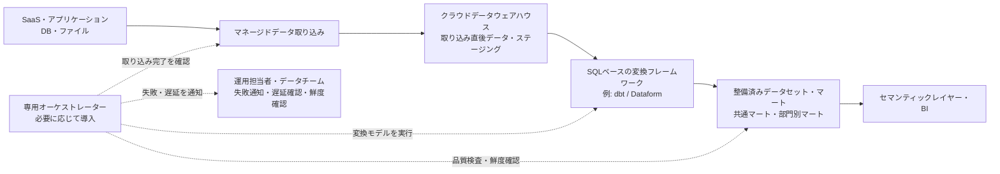
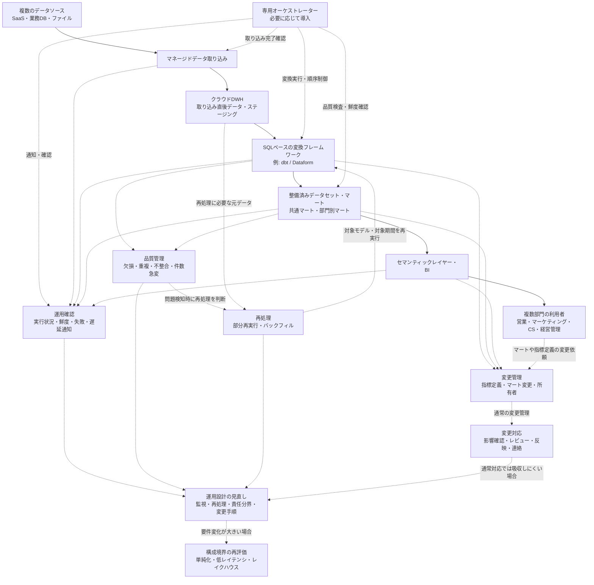

## 3. Case 2：複数部門・複数ソースを扱う成長中のバッチ基盤

### 3.1 組織条件と要件

#### 対象とするパイプライン

Case 2では、複数部門が利用するデータを、複数のデータソースから定期的に取り込み、データウェアハウス（data warehouse: DWH）上で変換・集約し、定型レポート、部門別分析、部門横断指標へ提供するような、成長中のバッチ中心のデータパイプラインを扱う。

このCaseで重視するのは、Case 1より高度な構成を採用することではない。データソース、利用部門、変換モデル、下流レポート、更新期限、再処理要件が増えた結果として、取り込み、変換、品質検査、鮮度確認、失敗通知、部分再実行をより明示的に管理することである。

ここでいうバッチ中心の基盤は、日次処理だけを意味しない。日次、数時間ごと、または決められたスケジュールで、一定範囲のデータをまとめて処理する構成を含む。秒〜数分単位で業務アプリケーションやアラートへ即時反映する低レイテンシ経路は、このCaseの中心要件ではない。

Case 2は、DWHとビジネスインテリジェンス（Business Intelligence: BI）を中心に、複数部門の分析やレポーティングを支える構成として扱う。主な関心は、リアルタイム性や多様なデータ形式への対応ではなく、複数ソースから取り込んだ構造化データを、信頼できる形で整備し、複数部門が継続的に利用できる状態にすることである。

#### 対象とする組織・利用者

このCaseでいう組織も、会社全体だけを指すものではない。大きな組織の複数部門、成長中の事業部、複数拠点をまたぐ業務領域、または部門横断の分析基盤が、このCaseに近い条件を持つ場合がある。

想定する利用者には、営業、マーケティング、カスタマーサクセス、経営管理、プロダクト担当、業務管理者などが含まれる。部門ごとの定型レポートだけでなく、売上、顧客、契約、利用状況、サポート対応、広告効果などを横断して確認する指標が必要になる場合もある。

このCaseでは、小規模なデータチーム、兼務のデータ担当者、部門側のデータ所有者、または外部支援を含めて、パイプラインを継続的に管理する体制が必要になる。ただし、大規模な専門チームが常に存在するとは限らない。重要なのは、単にデータ担当者がいるかどうかではなく、複数部門からの要件変更、指標定義の調整、変換ロジックの保守、障害時の影響確認を継続的に扱えるかである。

複数部門が同じデータを使う場合、誰がデータの意味を説明できるのか、誰がモデルやマートを保守するのか、誰が失敗時に判断するのかを明確にする必要がある。部門ごとに異なる定義で同じ指標を作ると、レポート間で数値がずれ、どれを信頼すべきか分からなくなる可能性がある。

そのため、このCaseでは、DWH上の変換層、共通マート、部門別マート、BI、必要に応じたセマンティックレイヤー（semantic layer）などの役割を分け、指標定義と利用ルールを管理することが重要になる。

#### データ条件と運用上の制約

扱うデータソースは、複数のSaaS（Software as a Service）、アプリケーションデータベース、CSVファイル、スプレッドシート、業務部門が管理するファイルなどを想定する。データ形式は主に構造化データであり、半構造化データを扱う場合でも、DWH上で分析・集計できる範囲に整理されることを前提とする。

Case 1では、少数のデータソースを対象に、日次または数回／日の更新で足りる構成を扱った。Case 2では、データソースの数が増え、部門ごとに更新タイミングや利用目的が異なり、日次だけではなく数時間ごとの更新が必要になる場合がある。

この条件では、単に取り込み処理を増やせばよいわけではない。あるソースの取り込みが遅れると、そのデータに依存する変換モデル、共通マート、部門別レポートにも影響する。取り込み完了前に変換が実行されると、最新データを含まないマートが作られたり、前提となるデータがそろわない状態で品質検査が実行されたりする可能性がある。

また、モデル数やマート数が増えると、どのモデルがどの上流データに依存しているのか、どの下流レポートへ影響するのかを把握しにくくなる。失敗した処理をすべて最初から作り直す方式では、処理時間やコストが大きくなり、更新期限に間に合わない場合がある。

そのため、Case 2では、取り込み完了の確認、変換モデル間の依存関係、データ品質検査、データ鮮度（data freshness）の監視、失敗通知、部分再実行、バックフィル（backfill）を設計上の重要な条件として扱う。

一方で、このCaseでも、構成を複雑にすればよいわけではない。処理数や依存関係がまだ少なく、更新期限も厳しくない場合は、取り込みサービス、DWH、SQLベースの変換フレームワーク、またはそれらの周辺実行基盤が持つスケジューリング機能で十分なこともある。専用オーケストレーターを導入するかどうかは、データ量だけでなく、処理数、依存関係、失敗時の影響範囲、更新期限、運用体制を見て判断する。

#### Case 2での前提

Case 2では、次のような前提を置く。

| 評価軸 | Case 2での前提 |
|---|---|
| 目的と利用者 | 複数部門が利用する定型レポート、部門別分析、部門横断指標が中心 |
| データの特性 | 複数のSaaS、アプリケーションデータベース、ファイルを扱い、構造化データが中心 |
| 鮮度と処理方式 | 日次または数時間ごとのバッチ更新が中心。秒〜分単位の即時反映は主目的ではない |
| 信頼性と再処理 | 失敗通知、部分再実行、バックフィル、データ品質検査、データ鮮度監視が必要になる |
| 組織体制と運用 | 小規模なデータチーム、兼務担当者、部門側担当者が関与し、モデル所有者や障害対応の役割分担が必要になる |
| ガバナンスとコスト | 部門横断で使う指標定義、権限、変更管理を整えつつ、運用負荷とコストを管理する |

#### 適用範囲と境界

このCaseで重視するのは、複数部門・複数ソースのデータを、DWH中心のバッチ基盤として安定して提供することである。主要な論点は、取り込み完了の確認、変換モデルの依存関係、品質検査、鮮度監視、失敗通知、部分再実行、バックフィル、指標定義、部門間の調整である。

Case 2は、Case 1を単純に拡張した上位版ではない。Case 1は、限定された用途に対して、少ない構成要素で継続保守できることを重視する構成である。一方、Case 2は、複数部門と複数ソースにまたがるバッチ処理を、依存関係と再処理を含めて管理する必要がある条件を扱う。どちらが優れているかではなく、対象とする要件が異なる。

また、Case 2は、すべての成長中組織が必ず採用すべき構成でもない。複数部門があっても、対象データが少なく、更新頻度も低く、レポートが限定されているなら、Case 1に近い構成で十分な場合がある。反対に、組織規模が小さくても、複数ソースのデータを部門横断で利用し、依存関係や再処理要件が増えているなら、Case 2に近い構成を検討する理由がある。

このCaseでは、秒〜数分単位で業務アプリケーション、アラート、不正検知、在庫監視などへ反映する低レイテンシ経路は中心に置かない。変更データキャプチャ（Change Data Capture: CDC）やイベントストリーミングを用いて継続的に変更を処理し、重複、遅延、順序入れ替わり、状態管理、リプレイを扱う必要がある場合は、Case 3に近い構成を検討する。

また、ログ、文書、画像、機械学習向けデータ、長期の生データ、複数処理エンジン、データサイエンスや機械学習を含む複数ワークロードを共通基盤で扱うことが主目的になる場合は、Case 4に近い構成を検討する。

したがって、Case 2は、複数部門・複数ソースを扱うDWH中心のバッチ基盤として、どの処理をどの順序で実行し、どのデータを信頼して使い、失敗時にどの範囲を安全に再実行するかを明確にするためのCaseである。

次節では、ここで整理した要件から、必要な能力、構成上の設計判断、受け入れるトレードオフを対応づけて確認する。

---

### 3.2 構成と設計判断

#### 構成方針

Case 2では、複数のSaaS、アプリケーションデータベース、ファイルなどから取得した主に構造化データを、日次または数時間ごとのバッチ処理でDWHへ取り込み、SQLベースの変換フレームワークで整備し、複数部門が利用するデータセット、マート、BIへ提供する構成を想定する。

この条件では、Case 1と同じくDWH中心の構成が候補になる。ただし、扱うデータソース、変換モデル、下流レポート、利用部門が増えるため、単に取り込みと変換を定期実行するだけでは運用しにくくなる。どのソースの取り込みが完了したか、どの変換モデルがどの上流データに依存しているか、どのマートやレポートへ影響するかを管理する必要がある。

そのため、Case 2では、マネージドデータ取り込み、DWH、SQLベースの変換フレームワーク、整備済みデータセット・マート、必要に応じたセマンティックレイヤーやBIに加えて、処理数や依存関係に応じて専用オーケストレーターを検討する。

ただし、専用オーケストレーターは、Case 2で常に必須になるわけではない。重要なのは、ツールを増やすことではなく、取り込み、変換、品質検査、鮮度確認、失敗通知、部分再実行、バックフィルを、組織が理解し継続運用できる形で管理することである。

#### 構成例

このCaseの構成例は、次のように整理できる。

**図3-1：** Case 2における複数部門・複数ソースを扱うバッチ中心構成の一例。複数ソースからDWHへ取り込み、SQLベースの変換フレームワークで共通マートや部門別マートを整備し、必要に応じて専用オーケストレーターで取り込み完了確認、変換実行、品質検査、鮮度確認、失敗・遅延通知を管理する。

#### 主要コンポーネントの役割

マネージドデータ取り込みは、複数のSaaS、アプリケーションデータベース、ファイルなどからDWHへデータをロードする役割を担う。Case 2では、ソース数が増えるため、接続設定、認証、同期頻度、スキーマ変更、取り込み失敗の確認対象も増える。すべてを個別スクリプトで実装すると、保守対象が増えやすいため、可能な範囲ではマネージドサービスを利用して取り込み処理の運用負荷を抑える。

保存先には、Case 1と同様にクラウドデータウェアハウス（cloud data warehouse）を中心に置く。構造化データを複数部門の定型レポート、部門別分析、部門横断指標へ提供する用途では、DWH上で取り込み済みデータ、ステージングデータ、変換済みデータ、共通マート、部門別マートを管理する構成が分かりやすい。

DWH内では、取り込んだデータをそのまま下流へ渡すのではなく、SQLベースの変換フレームワークを用いて、分析やレポートに使いやすい形へ整える。Case 2では、変換モデルの数が増え、モデル間の依存関係も複雑になりやすい。そのため、どのモデルがどの上流データを参照し、どの下流マートに影響するかを追えることが重要になる。

整備済みデータセットやマートは、複数部門が共通して参照するデータと、部門固有の利用目的に合わせたデータを分けて設計する。例えば、顧客、契約、売上、利用状況のように複数部門で使うデータは共通マートとして整備し、営業、マーケティング、カスタマーサクセスなどの部門別分析では、それぞれの利用目的に応じたマートを作る。

セマンティックレイヤーやBIは、利用者が指標やディメンションを一貫した定義で参照するための提供層として位置づける。ただし、セマンティックレイヤーは常に必須ではない。利用部門、指標数、BIレポート数が増え、DWH上のマートだけでは指標定義や利用ルールを十分に統制しにくくなった場合に検討する。

専用オーケストレーターは、取り込み完了の確認、変換モデルの実行、品質検査、鮮度確認、下流更新、失敗通知などをまとめて制御する役割を持つ。Case 2では、処理数や依存関係が増えた場合に候補となる。ただし、処理数が少なく依存関係も単純であれば、取り込みサービス、DWH、SQLベースの変換フレームワーク、またはそれらの周辺実行基盤が持つスケジューリング機能で足りる場合もある。

#### 増分処理、依存関係、再処理の設計

Case 2では、フルリフレッシュだけでは処理時間やコストが大きくなりやすい。データ量、更新頻度、ソースAPIの制限、DWHの実行コスト、更新完了時刻の制約を考えると、増分取り込みや増分処理を検討する必要がある。

増分取り込みは、ソースから追加・変更されたデータだけを取得する考え方である。例えば、更新日時、連番ID、変更ログなどを使って、前回以降に追加または更新されたデータをDWHへ取り込む。これにより、毎回ソース全体を取得する必要を減らせる場合がある。

増分処理は、DWH上で取得済みデータ全体を毎回処理するのではなく、追加・変更された範囲、または影響を受ける範囲だけを変換・集計する考え方である。例えば、特定の日付パーティションだけを再計算したり、新しく取り込まれたレコードに関係する集計だけを更新したりする場合がある。

ただし、増分処理はフルリフレッシュよりも設計が複雑になりやすい。どのデータが新しいのか、どの範囲を再計算するのか、遅れて到着したデータや訂正をどう扱うのかを決める必要がある。単純に新着データだけを追加すると、過去データの訂正、削除、重複、遅延到着を反映できない場合がある。

変換モデル間の依存関係も重要である。ある中間モデルが失敗すると、それを参照する共通マートや部門別マートも正しく作れない。どのモデルを先に実行し、どのモデルが成功したら下流へ進むのか、品質検査が失敗した場合に下流更新を止めるのかを決める必要がある。

再処理の設計では、失敗した処理をすべて最初から作り直すのではなく、必要な範囲だけを安全に再実行できることが重要になる。例えば、特定ソースの取り込みだけを再実行する、特定の変換モデルと下流モデルだけを再実行する、過去の特定期間だけをバックフィルする、といった運用が必要になる場合がある。

そのため、Case 2では、DWHへ取り込んだ直後の未加工またはほぼ未加工のデータ、または再処理に必要な履歴データを一定期間保持し、どの範囲まで処理済みかを追えるようにすることが重要になる。保存していないデータや処理済み範囲を特定できないデータは、後から安全に再処理しにくい。

#### 品質検査とデータ鮮度の管理

Case 2では、データ品質検査とデータ鮮度の管理が、単なる補助機能ではなく、日常運用の中心的な要素になる。

データ品質検査では、主キーの重複、必須項目の欠損、参照関係の不整合、想定外の値、件数の急変などを確認する。品質検査は、データが完全に正しいことを保証するものではないが、下流のマートやBIへ明らかに不適切なデータを流す前に検知するために有効である。

ただし、品質検査が失敗した場合でも、すぐに「データそのものが誤っている」と判断できるわけではない。例えば、上流ソースの更新が遅れていて期待した件数に達していない場合、取り込み処理が途中で失敗している場合、変換ロジックに不具合がある場合、業務上の例外値や異常値として確認すべき値が実際に発生している場合、または品質検査の条件が厳しすぎる場合では、原因も対応も異なる。

そのため、品質検査の失敗時には、下流更新を止めるのか、警告として扱うのか、上流データや取り込み状況を確認するのか、業務担当者やデータ所有者に確認するのか、変換ロジックや検査条件を修正するのかを切り分ける必要がある。

データ鮮度の管理では、主要なテーブルやマートが期待される時刻までに更新されているかを確認する。Case 2では、複数部門が同じデータを参照するため、あるマートが古いまま表示されると、複数のレポートや業務判断に影響する可能性がある。

データ鮮度の確認は、単にジョブが成功したかどうかとは異なる。ジョブが成功していても、上流ソースが更新されていなければ、マートは古いデータをもとに作られている可能性がある。そのため、ジョブの成否だけでなく、ソースデータやマートの更新時刻、件数、期待される到着状況も確認対象にする。

#### 専用オーケストレーションを検討する条件

Case 2では、専用オーケストレーターを導入するかどうかが重要な設計判断になる。

処理数が少なく、依存関係も単純で、更新完了時刻に余裕がある場合は、取り込みサービス、DWH、SQLベースの変換フレームワーク、BIツール、またはそれらの周辺実行基盤が持つスケジューリング機能で十分なことがある。この場合、専用オーケストレーターを追加すると、学習コスト、監視対象、障害箇所が増える可能性がある。

一方で、取り込み完了を待って複数の変換を順序制御する必要がある場合、複数モデルの依存関係を管理する必要がある場合、品質検査の結果によって下流更新を止めたい場合、失敗した範囲だけを再実行したい場合、複数部門へ更新遅延を通知する必要がある場合は、専用オーケストレーションを検討する理由が強くなる。

専用オーケストレーターは、処理を複雑にするために導入するものではない。むしろ、すでに存在している依存関係、失敗時の影響範囲、更新完了時刻、再処理の必要性を明示的に扱うために導入する。

導入を判断するときは、次のような問いを確認する。

- 取り込み完了前に変換が実行されるリスクがあるか
- ある処理の失敗が、どの下流マートやレポートへ影響するかを把握できるか
- 失敗した範囲だけを再実行できるか
- 品質検査の結果に応じて、下流更新を止める、警告にする、または一部だけ更新する判断が必要か
- 更新遅延を誰に、どの粒度で通知する必要があるか
- 新しい変換モデルや品質検査を追加したときに、どの下流モデル、マート、レポートへ影響するかを確認できるか
- 専用オーケストレーター自体を運用できる体制があるか

これらの問いに対して、既存のスケジューリング機能や手順書だけでは管理しにくい場合、専用オーケストレーターを構成に加えることが妥当になり得る。

#### 要件と設計判断の対応

このCaseにおける主な要件、必要な能力、設計判断、受け入れるトレードオフは、次のように対応づけられる。

| 要件・制約 | 必要な能力 | 設計判断 | 受け入れるトレードオフ |
|---|---|---|---|
| 複数のデータソースを扱う | 複数ソースから安定して取り込み、失敗や遅延を検知する | マネージドデータ取り込みを中心にし、ソースごとの同期・遅延・失敗状態を確認する | 対応ソース、同期方式、エラー処理の一部が利用サービスに依存する |
| 日次または数時間ごとの更新が必要である | 定期的にデータを更新し、期待時刻までに主要マートへ反映する | バッチ処理を基本にし、必要に応じて増分取り込み・増分処理を使う | 秒〜分単位の即時反映は前提にしない |
| 変換モデルとマートが増える | モデル間の依存関係と下流影響を把握する | SQLベースの変換フレームワークでモデルを管理し、リネージや依存関係を確認できるようにする | モデル設計、命名規則、レビュー、ドキュメント整備の負荷が増える |
| 複数部門が同じデータを参照する | 指標定義と利用ルールを揃える | 共通マート、部門別マート、必要に応じたセマンティックレイヤーを設計する | 定義変更時の調整や合意形成が必要になる |
| データ品質を安定して確認したい | 欠損、重複、不整合、件数急変などを検知する | 変換工程にデータ品質検査を組み込む | 検査条件の保守、不要な検知、下流更新を止めるかどうかの判断が必要になる |
| データ鮮度を確認・管理したい | 主要テーブルやマートが期待時刻までに更新されているか確認する | データ鮮度監視と失敗・遅延通知を設計する | 監視対象と通知先を増やすほど運用負荷が増える |
| 失敗時に必要な範囲だけ再実行したい | 部分再実行、バックフィル、処理済み範囲の把握ができる | DWHへ取り込んだ直後のデータまたは再処理に必要な履歴データを保持し、モデル依存関係に基づいて再実行する | 保存コスト、再処理手順、履歴管理の複雑性が増える |
| 処理数や依存関係が増えている | 複数処理の順序制御、取り込み完了確認、失敗通知、再実行を管理する | 必要に応じて専用オーケストレーターを導入する | 学習コスト、監視対象、オーケストレーター自体の運用負荷が増える |
| 複数人でモデルやマートを変更する | 変更の影響範囲を確認し、安全に反映する | バージョン管理、レビュー、テスト、命名規則、所有者を整える | 開発・運用ルールの整備と合意形成が必要になる |

#### この構成で得られるものと限界

この構成の利点は、複数部門・複数ソースを扱うバッチ基盤を、DWH中心に整理しながら、依存関係、品質検査、鮮度監視、再処理を明示的に扱えることである。Case 1に比べて、処理数や確認対象は増えるが、複数部門が同じデータを信頼して利用するために必要な管理を行いやすくなる。

また、専用オーケストレーターを必要に応じて導入することで、取り込み完了確認、変換実行、品質検査、鮮度確認、失敗・遅延通知、部分再実行を一つの流れとして管理しやすくなる。これにより、単にジョブを定期実行するだけでは見えにくい依存関係や失敗時の影響範囲を扱いやすくなる。

一方で、この構成はCase 1より運用負荷が増える。モデル設計、品質検査、データ鮮度監視、指標定義、権限、変更管理、再処理手順を整える必要がある。専用オーケストレーターを導入する場合は、そのツール自体の学習、監視、障害対応も運用対象になる。

また、この構成は低レイテンシ処理を主目的とするものではない。秒〜数分単位で業務アプリケーションやアラートへ反映する必要があり、重複、遅延、順序入れ替わり、状態管理、リプレイを扱う場合は、Case 3に近い構成を検討する必要がある。

さらに、多様なデータ形式、未加工データや長期履歴の保持、文書、画像、ログ、機械学習向けデータ、複数処理エンジン、複数ワークロードの共通基盤が主目的になる場合は、DWH中心のバッチ基盤だけでは不足する可能性がある。その場合は、Case 4に近い構成を検討する。

したがって、Case 2の設計判断は、構成を高度化すること自体を目的とするものではない。複数部門・複数ソースを扱うなかで、どの依存関係を明示的に管理し、どの品質条件や鮮度を確認し、失敗時にどこから再実行できるようにするかを決めることが重要である。

次節では、この構成を継続運用するうえでの確認箇所、トレードオフ、責任分界、そしてCase 2の構成を見直すべき変更トリガーを整理する。

---

### 3.3 運用、トレードオフ、変更トリガー

#### 運用方針

Case 2では、複数部門・複数ソースを扱うDWH中心のバッチ基盤を、継続的に信頼して利用できる状態に保つことが運用上の中心になる。

Case 1では、処理数や依存関係が少ないため、失敗した処理を再実行する、対象テーブルを作り直す、利用者へ状況を連絡するといった比較的単純な運用で対応できる場合が多かった。Case 2では、データソース、変換モデル、マート、BIレポート、利用部門が増えるため、どこで失敗したのか、どの下流データに影響するのか、どの範囲を再実行すればよいのかを把握する必要が高まる。

このCaseの運用では、ジョブが成功したかどうかだけでなく、次のような状態を確認する。

- 期待される時刻までに上流データが到着しているか
- 取り込み処理が失敗または遅延していないか
- 変換モデルが正しい順序で実行されているか
- 品質検査が期待どおり機能しているか
- 主要マートやBIレポートが古いデータを参照していないか
- 失敗時に、必要な範囲だけを再実行できるか
- 指標定義やマート変更の影響範囲を説明できるか
- 利用部門へ遅延や不整合を適切に伝えられるか

したがって、Case 2の運用方針は、単に処理を自動化することではない。複数部門が同じデータを使う前提で、実行状態、データ鮮度、品質、依存関係、変更影響、責任範囲を確認できる状態にすることである。

#### 確認すべき運用項目

Case 2では、日常運用で次の項目を確認する。

| 運用項目 | 確認すること | 放置した場合のリスク |
|---|---|---|
| 取り込み状態 | 各ソースの取り込みが成功しているか、遅延していないか、スキーマ変更が発生していないか | 最新データを含まないマートやレポートが作られる |
| 変換実行 | 変換モデルが期待される順序で実行され、必要なモデルが成功しているか | 中間モデルやマートが不完全な状態になる |
| データ品質検査 | 主キー重複、欠損、不整合、件数急変、想定外の値を検知できているか | 誤ったデータが下流のBIや業務判断に使われる |
| データ鮮度 | 主要テーブルやマートが期待時刻までに更新されているか | 複数部門が古いデータを最新値として参照する |
| 依存関係と下流影響 | あるモデルや取り込み処理の失敗が、どのマートやレポートへ影響するか | 障害範囲を説明できず、利用者対応が遅れる |
| 部分再実行 | 失敗した処理、影響を受けたモデル、対象期間だけを再実行できるか | 毎回全体再実行が必要になり、時間とコストが増える |
| バックフィル | 過去期間のデータ訂正やロジック変更を安全に反映できるか | 過去の誤りを修正できない、または修正範囲が不明になる |
| 指標定義 | 部門横断で使う指標の定義、計算ロジック、参照元が明確か | 部門ごとに異なる数値が使われ、信頼性が下がる |
| 権限管理 | 利用者が必要なデータへアクセスでき、不要なデータへアクセスできないか | 機密データの過剰共有、または業務上必要な利用の阻害が起きる |
| 通知と利用者連絡 | 失敗、遅延、品質問題を誰へ、どの粒度で通知するか | 利用者が問題を知らずに古いデータや不完全なデータを使う |
| コスト | 取り込み、変換、品質検査、再処理、保存のコストが想定範囲に収まっているか | 増分処理や監視を追加した結果、運用費用が見えにくくなる |

これらの項目は、すべてを最初から高度な監視基盤で管理しなければならないという意味ではない。重要なのは、対象パイプラインの規模、利用部門、更新頻度、障害時の影響に応じて、どの項目を自動化し、どの項目を手順書や定期確認で管理するかを決めることである。

#### 主要なトレードオフ

Case 2では、複数部門・複数ソースを扱うために、Case 1よりも明示的な管理を増やす。その一方で、管理対象を増やすほど、構成、運用、変更管理は複雑になる。

主なトレードオフは次のとおりである。

| 設計判断 | 得られる利点 | 受け入れるトレードオフ |
|---|---|---|
| マネージドデータ取り込みを使う | 複数ソースの接続、認証、同期、失敗処理を自前で抱えにくくなる | 対応ソース、同期方式、エラー処理、価格体系が利用サービスに依存する |
| DWH中心に構成する | 構造化データの変換、集計、BI提供を一貫して扱いやすい | 非構造化データ、複数処理エンジン、機械学習向けの共通基盤には限界がある |
| 増分取り込み・増分処理を使う | 処理時間やコストを抑えやすくなる | 遅延到着、訂正、削除、重複、処理済み範囲の管理が必要になる |
| データ品質検査を組み込む | 欠損、重複、不整合、件数急変を早期に検知しやすい | 検査条件の保守、過検知、下流更新を止めるかどうかの判断が必要になる |
| データ鮮度を監視する | 古いデータを最新値として利用するリスクを下げられる | 監視対象、期待時刻、通知先を管理する必要がある |
| 共通マートを整備する | 複数部門が同じ指標や参照元を使いやすくなる | 定義変更時に部門間の調整が必要になる |
| 部門別マートを整備する | 各部門の利用目的に合わせたデータを提供しやすい | マートが増えすぎると、重複ロジックや定義のずれが発生しやすい |
| セマンティックレイヤーを導入する | 指標定義や利用ルールをBI利用者へ一貫して提供しやすい | セマンティックレイヤー自体の設計、保守、利用教育が必要になる |
| 専用オーケストレーターを導入する | 依存関係、実行順序、失敗通知、部分再実行を管理しやすくなる | オーケストレーター自体の学習、監視、障害対応が必要になる |
| 複数人開発のルールを整える | 変更の影響範囲を確認し、安全に反映しやすくなる | レビュー、テスト、命名規則、所有者管理などの運用負荷が増える |

このCaseでは、複雑性を避けることだけが目的ではない。すでに複数部門・複数ソース・複数モデルの複雑性が存在している場合、その複雑性を暗黙的な手作業や担当者の記憶に任せるのではなく、どの範囲まで仕組みとして管理するかを判断することが重要である。

#### 部門横断の変更管理と責任分界

Case 2では、複数部門が同じDWH、共通マート、部門別マート、BIレポートを利用するため、変更管理と責任分界が重要になる。

例えば、売上マートの定義を変更すると、営業部門のダッシュボードだけでなく、経営管理、マーケティング、カスタマーサクセスのレポートにも影響する可能性がある。顧客ステータスの判定ロジックを変更すると、解約率、継続率、広告効果、サポート優先度など複数の指標へ影響する場合がある。

そのため、変更時には次を確認する。

- 何を変更するのか
- どの上流データに依存しているのか
- どの下流モデル、マート、BIレポートへ影響するのか
- どの部門がそのデータを利用しているのか
- 変更前後で指標値がどの程度変わるのか
- 変更をいつ反映するのか
- 利用者へ事前に説明する必要があるか
- 問題があった場合に戻せるか

また、責任範囲も明確にする必要がある。すべてをデータチームだけで判断すると、業務上の意味や例外値を判断できない場合がある。一方で、すべてを部門側に任せると、パイプライン全体の依存関係や品質検査、再処理の設計が分断される可能性がある。

役割分担は、次のように整理できる。

| 領域 | 主な責任 |
|---|---|
| データの意味・業務定義 | 業務部門、データ所有者、指標の責任者が確認する |
| 取り込み処理 | データ担当者、データチーム、または外部支援が運用する |
| 変換モデル | モデル所有者またはデータチームが実装・保守する |
| 共通マート | 部門横断で合意した定義に基づき、データチームまたは指定された所有者が管理する |
| 部門別マート | 部門側の利用目的を踏まえ、データ担当者と部門側担当者が調整する |
| データ品質検査 | データチームが仕組みを整備し、業務上の例外値はデータ所有者や業務部門と確認する |
| BIレポート | レポート所有者が利用目的、表示内容、利用者への説明を管理する |
| 権限管理 | 情報システム、セキュリティ担当、データ管理者が組織のルールに沿って管理する |
| 障害時の利用者連絡 | パイプライン運用担当者、レポート所有者、部門側責任者が影響範囲に応じて分担する |

外部支援を利用する場合も、責任をすべて外部へ移せるわけではない。外部支援者は、技術的な調査、実装、運用改善を支援できるが、どの指標を公式なものとするか、業務上の例外値をどう扱うか、誰にどのデータを見せてよいかは、組織側が判断する必要がある。

また、外部支援へ機密データを共有する場合は、契約、アクセス権限、データマスキング、検証用データ、監査ログなどを考慮し、必要以上のデータを渡さないようにする。

#### 変更トリガー

Case 2の構成が適切かどうかは、時間とともに変わる。次のような変化が起きた場合、現在の構成を見直す必要がある。

| 変更トリガー | 見直すべき理由 | 検討する方向 |
|---|---|---|
| データソースがさらに増える | 取り込み状態、スキーマ変更、失敗通知の管理が複雑になる | 取り込み管理、カタログ、オーケストレーション、所有者管理を強化する |
| 変換モデルやマートが増える | 依存関係、下流影響、再実行範囲を把握しにくくなる | モデル設計、リネージ、命名規則、レビュー、専用オーケストレーションの導入・強化を検討する |
| 更新完了時刻が厳しくなる | 日次や数時間ごとのバッチ処理では、業務上の期待に間に合わない可能性がある | 増分処理、マイクロバッチ処理、処理順序、実行資源を見直す |
| 秒〜数分単位の反映が必要になる | DWH中心のバッチ処理だけでは、業務アプリケーションやアラートへの即時反映に対応しにくい | Case 3に近いCDC、イベント連携、低レイテンシ処理を検討する |
| 品質検査の失敗や上流遅延が頻発する | 下流利用者がデータを信頼しにくくなる | 品質検査、鮮度監視、通知、上流責任者との連携を強化する |
| 部門ごとに指標定義が分岐する | 同じ指標名で異なる数値が使われ、意思決定が混乱する | 共通マート、指標定義、セマンティックレイヤー、変更承認を見直す |
| 失敗時に全体再実行が現実的でなくなる | 処理時間、コスト、更新完了時刻の面で復旧が難しくなる | 部分再実行、バックフィル、処理済み範囲の管理を強化する |
| 多様なデータ形式や機械学習向けデータが中心になる | DWH中心構成では、ログ、文書、画像、長期履歴、複数処理エンジンへの対応が不足する可能性がある | Case 4に近いデータレイク、レイクハウス、共通ガバナンス基盤を検討する |
| 利用範囲が縮小する | 現在の構成が過剰になる可能性がある | Case 1に近い単純な構成へ戻す、不要なジョブやマートを削除する |
| 運用担当者が減る、または引継ぎが難しくなる | 専用オーケストレーターや複雑な増分処理を維持できなくなる可能性がある | マネージド機能への寄せ直し、手順の単純化、監視対象の削減を検討する |
| コストが想定を超える | 増分処理、品質検査、再処理、保存、オーケストレーションの費用が継続運用を圧迫する | 実行頻度、保持期間、マート数、再処理範囲、ツール構成を見直す |

変更トリガーは、必ずしも高度な構成へ進む合図ではない。利用目的が限定される、利用者が減る、更新頻度が下がる、運用担当者が減る、コスト制約が厳しくなる場合には、構成を単純化することも妥当な判断になる。

#### 構成・運用確認のまとめ

ここまでの構成、運用確認、品質・鮮度管理、再処理、変更管理の関係をまとめると、次のように整理できる。

**図3-2：** Case 2におけるパイプライン構成と運用確認箇所の一例。複数のデータソースからDWHへ取り込み、SQLベースの変換フレームワークで共通マートや部門別マートを整備し、セマンティックレイヤーやBIを通じて複数部門へ提供する。あわせて、実行状況、データ鮮度、品質検査、失敗・遅延通知、部分再実行、バックフィル、指標定義やマート変更を確認対象として持つ。マートや指標定義の変更依頼は、まず影響確認、レビュー、反映、利用者連絡として扱い、通常の変更対応では吸収しにくい場合に、監視、再処理、責任分界、変更手順などの運用設計を見直す。さらに要件変化が大きい場合には、構成境界を再評価する。

Case 2では、DWH中心の構成を維持しながらも、Case 1より多くの依存関係、品質検査、鮮度監視、部分再実行、バックフィル、指標定義、変更管理を扱う。

このCaseで特に重要なのは、次の点である。

- 複数ソースの取り込み状態を確認できること
- 変換モデルとマートの依存関係を追えること
- 品質検査の失敗時に、原因と対応を切り分けられること
- 主要テーブルやマートの鮮度を確認できること
- 失敗時に必要な範囲だけを再実行できること
- 部門横断で使う指標定義と所有者を明確にすること
- 変更時に下流マートやレポートへの影響を確認できること
- 専用オーケストレーターを導入する場合でも、それ自体を運用できる体制を持つこと
- 利用目的が変わった場合、Case 1、Case 3、Case 4に近い構成も再検討すること

したがって、Case 2は、Case 1から必ず進化する段階ではない。複数部門・複数ソースを扱うなかで、DWH中心のバッチ基盤としてどこまでを明示的に管理し、どこまでの複雑性を受け入れるかを判断するためのCaseである。

次章では、変更データキャプチャ（Change Data Capture: CDC）やイベントを扱い、秒〜数分単位の低レイテンシで下流へ反映する必要がある場合に、構成と運用上の論点がどのように変わるかを確認する。
