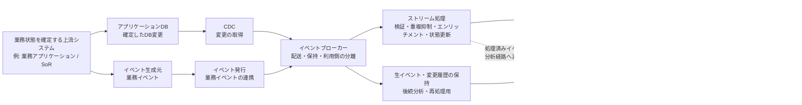
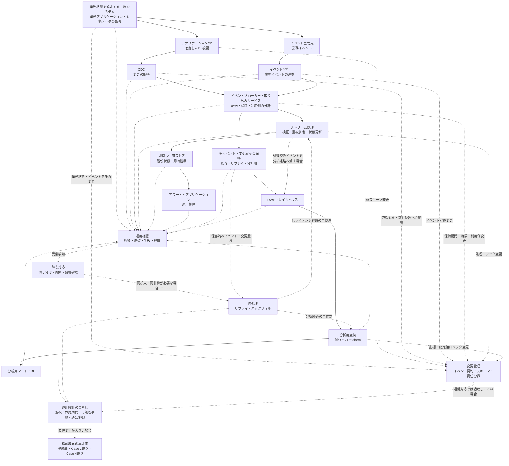

## 4. Case 3：変更データキャプチャ（Change Data Capture: CDC）・イベントを扱う低レイテンシ基盤

### 4.1 組織条件、要件、対象範囲

#### 対象とするパイプライン

Case 3では、業務システムやアプリケーションで確定したデータ変更、または業務上意味のあるイベントを、秒〜数分単位で下流のアプリケーション、アラート、運用処理、即時指標へ届ける低レイテンシのデータパイプラインを扱う。

ここでいう変更データキャプチャ（Change Data Capture: CDC）は、業務データベースで発生した挿入、更新、削除などの変更を検出し、下流で利用できるようにする方式である。[7][8]

イベント連携では、「注文が確定した」「支払いが完了した」「配送状態が変更された」「権限が変更された」のように、業務上意味のある出来事をイベントとして扱う。[9]

このCaseで重要なのは、Case 2のバッチ基盤を単に高速化することではない。Case 2は、複数部門・複数ソースを扱うDWH中心のバッチ基盤として、取り込み、変換、品質検査、鮮度確認、部分再実行、バックフィルを管理する構成であった。Case 3は、データ量や組織規模に関係なく、確定した変更やイベントを短い時間で下流へ届けること自体が価値を持つ場合に必要になる構成である。

例えば、不正検知、在庫監視、設備異常検知、ユーザー行動に応じた通知、権限変更の反映、プロダクト上の即時指標などでは、翌朝のレポート更新では遅すぎる場合がある。このような場合、日次または数時間ごとのバッチ処理ではなく、CDC、イベント連携、ストリーム処理、または短い間隔のマイクロバッチ処理を検討する理由が生じる。

一方で、低レイテンシ処理は常に必要なわけではない。主な利用目的がBI、定型レポート、部門横断分析であり、数時間後または翌朝までに更新されていれば十分な場合は、Case 2のようなバッチ中心構成の方が単純で運用しやすい場合がある。

CDCはデータベース上の変更を捉える方式であり、すべてのイベント連携がCDCであるわけではない。反対に、業務イベントはアプリケーション側で明示的に発行される場合もあり、必ずしもデータベースの変更ログから生成されるとは限らない。

#### 対象とする組織・利用者

このCaseでいう組織も、会社全体だけを指すものではない。大きな組織の一部業務、プロダクト機能、監視領域、セキュリティ領域、オペレーション領域、または特定のイベント処理パイプラインが、このCaseに近い条件を持つ場合がある。

組織規模が小さくても、確定した注文、支払い、在庫変化、設備異常、権限変更などを短い時間で下流へ反映しなければならない場合は、Case 3に近づく。反対に、大規模な組織であっても、対象が翌朝の定型レポートや数時間ごとの分析更新であれば、Case 2に近い構成で足りる場合がある。

想定する利用者や利用先には、BI利用者だけでなく、業務アプリケーション、アラート、監視システム、運用担当者、カスタマーサポート、セキュリティ担当、不正検知担当、プロダクト担当などが含まれる。低レイテンシ経路では、人間がダッシュボードを見るだけでなく、下流のシステムがイベントや更新結果を受け取り、次の処理や通知を起動する場合がある。

そのため、このCaseでは、データチームだけで完結しにくい。業務状態を確定する上流システムの担当者、アプリケーション開発者、データエンジニア、運用担当者、セキュリティ担当、データ利用者が、どのイベントを正式なものとして扱うか、どの順序で処理する必要があるか、遅延や欠損が起きた場合にどう判断するかをすり合わせる必要がある。

また、低レイテンシ処理を導入するには、ストリーム処理、監視、障害対応、再処理、リプレイ、下流影響確認を継続的に扱える体制が必要になる。これは必ずしも大規模な専門チームを意味しないが、少なくとも、障害時に何を確認し、どこから再処理し、どの利用者やシステムへ影響を伝えるかを説明できる状態が求められる。

#### データ条件と運用上の制約

扱うデータソースは、アプリケーションデータベース（database: DB）、業務システム、イベント生成元、ログ生成元、外部サービスからのイベント通知などを想定する。データの形式は、DBの変更イベント、業務イベント、アプリケーションイベント、JSONなどの半構造化データを含む場合がある。

Case 3では、変更やイベントが発生した後、短い時間で下流へ届けることが要件になる。発生頻度が常に高いとは限らないが、日次や数時間ごとにまとめて処理するのではなく、発生した変更やイベントを随時受け取り、求められる時間内に下流へ反映する必要がある。

この条件では、単にイベントを受け取って処理すればよいわけではない。イベントや変更データには、重複、遅延、順序入れ替わり、再送、欠損、訂正、削除が含まれる可能性がある。イベントブローカーやメッセージングサービスは、イベント生成元と利用側を分離し、配送や一時保持を支援するが、業務上必要な順序、重複排除、冪等性（idempotency）、状態管理、再処理は、下流処理や業務要件に応じて別途設計する必要がある。

例えば、同じ注文に関するイベントが複数回届く場合、下流処理が同じ通知を重複送信しないようにする必要がある。配送状態の変更を扱う場合、古い状態が後から到着したときに現在状態を巻き戻してよいのかを決めなければならない。即時集計を行う場合、遅れて届いたイベントをどの期間の指標へ反映するのかも問題になる。

また、低レイテンシ経路では、処理が継続的に動くため、常時稼働コスト、監視、処理遅延、キューの滞留、イベント保持期間、チェックポイント、再起動時の復旧、リプレイの範囲が運用上の制約になる。さらに、イベントが発生した時刻であるイベント時刻（event time）と、処理基盤がそのイベントを処理した時刻である処理時刻（processing time）は一致するとは限らず、遅延して到着するデータや順序が入れ替わったデータをどう扱うかも問題になる。

このような論点は、The Dataflow Modelでも、終端が決まっておらず、順序がそろわないデータを扱う際の中心課題として整理されている。同論文は、イベント時刻（event time）、ウィンドウ（window）、正確性（correctness）、レイテンシ（latency）、コスト（cost）の間にトレードオフがあることを示しており、低レイテンシ処理では状態と時間の扱いが重要になることを理解する背景文献として有用である。[10]

#### Case 3での前提

Case 3では、次のような前提を置く。

| 評価軸 | Case 3での前提 |
|---|---|
| 目的と利用者 | 確定したデータ変更や業務イベントを、アプリケーション、アラート、運用処理、即時指標へ低レイテンシで届ける |
| データの特性 | アプリケーションDBの変更、業務イベント、アプリケーションイベント、イベント生成元からの継続的なデータを扱う |
| 鮮度と処理方式 | 秒〜数分単位の反映が必要。CDC、イベント連携、ストリーム処理、マイクロバッチ処理が候補になる |
| 信頼性と再処理 | 重複、遅延、順序入れ替わり、リプレイ、冪等性、状態管理、速報値と確定値の分離を考慮する |
| 組織体制と運用 | ストリーム処理、監視、障害対応、リプレイ、下流影響確認を継続運用できる体制が必要になる |
| ガバナンスとコスト | 常時稼働コスト、イベント保持期間、権限、監査、再処理可能性、低レイテンシ化による運用負荷を評価する |

#### 適用範囲と境界

このCaseでは、業務上の状態を作成・更新し、その結果を正式な状態として同期的に確定するトランザクション経路そのものの詳細設計は、原則として対象外とする。注文登録、決済確定、契約更新、権限変更などをどのようにトランザクションとして成立させるかは、業務アプリケーションやトランザクションシステム側の設計領域である。

Case 3の中心対象は、記録の正本システム（System of Record: SoR）や業務アプリケーションが確定した変更、または確定済みの業務イベントを、下流のシステムや利用者へ短い時間で伝播・処理する低レイテンシ経路である。低レイテンシ経路は、上流のトランザクション経路を置き換えるものではない。

また、Case 3では、低レイテンシ経路と分析経路を区別する。低レイテンシ経路は、アラート、即時通知、サービングストア、運用処理、プロダクト機能などへ短い時間で結果を届ける経路である。一方、分析経路は、生イベントや変更履歴をDWHまたはレイクハウスへ保存し、分析、レポーティング、指標計算、機械学習などへ利用する経路である。

両方の経路が常に必要になるわけではない。主な目的がアラートやアプリケーション連携であれば、低レイテンシ経路が中心になる。履歴分析、監査、BI、機械学習向けの特徴量作成にも利用する場合は、同じイベントや変更履歴を分析経路にも保存する必要がある。

反対に、主な利用目的が定型レポートや部門横断分析であり、秒〜数分単位の反映が不要であれば、CDC、イベントブローカー、ストリーム処理を導入することは過剰になり得る。その場合は、Case 2のようなDWH中心のバッチ処理、増分取り込み、増分処理、または短い間隔のマイクロバッチ処理の方が、単純で保守しやすい可能性がある。

また、多様なデータ形式、長期の生データ保持、複数処理エンジン、データサイエンス、機械学習、BIを共通基盤で扱うことが主目的になる場合は、Case 4に近い構成を検討する。Case 3は、低レイテンシで変更やイベントを届けることに焦点を置くCaseであり、レイクハウスや機械学習基盤全体を扱うCaseではない。

したがって、Case 3で追加される複雑性は、Case 2より大規模だから必要になるものではない。確定した変更や業務イベントを短い時間で下流へ届けること自体が価値を持ち、そのために重複、遅延、順序入れ替わり、状態管理、リプレイ、監視、常時稼働コストを受け入れる必要がある場合に、このCaseに近い構成を検討する。

次節では、ここで整理した要件から、CDC、イベントブローカー、ストリーム処理、即時提供用ストア、生イベント保存、分析経路をどのように組み合わせるかを、構成と設計判断として確認する。

---

### 4.2 構成と設計判断

#### 構成方針

Case 3では、業務システムやアプリケーションで確定したデータ変更、または業務上意味のあるイベントを、低レイテンシで下流へ届ける構成を扱う。

このCaseで重要なのは、単に取り込み頻度を短くすることではない。変更やイベントが発生した後、短い時間で下流のアプリケーション、アラート、運用処理、即時指標へ反映する必要があるため、データを一定時間ごとにまとめて処理するバッチ中心構成とは異なる設計判断が必要になる。

代表的には、アプリケーションデータベースの変更を変更データキャプチャ（Change Data Capture: CDC）で取得する経路、またはアプリケーションが業務イベントを明示的に発行する経路を用意し、イベントブローカー（event broker）や取り込みサービスを介して下流へ渡す。そのうえで、低レイテンシ経路ではストリーム処理（stream processing）を中心に、要件によっては短い間隔のマイクロバッチ処理（micro-batch processing）も候補にしながら、必要な検証、フィルタリング、エンリッチメント（enrichment）、重複抑制、状態更新、即時指標の作成を行う。

一方で、Case 3では、低レイテンシ経路だけを作ればよいとは限らない。後から履歴分析、監査、BI、機械学習向けの特徴量作成、障害時の再処理を行うためには、生イベント（raw event）や変更履歴を保存し、分析経路へ渡す必要がある場合がある。

したがって、Case 3の構成では、必要に応じて次の2つの経路を分けて考える。

- 低レイテンシ経路（low-latency path）
  - 確定した変更やイベントを、アプリケーション、アラート、運用処理、即時指標へ短い時間で届ける経路
- 分析経路（analytical path）
  - 生イベントや変更履歴をDWH（data warehouse）またはレイクハウス（data lakehouse）へ保存し、分析、BI、履歴補正、指標計算、機械学習などへ利用する経路

ただし、Case 3で常に分析経路を併設するとは限らない。主な目的がアラート、通知、運用処理、アプリケーション状態の更新であり、履歴保持が監査、障害調査、リプレイのために限られる場合は、低レイテンシ経路を中心とした構成もあり得る。一方で、同じイベントや変更履歴をBI、公式指標、履歴分析、機械学習向け特徴量にも利用する場合は、低レイテンシ経路と分析経路を併用する構成になる。

この2つは、同じイベントや変更履歴を出発点にする場合がある。しかし、処理の目的、許容遅延、変換の粒度、失敗時の復旧方法、利用者は異なる。そのため、低レイテンシ処理と分析用変換を同じものとして扱わず、それぞれの役割を分けて設計する。

#### 構成例

このCaseの構成例は、次のように整理できる。

**図4-1：** Case 3におけるCDC・イベントを扱う低レイテンシ基盤の一例。確定した変更や業務イベントをイベントブローカーへ渡し、低レイテンシ経路ではストリーム処理と即時提供用ストアを通じてアラートやアプリケーションへ届ける。一方で、生イベントや変更履歴を保存し、DWHまたはレイクハウス上で分析用変換を行う経路も持つ。

ただし、すべての低レイテンシ構成でイベントブローカーが独立したコンポーネントとして必要になるわけではない。CDCツール、クラウドの取り込みサービス、DWHへの継続取り込み、マイクロバッチ処理などを組み合わせ、より単純な構成で要件を満たせる場合もある。

この図は、理解のために単純化したものである。実際には、CDCから直接DWHへ継続取り込みする構成、イベントブローカーから複数の下流処理へ配信する構成、ストリーム処理済みの結果だけを分析基盤へ保存する構成、または生イベントと処理済みイベントの両方を保存する構成もあり得る。

重要なのは、図の形を固定することではない。どのイベントを低レイテンシに処理し、どのデータを履歴として保存し、どの変換をストリーム処理側で行い、どの変換をDWHやレイクハウス側で行うかを、利用目的と運用可能性に合わせて決めることである。

#### 主要コンポーネントの役割

アプリケーションDBやイベント生成元は、Case 3の起点になる。ただし、ここで扱うのは、業務状態を同期的に確定するトランザクション処理そのものではない。注文、決済、契約、権限変更などの正式な状態を確定するのは、記録の正本システム（System of Record: SoR）や業務アプリケーション側の責任である。Case 3では、その確定済みの変更や業務イベントを下流へ伝播する。

CDCと業務イベント発行は、同じ業務アプリケーションや、対象データのSoRとなるシステムを上流に持つ場合がある。ただし、CDCはDBに確定された変更を取得するのに対し、業務イベント発行はアプリケーション側で業務上意味のある出来事を明示的に発行する点が異なる。

CDCは、業務データベースで発生した挿入、更新、削除などの変更を検出し、下流で利用できるようにする方式である。データベース変更を起点にしたい場合、アプリケーション側へ大きな変更を加えずに変更履歴を取得できる可能性がある。一方で、CDCはデータベース上の変更を捉える方式であり、業務上の意味を持つイベント設計そのものを自動的に解決するわけではない。[7][8]

イベント連携では、アプリケーションや業務システムが「注文が確定した」「支払いが完了した」「配送状態が変更された」のような業務イベントを明示的に発行する。イベントは、発生した出来事を表す記録であり、イベント生成元、イベント利用側、イベントを運ぶチャネルが分かれる。これにより、イベント生成元と下流の利用側を直接結合しすぎず、複数の下流処理へ同じ出来事を伝えやすくなる。[9]

イベントブローカーは、イベント生成元とイベント利用側の間に入り、イベントの受け取り、配送、一時保持、複数利用者への配信を支援する。イベントブローカーを挟むことで、生成元と利用側を時間的・技術的に分離しやすくなる。ただし、イベントブローカーを導入しただけで、業務上必要な単位での順序、重複排除、冪等性（idempotency）、状態管理、再処理が自動的に満たされるわけではない。

ストリーム処理層は、低レイテンシ経路の中心的な処理を担う。例えば、イベントの検証、不要イベントの除外、属性の付与、重複抑制、一定時間内の集計、状態更新、即時指標の作成などを行う。処理によっては、イベント時刻（event time）、処理時刻（processing time）、ウィンドウ（window）、遅延データ、順序入れ替わりを考慮する必要がある。The Dataflow Modelでも、終端が決まっておらず、順序がそろわないデータを扱う際に、正確性（correctness）、レイテンシ（latency）、コスト（cost）の間にトレードオフがあることが整理されている。[10]

即時提供用ストア（serving store）は、アラート、アプリケーション、運用処理などが低レイテンシで参照するための保存先である。DWHは分析や集計に適した基盤である一方、アプリケーションやアラートが短い応答時間で参照する用途では、別の提供先を用意する方が適している場合がある。即時提供用ストアには、最新状態、直近集計、通知判定に使う結果などを保持する。

生イベントや変更履歴の保存は、分析、監査、障害調査、リプレイ、後続の再処理のために重要になる。低レイテンシ経路で利用したイベントをすぐに破棄すると、後からロジックを修正して再処理したり、過去のイベントに基づいて指標を再計算したりすることが難しくなる。保存期間、保存形式、スキーマ、個人情報や機密情報の扱いは、要件に応じて決める必要がある。

DWHまたはレイクハウスは、分析経路の保存・変換基盤として利用される。構造化データ中心でBIや定型分析が主目的であればDWHが候補になる。一方で、多様な形式の生イベント、長期履歴、複数ワークロード、機械学習向けの利用が重要になる場合は、Case 4に近い共通データ基盤として、必要に応じてレイクハウスを含む構成を検討する理由が生じる。

分析用変換では、dbtやDataformなどを用いて、DWHまたはレイクハウスに保存したイベントや変更履歴を、分析やBIで利用しやすい形に整える。ここで扱うのは、低レイテンシ経路での即時処理とは異なり、業務定義、履歴補正、確定値の作成、分析用マート、指標定義などである。したがって、Case 3で低レイテンシ経路を導入しても、履歴分析やBIが必要な場合には、分析用変換が不要になるわけではない。

#### 低レイテンシ経路と分析経路の役割分担

低レイテンシ経路では、イベントや変更データを短い時間で処理し、下流のアプリケーション、アラート、運用処理へ提供する。ここでは、処理の遅延、イベントの滞留、重複処理、状態更新、通知の重複、古いイベントの扱いが問題になりやすい。

例えば、在庫監視では、在庫数がしきい値を下回ったことを短い時間で検知し、通知や補充判断へつなげる必要がある。不正検知では、支払い、ログイン、権限変更、利用行動などのイベントを短い時間で評価し、アラートや追加確認へつなげる場合がある。これらの用途では、後からBIで分析できることだけでは不十分であり、イベント発生後すぐに判断や通知へつなげる低レイテンシ経路が必要になる。

ただし、これらの用途でも分析経路が不要になるとは限らない。検知件数、誤検知、在庫変動、不正傾向、対応結果などを後から分析する場合は、同じイベントや処理結果をDWHまたはレイクハウスへ保存し、分析用に整備する経路も必要になる。

一方、分析経路では、同じイベントや変更履歴を蓄積し、後から分析、監査、レポーティング、指標計算、機械学習などに利用する。ここでは、低レイテンシであることよりも、履歴の完全性、定義の一貫性、再現性、訂正の反映、確定値の作成が重要になる場合が多い。

このため、ストリーム処理で作る速報値と、DWHやレイクハウス上で後から作る確定値は分けて扱う必要がある。速報値は、短い時間で判断するために有用である一方、遅延イベント、訂正、キャンセル、重複排除、締め処理などを完全には反映していない場合がある。公式レポートや会計に近い用途では、分析経路で確定ロジックを適用した値を信頼できる参照元（Source of Truth: SoT）として扱う方が適切な場合がある。

また、低レイテンシ経路と分析経路の両方を持つ場合、同じ業務ロジックを二重に実装して数値がずれるリスクがある。例えば、ストリーム処理側で即時指標を計算し、DWH側でも同じ指標を別実装で計算すると、遅延イベント、丸め、キャンセル、重複排除の扱いが異なり、速報値と確定値の差分を説明しにくくなる。

そのため、どのロジックを低レイテンシ経路で実行し、どのロジックを分析経路で実行するかを明確にする必要がある。低レイテンシ経路では、通知、即時判定、暫定的な状態更新など、時間価値が高い処理に絞る。分析経路では、公式指標、履歴補正、複雑な業務定義、部門横断の分析マートなどを担う。この分担により、低レイテンシの価値を得つつ、分析結果の説明可能性を保ちやすくなる。

#### イベント処理で追加される設計論点

CDCやイベント連携を採用すると、Case 2のバッチ基盤とは異なる設計論点が増える。

第一に、イベントの粒度を決める必要がある。データベースの行変更をそのまま下流へ渡すのか、アプリケーション側で業務上意味のあるイベントとして発行するのかによって、下流の扱いやすさは変わる。CDCは変更を捕捉するには有効だが、変更の業務上の意味を読み解く責任が下流に移る場合がある。業務イベントは意味を明示しやすい一方、上流アプリケーション側でイベント設計と発行責任を持つ必要がある。

第二に、イベントのキーと順序を決める必要がある。すべてのイベントについて全体順序を保証することは、必要とも限らず、現実的でない場合もある。実務上は、注文ID、顧客ID、契約ID、設備IDなど、業務上順序が重要な単位を決め、その単位で古い状態をどう扱うかを設計することになる。

第三に、重複と冪等性を考える必要がある。同じイベントや変更が複数回届いても、下流の状態や通知が壊れないようにする必要がある。例えば、同じ支払い完了イベントを複数回処理しても、二重に通知しない、二重に集計しない、二重に状態更新しないようにする。これはイベントブローカーだけでなく、下流処理、保存先、業務ロジック側の設計にも関係する。

第四に、イベント時刻と処理時刻を分ける必要がある。イベントが発生した時刻と、処理基盤がそのイベントを処理した時刻は一致しない。遅延して届いたイベントを、発生時刻に基づいて過去の集計へ反映するのか、処理時刻に基づいて現在の集計へ反映するのかによって、指標の意味は変わる。ウィンドウ集計や速報値を扱う場合、この違いは特に重要になる。

第五に、状態管理とチェックポイント（checkpoint）を設計する必要がある。ストリーム処理では、直近の状態、過去のイベント、集計途中の値、どこまで処理したかを持ちながら継続処理する場合がある。障害時にどこから再開するか、再開時に重複処理が起きても結果が壊れないか、状態をどの期間保持するかは、設計上の重要な判断になる。

第六に、リプレイとバックフィルの関係を整理する必要がある。保存済みイベントを再投入して処理し直すリプレイは、イベント処理のロジック変更や障害復旧で重要になる。一方、過去期間の分析用テーブルや指標を再計算するバックフィルは、分析経路で重要になる。両者は似ているが、リプレイはイベント列の再処理、バックフィルは過去期間の結果再作成という違いがある。

第七に、速報値と確定値を分ける必要がある。低レイテンシ経路では、遅延イベントや訂正を待たずに暫定値を提供することがある。一方、分析経路では、一定期間を締めた後に確定値を作る場合がある。この差を明示しないと、利用者は速報値と公式値の違いを理解できず、数値不一致として受け取る可能性がある。

#### 要件と設計判断の対応

Case 3では、要件、必要な能力、設計判断、受け入れるトレードオフの対応を次のように整理できる。

| 要件・制約 | 必要な能力 | 設計判断 | 受け入れるトレードオフ |
|---|---|---|---|
| 確定したDB変更を短い時間で下流へ届けたい | DB上の挿入、更新、削除を継続的に取得する能力 | CDCを用いて、アプリケーションDBに確定された変更を下流へ渡す | DBスキーマ変更、主キー、削除、更新順序が下流処理へ影響しやすくなる |
| 業務上意味のある出来事を下流へ伝えたい | 業務イベントの意味、キー、発生条件、スキーマを定義する能力 | アプリケーション側で業務イベントを明示的に発行する | 上流アプリケーション側でイベント設計と発行責任を持つ必要がある |
| 複数の下流処理へ同じイベントを配信したい | 生成元と利用側を分離し、複数の利用者へイベントを届ける能力 | イベントブローカーや取り込みサービスを挟み、配送、保持、利用側の分離を行う | イベント契約、スキーマ変更、利用者管理、滞留監視が必要になる |
| アラートやアプリケーションへ低レイテンシで反映したい | 到着したイベントを短い時間で検証、変換、状態更新する能力 | ストリーム処理を中心に、必要に応じて短い間隔のマイクロバッチ処理も候補にする | 処理遅延、滞留、状態管理、チェックポイント、常時監視の負荷が増える |
| 最新状態や即時指標を下流から参照したい | アプリケーションやアラートが短い応答時間で参照できる状態を保持する能力 | 即時提供用ストアを用意し、最新状態、直近集計、通知判定結果などを保持する | DWHとは別の提供先を持つため、更新失敗、不整合、権限管理を監視する必要がある |
| 履歴分析や監査にも使いたい | 生イベントや変更履歴を欠損なく保持し、後から参照できる能力 | 生イベントや変更履歴を保存し、必要に応じてDWHまたはレイクハウスへ渡す | 保存コスト、保持期間、個人情報や機密情報、スキーマ変更への対応が必要になる |
| BIや公式指標にも使いたい | 低レイテンシ処理とは別に、履歴補正、業務定義、確定値を作る能力 | 分析経路でdbtやDataformなどを用いて分析用マートを作る | 低レイテンシ経路の速報値と、分析経路の確定値を分けて説明する必要がある |
| 重複や再送が起こり得る | 同じイベントを複数回処理しても結果を壊さない能力 | イベントID、業務キー、処理済み記録などを用いて重複抑制と冪等性を設計する | 下流処理、保存先、通知制御まで含めて冪等性を考える必要がある |
| 順序入れ替わりや遅延イベントが起こり得る | 業務上順序が重要な単位と、遅延許容範囲を定義する能力 | 業務キー、イベント時刻、処理時刻、ウィンドウ、遅延許容範囲を決める | 全体順序を前提にできず、キー単位の順序や古いイベントの扱いを設計する必要がある |
| 障害やロジック変更後に処理し直したい | 保存済みイベントや変更履歴から安全に再処理する能力 | リプレイとバックフィルの範囲、再処理手順、通知抑制、状態再作成方針を設計する | 再処理時の二重通知、状態不整合、速報値と確定値の差分確認が必要になる |
| 常時稼働コストと運用負荷が増える | 低レイテンシが本当に必要な処理を見極める能力 | 低レイテンシ経路へ載せる処理を限定し、BIや履歴分析は分析経路へ寄せる | すべてをリアルタイム化できるわけではなく、用途ごとに鮮度と複雑性を使い分ける必要がある |

この対応表で重要なのは、すべての要件に対して最も複雑な構成を選ぶことではない。低レイテンシで届ける必要がある処理だけを低レイテンシ経路へ載せ、履歴分析や公式指標は分析経路へ寄せることで、複雑性を必要な場所に限定する。

#### この構成で得られるものと限界

この構成で得られる主な利点は、確定した変更や業務イベントを短い時間で下流へ届けられることである。これにより、在庫監視、不正検知、運用アラート、ユーザー行動に応じた通知、プロダクト上の即時指標など、時間価値の高い処理を実現しやすくなる。

また、イベントブローカーを挟むことで、イベント生成元と複数の利用側を分離しやすくなる。上流システムは、下流のすべての利用先を直接知る必要がなくなり、下流側も必要なイベントを購読して処理を追加しやすくなる。ただし、この分離は設計上の柔軟性を高める一方で、イベント契約、スキーマ変更、権限、監視、障害時の影響確認を必要とする。

生イベントや変更履歴を保存すれば、後から分析、監査、リプレイ、バックフィルに利用しやすくなる。低レイテンシ経路で障害が起きた場合や、処理ロジックを変更した場合にも、保存済みイベントを使って再処理できる可能性がある。ただし、イベントを長期間保持するほど、保存コスト、個人情報や機密情報の管理、スキーマ変更への対応、データ利用ルールの整備が必要になる。

この構成の限界は、低レイテンシ化によって運用上の複雑性が大きく増えることである。処理遅延、滞留、重複、順序入れ替わり、状態管理、チェックポイント、リプレイ、速報値と確定値の差分説明など、Case 2では中心ではなかった論点が日常運用に入ってくる。

また、CDCやイベントブローカーを導入しても、業務上の正しさが自動的に保証されるわけではない。どの変更をどのイベントとして扱うのか、どの順序を守る必要があるのか、どこまでの遅延を許容するのか、同じイベントを複数回処理しても壊れないかは、業務要件と下流処理に応じて設計する必要がある。

したがって、この構成は、低レイテンシで届けること自体に明確な価値がある場合に採用候補となる。主な利用目的が定型レポートや部門横断分析であり、数時間後または翌朝までに更新されていれば十分であれば、Case 2のようなバッチ中心構成、または短い間隔のマイクロバッチ処理の方が、単純で保守しやすい場合がある。

次節では、この構成を継続運用するために、監視、障害対応、リプレイ、責任分界、トレードオフ、変更トリガーを整理する。

---

### 4.3 運用、トレードオフ、変更トリガー

#### 運用方針

Case 3では、確定したデータ変更や業務イベントを、低レイテンシで下流のアプリケーション、アラート、運用処理、即時指標へ届ける。そのため、運用で確認すべきことは、単に「ジョブが成功したか」だけではない。

重要なのは、イベントや変更データが、上流で発生してから下流で利用可能になるまで、どこで遅延し、どこで滞留し、どの処理まで完了しているかを継続的に把握することである。バッチ中心の構成では、日次や数時間ごとの処理完了を確認すれば足りる場合がある。一方、Case 3では、イベントブローカー、ストリーム処理、即時提供用ストア、生イベントや変更履歴の保持、分析経路がそれぞれ別の状態を持つ。

このため、Case 3の運用では、次の観点を分けて確認する。

- 上流の業務アプリケーションやSoRで、業務状態が正しく確定しているか
- CDCやイベント発行によって、確定した変更や業務イベントが下流へ渡っているか
- イベントブローカーや取り込みサービスで、イベントが滞留していないか
- ストリーム処理が、重複、遅延、順序入れ替わり、状態管理を考慮しながら処理できているか
- 即時提供用ストアが、アプリケーションやアラートで利用できる状態を維持しているか
- 生イベントや変更履歴が、監査、リプレイ、バックフィル、分析用変換のために保持されているか
- 分析経路がある場合、速報値と確定値の差分を説明できるか

特に注意すべきなのは、低レイテンシ経路の失敗と、上流のトランザクション処理の失敗を混同しないことである。Case 3で扱うのは、原則として、上流で確定した変更や業務イベントを下流へ伝播・処理する経路である。注文、決済、契約、権限変更などの業務状態を同期的に確定する責任は、業務アプリケーションや対象データのSoR側にある。

したがって、障害調査では、まず「業務状態が確定していない」のか、「確定した状態が下流へ届いていない」のか、「届いたイベントの処理や提供に失敗している」のかを切り分ける必要がある。この切り分けができないと、データパイプライン側で修正すべき問題と、上流業務システム側で修正すべき問題を混同してしまう。

#### 確認すべき運用項目

Case 3では、監視対象が複数の層に分かれる。日常運用では、次の項目を確認する。

| 運用項目 | 確認すること | 放置した場合のリスク |
|---|---|---|
| 上流の業務アプリケーション・SoR | 対象データや業務イベントが想定どおり発生しているか | 上流で業務状態が確定していない問題を、下流の遅延、欠損、処理失敗として誤認し、対応箇所を誤る |
| CDC・イベント発行 | DB変更や業務イベントが下流へ渡っているか、取得遅延がないか | 確定済みの変更やイベントが下流へ届かず、即時指標、アラート、アプリケーション状態が実際の業務状態から遅れる |
| イベントブローカー・取り込みサービス | イベントの滞留、配送失敗、保持期間、利用側の遅れ | イベントが蓄積または失われ、下流処理が追いつかなくなる。保持期間を超えると、後から処理を追いつかせられない場合がある |
| ストリーム処理 | 処理遅延、処理失敗、チェックポイント、状態の肥大化、重複処理 | 古いイベントで状態を上書きする、同じイベントを二重処理する、障害後に正しい位置から再開できないなど、下流の状態が不整合になる |
| 即時提供用ストア | 最新状態、直近集計、参照応答、更新失敗 | アプリケーションやアラートが古い状態、不完全な集計、または更新途中の値を参照し、誤通知や誤った業務判断につながる |
| 生イベント・変更履歴の保持 | 保存期間、スキーマ、欠損、再利用可能性 | 障害、ロジック変更、誤処理の発覚後に、対象期間をリプレイできず、即時提供用ストアや分析用データを再作成できなくなる |
| 分析経路 | DWH・レイクハウスへの反映、分析用変換、確定値作成 | 速報値と確定値の差分を検証できず、BI、公式指標、監査、後続分析でどの値を信頼すべきか説明できなくなる |
| 権限・機密情報 | イベント内の個人情報、機密情報、参照権限 | 低レイテンシ経路や保存済みイベントを通じて、不要な個人情報や機密情報が複数の下流処理へ広がり、後から削除・制御しにくくなる |
| 通知・アラート | 何を異常として通知するか、どの重大度で扱うか、誰が対応するか | 通知が多すぎるとアラート疲れが起き、少なすぎると重大な遅延、停止、誤処理を検知できない。結果として、対応すべき問題の優先度判断や初動が遅れる |

低レイテンシ経路では、単に処理が失敗したかどうかだけでなく、処理が遅れているが止まってはいない状態も重要になる。イベントが継続的に到着する構成では、処理が成功していても、到着量に処理能力が追いつかなければ、下流へ反映されるまでの遅延が増える。

また、すべての遅延が同じ重大度を持つわけではない。アラートや不正検知のように、数分の遅れで業務価値が下がる処理もあれば、後続の分析経路であれば多少の遅れを許容できる場合もある。そのため、どの経路で、どの程度の遅延を異常とみなすかを、利用目的ごとに決める必要がある。

#### 主要なトレードオフ

Case 3では、低レイテンシを得る代わりに、バッチ中心構成には少なかった複雑性を受け入れることになる。

第一に、鮮度と運用複雑性のトレードオフがある。秒〜数分単位でイベントを反映できる構成は、在庫監視、不正検知、運用アラート、プロダクト機能などには有効である。一方で、イベントブローカー、ストリーム処理、状態管理、即時提供用ストア、監視、リプレイ手順を継続的に運用する必要がある。数時間後や翌朝の更新で十分な用途であれば、この複雑性を受け入れる理由は弱い。

第二に、速報値と確定値のトレードオフがある。低レイテンシ経路では、遅延イベント、訂正、キャンセル、重複排除、締め処理を待たずに、暫定的な値を提供することがある。これは短時間で判断するためには有用である。しかし、公式レポートや会計に近い用途では、分析経路で確定ロジックを適用した値を使う方が適切な場合がある。

第三に、柔軟性と責任分界のトレードオフがある。イベントブローカーを挟むと、上流のイベント生成元と複数の下流処理を分離しやすくなる。下流処理を追加しやすくなる一方で、イベント契約、スキーマ変更、保持期間、権限、障害時の影響範囲を管理する必要がある。下流の利用者が増えるほど、「誰がイベントの意味を保証するのか」「誰がスキーマ変更を通知するのか」「誰が遅延や欠損の影響を判断するのか」が重要になる。

第四に、リプレイ可能性と保存コストのトレードオフがある。生イベントや変更履歴を長く保持すれば、障害後の再処理、ロジック変更後の再計算、監査、分析に利用しやすくなる。一方で、保存コスト、個人情報や機密情報の管理、スキーマ変更への対応、データ利用ルールの整備が必要になる。

第五に、低レイテンシ経路と分析経路の二重実装リスクがある。同じ業務ロジックをストリーム処理側とDWH・レイクハウス側で別々に実装すると、速報値と確定値の差が意図したものなのか、実装差分によるものなのかを説明しにくくなる。そのため、低レイテンシ経路では即時判断に必要なロジックへ絞り、公式指標や複雑な履歴補正は分析経路へ寄せるなど、役割分担を明確にする必要がある。

これらのトレードオフを整理すると、次のようになる。

| 得られるもの | 受け入れる複雑性 |
|---|---|
| 下流のアプリケーション、アラート、運用処理へ、確定した変更や業務イベントを短時間で届けられる | CDC、イベント発行、イベントブローカー、ストリーム処理の各層で、処理遅延、滞留、配送失敗を継続的に監視する必要がある |
| 在庫監視、不正検知、ユーザー通知、運用アラートなど、時間価値の高い処理を実現しやすくなる | 重複イベント、遅延イベント、順序入れ替わり、冪等性、状態管理を考慮して、誤通知や状態不整合を防ぐ必要がある |
| イベント生成元と複数の下流処理を分離し、同じイベントを複数用途で利用しやすくなる | イベントの意味、スキーマ、利用者、保持期間、下流影響を管理し、変更時に利用側へ影響を伝える必要がある |
| 生イベントや変更履歴を保持することで、障害後のリプレイ、ロジック変更後の再処理、監査、分析に利用しやすくなる | 保存コスト、保持期間、スキーマ変更、個人情報や機密情報の扱い、再処理手順を設計する必要がある |
| 低レイテンシ経路で速報値を提供し、必要に応じて分析経路で確定値を作れる | 速報値と確定値の定義、作成タイミング、差分理由、利用場面を明確にし、利用者に使い分けを説明する必要がある |

#### 低レイテンシ処理の障害対応とリプレイ

Case 3では、障害対応を「失敗したジョブを再実行する」だけで考えると不十分である。イベントや変更データは継続的に到着するため、障害時には、どの時点まで処理済みか、どのイベントを再処理するか、再処理によって重複や順序の問題が起きないかを確認する必要がある。

障害対応では、まず障害箇所を切り分ける。

| 障害箇所 | 代表的な問題 | 主な確認 |
|---|---|---|
| 上流の業務アプリケーション・SoR | 業務状態が確定していない、DB更新が行われていない、業務イベント自体が発生していない | 上流の処理結果、対象レコードの状態、DB更新有無、イベント発行条件、上流側のエラー |
| CDC・イベント発行 | 変更取得が止まる、一部の変更が取得されない、イベント発行が失敗する、スキーマ変更で下流処理が壊れる | 取得位置、接続状態、認証、対象テーブルやカラムの変更、イベント発行ログ、取得遅延、欠損や重複の有無 |
| イベントブローカー・取り込みサービス | 配送遅延、イベント滞留、保持期間超過、利用側の処理遅れ、特定の下流処理だけが追いつかない | 滞留量、保持期間、利用側の処理位置、配送失敗、再処理可能な範囲、下流利用者ごとの遅れ |
| ストリーム処理 | 処理失敗、処理遅延、チェックポイント不整合、状態の破損、重複処理、古いイベントによる状態更新 | 処理済み位置、再開位置、状態ストア、エラー内容、重複処理の有無、遅延イベントや順序入れ替わりの扱い |
| 即時提供用ストア | 更新失敗、部分更新、古い状態の参照、二重更新、参照不能、アプリケーション側との不整合 | 最終更新時刻、キー単位の状態、更新件数、重複更新の有無、参照応答、下流アプリケーションが見ている値 |
| 分析経路 | 生イベントや変更履歴が保存されない、DWH・レイクハウスへの反映が遅れる、分析用変換が失敗する、確定値を作れない | 生イベント保存状況、DWH・レイクハウスへの反映状況、分析用テーブル、変換ジョブ、バックフィル範囲、速報値と確定値の差分 |

次に、復旧方法を選ぶ。短時間の一時障害であれば、再試行や処理再開で足りる場合がある。一方、処理ロジックの誤り、状態の破損、重複処理、古いイベントによる誤更新、スキーマ変更への未対応がある場合は、保存済みイベントや変更履歴を使って、対象範囲をリプレイする必要が生じる場合がある。

ただし、リプレイは、再処理に必要なイベントや変更履歴が保持されている場合に成立する。そもそもイベントが取得・保存されていない場合や、保持期間を超えて失われている場合は、リプレイだけでは復旧できない。その場合は、上流のSoRからの再取得、補正データの投入、CDC取得位置の確認、分析経路側のバックフィルなど、別の復旧方法を検討する必要がある。

リプレイを行う場合は、少なくとも次を決める必要がある。

- どのイベントまたは変更履歴を再投入するか
- どの時点、どのキー、どの対象範囲から再処理するか
- 処理済みイベントをどのように判定するか
- 同じイベントを再処理しても結果が壊れないか
- 即時提供用ストアの状態を再作成するのか、現在の状態へ差分適用するのか
- リプレイ中に新しいイベントの処理を止めるのか、並行して処理するのか
- リプレイ後に通常処理へどのように追いつくか
- 分析経路のバックフィルと範囲を合わせる必要があるか
- リプレイ後に、速報値、確定値、下流通知、即時提供用ストアの状態をどう確認するか

特に、アラートや通知を含む低レイテンシ経路では、リプレイ時に同じ通知を再送してよいかを事前に決める必要がある。例えば、不正検知イベントを再処理した結果、過去のアラートを再度送ると、運用担当者や利用者に混乱を与える場合がある。そのため、リプレイ時には、通知を抑制する、検証用の出力先へ流す、処理済み記録を参照する、通知だけは再実行対象から外すなどの制御が必要になる。

また、リプレイとバックフィルは分けて考える。リプレイは、保存済みイベントや変更履歴を再投入して、低レイテンシ経路や状態更新を再処理する考え方である。バックフィルは、過去期間の分析用テーブルや指標を再計算するだけでなく、モデル変更や列追加によって新たに必要になった値を、保存済みデータから過去分に対して埋め直す場合にも使われる。ただし、過去時点で必要な情報が保存されていなかった場合は、完全なバックフィルはできず、NULL、既定値、推定値、または適用開始日を明示して扱う必要がある。両者は同時に必要になる場合があるが、目的と影響範囲は異なる。

例えば、ストリーム処理のロジックを修正して即時提供用ストアの状態を作り直す場合は、リプレイが中心になる。一方で、同じ期間のBI用マートや公式指標も修正する必要がある場合は、分析経路側でバックフィルも必要になる。このとき、リプレイ対象期間とバックフィル対象期間がずれていると、速報値、確定値、BI上の数値の差分を説明しにくくなる。

#### 変更管理と責任範囲

Case 3では、イベントや変更データの意味が下流処理へ直接影響するため、変更管理と責任分界が重要になる。

まず、上流の業務アプリケーションやSoRの所有者は、どの業務状態を正式に確定するのか、どのDB変更や業務イベントを下流へ渡すのかに責任を持つ。イベント発行を採用する場合は、どの出来事をイベントとして定義するか、イベント名、キー、必須項目、発生条件、スキーマ変更方針を管理する必要がある。

CDCを採用する場合は、DBスキーマ変更が下流へ与える影響を管理する必要がある。CDCはDB上の変更を捕捉するため、テーブル構造、カラム名、型、削除の扱い、主キー、更新日時、論理削除の方針が変わると、下流の変換や重複排除、状態更新に影響する場合がある。

イベントブローカーや取り込み基盤の所有者は、配送、保持、利用側の分離、権限、監視、障害時の影響確認を担う。利用側が増えるほど、イベントを誰が利用しているのか、どの処理がどのイベントに依存しているのかを把握する必要がある。

これはDWH内のモデリングで、変更頻度や責任主体の異なる属性を分離し、不要な下流マートへの影響を抑える考え方に近い。イベント設計でも、下流の多くが依存する安定したイベント契約と、変更されやすい属性や用途別の情報を分けることで、変更時の影響範囲を局所化できる。

ただし、分離しすぎると下流処理が複数イベントや複数テーブルを組み合わせなければ意味を復元できなくなる。そのため、変更頻度、利用者数、責任主体、履歴管理の粒度を見て、安定した共通イベントとして扱う部分と、用途別・変更頻度別に分ける部分を判断する必要がある。

ストリーム処理の所有者は、検証、重複抑制、エンリッチメント、状態更新、即時指標、チェックポイント、リプレイ手順を管理する。処理ロジックを変更する場合は、既存状態をそのまま使えるのか、状態の再作成が必要なのか、リプレイが必要なのかを判断する。

分析経路の所有者は、生イベントや変更履歴をDWHまたはレイクハウスへ保存し、分析用変換、公式指標、BI、確定値作成を管理する。速報値と確定値が異なる場合は、その差分が仕様上の差なのか、データ欠損や処理失敗によるものなのかを説明できる必要がある。

責任範囲は、次のように整理できる。

| 領域 | 主な責任 |
|---|---|
| 上流業務アプリケーション・SoR | 業務状態の確定、DB変更、業務イベントの意味、上流変更の通知 |
| CDC・イベント発行 | CDCの取得対象、取得位置、イベント発行条件、キー、スキーマ、変更時の下流通知 |
| イベントブローカー・取り込み基盤 | 配送、保持、利用側の分離、権限、滞留監視 |
| ストリーム処理 | 検証、重複抑制、状態更新、即時指標、チェックポイント、リプレイ |
| 即時提供用ストア | 最新状態、低レイテンシ参照、アプリケーションやアラートへの提供 |
| 通知・アラート | 通知条件、重大度、通知先、初動対応、リプレイ時の通知抑制 |
| 生イベント・変更履歴保存 | 保持期間、再処理可能性、監査、機密情報管理 |
| 分析経路 | 分析用変換、公式指標、確定値、BI、バックフィル |
| 利用部門・運用担当者 | 速報値と確定値の使い分け、アラート対応、業務判断への利用 |

変更管理では、特に次を明示する必要がある。

- イベントの意味やスキーマを変更するとき、誰に通知するか
- 下流処理がどのイベントや変更履歴に依存しているか
- 変更をいつ、どの順序で反映するか
- 変更後も古いイベントを処理する必要があるか
- リプレイ時に旧スキーマと新スキーマをどう扱うか
- 即時提供用ストアの状態を再作成する必要があるか
- 分析経路の過去データや公式指標へ影響するか
- 問題があった場合に、どのように切り戻し、補正、または再処理するか
- 利用者に速報値と確定値の差分をどう説明するか

#### 変更トリガー

Case 3の構成は、低レイテンシで届けることに明確な価値がある場合に採用候補となる。一方で、要件や運用能力が変わると、現在の構成を拡張する、単純化する、またはCase 4に近い構成を検討する必要が出る。

次のような変化がある場合は、構成の見直しを検討する。

| 変更トリガー | 見直すべき理由 | 検討する方向 |
|---|---|---|
| アラートやアプリケーション反映の遅延が業務上問題になる | 低レイテンシ経路が本来の時間価値を満たせていない | ストリーム処理能力、イベント滞留、即時提供用ストア、監視閾値を見直す |
| イベント量が増え、処理遅延や滞留が常態化する | 到着量に処理能力が追いつかず、下流反映が遅れる | 処理能力、並列性、キー設計、保持期間、処理側の流量制御を見直す |
| 重複、遅延、順序入れ替わりによる誤通知や状態不整合が増える | イベント処理の前提が実データの到着特性に合っていない | 冪等性、重複抑制、イベント時刻、処理時刻、状態管理の設計を見直す |
| リプレイや障害復旧に時間がかかりすぎる | 障害時に必要な範囲を安全かつ短時間で再処理できない | 生イベント保持、チェックポイント、再処理範囲、即時提供用ストアの再作成手順を見直す |
| 速報値と確定値の差分が利用者に説明できなくなる | 低レイテンシ経路と分析経路の役割分担が曖昧になっている | ロジック分担、定義、利用ルール、差分説明の方法を見直す |
| 同じイベントを複数の下流処理が使い始める | イベントの利用者が増え、変更時の影響範囲や通知先を把握しにくくなる | イベント所有者、利用者一覧、依存関係、影響範囲確認、変更通知の手順を整える |
| イベント定義やスキーマ変更が頻繁に発生する | 下流処理がイベント構造や項目の意味に依存しており、変更のたびに処理失敗や意味のずれが起きやすくなる | 互換性ルール、バージョニング、旧スキーマ対応、移行期間、リプレイ時の扱いを決める |
| 生イベントや変更履歴を長期分析、機械学習、監査へ広く使うようになる | 低レイテンシ処理だけでなく、履歴管理、権限、分析利用の要件が強くなる | DWHまたはレイクハウス側の分析経路、カタログ、権限、保持ポリシーを見直す |
| イベント内の個人情報や機密情報の扱いが厳しくなる | 低レイテンシ経路や保存済みイベントを通じて、不要な情報が複数の下流処理へ広がるリスクが高まる | イベント項目、マスキング、権限、保持期間、監査ログ、下流利用範囲を見直す |
| イベントデータの形式が多様化し、構造化データ中心のDWHでは扱いにくくなる | ネストしたイベント、ログ、ファイル、長期履歴などが増え、DWH中心の分析経路だけでは保存・探索・再利用が難しくなる | DWH側の保存・整形方針を見直し、必要に応じてCase 4に近いレイクハウス構成を検討する |
| 運用担当者が不足し、常時監視や障害対応を継続できない | 低レイテンシ経路の運用負荷が組織の能力を超える | 低レイテンシ要件の再確認、マネージドサービス化、処理範囲の縮小、マイクロバッチ化を検討する |
| 主な利用目的が即時判断ではなくBIや定型分析に寄ってきた | 低レイテンシ経路を維持する価値が相対的に小さくなる | Case 2に近いDWH中心のバッチまたはマイクロバッチ構成への単純化を検討する |

ここで重要なのは、変更トリガーが常に高度化を意味するわけではないことである。低レイテンシ経路を維持する運用コストが、得られる業務価値に見合わなくなった場合は、処理範囲を狭める、更新頻度を下げる、DWH中心のマイクロバッチ構成へ寄せるなど、単純化も妥当な選択肢になる。

反対に、同じイベントを多数の下流処理が利用し、長期履歴、探索的分析、機械学習、監査にも使うようになる場合は、低レイテンシ経路だけでなく、分析経路、カタログ、権限、保持ポリシー、データ品質管理を強化する必要がある。この場合は、Case 4に近い構成を併用または検討する理由が生じる。

#### 構成・運用確認のまとめ

ここまでの構成、運用確認、障害対応、リプレイ、変更管理、構成見直しの関係をまとめると、次のように整理できる。

**図4-2：** Case 3における低レイテンシ基盤の構成と運用確認箇所の一例。業務状態を確定する上流システムから、CDCまたは業務イベント発行を通じて下流へ変更やイベントを渡し、低レイテンシ経路ではストリーム処理と即時提供用ストアを通じてアラートやアプリケーションへ提供する。一方で、生イベントや変更履歴を保持し、DWHまたはレイクハウス上の分析経路へ渡す場合もある。

この図では、低レイテンシ経路と分析経路を分けたうえで、運用確認、障害対応、再処理、変更管理がどの構成要素と関係するかを示している。運用確認では、遅延、滞留、失敗、鮮度に加えて、リプレイ、バックフィル、イベント契約、スキーマ変更、責任分界も確認対象になる。

Case 3では、処理が失敗したかどうかだけでなく、イベントの遅延、滞留、重複、順序入れ替わり、状態更新、通知・アラート、速報値と確定値の差分を確認する必要がある。そのため、運用確認は、上流の業務アプリケーション・SoR、CDC、イベント発行、イベントブローカー、ストリーム処理、即時提供用ストア、生イベント保持、分析経路の複数箇所にまたがる。

また、障害対応では、上流で業務状態が確定していないのか、確定済みの変更やイベントが下流へ届いていないのか、届いたイベントの処理や提供に失敗しているのかを切り分ける必要がある。保存済みイベントや変更履歴を保持していればリプレイを行いやすくなり、分析経路に必要な元データが残っていればバックフィルも行いやすくなる。

ただし、リプレイやバックフィルを行うには、それぞれ前提がある。リプレイでは、同じイベントを再処理しても結果が壊れないこと、通知を二重送信しないこと、即時提供用ストアの状態を再作成または補正できることが重要になる。バックフィルでは、過去期間を再計算できる元データが残っていること、対象期間、適用ロジック、適用開始日を説明できることが重要になる。いずれの場合も、速報値と確定値の差分を説明できる必要がある。

したがって、Case 3では、低レイテンシ経路を構築するだけでなく、再処理、通知制御、保持期間、責任分界、変更管理を含めて運用設計を行う必要がある。

このCaseで重要なのは、ストリーミングやイベント処理を高度な構成として採用することではない。低レイテンシが必要な処理を特定し、その処理に必要な複雑性だけを受け入れ、不要な部分はバッチ、マイクロバッチ、または分析経路へ寄せることである。

次章では、多様なデータ形式、複数ワークロード、長期履歴、機械学習、共通ガバナンスが重要になる場合に、DWH中心構成や低レイテンシ経路だけでは不足し、レイクハウスが候補になる条件を整理する。
