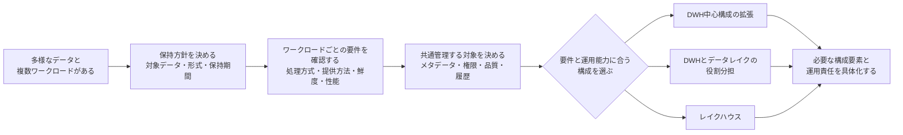
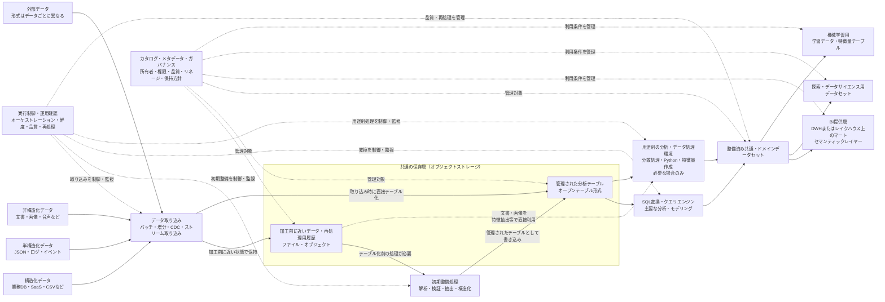
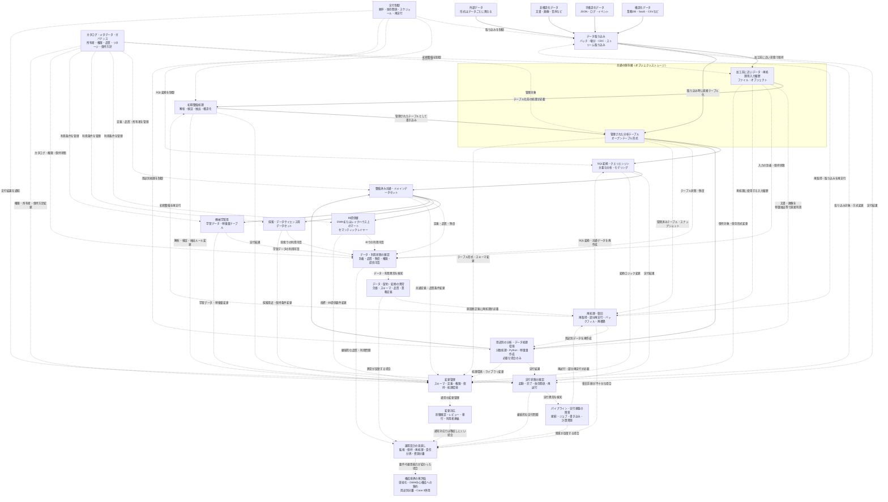

## 5. Case 4：多様なデータと複数ワークロードを扱う共通データ基盤

### 5.1 組織条件と要件

#### 対象とするパイプライン

Case 4では、構造化データだけでなく、JSON、ログ、文書、画像などの半構造化・非構造化データを保持し、ビジネスインテリジェンス（Business Intelligence: BI）、探索的分析、データサイエンス、機械学習など、性質の異なる複数のワークロードへ提供する共通データ基盤と、そのデータパイプラインを扱う。

このCaseで重要なのは、単に大量のデータを保存することや、データレイクへファイルを集約することではない。加工前に近いデータや長期履歴を必要な範囲で保持しながら、利用者がデータの意味、品質、所有者、権限、更新履歴を確認でき、用途に応じたデータセットへ整備できる共通データ基盤を構築することである。

このような要件に対しては、DWH中心構成の機能を拡張する方法、DWHとデータレイクを役割分担させる方法、レイクハウスを採用する方法など、複数の構成が考えられる。本Caseでは、最初から特定のアーキテクチャを前提にせず、多様なデータと複数ワークロードを共通管理するために必要な能力を整理し、その構成候補の一つとしてレイクハウスを扱う。

レイクハウスは、オープンなデータ形式へ直接アクセスできるデータレイクの柔軟性を保ちながら、データウェアハウス（data warehouse: DWH）に近いデータ管理機能と性能を加え、BIだけでなくデータサイエンスや機械学習も支えることを目指すアーキテクチャとして提案されている。[11]

ただし、本資料では、レイクハウスをすべてのデータと処理を一つの製品や一つの物理的な保存先へ統合する構成とは定義しない。共通の保存・管理基盤を持ちながら、BI用データマート、探索用データセット、機械学習用データなど、利用目的に応じた表現や提供先を分ける構成も含めて考える。

Case 2との違いは、単にデータ量や利用部門が増えることではない。Case 2では、主に構造化データをDWH上で整備し、複数部門の定型レポート、部門別分析、部門横断指標へ提供するバッチ中心の構成を扱った。Case 4では、構造化データ中心のDWH分析に限らず、データ形式、保存期間、処理方法、利用ワークロードが多様であり、それらを共通のガバナンスの下で管理する必要がある条件を扱う。

また、Case 3との主な違いは、低レイテンシで変更やイベントを届けること自体を中心要件とするのか、多様なデータと長期履歴を複数ワークロードで再利用・管理することを中心要件とするのかにある。Case 3では、確定した変更や業務イベントをアプリケーション、アラート、運用処理へ短い時間で届けることを中心にした。Case 4では、バッチ、増分取り込み、変更データキャプチャ（Change Data Capture: CDC）、ストリーム取り込みなど複数の取り込み方式を利用し得るが、中心となる要件は、多様なデータと長期履歴を複数ワークロードで再利用できるように管理することである。

#### 対象とする組織・利用者

このCaseでいう組織も、会社全体や大規模企業だけを指すものではない。小規模または中規模の組織であっても、構造化データだけでなくログ、文書、画像などを扱い、同じデータをBI、探索的分析、データサイエンス、機械学習へ提供する必要があれば、Case 4に近い条件を持つ場合がある。

反対に、大規模な組織であっても、対象パイプラインが構造化データを用いた定型レポートや部門別分析に限定され、DWH上で必要な処理を完結できるなら、Case 1またはCase 2に近い構成の方が適切な場合がある。

想定する利用者や関係者には、データアナリスト、アナリティクスエンジニア、データエンジニア、データサイエンティスト、機械学習エンジニア、BI利用者、業務部門のデータ所有者、セキュリティ・ガバナンス担当者、基盤運用担当者などが含まれる。

ただし、これらの役割ごとに独立した専門チームが存在することを前提にはしない。小規模な組織では、一人または少人数の担当者が複数の役割を兼任する場合がある。重要なのはチームの人数ではなく、次のような責任を継続的に扱えるかである。

- データの意味、所有者、利用条件を管理する
- データ品質とスキーマ変更を確認する
- 利用者、役割、データ区分に応じたアクセス権限を管理する
- 保存期間、削除、再処理の方針を決める
- 複数ワークロード間の優先順位とコストを調整する
- 障害や変更が、どのデータセットや利用者へ影響するかを確認する

複数の利用者が同じ保存基盤を利用していても、それだけで共通データ基盤として機能するわけではない。誰がデータの意味と品質に責任を持つのか、どのデータをどの目的で利用できるのか、どのデータセットを信頼して参照すべきかが不明確であれば、利用者ごとに異なるコピーや変換が増え、同じデータから異なる結果が作られる可能性がある。

そのため、Case 4では、基盤を構築する技術能力だけでなく、複数の利用者とワークロードにまたがるデータ所有、アクセス制御、品質管理、変更管理を継続できる組織能力も要件となる。

#### データ条件と運用上の制約

Case 4では、業務データベースやSaaSから取得する構造化データに加えて、JSONや一部のアプリケーションログ・イベントなどの半構造化データ、文書や画像などの非構造化データ、外部データを扱うことを想定する。

これらのデータを、すべて同じ形式や同じテーブル構造へ変換することを前提にはしない。文書や画像はオブジェクトとして保持し、検索や分析に必要なメタデータ、抽出結果、分類結果を別のテーブルで管理する場合がある。イベントやJSONは、加工前に近い形式を保持しながら、分析や機械学習で利用する項目を構造化する場合がある。

データ形式が多様になると、保存できるかどうかだけでは不十分になる。利用者がデータを発見し、意味を理解し、安全に利用するために、少なくとも次の情報を管理する必要がある。

- データの所在と形式
- データの意味と所有者
- スキーマと更新履歴
- データ品質と鮮度
- アクセス権限と機密区分
- 上流・下流の依存関係
- 保存期間と削除条件
- 利用可能な目的と提供先

また、Case 4では、加工前に近いデータや長期履歴を保持し、変換ロジックの変更、過去データの訂正、新しい分析要件などに応じて再処理できることが重要になる。

ただし、すべてのデータを無期限に保存することを前提にはしない。保持期間は、再処理、監査、分析、機械学習などの利用目的だけでなく、個人情報や機密情報の管理、法令・契約上の制約、保存費用、削除要求も含めて決める必要がある。

複数ワークロードは、同じデータを使っていても、処理特性が異なる。

BIや定型レポートでは、安定したスキーマ、合意された指標、予測可能な応答時間が重要になる。探索的分析では、まだ整備されていないデータを柔軟に結合し、仮説を検証できることが求められる。データサイエンスや機械学習では、必要に応じた大規模なデータ読み取り、データの抽出・変換、反復的な実験、使用した入力データの追跡が必要になる場合がある。

特に機械学習では、学習アルゴリズムだけでなく、入力データの理解、検証・クリーニング、準備が重要なデータ管理上の課題として整理されている。[12] 本Caseでは、その設計上の含意として、どのデータ、期間、スキーマ、変換条件を使って学習用データを作成したかを追跡し、必要に応じて再作成できることを要件として扱う。

ただし、BI、探索的分析、データサイエンス、機械学習という複数のワークロードが存在するだけで、それぞれに独立した処理基盤を用意する必要があるわけではない。SQLによる変換・分析、データ抽出、特徴量作成、比較的単純な機械学習、バッチ推論までを、DWHや統合データプラットフォームを中心に実行できる場合もある。

一方で、深層学習やGPUを使う処理、独自ライブラリを用いた大規模計算、状態を持つストリーム処理、低レイテンシのオンライン推論など、一つの主要基盤では要件を満たしにくい処理がある場合は、専用の処理エンジンや実行環境を組み合わせる。複数エンジンの採用は、ワークロードの種類が複数あること自体ではなく、性能、処理方式、ライブラリ、レイテンシ、ワークロード分離などの具体的な要件から判断する。

データ鮮度も、基盤全体で一律に定めるとは限らない。例えば、経営レポートは日次更新で足りる一方、プロダクトログは数分ごとに取り込み、機械学習用データは日次または週次で更新する場合がある。そのため、Case 4では、すべてをリアルタイム化するのではなく、データと利用目的ごとに、バッチ、増分処理、マイクロバッチ、CDC、ストリーム取り込みを使い分ける。

運用上は、保存容量だけでなく、処理に使用するコンピュート、複数ワークロード間のリソース競合、データの重複、カタログやメタデータの更新、アクセス権限、スキーマ変更、再処理時間を管理する必要がある。

また、共通基盤へデータを集約するほど、設定ミスや過剰な権限によって機密データが不要な利用者へ広がる影響も大きくなる。そのため、データを集約することと、すべての利用者へ一律に公開することを区別し、データセット、列、行、利用者の役割などに応じてアクセス範囲を設計し、あわせて利用目的に関するルールを定める必要がある。

#### Case 4での前提

Case 4では、次のような前提を置く。

| 評価軸 | Case 4での前提 |
|---|---|
| 目的と利用者 | BI、探索的分析、データサイエンス、機械学習など、性質の異なる複数ワークロードへデータを提供する |
| データの特性 | 構造化、半構造化、非構造化データを扱い、加工前に近いデータと長期履歴を必要な範囲で保持する |
| 鮮度と処理方式 | データと利用目的に応じて、バッチ、増分処理、マイクロバッチ、CDC、ストリーム取り込みなどを使い分ける |
| 信頼性と再処理 | 保存済みデータから過去期間を再処理し、分析や学習に使用したデータの範囲、取得時点、スキーマ、変換条件を追跡できることが重要になる |
| 組織体制と運用 | 基盤運用者、データ所有者、各ワークロードの担当者が、品質、スキーマ、権限、再処理、コストを調整できる体制が必要になる |
| ガバナンスとコスト | カタログ、メタデータ、権限、リネージ、保持・削除方針を管理し、ストレージ、コンピュート、運用負荷を含めて評価する |

#### 適用範囲と境界

このCaseでは、多様なデータ、長期履歴、複数ワークロード、再現性、共通ガバナンスといった条件が複数重なり、それらを横断して管理する必要性が高まった場合に、共通データ基盤の構成を検討する。候補には、DWH中心構成の拡張、DWHとデータレイクの役割分担、レイクハウスなどがあり、要件と運用能力に応じて選択する。

したがって、次の条件だけでは、レイクハウスを採用する十分な理由にはならない。

- データ量が多い
- 将来データが増える可能性がある
- 機械学習を一部で利用している
- 非構造化データが少量存在する
- データレイクまたはオブジェクトストレージをすでに使用している
- 新しいアーキテクチャや製品を導入したい

構造化データが中心で、SQLによる変換、BI、定型分析、アドホック分析、一部の機械学習向けデータ作成までDWH上で実行できる場合は、DWH中心構成の方が単純で適切な可能性がある。レイクハウスを採用すると、オープンなデータ形式で管理された保存層を、用途に応じて複数の処理エンジンから利用しやすくなる可能性がある。一方で、テーブル管理、メタデータ、権限、性能最適化、エンジン間の互換性、複数ワークロードの調整など、追加の運用対象も生じる。

また、オブジェクトストレージへデータを保存しただけでは、レイクハウスにはならない。オープンテーブル形式（open table format: OTF）を導入しただけでも、カタログ、権限、品質、リネージ、処理、運用体制がなければ、ガバナンスされた共通基盤として成立するとは限らない。

DWHとデータレイクを併用する構成も、必ずしもレイクハウスではない。本資料では、DWHとデータレイクを併用しているという外形や製品名だけでレイクハウスと分類しない。保存層、テーブルと履歴の管理、権限、メタデータ、処理エンジンがどのように組み合わされているかを確認し、構成全体として評価する。

構造化された分析用データや定型レポートはDWHで管理し、加工前に近いデータ、半構造化・非構造化データ、長期履歴はデータレイクで保持するように、両者を役割分担させる構成も考えられる。この構成では、既存のDWHを維持しながら扱えるデータの範囲を広げられる一方で、DWHとデータレイク間のデータ移動、メタデータと権限の重複、データの整合性、複数基盤のコストと運用責任を管理する必要がある。

Case 3とCase 4は排他的ではない。低レイテンシでイベントを処理し、その履歴を長期保存してBI、探索的分析、機械学習、監査へ利用する場合は、Case 3に近い低レイテンシ経路と、Case 4に近い分析・保存基盤を併用する構成が考えられる。

また、Case 4は、機械学習運用（Machine Learning Operations: MLOps）全体を扱うものではない。学習データや特徴量の作成、履歴保持、データ品質、再現性は共通データ基盤上のデータパイプラインと関係するが、モデルレジストリ、モデルのデプロイ、オンライン推論、モデル監視、ドリフト検知、再学習判断などは、別途設計が必要な領域である。

したがって、Case 4の要件に対応するために追加する機能や複雑性は、Case 1〜3より高度な構成を目指すためのものではない。多様なデータを長期的に保持し、複数の利用者とワークロードで安全に再利用し、データの意味、品質、権限、履歴を共通管理する必要がある場合に、その要件に合う共通データ基盤の構成を検討する。レイクハウスは、その構成候補の一つとして位置づける。

対象データや利用ワークロードを限定できる場合は、既存基盤の拡張や責任範囲を限定した用途別基盤によって、より単純に要件を満たせる可能性もある。

次節では、ここで整理した要件に対して、DWH中心構成の拡張、DWHとデータレイクの役割分担、レイクハウスなどの選択肢を比較する。そのうえで、選択する構成に応じて、保存層、テーブル管理、処理エンジン、カタログ、権限管理、用途別データセットをどのように組み合わせるかを、共通データ基盤の構成と設計判断として確認する。

---

### 5.2 構成と設計判断

#### 構成方針

Case 4では、構造化データ、半構造化データ、非構造化データを必要な範囲で保持し、ビジネスインテリジェンス（Business Intelligence: BI）、探索的分析、データサイエンス、機械学習など、性質の異なる複数のワークロードへ提供する共通データ基盤を扱う。

この条件に対して、最初からレイクハウスを採用すると決めるわけではない。構造化データとSQL中心の処理で要件を満たせる場合は、既存のデータウェアハウス（data warehouse: DWH）の機能を拡張する構成が候補になる。加工前に近いデータ、長期履歴、文書、画像などをDWHとは別に保持したい場合は、DWHとデータレイクを役割分担させる構成も考えられる。オープンな保存層を中心に、複数ワークロードから共通データを利用し、テーブル、履歴、メタデータ、権限を一体的に管理したい場合は、レイクハウスが候補になる。

したがって、Case 4では、次の順序で構成を検討する。

**図5-1：** 多様なデータと複数ワークロードを扱う共通データ基盤の構成を検討する流れ。保存方式や製品を先に決めるのではなく、保持対象、ワークロード要件、共通管理する範囲を確認したうえで、DWH中心構成の拡張、DWHとデータレイクの役割分担、レイクハウスなどから、要件と運用能力に合う構成を選択する。

重要なのは、保存先や製品を先に決めることではない。何を共通管理し、何をワークロードごとに分けるのかを明確にしたうえで、必要な構成要素だけを追加することである。

#### 構成候補の比較

Case 4の要件に対する代表的な構成候補は、次のように整理できる。

| 構成候補 | 適しやすい条件 | 主な設計方針 | 主な負担・制約 |
|---|---|---|---|
| DWH中心構成の拡張 | 構造化データが中心で、半構造化データ、探索的分析、特徴量作成などもDWHと周辺機能で扱える | 保存、SQL変換、BI、データ抽出、一部の機械学習向け処理を主要DWHへ集約する | DWHが対応しにくいデータ形式、ライブラリ、処理方式、長期履歴の扱いには制約が残る |
| DWHとデータレイクの役割分担 | BIと定型分析は既存DWHで安定運用しつつ、加工前に近いデータ、半構造化・非構造化データ、長期履歴を別に保持したい | DWHを整備済み構造化データとBIの提供先、データレイクを多様なデータと履歴の保存先として分ける | 基盤間のデータ移動や複製、メタデータと権限の重複、データ整合性、責任分界を管理する必要がある |
| レイクハウス中心構成 | オープンな保存層を中心に、長期履歴と管理された分析テーブルを保持し、複数ワークロードから共通利用したい | オブジェクトストレージ、オープンテーブル形式、カタログ、処理エンジン、権限・品質管理を組み合わせる | テーブル保守、メタデータ、性能最適化、エンジン間の互換性、複数ワークロードの調整が運用対象になる |

これらは排他的な分類ではない。例えば、レイクハウスを共通の保存・履歴管理基盤として利用しながら、安定したSQL性能、同時実行、指標管理、既存BIとの接続を担う分析・提供基盤としてDWHを併用する場合がある。反対に、DWH中心構成の一部でオブジェクトストレージやオープンなファイル形式を利用していても、構成全体を必ずレイクハウスと呼ぶわけではない。

本節では、三つの候補のうち、Case 4の要件が強く現れる例として、レイクハウスを中心にしつつ、必要に応じてDWHや用途別の実行環境を組み合わせる構成を示す。これはCase 4の標準構成や唯一解ではない。

#### 構成例

このCaseの構成例は、次のように整理できる。

**図5-2：** Case 4における共通データ基盤の一例。構造化、半構造化、非構造化データを共通の保存層へ取り込み、加工前に近いデータとして保持するか、取り込み時に管理された分析テーブルとして書き込む。必要に応じて解析、検証、抽出、構造化を行い、カタログ、メタデータ、権限、品質、リネージ、保持方針を横断的に管理する。整備済みデータセットから、BI、探索的分析、データサイエンス、機械学習向けの表現を派生させる。

図中の「管理された分析テーブル」「整備済み共通・ドメインデータセット」「探索・データサイエンス用データセット」「機械学習用の学習データ・特徴量テーブル」は、データの整備段階と利用目的を区別するための論理的な層であり、必ずしも別々の物理保存先を意味しない。レイクハウス中心構成では、これらを同じオブジェクトストレージ上のオープンテーブル形式のテーブルとして実装する場合がある。BI提供層についても、レイクハウス上に配置する場合と、別のDWHへ提供する場合がある。

初期整備処理は、加工前に近いデータを、管理された分析テーブルとして扱える状態へ変換する段階である。JSONやログの解析、スキーマ検証、データ型の正規化、不正レコードの隔離、重複処理、文書や画像からの属性抽出などが含まれる。入力時に必要な検証を行い、直接オープンテーブル形式のテーブルへ安全に書き込める場合は、この段階を独立させる必要はない。

この初期整備処理は、業務定義に基づく結合、集計、データモデリングを行うSQL変換や、探索、特徴量作成などの用途別処理とは責任が異なる。

なお、この構成でも、すべてのデータをオープンテーブル形式へ変換する必要はない。文書や画像はオブジェクトとして保持し、ファイルの識別子、取得元、取得時刻、機密区分、抽出結果などを管理テーブルへ保存する場合がある。

文書や画像などの非構造化データでは、データ本体を加工前領域に保持したまま、用途別の分析・データ処理環境がオブジェクトを直接読み取る場合もある。この場合も、対象ファイルの識別子、保存場所、取得時点、権限、抽出結果などは、管理されたテーブルやカタログから追跡できるようにする。

また、図中の用途別の分析・データ処理環境は必須ではない。SQL変換、探索、学習データ作成などを一つの主要な処理基盤で実行できる場合は、処理環境を分けない方が、権限、監視、コスト、障害対応を単純に保ちやすい。主要基盤では満たしにくい言語、ライブラリ、性能、レイテンシ、ワークロード分離の要件がある場合に限り、専用の処理エンジンや実行環境を追加する。

#### 主要コンポーネントの役割

データ取り込み層では、業務データベース、SaaS、ファイル、ログ、イベント、文書、画像、外部データなどを共通の保存層へ取り込む。取り込み方式は一つに統一せず、データと利用目的に応じて、バッチ、増分取り込み、変更データキャプチャ（Change Data Capture: CDC）、ストリーム取り込みを使い分ける。

取り込み時には、データ本体だけでなく、取得元、取得時刻、対象期間、スキーマ、ファイル名、イベント識別子など、後からデータの由来と処理範囲を確認するための情報も保持する。これにより、同じデータを再取得した場合や、過去期間を再処理する場合に、どの入力を使用したかを確認しやすくなる。

共通の保存層には、構造化、半構造化、非構造化データを保持できるオブジェクトストレージを利用する構成が候補になる。ここでは、再処理に使用する加工前に近いデータや入力履歴を保持する領域と、スキーマ、データファイル、スナップショットなどを分析テーブルとして管理する領域を区別する。これらは、顧客や契約などの業務状態の変化を表す履歴モデルとは別のものである。

加工前に近いデータを保持する目的は、すべてのデータを無期限に保存することではない。上流データの訂正、変換ロジックの変更、新しい分析要件、監査、パイプライン障害からの再処理などに応じて、必要な範囲を再処理できるようにすることである。保存期間は、再処理要件、法令・契約、個人情報や機密情報、削除要求、保存コストを踏まえて決める。

オープンテーブル形式（open table format: OTF）は、オブジェクトストレージ上のデータファイルを、スキーマ、ファイル一覧、スナップショット、履歴などを持つ分析テーブルとして管理するために利用する。例えばApache Icebergでは、テーブルメタデータによってスキーマ、パーティション設定、データファイル、スナップショットを管理し、特定時点のテーブル状態を参照できる仕組みを定めている。[13]

ただし、オープンテーブル形式を導入しただけでは、共通データ基盤は完成しない。どのテーブルが存在するか、誰が所有するか、どの利用者が参照できるか、どのデータが信頼できるかを管理するために、カタログ、メタデータ管理、アクセス制御、品質管理、リネージ、保持・削除方針を組み合わせる必要がある。

カタログは、テーブルやファイルの名前を登録するだけの仕組みではない。利用者がデータを発見し、意味、所有者、スキーマ、品質、更新状況、利用条件を確認するための入口として位置づける。ただし、カタログへ項目を登録しただけで情報が正確に保たれるわけではない。所有者、更新手順、変更時の確認責任を決める必要がある。

処理エンジンは、共通の保存層にあるデータを読み取り、検証、変換、集約、特徴量作成などを行う。SQLによる変換と分析を主要な処理方式にしながら、必要に応じて分散バッチ処理、Pythonによる分析、機械学習向けの実行環境などを組み合わせる。

複数の処理エンジンを利用する場合は、同じテーブル形式を読めることだけで判断しない。読み取りと書き込みの対応範囲、スキーマ変更、データ型、削除・更新、トランザクション、カタログ連携、権限、性能最適化などについて、利用するエンジン間で互換性を確認する必要がある。

整備済み共通・ドメインデータセットは、加工前に近いデータを利用者へ直接公開するのではなく、業務上の意味、品質、粒度、所有者を明確にした状態で提供するための層である。顧客、商品、契約、注文、利用状況など、複数ワークロードで共有するデータを整備し、その上からBI用データマート、探索用データセット、機械学習用データを派生させる。

DWHは、レイクハウスを採用した場合でも不要になるとは限らない。安定したSQL性能、既存BIとの接続、指標管理、同時実行、利用者向けの操作性などを重視し、整備済みデータセットの一部をDWHへ提供する場合がある。この場合、共通の保存・管理基盤と、BI向けの提供・実行基盤を役割分担させる。

オーケストレーション、データ品質検査、データ鮮度監視、リネージ、再処理は、個別の保存層や処理エンジンだけに閉じない横断的な機能である。複数の取り込み方式と処理環境を組み合わせる場合は、どのデータが取り込み済みか、どの変換が完了したか、どの出力がどの入力に基づくか、失敗時にどこから再処理するかを追跡できるようにする。

#### 複数ワークロードと共通データ基盤の設計

共通データ基盤を構築する目的は、すべての利用者に同じ物理テーブルを直接使わせることではない。異なるワークロードが必要とするデータの意味、履歴、品質、権限を共通管理しながら、利用目的に応じた表現を提供することである。

BIや定型レポートでは、安定したスキーマ、合意された指標、予測可能な応答時間が重要になる。そのため、整備済みデータセットからBI用データマートやセマンティックレイヤーを作成し、利用者が加工前に近いデータへ直接依存しないようにする。

探索的分析やデータサイエンスでは、仮説に応じて複数のデータを結合し、まだ恒久的なマートとして確定していない項目を試す必要がある。そのため、一定の自由度を持つ探索用領域やデータセットを用意しつつ、機密データへのアクセス、計算資源、保存期間、成果物の共有方法を管理する。

機械学習では、学習データや特徴量を作成するだけでなく、どの入力データ、対象期間、スキーマ、変換ロジック、パラメーターを使用したかを追跡する必要がある。テーブルのスナップショットは入力データの状態を特定する手段になり得るが、それだけで学習や分析の完全な再現性が得られるわけではない。変換コード、設定、実行環境、外部入力などもあわせて管理する必要がある。

同じ項目をBI用マート、探索用データセット、機械学習用テーブルへ派生させる場合、必要な複製まで禁止するものではない。重要なのは、どのデータセットから派生したのか、どの定義が共通で、どこから用途固有の変換が加わったのかを追跡できることである。

複数の処理エンジンも、ワークロードが複数あるという理由だけで導入しない。主要な処理基盤でSQL変換、探索、学習データ作成まで実行できる場合は、そこへ集約する方が運用を単純にしやすい。一方で、深層学習やGPU処理、独自ライブラリを用いた計算、状態を持つストリーム処理、低レイテンシのオンライン推論など、主要基盤で要件を満たしにくい処理がある場合は、専用環境へ分離する。

ただし、オンライン推論、モデルレジストリ、モデル監視、ドリフト検知、再学習判断など、機械学習運用（Machine Learning Operations: MLOps）全体の設計は、本Caseの対象外である。本Caseでは、それらの処理へ信頼できる入力データを提供するところまでを中心に扱う。

また、複数ワークロードが同じ保存層と計算資源を利用する場合、BIクエリ、長時間の変換、探索処理、機械学習向け処理が互いに影響する可能性がある。必要に応じて、処理エンジンを増やす前に、計算資源、実行キュー、優先度、同時実行数、予算上限などをワークロードごとに分ける方法を検討する。

#### 要件と設計判断の対応

このCaseにおける主な要件、必要な能力、設計判断、受け入れるトレードオフは、次のように対応づけられる。

| 要件・制約 | 必要な能力 | 設計判断 | 受け入れるトレードオフ |
|---|---|---|---|
| 構造化、半構造化、非構造化データを扱う | 形式を過度に統一せず、データ本体とメタデータを保持する | 必要に応じてオブジェクトストレージを共通の保存層にし、ファイル・オブジェクトと管理テーブルを組み合わせる | データを保存するだけでは利用可能にならず、カタログ、権限、品質、形式ごとの処理を管理する必要がある |
| 加工前に近いデータや再処理用の入力履歴を利用したい | 入力データの由来、対象期間、取得時点、スキーマを追跡し、必要な範囲を再処理する | 保存領域と保持期間を定め、加工前に近い入力データと処理済みデータを区別して管理する | 保存コスト、機密データ管理、削除要求、スキーマ変更への対応が増える |
| オブジェクトストレージ上のデータを分析テーブルとして管理したい | スキーマ、ファイル一覧、履歴、更新をテーブル単位で管理する | 要件に合う場合はオープンテーブル形式を採用し、カタログと処理エンジンを接続する | テーブル形式とエンジン間の互換性、メタデータ保守、ファイル最適化が運用対象になる |
| BI、探索的分析、データサイエンス、機械学習へ共通データを提供したい | 共通の意味と品質を維持しながら、用途別の粒度と形式へ派生させる | 整備済み共通・ドメインデータセットを設け、その上からBI用マート、探索用データセット、学習データ・特徴量テーブルを作る | 用途別データセットの複製、定義同期、変更影響の確認が必要になる |
| BI向けに安定した性能と既存の利用方法を維持したい | 安定したスキーマ、指標、同時実行、BI接続を提供する | BI用マートの配置先をレイクハウスまたはDWHから選び、必要に応じてセマンティックレイヤーを設ける。既存環境や性能要件によっては、BI提供用のDWHを別途併用する | 外部DWHを併用する場合は、共通保存層とのデータ移動、鮮度差、重複、コストを管理する必要がある |
| データサイエンスや機械学習で専用ライブラリや計算資源が必要になる | 主要基盤で不足する処理だけを別の実行環境で実行する | 主要なSQL処理基盤を中心にし、必要な場合のみ分散処理、Python、GPUなどの実行環境を追加する | 実行環境、依存ライブラリ、権限、コスト、データ受け渡し、再現性の管理対象が増える |
| 分析や学習に使用したデータを再現したい | 入力データ、対象期間、スキーマ、変換条件を追跡する | スナップショットや履歴に加えて、変換コード、設定、実行情報を記録する | 履歴と実行情報の保持、追跡、再現手順の整備が必要になる |
| 複数ワークロードを共通ガバナンスの下で利用したい | 所有者、意味、権限、品質、リネージ、保持・削除方針を横断管理する | 共通のカタログ、メタデータ、アクセス制御、品質管理、リネージを設計する | 管理項目を継続更新する責任と、複数チーム間の合意形成が必要になる |
| データごとに必要な鮮度が異なる | バッチ、増分、CDC、ストリームを用途に応じて使い分ける | すべてをリアルタイム化せず、データセットごとに更新方式と更新期限を定める | 複数の取り込み経路、鮮度、再処理方法を個別に管理する必要がある |

この対応表で重要なのは、Case 4に該当するからといって、すべてのデータをオブジェクトストレージへ移し、複数の処理エンジンとオープンテーブル形式を導入することではない。DWHで満たせるワークロードはDWHへ残し、長期履歴、多様なデータ形式、再現性、専用処理など、既存構成では満たしにくい要件に対してだけ新しい構成要素を追加する。

#### この構成で得られるものと限界

この構成で得られる主な利点は、構造化、半構造化、非構造化データを、利用目的に応じた形式で保持しながら、複数ワークロードへ提供できることである。加工前に近いデータや再処理用の入力履歴を必要な範囲で保持すれば、上流データの訂正、変換ロジックの変更、新しい分析要件に応じて、過去データを再処理しやすくなる。

また、共通のカタログ、メタデータ、権限、品質、リネージを整備することで、管理されていないデータコピーの増加を抑え、どのデータをどの目的で利用すべきかを確認しやすくなる。レイクハウス中心構成では、オープンな保存層の管理された分析テーブルを複数の処理エンジンから利用することで、DWH、データサイエンス、機械学習ごとに完全に独立したデータコピーを持つ必要を減らせる場合がある。[11] ただし、複製そのものをなくすことが目的ではなく、用途別データセットを意図的に作成し、その由来と責任範囲を管理することが重要である。

一方で、この構成は、データを一つの論理的な保存層へ集約するだけで成立するものではない。カタログ、権限、品質、リネージ、テーブル管理、保持・削除、性能最適化、エンジン間の互換性、ワークロード間の資源調整を継続的に運用する必要がある。

特に、オブジェクトストレージ上のテーブルでは、データ更新によって多数の小さなファイルやメタデータが増え、読み取り性能や管理負荷へ影響する場合がある。ファイルの統合、不要なスナップショットやファイルの整理、パーティションやデータ配置の見直しなどは、保存層を用意した後も継続して必要になる可能性がある。

また、複数の処理エンジンが同じ形式へ対応していても、すべての機能と動作が完全に一致するとは限らない。利用する更新方式、データ型、スキーマ変更、削除、カタログ、権限について、実際の組み合わせで検証する必要がある。

オブジェクトストレージとオープンテーブル形式によって保存と処理を分離しても、可用性や別エンジンへの切り替えが自動的に得られるわけではない。カタログ、権限、ネットワーク、リージョン、機能互換性も依存先になるため、障害時の代替経路は事前に設計・検証する必要がある。

共通データ基盤は、データの意味や所有者を自動的に統一するものでもない。どのデータセットを信頼して参照すべきか、指標や特徴量の定義を誰が承認するか、品質異常やスキーマ変更に誰が対応するかは、組織的な責任として別途定める必要がある。

したがって、この構成の適否は、扱えるデータ形式や機能の多さだけでは判断できない。DWH中心構成の拡張で十分な場合は、その方が単純で保守しやすい可能性がある。DWHとデータレイクを役割分担させる場合も、既存資産を活かせる一方で、二つの基盤の同期と責任分界を受け入れる必要がある。レイクハウスを採用する場合も、追加される柔軟性が、テーブル管理、ガバナンス、性能、運用の負担に見合うかを確認する必要がある。

次節では、この共通データ基盤を継続運用するうえで確認すべき項目、複数ワークロード間のトレードオフ、所有責任とガバナンス、構成を見直す変更トリガーを整理する。

---

### 5.3 運用、トレードオフ、変更トリガー

#### 運用方針

Case 4の運用では、パイプラインの処理が実行・完了していることと、必要なデータが必要な形、品質、鮮度で各ワークロードから利用可能になっていることを分けて確認する必要がある。

加工前に近いデータが保存されていても、初期整備処理や管理された分析テーブルへの反映が完了しているとは限らない。また、共通データセットが更新されていても、BI、探索、機械学習向けの各データセットが、それぞれの利用要件を満たしているとは限らない。

そのため、このCaseでは、次の状態を分けて確認する。

- 必要な入力データが到着し、加工前に近い状態で保持されているか
- 初期整備処理が完了し、管理された分析テーブルへ反映されているか
- 共通・ドメインデータセットが期待される定義と品質で更新されているか
- BI、探索、データサイエンス、機械学習向けのデータが、それぞれの期限までに利用可能になっているか
- カタログ、権限、リネージ、保持・削除方針が実際のデータと一致しているか
- 障害やロジック変更が発生した場合に、必要な入力と実行条件を使って再処理できるか
- 複数ワークロードの実行が互いの性能やコストへ過度な影響を与えていないか

すべてのデータセットを同じ基準で運用する必要はない。BI用マートでは、安定した更新時刻、指標定義、同時実行性能が重要になる。一方、探索用データセットでは、一定の自由度を許容しつつ、アクセス範囲、保存期間、計算資源を管理する必要がある。機械学習用データでは、入力データ、対象期間、変換ロジック、特徴量定義を追跡できることが重要になる。

したがって、Case 4の運用方針は、すべての処理を一つの運用基準へ統一することではない。保存、メタデータ、権限、品質、履歴などの共通管理と、ワークロードごとの鮮度、性能、提供形式、実行環境を分け、それぞれの責任者と確認方法を定めることである。

#### 確認すべき運用項目

Case 4では、日常運用で次の項目を確認する。

| 運用項目 | 確認すること | 放置した場合のリスク |
|---|---|---|
| 上流データと取り込み | 必要なデータが到着しているか、取り込みが失敗・遅延していないか、取得対象やスキーマが変わっていないか | 加工前データが欠け、下流のテーブルや用途別データセットを正しく作成できない |
| 加工前データと入力履歴 | 再処理に必要なデータ、取得時刻、対象期間、取得元、スキーマが保持されているか | ロジック変更や障害後に、過去データを再構築できない |
| 初期整備処理 | 解析、検証、抽出、構造化、不正レコードの隔離が完了しているか | 不正な形式や不完全なデータが管理された分析テーブルへ混入する |
| 管理された分析テーブル | テーブルへの書き込み、スナップショット、スキーマ、更新・削除が期待どおり管理されているか | テーブル状態が不整合になり、処理エンジンごとに異なる結果が参照される |
| カタログとメタデータ | テーブル、所有者、説明、機密区分、更新状況、利用条件が実際の状態と一致しているか | 利用者が誤ったデータを選択し、所有者や問い合わせ先も特定できない |
| 共通・ドメインデータセット | 業務定義、粒度、品質条件、更新時刻が合意された状態を保っているか | BI、探索、機械学習で同じ概念に異なる定義が使われる |
| 用途別データセット | BI、探索、機械学習向けデータが、それぞれの利用目的と期限に合っているか | 古いデータ、誤った粒度、用途に合わないデータが利用される |
| データ品質とリネージ | 主要な品質条件を満たし、入力から利用先までの由来と変更影響を追跡できるか | 問題の原因や影響範囲を説明できず、復旧や利用者連絡が遅れる |
| テーブルとファイルの保守 | 小さなファイル、不要なスナップショット、メタデータ、データ配置が性能やコストへ影響していないか | 読み取り性能が低下し、保存・処理コストや保守負荷が増える |
| ワークロードと計算資源 | BI、変換、探索、機械学習向け処理が互いに過度な影響を与えていないか | 重要なクエリや更新処理が遅延し、予算も予測しにくくなる |
| 権限と利用状況 | 利用者や処理が必要なデータだけへアクセスし、機密データの利用を追跡できるか | 過剰な権限、目的外利用、データ漏えい、監査不能が発生する |
| 保持・削除 | データの保持期間、削除要求、法令・契約上の制約が保存先と派生データへ反映されているか | 不要なデータを保持し続ける、必要な再処理用データを早期に削除する、または法令・契約上の保持・削除要件に違反する |
| コスト | 保存、取り込み、変換、クエリ、用途別処理、データ移動の費用が想定範囲に収まっているか | 利用されていないデータや処理を維持し、継続運用が難しくなる |
| 通知と利用者連絡 | どの異常を誰へ通知し、どのデータセットが利用可能かを利用者へ説明できるか | 利用者が古いデータや不完全なデータを、正常なデータとして利用する |

すべての項目を最初から同じ粒度で自動監視する必要はない。業務判断、外部提供、機械学習処理などへの影響が大きいデータセットから、期待更新時刻、品質条件、障害時の連絡先、復旧方法を定める。

また、基盤全体の障害と、一部のデータセットだけの遅延を同じ重大度で扱うべきではない。どの利用者とワークロードへ、どの程度の影響が出るかを基に優先度を決める必要がある。探索用データセットの一時的な遅延を許容できても、経営指標や外部向けレポート、日次の学習処理に必要なデータの欠損は、より優先して対応すべき場合がある。

#### 主要なトレードオフ

Case 4では、多様なデータと複数ワークロードを共通管理しやすくなる一方で、保存、テーブル、メタデータ、処理エンジン、用途別データセットの管理対象が増える。

第一に、再処理可能性と保存負担のトレードオフがある。加工前に近いデータや入力履歴を保持すれば、上流訂正やロジック変更後の再処理を行いやすくなる。一方で、保存コスト、機密情報、削除要求、スキーマ変化を管理しなければならない。

第二に、共通化とワークロード分離のトレードオフがある。共通・ドメインデータセットを整備すれば、BI、探索、機械学習で意味と品質を共有しやすくなる。一方、各用途で必要な粒度、更新頻度、性能をすべて一つのデータセットへ押し込むと、変更調整が難しくなる。共通化する定義と、用途ごとに派生させる部分を分ける必要がある。

第三に、複数エンジンから利用できる柔軟性と、互換性管理のトレードオフがある。オープンテーブル形式を採用しても、すべての処理エンジンが、読み取り、書き込み、更新、削除、データ型、カタログ、権限について同じ範囲へ対応するとは限らない。そのため、利用するエンジンと機能の組み合わせを事前に検証し、必要に応じて書き込みを担当するエンジンや利用可能な機能を限定する。

第四に、処理環境の集約と分離のトレードオフがある。SQL変換、探索、学習データ作成を一つの主要基盤へ集約すれば、権限、監視、運用を単純にしやすい。一方、専用ライブラリ、GPU、大規模分散処理、状態を持つストリーム処理などが必要な場合は、用途別環境を追加する理由が生じる。

主なトレードオフは次のように整理できる。

| 設計判断 | 得られる利点 | 受け入れるトレードオフ |
|---|---|---|
| 加工前に近いデータや入力履歴を保持する | 訂正、監査、ロジック変更後の再処理に利用しやすい | 保存コスト、削除要求、機密情報、スキーマ変化を管理する必要がある |
| 共通・ドメインデータセットを整備する | 複数ワークロードで意味、品質、所有者を共有しやすい | 共通定義の変更調整と下流影響の確認が必要になる |
| 用途別データセットを作成する | BI、探索、機械学習ごとの粒度、性能、利用方法へ合わせやすい | 複製、定義のずれ、鮮度差、変更影響を管理する必要がある |
| オープンテーブル形式を利用する | オブジェクトストレージ上のデータを、スキーマや履歴を持つテーブルとして管理しやすい | テーブル保守、カタログ連携、メタデータ管理が必要になる |
| 同じテーブルを複数の処理エンジンから利用する | ワークロードに応じて処理エンジンを選択しやすい | 機能、仕様バージョン、データ型、カタログ、権限の互換性を検証し、書き込み責任を限定する必要がある |
| 主要な処理基盤へ集約する | 権限、監視、コスト、障害対応を一元化しやすい | 基盤が対応しにくい処理方式、ライブラリ、性能要件には制約が残る |
| 用途別の処理環境を追加する | 主要基盤で満たしにくい処理へ対応できる | 実行環境、依存ライブラリ、権限、データ受け渡し、障害箇所が増える |
| BI提供用にDWHを併用する | 既存BIとの接続、安定したSQL性能、同時実行を維持しやすい | 基盤間の複製、鮮度差、同期、コスト、責任分界が必要になる |

重要なのは、構成要素を増やして技術的な選択肢を広げても、その柔軟性が運用負担に見合うとは限らないことである。実際の要件を主要基盤で満たせない場合に限って、用途別環境や別の提供基盤を追加する。反対に、利用範囲が限定された場合は、処理エンジン、保存対象、用途別データセットを減らす判断も必要になる。

#### 障害対応と再処理

Case 4では、障害を「パイプライン全体が成功したか、失敗したか」だけで扱うと、原因と影響範囲を特定しにくい。パイプラインや実行基盤が正常に動作していることと、必要なデータが期待する形式、意味、品質、鮮度で提供されていることは別に確認する必要がある。

障害発生時には、まずパイプラインと実行基盤の障害か、データ内容、変換ロジック、データ契約の異常かを切り分ける。ただし、一つの事象が両方へ影響する場合もあるため、実行状態とデータ状態を順に確認する。

##### パイプラインと実行基盤の障害

| 障害箇所 | 代表的な問題 | 主な確認 |
|---|---|---|
| 上流との接続・取り込み | 取り込み停止、認証エラー、接続タイムアウト、ジョブ未起動 | 上流の稼働状況、接続設定、認証情報、取り込みログ、最終成功時刻 |
| 保存層への書き込み | ファイル保存失敗、一部書き込み、コミット失敗、容量・権限エラー | 書き込みログ、対象ファイル、コミット状態、保存先権限、再実行可能性 |
| 初期整備処理 | ジョブ停止、解析処理の例外、依存処理の未完了、再試行失敗 | 実行ログ、失敗した処理段階、依存関係、処理済み範囲、再実行範囲 |
| SQL変換・用途別処理 | クエリ失敗、専用環境の停止、依存ライブラリの不整合、計算資源不足 | 実行環境、クエリ・コード、ライブラリ、計算資源、入力と出力の範囲 |
| カタログ・認証・ネットワーク | テーブルを解決できない、認証できない、保存層へ接続できない | カタログ状態、権限、認証経路、ネットワーク、影響する処理エンジンと利用者 |
| 提供経路 | DWHやBIへの同期停止、API・接続先の障害、提供ジョブの遅延 | 提供先の稼働状況、同期ログ、最終更新時刻、利用者からの参照可否 |

##### データ内容、変換、データ契約の異常

| 異常箇所 | 代表的な問題 | 主な確認 |
|---|---|---|
| 上流データ | データ未到着、一部期間の欠損、重複、破損、想定外の値 | 件数、対象期間、取得元、チェックサム、過去傾向、再取得可能性 |
| スキーマ・データ契約 | 列の追加・削除、型変更、必須列の欠損、粒度や更新条件の変更 | 合意したスキーマ、データ型、必須項目、主キー、更新頻度、変更通知の有無 |
| 初期整備 | 不正レコードの混入、型変換の失敗、隔離漏れ、重複排除の誤り | 隔離レコード、変換条件、重複判定、処理前後の件数、適用範囲 |
| 共通・ドメインデータセット | 業務定義の誤り、結合条件の誤り、粒度の不一致、品質検査の失敗 | 入力テーブル、変換ロジック、業務定義、品質条件、影響する下流データセット |
| 用途別データセット | 指標、特徴量、対象期間、集計方法が利用目的と一致しない | 利用目的、派生元、追加変換、鮮度、粒度、利用者との合意内容 |
| 提供データ | データ未更新、鮮度不足、参照先の誤り、権限設定と利用条件の不一致 | 最終更新時刻、提供対象、参照先、権限、利用者、下流処理への影響 |

パイプラインの障害では、失敗した処理を再試行または部分再実行できるかを確認する。データ内容やデータ契約の異常では、単純な再実行では同じ誤りが再現されるため、入力データ、スキーマ、変換ロジック、業務定義のどこを修正するかを先に判断する必要がある。

復旧方法は、パイプラインや実行基盤の障害か、データ内容、変換ロジック、データ契約の異常かによって分けて判断する。

パイプラインや実行基盤の一時的な障害では、保存済みデータと処理済み範囲を確認し、失敗した処理を再試行または部分再実行する。加工前データが正常に残っていれば初期整備以降を、管理された分析テーブルが正常であれば共通・ドメインデータセットや用途別データセットの作成だけを再実行できる場合がある。テーブルへの書き込みやコミット状態に問題がある場合は、利用可能なスナップショットへ戻すか、別のテーブルとして再構築し、検証後に切り替える方法も検討する。

一方、入力データの欠損、データ契約違反、変換ロジックや業務定義の誤りでは、単純に再実行しても同じ問題が再発する。異常な入力を隔離し、上流データ、スキーマ、変換ロジック、業務定義のどこを修正するかを確認したうえで、対象期間を定めて再取得またはバックフィルを行う。修正前のデータをすでに利用者へ提供している場合は、影響するデータセットと利用者を特定し、訂正内容と再提供時刻を連絡する必要がある。

複数ワークロードが同じ共通データセットを利用している場合、一つの再処理がBI、探索、機械学習へ同時に影響する可能性がある。そのため、再処理前には、対象期間、入力データ、適用する変換ロジック、影響する下流データセットと利用者、切替時刻を確認する。再処理中も新しいデータを継続して処理するのか、一時的に更新を止めるのか、旧データと再処理結果をどの時点で切り替えるのかも決める必要がある。

また、加工前データを保持していても、過去の状態を完全に再現できるとは限らない。変換コード、設定、実行環境、外部参照データ、権限、処理エンジンのバージョンが変わっていれば、同じ入力から異なる結果が生じる可能性がある。再処理可能性を重視する場合は、入力データだけでなく、適用したコード、設定、依存関係、実行環境も追跡する必要がある。

#### 複数ワークロードの所有責任とガバナンス

共通データ基盤では、保存場所やカタログを統一しても、データの意味、品質、利用責任が自動的に統一されるわけではない。技術的な基盤運用と、業務上の定義や利用判断を分けて考える必要がある。

例えば、共通基盤の運用担当者は、取り込み、保存、テーブル管理、実行環境、監視を維持できる。しかし、「有効な顧客とは何か」「売上へどの状態を含めるか」「どの特徴量を学習へ使ってよいか」といった判断は、業務部門、データ所有者、分析・機械学習の利用責任者と調整する必要がある。

以下は特定の職種や部署へ固定するものではなく、各組織で誰が担うかを明確にすべき責任範囲を示している。

| 領域 | 主な責任 |
|---|---|
| 上流データと業務上の意味 | データの生成条件、ソース上の項目の意味、訂正、スキーマ変更、業務上の例外を説明する |
| 共通基盤 | 取り込み、保存、カタログ、処理環境、監視、再処理手段を維持する |
| 初期整備と管理テーブル | 解析、検証、スキーマ、隔離処理、テーブル状態を管理する |
| 共通・ドメインデータセット | 分析・利用のための定義、粒度、品質条件、所有者、変更影響を管理する |
| BI向けデータ | 指標、更新期限、マート、セマンティックレイヤー、利用者への説明を管理する |
| 探索・データサイエンス用データ | 利用目的、アクセス範囲、保存期間、成果物の共有方法を管理する |
| 機械学習用データ | 学習対象、特徴量、対象期間、再現性、利用可能なデータ範囲を管理する |
| セキュリティ・保持・監査 | 機密区分、権限、保持・削除、監査、利用ルールを管理する |
| インシデント対応と利用者連絡 | 影響するデータセットとワークロードを特定し、対応優先度、利用可否、復旧状況を関係者へ伝える |

共通・ドメインデータセットを変更する場合は、BIだけでなく、探索用データセット、学習データ、特徴量テーブルへの影響も確認する。列の削除や型変更だけでなく、業務定義、粒度、更新タイミング、欠損値の扱いを変える場合も、下流では破壊的な変更になる可能性がある。

一方で、すべての用途別変更を中央の基盤チームが承認する構成にすると、探索や機械学習の試行が遅くなる。共通定義、機密データ、基盤へ影響する変更は共通の手順で管理し、用途固有の派生処理は各所有者が管理するなど、変更の影響範囲に応じて統制の強さを分ける必要がある。

外部支援や複数チームが関与する場合も、技術的な実装責任と、データの利用可否や業務定義を決める責任を分ける。外部支援へ本番データや環境へのアクセスを許可する場合は、必要な範囲、期限、監査方法、機密情報の扱いを明確にする。

#### 変更トリガー

Case 4の構成が適切かどうかは、データ形式、利用ワークロード、運用能力、コストの変化によって変わる。次のような変化が起きた場合は、現在の構成を拡張するだけでなく、対象範囲の縮小やDWH中心構成への単純化も含めて見直す。

| 変更トリガー | 見直すべき理由 | 検討する方向 |
|---|---|---|
| BIとSQL中心の利用へ収束する | 多様な保存形式や用途別処理環境を維持する効果が小さくなる | DWH中心構成への集約、不要な処理環境やデータセットの削減を検討する |
| 加工前に近いデータや非構造化データの保持・利用が増える | 再処理用履歴、検索、初期整備、権限、保持期間などの管理対象が増える | 保存領域、カタログ、初期整備処理、メタデータ、用途別のアクセス方法を見直す |
| 共通データセットの利用部門が増える | 定義変更や品質問題の影響範囲が広がる | 所有者、変更承認、リネージ、利用者一覧、通知手順を整える |
| 用途別データセットが増え続ける | 重複、定義のずれ、鮮度差、未使用データが増える | 共通化する定義、廃止基準、所有者、保持期間を見直す |
| ワークロード間の競合が増える | BI、変換、探索、機械学習処理が互いに遅延を発生させる | 計算資源、実行優先度、同時実行、用途別処理環境を分離する |
| 複数エンジンの互換性問題が増える | 更新、型、権限、性能の動作が一致せず、検証負荷が高まる | 利用エンジンを絞る、書き込み担当を限定する、対応機能を明確にする |
| テーブル保守の負荷が増える | 小さなファイル、スナップショット、メタデータが性能やコストへ影響する | 保守処理、データ配置、更新方式、保持期間を見直す |
| 過去データを再処理できない、または結果を再現できない | 入力履歴、変換コード、設定、依存関係、実行環境の記録が不足している | 保持対象、バージョン管理、リネージ、実行記録、再処理・再現手順を見直す |
| 秒〜数分単位の反映が必要になる | 現在のバッチ中心の取り込み・変換経路では時間要件を満たせない | Case 3に近い低レイテンシ経路を必要な範囲で併用し、履歴保存や分析経路との接続を設計する |
| 機密情報や削除要件が厳しくなる | 共通保存層と複数の派生データへ情報が広がるリスクが高まる | データ区分、権限、マスキング、保持・削除、用途別分離を見直す |
| 運用担当者が減る | 複数エンジン、テーブル保守、用途別環境を維持できなくなる | マネージド機能への集約、処理環境の削減、構成の単純化を検討する |
| コストが価値に見合わなくなる | 保存、処理、データ移動、監視の継続費用が利用価値を上回る | 保存対象、保持期間、実行頻度、エンジン数、データセット数を削減する |

変更トリガーは、より多くの機能を導入する合図だけではない。利用目的が限定された場合や、運用能力が低下した場合は、DWH中心構成へ寄せる、処理エンジンを減らす、加工前データの保持対象を限定するなど、単純化も適切な判断になる。

また、低レイテンシ処理、非構造化データの直接利用、専用計算資源などが一部の用途だけで必要になった場合は、共通基盤全体を変更するのではなく、その用途に必要な経路や実行環境だけを分離する方法もある。Case 4は一つの巨大な基盤へ集約することを目的とせず、共通管理する範囲と用途別に分ける範囲を継続的に調整するCaseとして扱う。

#### 構成・運用確認のまとめ

ここまでの構成、運用確認、障害対応、再処理、変更管理、構成見直しの関係をまとめると、次のように整理できる。

**図5-3：** Case 4における共通データ基盤の構成と運用確認箇所を論理的にモデル化した一例。構造化、半構造化、非構造化データを取り込み、加工前に近いデータまたは管理された分析テーブルとして保持する。必要に応じて初期整備、SQL変換、用途別処理を行い、整備済み共通・ドメインデータセットからBI、探索、データサイエンス、機械学習向けのデータを提供する。

この図は、特定の製品構成や実際の実行順序をそのまま表したものではなく、Case 4で確認すべきデータ経路、運用状態、障害対応、再処理、変更管理、構成見直しの関係を論理的にモデル化したものである。実際の構成では、採用する製品、処理方式、責任分界に応じて、複数の機能が一つのサービスへ統合される場合や、図中の処理順序・接続関係が異なる場合がある。

この図では、パイプラインや実行基盤が正常に動作したかを確認する「実行状態の確認」と、必要なデータが期待する形、品質、鮮度で利用可能になっているかを確認する「データ・利用状態の確認」を分けている。ジョブが成功していても、入力データの欠損、品質異常、権限不備、用途別データセットの更新遅延などによって、利用者が必要なデータを利用できない場合がある。

異常を検知した場合は、接続、ジョブ、書き込み、計算資源などのパイプライン・実行基盤の障害か、データ欠損、スキーマ変更、品質、業務定義などのデータ内容・データ契約・変換の異常かを切り分ける。前者では再試行や部分再実行を、後者では原因を修正したうえで再取得、バックフィル、テーブルの再構築などを行う。ただし、上流のスキーマ変更によって取り込みが停止する場合のように、一つの事象が両方へ影響することもある。

再処理では、加工前に近い入力履歴や管理された分析テーブルを利用し、障害箇所に応じて取り込み、初期整備、SQL変換、用途別データセットの作成の必要な範囲だけを再実行する。ただし、入力データが残っていても、当時のコード、設定、依存関係、実行環境が確認できなければ、同じ結果を再現できるとは限らない。

変更管理では、取り込み方式、保持対象、初期整備ルール、テーブルのスキーマや形式、共通定義、権限、処理環境、指標、特徴量などへの影響を確認する。通常の変更対応では吸収しにくい問題が続く場合は、監視、保持、再処理、責任分界、計算資源の分離などの運用設計を見直す。

さらに、要件や運用能力が大きく変化した場合は、現在の構成を維持することを前提にしない。BIとSQL中心の利用へ収束した場合はDWH中心構成への集約を、特定用途だけに専用処理が必要な場合は用途別の分離を、秒〜数分単位の反映が必要な場合はCase 3に近い低レイテンシ経路の併用を再評価する。

Case 4で重要なのは、レイクハウスや複数エンジンを維持すること自体ではない。多様なデータと複数ワークロードに対して、共通管理する範囲と分離する範囲を明確にし、その構成を組織が継続して運用できるかを確認することである。

次章では、4つのCaseを共通評価軸で比較し、どの条件が構成と運用の違いにつながったかを整理する。
