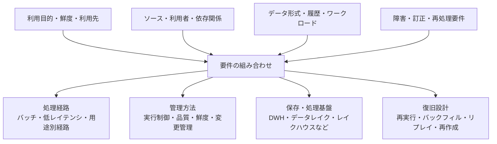

## 6. 4つのCaseの横断比較

2章から5章では、異なる要件を想定した4つのCaseについて、組織条件、構成と設計判断、運用、トレードオフ、変更トリガーを個別に整理した。各Caseは、単純な構成から高度な構成へ進む成熟度の段階ではなく、利用目的、鮮度、データ特性、再処理要件、運用体制などの違いから分岐する参照例である。

本章では、まず4つのCaseを共通の評価軸で並べ、構成要素や必要な運用能力の違いを確認する。次に、どの条件が処理経路、管理方法、保存・処理基盤、復旧設計を変えたのかを横断的に整理する。最後に、データ保護、既存環境、責任分界、運用能力、予算など、要件から導いた構成の採用可能性と継続運用を左右する制約を扱う。

ここでの目的は、組織やデータ基盤を4つのCaseのいずれかへ固定的に分類することではない。要件と制約の組み合わせから、どの能力が必要となり、どの複雑性を受け入れるべきかを判断するための比較軸を得ることである。実際の構成では、複数のCaseに近い処理経路や管理方法を組み合わせる場合もある。

---

### 6.1 共通評価軸による比較

本節では、1.2で整理した6つの共通評価軸を用いて、各Caseの違いを横断的に比較する。ここで比較するのは、技術の高度さや組織の成熟度ではなく、それぞれの要件に対して、どのような処理方式、管理方法、運用能力が必要になったかである。

本節で比較するCaseは、次のとおりである。

- **Case 1：小規模・限定用途のマネージドサービス中心基盤**
- **Case 2：複数部門・複数ソースを扱う成長中のバッチ基盤**
- **Case 3：変更データキャプチャ（Change Data Capture: CDC）・イベントを扱う低レイテンシ基盤**
- **Case 4：多様なデータと複数ワークロードを扱う共通データ基盤**

#### 要件とデータ処理に関する比較

##### 目的と利用者

| Case | 目的と利用者 |
|---|---|
| Case 1 | 経営・業務担当者向けの限定された定型レポートや基本的なBIへデータを提供する |
| Case 2 | 複数部門の定型レポート、部門別分析、部門横断指標へ共通データを提供する |
| Case 3 | 確定した変更や業務イベントを、アプリケーション、アラート、運用処理、即時指標へ短い時間で届ける |
| Case 4 | BI、探索的分析、データサイエンス、機械学習など、性質の異なる複数ワークロードへ共通データを提供する |

**表6-1：** 目的と利用者による4つのCaseの比較。

##### データの特性

| Case | データの特性 |
|---|---|
| Case 1 | 少数のSaaS、業務データベース、ファイルから取得する、主に構造化データ |
| Case 2 | 複数のSaaS、アプリケーションデータベース、ファイルから取得する、主に構造化データ |
| Case 3 | データベースの変更、業務イベント、アプリケーションイベントなど、継続的に発生するデータ |
| Case 4 | 構造化、半構造化、非構造化データ、加工前に近いデータ、長期履歴 |

**表6-2：** データの特性による4つのCaseの比較。

##### 鮮度と処理方式

| Case | 鮮度と処理方式 |
|---|---|
| Case 1 | 日次または数回／日のバッチ処理を中心とし、フルリフレッシュまたは単純な増分処理を使う |
| Case 2 | 日次または数時間ごとのバッチ処理を中心とし、増分取り込み・増分変換を用いながら、処理間の依存関係を管理する |
| Case 3 | 秒〜数分単位の反映を目的とし、CDC、イベント連携、ストリーム処理、マイクロバッチなどを候補とする |
| Case 4 | データと利用目的ごとに、バッチ、増分処理、マイクロバッチ、CDC、ストリーム取り込みなどを使い分ける |

**表6-3：** 鮮度と処理方式による4つのCaseの比較。

#### 運用と継続性に関する比較

##### 信頼性と再処理

| Case | 信頼性と再処理 |
|---|---|
| Case 1 | 失敗を検知し、処理全体または分かりやすい範囲を再実行できることを重視する |
| Case 2 | 上流遅延、取り込み失敗、変換失敗、品質異常を区別し、部分再実行やバックフィルを管理する |
| Case 3 | 重複、遅延、順序入れ替わり、状態更新を考慮し、生イベントや変更履歴からリプレイできるようにする |
| Case 4 | 加工前に近いデータや履歴を保持し、使用したデータ範囲、スキーマ、変換条件を追跡して再処理・再作成できるようにする |

**表6-4：** 信頼性と再処理による4つのCaseの比較。

##### 組織体制と運用

| Case | 組織体制と運用 |
|---|---|
| Case 1 | 少人数または兼務担当者でも、処理の流れ、障害箇所、再実行手順を理解し、継続保守できることを重視する |
| Case 2 | データ担当者、部門側の所有者、外部支援などの間で、モデル、指標、障害対応、変更管理の責任を分ける |
| Case 3 | 上流システム、アプリケーション、データ基盤、下流利用先の担当者が、イベント定義、遅延、欠損、再処理、影響範囲を調整する |
| Case 4 | 基盤運用者、データ所有者、分析・機械学習の利用者が、品質、権限、履歴、再処理、ワークロード間の優先順位を調整する |

**表6-5：** 組織体制と運用による4つのCaseの比較。

##### ガバナンスとコスト

| Case | ガバナンスとコスト |
|---|---|
| Case 1 | 必要な範囲の権限、指標定義、運用ルールを持ち、構成要素と運用負荷を抑える |
| Case 2 | 部門横断の指標定義、権限、変更管理を整え、処理数や依存関係の増加に伴う運用コストを管理する |
| Case 3 | イベントの保持期間、監査、アクセス権限、常時稼働コスト、低レイテンシ化による運用負荷を管理する |
| Case 4 | メタデータ、権限、リネージ、保持・削除を共通管理し、保存、コンピュート、運用コストを評価する |

**表6-6：** ガバナンスとコストによる4つのCaseの比較。

#### 比較結果の整理

4つのCaseでは、同じ構成要素を利用する場合でも、利用目的、データの特性、鮮度、再処理要件、運用体制の違いによって、管理対象と必要な能力が異なる。表6-1から表6-6は、その違いを共通評価軸に沿って並べたものである。

次節では、これらの違いを各Caseの特徴として再説明するのではなく、処理経路、保存・処理基盤、再処理方法、運用体制を変化させた条件として整理する。

---

### 6.2 どの条件が構成を変えたか

6.1では、4つのCaseの差を6つの共通評価軸で並べた。本節では、その差をCaseごとに再説明するのではなく、データ量、更新頻度、ソース数、データ形式、利用者、再処理要件などの組み合わせが、処理経路、管理方法、保存・処理基盤、復旧設計をどのように変えたかを整理する。

#### 利用目的と鮮度が処理経路を変える

データをいつまでに更新する必要があるかは、処理方式を選ぶ主要な条件である。ただし、鮮度だけで処理経路が決まるわけではない。重要なのは、更新されたデータをどの利用者やシステムが利用し、遅延がどのような影響を与えるかである。

定型レポートやBIが主な利用先であり、日次または数時間ごとの更新で目的を満たせる場合は、一定範囲のデータをまとめて処理するバッチ中心の経路が候補になる。この場合は、処理の単純性、更新完了時刻、失敗時の再実行、利用者への安定した提供が重視される。

一方、確定した変更や業務イベントを、アプリケーション、アラート、運用処理へ秒〜数分単位で届ける必要がある場合は、処理間隔を短くするだけでは不十分になることがある。継続的な変更取得、イベント配送、状態更新、即時提供などを担う低レイテンシ経路が候補となり、採用する方式に応じて、重複、遅延、順序入れ替わり、キューの滞留なども管理対象となる。

同じ数分単位の鮮度要件でも、必要な処理は一律ではない。一定間隔で更新済みデータをまとめて反映できるなら、短い間隔のマイクロバッチで足りる場合がある。イベントごとに状態を更新し、到着順序や過去の状態を参照する必要があれば、状態を持つストリーム処理が候補になる。

したがって、処理方式は「鮮度を高くするほどストリーミングへ移行する」という段階ではなく、利用目的、許容遅延、処理単位、状態管理の必要性から選択する。

#### ソース、利用者、依存関係の増加が管理方法を変える

データソース、変換モデル、マート、利用者が増えても、直ちに保存基盤を変更する必要があるとは限らない。DWH中心の構成を維持したまま、実行制御、品質管理、変更管理を強化することで対応できる場合がある。

管理方法を変えるのは、単純な件数の増加だけではない。次のような条件が重なると、担当者の暗黙的な把握や単純な定期実行だけでは運用しにくくなる。

- ソースごとに取り込み完了時刻や失敗要因が異なる
- 変換モデル間の依存関係が増える
- 一部の失敗が複数のマートやレポートへ影響する
- 利用部門ごとに更新期限や重要度が異なる
- 指標やデータ定義の変更が複数の利用者へ影響する
- 障害時に処理全体ではなく、影響範囲だけを再実行する必要がある

このような条件では、取り込み完了の確認、依存関係に沿った実行、品質検査、鮮度監視、失敗通知、部分再実行、リネージ、変更手順を明示的に管理する必要が高まる。

また、利用者や関係者が増えるほど、技術的な依存関係だけでなく、責任分界も重要になる。誰がソースの意味を説明し、誰が変換モデルを保守し、誰が指標変更を承認し、障害時に誰が利用者へ影響を伝えるかを決める必要がある。

したがって、Case 1とCase 2に近い構成の差は、単に組織やデータの規模が異なることではなく、処理と責任の関係をどの程度明示的に管理する必要があるかに表れる。

#### データ形式、履歴、ワークロードが保存・処理基盤を変える

保存・処理基盤の選択には、データ形式だけでなく、加工前に近いデータや整備済みデータなど、どの状態のデータをどの期間保持し、どのような処理や利用へ提供するかが影響する。

主に構造化データを扱い、SQLによる変換、集計、定型レポート、BIが中心であれば、DWH中心構成で要件を満たしやすい。半構造化データが含まれていても、必要な項目をDWH上で管理し、主な処理をSQLで実行できるなら、直ちに別の保存基盤が必要になるわけではない。

一方で、次の条件が重なると、既存DWHの拡張、DWHとデータレイクの役割分担、レイクハウスなどを比較する理由が生じる。

- 構造化、半構造化、非構造化データを扱う
- 加工前に近いデータや長期履歴を保持する
- 過去のデータを異なる変換条件で再処理する
- BI、探索的分析、データサイエンス、機械学習へ共通データを提供する
- SQL以外の処理方式や専用ライブラリを必要とする
- 複数の保存・処理環境にまたがって権限、品質、履歴を管理する

ただし、非構造化データが存在することや、機械学習を利用することだけでは、レイクハウスを採用する十分な理由にはならない。対象データが限定され、既存DWHや用途別の保存・処理環境で要件を満たせる場合は、共通基盤へ統合しない方が単純なこともある。

保存・処理基盤を変える判断では、保存できるかどうかだけでなく、データの発見、意味の理解、アクセス制御、履歴管理、再処理、性能、利用者への提供を継続的に管理できるかを確認する必要がある。

#### 再処理要件が復旧設計を変える

再処理要件は、どのデータを保持し、どの単位で処理を分割し、どの実行状態を記録するかに影響する。

用途と処理範囲が限定されており、処理時間とコストが許容できる場合は、処理全体を再実行する方法や、テーブル全体を再作成する方法が分かりやすい。ソース、モデル、依存関係が増えると、失敗箇所や対象期間だけを再実行する部分再実行や、過去期間を再計算するバックフィルが重要になる。

イベントを継続的に処理する構成では、単にジョブを再実行するだけでは、元の状態を再現できない場合がある。生イベントや変更履歴、処理位置、保持している状態、重複排除や冪等性の設計を考慮し、どの地点から安全にリプレイできるかを決める必要がある。

複数ワークロードや長期履歴を扱う場合は、処理が成功したかだけでなく、どの入力データ、期間、スキーマ、変換ロジック、設定を用いて結果を作成したかを追跡し、必要に応じて再作成できることが重要になる。

これらは、単純な再実行から高度な再処理へ進む成熟度の段階ではない。必要な再処理方法は、障害や訂正の種類、保持している履歴、下流への影響、復旧期限によって異なる。

ただし、必要な復旧方式を組織が継続運用できるかどうかは、復旧方式そのものとは別に評価する必要がある。

#### 条件と設計判断の関係

以上の関係を単純化すると、次のように整理できる。

**図6-1：** パイプライン構成を変える主な条件と設計判断の関係。各設計判断は一つの条件だけで決まるものではなく、複数の要件を組み合わせて検討する。実際には、一つのパイプラインに複数の処理経路や保存・処理基盤が組み合わされる場合がある。

データ量は、処理時間、保存容量、再処理時間、性能、コストへ影響する重要な条件である。また、組織規模や関係者の数は、責任分界、変更管理、運用体制へ影響し得る。しかし、いずれも単独で、バッチ処理とストリーム処理、DWHとレイクハウス、単純な再実行とリプレイのどれを選ぶかを決める条件ではない。

また、各条件は相互に排他的ではなく、低レイテンシでイベントを処理しながら、その履歴を長期保存してBIや機械学習へ利用するように、複数の構成を組み合わせる場合もある。

したがって、4つのCaseは、組織や基盤を一つに分類するための区分ではない。要件の組み合わせが、どの設計判断と追加の複雑性を生むかを比較するための参照例である。

次節では、Case間の構成差を生む条件とは別に、セキュリティ、既存システム、コスト、運用体制など、構成の採用可能性と継続運用を左右する横断的制約を整理する。

---

### 6.3 すべてのCaseに影響する制約

6.2で整理した要件から必要な能力と構成を導いても、その構成をそのまま採用できるとは限らない。セキュリティ、データ所在地、既存環境、予算、運用人員などの制約によって、利用できるサービス、データの配置、導入方法、運用範囲が変わる。

これらは、Case 1からCase 4のいずれかだけに属する条件ではない。同じCaseに近い要件であっても、横断的制約が異なれば、実際に採用する製品、構成要素、責任分界、移行手順は異なる。

#### 横断的制約の全体像

| 制約群 | 主な確認事項 |
|---|---|
| データ保護と可用性 | セキュリティ、プライバシー、機密区分、監査、データ所在地、保持・削除、災害復旧、複数リージョン要件 |
| 既存環境と移行 | オンプレミス接続、既存DWH・データレイク・業務システム、ネットワーク、契約、移行期間、並行運用、切り戻し |
| 組織と運用 | データ所有者、責任分界、運用人員、スキル、障害対応、外部支援、ドキュメント、引継ぎ、保守可能性 |
| コストと技術依存 | 予算上限、ライセンス・クラウド利用料、総所有コスト、ベンダーロックイン、将来の移行・撤退費用 |

**表6-7：** 4つのCaseすべてに影響する主な横断的制約。

#### データ保護と可用性

データを保存・処理できる場所と方法は、セキュリティ、プライバシー、契約、データ所在地などの条件によって制限される場合がある。

例えば、特定のデータを指定された国やリージョンの外へ移動できない場合、利用可能なクラウドサービスやバックアップ先は限定される。オンプレミスからデータを外部へ送信できない場合や、機密区分によって利用できるサービスが異なる場合は、クラウド中心の構成をそのまま採用できないこともある。

また、共通基盤へデータを集約するほど、アクセス権限の誤設定や不要なデータ共有による影響範囲も広がり得る。データを一か所へ集約することと、すべての利用者へ公開することを区別し、利用者、役割、データ区分、利用目的に応じてアクセス範囲を定める必要がある。

保持期間と削除方針も、再処理や監査のために長期履歴を保持したいという要件だけでは決められない。利用目的を失ったデータ、削除要求の対象となるデータ、契約や規則によって保持期間が定められたデータは、それぞれの条件に従って管理する必要がある。

災害復旧や複数リージョン構成についても、常に最大限の冗長性を持たせるのではなく、停止による事業影響、許容できる復旧時間、データ損失の許容範囲、費用を踏まえて決める。

#### 既存環境と移行上の制約

本資料で示した構成例は、既存環境をすべて置き換えることを前提としていない。実際の構成選定では、すでに利用している業務システム、DWH、データレイク、BI、取り込みサービス、オーケストレーターなどとの接続や役割分担を確認する必要がある。

既存基盤が要件の一部を満たしている場合は、新しい構成へ全面移行するよりも、既存基盤を拡張する方が、移行リスクと運用負荷を抑えられる場合がある。一方で、既存基盤へ機能を追加し続けることで、構成が複雑になり、保守が難しくなる場合もある。

移行では、データを新しい保存先へコピーするだけでなく、次のような事項を確認する必要がある。

- 過去データをどこまで移行するか
- 既存処理と新しい処理をどの期間並行稼働させるか
- 新旧の出力結果をどのように比較するか
- 下流レポートやアプリケーションをどの順序で切り替えるか
- 問題が起きた場合にどこまで切り戻せるか
- 移行後に旧基盤をいつ廃止できるか

オンプレミス環境や外部SaaSとの接続では、ネットワーク、認証、通信量、API制限、接続可能な時間帯なども構成へ影響する。技術的に接続可能であっても、安定した運用と障害調査ができるかを含めて評価する必要がある。

#### データ所有と責任分界、運用能力、保守可能性

データパイプラインは、構築後も、監視、障害調査、再処理、権限変更、スキーマ変更、利用者からの問い合わせへ継続的に対応する必要がある。

そのため、採用する構成は、必要な機能を持つかだけでなく、組織が日常的に扱えるかという観点から評価する。少人数または兼務担当者が運用する場合は、構成要素を減らし、監視箇所、失敗時の確認手順、再実行方法を説明しやすくすることが重要になる。

複数のチームや外部支援が関与する場合は、少なくとも次の責任を明確にする必要がある。

- ソースデータの意味と品質を説明する
- 取り込み、変換、提供処理を保守する
- 指標やデータ定義の変更を承認する
- 権限と利用条件を管理する
- 障害時に影響範囲を確認し、復旧を判断する
- 利用者へ遅延、欠損、変更内容を伝える
- データの機密区分、利用目的、外部提供の可否を判断する
- 法令、契約、社内規程に基づく保持、削除、開示対応を判断する
- セキュリティやプライバシー上の問題を検知し、専門部門へ報告する

外部支援やマネージドサービスは、組織内に不足する能力や運用作業を補う手段になり得る。一方で、外部事業者がデータ、メタデータ、ログ、バックアップ、障害調査情報などを扱う可能性があるため、機密区分、利用目的、アクセス範囲、データ所在地、再委託、保持・削除、インシデント時の報告なども確認する必要がある。

技術的な運用作業を外部へ委託しても、どのデータを何の目的で利用するか、どの情報を外部へ共有できるか、どの品質基準やアクセス条件を設けるかといった判断まで、すべて外部へ移せるわけではない。法務、情報セキュリティ、プライバシー担当、業務部門、データ所有者、データ基盤担当者などを含めて、組織側と外部事業者の責任分界、承認経路、対応手順を定める必要がある。

また、運用が特定の担当者や外部事業者の知識だけに依存すると、障害対応や引継ぎが難しくなる。構成、依存関係、監視項目、復旧手順、所有者、変更手順を文書化し、組織内の担当者と外部支援の責任分界を含めて、継続保守できる状態を確認する必要がある。

#### 予算、総所有コスト、ベンダーロックイン

構成選定では、利用期間全体の総所有コスト（Total Cost of Ownership: TCO）だけでなく、初期費用、最低契約額、年度ごとの支出額も確認する必要がある。長期的には他の候補よりTCOが低くても、初年度や各年度の支出額が予算枠を超える場合は採用できない。

したがって、現時点および年度ごとに支出可能な予算と、導入から移行・廃止までのTCOは分けて評価する。

TCOには、ライセンス料やクラウド利用料だけでなく、導入、既存環境との接続、監視、障害対応、教育、ドキュメント、変更管理、アップグレード、外部支援、将来の移行などに必要な費用と労力が含まれる。

セルフマネージドな構成は、製品利用料を抑えられる場合がある一方、構築、監視、更新、障害対応を組織自身で担う必要がある。マネージドサービスは、これらの負担を減らせる可能性がある一方、利用料金や製品固有機能への依存が増える場合がある。

実際には二者択一ではなく、取り込み、保存、変換、実行制御、監視など、どの範囲をマネージドサービスへ任せるかを分けて判断できる。表面上の価格だけでなく、組織に残る作業と責任を含めて比較する必要がある。

ベンダーロックインも、単純に避けるべき制約ではない。特定の製品やクラウドへ依存することで、導入速度、統合機能、運用効率、サポートを得られる場合がある。

重要なのは、次の点を把握したうえで依存を受け入れることである。

- どのデータ形式、API、コード、メタデータ、運用手順が製品固有になるか
- 依存によって、どの運用負荷や開発負荷を削減できるか
- サービス障害や契約変更が起きた場合に、どの範囲が影響を受けるか
- 将来、別の製品や構成へ移行するときに、どの程度の費用と期間が必要になるか
- 移行や撤退に必要なデータ、スキーマ、変換ロジック、メタデータを、どの形式で保持・出力できるか

#### 横断的制約を踏まえた構成判断

横断的制約は、要件から導いた構成を後から確認するための付加的なチェック項目ではない。構成候補を比較する初期段階から確認しなければ、技術的には成立しても、導入できない、または継続運用できない構成を選ぶ可能性がある。

同じ要件に対しても、法令・契約・社内規程、既存環境、予算、運用体制が異なれば、異なる構成が妥当になり得る。すべての要件へ一度に対応することが現実的でない場合は、対象データ、利用者、鮮度、ワークロードを限定し、優先度の高い経路から段階的に導入する方法もある。

また、制約を満たすために構成要素を追加すると、別の運用負荷やコストが生じる場合がある。例えば、複数リージョン化は可用性を高める一方で、データ同期、整合性、監視、費用管理の複雑性を高める。既存基盤との並行運用は移行リスクを抑える一方で、二重運用と結果照合の負担を生む。

したがって、構成選定では、要件を満たす能力だけでなく、制約を満たすために追加される複雑性と、それを組織が継続的に負担できるかを評価する必要がある。4つのCaseは、その判断に利用する比較対象であり、横断的制約を無視してそのまま適用する構成テンプレートではない。
