# 要件と制約から考えるデータパイプライン設計

## — 4つのCaseで比較する処理経路・保存基盤・再処理・運用 —

> **注意**
>
> この資料は、データパイプラインの設計について、公開情報および個人ポートフォリオで得られた観察を出発点として、作成者自身の理解と調査結果を整理した学習・参照用資料です。
>
> 第三者機関、標準化団体、資格認定団体、企業、製品ベンダーなどによって、内容が保証・監修・認証された資料ではありません。
>
> 内容は、公開情報および執筆時点での作成者の理解に基づいています。実際の組織へ適用する場合は、事業目的、データ、既存システム、データ保護上の条件、予算、責任分界、運用体制などを確認し、対象となる環境に応じて判断する必要があります。
>
> **この資料における4つのCaseの扱い**
>
> この資料で扱う4つのCaseは、すべてのデータパイプラインを網羅的に分類する体系ではありません。また、Case 1からCase 4へ順番に発展する成熟度モデルや、技術的な高度さ、企業規模、組織の成熟度による序列でもありません。
>
> 4つのCaseは、利用目的、データの特性、鮮度、信頼性・再処理要件、運用体制、ガバナンス、コストなどの違いによって、必要な処理経路、保存・処理基盤、復旧方法、運用能力がどのように変わるかを比較するための仮想的な参照例です。
>
> 実際の組織やデータ基盤が、いずれか一つのCaseだけに対応するとは限りません。同じ組織でも、定型分析、低レイテンシ処理、多様なデータの保存、機械学習など、利用目的の異なる複数のデータパイプラインを持つ場合があります。それらが複数のCaseに近い特徴を持つこともありますが、本資料で扱っていない要件や構成を含み、4つのCaseでは十分に表せない場合もあります。
>
> **この資料における構成例と製品名の扱い**
>
> 本資料に示す構成図、処理方式、製品・サービス名は、要件と設計判断の関係を具体化するための例です。特定製品の組み合わせを、そのまま導入できる標準構成、推奨テンプレート、または唯一の正解として提示するものではありません。
>
> 同じ要件に対しても、既存環境、運用能力、予算、契約条件、利用可能なサービスなどによって、異なる構成が成立する場合があります。実際の構成選定では、対象環境の条件と、採用候補となる製品・サービスの最新の公式情報を確認する必要があります。

---

## 0. はじめに

### 0.1 調査の出発点

本資料の出発点は、dbtを用いた個人ポートフォリオで得られた小さな観察である。

`access-governance-warehouse`では、同じdbtプロジェクトを、DuckDBを使用するローカル環境とBigQuery環境で実行できるようにした。

著者が開発に使用していたローカル環境は比較的古いコンピュータであった。そのため当初は、BigQuery上で処理を実行すれば、ローカルマシンの計算資源の制約を受けにくくなり、実行時間が短くなるのではないかと予想していた。

しかし、このプロジェクトで315件のデータテストを5スレッドで実行したところ、記録された一組の実行では、BigQueryが58.80秒、DuckDBが6.97秒で完了した。いずれの環境でも315件すべてのテストが成功しており、BigQuery側の実行時間はDuckDB側の約8.4倍であった。これは、事前の予想とは反対の結果であった。実行条件、結果、ログの抜粋、解釈上の制約は、別途実行記録として公開している。[1]

ただし、これは各環境について1回ずつ記録した実行結果であり、条件を統制して複数回測定した性能ベンチマークではない。実行エンジン、ストレージの配置、通信経路、アダプターなども異なるため、この結果を「BigQueryはDuckDBより遅い」という一般的な製品比較には用いない。

このログから確認できるのは、多数の小さなテストクエリを実行した際に、両環境の総実行時間に大きな差が生じたことまでである。クエリの準備、リモート通信、スケジューリング、分散実行、ストレージアクセス、キャッシュなどのうち、どの要因がどの程度影響したかは確認できていない。

そこで、ポートフォリオで扱うデータ量が極めて小さく、個々のテストクエリの処理も比較的軽量であるため、BigQueryの分散処理能力による利点が実行時間に明確に表れるほどの処理量ではなかった可能性があると考えた。一方で、リモート実行に伴う通信、スケジューリング、実行管理などの時間は、総実行時間に対して相対的に大きく表れた可能性がある。

ただし、これらの要因は個別に測定していないため、この説明は現時点では仮説である。

この観察から生まれた「データ量の違いに応じて、どのように適切なデータ基盤の構成を選定すべきか」という問いが、本資料作成の起点である。

しかし、調査を進めるうえで、データ基盤の設計は処理するデータ量だけでは決まらないことが分かってきた。

データ基盤の構成は、性能だけでなく、信頼性、セキュリティ、コスト、運用性など、複数の観点を合わせて評価する必要がある。[2]

本資料では、これらに加えて、利用目的、更新頻度、求められる鮮度、データソースと形式、クエリ特性、再処理要件、既存システム、運用を担うチームの能力などを、構成を比較するための条件として扱う。

例えば、データ量が小さくても秒単位の鮮度が必要であれば、継続的なイベント処理が候補になる。反対に、データ量が大きくても日次の定型レポートが中心であれば、バッチ処理を基本とする構成が適している場合がある。

また、技術的に実現可能な構成であっても、監視、障害調査、復旧、変更管理を担える人員がいなければ、組織が継続的に運用できる構成とは限らない。

そこで本資料では、最初の問いをデータ量だけによる構成選定の検討に閉じず、異なる要件と組織条件によって、データパイプライン（data pipeline）の構成がどのように変化するかという問いへ広げる。

---

### 0.2 本資料の目的

本資料では、異なる組織条件、要件、制約を持つ4つの仮想事例（Case）を通じて、データパイプラインの設計がどのように変化するかを整理する。

中心となる問いは、次のとおりである。

> 利用目的、更新頻度、データソースと形式、利用ワークロード、信頼性・再処理要件、運用体制、ガバナンス、コストなどの要件と制約が変わると、データパイプラインの設計はどのように変わるか。

比較する4つのCaseは、次のとおりである。

1. 小規模・限定用途のマネージドサービス中心基盤
2. 複数部門・複数ソースを扱う成長中のバッチ基盤
3. 変更データキャプチャ（Change Data Capture: CDC）・イベントを扱う低レイテンシ基盤
4. 多様なデータと複数ワークロードを扱う共通データ基盤

本資料の目的は、特定製品の組み合わせを、そのまま再利用できる標準構成として提示することではない。

各Caseでは、組織条件と要件から出発し、必要な能力、設計判断、受け入れるトレードオフを順に整理する。次の図は、その整理の進め方を単純化して示した一例である。

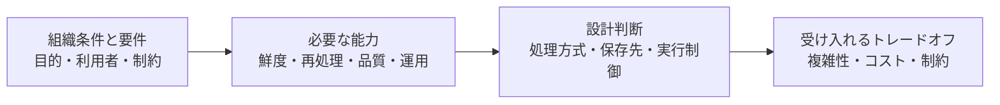

**図0-1：** 各Caseで、要件から設計判断とトレードオフを整理するための考え方の一例。実際の検討では、必要に応じて前段階へ戻りながら判断する。

この判断経路に沿って、主に次の点を確認する。

- どの要件と制約が、処理経路や保存・処理基盤を変えるのか
- バッチ処理、増分処理、CDC、ストリーム処理をどのように使い分けるのか
- どの条件でマネージドサービスや専用オーケストレーターが必要になるのか
- どのような失敗を想定し、再試行、部分再実行、バックフィル、リプレイをどう扱うのか
- なぜ特定の機能や複雑性を追加するのか
- なぜ高度な機能や製品を選択しない場合があるのか
- 誰が日常運用、監視、障害調査、復旧、変更管理を担うのか
- 現在の構成が適さなくなり、再検討が必要になるのはどのような場合か

また、構成が技術的に成立するかだけでなく、組織が継続的に保守できるかという観点を重視する。直接的なライセンス料やクラウド利用料だけでなく、導入、接続、監視、障害対応、教育、変更管理、将来の移行に必要な負担を含む総所有コスト（Total Cost of Ownership: TCO）も設計判断の一部として扱う。

さらに、文書上の比較だけで技術選定を確定するのではなく、本格導入前に主要なデータ経路を小さく構築する概念実証（Proof of Concept: PoC）を行い、接続、失敗、再処理、運用、コストなどの重要な不確実性を検証する考え方も扱う。

以上を通じて、特定の製品や新しい技術を選ぶこと自体を目的とするのではなく、要件と制約が異なる場合に、何を確認し、どのような順序でデータパイプライン設計を考えるべきかという判断軸を整理する。

---

### 0.3 対象範囲と注意点

本資料では、組織内外のデータソースからデータを取り込み、保存し、変換し、品質を確認したうえで、分析、可視化、機械学習、その他の下流利用へ提供するまでのデータパイプラインを主な対象とする。

具体的には、次の機能領域を扱う。

- データソースからの取り込み
- バッチ処理、増分取り込み、変更データキャプチャ（Change Data Capture: CDC）、イベントによるデータ連携
- データウェアハウス（data warehouse: DWH）、オブジェクトストレージ、レイクハウスへの保存
- データの変換、集約、モデリング
- データ品質の検査と鮮度の監視
- 処理のスケジューリングとオーケストレーション
- 失敗時の再試行、部分再実行、バックフィル、リプレイ
- ビジネスインテリジェンス（Business Intelligence: BI）、分析、データサイエンス、機械学習などへのデータ提供
- 監視、障害調査、復旧、運用上の責任範囲と役割分担

これらの領域は、組織全体のデータマネジメントの一部である。DAMA-DMBOKのような包括的なデータマネジメントの枠組みでは、データガバナンス、データアーキテクチャ、データ品質、メタデータ管理、データセキュリティなど、技術基盤だけでは完結しない領域も扱われる。

本資料では、DMBOK全体を解説することは目的としない。ただし、データパイプラインの構成選定は、データの意味、品質、権限、責任範囲、運用体制、利用者との合意と切り離せないため、各Caseの設計判断に影響する範囲でこれらの観点を取り上げる。

Case 3では、業務システムで確定したデータ変更や業務イベントを受け取り、通知、リアルタイム指標、分析用データの更新などの下流処理へ低レイテンシでつなぐ経路も対象とする。一方、注文、決済、契約、権限変更などの業務上の状態を作成・更新し、処理結果を同期的に確定するトランザクション処理そのものは、原則として対象外とする。

本資料で扱う4つのCaseは、すべてのデータ基盤を網羅的に分類するものではない。要件と組織条件の違いが、データパイプラインの構成や運用へどのような差を生むかを比較するための仮想事例である。

したがって、4つのCaseについては、次の点に注意する必要がある。

- Case 1からCase 4へ順番に移行する成熟度モデルではない
- 技術的な高度さや組織規模による序列ではない
- 業種や事業ドメインによって一意に分類されるものではない
- 一つの組織全体を、いずれか一つのCaseへ分類するものではない
- 同じ組織が、目的や要件の異なる複数のデータパイプラインを運用し、複数のCaseに近い構成を併用する場合がある
- 各Caseで示す構成は、所与の条件に対する一つの妥当案であり、唯一の正解ではない
- 同じ要件に対して、異なる製品やアーキテクチャによる別の構成が成立する場合がある

本文に登場する製品やサービスは、必要な機能と設計判断を具体化するための代表例として扱う。特定製品の組み合わせを、そのまま導入できる標準構成や推奨テンプレートとして提示するものではない。

また、本資料では比較の中心を明確にするため、次の領域は対象外とするか、判断に必要な範囲でのみ扱う。

- アプリケーション全体やトランザクションシステムの詳細設計
- 個別製品の全機能、価格、性能を網羅した比較
- 特定クラウドや特定ベンダーを前提とした詳細な構築手順
- 機械学習モデルの開発、学習、評価、デプロイを含む機械学習運用（Machine Learning Operations: MLOps）全体
- セキュリティ、法規制、データ所在地、監査への詳細な対応方法
- オンプレミス、ハイブリッドクラウド、マルチリージョン構成の詳細
- すべての障害パターンやアーキテクチャ上の派生構成
- 特定組織に対する導入提案、製品選定、予算見積もり
- 本番環境へ直接適用できる詳細設計書

セキュリティ、ガバナンス、可用性、コストなどは構成選定に影響する重要な条件であるため、各Caseの判断に必要な範囲では取り上げる。すべてのCaseに共通して影響する制約については、6.3で横断的に整理する。

本資料で示す考え方や構成例を実際に組織へ適用することを検討する場合は、本文の例をそのまま採用するのではなく、実際のデータ、既存システム、利用目的、運用体制、セキュリティ要件、予算などを確認し、必要に応じて概念実証（Proof of Concept: PoC）による検証を行う必要がある。

---

### 0.4 公開情報と実務事例の扱い

本資料では、データパイプラインに関する概念、製品動作、設計原則、実務上の判断を確認するため、公式ドキュメント、標準仕様、学術論文、技術ブログ、カンファレンス資料、アーキテクチャ紹介、導入事例などの公開情報を参照する。

ただし、情報源の種類によって、そこから確認できる内容と一般化できる範囲は異なる。

製品の機能や動作については、原則として公式ドキュメント、公式仕様、公式リポジトリ、公式リリースノートなどを優先する。理論や基本概念については、学術論文、標準仕様、原著資料などを優先する。

企業が公開している技術・運用事例は、特定の事業目的、データ、既存環境、予算、チーム構成、技術的能力などの条件下で採用された判断として扱う。ある企業が特定の構成や製品を採用していることだけを理由に、それを一般的なベストプラクティスや、他の組織にもそのまま適用できる構成とは扱わない。

また、製品ベンダーが公開する技術資料や顧客事例は、その製品の機能や適用例を理解するための情報として利用できる。一方で、製品の利点や導入成果が中心に説明され、比較した代替案、継続的な運用負荷、採用しなかった選択肢などが十分に示されていない場合があることに注意する。

公開情報を参照する際は、可能な範囲で次の点を区別する。

- 情報源から直接確認できる事実
- 情報源の作成者が説明している設計判断や導入理由
- 特定の製品、企業、事業、規模、既存環境に依存する判断
- 複数の環境にも応用できる可能性がある設計原則
- 公開情報からは確認できない事項
- 複数の情報を基に本資料で整理した著者による解釈

一つの企業事例や一つのベンダー資料だけを根拠として、実務上の一般性を判断しない。共通する実務上の傾向を述べる場合は、可能な範囲で複数の独立した情報源を比較する。

十分な情報が確認できない場合は、「公開情報からは確認できない」「特定の条件下での事例である」「本資料における解釈である」など、主張の範囲と確度を明示する。

---

## 1. パイプライン設計を変える評価軸

0章では、本資料がデータ量だけでなく、鮮度、データソース、利用目的、再処理、運用体制などの違いから、データパイプライン構成を比較する資料であることを整理した。

本章では、後続の4つのCaseを比較する前提として、まず本資料でいうデータパイプラインの範囲を確認し、次に構成判断へ影響する共通の評価軸を整理する。そのうえで、4つのCaseの位置づけと、ドメイン別にどのような構成が近くなるかを概観する。

最後に、文書上の比較だけで構成を確定せず、データパイプライン設計における主要な不確実性を、本格導入前に小さく検証する概念実証（Proof of Concept: PoC）の考え方を確認する。これにより、2章以降では、各Caseの構成を単なる技術スタックではなく、要件、必要な能力、設計判断、トレードオフの対応関係として読めるようにする。

---

### 1.1 データパイプラインとは何か

データパイプライン（data pipeline）とは、データソースからデータを取り込み、必要な保存、変換、品質検査、提供を行い、下流の利用者やシステムへ届ける一連の処理経路である。

ここでいうデータソースには、業務アプリケーションのデータベース、SaaS（Software as a Service）、ファイル、ログ、イベント生成元などが含まれる。下流の利用先には、ビジネスインテリジェンス（Business Intelligence: BI）、定型レポート、アドホック分析、データサイエンス、機械学習、業務アプリケーション、アラートなどが含まれる。

データパイプラインは、単にデータを別の場所へコピーする処理だけを意味しない。実際には、次のような処理や判断が組み合わさる。

- どのデータソースから取得するか
- どのタイミングで取得するか
- 取得したデータをどこへ保存するか
- 生データをどの程度保持するか
- どのように変換、集約、モデリングするか
- データ品質や鮮度をどのように検査・確認するか
- 失敗時にどこから再実行できるようにするか
- 誰が監視、障害調査、復旧、変更管理を担うか
- どの利用者やシステムへ、どの粒度で提供するか

例えば、日次でSaaSのデータをデータウェアハウス（data warehouse: DWH）へ取り込み、dbtで売上マートを作成し、BIダッシュボードへ提供する処理は、一つのデータパイプラインとして捉えられる。

一方で、注文確定イベントがイベントブローカーへ送られ、ストリーム処理で在庫アラートや即時指標を生成・更新しつつ、生イベントをDWHまたはレイクハウスへ保存して分析にも利用する構成も、別の性質を持つデータパイプラインである。

このように、データパイプラインの構成は、データ量だけで決まるわけではない。更新頻度、求められる鮮度、データソースの種類、データ形式、下流利用、信頼性要求、再処理要件、運用体制によって、必要な構成は大きく変わる。

本資料では、データパイプラインを、取り込み、保存、変換、品質検査、実行制御、再処理、提供、運用を含む処理経路として扱う。ただし、注文、決済、契約、権限変更などの業務状態を同期的に確定するトランザクションシステムそのものは、原則として対象外とする。

次節では、4つのCaseを比較するために、データパイプライン設計を変える共通の評価軸を整理する。

---

### 1.2 共通の評価軸

データパイプラインの構成を比較するとき、最初に目立ちやすい条件はデータ量である。処理対象のデータが増えれば、処理時間、保存容量、クエリ費用、再処理時間は確かに問題になりやすい。

しかし、データ量だけを基準にすると、構成を変える本当の理由を見落とすことがある。

例えば、データ量が小さくても、数秒から数分単位で業務判断へ反映する必要があれば、日次バッチだけでは不十分になる場合がある。一方で、データ量が大きくても、利用目的が翌朝の定型レポートであれば、バッチ処理を中心とした構成が適している場合もある。

また、同じデータ量であっても、ソースが少数のSaaSだけなのか、複数の業務データベース、ファイル、ログ、イベントを含むのかによって、取り込み方式、失敗時の復旧、データ品質管理、運用責任は変わる。

この評価は、エンジニアだけで完結する技術選定ではない。どのデータを何の目的で使うのか、どの定義を公式なものとして扱うのか、どの品質基準を満たす必要があるのか、誰がデータの意味や利用ルールに責任を持つのかは、データ利用者、データオーナー、業務部門、セキュリティ・ガバナンス担当者などとの合意を必要とする。

DAMA Internationalは、データマネジメント（data management）を、データと情報資産の価値を届け、制御し、保護し、高めるための計画、方針、実践の開発・実行・監督として説明している。また、DAMA Data Management Body of Knowledge（DAMA-DMBOK）では、データガバナンス、データアーキテクチャ、データ品質、メタデータ管理、データセキュリティ、データ統合、データウェアハウスとBIなど、本資料の評価軸とも関係する複数の領域が整理されている。本資料はDMBOK全体を解説するものではないが、パイプライン構成の判断は、これらのデータマネジメント上の論点と切り離せない。[3]

したがって、以下の評価軸は、単なるツール選定の観点ではなく、データを安全に、信頼できる形で、継続的に利用するための合意形成と運用設計の観点でもある。

本資料では、データパイプラインの構成を次の6つの評価軸（evaluation axes）から比較する。

| 評価軸 | 主な問い | 設計への影響 |
|---|---|---|
| 目的と利用者 | 何のために、誰が使うのか | 提供先、データマート、BI、アプリケーション連携、機械学習向けデータの必要性が変わる |
| データの特性 | どのようなデータを扱うのか | データソース、データ形式、データ量、増加率、スキーマ変更への対応が変わる |
| 鮮度と処理方式 | どの程度新しいデータが必要か | バッチ処理、増分処理、マイクロバッチ処理、変更データキャプチャ、ストリーム処理の選択が変わる |
| 信頼性と再処理 | 失敗や訂正にどう対応するか | 再試行、部分再実行、バックフィル、リプレイ、冪等性の設計が変わる |
| 組織体制と運用 | 誰が保守・運用できるのか | マネージドサービス、専用オーケストレーター、監視、障害対応、引継ぎ方法が変わる |
| ガバナンスとコスト | どの制約の中で安全かつ継続的に運用するか | 権限管理、カタログ、監査、データ所在地、予算制約、総所有コスト、ベンダーロックインの評価が変わる |

#### 目的と利用者

最初に確認すべきことは、データパイプラインの主な利用目的である。

同じ売上データを扱う場合でも、経営会議向けの月次レポート、営業担当者向けの日次ダッシュボード、プロダクト上の即時通知、機械学習モデルの特徴量では、必要な鮮度、粒度、信頼性、提供方法が異なる。

利用者が少数の兼務担当者であれば、構成は単純で説明しやすい方がよい場合がある。複数部門が同じ指標を参照するなら、指標定義、データマート、セマンティックレイヤー、権限管理の重要性が高まる。業務アプリケーションやアラートが利用するなら、分析用のDWHだけではなく、低レイテンシで参照できる提供先が必要になる場合もある。

#### データの特性

次に、扱うデータの種類を確認する。

データソースが少数のSaaSや業務データベースに限られる場合、マネージド取り込みとDWHを中心にした構成で足りることがある。一方で、複数部門のSaaS、業務データベース、CSVファイル、ログ、JSON、イベント、文書、画像などを扱う場合、保存先、取り込み方式、カタログ、データ品質管理の設計は複雑になる。

データ形式も重要である。構造化データが中心で、SQLによる集計とBIが主な用途であれば、DWH中心構成が自然な候補になる。半構造化データや非構造化データを長期保持し、探索的分析や機械学習にも利用したい場合は、データレイクやレイクハウスが候補になる。

また、ソースのスキーマが安定しているか、頻繁に変更されるかも設計に影響する。スキーマ変更が多い場合、取り込み失敗、下流モデルの破損、BIレポートへの影響を検知し、影響範囲を把握できる仕組みが必要になる。

#### 鮮度と処理方式

データ鮮度は、どの処理方式を選ぶかに直接影響する。

翌朝までに更新されていれば十分な場合は、日次バッチ処理で足りることがある。数時間ごとの更新が必要であれば、より頻繁なバッチ処理やマイクロバッチ処理が候補になる。秒から数分単位で下流へ反映する必要がある場合は、CDC、イベント連携、ストリーム処理を検討することになる。

ただし、高い鮮度を求めるほど、設計上のトレードオフも大きくなる。低レイテンシ化すると、重複、遅延、順序入れ替わり、状態管理、監視、リプレイ、速報値と確定値の分離など、追加で考えるべき論点が増える。

したがって、鮮度は「高いほどよい」ではなく、「利用目的に対してどの程度必要か」として評価する。

#### 信頼性と再処理

データパイプラインでは、処理が成功することだけでなく、失敗、遅延、途中停止、データ訂正が発生したときに、安全に検知し、やり直せることが重要である。

ここでいう失敗は、変換ロジックやデータ品質検査の失敗だけを指すわけではない。上流システムの遅延、認証や権限設定の変更、ネットワーク障害、クラウドサービスや実行基盤の一時的な障害、処理資源やクォータの不足などによっても、パイプラインは停止したり、途中までしか処理されなかったりする。

小規模な構成では、失敗した処理を手動で再実行したり、対象テーブルをフルリフレッシュしたりするだけで対応できる場合がある。しかし、データ量、モデル数、依存関係、利用者が増えると、すべてを最初から作り直すことが難しくなる。

その場合、失敗した処理だけを再実行する部分再実行、過去期間を再計算するバックフィル、保存済みイベントを再投入するリプレイ、同じ処理を複数回実行しても結果が壊れない冪等性が重要になる。

再処理要件は、普段の処理方式だけでなく、保存する生データの範囲、履歴保持期間、処理済み範囲の管理、出力先の更新方法にも影響する。

#### 組織体制と運用

技術的に高度な構成であっても、組織が保守できなければ適切な構成とは言いにくい。

データ専門職がいない組織では、専用オーケストレーター、複雑なストリーム処理、独自運用が必要なOSSを導入すると、日常運用や障害対応が継続できない可能性がある。この場合、多少の製品依存を受け入れても、マネージドサービスを中心に構成し、障害点と運用手順を少なくする判断が合理的になることがある。

一方で、複数のソース、複数の変換モデル、複数部門の利用者を持つ環境では、製品内の簡易スケジューラーだけでは管理しにくくなる場合がある。その場合、依存関係、失敗通知、部分再実行、データ鮮度監視、リネージを扱うために、専用のオーケストレーションやオブザーバビリティの必要性が高まる。

組織体制は、単に人数の問題ではない。誰がデータの意味を知っているか、誰が変換ロジックを保守するか、誰が障害時に判断するか、引継ぎ可能なドキュメントや運用手順があるかも評価対象になる。

#### ガバナンスとコスト

データパイプラインは、動けばよいだけではない。データガバナンスは、データを安全に、信頼できる形で、継続的に利用するための前提になる。誰がどのデータにアクセスできるか、どのデータを公式な参照元とするか、どの指標定義を使うか、変更履歴や監査証跡をどこまで残すかも重要である。

小規模な構成では、最小限の権限管理と運用ルールで足りる場合がある。しかし、複数部門、複数ワークロード、機密データ、外部共有、監査要件が関わる場合、カタログ、メタデータ管理、アクセス制御、データ品質、リネージ、責任範囲の明確化が重要になる。

コストについても、ライセンス料やクラウド利用料だけで判断しない。導入、接続、テスト、監視、障害対応、教育、ドキュメント整備、将来の移行に必要な労力を含めて、総所有コスト（Total Cost of Ownership: TCO）として考える必要がある。

安価なツールであっても、運用を補うために多くの個別実装や専門人材が必要であれば、長期的な負担は大きくなる。反対に、高価なマネージドサービスであっても、運用負荷や障害対応を大きく減らせるなら、組織によっては妥当な選択肢になる。

以上の評価軸は、独立して存在するわけではない。鮮度を高めれば、再処理、監視、コスト、運用負荷も変わる。データソースが増えれば、品質管理、依存関係、責任範囲も複雑になる。利用者が増えれば、指標定義、権限、データマート、セマンティックレイヤーの重要性も高まる。

したがって、後続の4つのCaseでは、単に構成図を比較するのではなく、どの評価軸が変わったために、どの設計判断が必要になったのかを確認する。

---

### 1.3 4つのCaseの概要とドメイン別の適用例

本資料では、データパイプラインの構成を、4つのCaseに分けて比較する。

ただし、これらのCaseは、組織やデータ基盤を網羅的に分類するための固定カテゴリではない。また、Case 1からCase 4へ順番に成長していく成熟度モデルでもない。

4つのCaseは、要件や制約が変わると、必要な能力、採用する構成、受け入れるトレードオフがどのように変わるかを比較するための代表例である。

同じ組織でも、日次レポート用のパイプラインはCase 1またはCase 2に近く、アプリケーション通知や不正検知のためのパイプラインはCase 3に近い場合がある。さらに、ログ、文書、画像、機械学習向けデータなどを共通基盤で扱う別の領域では、Case 4に近い構成を併用することもある。

つまり、本資料のCaseは、組織全体を一つに分類するためのラベルではなく、個別のデータパイプラインやワークロードを理解するための比較軸である。

| Case | 想定する要件・条件 | 構成の方向性 | 注意点 |
|---|---|---|---|
| Case 1：小規模・限定用途のマネージドサービス中心基盤 | データソースが少数で、日次または数回／日の更新で十分。定型レポートが中心で、少ない運用工数で継続保守できることが求められる | マネージド取り込み、クラウドDWH、SQL変換、軽量なBI層を中心に、少ない構成要素で継続運用できる形を優先する | 高度な構成を導入しないことを欠点として扱わない。単純性、説明可能性、障害点の少なさ、保守可能性を重視する |
| Case 2：複数部門・複数ソースを扱う成長中のバッチ基盤 | SaaS、業務DB、ファイルなど複数ソースを扱い、複数部門が利用する。数時間ごとの更新、増分処理、品質検査、失敗通知、部分再実行が重要になる | バッチ処理を中心に、増分取り込み、増分処理、品質検査、鮮度監視、必要に応じた専用オーケストレーターを組み合わせる | 専用オーケストレーターの必要性は、データ量だけでは決まらない。処理数、依存関係、更新期限、失敗時の影響範囲、運用体制によって判断する |
| Case 3：変更データキャプチャ（Change Data Capture: CDC）・イベントを扱う低レイテンシ基盤 | データ変更や業務イベントを秒〜数分程度で下流へ届ける必要がある。不正検知、在庫監視、運用アラート、プロダクト機能などで低レイテンシが価値を持つ | CDC、イベントブローカー、ストリーム処理、サービングストア、生イベント保存、分析経路を、用途に応じて分けて設計する | ストリーミングはバッチ処理の上位互換ではない。重複、遅延、順序入れ替わり、状態管理、リプレイ、監視を継続運用できるかが重要になる |
| Case 4：多様なデータと複数ワークロードを扱う共通データ基盤 | 構造化データだけでなく、ログ、JSON、文書、画像なども扱う。BI、探索的分析、データサイエンス、機械学習など複数ワークロードで共通データを使いたい | オブジェクトストレージ、オープンテーブル形式（open table format: OTF）、複数処理エンジン、カタログ、権限管理、品質管理を組み合わせ、共通のデータ基盤として設計する | レイクハウスは、データ量が多い、または機械学習チームがあるという理由だけで必要になるわけではない。多様なデータ形式、複数ワークロード、履歴再現性、共通ガバナンスが重要になる場合に候補となる |

ドメインや業種は、構成を考えるうえで重要な背景になる。しかし、ドメイン名だけでCaseが決まるわけではない。

例えば、同じ小売業でも、日次の売上レポートを作るだけならCase 1またはCase 2に近い。一方で、在庫変動を短時間で検知してアラートを出すならCase 3に近づく。購買履歴、商品閲覧ログ、画像、レコメンド用特徴量を共通基盤で扱うなら、Case 4に近い構成も候補になる。

同様に、製造業でも、日次の生産実績や品質レポートが中心であればCase 1またはCase 2に近い。設備異常を短時間で検知する必要がある場合はCase 3に近づく。センサーデータ、検査画像、保全履歴、分析・機械学習用途のデータを共通基盤で扱う場合はCase 4に近づく。

次の表は、ドメインやワークロードとCaseの関係を、単純化して示したものである。

| 領域・ワークロード例 | 近いCase | 理由 |
|---|---|---|
| 少数のSaaSから日次でデータを取り込み、経営・営業向けの定型レポートを作る | Case 1 | データソース、更新頻度、利用者、運用体制が限定的であり、単純な構成を優先しやすい |
| CRM、請求、サポート、広告など複数ソースを統合し、部門横断の指標を数時間ごとに更新する | Case 2 | 複数ソース、複数部門、変換依存関係、品質検査、部分再実行が重要になる |
| ECサイトで注文、決済、在庫、配送などの状態変化を短時間で処理し、アラートやアプリケーション機能へ反映する | Case 3 | データ変更や業務イベントを低レイテンシで扱う必要があり、重複、遅延、順序、状態管理を考慮する必要がある |
| 製造現場で日次の生産実績、検査結果、不良率を集計し、品質レポートを作成する | Case 1またはCase 2 | 更新頻度や利用範囲が限定的ならCase 1に近く、複数ライン、複数システム、部門横断利用が増えるとCase 2に近づく |
| 製造設備のセンサーデータを使い、異常兆候を短時間で検知する | Case 3 | 継続的に発生するイベントや時系列データを低レイテンシで処理し、アラートや運用判断へつなげる必要がある |
| アプリケーションログ、行動ログ、業務データ、文書、画像を蓄積し、BI、探索的分析、機械学習で共用する | Case 4 | 多様なデータ形式と複数ワークロードを扱い、長期履歴、再現性、共通ガバナンスが重要になる |
| 金融・医療など、監査・権限・データ保護の制約が強い領域で、日次または月次の公式レポートを作成する | バッチ中心のCase 1またはCase 2に近い。ただし、6.3で扱う横断的制約を強く反映する | 鮮度要件だけでなく、監査、権限、データ所在地、責任範囲、変更管理が構成選定に大きく影響する |
| 研究開発やデータサイエンス用途で、構造化データ、ログ、ファイル、実験データを長期的に保持し、再利用する | Case 4 | データ形式の多様性、探索的利用、履歴保持、再現可能な分析・学習データが重要になる |

このように、ドメインは重要な背景ではあるが、設計を直接決めるのはドメイン名そのものではない。

より重要なのは、次のような条件である。

- 何のために使うデータか
- 誰が利用するのか
- どの程度新しいデータが必要か
- どのようなデータソースと形式を扱うのか
- 失敗時にどこからやり直せる必要があるのか
- 速報値と確定値を分ける必要があるのか
- どの程度の監視、監査、権限管理が必要か
- 誰が継続的に保守・運用できるのか
- どのコストと複雑性を受け入れられるのか

以降の章では、この4つのCaseを順に取り上げる。各Caseでは、まず組織条件と要件を整理し、次に必要な能力と構成を確認し、最後に運用、トレードオフ、変更トリガーを整理する。

その前に、次節では、どのCaseを採用する場合でも、本格導入前に小さく検証すべき概念実証（Proof of Concept: PoC）の考え方を確認する。

---

### 1.4 本格導入前に小規模な概念実証（Proof of Concept: PoC）で検証する

前節では、本資料で扱う4つのCaseの概要と、ドメイン別の適用例を整理した。

ただし、評価軸を整理し、候補となる構成を比較しても、それだけで実際の環境に適した設計を確定できるとは限らない。

データソースの認証方式、API制限、スキーマ変更、データ品質、既存システムとの接続、失敗時の復旧手順、利用者の確認方法、運用担当者の習熟度などは、文書上の比較だけでは十分に判断しにくい。

そのため、本格導入前には、小規模な概念実証（Proof of Concept: PoC）を行い、想定した構成が実際の条件で成立するかを確認することが重要である。[4]

ここでいうPoCは、単にツールの画面を試すことや、数行のサンプルデータを処理するだけのデモではない。代表的なデータソースから、取り込み、保存、変換、品質検査、提供までを小さくつなげる垂直スライス（vertical slice）として設計する。[5]

**図1-1：** PoCで確認する垂直スライスの一例。代表的なデータソースから、取り込み、保存、変換、品質検査、提供・利用までを小さくつなぎ、主要な接続と運用上の不確実性を確認する。

処理するデータ量やモデル数は小さくてもよい。しかし、主要な接続、依存関係、品質確認、失敗時の再実行、下流利用までを含めることで、実際に運用する際の問題を早い段階で確認しやすくなる。

PoCで確認すべきことは、候補構成が正常に動くかどうかだけではない。少なくとも次の観点を確認する。

- 代表的なデータソースへ接続できるか
- 代表的な条件で、必要な頻度に近いデータ取り込みが可能か
- 代表的なスキーマ変更、欠損、不正値、重複を検知できるか
- 変換処理と依存関係を管理できるか
- 品質検査をどこで実行し、失敗時の通知先と対応手順を確認できるか
- 失敗した処理を再試行または部分再実行できるか
- 代表期間について、過去データの再計算やバックフィルを実行できるか
- BI、アプリケーション、機械学習など、想定する利用先へ提供できるか
- 代表的な権限管理、監査に必要な記録、リネージ、ドキュメントをどの程度整備できるか
- 想定する運用担当者が、日常運用と障害対応を担えるかを確認する材料が得られるか
- 実行時間、クラウド費用、ライセンス費用、運用負荷について、本番導入時の見積もり材料を得られるか。[6]

PoCを行う場合は、開始前に終了条件（exit criteria）を定義しておく必要がある。[4]

例えば、バッチ中心のCase 1またはCase 2に近いPoCであれば、「代表的なSaaSと業務DBから日次でデータを取り込み、事前に定義した主要指標をBIで確認できる」「失敗時に通知され、対象範囲を再実行できる」「代表期間として過去3か月分のバックフィルを実行できる」「想定運用者が手順書に沿って、模擬障害から復旧手順を実行できる」といった条件が考えられる。

一方で、低レイテンシ処理やレイクハウスを検証するCase 3またはCase 4に近いPoCでは、イベントの重複・遅延への対応、リプレイ、複数エンジンからの利用、権限管理、履歴管理など、別の終了条件を設定する必要がある。

終了条件を定めずにPoCを始めると、ツールが動いたことだけで採用判断へ進んでしまったり、逆に検証範囲が広がり続けて判断できなくなったりする。PoCは、候補構成のすべてを作る作業ではなく、重要な不確実性を小さく検証するための工程として位置づける。

Caseごとに、PoCで重点的に確認する観点も異なる。

| Case | PoCで重点的に確認すること |
|---|---|
| Case 1 | データ専門職ではない兼務担当者でも、取り込み、更新、簡単な変換、BI表示、失敗時の再実行を担えるかを確認する材料が得られるか |
| Case 2 | 複数ソース、増分処理、依存関係、失敗通知、部分再実行、バックフィル、品質検査を管理できるか |
| Case 3 | 重複、遅延、順序入れ替わり、チェックポイント、リプレイ、速報値と確定値の分離に対応できるか |
| Case 4 | オブジェクトストレージ上のデータを、複数の処理エンジンから利用し、カタログ、権限管理、履歴管理を維持しながら、BI・分析・機械学習用途で扱えるか |

ただし、PoCで定義した終了条件を満たしても、そのまま本番運用の成立が保証されるわけではない。

PoCでは、本番のデータ量や増加率、利用者数、障害頻度、権限パターン、スキーマ変更頻度、長期運用時のコストが十分に表れないことがある。また、短期間の検証では、数か月から数年単位の保守負荷、人員交代時の引継ぎ、利用サービスやAPIの仕様変更、大規模バックフィル時の挙動までは十分に確認できない。

したがって、PoCの結果は「本番導入してよいか」を単純に判定するものではなく、どのリスクが減り、どのリスクが残っているかを明らかにするための材料として扱う。

本資料の後続章では、4つのCaseそれぞれについて、組織条件と要件、構成と設計判断、運用上のトレードオフを整理する。その際も、特定のツール名を先に置くのではなく、どの要件がどの能力を必要とし、その結果としてどの構成が候補になるのかを確認していく。

---

## 2. Case 1：小規模・限定用途のマネージドサービス中心基盤

### 2.1 組織条件と要件

#### 対象とするパイプライン

Case 1では、少数のデータソースを日次または数回／日の頻度で取り込み、定型レポートや基本的なBIへ提供するような、用途が限定されたデータパイプラインを扱う。このCaseで重視するのは、データ基盤の高度化ではなく、少ない運用工数で継続保守できる構成を選ぶことである。

#### 対象とする組織・担当者

ここでいう組織は、会社全体だけを指すものではない。大きな組織の一部門、拠点、業務領域、または特定の定型レポート用パイプラインが、このCaseに近い条件を持つ場合もある。

また、このCaseで想定するのは、専任のデータエンジニアやアナリティクスエンジニアがいない場合だけではない。情報システム担当者、業務担当者、兼務エンジニア、または小規模なデータチームが、限られた時間で定型レポートや基本的なBI向けのパイプラインを運用する場合も含む。

#### データ条件と運用上の制約

扱うデータソースは、少数のSaaS（Software as a Service）、業務データベース、スプレッドシート、CSVファイルなどを想定する。データ形式は主に構造化データであり、半構造化データを扱う場合でも範囲は限定的である。更新頻度は日次、または数回／日で足りる。秒〜数分単位で下流へ反映することや、継続的なイベント処理を行うことは、このCaseの中心要件ではない。

この条件では、データ量の大小だけでなく、運用できる人員、障害対応に使える時間、利用者が求める鮮度、指標定義の複雑さ、予算制約が重要になる。たとえ技術的には専用オーケストレーター、ストリーム処理、レイクハウス、独自の取り込み処理を導入できるとしても、それらを日常的に監視し、障害時に調査し、変更時に安全に保守できるとは限らない。

一方で、構成が単純であることは、データ品質や運用責任を不要にすることを意味しない。主要なデータが期待時刻までに更新されているか、取り込みや変換が失敗していないか、BIが参照する指標定義が明確か、失敗時に誰が確認し再実行するかは、このCaseでも設計上の重要な条件である。

#### Case 1での前提

Case 1では、次のような前提を置く。

| 評価軸 | Case 1での前提 |
|---|---|
| 目的と利用者 | 経営・業務担当者向けの定型レポートや基本的なBIが中心 |
| データの特性 | 少数のSaaS、業務データベース、ファイルを主に扱い、構造化データが中心 |
| 鮮度と処理方式 | 日次または数回／日の更新で十分。秒〜分単位の反映は主目的ではない |
| 信頼性と再処理 | 失敗検知と再実行は必要だが、大規模な部分再実行やリプレイは主対象ではない |
| 組織体制と運用 | このパイプラインの専任担当者がいない、または専任担当者がいても少ない運用工数で保守できることが求められる |
| ガバナンスとコスト | このCaseに必要な範囲の権限管理、指標定義、運用ルールを持ち、導入・運用負荷を抑える |

#### 適用範囲と境界

このCaseで重視するのは、技術的に高度な機能を多く持つことではなく、組織内で理解し、引き継ぎ、必要なときに復旧できることである。特に、データ専門職ではない担当者が運用する場合、処理の流れ、失敗時の確認箇所、再実行手順、利用者への連絡方法が説明しやすいことは重要な要件になる。

また、このCaseでは、扱うデータソース、データ形式、更新頻度、利用目的を限定している。具体的には、少数のSaaS、業務データベース、ファイルなどから取得した主に構造化データを、日次または数回／日の定型レポートや基本的なBIへ提供する構成を中心に扱う。そのため、複雑な依存関係を持つ多数の変換ジョブ、秒単位の低レイテンシ処理、変更データキャプチャ（Change Data Capture: CDC）やイベントストリーミングを前提とする構成、非構造化データや機械学習向けデータを共通基盤で扱うレイクハウス構成は、このCaseの中心的な対象にはしない。

ただし、これはデータ専門職がいない組織では低レイテンシ処理、CDC、イベントストリーミング、レイクハウス構成を採用できない、または採用すべきでないという意味ではない。利用目的として即時通知、不正検知、在庫監視、イベント履歴の活用、非構造化データの分析、機械学習向けデータ提供などが必要であれば、組織規模や担当者の職種にかかわらず、それらの構成も候補に入る。

その場合は、外部支援、マネージドサービス、運用範囲の限定、PoCによる検証、監視・復旧手順の整備などを含めて、組織が継続運用できる形に落とし込む必要がある。データソースの数が増える、複数部門が同じデータを使う、数時間ごとの更新期限が厳しくなる、部分再実行やバックフィルが必要になる、またはログ、文書、画像、機械学習向けデータを共通基盤で扱う必要が出る場合には、Case 2以降に近い構成を検討する。

次節では、ここで整理した要件から、必要な能力、構成上の設計判断、受け入れるトレードオフを対応づけて確認する。

---

### 2.2 構成と設計判断

#### 構成方針

Case 1では、少数のSaaS、業務データベース、ファイルなどから取得した主に構造化データを、日次または数回／日の定型レポートや基本的なBIへ提供する構成を想定する。

この条件では、秒単位の低レイテンシ処理や、複雑な依存関係を持つ多数の変換ジョブよりも、取り込みから提供までの流れを少ない構成要素で安定して運用できることが重要になる。そのため、独自実装や複雑な運用基盤を最初から組み合わせるよりも、マネージドサービスを中心に構成し、処理の流れ、失敗時の確認箇所、再実行手順を説明しやすくする。

#### 構成例

このCaseの構成例は、次のように整理できる。

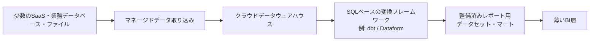

**図2-1：** Case 1におけるマネージドサービス中心構成の一例。少数のデータソースからDWHへ取り込み、SQLベースの変換フレームワークでレポート用データセットやマートを整備し、BI層では主に可視化と参照を担う。

#### 主要コンポーネントの役割

ここでいうマネージドデータ取り込みは、SaaSや業務データベースからデータを取得し、DWHへロードする処理を、できるだけ既存サービスの機能に任せる考え方である。少数のソースを扱う段階では、個別に取り込みスクリプトを作成して監視、認証更新、失敗時の再実行、仕様変更対応まで自前で抱えるよりも、マネージドサービスを利用する方が運用負荷を抑えやすい。

保存先には、クラウドデータウェアハウス（cloud data warehouse）を中心に置く。構造化データをSQLで集計し、定型レポートやBIへ提供する用途では、DWH上で取り込み済みデータ、変換済みデータ、レポート用データセットを管理する構成が分かりやすい。データレイクやレイクハウスを採用しないのは、それらが不要または劣っているからではなく、このCaseで扱うデータ形式、利用目的、運用体制に対して、最初から多様なデータ形式や複数処理エンジンを前提にする必要性が高くないためである。

DWH内では、取り込んだデータをそのままBIへ接続するのではなく、dbtやDataformなどのSQLベースの変換フレームワークを用いて、分析やレポートに使いやすい形へ整える。例えば、取り込み直後のデータ、整形済みの中間データ、レポート用のマートを分けることで、BI側に複雑な結合や業務ロジックを分散させにくくなる。

BI層は、可視化、フィルタ、簡単な集計、利用者への提供を中心にする。BI利用者がレポートごとにSQL、複雑な結合、指標計算を個別に作成すると、同じ指標でもレポートによって数値がずれる可能性がある。そのため、主要な変換や指標定義は、可能な範囲でDWH上の変換層やマート側へ寄せ、BI利用者は整備済みのデータセットやマートを参照できるようにする。

#### 処理方式と復旧方針

処理方式を考えるときは、ソースからDWHへデータを取得する取り込み方式と、DWH上でレポート用データセットやマートを作る変換方式を分けて考える。Case 1では、まず理解しやすく復旧しやすい方式を優先する。データ量や処理時間、コストが許容範囲に収まる場合は、保存先テーブルや変換済みテーブルを毎回作り直すフルリフレッシュを候補にできる。一方で、ソースAPIの制限、データ量、処理時間、更新頻度の都合で、ソースからの全体再取得やDWH上の変換済みテーブルの全体再作成が難しい場合は、更新日時、主キー、連番IDなどを使った単純な増分取り込みや、DWH上で対象範囲を絞って変換・集計する増分処理を検討する。

ただし、このCaseでは、複雑な部分再実行、大規模なバックフィル、多数の依存関係を前提とする設計は中心に置かない。必要な復旧手順は、失敗した取り込みや変換を再実行する、対象テーブルを作り直す、更新失敗を利用者に知らせる、といった単純な運用から始める。

#### 専用オーケストレーターを必須にしない判断

専用オーケストレーターは、処理数と依存関係が少ない段階では必須構成とはしない。処理数が少なく、依存関係も単純であれば、取り込みサービス、DWH、SQL変換フレームワーク、BIツールが持つスケジューリング機能や通知機能で足りる場合がある。専用オーケストレーターを導入しないことで、監視対象、障害箇所、学習コストを抑えられる。

一方で、これは専用オーケストレーターを採用すべきでないという意味ではない。処理数が増える、取り込み完了後に複数の変換を順序制御する必要がある、失敗通知や部分再実行を細かく管理する必要がある、複数チームが同じパイプラインを変更するようになる場合は、Case 2に近い構成として専用オーケストレーションを検討する。

#### 要件と設計判断の対応

このCaseにおける主な要件、必要な能力、設計判断、受け入れるトレードオフは、次のように対応づけられる。

| 要件・制約 | 必要な能力 | 設計判断 | 受け入れるトレードオフ |
|---|---|---|---|
| データソースが少数である | 少数ソースから安定して取り込む | マネージドデータ取り込みを中心にする | 対応ソース、同期方式、エラー処理の一部が利用サービスに依存する |
| 日次または数回／日の更新で足りる | 定期的に一括更新できる | バッチ処理を基本にする | 秒〜分単位の即時反映は前提にしない |
| 構造化データと定型レポートが中心である | SQLで変換・集計し、BIへ提供できる | クラウドDWHを中心に構成する | 非構造化データや複数処理エンジンを共通基盤で扱う前提にはしない |
| 主要指標を安定して提供したい | 変換ロジックと指標定義を管理できる | dbtやDataformなどのSQLベースの変換フレームワークでマートを作る | 変換層の管理、レビュー、命名規則などの運用ルールが必要になる |
| BI利用者がSQLや複雑な結合を自力で作らずに利用できるようにしたい | 整備済みのデータセットやマートを提供する | BI層を薄くし、主要ロジックをDWH側へ寄せる | BI上で利用者が個別に複雑なロジックを作る自由度は抑える |
| 少ない運用工数で保守したい | 障害点と確認箇所を少なくする | 専用オーケストレーターを初期必須にしない | 複雑な依存関係、細かな部分再実行、高度な実行制御は扱いにくくなる |
| 失敗時に復旧しやすくしたい | 再実行手順を単純にする | フルリフレッシュ、または単純な増分取り込み・増分処理を優先する | データ量、処理数、更新頻度が増えると処理時間やコストが増えやすい |

#### この構成で得られるものと限界

この構成の利点は、構成要素が少なく、処理の流れを説明しやすいことである。少数のデータソースからDWHへ取り込み、SQLで整形し、整備済みデータセットやマートをBIへ提供する流れであれば、担当者が確認すべき箇所を限定しやすい。

また、技術選定の目的が「高度な基盤を作ること」ではなく、「必要なレポートを安定して提供し、組織内で保守できる状態を作ること」である点も重要である。Case 1では、Kafka、専用オーケストレーター、レイクハウス、独自の取り込み基盤などを採用しない判断も、要件に合っていれば妥当な設計判断になり得る。

ただし、この構成は万能ではない。ソース数、更新頻度、モデル数、利用部門、再処理要件が増えると、単純な構成では運用しにくくなる。例えば、取り込み完了を待って複数の変換を順序制御する必要がある場合、失敗した一部のモデルだけを安全に再実行したい場合、過去期間を頻繁にバックフィルする場合、または複数部門が同じデータを異なる目的で利用する場合は、Case 2に近い構成を検討する必要がある。

したがって、Case 1の設計判断は、高度な機能を避けること自体を目的とするものではない。現在の要件に対して、どの複雑性をまだ持ち込まないかを明確にし、必要になった時点で構成を拡張できる余地を残すことが重要である。

次節では、この構成を継続運用するうえでの確認箇所、失敗時の復旧方法、そしてCase 1の構成を見直すべき変更トリガーを整理する。

---

### 2.3 運用、トレードオフ、変更トリガー

#### 運用方針

2.2では、Case 1の構成と設計判断を整理した。本節では、それらの判断が日常運用でどのような利点や制約として現れるかを確認し、どの条件になったときにCase 1の構成を見直すべきかを整理する。

Case 1の運用で重視するのは、複雑な運用機能を多く持つことではなく、担当者が処理の流れを理解し、失敗に気づき、必要な範囲を再実行し、利用者へ状況を説明できることである。処理数や依存関係が少ない段階では、専用オーケストレーターや高度な監視基盤を導入しなくても、取り込みサービス、DWH、SQLベースの変換フレームワーク、BIツールが持つ通知やスケジューリング機能で十分な場合がある。

ただし、構成が単純であることは、運用設計が不要であることを意味しない。少なくとも、どの処理がいつ実行されるのか、どのテーブルやマートが更新対象なのか、更新に失敗した場合に誰が確認するのか、利用者へどのように知らせるのかは決めておく必要がある。

#### 確認すべき運用項目

Case 1では、日常運用で次の項目を確認する。

| 運用項目 | 確認すること | 放置した場合のリスク |
|---|---|---|
| 実行状況 | 取り込み、変換、BI更新が予定どおり完了しているか | どの処理で止まったのか分からず、確認や復旧が遅れる |
| データ鮮度 | 主要なテーブルやマートが期待時刻までに更新されているか | 定型レポートやBIの数値が古くなり、利用者が古い値を最新値として参照する |
| 失敗通知 | 取り込み失敗、変換失敗、認証・権限エラーなどが担当者に届くか | 障害に気づけず、利用者からの問い合わせで初めて問題が判明する |
| 復旧手順 | 失敗した処理の再実行、対象テーブルの作り直し、利用者への連絡手順が明確か | 担当者ごとに対応が変わり、復旧に時間がかかる |
| 指標定義 | 主要指標の定義がDWH上の変換層やマート側で管理されているか | BI側や利用者ごとに異なる計算ロジックが増え、数値の一貫性が崩れる |
| 権限管理 | BI利用者、編集者、管理者の権限が分かれているか | 過剰なデータ共有、誤編集、管理者権限の過剰付与が起きる |
| 引継ぎ | 担当者が変わっても、処理の流れと確認箇所を追えるか | 属人的な運用になり、担当者交代や兼務化の際に保守できなくなる |
| コスト | 取り込み、変換、BI、保存の利用量や費用が想定範囲に収まっているか | 小規模な構成でも、不要な実行や保存により継続コストが見えにくくなる |

これらの項目は、すべてを高度な監視基盤で管理しなければならないという意味ではない。Case 1では、対象パイプラインの規模、利用者数、更新頻度、障害時の影響に応じて、取り込みサービス、DWH、SQLベースの変換フレームワーク、BIツールの通知機能や、手順書、定期確認で管理できる範囲を決めることが重要である。

#### 主要なトレードオフ

この構成の利点は、確認すべき箇所を限定しやすいことである。少数のデータソースからDWHへ取り込み、DWH上で変換し、整備済みデータセットやマートをBIへ提供する流れであれば、失敗時にも「取り込みで失敗したのか」「変換で失敗したのか」「BI側の表示や更新で問題が起きているのか」を切り分けやすい。

一方で、マネージドサービス中心の構成では、取り込み方式、対応ソース、エラー処理、同期頻度の一部が利用サービスに依存する。サービス側が対応していないソース、複雑な認証方式、細かな同期条件、特殊なリトライ制御が必要になる場合は、マネージド取り込みだけでは不足する可能性がある。

また、専用オーケストレーターを必須構成にしないことで、構成は単純になり、学習コストや監視対象を抑えられる。しかし、処理数や依存関係が増えると、どの処理がどの処理の完了を待つべきか、失敗した場合にどこから再実行すべきかを管理しにくくなる。特に、取り込み完了後に複数の変換を順序制御し、さらに下流のBI更新や通知まで連動させる必要が出る場合は、Case 2に近い構成を検討する必要がある。

フルリフレッシュや単純な増分取り込み・増分処理を優先する判断にも、運用上のトレードオフがある。フルリフレッシュは処理の意味を理解しやすく、失敗時に対象テーブルを作り直す手順も単純にしやすい。一方で、データ量、処理時間、API制限、DWHの実行コストが増えると、毎回全体を作り直す方式は非効率になりやすい。その場合は、増分取り込みや増分処理、対象範囲を絞った再処理を検討することになる。

BI層を薄くする判断も、単純化だけを意味しない。主要な変換や指標定義をDWH側へ寄せることで、BI利用者がSQLや複雑な結合を自力で作らずに済み、レポート間の数値不一致を抑えやすくなる。一方で、DWH上のマート設計や命名規則、レビュー、変更管理を一定程度整える必要がある。BI側で自由に個別ロジックを作る運用を許容しすぎると、DWH側に寄せた指標定義の意味が弱くなる。

#### 指標・マート変更時の運用と外部支援

データ専門職がいない、またはこのパイプラインに常時関与しない組織・部門では、新しい指標やマートが必要になったときの対応方法も決めておく必要がある。軽微な項目追加や既存指標の名称変更であれば、運用担当者が手順に沿って対応できる場合もある。一方で、新しい業務定義、複数テーブルをまたぐ集計、既存指標との整合性確認、マート設計の変更が必要な場合は、外部支援やデータ専門職によるレビューを利用する方が安全である。

ただし、外部支援を利用する場合でも、機密データ、個人情報、認証情報をそのまま外部へ渡すことは避ける必要がある。可能であれば、サンプルデータ、匿名化・マスキング済みデータ、スキーマ情報、集計済みデータ、業務ルールの説明を使って設計やレビューを進める。外部支援に実データや本番環境へのアクセスを許可する場合は、契約、権限範囲、監査ログ、アクセス期限、責任分界を明確にする必要がある。

重要なのは、BI利用者が各自でロジックを作り始める状態に戻さず、指標やマートの変更を受け付け、確認し、反映する窓口と手順を用意することである。

#### 変更トリガー

Case 1の構成を見直す主な変更トリガーは、次のとおりである。

| 変更トリガー | 現れる問題 | 検討する方向 |
|---|---|---|
| データソースが増える | 取り込み設定、認証、スキーマ変更、失敗対応が増える | Case 2に近い取り込み管理、品質検査、依存関係管理を検討する |
| 更新頻度が高くなる | 日次や数回／日の更新では利用目的を満たせなくなる | より頻繁なバッチ、マイクロバッチ、必要に応じてCase 3に近い低レイテンシ経路を検討する |
| 変換モデルが増える | 実行順序、依存関係、失敗時の影響範囲が分かりにくくなる | 専用オーケストレーター、リネージ、部分再実行の導入を検討する |
| 利用部門が増える | 指標定義、権限、データマート、利用ルールの調整が必要になる | セマンティックレイヤー、権限管理、データ所有者の明確化を検討する |
| 新しい指標やマートの追加依頼が増える | 変更窓口がないとBI側で個別ロジックが増え、指標の一貫性が崩れやすくなる | 変更依頼の窓口、定義レビュー、外部支援の利用、マート変更手順、データ共有範囲を定める |
| バックフィルが頻繁に必要になる | 全体再作成では時間やコストが大きくなる | 対象期間を絞った再処理、増分処理、履歴保持方針を検討する |
| ログ、文書、画像など多様な形式のデータを扱う | DWH中心構成だけでは保存・探索・再利用が難しくなる | データレイクやレイクハウスを含むCase 4に近い構成を検討する |
| 障害影響が大きくなる | 更新失敗が複数部門や業務判断に影響する | 監視、通知、復旧手順、責任範囲、更新期限や復旧目標などの運用基準を検討する |
| 担当者交代や兼務化が発生する | 属人的な手順や暗黙知に依存した運用が難しくなる | 手順書、運用ログ、命名規則、レビュー手順を整備する |

これらの変更トリガーは、Case 1が失敗したことを意味しない。むしろ、利用者、データソース、更新頻度、再処理要件が変わった結果として、必要な能力が変化したと捉えるべきである。

反対に、構成を高度化すればよいとは限らない。利用目的が限定され、更新頻度も低く、利用者も少ないままであれば、専用オーケストレーター、ストリーム処理、レイクハウス、複雑なカタログ基盤を導入しても、得られる効果より運用負荷の方が大きくなる可能性がある。

#### 構成・運用確認のまとめ

ここまでの構成、運用確認、復旧、変更管理の関係をまとめると、次のように整理できる。

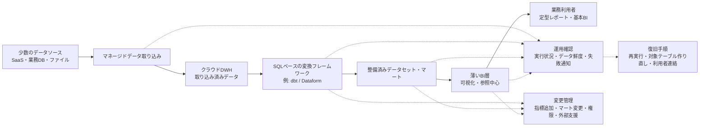

**図2-2：** Case 1におけるパイプライン構成と運用確認箇所の一例。少数のデータソースからDWHへ取り込み、SQLベースの変換フレームワークでレポート用データセットやマートを整備し、BI層では可視化と参照を中心に担う。あわせて、実行状況、データ鮮度、失敗通知、復旧手順、指標やマートの変更管理を確認対象として持つ。

Case 1では、単純な構成を維持することも設計判断の一部である。重要なのは、現在の要件に対して十分な能力を持ち、担当者が継続運用でき、要件が変化したときにどの条件をきっかけとして構成を見直すかを説明できることである。

---

## 3. Case 2：複数部門・複数ソースを扱う成長中のバッチ基盤

### 3.1 組織条件と要件

#### 対象とするパイプライン

Case 2では、複数部門が利用するデータを、複数のデータソースから定期的に取り込み、データウェアハウス（data warehouse: DWH）上で変換・集約し、定型レポート、部門別分析、部門横断指標へ提供するような、成長中のバッチ中心のデータパイプラインを扱う。

このCaseで重視するのは、Case 1より高度な構成を採用することではない。データソース、利用部門、変換モデル、下流レポート、更新期限、再処理要件が増えた結果として、取り込み、変換、品質検査、鮮度確認、失敗通知、部分再実行をより明示的に管理することである。

ここでいうバッチ中心の基盤は、日次処理だけを意味しない。日次、数時間ごと、または決められたスケジュールで、一定範囲のデータをまとめて処理する構成を含む。秒〜数分単位で業務アプリケーションやアラートへ即時反映する低レイテンシ経路は、このCaseの中心要件ではない。

Case 2は、DWHとビジネスインテリジェンス（Business Intelligence: BI）を中心に、複数部門の分析やレポーティングを支える構成として扱う。主な関心は、リアルタイム性や多様なデータ形式への対応ではなく、複数ソースから取り込んだ構造化データを、信頼できる形で整備し、複数部門が継続的に利用できる状態にすることである。

#### 対象とする組織・利用者

このCaseでいう組織も、会社全体だけを指すものではない。大きな組織の複数部門、成長中の事業部、複数拠点をまたぐ業務領域、または部門横断の分析基盤が、このCaseに近い条件を持つ場合がある。

想定する利用者には、営業、マーケティング、カスタマーサクセス、経営管理、プロダクト担当、業務管理者などが含まれる。部門ごとの定型レポートだけでなく、売上、顧客、契約、利用状況、サポート対応、広告効果などを横断して確認する指標が必要になる場合もある。

このCaseでは、小規模なデータチーム、兼務のデータ担当者、部門側のデータ所有者、または外部支援を含めて、パイプラインを継続的に管理する体制が必要になる。ただし、大規模な専門チームが常に存在するとは限らない。重要なのは、単にデータ担当者がいるかどうかではなく、複数部門からの要件変更、指標定義の調整、変換ロジックの保守、障害時の影響確認を継続的に扱えるかである。

複数部門が同じデータを使う場合、誰がデータの意味を説明できるのか、誰がモデルやマートを保守するのか、誰が失敗時に判断するのかを明確にする必要がある。部門ごとに異なる定義で同じ指標を作ると、レポート間で数値がずれ、どれを信頼すべきか分からなくなる可能性がある。

そのため、このCaseでは、DWH上の変換層、共通マート、部門別マート、BI、必要に応じたセマンティックレイヤー（semantic layer）などの役割を分け、指標定義と利用ルールを管理することが重要になる。

#### データ条件と運用上の制約

扱うデータソースは、複数のSaaS（Software as a Service）、アプリケーションデータベース、CSVファイル、スプレッドシート、業務部門が管理するファイルなどを想定する。データ形式は主に構造化データであり、半構造化データを扱う場合でも、DWH上で分析・集計できる範囲に整理されることを前提とする。

Case 1では、少数のデータソースを対象に、日次または数回／日の更新で足りる構成を扱った。Case 2では、データソースの数が増え、部門ごとに更新タイミングや利用目的が異なり、日次だけではなく数時間ごとの更新が必要になる場合がある。

この条件では、単に取り込み処理を増やせばよいわけではない。あるソースの取り込みが遅れると、そのデータに依存する変換モデル、共通マート、部門別レポートにも影響する。取り込み完了前に変換が実行されると、最新データを含まないマートが作られたり、前提となるデータがそろわない状態で品質検査が実行されたりする可能性がある。

また、モデル数やマート数が増えると、どのモデルがどの上流データに依存しているのか、どの下流レポートへ影響するのかを把握しにくくなる。失敗した処理をすべて最初から作り直す方式では、処理時間やコストが大きくなり、更新期限に間に合わない場合がある。

そのため、Case 2では、取り込み完了の確認、変換モデル間の依存関係、データ品質検査、データ鮮度（data freshness）の監視、失敗通知、部分再実行、バックフィル（backfill）を設計上の重要な条件として扱う。

一方で、このCaseでも、構成を複雑にすればよいわけではない。処理数や依存関係がまだ少なく、更新期限も厳しくない場合は、取り込みサービス、DWH、SQLベースの変換フレームワーク、またはそれらの周辺実行基盤が持つスケジューリング機能で十分なこともある。専用オーケストレーターを導入するかどうかは、データ量だけでなく、処理数、依存関係、失敗時の影響範囲、更新期限、運用体制を見て判断する。

#### Case 2での前提

Case 2では、次のような前提を置く。

| 評価軸 | Case 2での前提 |
|---|---|
| 目的と利用者 | 複数部門が利用する定型レポート、部門別分析、部門横断指標が中心 |
| データの特性 | 複数のSaaS、アプリケーションデータベース、ファイルを扱い、構造化データが中心 |
| 鮮度と処理方式 | 日次または数時間ごとのバッチ更新が中心。秒〜分単位の即時反映は主目的ではない |
| 信頼性と再処理 | 失敗通知、部分再実行、バックフィル、データ品質検査、データ鮮度監視が必要になる |
| 組織体制と運用 | 小規模なデータチーム、兼務担当者、部門側担当者が関与し、モデル所有者や障害対応の役割分担が必要になる |
| ガバナンスとコスト | 部門横断で使う指標定義、権限、変更管理を整えつつ、運用負荷とコストを管理する |

#### 適用範囲と境界

このCaseで重視するのは、複数部門・複数ソースのデータを、DWH中心のバッチ基盤として安定して提供することである。主要な論点は、取り込み完了の確認、変換モデルの依存関係、品質検査、鮮度監視、失敗通知、部分再実行、バックフィル、指標定義、部門間の調整である。

Case 2は、Case 1を単純に拡張した上位版ではない。Case 1は、限定された用途に対して、少ない構成要素で継続保守できることを重視する構成である。一方、Case 2は、複数部門と複数ソースにまたがるバッチ処理を、依存関係と再処理を含めて管理する必要がある条件を扱う。どちらが優れているかではなく、対象とする要件が異なる。

また、Case 2は、すべての成長中組織が必ず採用すべき構成でもない。複数部門があっても、対象データが少なく、更新頻度も低く、レポートが限定されているなら、Case 1に近い構成で十分な場合がある。反対に、組織規模が小さくても、複数ソースのデータを部門横断で利用し、依存関係や再処理要件が増えているなら、Case 2に近い構成を検討する理由がある。

このCaseでは、秒〜数分単位で業務アプリケーション、アラート、不正検知、在庫監視などへ反映する低レイテンシ経路は中心に置かない。変更データキャプチャ（Change Data Capture: CDC）やイベントストリーミングを用いて継続的に変更を処理し、重複、遅延、順序入れ替わり、状態管理、リプレイを扱う必要がある場合は、Case 3に近い構成を検討する。

また、ログ、文書、画像、機械学習向けデータ、長期の生データ、複数処理エンジン、データサイエンスや機械学習を含む複数ワークロードを共通基盤で扱うことが主目的になる場合は、Case 4に近い構成を検討する。

したがって、Case 2は、複数部門・複数ソースを扱うDWH中心のバッチ基盤として、どの処理をどの順序で実行し、どのデータを信頼して使い、失敗時にどの範囲を安全に再実行するかを明確にするためのCaseである。

次節では、ここで整理した要件から、必要な能力、構成上の設計判断、受け入れるトレードオフを対応づけて確認する。

---

### 3.2 構成と設計判断

#### 構成方針

Case 2では、複数のSaaS、アプリケーションデータベース、ファイルなどから取得した主に構造化データを、日次または数時間ごとのバッチ処理でDWHへ取り込み、SQLベースの変換フレームワークで整備し、複数部門が利用するデータセット、マート、BIへ提供する構成を想定する。

この条件では、Case 1と同じくDWH中心の構成が候補になる。ただし、扱うデータソース、変換モデル、下流レポート、利用部門が増えるため、単に取り込みと変換を定期実行するだけでは運用しにくくなる。どのソースの取り込みが完了したか、どの変換モデルがどの上流データに依存しているか、どのマートやレポートへ影響するかを管理する必要がある。

そのため、Case 2では、マネージドデータ取り込み、DWH、SQLベースの変換フレームワーク、整備済みデータセット・マート、必要に応じたセマンティックレイヤーやBIに加えて、処理数や依存関係に応じて専用オーケストレーターを検討する。

ただし、専用オーケストレーターは、Case 2で常に必須になるわけではない。重要なのは、ツールを増やすことではなく、取り込み、変換、品質検査、鮮度確認、失敗通知、部分再実行、バックフィルを、組織が理解し継続運用できる形で管理することである。

#### 構成例

このCaseの構成例は、次のように整理できる。

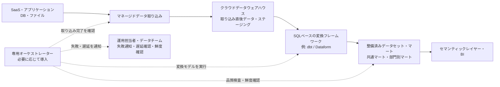

**図3-1：** Case 2における複数部門・複数ソースを扱うバッチ中心構成の一例。複数ソースからDWHへ取り込み、SQLベースの変換フレームワークで共通マートや部門別マートを整備し、必要に応じて専用オーケストレーターで取り込み完了確認、変換実行、品質検査、鮮度確認、失敗・遅延通知を管理する。

#### 主要コンポーネントの役割

マネージドデータ取り込みは、複数のSaaS、アプリケーションデータベース、ファイルなどからDWHへデータをロードする役割を担う。Case 2では、ソース数が増えるため、接続設定、認証、同期頻度、スキーマ変更、取り込み失敗の確認対象も増える。すべてを個別スクリプトで実装すると、保守対象が増えやすいため、可能な範囲ではマネージドサービスを利用して取り込み処理の運用負荷を抑える。

保存先には、Case 1と同様にクラウドデータウェアハウス（cloud data warehouse）を中心に置く。構造化データを複数部門の定型レポート、部門別分析、部門横断指標へ提供する用途では、DWH上で取り込み済みデータ、ステージングデータ、変換済みデータ、共通マート、部門別マートを管理する構成が分かりやすい。

DWH内では、取り込んだデータをそのまま下流へ渡すのではなく、SQLベースの変換フレームワークを用いて、分析やレポートに使いやすい形へ整える。Case 2では、変換モデルの数が増え、モデル間の依存関係も複雑になりやすい。そのため、どのモデルがどの上流データを参照し、どの下流マートに影響するかを追えることが重要になる。

整備済みデータセットやマートは、複数部門が共通して参照するデータと、部門固有の利用目的に合わせたデータを分けて設計する。例えば、顧客、契約、売上、利用状況のように複数部門で使うデータは共通マートとして整備し、営業、マーケティング、カスタマーサクセスなどの部門別分析では、それぞれの利用目的に応じたマートを作る。

セマンティックレイヤーやBIは、利用者が指標やディメンションを一貫した定義で参照するための提供層として位置づける。ただし、セマンティックレイヤーは常に必須ではない。利用部門、指標数、BIレポート数が増え、DWH上のマートだけでは指標定義や利用ルールを十分に統制しにくくなった場合に検討する。

専用オーケストレーターは、取り込み完了の確認、変換モデルの実行、品質検査、鮮度確認、下流更新、失敗通知などをまとめて制御する役割を持つ。Case 2では、処理数や依存関係が増えた場合に候補となる。ただし、処理数が少なく依存関係も単純であれば、取り込みサービス、DWH、SQLベースの変換フレームワーク、またはそれらの周辺実行基盤が持つスケジューリング機能で足りる場合もある。

#### 増分処理、依存関係、再処理の設計

Case 2では、フルリフレッシュだけでは処理時間やコストが大きくなりやすい。データ量、更新頻度、ソースAPIの制限、DWHの実行コスト、更新完了時刻の制約を考えると、増分取り込みや増分処理を検討する必要がある。

増分取り込みは、ソースから追加・変更されたデータだけを取得する考え方である。例えば、更新日時、連番ID、変更ログなどを使って、前回以降に追加または更新されたデータをDWHへ取り込む。これにより、毎回ソース全体を取得する必要を減らせる場合がある。

増分処理は、DWH上で取得済みデータ全体を毎回処理するのではなく、追加・変更された範囲、または影響を受ける範囲だけを変換・集計する考え方である。例えば、特定の日付パーティションだけを再計算したり、新しく取り込まれたレコードに関係する集計だけを更新したりする場合がある。

ただし、増分処理はフルリフレッシュよりも設計が複雑になりやすい。どのデータが新しいのか、どの範囲を再計算するのか、遅れて到着したデータや訂正をどう扱うのかを決める必要がある。単純に新着データだけを追加すると、過去データの訂正、削除、重複、遅延到着を反映できない場合がある。

変換モデル間の依存関係も重要である。ある中間モデルが失敗すると、それを参照する共通マートや部門別マートも正しく作れない。どのモデルを先に実行し、どのモデルが成功したら下流へ進むのか、品質検査が失敗した場合に下流更新を止めるのかを決める必要がある。

再処理の設計では、失敗した処理をすべて最初から作り直すのではなく、必要な範囲だけを安全に再実行できることが重要になる。例えば、特定ソースの取り込みだけを再実行する、特定の変換モデルと下流モデルだけを再実行する、過去の特定期間だけをバックフィルする、といった運用が必要になる場合がある。

そのため、Case 2では、DWHへ取り込んだ直後の未加工またはほぼ未加工のデータ、または再処理に必要な履歴データを一定期間保持し、どの範囲まで処理済みかを追えるようにすることが重要になる。保存していないデータや処理済み範囲を特定できないデータは、後から安全に再処理しにくい。

#### 品質検査とデータ鮮度の管理

Case 2では、データ品質検査とデータ鮮度の管理が、単なる補助機能ではなく、日常運用の中心的な要素になる。

データ品質検査では、主キーの重複、必須項目の欠損、参照関係の不整合、想定外の値、件数の急変などを確認する。品質検査は、データが完全に正しいことを保証するものではないが、下流のマートやBIへ明らかに不適切なデータを流す前に検知するために有効である。

ただし、品質検査が失敗した場合でも、すぐに「データそのものが誤っている」と判断できるわけではない。例えば、上流ソースの更新が遅れていて期待した件数に達していない場合、取り込み処理が途中で失敗している場合、変換ロジックに不具合がある場合、業務上の例外値や異常値として確認すべき値が実際に発生している場合、または品質検査の条件が厳しすぎる場合では、原因も対応も異なる。

そのため、品質検査の失敗時には、下流更新を止めるのか、警告として扱うのか、上流データや取り込み状況を確認するのか、業務担当者やデータ所有者に確認するのか、変換ロジックや検査条件を修正するのかを切り分ける必要がある。

データ鮮度の管理では、主要なテーブルやマートが期待される時刻までに更新されているかを確認する。Case 2では、複数部門が同じデータを参照するため、あるマートが古いまま表示されると、複数のレポートや業務判断に影響する可能性がある。

データ鮮度の確認は、単にジョブが成功したかどうかとは異なる。ジョブが成功していても、上流ソースが更新されていなければ、マートは古いデータをもとに作られている可能性がある。そのため、ジョブの成否だけでなく、ソースデータやマートの更新時刻、件数、期待される到着状況も確認対象にする。

#### 専用オーケストレーションを検討する条件

Case 2では、専用オーケストレーターを導入するかどうかが重要な設計判断になる。

処理数が少なく、依存関係も単純で、更新完了時刻に余裕がある場合は、取り込みサービス、DWH、SQLベースの変換フレームワーク、BIツール、またはそれらの周辺実行基盤が持つスケジューリング機能で十分なことがある。この場合、専用オーケストレーターを追加すると、学習コスト、監視対象、障害箇所が増える可能性がある。

一方で、取り込み完了を待って複数の変換を順序制御する必要がある場合、複数モデルの依存関係を管理する必要がある場合、品質検査の結果によって下流更新を止めたい場合、失敗した範囲だけを再実行したい場合、複数部門へ更新遅延を通知する必要がある場合は、専用オーケストレーションを検討する理由が強くなる。

専用オーケストレーターは、処理を複雑にするために導入するものではない。むしろ、すでに存在している依存関係、失敗時の影響範囲、更新完了時刻、再処理の必要性を明示的に扱うために導入する。

導入を判断するときは、次のような問いを確認する。

- 取り込み完了前に変換が実行されるリスクがあるか
- ある処理の失敗が、どの下流マートやレポートへ影響するかを把握できるか
- 失敗した範囲だけを再実行できるか
- 品質検査の結果に応じて、下流更新を止める、警告にする、または一部だけ更新する判断が必要か
- 更新遅延を誰に、どの粒度で通知する必要があるか
- 新しい変換モデルや品質検査を追加したときに、どの下流モデル、マート、レポートへ影響するかを確認できるか
- 専用オーケストレーター自体を運用できる体制があるか

これらの問いに対して、既存のスケジューリング機能や手順書だけでは管理しにくい場合、専用オーケストレーターを構成に加えることが妥当になり得る。

#### 要件と設計判断の対応

このCaseにおける主な要件、必要な能力、設計判断、受け入れるトレードオフは、次のように対応づけられる。

| 要件・制約 | 必要な能力 | 設計判断 | 受け入れるトレードオフ |
|---|---|---|---|
| 複数のデータソースを扱う | 複数ソースから安定して取り込み、失敗や遅延を検知する | マネージドデータ取り込みを中心にし、ソースごとの同期・遅延・失敗状態を確認する | 対応ソース、同期方式、エラー処理の一部が利用サービスに依存する |
| 日次または数時間ごとの更新が必要である | 定期的にデータを更新し、期待時刻までに主要マートへ反映する | バッチ処理を基本にし、必要に応じて増分取り込み・増分処理を使う | 秒〜分単位の即時反映は前提にしない |
| 変換モデルとマートが増える | モデル間の依存関係と下流影響を把握する | SQLベースの変換フレームワークでモデルを管理し、リネージや依存関係を確認できるようにする | モデル設計、命名規則、レビュー、ドキュメント整備の負荷が増える |
| 複数部門が同じデータを参照する | 指標定義と利用ルールを揃える | 共通マート、部門別マート、必要に応じたセマンティックレイヤーを設計する | 定義変更時の調整や合意形成が必要になる |
| データ品質を安定して確認したい | 欠損、重複、不整合、件数急変などを検知する | 変換工程にデータ品質検査を組み込む | 検査条件の保守、不要な検知、下流更新を止めるかどうかの判断が必要になる |
| データ鮮度を確認・管理したい | 主要テーブルやマートが期待時刻までに更新されているか確認する | データ鮮度監視と失敗・遅延通知を設計する | 監視対象と通知先を増やすほど運用負荷が増える |
| 失敗時に必要な範囲だけ再実行したい | 部分再実行、バックフィル、処理済み範囲の把握ができる | DWHへ取り込んだ直後のデータまたは再処理に必要な履歴データを保持し、モデル依存関係に基づいて再実行する | 保存コスト、再処理手順、履歴管理の複雑性が増える |
| 処理数や依存関係が増えている | 複数処理の順序制御、取り込み完了確認、失敗通知、再実行を管理する | 必要に応じて専用オーケストレーターを導入する | 学習コスト、監視対象、オーケストレーター自体の運用負荷が増える |
| 複数人でモデルやマートを変更する | 変更の影響範囲を確認し、安全に反映する | バージョン管理、レビュー、テスト、命名規則、所有者を整える | 開発・運用ルールの整備と合意形成が必要になる |

#### この構成で得られるものと限界

この構成の利点は、複数部門・複数ソースを扱うバッチ基盤を、DWH中心に整理しながら、依存関係、品質検査、鮮度監視、再処理を明示的に扱えることである。Case 1に比べて、処理数や確認対象は増えるが、複数部門が同じデータを信頼して利用するために必要な管理を行いやすくなる。

また、専用オーケストレーターを必要に応じて導入することで、取り込み完了確認、変換実行、品質検査、鮮度確認、失敗・遅延通知、部分再実行を一つの流れとして管理しやすくなる。これにより、単にジョブを定期実行するだけでは見えにくい依存関係や失敗時の影響範囲を扱いやすくなる。

一方で、この構成はCase 1より運用負荷が増える。モデル設計、品質検査、データ鮮度監視、指標定義、権限、変更管理、再処理手順を整える必要がある。専用オーケストレーターを導入する場合は、そのツール自体の学習、監視、障害対応も運用対象になる。

また、この構成は低レイテンシ処理を主目的とするものではない。秒〜数分単位で業務アプリケーションやアラートへ反映する必要があり、重複、遅延、順序入れ替わり、状態管理、リプレイを扱う場合は、Case 3に近い構成を検討する必要がある。

さらに、多様なデータ形式、未加工データや長期履歴の保持、文書、画像、ログ、機械学習向けデータ、複数処理エンジン、複数ワークロードの共通基盤が主目的になる場合は、DWH中心のバッチ基盤だけでは不足する可能性がある。その場合は、Case 4に近い構成を検討する。

したがって、Case 2の設計判断は、構成を高度化すること自体を目的とするものではない。複数部門・複数ソースを扱うなかで、どの依存関係を明示的に管理し、どの品質条件や鮮度を確認し、失敗時にどこから再実行できるようにするかを決めることが重要である。

次節では、この構成を継続運用するうえでの確認箇所、トレードオフ、責任分界、そしてCase 2の構成を見直すべき変更トリガーを整理する。

---

### 3.3 運用、トレードオフ、変更トリガー

#### 運用方針

Case 2では、複数部門・複数ソースを扱うDWH中心のバッチ基盤を、継続的に信頼して利用できる状態に保つことが運用上の中心になる。

Case 1では、処理数や依存関係が少ないため、失敗した処理を再実行する、対象テーブルを作り直す、利用者へ状況を連絡するといった比較的単純な運用で対応できる場合が多かった。Case 2では、データソース、変換モデル、マート、BIレポート、利用部門が増えるため、どこで失敗したのか、どの下流データに影響するのか、どの範囲を再実行すればよいのかを把握する必要が高まる。

このCaseの運用では、ジョブが成功したかどうかだけでなく、次のような状態を確認する。

- 期待される時刻までに上流データが到着しているか
- 取り込み処理が失敗または遅延していないか
- 変換モデルが正しい順序で実行されているか
- 品質検査が期待どおり機能しているか
- 主要マートやBIレポートが古いデータを参照していないか
- 失敗時に、必要な範囲だけを再実行できるか
- 指標定義やマート変更の影響範囲を説明できるか
- 利用部門へ遅延や不整合を適切に伝えられるか

したがって、Case 2の運用方針は、単に処理を自動化することではない。複数部門が同じデータを使う前提で、実行状態、データ鮮度、品質、依存関係、変更影響、責任範囲を確認できる状態にすることである。

#### 確認すべき運用項目

Case 2では、日常運用で次の項目を確認する。

| 運用項目 | 確認すること | 放置した場合のリスク |
|---|---|---|
| 取り込み状態 | 各ソースの取り込みが成功しているか、遅延していないか、スキーマ変更が発生していないか | 最新データを含まないマートやレポートが作られる |
| 変換実行 | 変換モデルが期待される順序で実行され、必要なモデルが成功しているか | 中間モデルやマートが不完全な状態になる |
| データ品質検査 | 主キー重複、欠損、不整合、件数急変、想定外の値を検知できているか | 誤ったデータが下流のBIや業務判断に使われる |
| データ鮮度 | 主要テーブルやマートが期待時刻までに更新されているか | 複数部門が古いデータを最新値として参照する |
| 依存関係と下流影響 | あるモデルや取り込み処理の失敗が、どのマートやレポートへ影響するか | 障害範囲を説明できず、利用者対応が遅れる |
| 部分再実行 | 失敗した処理、影響を受けたモデル、対象期間だけを再実行できるか | 毎回全体再実行が必要になり、時間とコストが増える |
| バックフィル | 過去期間のデータ訂正やロジック変更を安全に反映できるか | 過去の誤りを修正できない、または修正範囲が不明になる |
| 指標定義 | 部門横断で使う指標の定義、計算ロジック、参照元が明確か | 部門ごとに異なる数値が使われ、信頼性が下がる |
| 権限管理 | 利用者が必要なデータへアクセスでき、不要なデータへアクセスできないか | 機密データの過剰共有、または業務上必要な利用の阻害が起きる |
| 通知と利用者連絡 | 失敗、遅延、品質問題を誰へ、どの粒度で通知するか | 利用者が問題を知らずに古いデータや不完全なデータを使う |
| コスト | 取り込み、変換、品質検査、再処理、保存のコストが想定範囲に収まっているか | 増分処理や監視を追加した結果、運用費用が見えにくくなる |

これらの項目は、すべてを最初から高度な監視基盤で管理しなければならないという意味ではない。重要なのは、対象パイプラインの規模、利用部門、更新頻度、障害時の影響に応じて、どの項目を自動化し、どの項目を手順書や定期確認で管理するかを決めることである。

#### 主要なトレードオフ

Case 2では、複数部門・複数ソースを扱うために、Case 1よりも明示的な管理を増やす。その一方で、管理対象を増やすほど、構成、運用、変更管理は複雑になる。

主なトレードオフは次のとおりである。

| 設計判断 | 得られる利点 | 受け入れるトレードオフ |
|---|---|---|
| マネージドデータ取り込みを使う | 複数ソースの接続、認証、同期、失敗処理を自前で抱えにくくなる | 対応ソース、同期方式、エラー処理、価格体系が利用サービスに依存する |
| DWH中心に構成する | 構造化データの変換、集計、BI提供を一貫して扱いやすい | 非構造化データ、複数処理エンジン、機械学習向けの共通基盤には限界がある |
| 増分取り込み・増分処理を使う | 処理時間やコストを抑えやすくなる | 遅延到着、訂正、削除、重複、処理済み範囲の管理が必要になる |
| データ品質検査を組み込む | 欠損、重複、不整合、件数急変を早期に検知しやすい | 検査条件の保守、過検知、下流更新を止めるかどうかの判断が必要になる |
| データ鮮度を監視する | 古いデータを最新値として利用するリスクを下げられる | 監視対象、期待時刻、通知先を管理する必要がある |
| 共通マートを整備する | 複数部門が同じ指標や参照元を使いやすくなる | 定義変更時に部門間の調整が必要になる |
| 部門別マートを整備する | 各部門の利用目的に合わせたデータを提供しやすい | マートが増えすぎると、重複ロジックや定義のずれが発生しやすい |
| セマンティックレイヤーを導入する | 指標定義や利用ルールをBI利用者へ一貫して提供しやすい | セマンティックレイヤー自体の設計、保守、利用教育が必要になる |
| 専用オーケストレーターを導入する | 依存関係、実行順序、失敗通知、部分再実行を管理しやすくなる | オーケストレーター自体の学習、監視、障害対応が必要になる |
| 複数人開発のルールを整える | 変更の影響範囲を確認し、安全に反映しやすくなる | レビュー、テスト、命名規則、所有者管理などの運用負荷が増える |

このCaseでは、複雑性を避けることだけが目的ではない。すでに複数部門・複数ソース・複数モデルの複雑性が存在している場合、その複雑性を暗黙的な手作業や担当者の記憶に任せるのではなく、どの範囲まで仕組みとして管理するかを判断することが重要である。

#### 部門横断の変更管理と責任分界

Case 2では、複数部門が同じDWH、共通マート、部門別マート、BIレポートを利用するため、変更管理と責任分界が重要になる。

例えば、売上マートの定義を変更すると、営業部門のダッシュボードだけでなく、経営管理、マーケティング、カスタマーサクセスのレポートにも影響する可能性がある。顧客ステータスの判定ロジックを変更すると、解約率、継続率、広告効果、サポート優先度など複数の指標へ影響する場合がある。

そのため、変更時には次を確認する。

- 何を変更するのか
- どの上流データに依存しているのか
- どの下流モデル、マート、BIレポートへ影響するのか
- どの部門がそのデータを利用しているのか
- 変更前後で指標値がどの程度変わるのか
- 変更をいつ反映するのか
- 利用者へ事前に説明する必要があるか
- 問題があった場合に戻せるか

また、責任範囲も明確にする必要がある。すべてをデータチームだけで判断すると、業務上の意味や例外値を判断できない場合がある。一方で、すべてを部門側に任せると、パイプライン全体の依存関係や品質検査、再処理の設計が分断される可能性がある。

役割分担は、次のように整理できる。

| 領域 | 主な責任 |
|---|---|
| データの意味・業務定義 | 業務部門、データ所有者、指標の責任者が確認する |
| 取り込み処理 | データ担当者、データチーム、または外部支援が運用する |
| 変換モデル | モデル所有者またはデータチームが実装・保守する |
| 共通マート | 部門横断で合意した定義に基づき、データチームまたは指定された所有者が管理する |
| 部門別マート | 部門側の利用目的を踏まえ、データ担当者と部門側担当者が調整する |
| データ品質検査 | データチームが仕組みを整備し、業務上の例外値はデータ所有者や業務部門と確認する |
| BIレポート | レポート所有者が利用目的、表示内容、利用者への説明を管理する |
| 権限管理 | 情報システム、セキュリティ担当、データ管理者が組織のルールに沿って管理する |
| 障害時の利用者連絡 | パイプライン運用担当者、レポート所有者、部門側責任者が影響範囲に応じて分担する |

外部支援を利用する場合も、責任をすべて外部へ移せるわけではない。外部支援者は、技術的な調査、実装、運用改善を支援できるが、どの指標を公式なものとするか、業務上の例外値をどう扱うか、誰にどのデータを見せてよいかは、組織側が判断する必要がある。

また、外部支援へ機密データを共有する場合は、契約、アクセス権限、データマスキング、検証用データ、監査ログなどを考慮し、必要以上のデータを渡さないようにする。

#### 変更トリガー

Case 2の構成が適切かどうかは、時間とともに変わる。次のような変化が起きた場合、現在の構成を見直す必要がある。

| 変更トリガー | 見直すべき理由 | 検討する方向 |
|---|---|---|
| データソースがさらに増える | 取り込み状態、スキーマ変更、失敗通知の管理が複雑になる | 取り込み管理、カタログ、オーケストレーション、所有者管理を強化する |
| 変換モデルやマートが増える | 依存関係、下流影響、再実行範囲を把握しにくくなる | モデル設計、リネージ、命名規則、レビュー、専用オーケストレーションの導入・強化を検討する |
| 更新完了時刻が厳しくなる | 日次や数時間ごとのバッチ処理では、業務上の期待に間に合わない可能性がある | 増分処理、マイクロバッチ処理、処理順序、実行資源を見直す |
| 秒〜数分単位の反映が必要になる | DWH中心のバッチ処理だけでは、業務アプリケーションやアラートへの即時反映に対応しにくい | Case 3に近いCDC、イベント連携、低レイテンシ処理を検討する |
| 品質検査の失敗や上流遅延が頻発する | 下流利用者がデータを信頼しにくくなる | 品質検査、鮮度監視、通知、上流責任者との連携を強化する |
| 部門ごとに指標定義が分岐する | 同じ指標名で異なる数値が使われ、意思決定が混乱する | 共通マート、指標定義、セマンティックレイヤー、変更承認を見直す |
| 失敗時に全体再実行が現実的でなくなる | 処理時間、コスト、更新完了時刻の面で復旧が難しくなる | 部分再実行、バックフィル、処理済み範囲の管理を強化する |
| 多様なデータ形式や機械学習向けデータが中心になる | DWH中心構成では、ログ、文書、画像、長期履歴、複数処理エンジンへの対応が不足する可能性がある | Case 4に近いデータレイク、レイクハウス、共通ガバナンス基盤を検討する |
| 利用範囲が縮小する | 現在の構成が過剰になる可能性がある | Case 1に近い単純な構成へ戻す、不要なジョブやマートを削除する |
| 運用担当者が減る、または引継ぎが難しくなる | 専用オーケストレーターや複雑な増分処理を維持できなくなる可能性がある | マネージド機能への寄せ直し、手順の単純化、監視対象の削減を検討する |
| コストが想定を超える | 増分処理、品質検査、再処理、保存、オーケストレーションの費用が継続運用を圧迫する | 実行頻度、保持期間、マート数、再処理範囲、ツール構成を見直す |

変更トリガーは、必ずしも高度な構成へ進む合図ではない。利用目的が限定される、利用者が減る、更新頻度が下がる、運用担当者が減る、コスト制約が厳しくなる場合には、構成を単純化することも妥当な判断になる。

#### 構成・運用確認のまとめ

ここまでの構成、運用確認、品質・鮮度管理、再処理、変更管理の関係をまとめると、次のように整理できる。

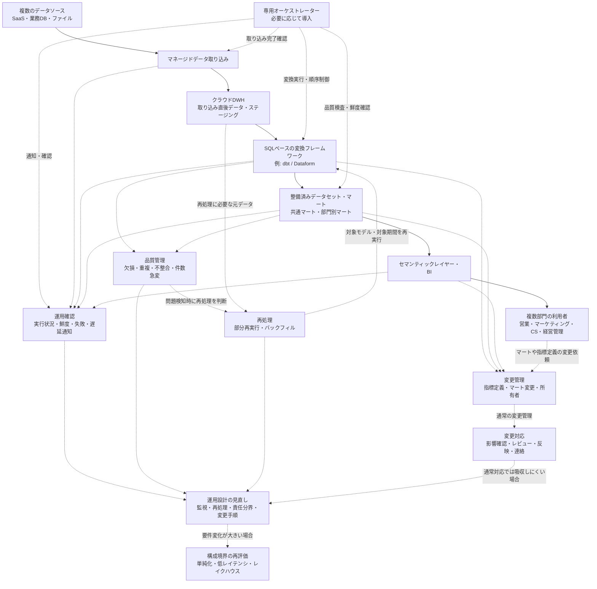

**図3-2：** Case 2におけるパイプライン構成と運用確認箇所の一例。複数のデータソースからDWHへ取り込み、SQLベースの変換フレームワークで共通マートや部門別マートを整備し、セマンティックレイヤーやBIを通じて複数部門へ提供する。あわせて、実行状況、データ鮮度、品質検査、失敗・遅延通知、部分再実行、バックフィル、指標定義やマート変更を確認対象として持つ。マートや指標定義の変更依頼は、まず影響確認、レビュー、反映、利用者連絡として扱い、通常の変更対応では吸収しにくい場合に、監視、再処理、責任分界、変更手順などの運用設計を見直す。さらに要件変化が大きい場合には、構成境界を再評価する。

Case 2では、DWH中心の構成を維持しながらも、Case 1より多くの依存関係、品質検査、鮮度監視、部分再実行、バックフィル、指標定義、変更管理を扱う。

このCaseで特に重要なのは、次の点である。

- 複数ソースの取り込み状態を確認できること
- 変換モデルとマートの依存関係を追えること
- 品質検査の失敗時に、原因と対応を切り分けられること
- 主要テーブルやマートの鮮度を確認できること
- 失敗時に必要な範囲だけを再実行できること
- 部門横断で使う指標定義と所有者を明確にすること
- 変更時に下流マートやレポートへの影響を確認できること
- 専用オーケストレーターを導入する場合でも、それ自体を運用できる体制を持つこと
- 利用目的が変わった場合、Case 1、Case 3、Case 4に近い構成も再検討すること

したがって、Case 2は、Case 1から必ず進化する段階ではない。複数部門・複数ソースを扱うなかで、DWH中心のバッチ基盤としてどこまでを明示的に管理し、どこまでの複雑性を受け入れるかを判断するためのCaseである。

次章では、変更データキャプチャ（Change Data Capture: CDC）やイベントを扱い、秒〜数分単位の低レイテンシで下流へ反映する必要がある場合に、構成と運用上の論点がどのように変わるかを確認する。

---

## 4. Case 3：変更データキャプチャ（Change Data Capture: CDC）・イベントを扱う低レイテンシ基盤

### 4.1 組織条件、要件、対象範囲

#### 対象とするパイプライン

Case 3では、業務システムやアプリケーションで確定したデータ変更、または業務上意味のあるイベントを、秒〜数分単位で下流のアプリケーション、アラート、運用処理、即時指標へ届ける低レイテンシのデータパイプラインを扱う。

ここでいう変更データキャプチャ（Change Data Capture: CDC）は、業務データベースで発生した挿入、更新、削除などの変更を検出し、下流で利用できるようにする方式である。[7][8]

イベント連携では、「注文が確定した」「支払いが完了した」「配送状態が変更された」「権限が変更された」のように、業務上意味のある出来事をイベントとして扱う。[9]

このCaseで重要なのは、Case 2のバッチ基盤を単に高速化することではない。Case 2は、複数部門・複数ソースを扱うDWH中心のバッチ基盤として、取り込み、変換、品質検査、鮮度確認、部分再実行、バックフィルを管理する構成であった。Case 3は、データ量や組織規模に関係なく、確定した変更やイベントを短い時間で下流へ届けること自体が価値を持つ場合に必要になる構成である。

例えば、不正検知、在庫監視、設備異常検知、ユーザー行動に応じた通知、権限変更の反映、プロダクト上の即時指標などでは、翌朝のレポート更新では遅すぎる場合がある。このような場合、日次または数時間ごとのバッチ処理ではなく、CDC、イベント連携、ストリーム処理、または短い間隔のマイクロバッチ処理を検討する理由が生じる。

一方で、低レイテンシ処理は常に必要なわけではない。主な利用目的がBI、定型レポート、部門横断分析であり、数時間後または翌朝までに更新されていれば十分な場合は、Case 2のようなバッチ中心構成の方が単純で運用しやすい場合がある。

CDCはデータベース上の変更を捉える方式であり、すべてのイベント連携がCDCであるわけではない。反対に、業務イベントはアプリケーション側で明示的に発行される場合もあり、必ずしもデータベースの変更ログから生成されるとは限らない。

#### 対象とする組織・利用者

このCaseでいう組織も、会社全体だけを指すものではない。大きな組織の一部業務、プロダクト機能、監視領域、セキュリティ領域、オペレーション領域、または特定のイベント処理パイプラインが、このCaseに近い条件を持つ場合がある。

組織規模が小さくても、確定した注文、支払い、在庫変化、設備異常、権限変更などを短い時間で下流へ反映しなければならない場合は、Case 3に近づく。反対に、大規模な組織であっても、対象が翌朝の定型レポートや数時間ごとの分析更新であれば、Case 2に近い構成で足りる場合がある。

想定する利用者や利用先には、BI利用者だけでなく、業務アプリケーション、アラート、監視システム、運用担当者、カスタマーサポート、セキュリティ担当、不正検知担当、プロダクト担当などが含まれる。低レイテンシ経路では、人間がダッシュボードを見るだけでなく、下流のシステムがイベントや更新結果を受け取り、次の処理や通知を起動する場合がある。

そのため、このCaseでは、データチームだけで完結しにくい。業務状態を確定する上流システムの担当者、アプリケーション開発者、データエンジニア、運用担当者、セキュリティ担当、データ利用者が、どのイベントを正式なものとして扱うか、どの順序で処理する必要があるか、遅延や欠損が起きた場合にどう判断するかをすり合わせる必要がある。

また、低レイテンシ処理を導入するには、ストリーム処理、監視、障害対応、再処理、リプレイ、下流影響確認を継続的に扱える体制が必要になる。これは必ずしも大規模な専門チームを意味しないが、少なくとも、障害時に何を確認し、どこから再処理し、どの利用者やシステムへ影響を伝えるかを説明できる状態が求められる。

#### データ条件と運用上の制約

扱うデータソースは、アプリケーションデータベース（database: DB）、業務システム、イベント生成元、ログ生成元、外部サービスからのイベント通知などを想定する。データの形式は、DBの変更イベント、業務イベント、アプリケーションイベント、JSONなどの半構造化データを含む場合がある。

Case 3では、変更やイベントが発生した後、短い時間で下流へ届けることが要件になる。発生頻度が常に高いとは限らないが、日次や数時間ごとにまとめて処理するのではなく、発生した変更やイベントを随時受け取り、求められる時間内に下流へ反映する必要がある。

この条件では、単にイベントを受け取って処理すればよいわけではない。イベントや変更データには、重複、遅延、順序入れ替わり、再送、欠損、訂正、削除が含まれる可能性がある。イベントブローカーやメッセージングサービスは、イベント生成元と利用側を分離し、配送や一時保持を支援するが、業務上必要な順序、重複排除、冪等性（idempotency）、状態管理、再処理は、下流処理や業務要件に応じて別途設計する必要がある。

例えば、同じ注文に関するイベントが複数回届く場合、下流処理が同じ通知を重複送信しないようにする必要がある。配送状態の変更を扱う場合、古い状態が後から到着したときに現在状態を巻き戻してよいのかを決めなければならない。即時集計を行う場合、遅れて届いたイベントをどの期間の指標へ反映するのかも問題になる。

また、低レイテンシ経路では、処理が継続的に動くため、常時稼働コスト、監視、処理遅延、キューの滞留、イベント保持期間、チェックポイント、再起動時の復旧、リプレイの範囲が運用上の制約になる。さらに、イベントが発生した時刻であるイベント時刻（event time）と、処理基盤がそのイベントを処理した時刻である処理時刻（processing time）は一致するとは限らず、遅延して到着するデータや順序が入れ替わったデータをどう扱うかも問題になる。

このような論点は、The Dataflow Modelでも、終端が決まっておらず、順序がそろわないデータを扱う際の中心課題として整理されている。同論文は、イベント時刻（event time）、ウィンドウ（window）、正確性（correctness）、レイテンシ（latency）、コスト（cost）の間にトレードオフがあることを示しており、低レイテンシ処理では状態と時間の扱いが重要になることを理解する背景文献として有用である。[10]

#### Case 3での前提

Case 3では、次のような前提を置く。

| 評価軸 | Case 3での前提 |
|---|---|
| 目的と利用者 | 確定したデータ変更や業務イベントを、アプリケーション、アラート、運用処理、即時指標へ低レイテンシで届ける |
| データの特性 | アプリケーションDBの変更、業務イベント、アプリケーションイベント、イベント生成元からの継続的なデータを扱う |
| 鮮度と処理方式 | 秒〜数分単位の反映が必要。CDC、イベント連携、ストリーム処理、マイクロバッチ処理が候補になる |
| 信頼性と再処理 | 重複、遅延、順序入れ替わり、リプレイ、冪等性、状態管理、速報値と確定値の分離を考慮する |
| 組織体制と運用 | ストリーム処理、監視、障害対応、リプレイ、下流影響確認を継続運用できる体制が必要になる |
| ガバナンスとコスト | 常時稼働コスト、イベント保持期間、権限、監査、再処理可能性、低レイテンシ化による運用負荷を評価する |

#### 適用範囲と境界

このCaseでは、業務上の状態を作成・更新し、その結果を正式な状態として同期的に確定するトランザクション経路そのものの詳細設計は、原則として対象外とする。注文登録、決済確定、契約更新、権限変更などをどのようにトランザクションとして成立させるかは、業務アプリケーションやトランザクションシステム側の設計領域である。

Case 3の中心対象は、記録の正本システム（System of Record: SoR）や業務アプリケーションが確定した変更、または確定済みの業務イベントを、下流のシステムや利用者へ短い時間で伝播・処理する低レイテンシ経路である。低レイテンシ経路は、上流のトランザクション経路を置き換えるものではない。

また、Case 3では、低レイテンシ経路と分析経路を区別する。低レイテンシ経路は、アラート、即時通知、サービングストア、運用処理、プロダクト機能などへ短い時間で結果を届ける経路である。一方、分析経路は、生イベントや変更履歴をDWHまたはレイクハウスへ保存し、分析、レポーティング、指標計算、機械学習などへ利用する経路である。

両方の経路が常に必要になるわけではない。主な目的がアラートやアプリケーション連携であれば、低レイテンシ経路が中心になる。履歴分析、監査、BI、機械学習向けの特徴量作成にも利用する場合は、同じイベントや変更履歴を分析経路にも保存する必要がある。

反対に、主な利用目的が定型レポートや部門横断分析であり、秒〜数分単位の反映が不要であれば、CDC、イベントブローカー、ストリーム処理を導入することは過剰になり得る。その場合は、Case 2のようなDWH中心のバッチ処理、増分取り込み、増分処理、または短い間隔のマイクロバッチ処理の方が、単純で保守しやすい可能性がある。

また、多様なデータ形式、長期の生データ保持、複数処理エンジン、データサイエンス、機械学習、BIを共通基盤で扱うことが主目的になる場合は、Case 4に近い構成を検討する。Case 3は、低レイテンシで変更やイベントを届けることに焦点を置くCaseであり、レイクハウスや機械学習基盤全体を扱うCaseではない。

したがって、Case 3で追加される複雑性は、Case 2より大規模だから必要になるものではない。確定した変更や業務イベントを短い時間で下流へ届けること自体が価値を持ち、そのために重複、遅延、順序入れ替わり、状態管理、リプレイ、監視、常時稼働コストを受け入れる必要がある場合に、このCaseに近い構成を検討する。

次節では、ここで整理した要件から、CDC、イベントブローカー、ストリーム処理、即時提供用ストア、生イベント保存、分析経路をどのように組み合わせるかを、構成と設計判断として確認する。

---

### 4.2 構成と設計判断

#### 構成方針

Case 3では、業務システムやアプリケーションで確定したデータ変更、または業務上意味のあるイベントを、低レイテンシで下流へ届ける構成を扱う。

このCaseで重要なのは、単に取り込み頻度を短くすることではない。変更やイベントが発生した後、短い時間で下流のアプリケーション、アラート、運用処理、即時指標へ反映する必要があるため、データを一定時間ごとにまとめて処理するバッチ中心構成とは異なる設計判断が必要になる。

代表的には、アプリケーションデータベースの変更を変更データキャプチャ（Change Data Capture: CDC）で取得する経路、またはアプリケーションが業務イベントを明示的に発行する経路を用意し、イベントブローカー（event broker）や取り込みサービスを介して下流へ渡す。そのうえで、低レイテンシ経路ではストリーム処理（stream processing）を中心に、要件によっては短い間隔のマイクロバッチ処理（micro-batch processing）も候補にしながら、必要な検証、フィルタリング、エンリッチメント（enrichment）、重複抑制、状態更新、即時指標の作成を行う。

一方で、Case 3では、低レイテンシ経路だけを作ればよいとは限らない。後から履歴分析、監査、BI、機械学習向けの特徴量作成、障害時の再処理を行うためには、生イベント（raw event）や変更履歴を保存し、分析経路へ渡す必要がある場合がある。

したがって、Case 3の構成では、必要に応じて次の2つの経路を分けて考える。

- 低レイテンシ経路（low-latency path）
  - 確定した変更やイベントを、アプリケーション、アラート、運用処理、即時指標へ短い時間で届ける経路
- 分析経路（analytical path）
  - 生イベントや変更履歴をDWH（data warehouse）またはレイクハウス（data lakehouse）へ保存し、分析、BI、履歴補正、指標計算、機械学習などへ利用する経路

ただし、Case 3で常に分析経路を併設するとは限らない。主な目的がアラート、通知、運用処理、アプリケーション状態の更新であり、履歴保持が監査、障害調査、リプレイのために限られる場合は、低レイテンシ経路を中心とした構成もあり得る。一方で、同じイベントや変更履歴をBI、公式指標、履歴分析、機械学習向け特徴量にも利用する場合は、低レイテンシ経路と分析経路を併用する構成になる。

この2つは、同じイベントや変更履歴を出発点にする場合がある。しかし、処理の目的、許容遅延、変換の粒度、失敗時の復旧方法、利用者は異なる。そのため、低レイテンシ処理と分析用変換を同じものとして扱わず、それぞれの役割を分けて設計する。

#### 構成例

このCaseの構成例は、次のように整理できる。

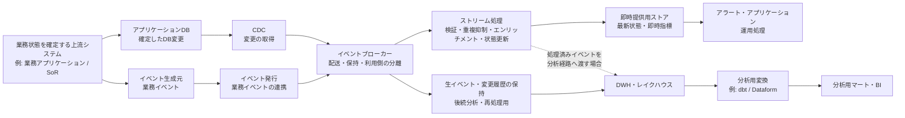

**図4-1：** Case 3におけるCDC・イベントを扱う低レイテンシ基盤の一例。確定した変更や業務イベントをイベントブローカーへ渡し、低レイテンシ経路ではストリーム処理と即時提供用ストアを通じてアラートやアプリケーションへ届ける。一方で、生イベントや変更履歴を保存し、DWHまたはレイクハウス上で分析用変換を行う経路も持つ。

ただし、すべての低レイテンシ構成でイベントブローカーが独立したコンポーネントとして必要になるわけではない。CDCツール、クラウドの取り込みサービス、DWHへの継続取り込み、マイクロバッチ処理などを組み合わせ、より単純な構成で要件を満たせる場合もある。

この図は、理解のために単純化したものである。実際には、CDCから直接DWHへ継続取り込みする構成、イベントブローカーから複数の下流処理へ配信する構成、ストリーム処理済みの結果だけを分析基盤へ保存する構成、または生イベントと処理済みイベントの両方を保存する構成もあり得る。

重要なのは、図の形を固定することではない。どのイベントを低レイテンシに処理し、どのデータを履歴として保存し、どの変換をストリーム処理側で行い、どの変換をDWHやレイクハウス側で行うかを、利用目的と運用可能性に合わせて決めることである。

#### 主要コンポーネントの役割

アプリケーションDBやイベント生成元は、Case 3の起点になる。ただし、ここで扱うのは、業務状態を同期的に確定するトランザクション処理そのものではない。注文、決済、契約、権限変更などの正式な状態を確定するのは、記録の正本システム（System of Record: SoR）や業務アプリケーション側の責任である。Case 3では、その確定済みの変更や業務イベントを下流へ伝播する。

CDCと業務イベント発行は、同じ業務アプリケーションや、対象データのSoRとなるシステムを上流に持つ場合がある。ただし、CDCはDBに確定された変更を取得するのに対し、業務イベント発行はアプリケーション側で業務上意味のある出来事を明示的に発行する点が異なる。

CDCは、業務データベースで発生した挿入、更新、削除などの変更を検出し、下流で利用できるようにする方式である。データベース変更を起点にしたい場合、アプリケーション側へ大きな変更を加えずに変更履歴を取得できる可能性がある。一方で、CDCはデータベース上の変更を捉える方式であり、業務上の意味を持つイベント設計そのものを自動的に解決するわけではない。[7][8]

イベント連携では、アプリケーションや業務システムが「注文が確定した」「支払いが完了した」「配送状態が変更された」のような業務イベントを明示的に発行する。イベントは、発生した出来事を表す記録であり、イベント生成元、イベント利用側、イベントを運ぶチャネルが分かれる。これにより、イベント生成元と下流の利用側を直接結合しすぎず、複数の下流処理へ同じ出来事を伝えやすくなる。[9]

イベントブローカーは、イベント生成元とイベント利用側の間に入り、イベントの受け取り、配送、一時保持、複数利用者への配信を支援する。イベントブローカーを挟むことで、生成元と利用側を時間的・技術的に分離しやすくなる。ただし、イベントブローカーを導入しただけで、業務上必要な単位での順序、重複排除、冪等性（idempotency）、状態管理、再処理が自動的に満たされるわけではない。

ストリーム処理層は、低レイテンシ経路の中心的な処理を担う。例えば、イベントの検証、不要イベントの除外、属性の付与、重複抑制、一定時間内の集計、状態更新、即時指標の作成などを行う。処理によっては、イベント時刻（event time）、処理時刻（processing time）、ウィンドウ（window）、遅延データ、順序入れ替わりを考慮する必要がある。The Dataflow Modelでも、終端が決まっておらず、順序がそろわないデータを扱う際に、正確性（correctness）、レイテンシ（latency）、コスト（cost）の間にトレードオフがあることが整理されている。[10]

即時提供用ストア（serving store）は、アラート、アプリケーション、運用処理などが低レイテンシで参照するための保存先である。DWHは分析や集計に適した基盤である一方、アプリケーションやアラートが短い応答時間で参照する用途では、別の提供先を用意する方が適している場合がある。即時提供用ストアには、最新状態、直近集計、通知判定に使う結果などを保持する。

生イベントや変更履歴の保存は、分析、監査、障害調査、リプレイ、後続の再処理のために重要になる。低レイテンシ経路で利用したイベントをすぐに破棄すると、後からロジックを修正して再処理したり、過去のイベントに基づいて指標を再計算したりすることが難しくなる。保存期間、保存形式、スキーマ、個人情報や機密情報の扱いは、要件に応じて決める必要がある。

DWHまたはレイクハウスは、分析経路の保存・変換基盤として利用される。構造化データ中心でBIや定型分析が主目的であればDWHが候補になる。一方で、多様な形式の生イベント、長期履歴、複数ワークロード、機械学習向けの利用が重要になる場合は、Case 4に近い共通データ基盤として、必要に応じてレイクハウスを含む構成を検討する理由が生じる。

分析用変換では、dbtやDataformなどを用いて、DWHまたはレイクハウスに保存したイベントや変更履歴を、分析やBIで利用しやすい形に整える。ここで扱うのは、低レイテンシ経路での即時処理とは異なり、業務定義、履歴補正、確定値の作成、分析用マート、指標定義などである。したがって、Case 3で低レイテンシ経路を導入しても、履歴分析やBIが必要な場合には、分析用変換が不要になるわけではない。

#### 低レイテンシ経路と分析経路の役割分担

低レイテンシ経路では、イベントや変更データを短い時間で処理し、下流のアプリケーション、アラート、運用処理へ提供する。ここでは、処理の遅延、イベントの滞留、重複処理、状態更新、通知の重複、古いイベントの扱いが問題になりやすい。

例えば、在庫監視では、在庫数がしきい値を下回ったことを短い時間で検知し、通知や補充判断へつなげる必要がある。不正検知では、支払い、ログイン、権限変更、利用行動などのイベントを短い時間で評価し、アラートや追加確認へつなげる場合がある。これらの用途では、後からBIで分析できることだけでは不十分であり、イベント発生後すぐに判断や通知へつなげる低レイテンシ経路が必要になる。

ただし、これらの用途でも分析経路が不要になるとは限らない。検知件数、誤検知、在庫変動、不正傾向、対応結果などを後から分析する場合は、同じイベントや処理結果をDWHまたはレイクハウスへ保存し、分析用に整備する経路も必要になる。

一方、分析経路では、同じイベントや変更履歴を蓄積し、後から分析、監査、レポーティング、指標計算、機械学習などに利用する。ここでは、低レイテンシであることよりも、履歴の完全性、定義の一貫性、再現性、訂正の反映、確定値の作成が重要になる場合が多い。

このため、ストリーム処理で作る速報値と、DWHやレイクハウス上で後から作る確定値は分けて扱う必要がある。速報値は、短い時間で判断するために有用である一方、遅延イベント、訂正、キャンセル、重複排除、締め処理などを完全には反映していない場合がある。公式レポートや会計に近い用途では、分析経路で確定ロジックを適用した値を信頼できる参照元（Source of Truth: SoT）として扱う方が適切な場合がある。

また、低レイテンシ経路と分析経路の両方を持つ場合、同じ業務ロジックを二重に実装して数値がずれるリスクがある。例えば、ストリーム処理側で即時指標を計算し、DWH側でも同じ指標を別実装で計算すると、遅延イベント、丸め、キャンセル、重複排除の扱いが異なり、速報値と確定値の差分を説明しにくくなる。

そのため、どのロジックを低レイテンシ経路で実行し、どのロジックを分析経路で実行するかを明確にする必要がある。低レイテンシ経路では、通知、即時判定、暫定的な状態更新など、時間価値が高い処理に絞る。分析経路では、公式指標、履歴補正、複雑な業務定義、部門横断の分析マートなどを担う。この分担により、低レイテンシの価値を得つつ、分析結果の説明可能性を保ちやすくなる。

#### イベント処理で追加される設計論点

CDCやイベント連携を採用すると、Case 2のバッチ基盤とは異なる設計論点が増える。

第一に、イベントの粒度を決める必要がある。データベースの行変更をそのまま下流へ渡すのか、アプリケーション側で業務上意味のあるイベントとして発行するのかによって、下流の扱いやすさは変わる。CDCは変更を捕捉するには有効だが、変更の業務上の意味を読み解く責任が下流に移る場合がある。業務イベントは意味を明示しやすい一方、上流アプリケーション側でイベント設計と発行責任を持つ必要がある。

第二に、イベントのキーと順序を決める必要がある。すべてのイベントについて全体順序を保証することは、必要とも限らず、現実的でない場合もある。実務上は、注文ID、顧客ID、契約ID、設備IDなど、業務上順序が重要な単位を決め、その単位で古い状態をどう扱うかを設計することになる。

第三に、重複と冪等性を考える必要がある。同じイベントや変更が複数回届いても、下流の状態や通知が壊れないようにする必要がある。例えば、同じ支払い完了イベントを複数回処理しても、二重に通知しない、二重に集計しない、二重に状態更新しないようにする。これはイベントブローカーだけでなく、下流処理、保存先、業務ロジック側の設計にも関係する。

第四に、イベント時刻と処理時刻を分ける必要がある。イベントが発生した時刻と、処理基盤がそのイベントを処理した時刻は一致しない。遅延して届いたイベントを、発生時刻に基づいて過去の集計へ反映するのか、処理時刻に基づいて現在の集計へ反映するのかによって、指標の意味は変わる。ウィンドウ集計や速報値を扱う場合、この違いは特に重要になる。

第五に、状態管理とチェックポイント（checkpoint）を設計する必要がある。ストリーム処理では、直近の状態、過去のイベント、集計途中の値、どこまで処理したかを持ちながら継続処理する場合がある。障害時にどこから再開するか、再開時に重複処理が起きても結果が壊れないか、状態をどの期間保持するかは、設計上の重要な判断になる。

第六に、リプレイとバックフィルの関係を整理する必要がある。保存済みイベントを再投入して処理し直すリプレイは、イベント処理のロジック変更や障害復旧で重要になる。一方、過去期間の分析用テーブルや指標を再計算するバックフィルは、分析経路で重要になる。両者は似ているが、リプレイはイベント列の再処理、バックフィルは過去期間の結果再作成という違いがある。

第七に、速報値と確定値を分ける必要がある。低レイテンシ経路では、遅延イベントや訂正を待たずに暫定値を提供することがある。一方、分析経路では、一定期間を締めた後に確定値を作る場合がある。この差を明示しないと、利用者は速報値と公式値の違いを理解できず、数値不一致として受け取る可能性がある。

#### 要件と設計判断の対応

Case 3では、要件、必要な能力、設計判断、受け入れるトレードオフの対応を次のように整理できる。

| 要件・制約 | 必要な能力 | 設計判断 | 受け入れるトレードオフ |
|---|---|---|---|
| 確定したDB変更を短い時間で下流へ届けたい | DB上の挿入、更新、削除を継続的に取得する能力 | CDCを用いて、アプリケーションDBに確定された変更を下流へ渡す | DBスキーマ変更、主キー、削除、更新順序が下流処理へ影響しやすくなる |
| 業務上意味のある出来事を下流へ伝えたい | 業務イベントの意味、キー、発生条件、スキーマを定義する能力 | アプリケーション側で業務イベントを明示的に発行する | 上流アプリケーション側でイベント設計と発行責任を持つ必要がある |
| 複数の下流処理へ同じイベントを配信したい | 生成元と利用側を分離し、複数の利用者へイベントを届ける能力 | イベントブローカーや取り込みサービスを挟み、配送、保持、利用側の分離を行う | イベント契約、スキーマ変更、利用者管理、滞留監視が必要になる |
| アラートやアプリケーションへ低レイテンシで反映したい | 到着したイベントを短い時間で検証、変換、状態更新する能力 | ストリーム処理を中心に、必要に応じて短い間隔のマイクロバッチ処理も候補にする | 処理遅延、滞留、状態管理、チェックポイント、常時監視の負荷が増える |
| 最新状態や即時指標を下流から参照したい | アプリケーションやアラートが短い応答時間で参照できる状態を保持する能力 | 即時提供用ストアを用意し、最新状態、直近集計、通知判定結果などを保持する | DWHとは別の提供先を持つため、更新失敗、不整合、権限管理を監視する必要がある |
| 履歴分析や監査にも使いたい | 生イベントや変更履歴を欠損なく保持し、後から参照できる能力 | 生イベントや変更履歴を保存し、必要に応じてDWHまたはレイクハウスへ渡す | 保存コスト、保持期間、個人情報や機密情報、スキーマ変更への対応が必要になる |
| BIや公式指標にも使いたい | 低レイテンシ処理とは別に、履歴補正、業務定義、確定値を作る能力 | 分析経路でdbtやDataformなどを用いて分析用マートを作る | 低レイテンシ経路の速報値と、分析経路の確定値を分けて説明する必要がある |
| 重複や再送が起こり得る | 同じイベントを複数回処理しても結果を壊さない能力 | イベントID、業務キー、処理済み記録などを用いて重複抑制と冪等性を設計する | 下流処理、保存先、通知制御まで含めて冪等性を考える必要がある |
| 順序入れ替わりや遅延イベントが起こり得る | 業務上順序が重要な単位と、遅延許容範囲を定義する能力 | 業務キー、イベント時刻、処理時刻、ウィンドウ、遅延許容範囲を決める | 全体順序を前提にできず、キー単位の順序や古いイベントの扱いを設計する必要がある |
| 障害やロジック変更後に処理し直したい | 保存済みイベントや変更履歴から安全に再処理する能力 | リプレイとバックフィルの範囲、再処理手順、通知抑制、状態再作成方針を設計する | 再処理時の二重通知、状態不整合、速報値と確定値の差分確認が必要になる |
| 常時稼働コストと運用負荷が増える | 低レイテンシが本当に必要な処理を見極める能力 | 低レイテンシ経路へ載せる処理を限定し、BIや履歴分析は分析経路へ寄せる | すべてをリアルタイム化できるわけではなく、用途ごとに鮮度と複雑性を使い分ける必要がある |

この対応表で重要なのは、すべての要件に対して最も複雑な構成を選ぶことではない。低レイテンシで届ける必要がある処理だけを低レイテンシ経路へ載せ、履歴分析や公式指標は分析経路へ寄せることで、複雑性を必要な場所に限定する。

#### この構成で得られるものと限界

この構成で得られる主な利点は、確定した変更や業務イベントを短い時間で下流へ届けられることである。これにより、在庫監視、不正検知、運用アラート、ユーザー行動に応じた通知、プロダクト上の即時指標など、時間価値の高い処理を実現しやすくなる。

また、イベントブローカーを挟むことで、イベント生成元と複数の利用側を分離しやすくなる。上流システムは、下流のすべての利用先を直接知る必要がなくなり、下流側も必要なイベントを購読して処理を追加しやすくなる。ただし、この分離は設計上の柔軟性を高める一方で、イベント契約、スキーマ変更、権限、監視、障害時の影響確認を必要とする。

生イベントや変更履歴を保存すれば、後から分析、監査、リプレイ、バックフィルに利用しやすくなる。低レイテンシ経路で障害が起きた場合や、処理ロジックを変更した場合にも、保存済みイベントを使って再処理できる可能性がある。ただし、イベントを長期間保持するほど、保存コスト、個人情報や機密情報の管理、スキーマ変更への対応、データ利用ルールの整備が必要になる。

この構成の限界は、低レイテンシ化によって運用上の複雑性が大きく増えることである。処理遅延、滞留、重複、順序入れ替わり、状態管理、チェックポイント、リプレイ、速報値と確定値の差分説明など、Case 2では中心ではなかった論点が日常運用に入ってくる。

また、CDCやイベントブローカーを導入しても、業務上の正しさが自動的に保証されるわけではない。どの変更をどのイベントとして扱うのか、どの順序を守る必要があるのか、どこまでの遅延を許容するのか、同じイベントを複数回処理しても壊れないかは、業務要件と下流処理に応じて設計する必要がある。

したがって、この構成は、低レイテンシで届けること自体に明確な価値がある場合に採用候補となる。主な利用目的が定型レポートや部門横断分析であり、数時間後または翌朝までに更新されていれば十分であれば、Case 2のようなバッチ中心構成、または短い間隔のマイクロバッチ処理の方が、単純で保守しやすい場合がある。

次節では、この構成を継続運用するために、監視、障害対応、リプレイ、責任分界、トレードオフ、変更トリガーを整理する。

---

### 4.3 運用、トレードオフ、変更トリガー

#### 運用方針

Case 3では、確定したデータ変更や業務イベントを、低レイテンシで下流のアプリケーション、アラート、運用処理、即時指標へ届ける。そのため、運用で確認すべきことは、単に「ジョブが成功したか」だけではない。

重要なのは、イベントや変更データが、上流で発生してから下流で利用可能になるまで、どこで遅延し、どこで滞留し、どの処理まで完了しているかを継続的に把握することである。バッチ中心の構成では、日次や数時間ごとの処理完了を確認すれば足りる場合がある。一方、Case 3では、イベントブローカー、ストリーム処理、即時提供用ストア、生イベントや変更履歴の保持、分析経路がそれぞれ別の状態を持つ。

このため、Case 3の運用では、次の観点を分けて確認する。

- 上流の業務アプリケーションやSoRで、業務状態が正しく確定しているか
- CDCやイベント発行によって、確定した変更や業務イベントが下流へ渡っているか
- イベントブローカーや取り込みサービスで、イベントが滞留していないか
- ストリーム処理が、重複、遅延、順序入れ替わり、状態管理を考慮しながら処理できているか
- 即時提供用ストアが、アプリケーションやアラートで利用できる状態を維持しているか
- 生イベントや変更履歴が、監査、リプレイ、バックフィル、分析用変換のために保持されているか
- 分析経路がある場合、速報値と確定値の差分を説明できるか

特に注意すべきなのは、低レイテンシ経路の失敗と、上流のトランザクション処理の失敗を混同しないことである。Case 3で扱うのは、原則として、上流で確定した変更や業務イベントを下流へ伝播・処理する経路である。注文、決済、契約、権限変更などの業務状態を同期的に確定する責任は、業務アプリケーションや対象データのSoR側にある。

したがって、障害調査では、まず「業務状態が確定していない」のか、「確定した状態が下流へ届いていない」のか、「届いたイベントの処理や提供に失敗している」のかを切り分ける必要がある。この切り分けができないと、データパイプライン側で修正すべき問題と、上流業務システム側で修正すべき問題を混同してしまう。

#### 確認すべき運用項目

Case 3では、監視対象が複数の層に分かれる。日常運用では、次の項目を確認する。

| 運用項目 | 確認すること | 放置した場合のリスク |
|---|---|---|
| 上流の業務アプリケーション・SoR | 対象データや業務イベントが想定どおり発生しているか | 上流で業務状態が確定していない問題を、下流の遅延、欠損、処理失敗として誤認し、対応箇所を誤る |
| CDC・イベント発行 | DB変更や業務イベントが下流へ渡っているか、取得遅延がないか | 確定済みの変更やイベントが下流へ届かず、即時指標、アラート、アプリケーション状態が実際の業務状態から遅れる |
| イベントブローカー・取り込みサービス | イベントの滞留、配送失敗、保持期間、利用側の遅れ | イベントが蓄積または失われ、下流処理が追いつかなくなる。保持期間を超えると、後から処理を追いつかせられない場合がある |
| ストリーム処理 | 処理遅延、処理失敗、チェックポイント、状態の肥大化、重複処理 | 古いイベントで状態を上書きする、同じイベントを二重処理する、障害後に正しい位置から再開できないなど、下流の状態が不整合になる |
| 即時提供用ストア | 最新状態、直近集計、参照応答、更新失敗 | アプリケーションやアラートが古い状態、不完全な集計、または更新途中の値を参照し、誤通知や誤った業務判断につながる |
| 生イベント・変更履歴の保持 | 保存期間、スキーマ、欠損、再利用可能性 | 障害、ロジック変更、誤処理の発覚後に、対象期間をリプレイできず、即時提供用ストアや分析用データを再作成できなくなる |
| 分析経路 | DWH・レイクハウスへの反映、分析用変換、確定値作成 | 速報値と確定値の差分を検証できず、BI、公式指標、監査、後続分析でどの値を信頼すべきか説明できなくなる |
| 権限・機密情報 | イベント内の個人情報、機密情報、参照権限 | 低レイテンシ経路や保存済みイベントを通じて、不要な個人情報や機密情報が複数の下流処理へ広がり、後から削除・制御しにくくなる |
| 通知・アラート | 何を異常として通知するか、どの重大度で扱うか、誰が対応するか | 通知が多すぎるとアラート疲れが起き、少なすぎると重大な遅延、停止、誤処理を検知できない。結果として、対応すべき問題の優先度判断や初動が遅れる |

低レイテンシ経路では、単に処理が失敗したかどうかだけでなく、処理が遅れているが止まってはいない状態も重要になる。イベントが継続的に到着する構成では、処理が成功していても、到着量に処理能力が追いつかなければ、下流へ反映されるまでの遅延が増える。

また、すべての遅延が同じ重大度を持つわけではない。アラートや不正検知のように、数分の遅れで業務価値が下がる処理もあれば、後続の分析経路であれば多少の遅れを許容できる場合もある。そのため、どの経路で、どの程度の遅延を異常とみなすかを、利用目的ごとに決める必要がある。

#### 主要なトレードオフ

Case 3では、低レイテンシを得る代わりに、バッチ中心構成には少なかった複雑性を受け入れることになる。

第一に、鮮度と運用複雑性のトレードオフがある。秒〜数分単位でイベントを反映できる構成は、在庫監視、不正検知、運用アラート、プロダクト機能などには有効である。一方で、イベントブローカー、ストリーム処理、状態管理、即時提供用ストア、監視、リプレイ手順を継続的に運用する必要がある。数時間後や翌朝の更新で十分な用途であれば、この複雑性を受け入れる理由は弱い。

第二に、速報値と確定値のトレードオフがある。低レイテンシ経路では、遅延イベント、訂正、キャンセル、重複排除、締め処理を待たずに、暫定的な値を提供することがある。これは短時間で判断するためには有用である。しかし、公式レポートや会計に近い用途では、分析経路で確定ロジックを適用した値を使う方が適切な場合がある。

第三に、柔軟性と責任分界のトレードオフがある。イベントブローカーを挟むと、上流のイベント生成元と複数の下流処理を分離しやすくなる。下流処理を追加しやすくなる一方で、イベント契約、スキーマ変更、保持期間、権限、障害時の影響範囲を管理する必要がある。下流の利用者が増えるほど、「誰がイベントの意味を保証するのか」「誰がスキーマ変更を通知するのか」「誰が遅延や欠損の影響を判断するのか」が重要になる。

第四に、リプレイ可能性と保存コストのトレードオフがある。生イベントや変更履歴を長く保持すれば、障害後の再処理、ロジック変更後の再計算、監査、分析に利用しやすくなる。一方で、保存コスト、個人情報や機密情報の管理、スキーマ変更への対応、データ利用ルールの整備が必要になる。

第五に、低レイテンシ経路と分析経路の二重実装リスクがある。同じ業務ロジックをストリーム処理側とDWH・レイクハウス側で別々に実装すると、速報値と確定値の差が意図したものなのか、実装差分によるものなのかを説明しにくくなる。そのため、低レイテンシ経路では即時判断に必要なロジックへ絞り、公式指標や複雑な履歴補正は分析経路へ寄せるなど、役割分担を明確にする必要がある。

これらのトレードオフを整理すると、次のようになる。

| 得られるもの | 受け入れる複雑性 |
|---|---|
| 下流のアプリケーション、アラート、運用処理へ、確定した変更や業務イベントを短時間で届けられる | CDC、イベント発行、イベントブローカー、ストリーム処理の各層で、処理遅延、滞留、配送失敗を継続的に監視する必要がある |
| 在庫監視、不正検知、ユーザー通知、運用アラートなど、時間価値の高い処理を実現しやすくなる | 重複イベント、遅延イベント、順序入れ替わり、冪等性、状態管理を考慮して、誤通知や状態不整合を防ぐ必要がある |
| イベント生成元と複数の下流処理を分離し、同じイベントを複数用途で利用しやすくなる | イベントの意味、スキーマ、利用者、保持期間、下流影響を管理し、変更時に利用側へ影響を伝える必要がある |
| 生イベントや変更履歴を保持することで、障害後のリプレイ、ロジック変更後の再処理、監査、分析に利用しやすくなる | 保存コスト、保持期間、スキーマ変更、個人情報や機密情報の扱い、再処理手順を設計する必要がある |
| 低レイテンシ経路で速報値を提供し、必要に応じて分析経路で確定値を作れる | 速報値と確定値の定義、作成タイミング、差分理由、利用場面を明確にし、利用者に使い分けを説明する必要がある |

#### 低レイテンシ処理の障害対応とリプレイ

Case 3では、障害対応を「失敗したジョブを再実行する」だけで考えると不十分である。イベントや変更データは継続的に到着するため、障害時には、どの時点まで処理済みか、どのイベントを再処理するか、再処理によって重複や順序の問題が起きないかを確認する必要がある。

障害対応では、まず障害箇所を切り分ける。

| 障害箇所 | 代表的な問題 | 主な確認 |
|---|---|---|
| 上流の業務アプリケーション・SoR | 業務状態が確定していない、DB更新が行われていない、業務イベント自体が発生していない | 上流の処理結果、対象レコードの状態、DB更新有無、イベント発行条件、上流側のエラー |
| CDC・イベント発行 | 変更取得が止まる、一部の変更が取得されない、イベント発行が失敗する、スキーマ変更で下流処理が壊れる | 取得位置、接続状態、認証、対象テーブルやカラムの変更、イベント発行ログ、取得遅延、欠損や重複の有無 |
| イベントブローカー・取り込みサービス | 配送遅延、イベント滞留、保持期間超過、利用側の処理遅れ、特定の下流処理だけが追いつかない | 滞留量、保持期間、利用側の処理位置、配送失敗、再処理可能な範囲、下流利用者ごとの遅れ |
| ストリーム処理 | 処理失敗、処理遅延、チェックポイント不整合、状態の破損、重複処理、古いイベントによる状態更新 | 処理済み位置、再開位置、状態ストア、エラー内容、重複処理の有無、遅延イベントや順序入れ替わりの扱い |
| 即時提供用ストア | 更新失敗、部分更新、古い状態の参照、二重更新、参照不能、アプリケーション側との不整合 | 最終更新時刻、キー単位の状態、更新件数、重複更新の有無、参照応答、下流アプリケーションが見ている値 |
| 分析経路 | 生イベントや変更履歴が保存されない、DWH・レイクハウスへの反映が遅れる、分析用変換が失敗する、確定値を作れない | 生イベント保存状況、DWH・レイクハウスへの反映状況、分析用テーブル、変換ジョブ、バックフィル範囲、速報値と確定値の差分 |

次に、復旧方法を選ぶ。短時間の一時障害であれば、再試行や処理再開で足りる場合がある。一方、処理ロジックの誤り、状態の破損、重複処理、古いイベントによる誤更新、スキーマ変更への未対応がある場合は、保存済みイベントや変更履歴を使って、対象範囲をリプレイする必要が生じる場合がある。

ただし、リプレイは、再処理に必要なイベントや変更履歴が保持されている場合に成立する。そもそもイベントが取得・保存されていない場合や、保持期間を超えて失われている場合は、リプレイだけでは復旧できない。その場合は、上流のSoRからの再取得、補正データの投入、CDC取得位置の確認、分析経路側のバックフィルなど、別の復旧方法を検討する必要がある。

リプレイを行う場合は、少なくとも次を決める必要がある。

- どのイベントまたは変更履歴を再投入するか
- どの時点、どのキー、どの対象範囲から再処理するか
- 処理済みイベントをどのように判定するか
- 同じイベントを再処理しても結果が壊れないか
- 即時提供用ストアの状態を再作成するのか、現在の状態へ差分適用するのか
- リプレイ中に新しいイベントの処理を止めるのか、並行して処理するのか
- リプレイ後に通常処理へどのように追いつくか
- 分析経路のバックフィルと範囲を合わせる必要があるか
- リプレイ後に、速報値、確定値、下流通知、即時提供用ストアの状態をどう確認するか

特に、アラートや通知を含む低レイテンシ経路では、リプレイ時に同じ通知を再送してよいかを事前に決める必要がある。例えば、不正検知イベントを再処理した結果、過去のアラートを再度送ると、運用担当者や利用者に混乱を与える場合がある。そのため、リプレイ時には、通知を抑制する、検証用の出力先へ流す、処理済み記録を参照する、通知だけは再実行対象から外すなどの制御が必要になる。

また、リプレイとバックフィルは分けて考える。リプレイは、保存済みイベントや変更履歴を再投入して、低レイテンシ経路や状態更新を再処理する考え方である。バックフィルは、過去期間の分析用テーブルや指標を再計算するだけでなく、モデル変更や列追加によって新たに必要になった値を、保存済みデータから過去分に対して埋め直す場合にも使われる。ただし、過去時点で必要な情報が保存されていなかった場合は、完全なバックフィルはできず、NULL、既定値、推定値、または適用開始日を明示して扱う必要がある。両者は同時に必要になる場合があるが、目的と影響範囲は異なる。

例えば、ストリーム処理のロジックを修正して即時提供用ストアの状態を作り直す場合は、リプレイが中心になる。一方で、同じ期間のBI用マートや公式指標も修正する必要がある場合は、分析経路側でバックフィルも必要になる。このとき、リプレイ対象期間とバックフィル対象期間がずれていると、速報値、確定値、BI上の数値の差分を説明しにくくなる。

#### 変更管理と責任範囲

Case 3では、イベントや変更データの意味が下流処理へ直接影響するため、変更管理と責任分界が重要になる。

まず、上流の業務アプリケーションやSoRの所有者は、どの業務状態を正式に確定するのか、どのDB変更や業務イベントを下流へ渡すのかに責任を持つ。イベント発行を採用する場合は、どの出来事をイベントとして定義するか、イベント名、キー、必須項目、発生条件、スキーマ変更方針を管理する必要がある。

CDCを採用する場合は、DBスキーマ変更が下流へ与える影響を管理する必要がある。CDCはDB上の変更を捕捉するため、テーブル構造、カラム名、型、削除の扱い、主キー、更新日時、論理削除の方針が変わると、下流の変換や重複排除、状態更新に影響する場合がある。

イベントブローカーや取り込み基盤の所有者は、配送、保持、利用側の分離、権限、監視、障害時の影響確認を担う。利用側が増えるほど、イベントを誰が利用しているのか、どの処理がどのイベントに依存しているのかを把握する必要がある。

これはDWH内のモデリングで、変更頻度や責任主体の異なる属性を分離し、不要な下流マートへの影響を抑える考え方に近い。イベント設計でも、下流の多くが依存する安定したイベント契約と、変更されやすい属性や用途別の情報を分けることで、変更時の影響範囲を局所化できる。

ただし、分離しすぎると下流処理が複数イベントや複数テーブルを組み合わせなければ意味を復元できなくなる。そのため、変更頻度、利用者数、責任主体、履歴管理の粒度を見て、安定した共通イベントとして扱う部分と、用途別・変更頻度別に分ける部分を判断する必要がある。

ストリーム処理の所有者は、検証、重複抑制、エンリッチメント、状態更新、即時指標、チェックポイント、リプレイ手順を管理する。処理ロジックを変更する場合は、既存状態をそのまま使えるのか、状態の再作成が必要なのか、リプレイが必要なのかを判断する。

分析経路の所有者は、生イベントや変更履歴をDWHまたはレイクハウスへ保存し、分析用変換、公式指標、BI、確定値作成を管理する。速報値と確定値が異なる場合は、その差分が仕様上の差なのか、データ欠損や処理失敗によるものなのかを説明できる必要がある。

責任範囲は、次のように整理できる。

| 領域 | 主な責任 |
|---|---|
| 上流業務アプリケーション・SoR | 業務状態の確定、DB変更、業務イベントの意味、上流変更の通知 |
| CDC・イベント発行 | CDCの取得対象、取得位置、イベント発行条件、キー、スキーマ、変更時の下流通知 |
| イベントブローカー・取り込み基盤 | 配送、保持、利用側の分離、権限、滞留監視 |
| ストリーム処理 | 検証、重複抑制、状態更新、即時指標、チェックポイント、リプレイ |
| 即時提供用ストア | 最新状態、低レイテンシ参照、アプリケーションやアラートへの提供 |
| 通知・アラート | 通知条件、重大度、通知先、初動対応、リプレイ時の通知抑制 |
| 生イベント・変更履歴保存 | 保持期間、再処理可能性、監査、機密情報管理 |
| 分析経路 | 分析用変換、公式指標、確定値、BI、バックフィル |
| 利用部門・運用担当者 | 速報値と確定値の使い分け、アラート対応、業務判断への利用 |

変更管理では、特に次を明示する必要がある。

- イベントの意味やスキーマを変更するとき、誰に通知するか
- 下流処理がどのイベントや変更履歴に依存しているか
- 変更をいつ、どの順序で反映するか
- 変更後も古いイベントを処理する必要があるか
- リプレイ時に旧スキーマと新スキーマをどう扱うか
- 即時提供用ストアの状態を再作成する必要があるか
- 分析経路の過去データや公式指標へ影響するか
- 問題があった場合に、どのように切り戻し、補正、または再処理するか
- 利用者に速報値と確定値の差分をどう説明するか

#### 変更トリガー

Case 3の構成は、低レイテンシで届けることに明確な価値がある場合に採用候補となる。一方で、要件や運用能力が変わると、現在の構成を拡張する、単純化する、またはCase 4に近い構成を検討する必要が出る。

次のような変化がある場合は、構成の見直しを検討する。

| 変更トリガー | 見直すべき理由 | 検討する方向 |
|---|---|---|
| アラートやアプリケーション反映の遅延が業務上問題になる | 低レイテンシ経路が本来の時間価値を満たせていない | ストリーム処理能力、イベント滞留、即時提供用ストア、監視閾値を見直す |
| イベント量が増え、処理遅延や滞留が常態化する | 到着量に処理能力が追いつかず、下流反映が遅れる | 処理能力、並列性、キー設計、保持期間、処理側の流量制御を見直す |
| 重複、遅延、順序入れ替わりによる誤通知や状態不整合が増える | イベント処理の前提が実データの到着特性に合っていない | 冪等性、重複抑制、イベント時刻、処理時刻、状態管理の設計を見直す |
| リプレイや障害復旧に時間がかかりすぎる | 障害時に必要な範囲を安全かつ短時間で再処理できない | 生イベント保持、チェックポイント、再処理範囲、即時提供用ストアの再作成手順を見直す |
| 速報値と確定値の差分が利用者に説明できなくなる | 低レイテンシ経路と分析経路の役割分担が曖昧になっている | ロジック分担、定義、利用ルール、差分説明の方法を見直す |
| 同じイベントを複数の下流処理が使い始める | イベントの利用者が増え、変更時の影響範囲や通知先を把握しにくくなる | イベント所有者、利用者一覧、依存関係、影響範囲確認、変更通知の手順を整える |
| イベント定義やスキーマ変更が頻繁に発生する | 下流処理がイベント構造や項目の意味に依存しており、変更のたびに処理失敗や意味のずれが起きやすくなる | 互換性ルール、バージョニング、旧スキーマ対応、移行期間、リプレイ時の扱いを決める |
| 生イベントや変更履歴を長期分析、機械学習、監査へ広く使うようになる | 低レイテンシ処理だけでなく、履歴管理、権限、分析利用の要件が強くなる | DWHまたはレイクハウス側の分析経路、カタログ、権限、保持ポリシーを見直す |
| イベント内の個人情報や機密情報の扱いが厳しくなる | 低レイテンシ経路や保存済みイベントを通じて、不要な情報が複数の下流処理へ広がるリスクが高まる | イベント項目、マスキング、権限、保持期間、監査ログ、下流利用範囲を見直す |
| イベントデータの形式が多様化し、構造化データ中心のDWHでは扱いにくくなる | ネストしたイベント、ログ、ファイル、長期履歴などが増え、DWH中心の分析経路だけでは保存・探索・再利用が難しくなる | DWH側の保存・整形方針を見直し、必要に応じてCase 4に近いレイクハウス構成を検討する |
| 運用担当者が不足し、常時監視や障害対応を継続できない | 低レイテンシ経路の運用負荷が組織の能力を超える | 低レイテンシ要件の再確認、マネージドサービス化、処理範囲の縮小、マイクロバッチ化を検討する |
| 主な利用目的が即時判断ではなくBIや定型分析に寄ってきた | 低レイテンシ経路を維持する価値が相対的に小さくなる | Case 2に近いDWH中心のバッチまたはマイクロバッチ構成への単純化を検討する |

ここで重要なのは、変更トリガーが常に高度化を意味するわけではないことである。低レイテンシ経路を維持する運用コストが、得られる業務価値に見合わなくなった場合は、処理範囲を狭める、更新頻度を下げる、DWH中心のマイクロバッチ構成へ寄せるなど、単純化も妥当な選択肢になる。

反対に、同じイベントを多数の下流処理が利用し、長期履歴、探索的分析、機械学習、監査にも使うようになる場合は、低レイテンシ経路だけでなく、分析経路、カタログ、権限、保持ポリシー、データ品質管理を強化する必要がある。この場合は、Case 4に近い構成を併用または検討する理由が生じる。

#### 構成・運用確認のまとめ

ここまでの構成、運用確認、障害対応、リプレイ、変更管理、構成見直しの関係をまとめると、次のように整理できる。

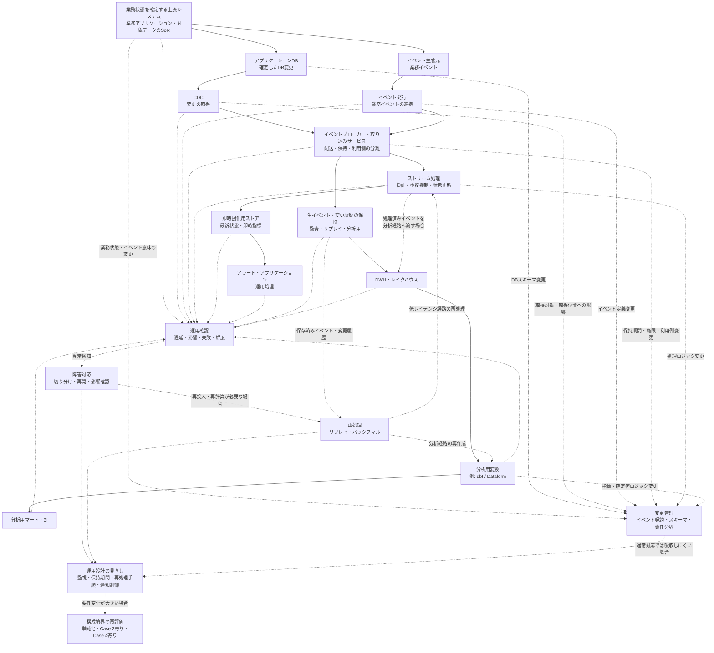

**図4-2：** Case 3における低レイテンシ基盤の構成と運用確認箇所の一例。業務状態を確定する上流システムから、CDCまたは業務イベント発行を通じて下流へ変更やイベントを渡し、低レイテンシ経路ではストリーム処理と即時提供用ストアを通じてアラートやアプリケーションへ提供する。一方で、生イベントや変更履歴を保持し、DWHまたはレイクハウス上の分析経路へ渡す場合もある。

この図では、低レイテンシ経路と分析経路を分けたうえで、運用確認、障害対応、再処理、変更管理がどの構成要素と関係するかを示している。運用確認では、遅延、滞留、失敗、鮮度に加えて、リプレイ、バックフィル、イベント契約、スキーマ変更、責任分界も確認対象になる。

Case 3では、処理が失敗したかどうかだけでなく、イベントの遅延、滞留、重複、順序入れ替わり、状態更新、通知・アラート、速報値と確定値の差分を確認する必要がある。そのため、運用確認は、上流の業務アプリケーション・SoR、CDC、イベント発行、イベントブローカー、ストリーム処理、即時提供用ストア、生イベント保持、分析経路の複数箇所にまたがる。

また、障害対応では、上流で業務状態が確定していないのか、確定済みの変更やイベントが下流へ届いていないのか、届いたイベントの処理や提供に失敗しているのかを切り分ける必要がある。保存済みイベントや変更履歴を保持していればリプレイを行いやすくなり、分析経路に必要な元データが残っていればバックフィルも行いやすくなる。

ただし、リプレイやバックフィルを行うには、それぞれ前提がある。リプレイでは、同じイベントを再処理しても結果が壊れないこと、通知を二重送信しないこと、即時提供用ストアの状態を再作成または補正できることが重要になる。バックフィルでは、過去期間を再計算できる元データが残っていること、対象期間、適用ロジック、適用開始日を説明できることが重要になる。いずれの場合も、速報値と確定値の差分を説明できる必要がある。

したがって、Case 3では、低レイテンシ経路を構築するだけでなく、再処理、通知制御、保持期間、責任分界、変更管理を含めて運用設計を行う必要がある。

このCaseで重要なのは、ストリーミングやイベント処理を高度な構成として採用することではない。低レイテンシが必要な処理を特定し、その処理に必要な複雑性だけを受け入れ、不要な部分はバッチ、マイクロバッチ、または分析経路へ寄せることである。

次章では、多様なデータ形式、複数ワークロード、長期履歴、機械学習、共通ガバナンスが重要になる場合に、DWH中心構成や低レイテンシ経路だけでは不足し、レイクハウスが候補になる条件を整理する。

---

## 5. Case 4：多様なデータと複数ワークロードを扱う共通データ基盤

### 5.1 組織条件と要件

#### 対象とするパイプライン

Case 4では、構造化データだけでなく、JSON、ログ、文書、画像などの半構造化・非構造化データを保持し、ビジネスインテリジェンス（Business Intelligence: BI）、探索的分析、データサイエンス、機械学習など、性質の異なる複数のワークロードへ提供する共通データ基盤と、そのデータパイプラインを扱う。

このCaseで重要なのは、単に大量のデータを保存することや、データレイクへファイルを集約することではない。加工前に近いデータや長期履歴を必要な範囲で保持しながら、利用者がデータの意味、品質、所有者、権限、更新履歴を確認でき、用途に応じたデータセットへ整備できる共通データ基盤を構築することである。

このような要件に対しては、DWH中心構成の機能を拡張する方法、DWHとデータレイクを役割分担させる方法、レイクハウスを採用する方法など、複数の構成が考えられる。本Caseでは、最初から特定のアーキテクチャを前提にせず、多様なデータと複数ワークロードを共通管理するために必要な能力を整理し、その構成候補の一つとしてレイクハウスを扱う。

レイクハウスは、オープンなデータ形式へ直接アクセスできるデータレイクの柔軟性を保ちながら、データウェアハウス（data warehouse: DWH）に近いデータ管理機能と性能を加え、BIだけでなくデータサイエンスや機械学習も支えることを目指すアーキテクチャとして提案されている。[11]

ただし、本資料では、レイクハウスをすべてのデータと処理を一つの製品や一つの物理的な保存先へ統合する構成とは定義しない。共通の保存・管理基盤を持ちながら、BI用データマート、探索用データセット、機械学習用データなど、利用目的に応じた表現や提供先を分ける構成も含めて考える。

Case 2との違いは、単にデータ量や利用部門が増えることではない。Case 2では、主に構造化データをDWH上で整備し、複数部門の定型レポート、部門別分析、部門横断指標へ提供するバッチ中心の構成を扱った。Case 4では、構造化データ中心のDWH分析に限らず、データ形式、保存期間、処理方法、利用ワークロードが多様であり、それらを共通のガバナンスの下で管理する必要がある条件を扱う。

また、Case 3との主な違いは、低レイテンシで変更やイベントを届けること自体を中心要件とするのか、多様なデータと長期履歴を複数ワークロードで再利用・管理することを中心要件とするのかにある。Case 3では、確定した変更や業務イベントをアプリケーション、アラート、運用処理へ短い時間で届けることを中心にした。Case 4では、バッチ、増分取り込み、変更データキャプチャ（Change Data Capture: CDC）、ストリーム取り込みなど複数の取り込み方式を利用し得るが、中心となる要件は、多様なデータと長期履歴を複数ワークロードで再利用できるように管理することである。

#### 対象とする組織・利用者

このCaseでいう組織も、会社全体や大規模企業だけを指すものではない。小規模または中規模の組織であっても、構造化データだけでなくログ、文書、画像などを扱い、同じデータをBI、探索的分析、データサイエンス、機械学習へ提供する必要があれば、Case 4に近い条件を持つ場合がある。

反対に、大規模な組織であっても、対象パイプラインが構造化データを用いた定型レポートや部門別分析に限定され、DWH上で必要な処理を完結できるなら、Case 1またはCase 2に近い構成の方が適切な場合がある。

想定する利用者や関係者には、データアナリスト、アナリティクスエンジニア、データエンジニア、データサイエンティスト、機械学習エンジニア、BI利用者、業務部門のデータ所有者、セキュリティ・ガバナンス担当者、基盤運用担当者などが含まれる。

ただし、これらの役割ごとに独立した専門チームが存在することを前提にはしない。小規模な組織では、一人または少人数の担当者が複数の役割を兼任する場合がある。重要なのはチームの人数ではなく、次のような責任を継続的に扱えるかである。

- データの意味、所有者、利用条件を管理する
- データ品質とスキーマ変更を確認する
- 利用者、役割、データ区分に応じたアクセス権限を管理する
- 保存期間、削除、再処理の方針を決める
- 複数ワークロード間の優先順位とコストを調整する
- 障害や変更が、どのデータセットや利用者へ影響するかを確認する

複数の利用者が同じ保存基盤を利用していても、それだけで共通データ基盤として機能するわけではない。誰がデータの意味と品質に責任を持つのか、どのデータをどの目的で利用できるのか、どのデータセットを信頼して参照すべきかが不明確であれば、利用者ごとに異なるコピーや変換が増え、同じデータから異なる結果が作られる可能性がある。

そのため、Case 4では、基盤を構築する技術能力だけでなく、複数の利用者とワークロードにまたがるデータ所有、アクセス制御、品質管理、変更管理を継続できる組織能力も要件となる。

#### データ条件と運用上の制約

Case 4では、業務データベースやSaaSから取得する構造化データに加えて、JSONや一部のアプリケーションログ・イベントなどの半構造化データ、文書や画像などの非構造化データ、外部データを扱うことを想定する。

これらのデータを、すべて同じ形式や同じテーブル構造へ変換することを前提にはしない。文書や画像はオブジェクトとして保持し、検索や分析に必要なメタデータ、抽出結果、分類結果を別のテーブルで管理する場合がある。イベントやJSONは、加工前に近い形式を保持しながら、分析や機械学習で利用する項目を構造化する場合がある。

データ形式が多様になると、保存できるかどうかだけでは不十分になる。利用者がデータを発見し、意味を理解し、安全に利用するために、少なくとも次の情報を管理する必要がある。

- データの所在と形式
- データの意味と所有者
- スキーマと更新履歴
- データ品質と鮮度
- アクセス権限と機密区分
- 上流・下流の依存関係
- 保存期間と削除条件
- 利用可能な目的と提供先

また、Case 4では、加工前に近いデータや長期履歴を保持し、変換ロジックの変更、過去データの訂正、新しい分析要件などに応じて再処理できることが重要になる。

ただし、すべてのデータを無期限に保存することを前提にはしない。保持期間は、再処理、監査、分析、機械学習などの利用目的だけでなく、個人情報や機密情報の管理、法令・契約上の制約、保存費用、削除要求も含めて決める必要がある。

複数ワークロードは、同じデータを使っていても、処理特性が異なる。

BIや定型レポートでは、安定したスキーマ、合意された指標、予測可能な応答時間が重要になる。探索的分析では、まだ整備されていないデータを柔軟に結合し、仮説を検証できることが求められる。データサイエンスや機械学習では、必要に応じた大規模なデータ読み取り、データの抽出・変換、反復的な実験、使用した入力データの追跡が必要になる場合がある。

特に機械学習では、学習アルゴリズムだけでなく、入力データの理解、検証・クリーニング、準備が重要なデータ管理上の課題として整理されている。[12] 本Caseでは、その設計上の含意として、どのデータ、期間、スキーマ、変換条件を使って学習用データを作成したかを追跡し、必要に応じて再作成できることを要件として扱う。

ただし、BI、探索的分析、データサイエンス、機械学習という複数のワークロードが存在するだけで、それぞれに独立した処理基盤を用意する必要があるわけではない。SQLによる変換・分析、データ抽出、特徴量作成、比較的単純な機械学習、バッチ推論までを、DWHや統合データプラットフォームを中心に実行できる場合もある。

一方で、深層学習やGPUを使う処理、独自ライブラリを用いた大規模計算、状態を持つストリーム処理、低レイテンシのオンライン推論など、一つの主要基盤では要件を満たしにくい処理がある場合は、専用の処理エンジンや実行環境を組み合わせる。複数エンジンの採用は、ワークロードの種類が複数あること自体ではなく、性能、処理方式、ライブラリ、レイテンシ、ワークロード分離などの具体的な要件から判断する。

データ鮮度も、基盤全体で一律に定めるとは限らない。例えば、経営レポートは日次更新で足りる一方、プロダクトログは数分ごとに取り込み、機械学習用データは日次または週次で更新する場合がある。そのため、Case 4では、すべてをリアルタイム化するのではなく、データと利用目的ごとに、バッチ、増分処理、マイクロバッチ、CDC、ストリーム取り込みを使い分ける。

運用上は、保存容量だけでなく、処理に使用するコンピュート、複数ワークロード間のリソース競合、データの重複、カタログやメタデータの更新、アクセス権限、スキーマ変更、再処理時間を管理する必要がある。

また、共通基盤へデータを集約するほど、設定ミスや過剰な権限によって機密データが不要な利用者へ広がる影響も大きくなる。そのため、データを集約することと、すべての利用者へ一律に公開することを区別し、データセット、列、行、利用者の役割などに応じてアクセス範囲を設計し、あわせて利用目的に関するルールを定める必要がある。

#### Case 4での前提

Case 4では、次のような前提を置く。

| 評価軸 | Case 4での前提 |
|---|---|
| 目的と利用者 | BI、探索的分析、データサイエンス、機械学習など、性質の異なる複数ワークロードへデータを提供する |
| データの特性 | 構造化、半構造化、非構造化データを扱い、加工前に近いデータと長期履歴を必要な範囲で保持する |
| 鮮度と処理方式 | データと利用目的に応じて、バッチ、増分処理、マイクロバッチ、CDC、ストリーム取り込みなどを使い分ける |
| 信頼性と再処理 | 保存済みデータから過去期間を再処理し、分析や学習に使用したデータの範囲、取得時点、スキーマ、変換条件を追跡できることが重要になる |
| 組織体制と運用 | 基盤運用者、データ所有者、各ワークロードの担当者が、品質、スキーマ、権限、再処理、コストを調整できる体制が必要になる |
| ガバナンスとコスト | カタログ、メタデータ、権限、リネージ、保持・削除方針を管理し、ストレージ、コンピュート、運用負荷を含めて評価する |

#### 適用範囲と境界

このCaseでは、多様なデータ、長期履歴、複数ワークロード、再現性、共通ガバナンスといった条件が複数重なり、それらを横断して管理する必要性が高まった場合に、共通データ基盤の構成を検討する。候補には、DWH中心構成の拡張、DWHとデータレイクの役割分担、レイクハウスなどがあり、要件と運用能力に応じて選択する。

したがって、次の条件だけでは、レイクハウスを採用する十分な理由にはならない。

- データ量が多い
- 将来データが増える可能性がある
- 機械学習を一部で利用している
- 非構造化データが少量存在する
- データレイクまたはオブジェクトストレージをすでに使用している
- 新しいアーキテクチャや製品を導入したい

構造化データが中心で、SQLによる変換、BI、定型分析、アドホック分析、一部の機械学習向けデータ作成までDWH上で実行できる場合は、DWH中心構成の方が単純で適切な可能性がある。レイクハウスを採用すると、オープンなデータ形式で管理された保存層を、用途に応じて複数の処理エンジンから利用しやすくなる可能性がある。一方で、テーブル管理、メタデータ、権限、性能最適化、エンジン間の互換性、複数ワークロードの調整など、追加の運用対象も生じる。

また、オブジェクトストレージへデータを保存しただけでは、レイクハウスにはならない。オープンテーブル形式（open table format: OTF）を導入しただけでも、カタログ、権限、品質、リネージ、処理、運用体制がなければ、ガバナンスされた共通基盤として成立するとは限らない。

DWHとデータレイクを併用する構成も、必ずしもレイクハウスではない。本資料では、DWHとデータレイクを併用しているという外形や製品名だけでレイクハウスと分類しない。保存層、テーブルと履歴の管理、権限、メタデータ、処理エンジンがどのように組み合わされているかを確認し、構成全体として評価する。

構造化された分析用データや定型レポートはDWHで管理し、加工前に近いデータ、半構造化・非構造化データ、長期履歴はデータレイクで保持するように、両者を役割分担させる構成も考えられる。この構成では、既存のDWHを維持しながら扱えるデータの範囲を広げられる一方で、DWHとデータレイク間のデータ移動、メタデータと権限の重複、データの整合性、複数基盤のコストと運用責任を管理する必要がある。

Case 3とCase 4は排他的ではない。低レイテンシでイベントを処理し、その履歴を長期保存してBI、探索的分析、機械学習、監査へ利用する場合は、Case 3に近い低レイテンシ経路と、Case 4に近い分析・保存基盤を併用する構成が考えられる。

また、Case 4は、機械学習運用（Machine Learning Operations: MLOps）全体を扱うものではない。学習データや特徴量の作成、履歴保持、データ品質、再現性は共通データ基盤上のデータパイプラインと関係するが、モデルレジストリ、モデルのデプロイ、オンライン推論、モデル監視、ドリフト検知、再学習判断などは、別途設計が必要な領域である。

したがって、Case 4の要件に対応するために追加する機能や複雑性は、Case 1〜3より高度な構成を目指すためのものではない。多様なデータを長期的に保持し、複数の利用者とワークロードで安全に再利用し、データの意味、品質、権限、履歴を共通管理する必要がある場合に、その要件に合う共通データ基盤の構成を検討する。レイクハウスは、その構成候補の一つとして位置づける。

対象データや利用ワークロードを限定できる場合は、既存基盤の拡張や責任範囲を限定した用途別基盤によって、より単純に要件を満たせる可能性もある。

次節では、ここで整理した要件に対して、DWH中心構成の拡張、DWHとデータレイクの役割分担、レイクハウスなどの選択肢を比較する。そのうえで、選択する構成に応じて、保存層、テーブル管理、処理エンジン、カタログ、権限管理、用途別データセットをどのように組み合わせるかを、共通データ基盤の構成と設計判断として確認する。

---

### 5.2 構成と設計判断

#### 構成方針

Case 4では、構造化データ、半構造化データ、非構造化データを必要な範囲で保持し、ビジネスインテリジェンス（Business Intelligence: BI）、探索的分析、データサイエンス、機械学習など、性質の異なる複数のワークロードへ提供する共通データ基盤を扱う。

この条件に対して、最初からレイクハウスを採用すると決めるわけではない。構造化データとSQL中心の処理で要件を満たせる場合は、既存のデータウェアハウス（data warehouse: DWH）の機能を拡張する構成が候補になる。加工前に近いデータ、長期履歴、文書、画像などをDWHとは別に保持したい場合は、DWHとデータレイクを役割分担させる構成も考えられる。オープンな保存層を中心に、複数ワークロードから共通データを利用し、テーブル、履歴、メタデータ、権限を一体的に管理したい場合は、レイクハウスが候補になる。

したがって、Case 4では、次の順序で構成を検討する。

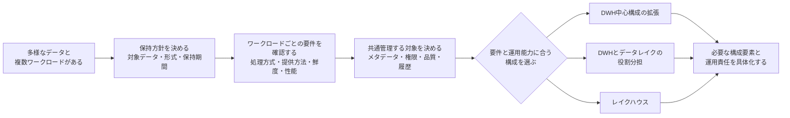

**図5-1：** 多様なデータと複数ワークロードを扱う共通データ基盤の構成を検討する流れ。保存方式や製品を先に決めるのではなく、保持対象、ワークロード要件、共通管理する範囲を確認したうえで、DWH中心構成の拡張、DWHとデータレイクの役割分担、レイクハウスなどから、要件と運用能力に合う構成を選択する。

重要なのは、保存先や製品を先に決めることではない。何を共通管理し、何をワークロードごとに分けるのかを明確にしたうえで、必要な構成要素だけを追加することである。

#### 構成候補の比較

Case 4の要件に対する代表的な構成候補は、次のように整理できる。

| 構成候補 | 適しやすい条件 | 主な設計方針 | 主な負担・制約 |
|---|---|---|---|
| DWH中心構成の拡張 | 構造化データが中心で、半構造化データ、探索的分析、特徴量作成などもDWHと周辺機能で扱える | 保存、SQL変換、BI、データ抽出、一部の機械学習向け処理を主要DWHへ集約する | DWHが対応しにくいデータ形式、ライブラリ、処理方式、長期履歴の扱いには制約が残る |
| DWHとデータレイクの役割分担 | BIと定型分析は既存DWHで安定運用しつつ、加工前に近いデータ、半構造化・非構造化データ、長期履歴を別に保持したい | DWHを整備済み構造化データとBIの提供先、データレイクを多様なデータと履歴の保存先として分ける | 基盤間のデータ移動や複製、メタデータと権限の重複、データ整合性、責任分界を管理する必要がある |
| レイクハウス中心構成 | オープンな保存層を中心に、長期履歴と管理された分析テーブルを保持し、複数ワークロードから共通利用したい | オブジェクトストレージ、オープンテーブル形式、カタログ、処理エンジン、権限・品質管理を組み合わせる | テーブル保守、メタデータ、性能最適化、エンジン間の互換性、複数ワークロードの調整が運用対象になる |

これらは排他的な分類ではない。例えば、レイクハウスを共通の保存・履歴管理基盤として利用しながら、安定したSQL性能、同時実行、指標管理、既存BIとの接続を担う分析・提供基盤としてDWHを併用する場合がある。反対に、DWH中心構成の一部でオブジェクトストレージやオープンなファイル形式を利用していても、構成全体を必ずレイクハウスと呼ぶわけではない。

本節では、三つの候補のうち、Case 4の要件が強く現れる例として、レイクハウスを中心にしつつ、必要に応じてDWHや用途別の実行環境を組み合わせる構成を示す。これはCase 4の標準構成や唯一解ではない。

#### 構成例

このCaseの構成例は、次のように整理できる。

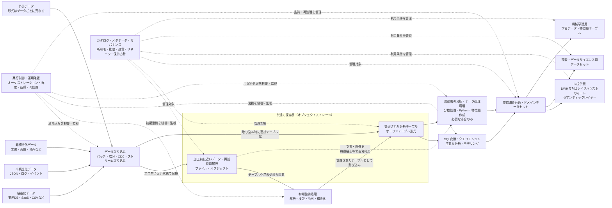

**図5-2：** Case 4における共通データ基盤の一例。構造化、半構造化、非構造化データを共通の保存層へ取り込み、加工前に近いデータとして保持するか、取り込み時に管理された分析テーブルとして書き込む。必要に応じて解析、検証、抽出、構造化を行い、カタログ、メタデータ、権限、品質、リネージ、保持方針を横断的に管理する。整備済みデータセットから、BI、探索的分析、データサイエンス、機械学習向けの表現を派生させる。

図中の「管理された分析テーブル」「整備済み共通・ドメインデータセット」「探索・データサイエンス用データセット」「機械学習用の学習データ・特徴量テーブル」は、データの整備段階と利用目的を区別するための論理的な層であり、必ずしも別々の物理保存先を意味しない。レイクハウス中心構成では、これらを同じオブジェクトストレージ上のオープンテーブル形式のテーブルとして実装する場合がある。BI提供層についても、レイクハウス上に配置する場合と、別のDWHへ提供する場合がある。

初期整備処理は、加工前に近いデータを、管理された分析テーブルとして扱える状態へ変換する段階である。JSONやログの解析、スキーマ検証、データ型の正規化、不正レコードの隔離、重複処理、文書や画像からの属性抽出などが含まれる。入力時に必要な検証を行い、直接オープンテーブル形式のテーブルへ安全に書き込める場合は、この段階を独立させる必要はない。

この初期整備処理は、業務定義に基づく結合、集計、データモデリングを行うSQL変換や、探索、特徴量作成などの用途別処理とは責任が異なる。

なお、この構成でも、すべてのデータをオープンテーブル形式へ変換する必要はない。文書や画像はオブジェクトとして保持し、ファイルの識別子、取得元、取得時刻、機密区分、抽出結果などを管理テーブルへ保存する場合がある。

文書や画像などの非構造化データでは、データ本体を加工前領域に保持したまま、用途別の分析・データ処理環境がオブジェクトを直接読み取る場合もある。この場合も、対象ファイルの識別子、保存場所、取得時点、権限、抽出結果などは、管理されたテーブルやカタログから追跡できるようにする。

また、図中の用途別の分析・データ処理環境は必須ではない。SQL変換、探索、学習データ作成などを一つの主要な処理基盤で実行できる場合は、処理環境を分けない方が、権限、監視、コスト、障害対応を単純に保ちやすい。主要基盤では満たしにくい言語、ライブラリ、性能、レイテンシ、ワークロード分離の要件がある場合に限り、専用の処理エンジンや実行環境を追加する。

#### 主要コンポーネントの役割

データ取り込み層では、業務データベース、SaaS、ファイル、ログ、イベント、文書、画像、外部データなどを共通の保存層へ取り込む。取り込み方式は一つに統一せず、データと利用目的に応じて、バッチ、増分取り込み、変更データキャプチャ（Change Data Capture: CDC）、ストリーム取り込みを使い分ける。

取り込み時には、データ本体だけでなく、取得元、取得時刻、対象期間、スキーマ、ファイル名、イベント識別子など、後からデータの由来と処理範囲を確認するための情報も保持する。これにより、同じデータを再取得した場合や、過去期間を再処理する場合に、どの入力を使用したかを確認しやすくなる。

共通の保存層には、構造化、半構造化、非構造化データを保持できるオブジェクトストレージを利用する構成が候補になる。ここでは、再処理に使用する加工前に近いデータや入力履歴を保持する領域と、スキーマ、データファイル、スナップショットなどを分析テーブルとして管理する領域を区別する。これらは、顧客や契約などの業務状態の変化を表す履歴モデルとは別のものである。

加工前に近いデータを保持する目的は、すべてのデータを無期限に保存することではない。上流データの訂正、変換ロジックの変更、新しい分析要件、監査、パイプライン障害からの再処理などに応じて、必要な範囲を再処理できるようにすることである。保存期間は、再処理要件、法令・契約、個人情報や機密情報、削除要求、保存コストを踏まえて決める。

オープンテーブル形式（open table format: OTF）は、オブジェクトストレージ上のデータファイルを、スキーマ、ファイル一覧、スナップショット、履歴などを持つ分析テーブルとして管理するために利用する。例えばApache Icebergでは、テーブルメタデータによってスキーマ、パーティション設定、データファイル、スナップショットを管理し、特定時点のテーブル状態を参照できる仕組みを定めている。[13]

ただし、オープンテーブル形式を導入しただけでは、共通データ基盤は完成しない。どのテーブルが存在するか、誰が所有するか、どの利用者が参照できるか、どのデータが信頼できるかを管理するために、カタログ、メタデータ管理、アクセス制御、品質管理、リネージ、保持・削除方針を組み合わせる必要がある。

カタログは、テーブルやファイルの名前を登録するだけの仕組みではない。利用者がデータを発見し、意味、所有者、スキーマ、品質、更新状況、利用条件を確認するための入口として位置づける。ただし、カタログへ項目を登録しただけで情報が正確に保たれるわけではない。所有者、更新手順、変更時の確認責任を決める必要がある。

処理エンジンは、共通の保存層にあるデータを読み取り、検証、変換、集約、特徴量作成などを行う。SQLによる変換と分析を主要な処理方式にしながら、必要に応じて分散バッチ処理、Pythonによる分析、機械学習向けの実行環境などを組み合わせる。

複数の処理エンジンを利用する場合は、同じテーブル形式を読めることだけで判断しない。読み取りと書き込みの対応範囲、スキーマ変更、データ型、削除・更新、トランザクション、カタログ連携、権限、性能最適化などについて、利用するエンジン間で互換性を確認する必要がある。

整備済み共通・ドメインデータセットは、加工前に近いデータを利用者へ直接公開するのではなく、業務上の意味、品質、粒度、所有者を明確にした状態で提供するための層である。顧客、商品、契約、注文、利用状況など、複数ワークロードで共有するデータを整備し、その上からBI用データマート、探索用データセット、機械学習用データを派生させる。

DWHは、レイクハウスを採用した場合でも不要になるとは限らない。安定したSQL性能、既存BIとの接続、指標管理、同時実行、利用者向けの操作性などを重視し、整備済みデータセットの一部をDWHへ提供する場合がある。この場合、共通の保存・管理基盤と、BI向けの提供・実行基盤を役割分担させる。

オーケストレーション、データ品質検査、データ鮮度監視、リネージ、再処理は、個別の保存層や処理エンジンだけに閉じない横断的な機能である。複数の取り込み方式と処理環境を組み合わせる場合は、どのデータが取り込み済みか、どの変換が完了したか、どの出力がどの入力に基づくか、失敗時にどこから再処理するかを追跡できるようにする。

#### 複数ワークロードと共通データ基盤の設計

共通データ基盤を構築する目的は、すべての利用者に同じ物理テーブルを直接使わせることではない。異なるワークロードが必要とするデータの意味、履歴、品質、権限を共通管理しながら、利用目的に応じた表現を提供することである。

BIや定型レポートでは、安定したスキーマ、合意された指標、予測可能な応答時間が重要になる。そのため、整備済みデータセットからBI用データマートやセマンティックレイヤーを作成し、利用者が加工前に近いデータへ直接依存しないようにする。

探索的分析やデータサイエンスでは、仮説に応じて複数のデータを結合し、まだ恒久的なマートとして確定していない項目を試す必要がある。そのため、一定の自由度を持つ探索用領域やデータセットを用意しつつ、機密データへのアクセス、計算資源、保存期間、成果物の共有方法を管理する。

機械学習では、学習データや特徴量を作成するだけでなく、どの入力データ、対象期間、スキーマ、変換ロジック、パラメーターを使用したかを追跡する必要がある。テーブルのスナップショットは入力データの状態を特定する手段になり得るが、それだけで学習や分析の完全な再現性が得られるわけではない。変換コード、設定、実行環境、外部入力などもあわせて管理する必要がある。

同じ項目をBI用マート、探索用データセット、機械学習用テーブルへ派生させる場合、必要な複製まで禁止するものではない。重要なのは、どのデータセットから派生したのか、どの定義が共通で、どこから用途固有の変換が加わったのかを追跡できることである。

複数の処理エンジンも、ワークロードが複数あるという理由だけで導入しない。主要な処理基盤でSQL変換、探索、学習データ作成まで実行できる場合は、そこへ集約する方が運用を単純にしやすい。一方で、深層学習やGPU処理、独自ライブラリを用いた計算、状態を持つストリーム処理、低レイテンシのオンライン推論など、主要基盤で要件を満たしにくい処理がある場合は、専用環境へ分離する。

ただし、オンライン推論、モデルレジストリ、モデル監視、ドリフト検知、再学習判断など、機械学習運用（Machine Learning Operations: MLOps）全体の設計は、本Caseの対象外である。本Caseでは、それらの処理へ信頼できる入力データを提供するところまでを中心に扱う。

また、複数ワークロードが同じ保存層と計算資源を利用する場合、BIクエリ、長時間の変換、探索処理、機械学習向け処理が互いに影響する可能性がある。必要に応じて、処理エンジンを増やす前に、計算資源、実行キュー、優先度、同時実行数、予算上限などをワークロードごとに分ける方法を検討する。

#### 要件と設計判断の対応

このCaseにおける主な要件、必要な能力、設計判断、受け入れるトレードオフは、次のように対応づけられる。

| 要件・制約 | 必要な能力 | 設計判断 | 受け入れるトレードオフ |
|---|---|---|---|
| 構造化、半構造化、非構造化データを扱う | 形式を過度に統一せず、データ本体とメタデータを保持する | 必要に応じてオブジェクトストレージを共通の保存層にし、ファイル・オブジェクトと管理テーブルを組み合わせる | データを保存するだけでは利用可能にならず、カタログ、権限、品質、形式ごとの処理を管理する必要がある |
| 加工前に近いデータや再処理用の入力履歴を利用したい | 入力データの由来、対象期間、取得時点、スキーマを追跡し、必要な範囲を再処理する | 保存領域と保持期間を定め、加工前に近い入力データと処理済みデータを区別して管理する | 保存コスト、機密データ管理、削除要求、スキーマ変更への対応が増える |
| オブジェクトストレージ上のデータを分析テーブルとして管理したい | スキーマ、ファイル一覧、履歴、更新をテーブル単位で管理する | 要件に合う場合はオープンテーブル形式を採用し、カタログと処理エンジンを接続する | テーブル形式とエンジン間の互換性、メタデータ保守、ファイル最適化が運用対象になる |
| BI、探索的分析、データサイエンス、機械学習へ共通データを提供したい | 共通の意味と品質を維持しながら、用途別の粒度と形式へ派生させる | 整備済み共通・ドメインデータセットを設け、その上からBI用マート、探索用データセット、学習データ・特徴量テーブルを作る | 用途別データセットの複製、定義同期、変更影響の確認が必要になる |
| BI向けに安定した性能と既存の利用方法を維持したい | 安定したスキーマ、指標、同時実行、BI接続を提供する | BI用マートの配置先をレイクハウスまたはDWHから選び、必要に応じてセマンティックレイヤーを設ける。既存環境や性能要件によっては、BI提供用のDWHを別途併用する | 外部DWHを併用する場合は、共通保存層とのデータ移動、鮮度差、重複、コストを管理する必要がある |
| データサイエンスや機械学習で専用ライブラリや計算資源が必要になる | 主要基盤で不足する処理だけを別の実行環境で実行する | 主要なSQL処理基盤を中心にし、必要な場合のみ分散処理、Python、GPUなどの実行環境を追加する | 実行環境、依存ライブラリ、権限、コスト、データ受け渡し、再現性の管理対象が増える |
| 分析や学習に使用したデータを再現したい | 入力データ、対象期間、スキーマ、変換条件を追跡する | スナップショットや履歴に加えて、変換コード、設定、実行情報を記録する | 履歴と実行情報の保持、追跡、再現手順の整備が必要になる |
| 複数ワークロードを共通ガバナンスの下で利用したい | 所有者、意味、権限、品質、リネージ、保持・削除方針を横断管理する | 共通のカタログ、メタデータ、アクセス制御、品質管理、リネージを設計する | 管理項目を継続更新する責任と、複数チーム間の合意形成が必要になる |
| データごとに必要な鮮度が異なる | バッチ、増分、CDC、ストリームを用途に応じて使い分ける | すべてをリアルタイム化せず、データセットごとに更新方式と更新期限を定める | 複数の取り込み経路、鮮度、再処理方法を個別に管理する必要がある |

この対応表で重要なのは、Case 4に該当するからといって、すべてのデータをオブジェクトストレージへ移し、複数の処理エンジンとオープンテーブル形式を導入することではない。DWHで満たせるワークロードはDWHへ残し、長期履歴、多様なデータ形式、再現性、専用処理など、既存構成では満たしにくい要件に対してだけ新しい構成要素を追加する。

#### この構成で得られるものと限界

この構成で得られる主な利点は、構造化、半構造化、非構造化データを、利用目的に応じた形式で保持しながら、複数ワークロードへ提供できることである。加工前に近いデータや再処理用の入力履歴を必要な範囲で保持すれば、上流データの訂正、変換ロジックの変更、新しい分析要件に応じて、過去データを再処理しやすくなる。

また、共通のカタログ、メタデータ、権限、品質、リネージを整備することで、管理されていないデータコピーの増加を抑え、どのデータをどの目的で利用すべきかを確認しやすくなる。レイクハウス中心構成では、オープンな保存層の管理された分析テーブルを複数の処理エンジンから利用することで、DWH、データサイエンス、機械学習ごとに完全に独立したデータコピーを持つ必要を減らせる場合がある。[11] ただし、複製そのものをなくすことが目的ではなく、用途別データセットを意図的に作成し、その由来と責任範囲を管理することが重要である。

一方で、この構成は、データを一つの論理的な保存層へ集約するだけで成立するものではない。カタログ、権限、品質、リネージ、テーブル管理、保持・削除、性能最適化、エンジン間の互換性、ワークロード間の資源調整を継続的に運用する必要がある。

特に、オブジェクトストレージ上のテーブルでは、データ更新によって多数の小さなファイルやメタデータが増え、読み取り性能や管理負荷へ影響する場合がある。ファイルの統合、不要なスナップショットやファイルの整理、パーティションやデータ配置の見直しなどは、保存層を用意した後も継続して必要になる可能性がある。

また、複数の処理エンジンが同じ形式へ対応していても、すべての機能と動作が完全に一致するとは限らない。利用する更新方式、データ型、スキーマ変更、削除、カタログ、権限について、実際の組み合わせで検証する必要がある。

オブジェクトストレージとオープンテーブル形式によって保存と処理を分離しても、可用性や別エンジンへの切り替えが自動的に得られるわけではない。カタログ、権限、ネットワーク、リージョン、機能互換性も依存先になるため、障害時の代替経路は事前に設計・検証する必要がある。

共通データ基盤は、データの意味や所有者を自動的に統一するものでもない。どのデータセットを信頼して参照すべきか、指標や特徴量の定義を誰が承認するか、品質異常やスキーマ変更に誰が対応するかは、組織的な責任として別途定める必要がある。

したがって、この構成の適否は、扱えるデータ形式や機能の多さだけでは判断できない。DWH中心構成の拡張で十分な場合は、その方が単純で保守しやすい可能性がある。DWHとデータレイクを役割分担させる場合も、既存資産を活かせる一方で、二つの基盤の同期と責任分界を受け入れる必要がある。レイクハウスを採用する場合も、追加される柔軟性が、テーブル管理、ガバナンス、性能、運用の負担に見合うかを確認する必要がある。

次節では、この共通データ基盤を継続運用するうえで確認すべき項目、複数ワークロード間のトレードオフ、所有責任とガバナンス、構成を見直す変更トリガーを整理する。

---

### 5.3 運用、トレードオフ、変更トリガー

#### 運用方針

Case 4の運用では、パイプラインの処理が実行・完了していることと、必要なデータが必要な形、品質、鮮度で各ワークロードから利用可能になっていることを分けて確認する必要がある。

加工前に近いデータが保存されていても、初期整備処理や管理された分析テーブルへの反映が完了しているとは限らない。また、共通データセットが更新されていても、BI、探索、機械学習向けの各データセットが、それぞれの利用要件を満たしているとは限らない。

そのため、このCaseでは、次の状態を分けて確認する。

- 必要な入力データが到着し、加工前に近い状態で保持されているか
- 初期整備処理が完了し、管理された分析テーブルへ反映されているか
- 共通・ドメインデータセットが期待される定義と品質で更新されているか
- BI、探索、データサイエンス、機械学習向けのデータが、それぞれの期限までに利用可能になっているか
- カタログ、権限、リネージ、保持・削除方針が実際のデータと一致しているか
- 障害やロジック変更が発生した場合に、必要な入力と実行条件を使って再処理できるか
- 複数ワークロードの実行が互いの性能やコストへ過度な影響を与えていないか

すべてのデータセットを同じ基準で運用する必要はない。BI用マートでは、安定した更新時刻、指標定義、同時実行性能が重要になる。一方、探索用データセットでは、一定の自由度を許容しつつ、アクセス範囲、保存期間、計算資源を管理する必要がある。機械学習用データでは、入力データ、対象期間、変換ロジック、特徴量定義を追跡できることが重要になる。

したがって、Case 4の運用方針は、すべての処理を一つの運用基準へ統一することではない。保存、メタデータ、権限、品質、履歴などの共通管理と、ワークロードごとの鮮度、性能、提供形式、実行環境を分け、それぞれの責任者と確認方法を定めることである。

#### 確認すべき運用項目

Case 4では、日常運用で次の項目を確認する。

| 運用項目 | 確認すること | 放置した場合のリスク |
|---|---|---|
| 上流データと取り込み | 必要なデータが到着しているか、取り込みが失敗・遅延していないか、取得対象やスキーマが変わっていないか | 加工前データが欠け、下流のテーブルや用途別データセットを正しく作成できない |
| 加工前データと入力履歴 | 再処理に必要なデータ、取得時刻、対象期間、取得元、スキーマが保持されているか | ロジック変更や障害後に、過去データを再構築できない |
| 初期整備処理 | 解析、検証、抽出、構造化、不正レコードの隔離が完了しているか | 不正な形式や不完全なデータが管理された分析テーブルへ混入する |
| 管理された分析テーブル | テーブルへの書き込み、スナップショット、スキーマ、更新・削除が期待どおり管理されているか | テーブル状態が不整合になり、処理エンジンごとに異なる結果が参照される |
| カタログとメタデータ | テーブル、所有者、説明、機密区分、更新状況、利用条件が実際の状態と一致しているか | 利用者が誤ったデータを選択し、所有者や問い合わせ先も特定できない |
| 共通・ドメインデータセット | 業務定義、粒度、品質条件、更新時刻が合意された状態を保っているか | BI、探索、機械学習で同じ概念に異なる定義が使われる |
| 用途別データセット | BI、探索、機械学習向けデータが、それぞれの利用目的と期限に合っているか | 古いデータ、誤った粒度、用途に合わないデータが利用される |
| データ品質とリネージ | 主要な品質条件を満たし、入力から利用先までの由来と変更影響を追跡できるか | 問題の原因や影響範囲を説明できず、復旧や利用者連絡が遅れる |
| テーブルとファイルの保守 | 小さなファイル、不要なスナップショット、メタデータ、データ配置が性能やコストへ影響していないか | 読み取り性能が低下し、保存・処理コストや保守負荷が増える |
| ワークロードと計算資源 | BI、変換、探索、機械学習向け処理が互いに過度な影響を与えていないか | 重要なクエリや更新処理が遅延し、予算も予測しにくくなる |
| 権限と利用状況 | 利用者や処理が必要なデータだけへアクセスし、機密データの利用を追跡できるか | 過剰な権限、目的外利用、データ漏えい、監査不能が発生する |
| 保持・削除 | データの保持期間、削除要求、法令・契約上の制約が保存先と派生データへ反映されているか | 不要なデータを保持し続ける、必要な再処理用データを早期に削除する、または法令・契約上の保持・削除要件に違反する |
| コスト | 保存、取り込み、変換、クエリ、用途別処理、データ移動の費用が想定範囲に収まっているか | 利用されていないデータや処理を維持し、継続運用が難しくなる |
| 通知と利用者連絡 | どの異常を誰へ通知し、どのデータセットが利用可能かを利用者へ説明できるか | 利用者が古いデータや不完全なデータを、正常なデータとして利用する |

すべての項目を最初から同じ粒度で自動監視する必要はない。業務判断、外部提供、機械学習処理などへの影響が大きいデータセットから、期待更新時刻、品質条件、障害時の連絡先、復旧方法を定める。

また、基盤全体の障害と、一部のデータセットだけの遅延を同じ重大度で扱うべきではない。どの利用者とワークロードへ、どの程度の影響が出るかを基に優先度を決める必要がある。探索用データセットの一時的な遅延を許容できても、経営指標や外部向けレポート、日次の学習処理に必要なデータの欠損は、より優先して対応すべき場合がある。

#### 主要なトレードオフ

Case 4では、多様なデータと複数ワークロードを共通管理しやすくなる一方で、保存、テーブル、メタデータ、処理エンジン、用途別データセットの管理対象が増える。

第一に、再処理可能性と保存負担のトレードオフがある。加工前に近いデータや入力履歴を保持すれば、上流訂正やロジック変更後の再処理を行いやすくなる。一方で、保存コスト、機密情報、削除要求、スキーマ変化を管理しなければならない。

第二に、共通化とワークロード分離のトレードオフがある。共通・ドメインデータセットを整備すれば、BI、探索、機械学習で意味と品質を共有しやすくなる。一方、各用途で必要な粒度、更新頻度、性能をすべて一つのデータセットへ押し込むと、変更調整が難しくなる。共通化する定義と、用途ごとに派生させる部分を分ける必要がある。

第三に、複数エンジンから利用できる柔軟性と、互換性管理のトレードオフがある。オープンテーブル形式を採用しても、すべての処理エンジンが、読み取り、書き込み、更新、削除、データ型、カタログ、権限について同じ範囲へ対応するとは限らない。そのため、利用するエンジンと機能の組み合わせを事前に検証し、必要に応じて書き込みを担当するエンジンや利用可能な機能を限定する。

第四に、処理環境の集約と分離のトレードオフがある。SQL変換、探索、学習データ作成を一つの主要基盤へ集約すれば、権限、監視、運用を単純にしやすい。一方、専用ライブラリ、GPU、大規模分散処理、状態を持つストリーム処理などが必要な場合は、用途別環境を追加する理由が生じる。

主なトレードオフは次のように整理できる。

| 設計判断 | 得られる利点 | 受け入れるトレードオフ |
|---|---|---|
| 加工前に近いデータや入力履歴を保持する | 訂正、監査、ロジック変更後の再処理に利用しやすい | 保存コスト、削除要求、機密情報、スキーマ変化を管理する必要がある |
| 共通・ドメインデータセットを整備する | 複数ワークロードで意味、品質、所有者を共有しやすい | 共通定義の変更調整と下流影響の確認が必要になる |
| 用途別データセットを作成する | BI、探索、機械学習ごとの粒度、性能、利用方法へ合わせやすい | 複製、定義のずれ、鮮度差、変更影響を管理する必要がある |
| オープンテーブル形式を利用する | オブジェクトストレージ上のデータを、スキーマや履歴を持つテーブルとして管理しやすい | テーブル保守、カタログ連携、メタデータ管理が必要になる |
| 同じテーブルを複数の処理エンジンから利用する | ワークロードに応じて処理エンジンを選択しやすい | 機能、仕様バージョン、データ型、カタログ、権限の互換性を検証し、書き込み責任を限定する必要がある |
| 主要な処理基盤へ集約する | 権限、監視、コスト、障害対応を一元化しやすい | 基盤が対応しにくい処理方式、ライブラリ、性能要件には制約が残る |
| 用途別の処理環境を追加する | 主要基盤で満たしにくい処理へ対応できる | 実行環境、依存ライブラリ、権限、データ受け渡し、障害箇所が増える |
| BI提供用にDWHを併用する | 既存BIとの接続、安定したSQL性能、同時実行を維持しやすい | 基盤間の複製、鮮度差、同期、コスト、責任分界が必要になる |

重要なのは、構成要素を増やして技術的な選択肢を広げても、その柔軟性が運用負担に見合うとは限らないことである。実際の要件を主要基盤で満たせない場合に限って、用途別環境や別の提供基盤を追加する。反対に、利用範囲が限定された場合は、処理エンジン、保存対象、用途別データセットを減らす判断も必要になる。

#### 障害対応と再処理

Case 4では、障害を「パイプライン全体が成功したか、失敗したか」だけで扱うと、原因と影響範囲を特定しにくい。パイプラインや実行基盤が正常に動作していることと、必要なデータが期待する形式、意味、品質、鮮度で提供されていることは別に確認する必要がある。

障害発生時には、まずパイプラインと実行基盤の障害か、データ内容、変換ロジック、データ契約の異常かを切り分ける。ただし、一つの事象が両方へ影響する場合もあるため、実行状態とデータ状態を順に確認する。

##### パイプラインと実行基盤の障害

| 障害箇所 | 代表的な問題 | 主な確認 |
|---|---|---|
| 上流との接続・取り込み | 取り込み停止、認証エラー、接続タイムアウト、ジョブ未起動 | 上流の稼働状況、接続設定、認証情報、取り込みログ、最終成功時刻 |
| 保存層への書き込み | ファイル保存失敗、一部書き込み、コミット失敗、容量・権限エラー | 書き込みログ、対象ファイル、コミット状態、保存先権限、再実行可能性 |
| 初期整備処理 | ジョブ停止、解析処理の例外、依存処理の未完了、再試行失敗 | 実行ログ、失敗した処理段階、依存関係、処理済み範囲、再実行範囲 |
| SQL変換・用途別処理 | クエリ失敗、専用環境の停止、依存ライブラリの不整合、計算資源不足 | 実行環境、クエリ・コード、ライブラリ、計算資源、入力と出力の範囲 |
| カタログ・認証・ネットワーク | テーブルを解決できない、認証できない、保存層へ接続できない | カタログ状態、権限、認証経路、ネットワーク、影響する処理エンジンと利用者 |
| 提供経路 | DWHやBIへの同期停止、API・接続先の障害、提供ジョブの遅延 | 提供先の稼働状況、同期ログ、最終更新時刻、利用者からの参照可否 |

##### データ内容、変換、データ契約の異常

| 異常箇所 | 代表的な問題 | 主な確認 |
|---|---|---|
| 上流データ | データ未到着、一部期間の欠損、重複、破損、想定外の値 | 件数、対象期間、取得元、チェックサム、過去傾向、再取得可能性 |
| スキーマ・データ契約 | 列の追加・削除、型変更、必須列の欠損、粒度や更新条件の変更 | 合意したスキーマ、データ型、必須項目、主キー、更新頻度、変更通知の有無 |
| 初期整備 | 不正レコードの混入、型変換の失敗、隔離漏れ、重複排除の誤り | 隔離レコード、変換条件、重複判定、処理前後の件数、適用範囲 |
| 共通・ドメインデータセット | 業務定義の誤り、結合条件の誤り、粒度の不一致、品質検査の失敗 | 入力テーブル、変換ロジック、業務定義、品質条件、影響する下流データセット |
| 用途別データセット | 指標、特徴量、対象期間、集計方法が利用目的と一致しない | 利用目的、派生元、追加変換、鮮度、粒度、利用者との合意内容 |
| 提供データ | データ未更新、鮮度不足、参照先の誤り、権限設定と利用条件の不一致 | 最終更新時刻、提供対象、参照先、権限、利用者、下流処理への影響 |

パイプラインの障害では、失敗した処理を再試行または部分再実行できるかを確認する。データ内容やデータ契約の異常では、単純な再実行では同じ誤りが再現されるため、入力データ、スキーマ、変換ロジック、業務定義のどこを修正するかを先に判断する必要がある。

復旧方法は、パイプラインや実行基盤の障害か、データ内容、変換ロジック、データ契約の異常かによって分けて判断する。

パイプラインや実行基盤の一時的な障害では、保存済みデータと処理済み範囲を確認し、失敗した処理を再試行または部分再実行する。加工前データが正常に残っていれば初期整備以降を、管理された分析テーブルが正常であれば共通・ドメインデータセットや用途別データセットの作成だけを再実行できる場合がある。テーブルへの書き込みやコミット状態に問題がある場合は、利用可能なスナップショットへ戻すか、別のテーブルとして再構築し、検証後に切り替える方法も検討する。

一方、入力データの欠損、データ契約違反、変換ロジックや業務定義の誤りでは、単純に再実行しても同じ問題が再発する。異常な入力を隔離し、上流データ、スキーマ、変換ロジック、業務定義のどこを修正するかを確認したうえで、対象期間を定めて再取得またはバックフィルを行う。修正前のデータをすでに利用者へ提供している場合は、影響するデータセットと利用者を特定し、訂正内容と再提供時刻を連絡する必要がある。

複数ワークロードが同じ共通データセットを利用している場合、一つの再処理がBI、探索、機械学習へ同時に影響する可能性がある。そのため、再処理前には、対象期間、入力データ、適用する変換ロジック、影響する下流データセットと利用者、切替時刻を確認する。再処理中も新しいデータを継続して処理するのか、一時的に更新を止めるのか、旧データと再処理結果をどの時点で切り替えるのかも決める必要がある。

また、加工前データを保持していても、過去の状態を完全に再現できるとは限らない。変換コード、設定、実行環境、外部参照データ、権限、処理エンジンのバージョンが変わっていれば、同じ入力から異なる結果が生じる可能性がある。再処理可能性を重視する場合は、入力データだけでなく、適用したコード、設定、依存関係、実行環境も追跡する必要がある。

#### 複数ワークロードの所有責任とガバナンス

共通データ基盤では、保存場所やカタログを統一しても、データの意味、品質、利用責任が自動的に統一されるわけではない。技術的な基盤運用と、業務上の定義や利用判断を分けて考える必要がある。

例えば、共通基盤の運用担当者は、取り込み、保存、テーブル管理、実行環境、監視を維持できる。しかし、「有効な顧客とは何か」「売上へどの状態を含めるか」「どの特徴量を学習へ使ってよいか」といった判断は、業務部門、データ所有者、分析・機械学習の利用責任者と調整する必要がある。

以下は特定の職種や部署へ固定するものではなく、各組織で誰が担うかを明確にすべき責任範囲を示している。

| 領域 | 主な責任 |
|---|---|
| 上流データと業務上の意味 | データの生成条件、ソース上の項目の意味、訂正、スキーマ変更、業務上の例外を説明する |
| 共通基盤 | 取り込み、保存、カタログ、処理環境、監視、再処理手段を維持する |
| 初期整備と管理テーブル | 解析、検証、スキーマ、隔離処理、テーブル状態を管理する |
| 共通・ドメインデータセット | 分析・利用のための定義、粒度、品質条件、所有者、変更影響を管理する |
| BI向けデータ | 指標、更新期限、マート、セマンティックレイヤー、利用者への説明を管理する |
| 探索・データサイエンス用データ | 利用目的、アクセス範囲、保存期間、成果物の共有方法を管理する |
| 機械学習用データ | 学習対象、特徴量、対象期間、再現性、利用可能なデータ範囲を管理する |
| セキュリティ・保持・監査 | 機密区分、権限、保持・削除、監査、利用ルールを管理する |
| インシデント対応と利用者連絡 | 影響するデータセットとワークロードを特定し、対応優先度、利用可否、復旧状況を関係者へ伝える |

共通・ドメインデータセットを変更する場合は、BIだけでなく、探索用データセット、学習データ、特徴量テーブルへの影響も確認する。列の削除や型変更だけでなく、業務定義、粒度、更新タイミング、欠損値の扱いを変える場合も、下流では破壊的な変更になる可能性がある。

一方で、すべての用途別変更を中央の基盤チームが承認する構成にすると、探索や機械学習の試行が遅くなる。共通定義、機密データ、基盤へ影響する変更は共通の手順で管理し、用途固有の派生処理は各所有者が管理するなど、変更の影響範囲に応じて統制の強さを分ける必要がある。

外部支援や複数チームが関与する場合も、技術的な実装責任と、データの利用可否や業務定義を決める責任を分ける。外部支援へ本番データや環境へのアクセスを許可する場合は、必要な範囲、期限、監査方法、機密情報の扱いを明確にする。

#### 変更トリガー

Case 4の構成が適切かどうかは、データ形式、利用ワークロード、運用能力、コストの変化によって変わる。次のような変化が起きた場合は、現在の構成を拡張するだけでなく、対象範囲の縮小やDWH中心構成への単純化も含めて見直す。

| 変更トリガー | 見直すべき理由 | 検討する方向 |
|---|---|---|
| BIとSQL中心の利用へ収束する | 多様な保存形式や用途別処理環境を維持する効果が小さくなる | DWH中心構成への集約、不要な処理環境やデータセットの削減を検討する |
| 加工前に近いデータや非構造化データの保持・利用が増える | 再処理用履歴、検索、初期整備、権限、保持期間などの管理対象が増える | 保存領域、カタログ、初期整備処理、メタデータ、用途別のアクセス方法を見直す |
| 共通データセットの利用部門が増える | 定義変更や品質問題の影響範囲が広がる | 所有者、変更承認、リネージ、利用者一覧、通知手順を整える |
| 用途別データセットが増え続ける | 重複、定義のずれ、鮮度差、未使用データが増える | 共通化する定義、廃止基準、所有者、保持期間を見直す |
| ワークロード間の競合が増える | BI、変換、探索、機械学習処理が互いに遅延を発生させる | 計算資源、実行優先度、同時実行、用途別処理環境を分離する |
| 複数エンジンの互換性問題が増える | 更新、型、権限、性能の動作が一致せず、検証負荷が高まる | 利用エンジンを絞る、書き込み担当を限定する、対応機能を明確にする |
| テーブル保守の負荷が増える | 小さなファイル、スナップショット、メタデータが性能やコストへ影響する | 保守処理、データ配置、更新方式、保持期間を見直す |
| 過去データを再処理できない、または結果を再現できない | 入力履歴、変換コード、設定、依存関係、実行環境の記録が不足している | 保持対象、バージョン管理、リネージ、実行記録、再処理・再現手順を見直す |
| 秒〜数分単位の反映が必要になる | 現在のバッチ中心の取り込み・変換経路では時間要件を満たせない | Case 3に近い低レイテンシ経路を必要な範囲で併用し、履歴保存や分析経路との接続を設計する |
| 機密情報や削除要件が厳しくなる | 共通保存層と複数の派生データへ情報が広がるリスクが高まる | データ区分、権限、マスキング、保持・削除、用途別分離を見直す |
| 運用担当者が減る | 複数エンジン、テーブル保守、用途別環境を維持できなくなる | マネージド機能への集約、処理環境の削減、構成の単純化を検討する |
| コストが価値に見合わなくなる | 保存、処理、データ移動、監視の継続費用が利用価値を上回る | 保存対象、保持期間、実行頻度、エンジン数、データセット数を削減する |

変更トリガーは、より多くの機能を導入する合図だけではない。利用目的が限定された場合や、運用能力が低下した場合は、DWH中心構成へ寄せる、処理エンジンを減らす、加工前データの保持対象を限定するなど、単純化も適切な判断になる。

また、低レイテンシ処理、非構造化データの直接利用、専用計算資源などが一部の用途だけで必要になった場合は、共通基盤全体を変更するのではなく、その用途に必要な経路や実行環境だけを分離する方法もある。Case 4は一つの巨大な基盤へ集約することを目的とせず、共通管理する範囲と用途別に分ける範囲を継続的に調整するCaseとして扱う。

#### 構成・運用確認のまとめ

ここまでの構成、運用確認、障害対応、再処理、変更管理、構成見直しの関係をまとめると、次のように整理できる。

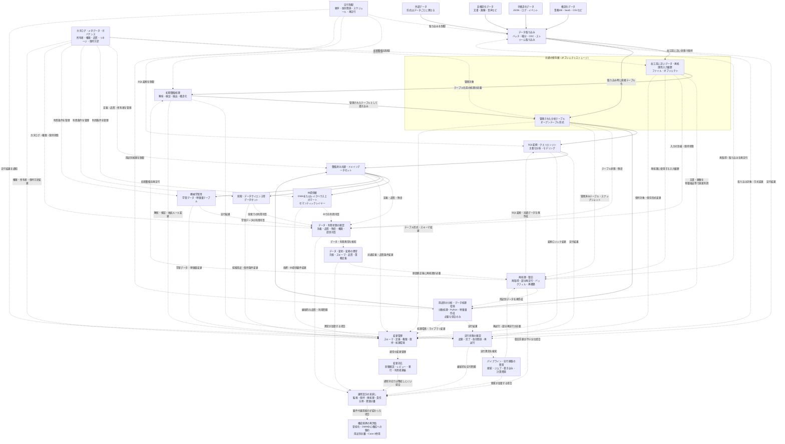

**図5-3：** Case 4における共通データ基盤の構成と運用確認箇所を論理的にモデル化した一例。構造化、半構造化、非構造化データを取り込み、加工前に近いデータまたは管理された分析テーブルとして保持する。必要に応じて初期整備、SQL変換、用途別処理を行い、整備済み共通・ドメインデータセットからBI、探索、データサイエンス、機械学習向けのデータを提供する。

この図は、特定の製品構成や実際の実行順序をそのまま表したものではなく、Case 4で確認すべきデータ経路、運用状態、障害対応、再処理、変更管理、構成見直しの関係を論理的にモデル化したものである。実際の構成では、採用する製品、処理方式、責任分界に応じて、複数の機能が一つのサービスへ統合される場合や、図中の処理順序・接続関係が異なる場合がある。

この図では、パイプラインや実行基盤が正常に動作したかを確認する「実行状態の確認」と、必要なデータが期待する形、品質、鮮度で利用可能になっているかを確認する「データ・利用状態の確認」を分けている。ジョブが成功していても、入力データの欠損、品質異常、権限不備、用途別データセットの更新遅延などによって、利用者が必要なデータを利用できない場合がある。

異常を検知した場合は、接続、ジョブ、書き込み、計算資源などのパイプライン・実行基盤の障害か、データ欠損、スキーマ変更、品質、業務定義などのデータ内容・データ契約・変換の異常かを切り分ける。前者では再試行や部分再実行を、後者では原因を修正したうえで再取得、バックフィル、テーブルの再構築などを行う。ただし、上流のスキーマ変更によって取り込みが停止する場合のように、一つの事象が両方へ影響することもある。

再処理では、加工前に近い入力履歴や管理された分析テーブルを利用し、障害箇所に応じて取り込み、初期整備、SQL変換、用途別データセットの作成の必要な範囲だけを再実行する。ただし、入力データが残っていても、当時のコード、設定、依存関係、実行環境が確認できなければ、同じ結果を再現できるとは限らない。

変更管理では、取り込み方式、保持対象、初期整備ルール、テーブルのスキーマや形式、共通定義、権限、処理環境、指標、特徴量などへの影響を確認する。通常の変更対応では吸収しにくい問題が続く場合は、監視、保持、再処理、責任分界、計算資源の分離などの運用設計を見直す。

さらに、要件や運用能力が大きく変化した場合は、現在の構成を維持することを前提にしない。BIとSQL中心の利用へ収束した場合はDWH中心構成への集約を、特定用途だけに専用処理が必要な場合は用途別の分離を、秒〜数分単位の反映が必要な場合はCase 3に近い低レイテンシ経路の併用を再評価する。

Case 4で重要なのは、レイクハウスや複数エンジンを維持すること自体ではない。多様なデータと複数ワークロードに対して、共通管理する範囲と分離する範囲を明確にし、その構成を組織が継続して運用できるかを確認することである。

次章では、4つのCaseを共通評価軸で比較し、どの条件が構成と運用の違いにつながったかを整理する。

---

## 6. 4つのCaseの横断比較

2章から5章では、異なる要件を想定した4つのCaseについて、組織条件、構成と設計判断、運用、トレードオフ、変更トリガーを個別に整理した。各Caseは、単純な構成から高度な構成へ進む成熟度の段階ではなく、利用目的、鮮度、データ特性、再処理要件、運用体制などの違いから分岐する参照例である。

本章では、まず4つのCaseを共通の評価軸で並べ、構成要素や必要な運用能力の違いを確認する。次に、どの条件が処理経路、管理方法、保存・処理基盤、復旧設計を変えたのかを横断的に整理する。最後に、データ保護、既存環境、責任分界、運用能力、予算など、要件から導いた構成の採用可能性と継続運用を左右する制約を扱う。

ここでの目的は、組織やデータ基盤を4つのCaseのいずれかへ固定的に分類することではない。要件と制約の組み合わせから、どの能力が必要となり、どの複雑性を受け入れるべきかを判断するための比較軸を得ることである。実際の構成では、複数のCaseに近い処理経路や管理方法を組み合わせる場合もある。

---

### 6.1 共通評価軸による比較

本節では、1.2で整理した6つの共通評価軸を用いて、各Caseの違いを横断的に比較する。ここで比較するのは、技術の高度さや組織の成熟度ではなく、それぞれの要件に対して、どのような処理方式、管理方法、運用能力が必要になったかである。

本節で比較するCaseは、次のとおりである。

- **Case 1：小規模・限定用途のマネージドサービス中心基盤**
- **Case 2：複数部門・複数ソースを扱う成長中のバッチ基盤**
- **Case 3：変更データキャプチャ（Change Data Capture: CDC）・イベントを扱う低レイテンシ基盤**
- **Case 4：多様なデータと複数ワークロードを扱う共通データ基盤**

#### 要件とデータ処理に関する比較

##### 目的と利用者

| Case | 目的と利用者 |
|---|---|
| Case 1 | 経営・業務担当者向けの限定された定型レポートや基本的なBIへデータを提供する |
| Case 2 | 複数部門の定型レポート、部門別分析、部門横断指標へ共通データを提供する |
| Case 3 | 確定した変更や業務イベントを、アプリケーション、アラート、運用処理、即時指標へ短い時間で届ける |
| Case 4 | BI、探索的分析、データサイエンス、機械学習など、性質の異なる複数ワークロードへ共通データを提供する |

**表6-1：** 目的と利用者による4つのCaseの比較。

##### データの特性

| Case | データの特性 |
|---|---|
| Case 1 | 少数のSaaS、業務データベース、ファイルから取得する、主に構造化データ |
| Case 2 | 複数のSaaS、アプリケーションデータベース、ファイルから取得する、主に構造化データ |
| Case 3 | データベースの変更、業務イベント、アプリケーションイベントなど、継続的に発生するデータ |
| Case 4 | 構造化、半構造化、非構造化データ、加工前に近いデータ、長期履歴 |

**表6-2：** データの特性による4つのCaseの比較。

##### 鮮度と処理方式

| Case | 鮮度と処理方式 |
|---|---|
| Case 1 | 日次または数回／日のバッチ処理を中心とし、フルリフレッシュまたは単純な増分処理を使う |
| Case 2 | 日次または数時間ごとのバッチ処理を中心とし、増分取り込み・増分変換を用いながら、処理間の依存関係を管理する |
| Case 3 | 秒〜数分単位の反映を目的とし、CDC、イベント連携、ストリーム処理、マイクロバッチなどを候補とする |
| Case 4 | データと利用目的ごとに、バッチ、増分処理、マイクロバッチ、CDC、ストリーム取り込みなどを使い分ける |

**表6-3：** 鮮度と処理方式による4つのCaseの比較。

#### 運用と継続性に関する比較

##### 信頼性と再処理

| Case | 信頼性と再処理 |
|---|---|
| Case 1 | 失敗を検知し、処理全体または分かりやすい範囲を再実行できることを重視する |
| Case 2 | 上流遅延、取り込み失敗、変換失敗、品質異常を区別し、部分再実行やバックフィルを管理する |
| Case 3 | 重複、遅延、順序入れ替わり、状態更新を考慮し、生イベントや変更履歴からリプレイできるようにする |
| Case 4 | 加工前に近いデータや履歴を保持し、使用したデータ範囲、スキーマ、変換条件を追跡して再処理・再作成できるようにする |

**表6-4：** 信頼性と再処理による4つのCaseの比較。

##### 組織体制と運用

| Case | 組織体制と運用 |
|---|---|
| Case 1 | 少人数または兼務担当者でも、処理の流れ、障害箇所、再実行手順を理解し、継続保守できることを重視する |
| Case 2 | データ担当者、部門側の所有者、外部支援などの間で、モデル、指標、障害対応、変更管理の責任を分ける |
| Case 3 | 上流システム、アプリケーション、データ基盤、下流利用先の担当者が、イベント定義、遅延、欠損、再処理、影響範囲を調整する |
| Case 4 | 基盤運用者、データ所有者、分析・機械学習の利用者が、品質、権限、履歴、再処理、ワークロード間の優先順位を調整する |

**表6-5：** 組織体制と運用による4つのCaseの比較。

##### ガバナンスとコスト

| Case | ガバナンスとコスト |
|---|---|
| Case 1 | 必要な範囲の権限、指標定義、運用ルールを持ち、構成要素と運用負荷を抑える |
| Case 2 | 部門横断の指標定義、権限、変更管理を整え、処理数や依存関係の増加に伴う運用コストを管理する |
| Case 3 | イベントの保持期間、監査、アクセス権限、常時稼働コスト、低レイテンシ化による運用負荷を管理する |
| Case 4 | メタデータ、権限、リネージ、保持・削除を共通管理し、保存、コンピュート、運用コストを評価する |

**表6-6：** ガバナンスとコストによる4つのCaseの比較。

#### 比較結果の整理

4つのCaseでは、同じ構成要素を利用する場合でも、利用目的、データの特性、鮮度、再処理要件、運用体制の違いによって、管理対象と必要な能力が異なる。表6-1から表6-6は、その違いを共通評価軸に沿って並べたものである。

次節では、これらの違いを各Caseの特徴として再説明するのではなく、処理経路、保存・処理基盤、再処理方法、運用体制を変化させた条件として整理する。

---

### 6.2 どの条件が構成を変えたか

6.1では、4つのCaseの差を6つの共通評価軸で並べた。本節では、その差をCaseごとに再説明するのではなく、データ量、更新頻度、ソース数、データ形式、利用者、再処理要件などの組み合わせが、処理経路、管理方法、保存・処理基盤、復旧設計をどのように変えたかを整理する。

#### 利用目的と鮮度が処理経路を変える

データをいつまでに更新する必要があるかは、処理方式を選ぶ主要な条件である。ただし、鮮度だけで処理経路が決まるわけではない。重要なのは、更新されたデータをどの利用者やシステムが利用し、遅延がどのような影響を与えるかである。

定型レポートやBIが主な利用先であり、日次または数時間ごとの更新で目的を満たせる場合は、一定範囲のデータをまとめて処理するバッチ中心の経路が候補になる。この場合は、処理の単純性、更新完了時刻、失敗時の再実行、利用者への安定した提供が重視される。

一方、確定した変更や業務イベントを、アプリケーション、アラート、運用処理へ秒〜数分単位で届ける必要がある場合は、処理間隔を短くするだけでは不十分になることがある。継続的な変更取得、イベント配送、状態更新、即時提供などを担う低レイテンシ経路が候補となり、採用する方式に応じて、重複、遅延、順序入れ替わり、キューの滞留なども管理対象となる。

同じ数分単位の鮮度要件でも、必要な処理は一律ではない。一定間隔で更新済みデータをまとめて反映できるなら、短い間隔のマイクロバッチで足りる場合がある。イベントごとに状態を更新し、到着順序や過去の状態を参照する必要があれば、状態を持つストリーム処理が候補になる。

したがって、処理方式は「鮮度を高くするほどストリーミングへ移行する」という段階ではなく、利用目的、許容遅延、処理単位、状態管理の必要性から選択する。

#### ソース、利用者、依存関係の増加が管理方法を変える

データソース、変換モデル、マート、利用者が増えても、直ちに保存基盤を変更する必要があるとは限らない。DWH中心の構成を維持したまま、実行制御、品質管理、変更管理を強化することで対応できる場合がある。

管理方法を変えるのは、単純な件数の増加だけではない。次のような条件が重なると、担当者の暗黙的な把握や単純な定期実行だけでは運用しにくくなる。

- ソースごとに取り込み完了時刻や失敗要因が異なる
- 変換モデル間の依存関係が増える
- 一部の失敗が複数のマートやレポートへ影響する
- 利用部門ごとに更新期限や重要度が異なる
- 指標やデータ定義の変更が複数の利用者へ影響する
- 障害時に処理全体ではなく、影響範囲だけを再実行する必要がある

このような条件では、取り込み完了の確認、依存関係に沿った実行、品質検査、鮮度監視、失敗通知、部分再実行、リネージ、変更手順を明示的に管理する必要が高まる。

また、利用者や関係者が増えるほど、技術的な依存関係だけでなく、責任分界も重要になる。誰がソースの意味を説明し、誰が変換モデルを保守し、誰が指標変更を承認し、障害時に誰が利用者へ影響を伝えるかを決める必要がある。

したがって、Case 1とCase 2に近い構成の差は、単に組織やデータの規模が異なることではなく、処理と責任の関係をどの程度明示的に管理する必要があるかに表れる。

#### データ形式、履歴、ワークロードが保存・処理基盤を変える

保存・処理基盤の選択には、データ形式だけでなく、加工前に近いデータや整備済みデータなど、どの状態のデータをどの期間保持し、どのような処理や利用へ提供するかが影響する。

主に構造化データを扱い、SQLによる変換、集計、定型レポート、BIが中心であれば、DWH中心構成で要件を満たしやすい。半構造化データが含まれていても、必要な項目をDWH上で管理し、主な処理をSQLで実行できるなら、直ちに別の保存基盤が必要になるわけではない。

一方で、次の条件が重なると、既存DWHの拡張、DWHとデータレイクの役割分担、レイクハウスなどを比較する理由が生じる。

- 構造化、半構造化、非構造化データを扱う
- 加工前に近いデータや長期履歴を保持する
- 過去のデータを異なる変換条件で再処理する
- BI、探索的分析、データサイエンス、機械学習へ共通データを提供する
- SQL以外の処理方式や専用ライブラリを必要とする
- 複数の保存・処理環境にまたがって権限、品質、履歴を管理する

ただし、非構造化データが存在することや、機械学習を利用することだけでは、レイクハウスを採用する十分な理由にはならない。対象データが限定され、既存DWHや用途別の保存・処理環境で要件を満たせる場合は、共通基盤へ統合しない方が単純なこともある。

保存・処理基盤を変える判断では、保存できるかどうかだけでなく、データの発見、意味の理解、アクセス制御、履歴管理、再処理、性能、利用者への提供を継続的に管理できるかを確認する必要がある。

#### 再処理要件が復旧設計を変える

再処理要件は、どのデータを保持し、どの単位で処理を分割し、どの実行状態を記録するかに影響する。

用途と処理範囲が限定されており、処理時間とコストが許容できる場合は、処理全体を再実行する方法や、テーブル全体を再作成する方法が分かりやすい。ソース、モデル、依存関係が増えると、失敗箇所や対象期間だけを再実行する部分再実行や、過去期間を再計算するバックフィルが重要になる。

イベントを継続的に処理する構成では、単にジョブを再実行するだけでは、元の状態を再現できない場合がある。生イベントや変更履歴、処理位置、保持している状態、重複排除や冪等性の設計を考慮し、どの地点から安全にリプレイできるかを決める必要がある。

複数ワークロードや長期履歴を扱う場合は、処理が成功したかだけでなく、どの入力データ、期間、スキーマ、変換ロジック、設定を用いて結果を作成したかを追跡し、必要に応じて再作成できることが重要になる。

これらは、単純な再実行から高度な再処理へ進む成熟度の段階ではない。必要な再処理方法は、障害や訂正の種類、保持している履歴、下流への影響、復旧期限によって異なる。

ただし、必要な復旧方式を組織が継続運用できるかどうかは、復旧方式そのものとは別に評価する必要がある。

#### 条件と設計判断の関係

以上の関係を単純化すると、次のように整理できる。

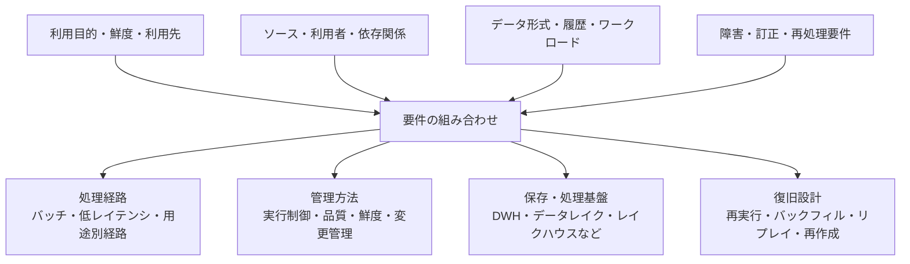

**図6-1：** パイプライン構成を変える主な条件と設計判断の関係。各設計判断は一つの条件だけで決まるものではなく、複数の要件を組み合わせて検討する。実際には、一つのパイプラインに複数の処理経路や保存・処理基盤が組み合わされる場合がある。

データ量は、処理時間、保存容量、再処理時間、性能、コストへ影響する重要な条件である。また、組織規模や関係者の数は、責任分界、変更管理、運用体制へ影響し得る。しかし、いずれも単独で、バッチ処理とストリーム処理、DWHとレイクハウス、単純な再実行とリプレイのどれを選ぶかを決める条件ではない。

また、各条件は相互に排他的ではなく、低レイテンシでイベントを処理しながら、その履歴を長期保存してBIや機械学習へ利用するように、複数の構成を組み合わせる場合もある。

したがって、4つのCaseは、組織や基盤を一つに分類するための区分ではない。要件の組み合わせが、どの設計判断と追加の複雑性を生むかを比較するための参照例である。

次節では、Case間の構成差を生む条件とは別に、セキュリティ、既存システム、コスト、運用体制など、構成の採用可能性と継続運用を左右する横断的制約を整理する。

---

### 6.3 すべてのCaseに影響する制約

6.2で整理した要件から必要な能力と構成を導いても、その構成をそのまま採用できるとは限らない。セキュリティ、データ所在地、既存環境、予算、運用人員などの制約によって、利用できるサービス、データの配置、導入方法、運用範囲が変わる。

これらは、Case 1からCase 4のいずれかだけに属する条件ではない。同じCaseに近い要件であっても、横断的制約が異なれば、実際に採用する製品、構成要素、責任分界、移行手順は異なる。

#### 横断的制約の全体像

| 制約群 | 主な確認事項 |
|---|---|
| データ保護と可用性 | セキュリティ、プライバシー、機密区分、監査、データ所在地、保持・削除、災害復旧、複数リージョン要件 |
| 既存環境と移行 | オンプレミス接続、既存DWH・データレイク・業務システム、ネットワーク、契約、移行期間、並行運用、切り戻し |
| 組織と運用 | データ所有者、責任分界、運用人員、スキル、障害対応、外部支援、ドキュメント、引継ぎ、保守可能性 |
| コストと技術依存 | 予算上限、ライセンス・クラウド利用料、総所有コスト、ベンダーロックイン、将来の移行・撤退費用 |

**表6-7：** 4つのCaseすべてに影響する主な横断的制約。

#### データ保護と可用性

データを保存・処理できる場所と方法は、セキュリティ、プライバシー、契約、データ所在地などの条件によって制限される場合がある。

例えば、特定のデータを指定された国やリージョンの外へ移動できない場合、利用可能なクラウドサービスやバックアップ先は限定される。オンプレミスからデータを外部へ送信できない場合や、機密区分によって利用できるサービスが異なる場合は、クラウド中心の構成をそのまま採用できないこともある。

また、共通基盤へデータを集約するほど、アクセス権限の誤設定や不要なデータ共有による影響範囲も広がり得る。データを一か所へ集約することと、すべての利用者へ公開することを区別し、利用者、役割、データ区分、利用目的に応じてアクセス範囲を定める必要がある。

保持期間と削除方針も、再処理や監査のために長期履歴を保持したいという要件だけでは決められない。利用目的を失ったデータ、削除要求の対象となるデータ、契約や規則によって保持期間が定められたデータは、それぞれの条件に従って管理する必要がある。

災害復旧や複数リージョン構成についても、常に最大限の冗長性を持たせるのではなく、停止による事業影響、許容できる復旧時間、データ損失の許容範囲、費用を踏まえて決める。

#### 既存環境と移行上の制約

本資料で示した構成例は、既存環境をすべて置き換えることを前提としていない。実際の構成選定では、すでに利用している業務システム、DWH、データレイク、BI、取り込みサービス、オーケストレーターなどとの接続や役割分担を確認する必要がある。

既存基盤が要件の一部を満たしている場合は、新しい構成へ全面移行するよりも、既存基盤を拡張する方が、移行リスクと運用負荷を抑えられる場合がある。一方で、既存基盤へ機能を追加し続けることで、構成が複雑になり、保守が難しくなる場合もある。

移行では、データを新しい保存先へコピーするだけでなく、次のような事項を確認する必要がある。

- 過去データをどこまで移行するか
- 既存処理と新しい処理をどの期間並行稼働させるか
- 新旧の出力結果をどのように比較するか
- 下流レポートやアプリケーションをどの順序で切り替えるか
- 問題が起きた場合にどこまで切り戻せるか
- 移行後に旧基盤をいつ廃止できるか

オンプレミス環境や外部SaaSとの接続では、ネットワーク、認証、通信量、API制限、接続可能な時間帯なども構成へ影響する。技術的に接続可能であっても、安定した運用と障害調査ができるかを含めて評価する必要がある。

#### データ所有と責任分界、運用能力、保守可能性

データパイプラインは、構築後も、監視、障害調査、再処理、権限変更、スキーマ変更、利用者からの問い合わせへ継続的に対応する必要がある。

そのため、採用する構成は、必要な機能を持つかだけでなく、組織が日常的に扱えるかという観点から評価する。少人数または兼務担当者が運用する場合は、構成要素を減らし、監視箇所、失敗時の確認手順、再実行方法を説明しやすくすることが重要になる。

複数のチームや外部支援が関与する場合は、少なくとも次の責任を明確にする必要がある。

- ソースデータの意味と品質を説明する
- 取り込み、変換、提供処理を保守する
- 指標やデータ定義の変更を承認する
- 権限と利用条件を管理する
- 障害時に影響範囲を確認し、復旧を判断する
- 利用者へ遅延、欠損、変更内容を伝える
- データの機密区分、利用目的、外部提供の可否を判断する
- 法令、契約、社内規程に基づく保持、削除、開示対応を判断する
- セキュリティやプライバシー上の問題を検知し、専門部門へ報告する

外部支援やマネージドサービスは、組織内に不足する能力や運用作業を補う手段になり得る。一方で、外部事業者がデータ、メタデータ、ログ、バックアップ、障害調査情報などを扱う可能性があるため、機密区分、利用目的、アクセス範囲、データ所在地、再委託、保持・削除、インシデント時の報告なども確認する必要がある。

技術的な運用作業を外部へ委託しても、どのデータを何の目的で利用するか、どの情報を外部へ共有できるか、どの品質基準やアクセス条件を設けるかといった判断まで、すべて外部へ移せるわけではない。法務、情報セキュリティ、プライバシー担当、業務部門、データ所有者、データ基盤担当者などを含めて、組織側と外部事業者の責任分界、承認経路、対応手順を定める必要がある。

また、運用が特定の担当者や外部事業者の知識だけに依存すると、障害対応や引継ぎが難しくなる。構成、依存関係、監視項目、復旧手順、所有者、変更手順を文書化し、組織内の担当者と外部支援の責任分界を含めて、継続保守できる状態を確認する必要がある。

#### 予算、総所有コスト、ベンダーロックイン

構成選定では、利用期間全体の総所有コスト（Total Cost of Ownership: TCO）だけでなく、初期費用、最低契約額、年度ごとの支出額も確認する必要がある。長期的には他の候補よりTCOが低くても、初年度や各年度の支出額が予算枠を超える場合は採用できない。

したがって、現時点および年度ごとに支出可能な予算と、導入から移行・廃止までのTCOは分けて評価する。

TCOには、ライセンス料やクラウド利用料だけでなく、導入、既存環境との接続、監視、障害対応、教育、ドキュメント、変更管理、アップグレード、外部支援、将来の移行などに必要な費用と労力が含まれる。

セルフマネージドな構成は、製品利用料を抑えられる場合がある一方、構築、監視、更新、障害対応を組織自身で担う必要がある。マネージドサービスは、これらの負担を減らせる可能性がある一方、利用料金や製品固有機能への依存が増える場合がある。

実際には二者択一ではなく、取り込み、保存、変換、実行制御、監視など、どの範囲をマネージドサービスへ任せるかを分けて判断できる。表面上の価格だけでなく、組織に残る作業と責任を含めて比較する必要がある。

ベンダーロックインも、単純に避けるべき制約ではない。特定の製品やクラウドへ依存することで、導入速度、統合機能、運用効率、サポートを得られる場合がある。

重要なのは、次の点を把握したうえで依存を受け入れることである。

- どのデータ形式、API、コード、メタデータ、運用手順が製品固有になるか
- 依存によって、どの運用負荷や開発負荷を削減できるか
- サービス障害や契約変更が起きた場合に、どの範囲が影響を受けるか
- 将来、別の製品や構成へ移行するときに、どの程度の費用と期間が必要になるか
- 移行や撤退に必要なデータ、スキーマ、変換ロジック、メタデータを、どの形式で保持・出力できるか

#### 横断的制約を踏まえた構成判断

横断的制約は、要件から導いた構成を後から確認するための付加的なチェック項目ではない。構成候補を比較する初期段階から確認しなければ、技術的には成立しても、導入できない、または継続運用できない構成を選ぶ可能性がある。

同じ要件に対しても、法令・契約・社内規程、既存環境、予算、運用体制が異なれば、異なる構成が妥当になり得る。すべての要件へ一度に対応することが現実的でない場合は、対象データ、利用者、鮮度、ワークロードを限定し、優先度の高い経路から段階的に導入する方法もある。

また、制約を満たすために構成要素を追加すると、別の運用負荷やコストが生じる場合がある。例えば、複数リージョン化は可用性を高める一方で、データ同期、整合性、監視、費用管理の複雑性を高める。既存基盤との並行運用は移行リスクを抑える一方で、二重運用と結果照合の負担を生む。

したがって、構成選定では、要件を満たす能力だけでなく、制約を満たすために追加される複雑性と、それを組織が継続的に負担できるかを評価する必要がある。4つのCaseは、その判断に利用する比較対象であり、横断的制約を無視してそのまま適用する構成テンプレートではない。

---

## 7. まとめ

### 7.1 調査の出発点と得られた結論

本資料は、個人ポートフォリオで得られた実行時間の差という観察をきっかけに、データ規模がDWHの構成選定にどのような影響を与えるのかという疑問から出発した。調査を進める中で、保存・処理基盤の選定だけでは説明できない条件が多いことが分かり、対象を、取り込み、保存、変換、提供、監視、再処理を含むデータパイプライン全体へ広げた。

実際に、データ規模は、処理時間、保存容量、性能、コスト、増分処理の必要性、再処理に要する時間と方法へ重要な影響を与える。データ量や増加率が変われば、フルリフレッシュを継続できるか、どの単位で処理を分割するか、どの程度の保存容量や処理資源が必要かも変化する。

一方、4つのCaseを横断して比較すると、データ規模は、パイプライン構成を単独で決める支配的な分岐条件ではなかった。利用目的と利用先、求められる鮮度、ソースとデータ形式、保持する履歴、処理間の依存関係、信頼性・再処理要件、ワークロード、組織の運用能力などが組み合わさることで、必要な処理経路、管理方法、保存・処理基盤、復旧設計が変化していた。

したがって、データ規模は構成選定から切り離してよい条件ではないが、それだけを起点にアーキテクチャを決めることもできない。まず、利用目的、利用者、利用先、許容できる遅延、信頼性要件、横断的制約を確認し、そのうえで、性能、保存、コスト、再処理へ与える規模の影響を具体的に評価する必要がある。

### 7.2 4つのCaseの選定理由と位置づけ

本資料で4つのCaseを設定したのは、データパイプラインの構成を網羅的に分類するためではなく、利用目的や要件の違いによって設計判断が変わる代表例を比較するためである。

具体的には、次の4つを取り上げた。

- 限られた用途を少人数で運用する、マネージドサービス中心の構成
- 複数部門・複数ソースを扱い、依存関係や変更を管理するバッチ基盤
- 変更データや業務イベントを低レイテンシで届ける構成
- 多様なデータと複数ワークロードを共通管理する構成

これらを比較することで、利用目的、鮮度、ソース、データ形式、履歴、依存関係、再処理要件、運用体制などの違いが、処理経路、管理方法、保存・処理基盤、復旧設計をどのように変えるかを確認した。

この4つは、考えられる構成を網羅的に分類するものでも、企業規模、業種、技術水準に応じた成熟度や発展段階を表すものでもない。比較する論点を広げすぎず、主要な要件の違いを確認できる範囲に絞った参照例である。

バッチ処理やDWH中心の構成は、ストリーム処理やレイクハウスより未成熟なのではなく、異なる利用目的と要件に対する選択肢である。技術的に高度な機能を追加すること自体が目的ではなく、必要のない複雑性を追加せず、目的に適した範囲へ構成を限定することも重要な設計判断となる。

また、組織全体が一つのCaseに対応するとは限らない。同じ組織でも、定型分析にはバッチ中心の経路、即時通知には低レイテンシ経路、多様なデータを利用する分析や機械学習には別の保存・処理基盤を利用するなど、目的ごとに複数の構成を組み合わせる場合がある。

### 7.3 構成判断で重視すること

要件から必要な構成を導けても、その構成をそのまま採用し、継続運用できるとは限らない。データ保護、可用性、既存環境、移行条件、責任分界、運用人員、予算、総所有コスト、ベンダーロックインなどの横断的制約によって、採用できるサービス、構成要素、導入範囲は変わる。

外部支援やマネージドサービスによって、不足する能力や運用作業を補うことはできる。一方で、利用目的、機密区分、外部共有の可否、品質基準、アクセス条件など、組織側に残る判断もある。外部事業者がデータ、メタデータ、ログ、バックアップ、障害調査情報などを扱う場合は、アクセス範囲、データ所在地、再委託、保持・削除、インシデント時の報告を含めて責任分界を定める必要がある。

したがって、構成選定では、必要な機能を備えているかだけでなく、誰が判断し、誰が運用し、障害や変更へどのように対応するかを説明できる必要がある。構成、依存関係、監視項目、復旧手順、所有者、変更手順を文書化し、引継ぎを含めて継続保守できる状態を確認することが重要である。

以上を踏まえると、構成選定では、次の流れを基本としつつ、要件、制約、構成候補を反復的に確認する必要がある。

1. 事業目的、利用者、利用先、許容できる遅延を確認する
2. ソース、データ形式、履歴、依存関係、信頼性・再処理要件を整理する
3. データ保護、既存環境、運用能力、予算などの横断的制約を確認する
4. 必要な能力と、意図的に追加しない複雑性を明確にする
5. 不確実性の高い部分を小規模な概念実証や垂直スライスで検証する
6. 要件や制約の変化を継続的に確認し、変更トリガーに応じて構成を見直す

これらは一方向に完了する手順ではない。制約や検証結果によって、利用目的、対象範囲、鮮度、必要な能力を見直しながら構成候補を絞り込む。

すべての要件へ一度に対応することが現実的でない場合は、対象データ、利用者、鮮度、ワークロードを限定し、優先度の高い経路から段階的に導入する方法もある。ただし、段階導入によって並行運用や結果照合が必要になれば、それ自体が追加の運用負荷となるため、移行後の終了条件もあわせて決める必要がある。

各組織にとって適切なデータパイプラインは、固定された製品構成や、最も多くの機能を備えた構成ではない。現在の目的と制約を満たし、必要な信頼性と再処理能力を備え、組織が説明・運用・変更できる構成である。

4つのCaseは、この判断を支援するための参照例である。構成の高度さではなく、目的への適合性、保守可能性、説明可能性、将来の変化へ段階的に対応できることを基準として設計を判断する必要がある。

---

## おわりに

本資料で整理した4つのCaseは、あらゆる組織へそのまま適用できる標準構成や、完成した分類体系ではない。

個人ポートフォリオで観察した実行時間の差を出発点として、公開情報や実務事例を参照しながら、利用目的、鮮度、データ形式、履歴、依存関係、再処理要件、運用体制などが、データパイプラインの構成判断をどのように変えるかを整理したものである。4つのCaseは、組織を分類するためではなく、要件から必要な能力を考え、追加する複雑性と得られる価値を比較するための参照例である。

実際に適切な構成は、対象となる事業やデータだけでなく、既存環境、データ保護上の条件、予算、責任分界、組織が継続的に保守できる範囲によって異なる。本資料自体も、実データ、実組織、長期運用の中で得られる知見によって検証・更新されるべき整理であり、新しい要件や事例に応じて見直す必要がある。

本資料が、データ量や製品名だけを起点として構成を選ぶのではなく、何を、誰に、いつまでに届けるのか、障害や訂正が起きたときにどのように復旧するのか、誰が判断し継続運用するのかを整理し、目的と制約に適したデータパイプラインを考えるための材料になればよいと思う。
